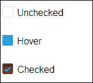
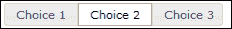
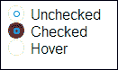
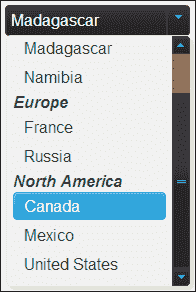
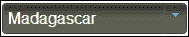
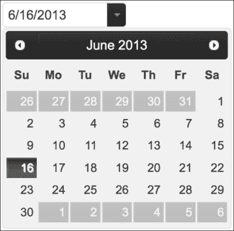
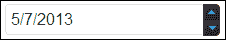
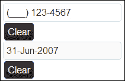

# 第三章。表单组件

Wijmo 表单装饰器小部件为单选按钮、复选框、下拉列表和文本框元素提供了跨所有平台的统一视觉风格。有单独的库用于装饰下拉列表和其他表单元素，但 Wijmo 为它们提供了一个统一的主题。jQuery UI 缺乏表单装饰器，将表单组件的样式留给了设计师。使用 Wijmo 表单组件可以在开发过程中节省时间，并在所有浏览器中提供一致的界面。要使用这些具有自定义样式的表单组件，请参阅第八章 扩展 Wijmo。

# 复选框

复选框小部件是 Wijmo 提供的样式增强的绝佳例子，它优于默认表单控件。当允许选择多个选项时使用复选框。以下截图显示了不同的复选框状态：



Wijmo 为复选框添加了圆角、渐变和悬停高亮效果。此外，尺寸的增加使其更易于使用。Wijmo 复选框可以被初始化为选中状态。用于此目的的代码如下：

```js
<!DOCTYPE HTML>
<html>
<head>
  ...
  <script id="scriptInit" type="text/javascript">
    $(document).ready(function () {
      $("#checkbox3").wijcheckbox({checked: true});
      $(":input[type='checkbox']:not(:checked)").wijcheckbox();
    });
  </script>
<style>
div {
  display: block; margin-top: 2em;
  }
</style>
</head>
<body>
  <div><input type='checkbox' id='checkbox1' /><label for='checkbox1'>Unchecked</label></div>
  <div><input type='checkbox' id='checkbox2' /><label for='checkbox2'>Hover</label></div>
  <div><input type='checkbox' id='checkbox3' /><label for='checkbox3'>Checked</label></div>
</body>
</html>.
```

在这种情况下，`checkbox3` 在初始化时被设置为 **选中**。

### 注意

如果一个复选框初始化了两次，您将不会得到相同的结果。在这里，我们通过在将 `checkbox3` 设置为 **选中** 后选择未选中的复选框来避免这种情况。

# 单选按钮

与复选框相比，单选按钮只允许选择多个选项中的一个。此外，它们通过 HTML 标记进行自定义，而不是通过 JavaScript API。例如，通过 `checked` 属性设置选中选项：

```js
<input type="radio" checked />
```

jQuery UI 提供了一个单选按钮小部件，如以下截图所示，根据我的经验，这会让用户产生混淆，因为他们认为可以选择多个选项：



Wijmo 单选按钮在外观上与常规单选按钮相似，这样用户就会期望相同的行为，如下面的截图所示：



Wijmo 单选按钮通过在单选按钮元素上调用 `wijradiomethod` 方法进行初始化：

```js
<!DOCTYPE html>
<html>
<head>
  ...
  <script id="scriptInit" type="text/javascript">$(document).ready(function () {
      $(":input[type='radio']").wijradio({
        changed: function (e, data) {
          if (data.checked) {
            alert($(this).attr('id') + ' is checked')
          }
        }
    });
  });
</script>
</head>
<body>
  <div id="radio">
  <input type="radio" id="radio1" name="radio"/><label for="radio1">Choice 1</label>
  <input type="radio" id="radio2" name="radio" checked="checked"/><label for="radio2">Choice 2</label>
  <input type="radio" id="radio3" name="radio"/><label for="radio3">Choice 3</label>
  </div>
</body>
</html>
```

在此示例中，`changed` 选项（复选框也有此选项）被设置为一个处理程序。处理程序将一个 `jQuery.Event` 对象作为第一个参数传递。它只是一个针对浏览器一致性进行规范化的 JavaScript 事件对象。第二个参数暴露了小部件的状态。对于复选框和单选按钮，它是一个仅包含 `checked` 属性的对象。

# 下拉列表

在所有浏览器中保持下拉菜单样式的一致性是非常困难的。Wijmo 提供了两种样式 HTML `select` 和 `option` 元素的方法。当没有选项组时，`ComboBox` 是更好的小部件。这将在下一节中介绍。对于具有嵌套在选项组下的选项的下拉菜单，只有 `wijdropdown` 小部件才能工作。例如，考虑一个按大陆分类的国家选择器：

```js
<!DOCTYPE HTML>
<html>
<head>
  ...
  <script id="scriptInit" type="text/javascript">
    $(document).ready(function () {
    $('select[name=country]').wijdropdown();
      $('#reset').button().click(function(){
        $('select[name=country]').wijdropdown('destroy')
        });
      $('#refresh').button().click(function(){
        $('select[name=country]').wijdropdown('refresh')
      })
    });
  </script>
</head>
<body>
  <button id="reset">
    Reset
  </button>
  <button id="refresh">
    Refresh
  </button>
  <select name="country" style="width:170px">
    <optgroup label="Africa">
    <option value="gam">Gambia</option>
    <option value="mad">Madagascar</option>
    <option value="nam">Namibia</option>
    </optgroup>
    <optgroup label="Europe">
    <option value="fra">France</option>
    <option value="rus">Russia</option>
    </optgroup>
    <optgroup label="North America">
    <option value="can">Canada</option>
    <option value="mex">Mexico</option>
    <option selected="selected" value="usa">United States</option>
    </optgroup>
  </select>
</body>
</html>
```

将 `select` 元素的宽度设置为 170 像素，以便在下拉菜单初始化时，下拉菜单和项目都具有 170 像素的宽度。这允许 **北美** 选项类别在单行中显示，如下面的截图所示。尽管下拉小部件没有 `width` 选项，但在初始化时它会采用 `select` 元素的宽度。要初始化下拉菜单，请在 `select` 元素上调用 `wijdropdown` 方法：

```js
$('select[name=country]').wijdropdown();
```

当菜单切换时，下拉元素使用盲动画来显示项目。



此外，它还将与按钮相同的点击动画应用到滑块和菜单：



为了将下拉菜单重置为选择框，我添加了一个调用 `destroy` 方法的重置按钮。如果你有动态更改下拉菜单样式的 JavaScript 代码，`refresh` 方法将再次应用 Wijmo 样式。

# ComboBox

Wijmo ComboBox 在 `select` 和 `option` 元素上工作。选项可以通过 HTML 标记或 JavaScript 对象表示法 (JSON) 加载。在我们的示例中，我们通过使用标记来加载菜单项：

```js
<!DOCTYPE HTML>
<html>
<head>
  ...

  <script id="scriptInit" type="text/javascript">
    $(document).ready(function () {
      $("#states").wijcombobox({
        dropdownHeight: 150,
        dropdownWidth: 200,
        showingAnimation: { effect: "clip" },
        hidingAnimation: { effect: "fade" }
      });
      $("#states").bind("wijcomboboxselectedindexchanged", function(e, data) {
      $('#message').text('You moved from ' + data.oldItem.label + ' to ' + data.selectedItem.label + '.');
      } )
    });
  </script>
</head>
<body>
  <p><label id="output">Where do you live? (type to autocomplete)</label></p>
  <div>
    <select id="states">
    <option value="AL">Alabama</option>
      ...
    <option value="WY">Wyoming</option>
    </select>
  </div>
  <p id="message"></p>
</body>
</html>
```

`showingAnimation` 方法指定了当选项变为可见时使用的动画。所有 jQuery UI 效果都可以使用，你可以在 jQuery UI 效果演示页面上尝试它们：[`jqueryui.com/effect/`](http://jqueryui.com/effect/). 对于 `hidingAnimation` 方法，我使用了淡入淡出效果，逐渐将不透明度降低到 0。我们绑定到 `wijcomboboxselectedindexchanged` 事件类型，该事件在 ComboBox 的选中索引改变时触发，用于显示涉及旧项和新项的消息。

# InputDate

InputDate 小部件提供了一个方便的视觉机制，帮助用户选择日期。这个小部件支持广泛的日期格式，使用户选择日期并提供信息的方式更加一致。InputDate 小部件仅在 `input` 元素上工作。要显示没有 `input` 元素的日历，请使用日历小部件，其外观如下面的截图所示：



要显示一个带有触发日历的按钮的 InputDate 小部件，请将 `input` 元素包裹在一个固定宽度的块中，使用 `showTrigger` 选项初始化小部件，并移除 `wijmo-wijinput-trigger` 类：

```js
<!DOCTYPE HTML>
<html>
<head>
  <title>InputDate Example</title>
  ...
$(document).ready(function () {
  $("#calendarInput").wijinputdate({showTrigger: true});

});
</script>
  <style>
    .date {
      width: 200px;
    }
</style>
</head>
<body>
  <div class="date"><input type="text" id="calendarInput" /></div>
</body>
</html>.
```

类似地，显示一个带有用于增加或减少日、月和年字段的旋转按钮的输入日期，需要额外的配置。虽然`input`字段仍然接受在日期格式内有效的按键，但旋转按钮提供了另一种选择。点击一次旋转按钮将所选日期段的价值增加或减少一个。按住点击将逐渐加速日期段变化的速度。自己试一试，感受一下视觉效果：



```js
<!DOCTYPE HTML>
<html>
<head>
  ...
  <script id="scriptInit" type="text/javascript">
    $(document).ready(function () {
      $spinnerInput = $("#spinnerInput");
      $spinnerInput.wijinputdate({showSpinner: true, dateFormat: 'g', activeField: 3});
    });
  </script>
</head>
<body>
  <div class="date"><input type="text" id="spinnerInput" /></div>
</body>
</html>
```

当处理日期输入字段时，最重要的部分是将日期发送到服务器。Wijmo 根据您的服务器设置和它接受的日期格式提供各种`dateFormat`选项。特别是，如果您的服务器接受短日期（mm/dd/yyyy）和短时间（hh:mmtt）格式，那么通用的日期格式`g`将适用于您。只需将`dateFormat`选项设置为`g`来初始化 InputDate 小部件。在先前的示例中，它将是：

```js
$spinnerInput.wijinputdate({showSpinner: true, dateFormat: 'g'});
```

### 小贴士

要从输入中获取日期，请调用`getText`方法：

```js
$spinnerInput.wijinputdate("getText")
```

该函数返回输入框中显示的文本。

`wijinput`格式字符串遵循与 Java 的`SimpleDateFormat`类相同的约定，除了 AM/PM 指示符。以下表格总结了格式化选项：

| 字母 | 日期或时间组件 | 示例 | 输出 |
| --- | --- | --- | --- |
| `y` | 年 | yyyy; yy | 1996; 96 |
| `M` | 年中的月份 | MMMM;MMM;MM | July;Jul;07 |
| `d` | 月份中的日 | dd | 10 |
| `H` | 天中的小时（0-23） | H | 0 |
| `h` | 上午/下午的小时（1-12） | hh | 12 |
| `m` | 小时中的分钟 | mm | 30 |
| `s` | 分钟中的秒 | ss | 55 |
| `t` | 上午/下午 | tt | AM |

例如，如果`dateFormat`设置为`MMM-dd-yyyy`，你可以在字段中看到类似`Jul-14-2013`的日期。

# 输入掩码

输入掩码小部件向用户显示输入框的正确格式。此外，它防止无效输入并提供关于所需数据的视觉提示。以下是一个示例：



输入格式由掩码指定。有关选项的列表，请参阅[`wijmo.com/wiki/index.php/InputMask`](http://wijmo.com/wiki/index.php/InputMask)。对于我们的示例，我们为美国电话号码创建了一个输入掩码，其中区号是可选的。这些可选字符可以留空：

```js
<!DOCTYPE HTML>
<html>
<head>
  ...
  <script id="scriptInit" type="text/javascript">
    $(document).ready(function () {
      $("#textbox1").wijinputmask({
        mask: '(999) 000 - 0000'
      });
    });
  </script>
</head>
<body>
  <input type="text" id="textbox1" />
</body>
</html>
```

掩码元素`9`表示可选数字，而`0`表示必需数字。如破折号和括号之类的文字按掩码中的显示方式显示。默认情况下，无效输入不会显示在输入元素中。为了在输入无效时给用户反馈，我们添加一个错误 CSS 类，该类在此类输入上触发：

```js
<!DOCTYPE HTML>
<html>
<head>
  ...
  <script id="scriptInit" type="text/javascript">
    $(document).ready(function () {
      $("#phoneNumber").wijinputmask({
        mask: '(999) 000-0000',
        resetOnSpace: true,
        invalidInput: function () {
          $("#phoneNumber").addClass('error')
        },
        textChanged: function () {
          $("#phoneNumber").removeClass('error')
        }
      });
    });
  </script>
<style>
  .error {
    border:1px solid red;
  }
  .mask {
  width: 130px;
  }
</style>
</head>
<body>
  <div class="mask"><input type="text" id="phoneNumber" /> </div>
</body>
</html>
```

当文本改变时，我们移除`error`类。在无效输入时，我们再次添加该类。另一个有用的输入掩码是显示在以下截图中的日期、月份缩写和年格式：


这可以通过输入掩码 `00->L<LL-0000` 来完成，其中 `>L` 表示从 A 到 Z 的一个大写字母，`<LL` 表示从 a 到 z 的两个小写字母。要为每个字段添加一个 `clear` 按钮，请调用 jQuery UI 按钮函数并在其上注册点击事件。由于清除按钮放置在输入旁边，我们在其兄弟输入元素上调用 `setText` 方法。

```js
<!DOCTYPE HTML>
<html>
<head>
  ...
  <script id="scriptInit" type="text/javascript">
    $(document).ready(function () {
      $("#phoneNumber").wijinputmask({
        mask: '(999) 000-0000',
        resetOnSpace: true,
        invalidInput: function () {
          $("#phoneNumber").addClass('error')
        },
      textChanged: function () {
        $("#phoneNumber").removeClass('error')
      }
    });
      $("#date").wijinputmask({
        mask: '00->L<LL-0000',
        resetOnSpace: true
      });
      $("button").button().click(function () {
        $(this).siblings().find("input").wijinputmask("setText", "");
      })
    });
  </script>
<style>
  .error {
    border:1px solid red;
  }
  .mask {
     width: 130px;
  }
  .ui-button-text-only .ui-button-text {
    padding: 3px 5px;
  }
</style>
</head>
<body>
  <div class="mask"><input type="text" id="phoneNumber" /><button class="reset">Clear</button></div>
  <div class="mask"><input type="text" id="date" /><button class="reset">Clear</button></div>
</body>
</html>
```

注意，我们还覆盖了按钮填充的 CSS，以便按钮与输入框大小相同。在每个字段旁边都有一个 `reset` 按钮，如果用户在某个字段上出错，他们就不需要再次填写表单。

# 摘要

在本章中，我们学习了 Wijmo 的表单组件。复选框用于可以选择多个项目的情况。Wijmo 的复选框小部件在默认复选框的基础上增加了样式增强。单选按钮用于只选择一个项目的情况。虽然 jQuery UI 只支持单选按钮上的按钮组，但 Wijmo 的单选按钮要直观得多。Wijmo 的下拉小部件应该只在存在嵌套或分类的 `<select>` 选项时使用。当选项的结构是扁平的时，ComboBox 带有更多功能。InputDate 用于显示日期选择日历小部件，而 InputMask 的目的是为用户提供正确的输入格式的提示。

现在你已经学习了 Wijmo 中的表单组件，在进入下一章之前，先尝试自己构建一个表单。尝试制作一个嵌套表单，其中在单选组中选择一个选项会显示或隐藏字段。
