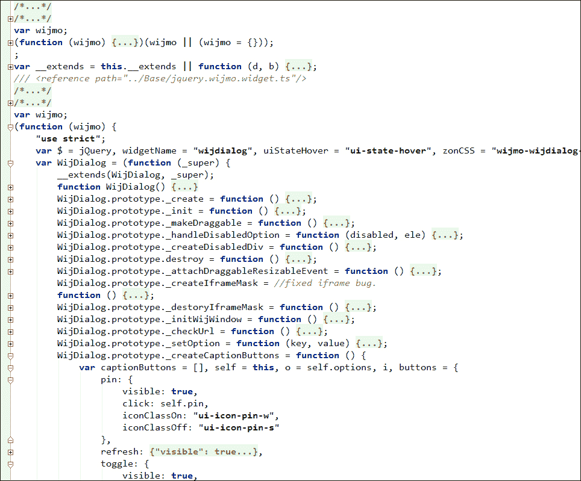
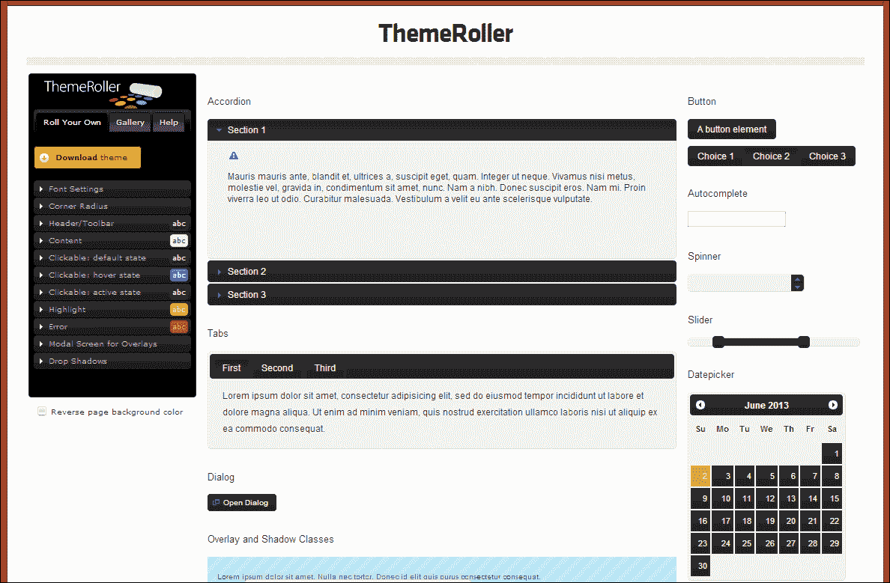

# 第八章。扩展 Wijmo

在本章中，我向您展示如何修改 Wijmo 的小部件和 CSS 样式以适应主题。您将学习如何在不覆盖现有按钮的情况下向对话框小部件添加按钮。然后，我介绍了一种修改现有 Wijmo 主题的简单方法。

# 扩展 Wijmo Open

Wijmo Open 是一套开源的 jQuery UI 小部件。Wijmo 小部件，如滑块、对话框或手风琴，是 jQuery UI 小部件的扩展。其他，如 Wijmo 的菜单或下拉菜单，是新的小部件。

## 修改对话框小部件

在 第二章 *对话框小部件* 中，我向您展示了如何在不更改内部结构的情况下向对话框小部件添加自定义按钮。API 很难使用，因为您必须覆盖默认按钮的图标和行为。现在，我将向您展示如何通过扩展 API 添加一个自定义按钮。首先，打开 `jquery.wijmo-open.all.js` 并将其重命名为 `jquery.wijmo-open.all.extended.js`。

当您在编辑器中打开 `jquery.wijmo-open.all.extended.js` 时，使用代码折叠来折叠所有代码并搜索 `wijdialog`。在展开 `varWijDialog` 这一行后，您将得到如下截图所示的视图：



所有的 Wijmo Open 小部件都以 `"use strict"` 开头。这启用了 ECMAScript 5 的严格语义，并允许在支持它的浏览器上更快地运行代码。让我们看看以 `WijDialog.prototype` 开头的那些行。所有以下划线开头的函数都是私有的，而其他的则可以通过 API 访问并已文档化。在 `_createCaptionButtons` 函数下，有一个包含标题栏上所有按钮的 `button` 对象。要向对话框标题栏添加一个 `hint` 按钮，我们使用与其他按钮相同的格式：

```js
varcaptionButtons = [], self = this, o = self.options, i, buttons = {
  pin: {
    visible: true,
    click: self.pin,
    iconClassOn: "ui-icon-pin-w",
    iconClassOff: "ui-icon-pin-s"
  },
  refresh: {
    visible: true,
    click: self.refresh,
    iconClassOn: "ui-icon-refresh"
  },
  toggle: {
    visible: true,
    click: self.toggle,
    iconClassOn: "ui-icon-carat-1-n",
    iconClassOff: "ui-icon-carat-1-s"
  },
 hint: {
 visible: true,
 click: self.hint,
 message: "",
 iconClassOn: "ui-icon-lightbulb"
 },
  minimize: {
    visible: true,
    click: self.minimize,
    iconClassOn: "ui-icon-minus"
  },
  maximize: {
    visible: true,
    click: self.maximize,
    iconClassOn: "ui-icon-extlink"
  },
  close: {
    visible: true,
    click: self.close,
    iconClassOn: "ui-icon-close"
  }
}
```

### 提示

`"use strict"` 可能会导致您的代码出现意外行为。您可能想使用 JSHint ([`www.jshint.com/`](http://www.jshint.com/)) 这样的工具进行检查，或者完全移除严格模式。

按钮的点击事件使用 `click` 选项指定。对于提示按钮，使用 `self.hint`。因此，我们将 `hint` 函数作为 `WijDialog` 方法编写：

```js
WijDialog.prototype.hint = function () {
  var self = this, o = self.options;
  alert(o.message);
};
```

在此函数中，选项从 `self.options` 中读取，并在选项中设置的字符串消息用于警告框中。要使用新的提示按钮 API，我们只需设置消息选项：

```js
$('#dialog').wijdialog({message: 'Success! You just added a title bar button.'});
```

一定要将 `jquery.wijmo-open.all.js` 脚本的引用更改为 `jquery.wijmo-open.all.extended.js`。

## 使用 ThemeRoller 修改 Wijmo 主题

要修改现有的 Wijmo 主题，请打开我们项目结构中 `lib` 文件夹下的 `jquery-wijmo.css` 文件。您可以在您的 Wijmo 下载中的 `Themes` 文件夹下找到更多主题。一旦打开 CSS 文件，搜索 `jQuery UI CSS Framework`。应该有一个如下所示的注释部分：

```js
/*
 * jQuery UI CSS Framework 1.8.7
 *
 * Copyright 2010, AUTHORS.txt (http://jqueryui.com/about)
 * Dual licensed under the MIT or GPL Version 2 licenses.
 * http://jquery.org/license
 *
 * http://docs.jquery.com/UI/Theming/API
 *
 * To view and modify this theme, visit http://jqueryui.com/themeroller/?ffDefault=...
 */
```

当你在浏览器中访问链接时，ThemeRoller 会加载 Wijmo 主题。主题设置可以在左侧的 **Roll Your Own** 选项卡下进行修改。以下截图显示了 ThemeRoller 中加载的 Rocket 主题：



有关如何修改主题的详细信息，请参阅 [`wijmo.com/wiki/index.php/Wijmo_Loves_ThemeRoller:_An_Overview`](http://wijmo.com/wiki/index.php/Wijmo_Loves_ThemeRoller:_An_Overview)。

# 摘要

现在你已经对如何在 Wijmo 中更改事物有了概念，你将更有能力在你的项目中使用 Wijmo。通常，情况需要更改主题或小部件的行为。Wijmo 使得这些更改变得简单易行。
