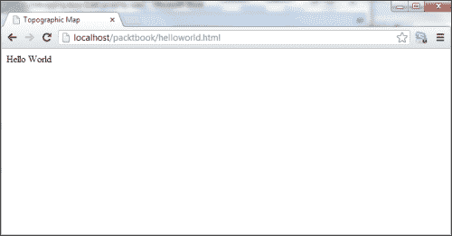
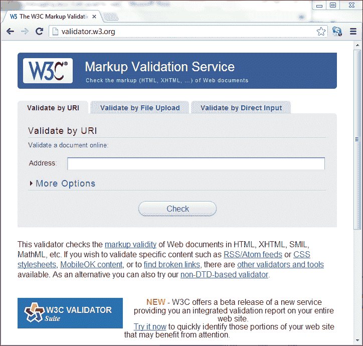
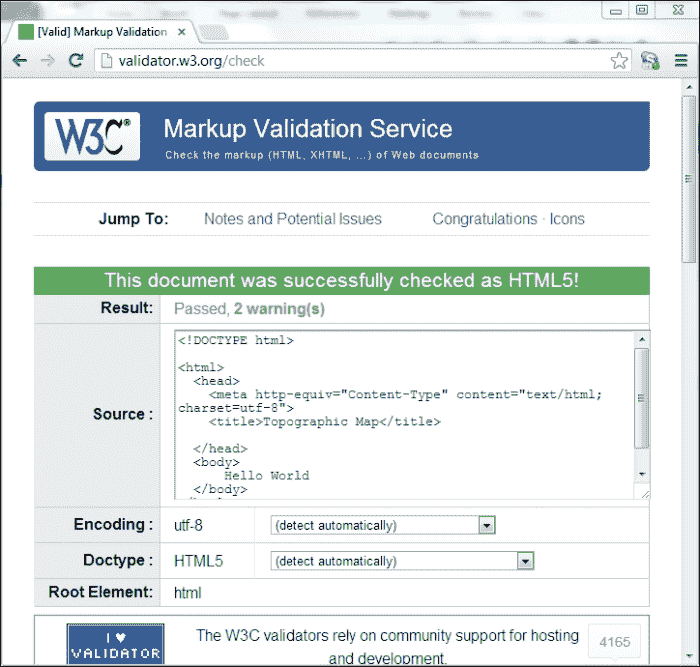
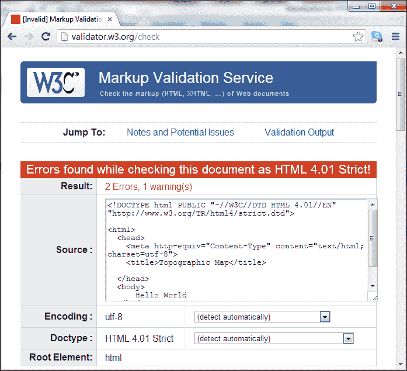
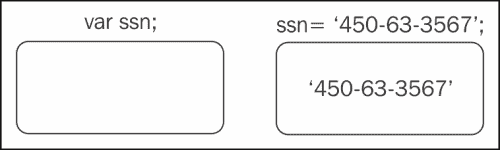
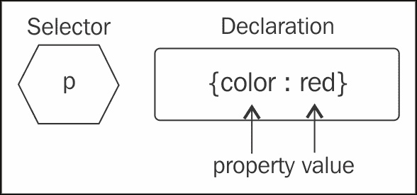
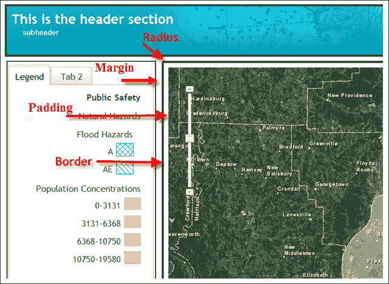
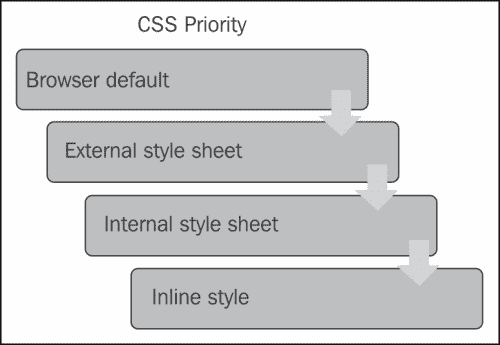
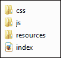

# 第一章：HTML、CSS 和 JavaScript 简介

在开始使用 ArcGIS API for JavaScript 开发 GIS 应用程序之前，您需要了解某些基本概念。对于那些已经熟悉 HTML、JavaScript 和 CSS 的人，您可能希望跳到下一章。但是，如果您对这些概念中的任何一个都不熟悉，请继续阅读。我们将以非常基本的水平来介绍这些主题，仅仅足够让您开始。关于这些主题的更高级的教程资源有很多，包括书籍和在线教程。您可以参考附录，*使用 ArcGIS 模板和 Dojo 设计应用程序*，获取更全面的资源列表。

在本章中，我们将涵盖以下主题：

+   基本 HTML 页面概念

+   JavaScript 基础知识

+   基本 CSS 原则

# 基本 HTML 页面概念

在我们深入讨论创建地图和添加信息层的细节之前，您需要了解在使用 ArcGIS API for JavaScript 开发应用程序时代码将放置的上下文。您编写的代码将放置在 HTML 页面或 JavaScript 文件中。HTML 文件通常具有`.html`或`.htm`文件扩展名，JavaScript 文件具有`.js`扩展名。创建基本 HTML 页面后，您可以按照使用 ArcGIS API for JavaScript 创建基本地图所需的步骤进行操作。

网页的核心是一个 HTML 文件。编写这个基本文件非常重要，因为它构成了您的应用程序的基础。在基本 HTML 编码中犯的错误可能会导致问题，当您的 JavaScript 代码尝试访问这些 HTML 标签时会出现问题。

以下是一个非常简单的 HTML 页面的代码示例。这个示例是一个 HTML 页面可以变得多么简单。它只包含了主要的 HTML 标签`<DOCTYPE>`，`<html>`，`<head>`，`<title>`和`<body>`。使用您喜欢的文本或网络编辑器输入以下代码。我使用 Notepad++，但还有许多其他好的编辑器可用。将此示例保存为`helloworld.html`：

```js
<!DOCTYPE html PUBLIC "-//W3C//DTD HTML 4.01//EN" "http://www.w3.org/TR/html4/strict.dtd">

<html>
  <head>
    <meta http-equiv="Content-Type" content="text/html; charset=utf-8">
    <title>Topographic Map</title>

  </head>
  <body>
      Hello World
  </body>
</html>
```

目前有不同类型的 HTML 正在使用。新的 HTML5 受到了很多关注，您可能会看到几乎专门用于开发新应用程序的这种实现；因此，我们将在整本书中专注于 HTML5。但是，我想让您知道还有其他正在使用的 HTML 版本，最常见的是 HTML 4.01（在上面的代码示例中看到）和 XHTML 1.0。

### 提示

**下载示例代码**

您可以从[`www.packtpub.com`](http://www.packtpub.com)的帐户中下载您购买的所有 Packt 图书的示例代码文件。如果您在其他地方购买了本书，可以访问[`www.packtpub.com/support`](http://www.packtpub.com/support)并注册以直接通过电子邮件接收文件。

## HTML DOCTYPE 声明

您的 HTML 页面的第一行将包含`DOCTYPE`声明。这用于告诉浏览器应如何解释 HTML 页面。在本书中，我们将专注于 HTML5，因此您将看到的以下示例使用 HTML5 的`DOCTYPE`声明。另外两个常见的`DOCTYPE`声明是 HTML 4.01 Strict 和 XHTML 1.0 Strict：

+   HTML 5 使用以下代码：

```js
<!DOCTYPE html>
```

+   HTML 4.01 Strict 使用以下代码：

```js
<!DOCTYPE html PUBLIC "-//W3C//DTD HTML 4.01//EN" "http://www.w3.org/TR/html4/strict.dtd">
```

+   XHTML 1.0 Strict 使用以下代码：

```js
<!DOCTYPE html PUBLIC "-//W3C//DTD XHTML 1.0 Strict//EN" "http://www.w3.org/TR/xhtml1/DTD/xhtml1-strict.dtd">
```

## 主要标签

至少，您的所有网页都需要包含`<html>`，`<head>`和`<body>`标签。`<html>`标签定义整个 HTML 文档。所有其他标签必须放在此标签内。定义网页在浏览器中显示方式的标签放在`<body>`标签内。例如，您的地图应用程序将包含一个`<div>`标签，该标签位于`<body>`标签内，用作显示地图的容器。

在浏览器中加载`helloworld.html`页面将产生您在下面截图中看到的内容。您编写的大部分 ArcGIS API for JavaScript 代码将放置在`<head></head>`标签之间，并在`<script>`标签内或单独的 JavaScript 文件中。随着经验的积累，您可能会开始将 JavaScript 代码放在一个或多个 JavaScript 文件中，然后从 JavaScript 部分引用它们。我们将在后面探讨这个话题。现在，只需专注于将您的代码放在`<head>`标签内。



## 验证 HTML 代码

正如前面提到的，非常重要的是您的 HTML 标签被正确编码。你可能会说，这都很好，但我怎么知道我的 HTML 已经被正确编码了呢？嗯，有许多 HTML 代码验证器可以用来检查您的 HTML。W3C HTML 验证器（[`validator.w3.org/`](http://validator.w3.org/)）如下面的截图所示，可以通过 URI、文件上传或直接输入来验证 HTML 代码：



假设您的 HTML 代码成功验证自身，您将会看到一个屏幕上显示成功验证的消息，如下面的截图所示：



另一方面，它将用红色显示的错误消息来识别任何问题。错误会被详细描述，这样更容易纠正问题。通常一个错误会导致许多其他错误，所以看到一个长长的错误列表并不罕见。如果是这种情况，不要惊慌。修复一个错误通常会解决许多其他错误。



要纠正前面文档中的错误，您需要将文本`Hello World`用类似`<p>Hello World</p>`的段落标签括起来。

# JavaScript 基础知识

正如其名称所暗示的，ArcGIS API for JavaScript 要求您在开发应用程序时使用 JavaScript 语言。在开始构建应用程序之前，您需要了解一些基本的 JavaScript 编程概念。

JavaScript 是一种轻量级的脚本语言，嵌入在所有现代的 Web 浏览器中。尽管 JavaScript 当然可以存在于 Web 浏览器环境之外的其他应用程序中，但它最常用于与 Web 应用程序的集成。

所有现代的 Web 浏览器，包括 Internet Explorer，Firefox 和 Chrome，都内置了 JavaScript。在 Web 应用程序中使用 JavaScript 使我们能够创建动态应用程序，而无需往返服务器获取数据，因此应用程序更具响应性和用户友好性。然而，JavaScript 确实有能力向服务器提交请求，并且是**异步 JavaScript 和 XML**（**AJAX**）堆栈中的核心技术。

### 注意

关于 JavaScript 的一个常见误解是它是 Java 的简化版本。这两种语言实际上是无关的，除了名字以外。

## 代码中的注释

始终通过注释来记录您的 JavaScript 代码是最佳实践。至少，这些注释应包括代码的作者、最后修订日期和代码的一般目的。此外，在代码的各个部分，您应该包括注释部分，定义应用程序特定部分的目的。这些文档的目的是使您或任何其他程序员在需要以某种方式更新代码时更容易快速上手。

您在代码中包含的任何注释都不会被执行。JavaScript 解释器只是简单地忽略它们。在 JavaScript 中，可以通过几种方式进行注释，包括单行和多行注释。单行注释以`//`开头，以及您添加到该行的任何其他字符。以下代码示例显示了如何创建单行注释：

```js
//this is a single line comment.  This line will not be executed
```

JavaScript 中的多行注释以`/*`开头，以`*/`结尾。之间的任何行都被视为注释，不会被执行。以下代码示例显示了多行注释的示例：

```js
**/***
 Copyright 2012 Google Inc.

 Licensed under the Apache License, Version 2.0 (the "License");
 you may not use this file except in compliance with the License.
 You may obtain a copy of the License at

 http://www.apache.org/licenses/LICENSE-2.0

 Unless required by applicable law or agreed to in writing, software
 distributed under the License is distributed on an "AS IS" BASIS,
 WITHOUT WARRANTIES OR CONDITIONS OF ANY KIND, either express or implied.
 See the License for the specific language governing permissions and
 limitations under the License.
***/**

```

## 变量

变量的概念是您在使用任何编程语言时需要了解的基本概念。变量只是我们用来与某种数据值关联的名称。在较低级别上，这些变量是计算机内存中划出的存储数据的空间。

您可以将变量视为具有名称并包含某种数据的盒子。当我们最初创建变量时，它是空的，直到分配数据。基本上，变量使我们能够存储和操作数据。在下图中，我们创建了一个名为`ssn`的变量。最初，此变量为空，但然后被赋予值`450-63-3567`。分配给变量的数据值可以是各种类型，包括数字、字符串、布尔值、对象和数组。



在 JavaScript 中，变量使用`var`关键字声明。一般来说，您分配给变量的名称完全取决于您。但是，在创建变量时，有一些规则需要遵循。变量可以包含文本和数字，但不应以数字开头。始终使用字母或下划线开头变量名。此外，变量名中不允许包含空格，也不允许包含特殊字符，如百分号和和号。除此之外，您可以自由创建变量名，但应尽量分配描述变量将被分配的数据的变量名。使用相同的`var`关键字声明多个变量也是完全合法的，如下面的代码示例所示：

```js
var i, j, k;
```

您还可以将变量声明与数据分配结合在一起，如以下示例所示：

```js
var i = 10;
var j = 20;
var k = 30;
```

您可能还注意到每个 JavaScript 语句都以分号结束。分号表示 JavaScript 语句的结束，并且应始终包含在 JavaScript 中。

## JavaScript 和大小写敏感性

我需要强调的一个非常重要的观点是，JavaScript 是一种大小写敏感的语言，您需要非常小心，因为这可能会在您的代码中引入一些难以跟踪的错误。所有变量、关键字、函数和标识符都必须以一致的大写字母拼写。当您考虑到 HTML 不区分大小写时，这会变得更加令人困惑。这往往是新 JavaScript 开发人员的绊脚石。在下面的代码片段中，我创建了三个变量，拼写相同。但是，由于它们没有遵循相同的大写规则，您最终会得到三个不同的变量：

```js
Var myName = 'Eric';
var myname = 'John';
var MyName = 'Joe';
```

## 变量数据类型

JavaScript 支持各种类型的数据，可以分配给您的变量。与.NET 或 C++等强类型语言不同，JavaScript 是一种弱类型语言。这意味着您不必指定将占用变量的数据类型。JavaScript 解释器会在运行时为您执行此操作。您可以将文本字符串、数字、布尔值、数组或对象分配给您的变量。

数字和字符串在大多数情况下都很简单。字符串只是由单引号或双引号括起来的文本。例如：

```js
varbaseMapLayer = "Terrain";
varoperationalLayer = 'Parcels';
```

数字不包含在引号内，可以是整数或浮点数：

```js
var currentMonth = 12;
var layered = 3;
var speed = 34.35;
```

我要指出的一件事是，新程序员可能会感到困惑的一点是，可以通过用单引号或双引号括起来的值将数值赋给字符串变量。例如，没有单引号或双引号的值 3.14 是一个数值数据类型，而带有单引号或双引号的值 3.14 被分配了一个字符串数据类型。

其他数据类型包括布尔值，它们只是真或假的值，以及数组，它们是数据值的集合。数组基本上用作多个值的容器。例如，您可以在数组中存储地理数据图层名称的列表，并根据需要单独访问它们。

数组允许您在单个变量中存储多个值。例如，您可能希望存储要添加到地图中的所有图层的名称。您可以使用数组将它们全部存储在一个变量中，而不是为每个图层创建单独的变量。然后，您可以使用*for*循环通过索引号循环访问数组中的单个值。下面的代码示例展示了在 JavaScript 中创建数组的一种方法：

```js
var myLayers=new Array(); 
myLayers[0]="Parcels";       
myLayers[1]="Streets";
myLayers[2]="Streams";
```

您还可以简化创建数组变量的过程，就像下面的代码示例中所示，数组已经创建为括号括起来的逗号分隔列表：

```js
var myLayers = ["Parcels", "Streets", "Streams"];
```

您可以通过使用索引来访问数组中的元素，就像下面的代码示例中所示。数组访问是从零开始的，这意味着数组中的第一个项目占据`0`位置，数组中的每个后续项目都增加了一个：

```js
var layerName = myLayers[0];  //returns Parcels
```

## 决策支持语句

JavaScript 和其他编程语言中的`if/else`语句是一种控制语句，允许在代码中进行决策。这种类型的语句在语句的顶部执行测试。如果测试返回`true`，则与`if`块关联的语句将运行。如果测试返回`false`，则执行跳转到第一个`else if`块。这种模式将继续，直到测试返回`true`或执行到达`else`语句。下面的代码示例显示了这种语句的工作原理：

```js
var layerName = 'streets';
if (layerName == 'aerial') {
    alert("An aerial map");
}
else if (layerName == "hybrid") {
    alert("A hybrid map");
}
else {
    alert("A street map");
}
```

## 循环语句

循环语句使您能够一遍又一遍地运行相同的代码块。JavaScript 中有两种基本的循环机制。*for*循环执行指定次数的代码块，而*while*循环在条件为真时执行代码块。一旦条件变为假，循环机制就会停止。

下面的代码示例显示了`for`循环的语法。您会注意到它需要一个起始值，这将是一个整数和一个条件语句。您还可以提供一个增量。*for*循环内的代码块将在给定条件下执行，而该值小于结束值时：

```js
for (start value; condition statement; increment)
{
  the code block to be executed
 }
```

在下面的例子中，起始值设置为`0`并分配给一个名为`i`的变量。条件语句是当`i`小于或等于`10`时，`i`的值每次循环都会增加`1`，使用`++`运算符。每次通过循环时，都会打印`i`的值：

```js
var i = 0;
for (i = 0; i <= 10; i++) {
    document.write("The number is " + i);
    document.write("<br/>");
}
```

JavaScript 中的另一种基本循环机制是*while*循环。当您想要在条件为真时执行代码块时，可以使用此循环。一旦条件设置为假，执行就会停止。*while*循环接受一个参数，即将被测试的条件。在下面的例子中，当`i`小于或等于`10`时，代码块将被执行。最初，`i`被设置为`0`的值。在代码块的末尾，您会注意到`i`增加了一个（`i = i + 1`）：

```js
var i = 0;
while (i <= 10)
{
    document.write("The number is " + i);
    document.write("<br/>");
    i = i + 1;
}
```

## 函数

现在让我们来讨论非常重要的函数主题。函数只是在调用时执行的命名代码块。您在本书和开发工作中编写的绝大部分代码都将出现在函数中。

最佳实践要求您将代码分成执行小的、离散的操作单元的函数。这些代码块通常在网页的`<head>`部分内部的`<script>`标记中定义，但也可以在`<body>`部分中定义。然而，在大多数情况下，您会希望将函数定义在`<head>`部分，以便在页面加载后确保它们可用。

要创建一个函数，您需要使用`function`关键字，后面跟着您定义的函数名称，以及作为参数变量传递的执行函数所需的任何变量。如果您的函数需要将一个值返回给调用代码，您将需要使用`return`关键字，与您想要传回的数据一起使用。

函数还可以接受参数，这些参数只是用于将信息传递到函数中的变量。在下面的代码示例中，`prod()`函数传递了两个变量：`a`和`b`。这些信息以变量的形式可以在函数内部使用：

```js
var x;
function multiplyValues(a,b){
    x = a * b;return x;
}
```

## 对象

现在我们已经了解了一些基本的 JavaScript 概念，我们将解决本节中最重要的概念。为了有效地使用 ArcGIS API for JavaScript 编程地图应用程序，您需要对对象有一个良好的基本理解。因此，这是一个您需要掌握的关键概念，以了解如何开发 Web 地图应用程序。

ArcGIS API for JavaScript 广泛使用对象。我们将详细介绍这个编程库的细节，但现在我们将介绍高级概念。对象是复杂的结构，能够将多个数据值和动作聚合到一个结构中。这与我们的原始数据类型（如数字、字符串和布尔值）有很大的不同，后者只能保存一个值。对象是更复杂的结构。

对象由数据和动作组成。数据以属性的形式包含有关对象的信息。例如，在 ArcGIS API for JavaScript 中找到的`Map`对象中有许多属性，包括地图范围、与地图相关的图形、地图的高度和宽度、与地图相关的图层 ID 等。这些属性包含有关对象的信息。

对象还有我们通常称为方法的动作，但我们也可以将构造函数和事件分为这个类别。方法是地图可以执行的操作，比如添加图层、设置地图范围或获取地图比例。

构造函数是用于创建对象的新实例的特殊用途函数。对于某些对象，还可以将参数传递到构造函数中，以便更好地控制所创建的对象。以下代码示例显示了如何使用构造函数创建`Map`对象的新实例。您可以通过我突出显示的`new`关键字来判断这个方法是一个构造函数。`new`关键字后面跟着对象的名称和用于控制`new`对象的任何参数，定义了对象的构造函数。在这种情况下，我们创建了一个新的`Map`对象，并将其存储在一个名为`map`的变量中。传递了三个参数到构造函数中，以控制`Map`对象的各个方面，包括`basemap`、地图的`center`和`zoom`比例级别：

```js
var map = **new** Map("mapDiv", { 
  basemap: "streets",
  center:[-117.148, 32.706], //long, lat
  zoom: 12
});
```

事件是在对象上发生的动作，由最终用户或应用程序触发。这包括诸如地图点击、鼠标移动或图层添加到地图等事件。

属性和方法通过点表示法访问，其中对象实例名称与属性或方法之间用点分隔。例如，要访问当前地图范围，您可以在代码中输入`map.extent`。以下是显示如何访问对象属性的一些代码示例：

```js
var theExtent = map.extent;
var graphics = map.graphics;
```

方法也是如此，只是方法名称的末尾有括号。数据可以通过参数传递到方法中。在以下代码的第一行中，我们将一个名为`pt`的变量传递给`map.centerAt(pt)`方法：

```js
map.centerAt(pt);
map.panRight();
```

# 基本 CSS 原则

**层叠样式表**（**CSS**）是一种用于描述 HTML 元素在网页上应如何显示的语言。例如，CSS 通常用于定义页面或一组页面的常见样式元素，如字体、背景颜色、字体大小、链接颜色以及与网页视觉设计相关的许多其他内容。看一下以下代码片段：

```js
<style>
  html, body {
    height: 100%;
    width: 100%;
    margin: 0;
    padding: 0;
  }

  #map{

    padding:0;
    border:solid 2px #94C7BA;
    margin:5px;
  }
  #header {
    border: solid 2px #94C7BA;
    padding-top:5px;
    padding-left:10px;
    background-color:white;

    color:#594735;

    font-size:14pt;
    text-align:left;
    font-weight:bold;
    height:35px;
    margin:5px;
    overflow:hidden;
  }
  .roundedCorners{
    -webkit-border-radius: 4px;
    -moz-border-radius: 4px;
    border-radius: 4px;
  }
  .shadow{

    -webkit-box-shadow: 0px 4px 8px #adadad;
    -moz-box-shadow: 0px 4px 8px #adadad;
    -o-box-shadow: 0px 4px 8px #adadad;
    box-shadow: 0px 4px 8px #adadad;
  }
</style>
```

## CSS 语法

CSS 遵循一定的规则，定义了要选择哪个 HTML 元素以及如何对该元素进行样式设置。CSS 规则有两个主要部分：选择器和一个或多个声明。选择器通常是您要设置样式的 HTML 元素。在下图中，选择器是`p`。HTML 中的`<p>`元素表示段落。CSS 规则的第二部分由一个或多个声明组成，每个声明都包括属性和值。属性表示要更改的样式属性。在我们的示例中，我们将`color`属性设置为`red`。实际上，我们通过这个 CSS 规则定义了段落中的所有文本应该是红色的。

我们使用了`p {color:red}`，如下图所示：



您可以在 CSS 规则中包含多个声明，就像在以下示例中所示的那样。声明始终用大括号括起来，每个声明以分号结束。此外，属性和值之间应该放置一个冒号。在这个特定的例子中，已经做出了两个声明：一个是段落的颜色，另一个是段落的文本对齐。请注意，声明之间用分号分隔：

```js
p {color:red;text-align:center}
```

CSS 注释用于解释您的代码。您应该养成像在任何其他编程语言中一样总是对 CSS 代码进行注释的习惯。注释始终被浏览器忽略。注释以斜杠后跟一个星号开始，并以一个星号后跟一个斜杠结束。之间的所有内容都被视为注释并被忽略。

```js
/*
h1 {font-size:200%;}
h2 {font-size:140%;}
h3 {font-size:110%;}
*/
```

除了为特定 HTML 元素指定选择器之外，您还可以使用`id`选择器为任何具有与`id`选择器匹配的`id`值的 HTML 元素定义样式。通过井号(`#`)定义 CSS 中的`id`选择器，后跟`id`值。

例如，在以下代码示例中，您会看到三个`id`选择器：`rightPane`，`leftPane`和`map`。在 ArcGIS API for JavaScript 应用程序中，您几乎总是有一个地图。当您定义一个将用作地图容器的`<div>`标记时，您定义一个`id`选择器并为其分配一个值，通常是单词`map`。在这种情况下，我们使用 CSS 来定义地图的几种样式，包括 5 像素的边距以及特定颜色的实心样式边框和边框半径：

```js
#rightPane {
    background-color:white;
    color:#3f3f3f;
    border: solid 2px #224a54;
    width: 20%;
}
#leftPane {
    margin: 5px;
    padding: 2px;
    background-color:white;
    color:#3f3f3f;
    border: solid 2px #224a54;
    width: 20%;
}
#map {
    margin: 5px;
    border: solid 4px #224a54;
    -mox-border-radius: 4px;
}
```



与用于为单个元素分配样式的`id`选择器不同，`class`选择器用于指定一组具有相同 HTML 类属性的元素的样式。类选择器用句点定义，后跟类名。您还可以指定只有具有特定类的特定 HTML 元素应受样式影响。以下是示例：

```js
.center {text-align:center;}
p.center {text-align:center;}
```

你的 HTML 代码将引用类选择器如下：

```js
<p class="center">This is a paragraph</p>
```

有三种方法可以将 CSS 插入到应用程序中：内联、内部样式表和外部样式表。

## 内联样式

为 HTML 元素定义 CSS 规则的第一种方法是通过使用内联样式。这种方法并不推荐，因为它混合了样式和表示，并且难以维护。在某些情况下，需要定义一组非常有限的 CSS 规则时，这是一个选项。要使用内联样式，只需在相关的 HTML 标记内放置`style`属性：

```js
<p style="color:sienna;margin-left:20px">This is a paragraph.</p>
```

## 内部样式表

内部样式表将所有的 CSS 规则移动到特定的网页中。只有该特定页面内的 HTML 元素才能访问这些规则。所有的 CSS 规则都在`<head>`标记内定义，并且被包含在`<style>`标记内，如下面的代码示例所示：

```js
<head>
    <style type="text/css">
        hr {color:sienna;}
        p {margin-left:20px;}
        body {background-image:url("images/back40.gif");}
    </style>
</head>
```

## 外部样式表

外部样式表只是一个包含 CSS 规则的文本文件，并且保存为`.css`文件扩展名。然后通过 HTML 的`<link>`标记将该文件链接到想要实现外部样式表中定义的样式的所有网页。这是一种常用的方法，用于将样式与主网页分禅，并且使你能够通过使用单个外部样式表来改变整个网站的外观。

现在让我们着重讨论层叠样式表中的“层叠”部分。正如你现在所知道的，样式可以在外部样式表、内部样式表或内联中定义。还有一个我们没有讨论的第四个级别，那就是浏览器默认样式。不过你对此没有任何控制。在 CSS 中，内联样式具有最高优先级，这意味着它将覆盖在内部样式表、外部样式表或浏览器默认样式中定义的样式。如果没有定义内联样式，那么在内部样式表中定义的任何样式规则将优先于外部样式表中定义的样式。这里的一个警告是，如果在 HTML 的`<head>`中将外部样式表的链接放在内部样式表之后，外部样式表将覆盖内部样式表！

这些都是需要记住的很多内容！只需记住，层叠样式表中定义的样式规则会覆盖层次结构中较高位置定义的样式规则，如下图所示：



这些是你需要了解的关于 CSS 的基本概念。你可以使用 CSS 来定义网页上几乎任何东西的样式，包括背景、文本、字体、链接、列表、图像、表格、地图和任何其他可见对象。

# 分离 HTML、CSS 和 JavaScript

你可能想知道所有这些代码放在哪里。你应该把所有的 HTML、CSS 和 JavaScript 代码放在同一个文件中，还是分成不同的文件？对于非常简单的应用程序和示例，将所有代码放在一个扩展名为`.html`或`.htm`的单个文件中并不罕见。在这种情况下，CSS 和 JavaScript 代码将驻留在 HTML 页面的`<head>`部分。然而，使用这些代码堆栈创建应用程序的首选方法是将表示与内容和行为分开。应用程序的用户界面项目应该驻留在一个 HTML 页面中，该页面只包含用于定义应用程序内容的标签，以及应用程序的任何 CSS（表示）或 JavaScript（行为）文件的引用。最终结果是一个单独的 HTML 页面和一个或多个 CSS 和 JavaScript 文件。这将导致类似于以下截图所示的文件夹结构，其中我们有一个名为`index.html`的单个文件和几个包含 CSS、JavaScript 和其他资源（如图像）的文件夹。`css`和`js`文件夹将包含一个或多个文件。



CSS 文件可以通过`<link>`标签链接到 HTML 页面中。在下面的代码示例中，您将看到一个代码示例，展示了如何使用`<link>`标签导入 CSS 文件。CSS 文件的链接应该在 HTML 页面的`<head>`标签中定义：

```js
<!DOCTYPE html>

<html>
  <head>
    <title>GeoRanch Client Portal</title>
    <meta name="viewport" content="initial-scale=1.0, user-scalable=no">
    <link rel="stylesheet" href="bootstrap/css/bootstrap.css">
  </head>
  <body>
  </body>
</html>
```

JavaScript 文件可以通过`<script>`标签导入到您的 HTML 页面中，就像下面的代码示例中所示。这些`<script>`标签可以放在您网页的`<head>`标签中，就像下面的 JavaScript 代码中引用 ArcGIS API 一样，或者可以放在页面末尾的`</body>`标签之前，就像`creategeometries.js`文件中所做的那样。通常建议将 JavaScript 文件导入到接近`</body>`标签的位置，因为当浏览器下载 JavaScript 文件时，在下载完成之前不会下载其他任何内容。这可能会导致应用程序加载缓慢的情况。

在头部添加`<script>`标签是推荐的做法，用于 JavaScript 库，比如需要在与 body 中的 HTML 元素交互之前解析的 Dojo。这就是为什么 ArcGIS API for JavaScript 在头部加载的原因：

```js
<!DOCTYPE html>
<html>
  <head>
    <title>GeoRanch Client Portal</title>
    <meta name="viewport" content="initial-scale=1.0, user-scalable=no">

    **<script src="http://js.arcgis.com/3.7/"></script>**
  </head>
  <body>
    **<script src="js/creategeometries.js"></script>**
  </body>
</html>
```

将您的代码拆分成多个文件可以清晰地分离您的代码，而且维护起来应该更容易。

# 摘要

在开始详细讨论 ArcGIS API for JavaScript 之前，您需要了解一些基本的 HTML、CSS 和 JavaScript 概念。本章已经提供了这些内容，但您需要继续学习与这些主题相关的许多其他概念。现在，您已经知道足够多，可以开始尝试了。

您开发的 HTML 和 CSS 代码定义了应用程序的外观，而应用程序提供的功能是通过 JavaScript 控制的。这些是非常不同的技能集，许多人擅长其中一种，但不一定擅长另一种。大多数应用程序开发人员将专注于通过 JavaScript 开发应用程序的功能，并将 HTML 和 CSS 留给设计师！然而，重要的是您至少对所有这些主题的基本概念有很好的理解。在下一章中，我们将深入学习 ArcGIS API for JavaScript，并开始学习如何创建`Map`对象以及如何向地图添加动态和瓦片地图服务图层。
