# 第二章：创建地图和添加图层

既然我们已经了解了 HTML、CSS 和 JavaScript 的一些基础知识，现在是时候真正开始工作，学习如何构建一些出色的 GIS Web 应用程序了！本章的内容将向您介绍一些基本概念，这些概念定义了您如何创建地图并以图层的形式添加信息。

在本章中，我们将涵盖以下主题：

+   JavaScript API for ArcGIS 沙盒

+   使用 ArcGIS JavaScript API 创建应用程序的基本步骤

+   关于地图的更多信息

+   使用地图服务图层

+   切片地图服务图层

+   动态地图服务图层

+   地图导航

+   使用地图范围

# 介绍

在学习新的编程语言或应用程序编程接口（API）时，我们都必须从某个地方开始。在使用 ArcGIS JavaScript API 创建 Web 地图应用程序时也是如此。您不仅需要了解一些基本的 JavaScript 概念，还需要掌握 HTML、CSS，当然还有 ArcGIS JavaScript API，它实际上是建立在 Dojo JavaScript 框架之上的。一下子就要掌握这么多知识，所以在本章中，我将让您创建一个非常基本的应用程序，这将成为您在接下来的章节中可以构建的基础。模仿是学习编程技能的一种绝佳方式，因此在本章中，我只会让您输入您看到的代码，并且我会在途中提供一些解释。我将把对代码的详细描述留到以后的章节中。

为了让您对 ArcGIS JavaScript API 有所了解，您将在本章中创建一个简单的地图应用程序，该应用程序创建地图，添加了一些数据图层，并提供了一些基本的地图导航功能。

使用 ArcGIS JavaScript API 创建任何 Web 地图应用程序都必须遵循一些基本步骤。您将在本章中首次看到这些步骤的每一个，并且我们将在本书的后面更详细地描述它们。每次使用 JavaScript API 创建新应用程序时，都将遵循这些基本步骤。在创建应用程序的最初几次，这些步骤可能会显得有些奇怪，但您很快就会理解它们的作用和必要性。很快，您就可以将这些步骤视为您在每个应用程序中使用的模板。

让我们开始吧！

# ArcGIS JavaScript API 沙盒

在本书中，您将使用 ArcGIS JavaScript API 沙盒来编写和测试您的代码。沙盒可以在[`developers.arcgis.com/en/javascript/sandbox/sandbox.html`](http://developers.arcgis.com/en/javascript/sandbox/sandbox.html)找到，并且加载后将显示如下屏幕截图所示。您将在左窗格中编写代码，并单击“运行”按钮以在右窗格中查看结果，如下屏幕截图所示：

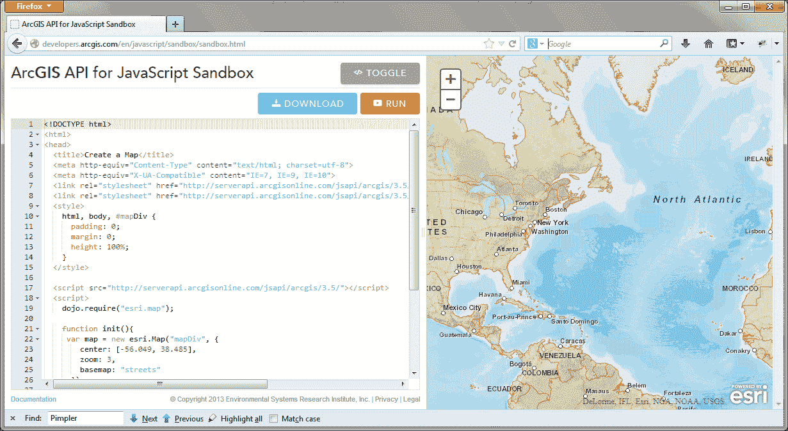

# 使用 ArcGIS JavaScript API 创建应用程序的基本步骤

创建任何 GIS Web 应用程序都需要遵循几个步骤，这些步骤将始终需要执行，如果您打算将地图作为应用程序的一部分。考虑到您正在阅读本书，我无法想象您不想这样做！简而言之，您需要遵循以下几个步骤：

1.  为页面创建 HTML 代码。

1.  引用 ArcGIS JavaScript API 和样式表。

1.  加载模块。

1.  确保 DOM 可用。

1.  创建地图。

1.  定义页面内容。

1.  页面样式。

这只是对需要做的事情的简要描述。我们将在接下来的页面中更详细地讨论这些步骤。

## 为 Web 页面创建 HTML 代码

在上一章中，您学习了 HTML、CSS 和 JavaScript 的基本概念。现在，您将开始将这些技能付诸实践。您首先需要创建一个简单的 HTML 文档，最终将作为地图的容器。由于我们使用 ArcGIS API for JavaScript Sandbox，这一步已经为您完成。但是，我希望您花一些时间来检查代码，以便对概念有一个良好的理解。在 Sandbox 的左窗格中，您可以看到以下代码示例中突出显示的代码引用了网页的基本 HTML 代码。显然，其中还有其他 HTML 和 JavaScript 代码，但以下代码构成了网页的基本组件。这段代码包括了几个基本标签，包括`<html>`、`<head>`、`<title>`、`<body>`和其他一些标签：

```js
<!DOCTYPE html>
**<html>**
**<head>**
 **<title>Create a Map</title>**
 **<meta http-equiv="Content-Type" content="text/html; charset=utf-8">**
 **<meta name="viewport" content="initial-scale=1, maximum-scale=1,user-scalable=no">**
  <link rel="stylesheet" href="http://js.arcgis.com/3.7/js/dojo/dijit/themes/claro/claro.css">
  <link rel="stylesheet" href="http://js.arcgis.com/3.7/js/esri/css/esri.css">
 **<style>**
 **html, body, #mapDiv {**
 **padding: 0;**
 **margin: 0;**
 **height: 100%;**
 **}**
 **</style>**

  <script src="http://js.arcgis.com/3.7/"></script>
  <script>
    dojo.require("esri.map");

    function init(){
     var map = new esri.Map("mapDiv", {
        center: [-56.049, 38.485],
        zoom: 3,
        basemap: "streets"
      });
    }
    dojo.ready(init);
  </script>

**</head>**
**<body class="claro">**
 **<div id="mapDiv"></div>**
**</body>**
**</html>**

```

## 引用 ArcGIS API for JavaScript

要开始使用 ArcGIS API for JavaScript，您需要添加对样式表和 API 的引用。在 Sandbox 中，以下代码已经添加到`<head>`标签内：

```js
  <link rel="stylesheet" href="http://js.arcgis.com/3.7/js/esri/css/esri.css">

<script src="http://js.arcgis.com/3.7/"></script>
```

`<script>`标签加载了 ArcGIS API for JavaScript。在撰写本章时，当前版本为 3.7。当 API 的新版本发布时，您需要相应地更新这个数字。`<link>`标签加载了`esri.css`样式表，其中包含了 Esri 小部件和组件的特定样式。

可选地，您可以包含对 Dojo Dijit 主题之一的样式表的引用。ArcGIS API for JavaScript 直接构建在 Dojo JavaScript 框架上。Dojo 带有四个预定义的主题，控制着添加到您的应用程序中的用户界面小部件的外观：Claro、Tundra、Soria 和 Nihilo。在以下代码示例中，我引用了 Claro 主题：

```js
<link rel="stylesheet" href="http://js.arcgis.com/3.7/js/dojo/dijit/themes/claro/claro.css">
```

其他可用的样式表可以像以下代码示例中所示进行引用。您不必引用任何样式表，但如果您打算添加 Dojo 用户界面组件（Dijits），那么您需要加载其中一个样式表来控制组件的样式：

```js
<link rel="stylesheet" href="http://js.arcgis.com/3.7/js/dojo/dijit/themes/tundra/tundra.css">
<link rel="stylesheet" href="http://js.arcgis.com/3.7/js/dojo/dijit/themes/nihilo/nihilo.css">
<link rel="stylesheet" href="http://js.arcgis.com/3.7/js/dojo/dijit/themes/soria/soria.css">
```

网站[www.dojotoolkit.org](http://www.dojotoolkit.org)提供了一个主题测试器，您可以使用它来感受每个主题对用户界面组件显示的影响。主题测试器位于[`archive.dojotoolkit.org/nightly/dojotoolkit/dijit/themes/themeTester.html`](http://archive.dojotoolkit.org/nightly/dojotoolkit/dijit/themes/themeTester.html)。以下截图显示了 Dijit 主题测试器界面：

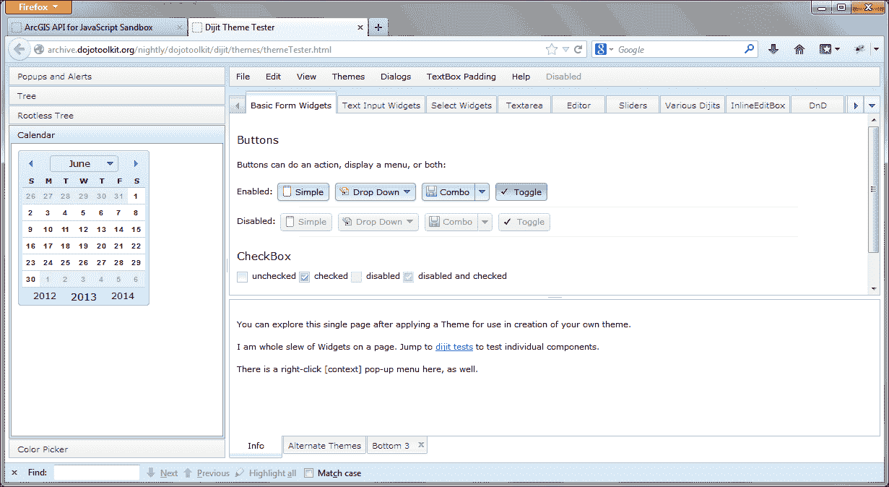

## 加载模块

在创建`Map`对象之前，您必须首先引用提供地图的资源。这是通过使用`require()`函数来实现的。

### 遗留样式还是 AMD Dojo？

使用旧的 Dojo 遗留样式还是新的 AMD 目前是许多开发人员的挫折之源。**异步模型定义**（**AMD**）是在 Dojo 的 1.7 版本中引入的。ArcGIS Server API for JavaScript 的 3.4 版本发布是第一个使用新的 AMD 样式重写所有模块的版本。目前，旧的遗留样式和 AMD 样式都可以正常工作，但建议使用新的 AMD 样式编写任何新的应用程序。我们将在本书中遵循这个惯例，但请记住，在 3.4 版本发布之前编写的应用程序和一些 Esri 示例仍反映了旧的编码风格。

`require()`函数用于将资源导入到您的网页中。ArcGIS API for JavaScript 提供了各种资源，包括`esri/map`资源，必须在创建地图或处理几何、图形和符号之前提供。一旦提供了对资源的引用，您就可以使用`Map`构造函数来创建`Map`。以下几点展示了如何在 Sandbox 中运行代码：

+   在开始向沙盒添加代码之前，如果需要，请删除以下突出显示的代码。我让您删除的代码来自对 ArcGIS API for JavaScript 的传统编码风格。我们将使用新的 AMD 风格。在将来的 Sandbox 版本中，可能不需要删除这些代码行。我预计 Esri 最终将基本代码块迁移到更新的 AMD 风格：

```js
<script>
 **dojo.require("esri.map");**

 **function init(){**
 **var map = new esri.Map("mapDiv", {**
 **center: [-56.049, 38.485],**
 **zoom: 3,**
 **basemap: "streets"**
 **});**
 **}**
 **dojo.ready(init);**
  </script>
```

+   您导入的资源需要包含在新的`<script>`标签中。将以下突出显示的代码行添加到`<script>`标签内的沙盒中。`require()`函数内部使用的参数名称可以是任何您喜欢的名称。但是，Esri 和 Dojo 都提供了一组首选参数。我建议在为`require`回调函数传递参数时使用 Esri 首选参数列表。Dojo 也使用其首选参数别名。例如，在您添加的以下代码中，我们提供了对`esri/map`资源的引用，然后在匿名函数内部，我们提供了一个首选参数`Map`。在`require()`函数中引用的每个资源都将有一个相关的参数，这将为该资源提供一个对象的钩子：

```js
<script>
**require(["esri/map", "dojo/domReady!"], function(Map) {**

 **});**

</script>
```

## 确保文档对象模型可用

当网页加载时，组成页面的所有 HTML 元素都会被加载和解释。这被称为**文档对象模型**（**DOM**）。非常重要的是，您的 JavaScript 在所有元素加载之前不要尝试访问任何这些元素。显然，如果您的 JavaScript 代码尝试访问尚未加载的元素，将会导致错误。为了控制这一点，Dojo 有一个`ready()`函数，您可以将其包含在`require()`函数内部，这样它将仅在所有 HTML 元素和任何模块加载后执行。或者，您可以使用`dojo/domReady!`插件来确保所有 HTML 元素都已加载。我们将使用第二种方法进行此练习。

在前面的代码中，我们已经使用了带有`dojo/domReady!`的插件添加到`require()`函数中。

### 注意

虽然在基本的 HTML 文件中直接添加 JavaScript 代码是完全可能的，但最好的做法是创建一个单独的 JavaScript 文件（.js）。我们在本书中编写的大部分代码都将在 HTML 文件中完成，以简化操作，但随着您的应用程序变得更加复杂，您将希望遵循将 JavaScript 代码编写到单独文件的做法。

## 创建地图

通过`esri/map`创建新地图，这是您在先前步骤中导入的`esri/map`模块中找到的`Map`类的引用。在`require()`函数内部，您将使用构造函数创建一个新的`Map`对象。`Map`对象的构造函数接受两个参数，包括一个引用到网页上放置地图的`<div>`标签以及一个可用于定义各种地图设置选项的选项参数。`options`参数被定义为一个包含一组键/值对的 JSON 对象。

也许最显眼的选项是`basemap`，它允许您从[ArcGIS.com](http://ArcGIS.com)选择预定义的底图，可以包括`streets`、`satellite`、`hybrid`、`topo`、`gray`、`oceans`、`national-geographic`或`osm`。`zoom`选项用于定义地图的起始缩放级别，可以是与预定义缩放比例级别对应的整数值。`minZoom`和`maxZoom`选项定义地图的最小和最大比例缩放级别。`center`选项定义地图的中心点，最初将显示并使用包含纬度/经度坐标对的`Point`对象。还有许多其他选项，您可以将其作为参数传递给`Map`对象的构造函数。

首先，我们将通过添加以下代码的突出显示行来创建一个名为`map`的全局变量以及`require()`函数：

```js
<script>
 **var map;**
 **require(["esri/map", "dojo/domReady!"], function(Map) {**
 **});**
 </script>
```

将以下突出显示的代码块添加到`require()`函数中。这行代码是新`Map`对象的构造函数。传递给构造函数的第一个参数是指向地图将放置的`<div>`标签的 ID 的引用。我们还没有定义这个`<div>`标签，但我们将在下一步中这样做。传递给`Map`构造函数的第二个参数是一个定义选项的 JSON 对象，包括将作为地图中心的地理坐标、缩放级别和`topo`底图。

```js
basemap.require(["esri/map", "dojo/domReady!"], function(Map) {
 **map = new Map("mapDiv", {**
 **basemap: "topo",**
 **center: [-122.45,37.75], // long, lat**
 **zoom: 13,**
 **sliderStyle: "small"**
 **});**
});
```

## 创建页面内容

最后一步之一是创建 HTML `<div>`标签，作为地图的容器。您总是希望为`<div>`标签分配一个唯一的 ID，以便您的 JavaScript 代码可以引用该位置。在 Sandbox 中，这个带有唯一标识符`mapDiv`的`<div>`标签已经为您创建。您可以在下面的代码的突出显示行中看到这一点。此外，您还需要为`<body>`标签定义类属性，该属性应引用您引用的 Dojo 样式表。

在下面的代码中，您可以看到 Sandbox 中已经创建的`<body>`标签完成了前面两个任务：

```js
<body class="claro">
 **<div id="mapDiv"></div>**
</body>
```

## 为页面添加样式

您可以向`<head>`标签添加样式信息，以定义网页的各种样式方面。在这种情况下，样式已经在 Sandbox 中为您创建，如下面的代码所示。在这种情况下，样式包括设置地图以填满整个浏览器窗口：

```js
<style>
    html, body, #mapDiv {
      padding:0;
      margin:0;
      height:100%;
    }
</style>
```

## 完整的代码

这个简单应用程序的代码应该如下所示：

```js
<!DOCTYPE html>
<html>
  <head>
    <meta http-equiv="Content-Type" content="text/html; charset=utf-8">
    <meta http-equiv="X-UA-Compatible" content="IE=7, IE=9, IE=10">
    <meta name="viewport" content="initial-scale=1, maximum-scale=1,user-scalable=no"/>
    <title>Simple Map</title>
    <link rel="stylesheet" href="http://js.arcgis.com/3.7/js/esri/css/esri.css">
    <link rel="stylesheet" href="http://js.arcgis.com/3.7/js/dojo/dijit/themes/claro/claro.css">
    <style>
      html, body, #map {
        height: 100%;
        width: 100%;
        margin: 0;
        padding: 0;
      }    
    </style>
    <script src="http://js.arcgis.com/3.7/"></script>
    <script>
      var map;

      require(["esri/map", "dojo/domReady!"], function(Map) {
        map = new Map("map", {
          basemap: "topo",
          center: [-122.45,37.75], // long, lat
          zoom: 13,
          sliderStyle: "small"
        });
      });
    </script>
  </head>

  <body class="claro">
    <div id="map"></div>
  </body>
</html>
```

点击**Run**按钮执行代码，如果一切编码正确，您应该看到以下输出：

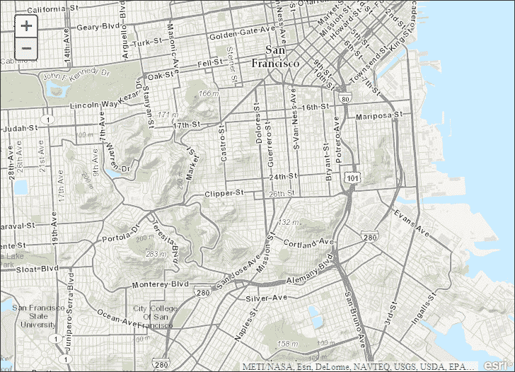

# 关于地图的更多信息

在前面描述的过程中，我们介绍了使用 ArcGIS API for JavaScript 构建每个应用程序时需要遵循的流程。您学会了如何创建一个初始化 JavaScript 函数。初始化脚本的目的是创建地图，添加图层，并执行任何其他必要的设置例程，以启动应用程序。创建地图通常是您要做的第一件事，在本节中，我们将更仔细地看看您创建`Map`类实例的各种选项。

在面向对象编程中，通过构造函数来创建类实例是经常通过构造函数来完成的。构造函数是用于创建或初始化新对象的函数。在这种情况下，构造函数用于创建新的`Map`对象。构造函数通常接受一个或多个参数，这些参数可用于设置对象的初始状态。

`Map`构造函数可以接受两个参数，包括地图应该驻留的容器和地图的各种选项。但是，在调用地图的构造函数之前，您必须首先引用提供地图的资源。这是通过导入`esri/map`资源来实现的。一旦提供了对资源的引用，您就可以使用构造函数来创建地图。`<div>` ID 是构造函数的必需参数，用于指定地图的容器。此外，您还可以传递多个选项，以控制地图的各个方面，包括底图图层、地图中心的初始显示、导航控件的显示、平移期间的图形显示、滑块的控制、详细级别等等。

让我们更仔细地看一下在地图构造函数中如何指定选项。选项是构造函数中的第二个参数，总是用括号括起来。这定义了 JSON 对象的内容。在括号内，每个选项都有一个特定的名称，后面跟着一个冒号，然后是控制该选项的数据值。如果您需要向构造函数提交多个选项，每个选项之间用逗号分隔。以下代码示例显示了如何向`Map`构造函数提交选项：

```js
      var map = new Map("mapDiv", {
        center: [-56.049, 38.485],
        zoom: 3,
        basemap: "streets"
      });
```

在这种情况下，我们正在为地图坐标定义选项，该坐标将作为地图的中心，以及缩放级别和街道的底图图层。这些选项用花括号括起来，并用逗号分隔。

# 使用地图服务层

没有数据层的地图有点像一块空白的画布。您添加到地图上的数据层赋予了它意义，并为分析设置了舞台。提供可以添加到地图上的数据层的两种主要类型的地图服务：动态地图服务层和瓦片地图服务层。

动态地图服务层引用创建地图图像并将图像返回给应用程序的地图服务。这种地图服务可能由一个或多个信息层组成。例如，以下屏幕截图中显示的人口统计地图服务由九个不同的图层组成，代表不同地理级别的人口统计信息：

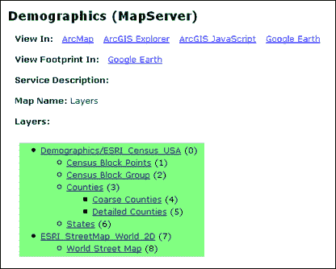

虽然它们在客户端应用程序中显示可能需要更长的时间，因为它们必须*即时生成*，但动态地图服务层比瓦片地图服务层更灵活。在动态地图服务层中，您可以通过图层定义控制显示的要素，设置服务内各个图层的可见性，并为图层定义时间信息。例如，在前面屏幕截图中详细介绍的**人口统计**地图服务层中，您可能选择在应用程序中仅显示**人口普查区组**。这就是动态地图服务层提供的灵活性，而这是瓦片地图服务层所不具备的。

瓦片地图服务层引用预定义的地图瓦片缓存，而不是动态渲染的图像。理解瓦片地图服务的概念最简单的方法是将其想象成覆盖在地图表面上的网格。网格中的每个单元格大小相同，并将用于将地图切割成称为瓦片的单个图像文件。这些单独的瓦片作为图像文件存储在服务器上，并根据地图范围和比例尺的需要进行检索。这个过程通常在各种地图比例尺上重复。最终结果是生成了各种地图比例尺的瓦片集缓存。当地图在应用程序中显示时，它看起来是无缝的，即使它由许多单独的瓦片组成。

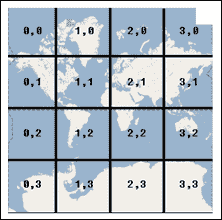

这些瓦片或缓存地图层通常用作包括图像、街道地图、地形图在内的底图，或者用于不经常更改的数据层。瓦片地图服务往往显示更快，因为它们没有每次请求地图时都要创建图像的开销。

操作层通常覆盖在瓦片地图的顶部，这些层通常是动态层。虽然它们在性能方面可能会慢一些，但动态地图服务层具有能够动态定义外观的优势。

## 使用图层类

使用 JavaScript API 中的图层类，您可以引用由 ArcGIS Server 和其他地图服务器托管的地图服务。所有图层类都继承自`Layer`基类。`Layer`类没有构造函数，因此您不能从这个类中专门创建对象。这个类只是定义了所有从`Layer`继承的类的属性、方法和事件。

如下图所示，`DynamicMapServiceLayer`、`TiledMapServiceLayer`和`GraphicsLayer`都直接继承自`Layer`类。`DynamicMapServiceLayer`和`TiledMapserviceLayer`也充当基类。`DynamicMapServiceLayer`是动态地图服务的基类，而`TiledMapServiceLayer`是平铺地图服务的基类。第三章，“向地图添加图形”，完全致力于图形和`GraphicsLayer`，因此我们将在本书的后面讨论这种类型的图层。`Layer`、`DynamicMapServiceLayer`和`TiledMapServiceLayer`都是基类，这意味着您不能在应用程序中从这些类中专门创建对象。

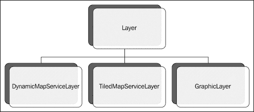

## 平铺地图服务图层

如前所述，平铺地图服务图层引用了预定义图像的缓存，这些图像被平铺在一起以创建无缝的地图显示。这些通常用作基础地图。

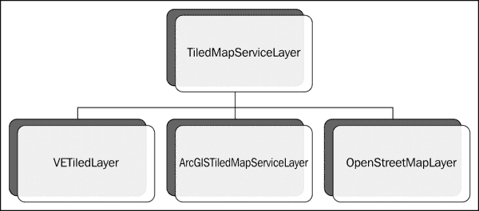

当引用由 ArcGIS Server 公开的平铺（缓存）地图服务时，使用`ArcGISTiledMapServiceLayer`类。由于这种类型的对象针对已缓存的平铺地图集工作，因此通常可以提高性能。`ArcGISTiledMapServiceLayer`的构造函数需要一个指向地图服务的 URL 指针，以及允许您为地图服务分配 ID 并控制透明度和可见性的选项。

在下面的代码示例中，请注意`ArcGISTiledMapServiceLayer`的构造函数需要一个参数，该参数引用地图服务。在创建图层实例后，可以使用`Map.addLayer()`方法将其添加到地图中，该方法接受一个包含对平铺地图服务图层的引用的变量：

```js
var basemap = new ArcGISTiledMapServiceLayer("http://server.arcgisonline.com/ArcGIS/rest/services/World_Topo_Map/MapServer");
map.addLayer(basemap);
```

`ArcGISTiledMapServiceLayer`主要用于快速显示缓存的地图数据。您还可以控制数据显示的级别。例如，您可能希望在用户缩放到 0-6 级时显示来自概括的`ArcGISTiledMapService`的数据，显示州际和高速公路，然后在用户进一步放大时切换到更详细的`ArcGISTiledMapService`。您还可以控制添加到地图的每个图层的透明度。

## 动态地图服务图层

正如其名称所示，`ArcGISDynamicMapServiceLayer`类用于创建由 ArcGIS Server 提供的动态地图。与`ArcGISTiledMapServiceLayer`一样，`ArcGISDynamicMapServiceLayer`的构造函数需要一个指向地图服务的 URL，以及可选参数，用于为服务分配 ID，确定地图图像的透明度，以及设置图层的初始可见性为 true 或 false 的可见性选项。`ArcGISDynamicMapServiceLayer`类名可能有些误导。尽管它似乎是指一个单独的数据图层，但实际上并非如此。它指的是地图服务而不是数据图层。地图服务内的单独图层可以通过`setVisibleLayers()`方法打开/关闭。

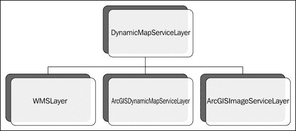

创建`ArcGISDynamicMapServiceLayer`的实例看起来与`ArcGISTiledMapServiceLayer`非常相似。以下代码示例说明了这一点。构造函数接受一个指向地图服务的 URL。第二个参数定义了可选参数，您可以提供以控制透明度、可见性和图像参数：

```js
var operationalLayer = new ArcGISDynamicMapServiceLayer("http://sampleserver1.arcgisonline.com/ArcGIS/rest/services/Demographics/ESRI_Population_World/MapServer",{"opacity":0.5});
map.addLayer(operationalLayer);
```

将上述两行代码添加到 ArcGIS API for JavaScript Sandbox 中，如下所示的代码：

```js
  <script>
    var map;
    require(["esri/map", **"esri/layers/ArcGISDynamicMapServiceLayer"**, "dojo/domReady!"], function(Map, **ArcGISDynamicMapServiceLayer**) {
      map = new Map("mapDiv", {
        basemap: "topo",
        center: [-122.45,37.75], // long, lat
        **zoom: 5,**
        sliderStyle: "small"
      });
      **var operationalLayer = new ArcGISDynamicMapServiceLayer("http://sampleserver1.arcgisonline.com/ArcGIS/rest/services/Demographics/ESRI_Population_World/MapServer",{"opacity":0.5});**
 **map.addLayer(operationalLayer);**
    });
  </script>
```

运行上述代码，查看动态图层添加到地图中，如下截图所示：

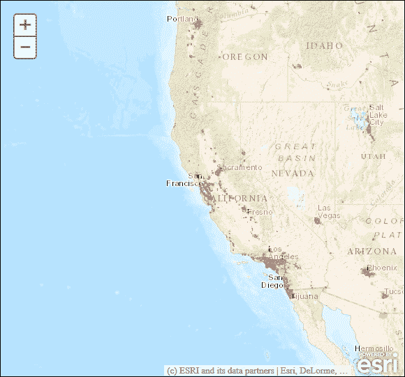

使用`ArcGISDynamicMapServiceLayer`的实例，您可以执行许多操作。显然，您可以创建显示服务中数据的地图，但您还可以从服务中的图层查询数据，通过图层定义控制要素显示，控制单个图层的可见性，设置与时间相关的信息，将地图导出为图像，控制背景透明度等等。

## 向地图添加图层

`addLayer()`方法将图层的实例（`ArcGISDynamicMapServiceLayer`或`ArcGISTiledMapServiceLayer`）作为第一个参数，并且可选的索引指定它应该放置在哪里。在下面的代码示例中，我们创建了一个指向服务 URL 的`ArcGISDynamicMapServiceLayer`的新实例。然后调用`Map.addLayer()`来传递图层的新实例。服务中的图层现在将在地图上可见。

```js
var operationalLayer = new ArcGISDynamicMapServiceLayer("http://sampleserver1.arcgisonline.com/ArcGIS/rest/services/Demographics/ESRI_Population_World/MapServer");
map.addLayer(operationalLayer);
```

`addLayers()`方法接受一个图层对象数组，并一次性添加它们。

除了能够向地图添加图层，您还可以使用`Map.removeLayer()`或`Map.removeAllLayers()`从地图中删除图层。

## 从地图服务设置可见图层

您可以使用`setVisibleLayers()`方法控制动态地图服务图层中各个图层的可见性。这仅适用于动态地图服务图层，而不适用于瓦片地图服务图层。该方法接受一个整数数组，对应于地图服务中的数据图层。

这个数组是从零开始的，所以地图服务中的第一个图层占据位置`0`。在下面的截图中，**人口统计**地图服务中的`Demographics/ESRI_Census_USA`占据索引`0`：

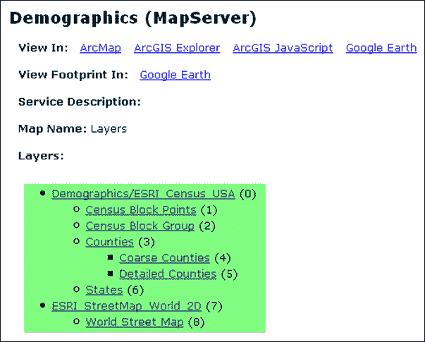

因此，如果我们只想显示来自该服务的**人口普查区块点**和**人口普查区块组**要素，我们可以使用`setVisibleLayers()`，如下面的代码示例所示：

```js
var dynamicMapServiceLayer = new ArcGISDynamicMapServiceLayer("https://gis.sanantonio.gov/ArcGIS/rest/services/Demographics/MapServer");
dynamicMapServiceLayer.setVisibleLayers([1,2]);
map.addLayer(dynamicMapServiceLayer);
```

## 设置定义表达式

在 ArcGIS for Desktop 中，您可以使用定义表达式来限制将显示的数据图层中的要素。定义表达式只是针对图层中的列和行设置的 SQL 查询。只有满足查询的属性的要素才会显示。例如，如果您只想显示人口超过一百万的城市，表达式将是类似于`POPULATION > 1000000`。ArcGIS API for JavaScript 包含一个`setLayerDefinitions()`方法，接受一个可以应用于`ArcGISDynamicMapServiceLayer`的定义数组，以控制生成地图中要素的显示。下面的代码示例显示了如何做到这一点：

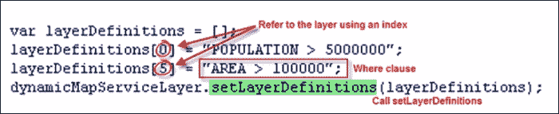

首先创建一个数组，用于保存多个`where`子句，这些子句将作为每个图层的定义表达式。在这种情况下，我们为第一层和第六层定义了图层定义。数组是从零开始的，所以第一个数组位于索引`0`。然后将`where`子句放入数组中，然后传递到`setLayerDefinitions()`方法中。然后 ArcGIS Server 会根据每个图层的`where`子句渲染匹配的要素。

## 地图导航

现在您已经了解了一些关于地图和驻留在其中的图层的知识，是时候学习如何在应用程序中控制地图导航了。在大多数情况下，您的用户将需要能够使用平移和缩放功能在地图周围导航。ArcGIS API for JavaScript 提供了许多用户界面小部件和工具栏，您可以使用这些小部件和工具栏来允许用户使用缩放和平移功能更改当前地图范围。地图导航也可以通过键盘导航和鼠标导航进行。除了这些用户界面组件和硬件接口之外，地图导航也可以通过编程方式进行控制。

### 地图导航小部件和工具栏

向您的应用程序提供地图导航控制的最简单方法是通过添加各种小部件和工具栏。创建新地图并添加图层时，默认情况下会包括一个缩放滑块。此滑块允许用户放大和缩小地图。缩放滑块如下截图所示。您无需在程序上做任何事情即可使缩放滑块出现在地图上；它默认存在。但是，如果需要，您可以通过在创建`Map`对象的实例时将滑块选项设置为`false`来简单地删除应用程序中的滑块：

```js
{"slider":false,"nav":true,"opacity":0.5,"imageParameters":imageParameters}
```

以下截图显示了带有缩放滑块的地图：

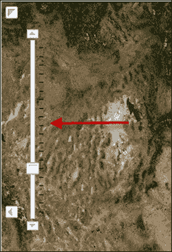

您还可以添加平移按钮，单击时将地图平移到箭头指向的方向。默认情况下，平移按钮不会出现在地图上。创建`Map`对象时，必须明确将`nav`选项设置为`true`：

```js
{"nav":true,"opacity":0.5,"imageParameters":imageParameters}
```

以下截图显示了平移选项：

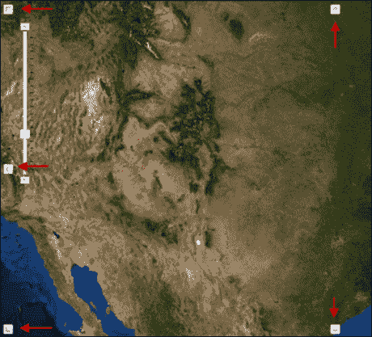

ArcGIS API for JavaScript 还为您提供了向应用程序添加几种类型的工具栏的能力，包括包含放大和缩小、平移、全范围、下一个范围和上一个范围按钮的导航工具栏。工具栏的创建将在后面的章节中详细介绍，因此我们将保存该讨论以供以后讨论。

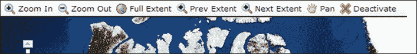

### 使用鼠标和键盘进行地图导航

用户还可以使用鼠标和/或键盘设备控制地图导航。默认情况下，用户可以执行以下操作：

+   拖动鼠标进行平移

+   使用鼠标向前滚动以放大

+   使用鼠标向后滚动以缩小

+   按下*Shift*并拖动鼠标以放大

+   按下*Shift* + *Ctrl*并拖动鼠标以缩小

+   按下*Shift*并单击以恢复到中心

+   双击以居中和放大

+   按下*Shift*并双击以居中和放大

+   使用箭头键进行平移

+   使用*+*键放大到某个级别

+   使用*-*键缩小一个级别

可以使用多个`Map`方法之一来禁用前述选项。例如，要禁用滚轮缩放，您将使用`Map.disableScrollWheelZoom()`方法。这些导航功能也可以在地图加载后移除。

### 获取和设置地图范围

您要掌握的第一件事情之一是获取和设置地图范围。默认情况下，应用程序中地图的初始范围是创建地图服务时地图文档文件（`.mxd`）上次保存时的地图范围。在某些情况下，这可能正是您想要的，但是如果您需要设置除默认值之外的地图范围，您将有几个选项。

可以在`Map`对象的构造函数中定义的可选参数之一是中心参数。您可以将此可选参数与缩放对象一起使用，以设置初始地图范围。在下面的代码示例中，您将看到这一点，我们为地图的中心定义了一个坐标对，以及一个缩放级别为`3`：

```js
var map = new Map("mapDiv", {
        center: [-56.049, 38.485],
        zoom: 3,
        basemap: "streets"
      });
```

地图的初始范围不是必需的参数，因此如果您省略此信息，地图将简单地使用默认范围。在下面的代码示例中，只指定了容器的 ID：

```js
var map = new Map("map");
```

创建`Map`对象后，还可以使用`Map.setExtent()`方法来更改范围，方法是传入一个`Extent`对象，如下面的代码示例所示：

```js
var extent = new Extent(-95.271, 38.933, -95.228, 38.976);
map.setExtent(extent);
```

或者，您可以像下面的代码示例中那样单独设置`Extent`属性。

```js
var extent = new Extent();
extent.xmin = -95.271;
extent.ymin = 38.933;
extent.xmax = -95.228;
extent.ymax = 38.976;
map.setExtent(extent);
```

在应用程序中使用多个地图服务时，可以通过地图的构造函数或使用其中一个服务的`Map.fullExtent`方法来设置初始地图范围。例如，通常使用提供基础图层功能的地图服务，其中包含航空影像以及包含自己本地操作数据源的地图服务。下面的代码示例使用了`fullExtent()`方法：

```js
map = new Map("mapDiv", {extent:esri.geometry.geographicToWebMercator(myService2.fullExtent) });
```

当前范围可以通过`Map.extent`属性或`onExtentChange`事件来获取。请注意，`Map.setExtent`属性是只读的，因此不要尝试通过此属性设置地图范围。

# 地图事件

在编程世界中，事件是应用程序中发生的动作。通常，这些事件是由最终用户触发的，可以包括鼠标点击、鼠标拖动和键盘操作，但也可以包括数据的发送和接收、组件修改等。

JavaScript 的 ArcGIS API 是一个异步 API，遵循发布/订阅模式，应用程序向监听器注册（发布）事件。下图说明了这个过程。监听器负责监视应用程序的这些事件，然后触发响应事件的`handler`函数。可以将多个事件注册到同一个监听器上。`dojo on()`方法作为事件到处理程序的功能。

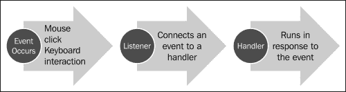

正如您可能记得的那样，ArcGIS Server JavaScript API 是建立在 Dojo 之上的。使用 Dojo，事件通过`dojo on()`方法注册到处理程序。此方法需要三个参数。请看下面截图中显示的代码示例，以更好地理解如何注册事件：

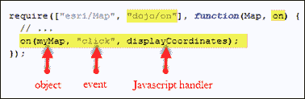

我们使用`on()`方法并传入`map`、`click`和`displayCoordinates`等参数。前两个参数表示我们要注册的对象和事件。在这种情况下，这意味着我们正在注册`Map`对象上找到的`click`事件。每次用户在地图范围内点击鼠标时，都会触发此事件。最后一个参数`displayCoordinates`表示事件的监听器。因此，每当`Map`对象上的`click`事件被触发时，它将触发`displayCoordinates`函数，该函数将运行并报告地图的当前范围。尽管事件和它们注册的处理程序会根据您的情况而改变，但注册的方法是相同的。

每次事件发生时，都会生成一个`Event`对象。这个`Event`对象包含额外的事件信息，比如点击的鼠标按钮或者按下的键盘按键。这个对象会自动传递到事件处理程序中，可以进行检查。在下面的代码示例中，您可以看到`Event`对象作为参数传递到处理程序中。这是一个动态对象，其属性将根据触发的事件类型而改变。

```js
function addPoint(evt) {
    alert(evt.mapPoint.x, evt.mapPoint.y);
}
```

API 中许多不同的对象上都有许多不同的事件可用。但是，重要的是要记住，您不必为每个事件注册监听器。只有对应用程序必要的事件才应该注册。当发生一个未注册监听器的事件时，该事件将被简单地忽略。

`Map`对象包含许多不同的事件，您可以对其做出响应，包括各种鼠标事件、范围更改事件、底图更改事件、键盘事件、图层事件、平移和缩放事件等。您的应用程序可以对任何这些事件做出响应。在接下来的章节中，我们将研究其他对象上可用的事件。

在不再需要时，将事件与其处理程序断开连接是一种良好的编程实践。通常在用户从页面导航离开或关闭浏览器窗口时执行此操作。以下代码示例显示了如何通过简单调用`remove()`方法来实现这一点：

```js
var mapClickEvent = on(myMap, "click", displayCoordinates);
mapClickEvent.remove();
```

# 总结

在本章中，我们涵盖了很多内容。使用 ArcGIS API for JavaScript 创建的所有应用程序都需要一定的步骤。我们将其称为样板代码。这包括定义对 API 和样式表的引用、加载模块、创建初始化函数以及其他一些步骤。在`initialization`函数中，您很可能会创建地图、添加各种图层，并执行其他在应用程序使用之前需要执行的设置操作。在本章中，您学会了如何执行这些任务。

此外，我们还研究了可以添加到地图的各种图层类型，包括切片地图服务图层和动态地图服务图层。切片地图服务图层是预先创建并缓存在服务器上的，通常用作应用程序中的底图。动态地图服务图层必须在每次请求时动态创建，因此可能需要更长时间来生成。但是，动态地图服务图层可以用于执行许多类型的操作，包括查询、设置定义表达式等。

此外，您还学习了如何以编程方式控制地图范围。最后，我们介绍了事件的主题，您学会了如何将事件连接到事件处理程序，这只是一个在特定事件触发时运行的 JavaScript 函数。在下一章中，我们将仔细研究如何向应用程序添加图形。
