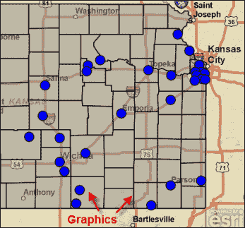
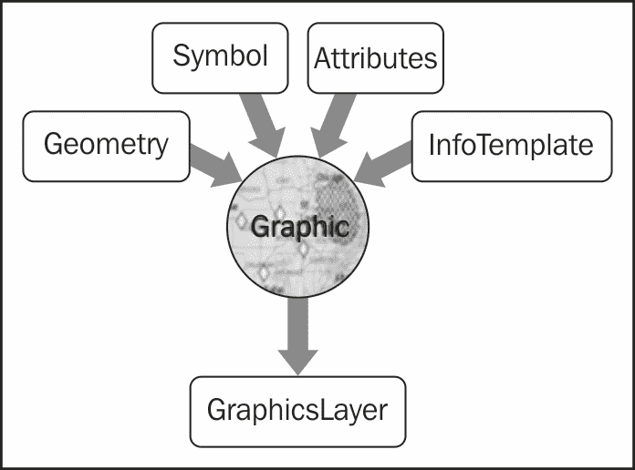
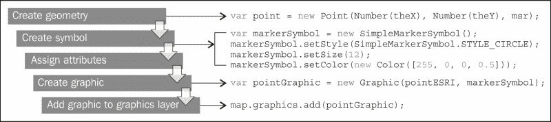
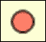
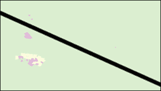
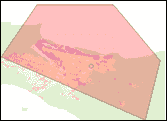
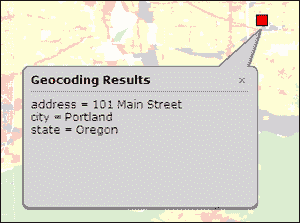
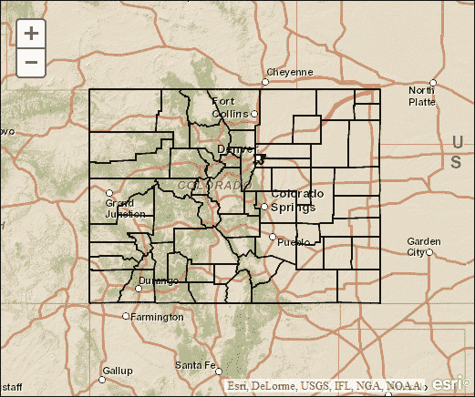
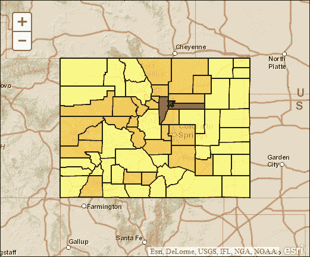
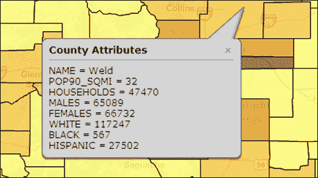

# 第三章：将图形添加到地图

图形是在地图的图层上绘制的点、线或多边形，这些图层独立于与地图服务相关的任何其他数据图层。大多数人将图形对象与在地图上显示图形的符号相关联。然而，在 ArcGIS Server 中，每个图形可以由多达四个对象组成，包括图形的几何、与图形相关的符号、描述图形的属性和定义当单击图形时出现的信息窗口格式的信息模板。尽管图形可以由多达四个对象组成，但并不总是有必要这样做。您选择与图形关联的对象将取决于您正在构建的应用程序的需求。例如，在显示 GPS 坐标的地图应用程序中，您可能不需要关联属性或显示图形的信息窗口。然而，在大多数情况下，您将为图形定义几何和符号。

图形是存储在地图上单独图层中的临时对象。它们在应用程序使用时显示，并在会话完成时删除。名为图形图层的单独图层存储与您的地图相关的所有图形。在第二章中，*创建地图和添加图层*，我们讨论了各种类型的图层，包括动态地图服务图层和切片地图服务图层。与其他类型的图层一样，`GraphicsLayer`也继承自`Layer`类。因此，`Layer`类中找到的所有属性、方法和事件也将存在于`GraphicsLayer`中。

图形显示在应用程序中存在的任何其他图层的顶部。以下屏幕截图显示了点和多边形图形的示例。这些图形可以由用户创建，也可以由应用程序根据已提交的任务绘制。例如，商业分析应用程序可能提供一个工具，允许用户绘制自由手绘多边形来表示潜在的贸易区域。

多边形图形将显示在地图的顶部，并且可以用作拉取与潜在贸易区域相关的人口统计信息的地理处理任务的输入。



许多 ArcGIS Server 任务将它们的结果作为图形返回。`QueryTask`对象可以执行属性和空间查询。然后，查询的结果以`FeatureSet`对象的形式返回到应用程序中，它只是一个要素数组。然后，您可以访问每个要素作为图形，并使用循环结构在地图上绘制它们。也许您想要查找并显示所有与百年洪水平原相交的土地地块。`QueryTask`对象可以执行空间查询，然后将结果返回到您的应用程序中，然后它们将显示为地图上的多边形图形。

在本章中，我们将涵盖以下主题：

+   图形的四个部分

+   为图形创建几何

+   符号化图形

+   为图形分配属性

+   在信息窗口中显示图形属性

+   创建图形

+   将图形添加到图形图层

# 图形的四个部分

图形由四个部分组成：**几何**、**符号**、**属性**和**信息模板**，如下图所示：



图形具有描述其位置的几何表示。几何与符号一起定义了图形的显示方式。图形还可以具有提供有关图形的描述信息的属性。属性被定义为一组名称-值对。例如，描绘野火位置的图形可以具有描述火灾名称以及烧毁的英亩数的属性。信息模板定义了在图形出现时应显示哪些属性以及它们应该如何显示。创建后，图形对象必须存储在`GraphicsLayer`对象中，然后才能显示在地图上。这个`GraphicsLayer`对象作为将要显示的所有图形的容器。

图形的所有元素都是可选的。但是，图形的几何和符号几乎总是被分配的。如果没有这两个项目，地图上就没有东西可以显示，而且没有显示图形的意义。

下图显示了创建图形并将其添加到图形图层的典型过程。在这种情况下，我们应用了图形的几何以及一个符号来描绘图形。但是，我们还没有专门为这个图形分配属性或信息模板。



# 为图形创建几何

图形几乎总是有一个几何组件，这对于它们在地图上的放置是必要的。这些几何对象可以是点、多点、折线、多边形或范围，并且可以通过这些对象的构造函数进行程序化创建，或者可以作为查询等任务的输出返回。

在创建任何这些几何类型之前，需要导入`esri/geometry`资源。这个几何资源包含了`Geometry`、`Point`、`Multipoint`、`Polyline`、`Polygon`和`Extent`的类。

`Geometry`是由`Point`、`MultiPoint`、`Polyline`、`Polygon`和`Extent`继承的基类。

如下代码行所示，`Point`类通过 X 和 Y 坐标定义位置，并且可以定义为地图单位或屏幕单位：

```js
new Point(-118.15, 33.80);
```

# 符号化图形

您创建的每个图形都可以通过 API 中找到的各种符号类之一进行符号化。点图形通过`SimpleMarkerSymbol`类进行符号化，可用形状包括圆圈、十字、菱形、正方形和 X。还可以通过`PictureMarkerSymbol`类对点进行符号化，该类使用图像来显示图形。线性特征通过`SimpleLineSymbol`类进行符号化，可以包括实线、虚线、点线或组合。多边形通过`SimpleFillSymbol`类进行符号化，可以是实心、透明或斜纹。如果您希望在多边形中使用图像进行重复图案，可以使用`PictureFillSymbol`类。文本也可以添加到图形图层，并通过`TextSymbol`类进行符号化。

点或多点可以通过`SimpleMarkerSymbol`类进行符号化，该类具有各种可以设置的属性，包括样式、大小、轮廓和颜色。样式是通过`SimpleMarkerSymbol.setStyle()`方法设置的，该方法接受以下常量之一，对应于绘制的符号类型（圆圈、十字、菱形等）：

+   `STYLE_CIRCLE`

+   `STYLE_CROSS`

+   `STYLE_DIAMOND`

+   `STYLE_PATH`

+   `STYLE_SQUARE`

+   `STYLE_X`

点图形也可以有轮廓颜色，这是通过`SimpleLineSymbol`类创建的。还可以设置图形的大小和颜色。查看以下代码示例，了解如何完成这些操作：

```js
var markerSymbol = new SimpleMarkerSymbol();
markerSymbol.setStyle(SimpleMarkerSymbol.STYLE_CIRCLE);
markerSymbol.setSize(12);
markerSymbol.setColor(new Color([255,0,0,0.5]));
```



线性特征使用`SimpleLineSymbol`类进行符号化，可以是实线或点划线的组合。其他属性包括颜色，使用`dojo/Color`定义，以及`setWidth`属性设置线条的粗细。以下代码示例详细解释了该过程：

```js
var polyline = new Polyline(msr);
//a path is an array of points
var path = [new Point(-123.123, 45.45, msr),…..];
polyline.addPath(path);
var lineSymbol = new SimpleLineSymbol().setWidth(5);

//create polyline graphic using polyline and line symbol
var polylineGraphic = new Graphic(polyline, lineSymbol);
map.graphics.add(polylineGraphic);
```

运行上述代码时获得以下屏幕截图：



多边形通过`SimpleFillSymbol`类进行符号化，允许以实线、透明或交叉图案绘制多边形。多边形还可以具有由`SimpleLineSymbol`对象指定的轮廓。以下代码示例详细解释了该过程。

```js
var polygon = new Polygon(msr);
//a polygon is composed of rings
var ring = [[-122.98, 45.55], [-122.21, 45.21], [-122.13, 45.53],……];
polygon.addRing(ring);
var fillSymbol = new SimpleFillSymbol().setColor(new Color([255,0,0,0.25]));
//create polygon graphic using polygon and fill symbol
var polygonGraphic = new Graphic(polygon, fillSymbol);
//add graphics to map's graphics layer
map.graphics.add(polygonGraphic);
```

运行上述代码时获得以下屏幕截图：



# 为图形分配属性

图形的属性是描述该对象的名称-值对。在许多情况下，图形是作为`QueryTask`等任务操作的结果生成的。在这种情况下，每个图形由几何和属性组成，然后您需要相应地对每个图形进行符号化。与图层关联的字段属性成为图形的属性。在某些情况下，可以通过`outFields`等属性限制属性。如果您的图形是以编程方式创建的，您需要使用`Graphic.setAttributes()`方法在代码中分配属性，如以下代码示例所示：

```js
Graphic.setAttributes( {"XCoord":evt.mapPoint.x, "YCoord".evt.mapPoint.y,"Plant":"Mesa Mint"});
```

# 在信息模板中显示图形属性

除了属性之外，图形还可以具有定义属性数据在弹出窗口中显示方式的信息模板。在以下代码示例中定义了一个点属性变量，其中包含键-值对。在这种特殊情况下，我们有包括地址、城市和州的键。每个名称或键都有一个值。该变量是新点图形构造函数的第三个参数。信息模板定义了弹出窗口的格式，并包含一个标题和一个可选的内容模板字符串。

```js
var pointESRI = new Point(Number(theX), Number(theY),msr);
var markerSymbol = new SimpleMarkerSymbol();
markerSymbol.setStyle(SimpleMarkerSymbol.STYLE_SQUARE);
markerSymbol.setSize(12);
markerSymbol.setColor(new Color([255,0,0]));
var pointAttributes = {address:"101 Main Street", city:"Portland", state:"Oregon"};
var pointInfoTemplate = new InfoTemplate("Geocoding Results");
//create point graphic using point and marker symbol
var pointGraphic = new Graphic(pointESRI, markerSymbol, pointAttributes).setInfoTemplate(pointInfoTemplate);
//add graphics to maps' graphics layer
map.graphics.add(pointGraphic);
```

上述代码生成以下屏幕截图：



# 创建图形

一旦您定义了图形的几何、符号和属性，就可以使用这些参数创建一个新的图形对象，并将其作为`Graphic`对象的构造函数的输入。在以下代码示例中，我们将为几何（`pointESRI`）、符号（`markerSymbol`）、点属性（`pointAttributes`）和信息模板（`pointInfoTemplate`）创建变量，然后将这些变量作为输入应用于我们的名为`pointGraphic`的新图形的构造函数。最后，将该图形添加到图形图层中。

```js
var pointESRI = new Point(Number(theX), Number(theY, msr);
var markerSymbol = new SimpleMarkerSymbol();
markerSymbol.setStyle(SimpleMarkerSymbol.STYLE_SQUARE);
markerSymbol.setSize(12);
markerSymbol.setColor(new Color([255,0,0]));

var pointAttributes = {address:"101 Main Street", city:"Portland", state:"Oregon"};
var pointInfoTemplate = new InfoTemplate("Geocoding Results");
//create the point graphic using point and marker symbol
var pointGraphic = new Graphic(pointESRI, markerSymbol, pointAttributes).setInfoTemplate(pointTemplate);

//add graphics to maps' graphics layer
map.graphics.add(pointGraphic);
```

# 将图形添加到图形图层

在地图上显示任何图形之前，您必须将它们添加到图形图层中。每个地图都有一个图形图层，其中包含一个最初为空的图形数组，直到您添加图形为止。该图层可以包含任何类型的图形对象。这意味着您可以同时混合点、线和多边形。图形通过`add()`方法添加到图层中，也可以通过`remove()`方法单独删除。如果需要同时删除所有图形，则可以使用`clear()`方法。图形图层还具有可以注册的多个事件，包括`click`、`mouse-down`等。

## 多个图形图层

API 支持多个图形图层，这样可以更轻松地组织不同类型的图形。图层可以根据需要轻松添加或删除。例如，您可以将代表县的多边形图形放在一个图形图层中，将代表交通事故的点图形放在另一个图形图层中。然后，您可以根据需要轻松添加或删除任一图层。

# 是时候练习图形了。

在这个练习中，您将学习如何在地图上创建和显示图形。我们将创建一个专题地图，显示科罗拉多州按县的人口密度。您还将介绍查询任务。正如您将在以后的章节中学到的那样，任务可以在 ArcGIS Server 中执行，并包括空间和属性查询、要素识别和地理编码等内容。最后，您将学习如何将属性附加到您的图形要素并在信息窗口中显示它们：

1.  在[`developers.arcgis.com/en/javascript/sandbox/sandbox.html`](http://developers.arcgis.com/en/javascript/sandbox/sandbox.html)上打开 JavaScript 沙盒。

1.  从以下代码块中突出显示的`<script>`标记中删除 JavaScript 内容：

```js
  <script>
 **dojo.require("esri.map");**

 **function init(){**
 **var map = new esri.Map("mapDiv", {**
 **center: [-56.049, 38.485],**
 **zoom: 3,**
 **basemap: "streets"**
 **});**
 **}**
 **dojo.ready(init);**
  </script>
```

1.  创建您将在应用程序中使用的变量。

```js
<script>
 **var map, defPopSymbol, onePopSymbol, twoPopSymbol,** threePopSymbol, fourPopSymbol, fivePopSymbol;
</script>
```

1.  添加如下突出显示的代码中所见的`require()`函数：

```js
<script>
  var map, defPopSymbol, onePopSymbol, twoPopSymbol, threePopSymbol, fourPopSymbol, fivePopSymbol;
 **require(["esri/map", "esri/tasks/query", "esri/tasks/QueryTask", "esri/symbols/SimpleFillSymbol", "esri/InfoTemplate", "dojo/domReady!"],**
 **function(Map, Query, QueryTask, SimpleFillSymbol, InfoTemplate) {** 

 **});**
</script>
```

我们在以前的练习中介绍了`esri/map`资源，因此不需要额外的解释。`esri/tasks/query`和`esri/tasks/QueryTask`资源是新的，我们将在以后的章节中介绍它们。然而，为了完成这个练习，有必要在这一点上向您介绍这些资源。这些资源使您能够在数据图层上执行空间和属性查询。

1.  在`require()`函数内部，您需要创建一个`Map`对象，并通过添加以下突出显示的代码来添加一个`basemap: streets`图层。您将设置初始地图范围以显示科罗拉多州的状态：

```js
<script>
  var map, defPopSymbol, onePopSymbol, twoPopSymbol, threePopSymbol, fourPopSymbol, fivePopSymbol;
    require(["esri/map", "esri/tasks/query", "esri/tasks/QueryTask", "esri/symbols/SimpleFillSymbol", "esri/InfoTemplate", "dojo/_base/Color", "dojo/domReady!"], 
      function(Map, Query, QueryTask, SimpleFillSymbol, InfoTemplate, Color) { 
 **map = new Map("map", {**
 **basemap: "streets",**
 **center: [-105.498,38.981], // long, lat**
 **zoom: 6,**
 **sliderStyle: "small"**
 **});**
      });
</script>
```

1.  在`require()`函数内部，在创建`Map`对象的代码块正下方，添加突出显示的代码行以创建一个新的透明多边形符号。这将创建一个新的`SimpleFillSymbol`对象并将其分配给`defPopSymbol`变量。我们使用`255,255,255,和 0`的 RGB 值来确保填充颜色完全透明。这是通过值`0`来实现的，它确保我们的着色将完全透明。稍后，我们将添加额外的符号对象，以便我们可以显示一个按县人口密度着色的地图。但现在，我们只是想创建一个符号，以便您可以理解在地图上创建和显示图形的基本过程。以下代码详细解释了这个过程：

```js
map = new Map("mapDiv", {
  basemap: "streets",
  center: [-105.498,38.981], // long, lat
  zoom: 6,
  sliderStyle: "small"
});
**defPopSymbol = new SimpleFillSymbol().setColor(new Color([255,255,255, 0])); //transparent**

```

在下一步中，您将预览`Query`任务如何在应用程序中使用。我们将在以后的章节中详细介绍这个任务，但现在，这是一个介绍。`Query`任务可用于在地图服务中的数据图层上执行空间和属性查询。在这个练习中，我们将使用`Query`任务对通过 ESRI 服务提供的县边界图层执行属性查询。

1.  让我们首先检查我们将在查询中使用的地图服务和图层。打开一个网络浏览器，转到[`sampleserver1.arcgisonline.com/ArcGIS/rest/services/Specialty/ESRI_StateCityHighway_USA/MapServer`](http://sampleserver1.arcgisonline.com/ArcGIS/rest/services/Specialty/ESRI_StateCityHighway_USA/MapServer)。该地图服务提供美国各州和县的人口普查信息，还包括一条高速公路图层。在这个练习中，我们对具有索引号为 2 的县图层感兴趣。单击**counties**选项以获取有关此图层的详细信息。该图层中有许多字段，但我们实际上只对能够按州名查询的字段和提供每个县人口密度信息的字段感兴趣。`STATE_NAME`字段提供每个县的州名，`POP90_SQMI`字段提供每个县的人口密度。

1.  返回沙盒。在创建符号的代码行的下面，通过添加以下一行代码来初始化一个新的`QueryTask`对象来创建一个新的`QueryTask`对象。这行代码的作用是创建一个指向我们在浏览器中刚刚检查的`ESRI_StateCityHighway_USA`地图服务的新`QueryTask`对象，并明确指向索引为`2`的图层，即我们的县图层。以下代码详细解释了这个过程。

```js
var queryTask = new QueryTask("http://sampleserver1.arcgisonline.com/ArcGIS/rest/services/Specialty/ESRI_StateCityHighway_USA/MapServer/2");
```

1.  所有`QueryTask`对象都需要输入参数，以便它们知道要针对图层执行什么。这是通过`Query`对象实现的。在刚刚输入的行的下面添加以下一行代码：

```js
var query = new Query();
```

1.  现在，我们将定义新的`Query`对象上的一些属性，这些属性将使我们能够执行属性查询。在创建`query`变量的行的下面添加以下三行代码：

```js
var query = new Query();
**query.where = "STATE_NAME = 'Colorado'";**
**query.returnGeometry = true;**
**query.outFields = ["POP90_SQMI"];**

```

1.  `where`属性用于创建一个 SQL 语句，该语句将针对该图层执行。在这种情况下，我们声明我们只想返回那些州名为`Colorado`的县记录。将`returnGeometry`属性设置为`true`表示我们希望 ArcGIS Server 返回与我们的查询匹配的所有要素的几何定义。这是必要的，因为我们需要在地图上将这些要素绘制为图形。最后，`outFields`属性用于定义我们希望与几何一起返回的字段。稍后在创建县人口密度的色彩编码地图时将使用这些信息。

1.  最后，我们将使用`queryTask`上的`execute`方法来执行针对我们已指定的图层（counties）的查询，使用我们`query`对象上定义的参数。添加以下一行代码：

```js
queryTask.execute(query, addPolysToMap);
```

除了将`query`对象传递给 ArcGIS Server 之外，我们还指示`addPolysToMap`将作为回调函数。此函数将在 ArcGIS Server 执行查询并返回结果后执行。`addPolysToMap`函数负责使用返回给它的`featureSet`对象绘制记录。

1.  正如我在上一步中提到的，当 ArcGIS Server 返回`featureSet`对象时，回调函数`addPolysToMap`将被执行，该对象包含与我们的属性查询匹配的记录。在创建回调函数之前，让我们首先讨论代码将实现的内容。`addPolysToMap`函数将接受一个名为`featureSet`的参数。当执行`queryTask`对象时，ArcGIS Server 会将一个`featureSet`对象返回给您的代码。`featureSet`对象包含查询返回的图形对象。在`addPolysToMap`函数内部，您将看到一行`var features = featureSet.features;`。`features`属性返回一个包含其中所有图形的数组。在定义了一个新的 feature 变量之后，我们创建了一个`for`循环，用于循环遍历这些图形并将其绘制到地图上。通过添加以下代码块来创建回调函数：

```js
function addPolysToMap(featureSet) {
  var features = featureSet.features;
  var feature;
  for (var i=0, il=features.length; i<il; i++) {
    feature = features[i];
    map.graphics.add(features[i].setSymbol(defPopSymbol));
  }
}
```

正如我之前提到的，您必须将创建的每个图形添加到`GraphicsLayer`对象中。这是通过`add()`方法完成的，就像您在前面的代码块中看到的那样。您还会注意到，我们将之前创建的符号附加到每个图形（县边界）上。

1.  通过单击**运行**按钮执行代码，如果一切编码正确，您应该看到以下截图作为输出。请注意，每个县都用我们定义的符号轮廓化了。



现在，我们将向应用程序添加额外的代码，根据人口对每个县进行颜色编码。在`require()`函数内注释掉`defPopSymbol`变量，并添加五个新符号，如下所示：

```js
//defPopSymbol = new SimpleFillSymbol().setColor(new Color([255,255,255, 0])); //transparent
onePopSymbol = new SimpleFillSymbol().setColor(new Color([255,255,128, .85])); //yellow
twoPopSymbol = new SimpleFillSymbol().setColor(new Color([250,209,85, .85])); 
threePopSymbol = new SimpleFillSymbol().setColor(new Color([242,167,46, .85])); //orange
fourPopSymbol = new SimpleFillSymbol().setColor(new Color([173,83,19, .85])); 
fivePopSymbol = new SimpleFillSymbol().setColor(new Color([107,0,0, .85])); //dark maroon
```

我们在这里所做的基本上是创建一个基于人口密度为每个县分配符号的颜色渐变。我们还对每个符号应用了透明度值为 0.85，以便我们能够透过每个县。这将使我们能够看到放置在包含城市名称的图层下面的底图。

回想一下，在之前的练习中，我们创建了`queryTask`和`Query`对象，并在`Query`上定义了一个`outFields`属性，以返回`POP90_SQMI`字段。现在，我们将使用在该字段中返回的值来确定应用于每个县的符号，该符号基于该县的人口密度。更新`addPolysToMap`函数，使其出现在以下代码块中，然后我们将讨论我们所做的事情：

```js
function addPolysToMap(featureSet) {
  var features = featureSet.features;
  var feature;
  for (var i=0, il=features.length; i<il; i++) {
    feature = features[i];
    attributes = feature.attributes;
    pop = attributes.POP90_SQMI;

    if (pop < 10)
    {
                            map.graphics.add(features[i].setSymbol(onePopSymbol));
    }
    else if (pop >= 10 && pop < 95)
   {                      map.graphics.add(features[i].setSymbol(twoPopSymbol));
   }
   else if (pop >= 95 && pop < 365)
   {                  map.graphics.add(features[i].setSymbol(threePopSymbol));
   }
   else if (pop >= 365 && pop < 1100)
   {                map.graphics.add(features[i].setSymbol(fourPopSymbol));
   }
   else
   {                map.graphics.add(features[i].setSymbol(fivePopSymbol));
   }
  }
}
```

在前面的代码块中，我们所做的是从每个图形中获取人口密度信息，并将其保存到名为`pop`的变量中。然后使用`if/else`代码块根据该县的人口密度为图形分配符号。例如，具有人口密度（如`POP90_SQMI`字段中定义的）为`400`的县将被分配为由`fourPopSymbol`定义的符号。因为我们在一个`for`循环中检查科罗拉多州的每个县，所以每个县图形都将被分配一个符号。

通过单击**运行**按钮执行代码，如果一切编码正确，您应该看到以下截图作为输出。请注意，每个县都已根据我们之前定义的符号进行了颜色编码。



现在，您将学习如何将属性附加到图形，并在单击图形时在信息窗口中显示它们。

信息窗口是在单击图形时显示的 HTML 弹出窗口。通常，它包含单击图形的属性，但也可以包含您作为开发人员指定的自定义内容。这些窗口的内容是通过指定窗口标题和要在窗口中显示的内容的`InfoTemplate`对象指定的。创建`InfoTemplate`对象的最简单方法是使用通配符，该通配符将自动将数据集的所有字段插入到信息窗口中。我们将添加一些额外的输出字段，以便在信息窗口中显示更多内容。修改`query.outFields`行，以包括以下代码行中突出显示的字段：

```js
query.outFields = ["**NAME**","POP90_SQMI","**HOUSEHOLDS**","**MALES**","**FEMALES**","**WHITE**","**BLACK**","**HISPANIC**"];
```

然后，在`queryTask.execute`行的下面添加以下代码行：

```js
resultTemplate = InfoTemplate("County Attributes", "${*}");
```

传递给构造函数的第一个参数（`"County Attributes"`）是窗口的标题。第二个参数是一个通配符，表示应在窗口中打印属性的所有名称-值对。因此，我们添加到`query.outFields`的新字段应全部包含在单击图形时的信息窗口中。

最后，我们使用`Graphic.setInfoTemplate()`方法将新创建的`InfoTemplate`对象分配给图形。通过添加以下突出显示的代码来修改您的`if/else`语句：

```js
if (pop < 10)
{
                        map.graphics.add(features[i].setSymbol(onePopSymbol).**setInfoTemplate(resultTemplate)**);
}
else if (pop >= 10 && pop < 95)
{
                        map.graphics.add(features[i].setSymbol(twoPopSymbol).**setInfoTemplate(resultTemplate)**);
}
else if (pop >= 95 && pop < 365)
{
                        map.graphics.add(features[i].setSymbol(threePopSymbol).**setInfoTemplate(resultTemplate)**);
}
else if (pop >= 365 && pop < 1100)
{
                        map.graphics.add(features[i].setSymbol(fourPopSymbol).**setInfoTemplate(resultTemplate)**);
}
else
{
                        map.graphics.add(features[i].setSymbol(fivePopSymbol).**setInfoTemplate(resultTemplate)**);
}
```

通过单击**运行**按钮执行代码。单击地图中的任何县，您应该看到类似以下屏幕截图的信息窗口：



您可以在`ArcGISJavaScriptAPI`文件夹的`graphicexercise.html`文件中查看此练习的解决方案代码，以验证您的代码是否已正确编写。

# 摘要

在本章中，您了解到图形通常用于表示作为工作应用程序内执行操作的结果生成的信息。通常，这些图形是作为已执行的任务的结果返回的，例如属性或空间查询。这可以包括点、线、多边形和文本。这些都是临时对象，仅在当前浏览器会话期间显示。每个图形可以由几何、符号、属性和信息模板组成，并通过图形图层添加到地图中，该图层始终是应用程序中最顶层的图层。这确保了图层的内容始终可见。在下一章中，我们将向您介绍要素图层，它可以执行图形图层可以执行的所有操作以及更多！
