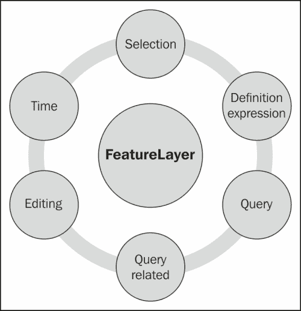
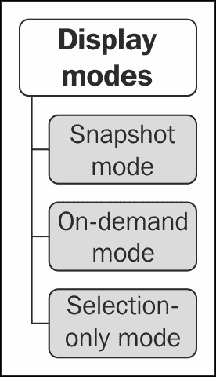
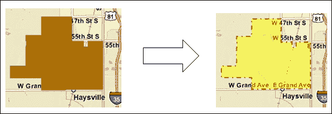
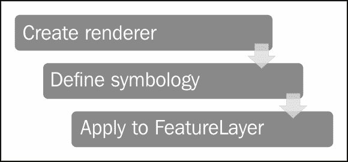
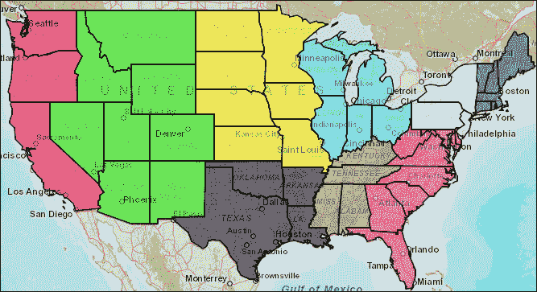
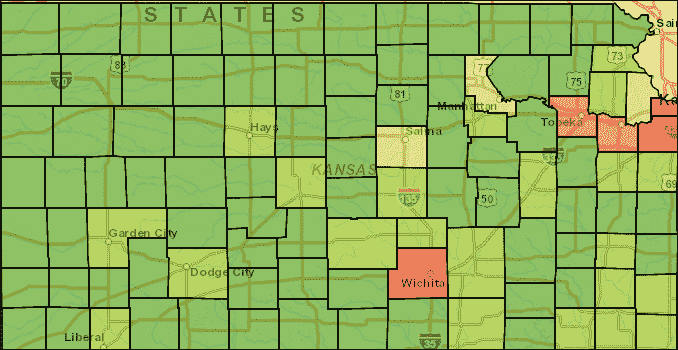
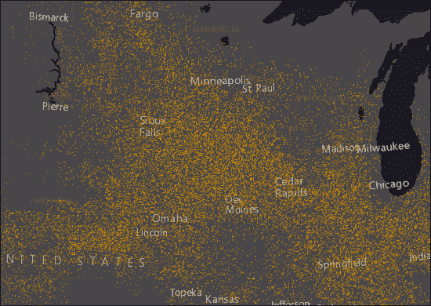
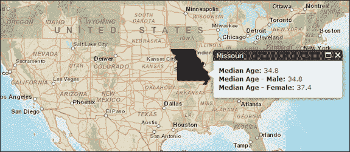

# 第四章。要素图层

ArcGIS API for JavaScript 提供了一个用于处理客户端图形要素的要素图层。这个`FeatureLayer`对象继承自`GraphicsLayer`对象，但也提供了额外的功能，比如执行查询和选择，以及支持定义表达式。它也可以用于 Web 编辑。您应该已经熟悉了之前章节中的图形图层。

要素图层与瓦片和动态地图服务图层不同，它将要素的几何信息从 ArcGIS Server 传输到 Web 浏览器，然后在地图上绘制。它还可以用于表示来自非空间表的数据，以及包含几何的要素类。

从 ArcGIS Server 流式传输数据到浏览器可能会减少与服务器的往返次数，并提高应用程序的性能。客户端可以请求其需要的要素，并对这些要素执行选择和查询，而无需从服务器请求更多信息。`FeatureLayer`对象特别适用于响应用户交互的图层，如鼠标点击或悬停。这样做的折衷是，如果您使用包含大量要素的要素图层，最初将要素传输到客户端可能需要很长时间。要素图层支持几种显示模式，可以帮助减轻处理大量要素的负担。我们将在本章中研究每种显示模式。

要素图层遵守地图服务中图层上配置的任何定义表达式、比例依赖和其他属性。使用要素图层，您可以访问相关表，执行查询，显示时间切片，处理要素附件，以及执行其他有用的操作。



在本章中，我们将涵盖以下主题：

+   创建 FeatureLayer 对象

+   定义显示模式

+   设置定义表达式

+   要素选择

+   渲染要素图层

+   练习使用 FeatureLayer

# 创建 FeatureLayer 对象

要素图层必须引用地图服务或要素服务中的图层。如果您只想从服务器检索几何和属性并自行符号化，可以使用地图服务。如果您想要从服务的源地图文档中受益于符号，则使用要素服务。此外，如果您计划使用要素图层进行编辑，则使用要素服务。要素图层遵守源地图文档中配置的任何要素编辑模板。

在下面的代码示例中，您将了解如何使用其构造函数创建`FeatureLayer`对象的详细信息。对于瓦片和动态图层，您只需提供指向 rest 端点的指针，但对于要素图层，您需要指向服务中的特定图层。在下面的代码示例中，我们将从服务中的第一个图层创建一个`FeatureLayer`对象，该图层由数字`0`表示。`FeatureLayer`的构造函数还接受选项，如显示模式、输出字段和信息模板。在这里，显示模式设置为`SNAPSHOT`，这可能表示我们正在处理一个相当小的数据集。我们将在下一节中讨论可以为要素图层定义的各种显示模式以及何时应该使用它们：

```js
var earthquakes = new FeatureLayer("http://servicesbeta.esri.com/ArcGIS/rest/services/Earthquakes/Since_1970/MapServer/0",{ mode: FeatureLayer.MODE_SNAPSHOT, outFields: ["Magnitude"]});
```

## 可选的构造函数参数

除了将地图或要素服务中的必需图层作为第一个参数传递给`FeatureLayer`对象之外，还可以将定义各种选项的 JSON 对象传递给构造函数。可以传递各种各样的选项给构造函数。我将讨论最常用的选项。

`outFields`属性可用于限制与`FeatureLayer`对象一起返回的字段。出于性能原因，最好只包括应用程序所需的字段，而不是接受默认的返回所有字段。只返回绝对需要的字段，这将确保应用程序的性能更好。在以下突出显示的代码中，我们已经定义了`outFields`属性，只返回`Date`和`Magnitude`字段：

```js
var earthquakes = new FeatureLayer("http://servicesbeta.esri.com/ArcGIS/rest/services/Earthquakes/Since_1970/MapServer/0",{ mode: FeatureLayer.MODE_SNAPSHOT, **outFields: ["Date", "Magnitude"]**});
```

`refreshInterval`属性定义了刷新图层的频率（以分钟为单位）。当您有包含经常更改的数据的`FeatureLayer`对象时，包括新记录，或者可能已更新或删除的记录时，可以使用此属性。以下突出显示的代码设置了 5 分钟的刷新间隔：

```js
var earthquakes = new FeatureLayer("http://servicesbeta.esri.com/ArcGIS/rest/services/Earthquakes/Since_1970/MapServer/0",{ mode: FeatureLayer.MODE_SNAPSHOT, outFields: ["Magnitude"], **refreshInterval: 5**});
```

要定义在单击要素时应在信息窗口中显示的属性和样式，您可以设置`infoTemplate`属性，如下面的代码示例所示：

```js
function initOperationalLayer**() {var infoTemplate = new InfoTemplate("${state_name}", "Population (2000):  ${pop2000:NumberFormat}")**;
  var featureLayer = new FeatureLayer("http://sampleserver6.arcgisonline.com/arcgis/rest/services/USA/MapServer/2",{mode: FeatureLayer.MODE_ONDEMAND,outFields: ["*"], **infoTemplate: infoTemplate**});

   map.addLayer(featureLayer);
   map.infoWindow.resize(155,75);
 **}**

```

如果您知道 Internet Explorer 将是应用程序的主要浏览器，您可能希望将`displayOnPan`属性设置为`false`。默认情况下，此属性设置为`true`，但将其设置为`false`将在平移操作期间关闭图形，从而提高 Internet Explorer 上应用程序的性能。以下代码块详细解释了这个过程：

```js
var earthquakes = new FeatureLayer("http://servicesbeta.esri.com/ArcGIS/rest/services/Earthquakes/Since_1970/MapServer/0",{ mode: FeatureLayer.MODE_SNAPSHOT, outFields: ["Magnitude"], **displayOnPan: false}**);
```

显示模式，由`mode`参数定义，可能是最重要的可选参数。因此，我们将在接下来的几节中更详细地介绍这个内容。

# 定义显示模式

创建要素图层时，您需要指定检索要素的模式。因为模式决定了何时以及如何将要素从服务器传输到客户端，您的选择会影响应用程序的速度和外观。您可以在以下图表中看到模式选择：



## 快照模式

快照模式检索图层中的所有要素，并将它们流式传输到客户端浏览器，然后将它们添加到地图中。因此，在使用此模式之前，您需要仔细考虑图层的大小。通常情况下，您只会在处理小型数据集时使用此模式。快照模式下的大型数据集可能会显著降低应用程序的性能。快照模式的好处是，由于从图层返回了所有要素到客户端，因此无需返回服务器以获取额外数据。这提高了应用程序性能的潜力。

ArcGIS 对一次最多返回的要素数量施加了限制，尽管这个数字可以通过 ArcGIS Server 管理进行配置。在实际操作中，您只会在处理小型数据集时使用此模式：

```js
var earthquakes = new FeatureLayer("http://servicesbeta.esri.com/ArcGIS/rest/services/Earthquakes/Since_1970/MapServer/0",{ **mode: FeatureLayer.MODE_SNAPSHOT**, outFields: ["Magnitude"]});
```

## 按需模式

按需模式仅在需要时检索要素。这意味着当前视图范围内的所有要素都会被返回。因此，每次进行缩放或平移操作时，要素都会从服务器流式传输到客户端。这在大型数据集中效果很好，因为在快照模式下效率不高。这确实需要往返服务器以获取每次地图范围变化时的要素，但对于大型数据集来说，这是可取的。以下代码示例向您展示了如何将`FeatureLayer`对象设置为`ONDEMAND`模式：

```js
var earthquakes = new FeatureLayer("http://servicesbeta.esri.com/ArcGIS/rest/services/Earthquakes/Since_1970/MapServer/0",{ **mode: FeatureLayer.MODE_ONDEMAND**, outFields: ["Magnitude"]});
```

## 仅选择模式

仅选择模式不会最初请求要素。相反，只有在客户端进行选择时才返回要素。所选要素会从服务器流式传输到客户端，然后在客户端上保存。以下代码示例向您展示了如何将`FeatureLayer`对象设置为`SELECTION`模式：

```js
var earthquakes = new FeatureLayer("http://servicesbeta.esri.com/ArcGIS/rest/services/Earthquakes/Since_1970/MapServer/0",{ **mode: FeatureLayer.MODE_SELECTION**, outFields: ["Magnitude"]});
```

# 设置定义表达式

定义表达式用于限制流向客户端的要素，仅限于符合属性约束的要素。`FeatureLayer`包含一个`setDefinitionExpression()`方法，用于创建定义表达式。满足指定条件的所有要素将返回以在地图上显示。表达式是使用传统的 SQL 表达式构建的，如以下代码示例所示：

```js
FeatureLayer.setDefinitionExpression("PROD_GAS='Yes'");
```

您可以使用`FeatureLayer.getDefinitionExpression()`方法检索当前设置的定义表达式，该方法返回包含表达式的字符串。

# 要素选择

要素图层还支持要素选择，这只是图层中用于查看、编辑、分析或输入到其他操作的要素子集。使用空间或属性条件将要素添加到选择集或从选择集中删除，并且可以轻松地用不同于图层正常显示中使用的符号绘制。`FeatureLayer`上的`selectFeatures(query)`方法用于创建选择集，并以`Query`对象作为输入。这在以下代码示例中已经解释过了：

```js
var selectQuery = new Query();
selectQuery.geometry = geometry;
**featureLayer.selectFeatures(selectQuery,FeatureLayer.SELECTION_NEW);**

```

我们还没有讨论`Query`对象，但是您可以想象，它用于定义属性或空间查询的输入参数。在此特定代码示例中，已定义了空间查询。

以下屏幕截图显示了已选择的要素。已将选择符号应用于所选要素：



在图层上设置的任何定义表达式，无论是通过应用程序还是在地图文档文件内的图层上设置，都将受到尊重。设置用于所选要素的符号非常简单，只需创建一个符号，然后在 FeatureLayer 上使用`setSelectionSymbol()`方法。所选要素将自动分配此符号。您可以选择定义新的选择集，将要素添加到现有选择集，或从选择集中删除要素，通过各种常量，包括`SELECTION_NEW`，`SELECTION_ADD`和`SELECTION_SUBTRACT`。新的选择集在以下代码示例中定义：

```js
featureLayer.selectFeatures(selectQuery,**FeatureLayer.SELECTION_NEW**);
```

此外，您可以定义回调和错误处理函数来处理返回的要素或处理任何错误。

# 渲染要素图层

渲染器可用于为要素图层或图形图层定义一组符号。这些符号可以基于属性具有不同的颜色和/或大小。ArcGIS Server API for JavaScript 中的五种渲染器类型包括`SimpleRenderer`，`ClassBreaksRenderer`，`UniqueValueRenderer`，`DotDensityRenderer`和`TemporalRenderer`。我们将在本节中检查每个渲染器。

无论您使用何种类型的渲染器，渲染过程都将是相同的。您首先需要创建渲染器的实例，为渲染器定义符号，最后将渲染器应用于要素图层。此渲染过程已在以下图表中说明：



以下代码示例显示了创建和应用渲染器到`FeatureLayer`对象的基本编程结构：

```js
var renderer = new ClassBreaksRenderer(symbol, "POPSQMI");
renderer.addBreak(0, 5, new SimpleFillSymbol().setColor(new Color([255, 0, 0, 0.5])));
renderer.addBreak(5.01, 10, new SimpleFillSymbol().setColor(new Color([255, 255, 0, 0.5])));
renderer.addBreak(10.01, 25, new SimpleFillSymbol().setColor(new Color([0, 255, 0, 0.5])));
renderer.addBreak(25.01, Infinity, new SimpleFillSymbol().setColor(new Color([255, 128, 0, 0.5])));
featureLayer.setRenderer(renderer);
```

最简单的渲染器类型是`SimpleRenderer`，它只是为所有图形应用相同的符号。

`UniqueValueRenderer`可用于根据通常包含字符串数据的匹配属性对图形进行符号化。



例如，如果您有一个州要素类，您可能希望根据区域名称对每个要素进行符号化。每个区域都将有不同的符号。以下代码示例显示了如何以编程方式创建`UniqueValueRenderer`并向结构添加值和符号：

```js
var renderer = new UniqueValueRenderer(defaultSymbol, "REGIONNAME");
renderer.addValue("West", new SimpleLineSymbol().setColor(new Color([255, 255, 0, 0.5])));
renderer.addValue("South", new SimpleLineSymbol().setColor(new Color([128, 0, 128, 0.5])));
renderer.addValue("Mountain", new SimpleLineSymbol().setColor(new Color([255, 0, 0, 0.5])));
```

`ClassBreaksRenderer`用于处理存储为数值属性的数据。每个图形将根据该特定属性的值以及数据中的断点进行符号化。在下面的屏幕截图中，您可以看到已应用于堪萨斯县级数据的`ClassBreaksRenderer`的示例：



断点定义了符号将发生变化的值。例如，对于包裹要素类，您可能希望根据`PROPERTYVALUE`字段中的值对包裹进行符号化。您首先需要创建`ClassBreaksRenderer`的新实例，然后为数据定义断点。如果需要，可以使用`Infinity`和`-Infinity`值作为数据的下限和上限边界，如下面的代码示例所示，我们在这里使用`Infinity`关键字来表示大于 250,000 的任何值的类断点：

```js
var renderer = new ClassBreaksRenderer(symbol, "PROPERTYVALUE");
renderer.addBreak(0, 50000, new SimpleFillSymbol().setColor(new Color([255, 0, 0, 0.5])));
renderer.addBreak(50001, 100000, new SimpleFillSymbol().setColor(new Color([255, 255, 0, 0.5])));
renderer.addBreak(100001, 250000, 50000, new SimpleFillSymbol().setColor(new Color([0, 255, 0, 0.5])));
renderer.addBreak(250001, Infinity, new SimpleFillSymbol().setColor(new Color([255, 128, 0, 0.5])));
```

`TemporalRenderer`提供了基于时间的要素渲染。这种类型的渲染器通常用于显示历史信息或近实时数据。它允许您定义如何渲染观测和轨迹。

以下代码示例解释了如何使用`ClassBreaksRenderer`创建`TemporalRenderer`并将其应用于`featureLayer`对象。`ClassBreaksRenderer`用于按大小定义符号；大小越大，符号越大：

```js
// temporal renderer
var observationRenderer = new ClassBreaksRenderer(new SimpleMarkerSymbol(), "magnitude");

observationRenderer.addBreak(7, 12, new SimpleMarkerSymbol(SimpleMarkerSymbol.STYLE_SQUARE, 24, new SimpleLineSymbol().setStyle(SimpleLineSymbol.STYLE_SOLID).setColor(new Color([100,100,100])),new Color([0,0,0,0])));

observationRenderer.addBreak(6, 7, new SimpleMarkerSymbol(SimpleMarkerSymbol.STYLE_SQUARE, 21, new SimpleLineSymbol().setStyle(SimpleLineSymbol.STYLE_SOLID).setColor(new Color([100,100,100])),new Color([0,0,0,0])));

observationRenderer.addBreak(5, 6, new SimpleMarkerSymbol(SimpleMarkerSymbol.STYLE_SQUARE, 18,new SimpleLineSymbol().setStyle(SimpleLineSymbol.STYLE_SOLID).setColor(new Color([100,100,100])),new Color([0,0,0,0])));

observationRenderer.addBreak(4, 5, new SimpleMarkerSymbol(SimpleMarkerSymbol.STYLE_SQUARE, 15,new SimpleLineSymbol().setStyle(SimpleLineSymbol.STYLE_SOLID).setColor(new Color([100,100,100])),new Color([0,0,0,0])));

observationRenderer.addBreak(3, 4, new SimpleMarkerSymbol(SimpleMarkerSymbol.STYLE_SQUARE, 12,new SimpleLineSymbol().setStyle(SimpleLineSymbol.STYLE_SOLID).setColor(new Color([100,100,100])),new Color([0,0,0,0])));

observationRenderer.addBreak(2, 3, new SimpleMarkerSymbol(SimpleMarkerSymbol.STYLE_SQUARE, 9,new SimpleLineSymbol().setStyle(SimpleLineSymbol.STYLE_SOLID).setColor(new Color([100,100,100])),new Color([0,0,0,0])));

observationRenderer.addBreak(0, 2, new SimpleMarkerSymbol(SimpleMarkerSymbol.STYLE_SQUARE, 6,new SimpleLineSymbol().setStyle(SimpleLineSymbol.STYLE_SOLID).setColor(new Color([100,100,100])),new Color([0,0,0,0])));

var infos = [{ minAge: 0, maxAge: 1, color: new Color([255,0,0])},{ minAge: 1, maxAge: 24, color: new Color([49,154,255])},{ minAge: 24, maxAge: Infinity, color: new Color([255,255,8])}];

var ager = new TimeClassBreaksAger(infos, TimeClassBreaksAger.UNIT_HOURS);
var renderer = new TemporalRenderer(observationRenderer, null, null, ager);
featureLayer.setRenderer(renderer);
```

这里定义了一个`ager`符号，它确定随着时间的推移特征符号的变化。

我们将讨论的最后一种渲染器是`DotDensityRenderer`。以下屏幕截图显示了使用`DotDensityRenderer`创建的地图：



这种类型的渲染器使您能够创建数据的点密度可视化，显示离散空间现象的空间密度，如人口密度。

以下代码示例解释了基于`pop`字段创建`DotDensityRenderer`，并定义了`dotValue`为 1000 和`dotSize`等于 2。这将为 1000 人口创建每两个像素大小的一个点：

```js
var dotDensityRenderer = new DotDensityRenderer({fields: [{name: "pop",color: new Color([52, 114, 53])}],dotValue: 1000,dotSize: 2});

layer.setRenderer(dotDensityRenderer);
```

# 练习使用 FeatureLayer

在这个练习中，您将使用`FeatureLayer`对象在图层上设置定义表达式，将匹配定义表达式的要素绘制为图形，并响应要素上的悬停事件。

执行以下步骤完成练习：

1.  在[`developers.arcgis.com/en/javascript/sandbox/sandbox.html`](http://developers.arcgis.com/en/javascript/sandbox/sandbox.html)中打开 JavaScript 沙箱。

1.  从我在下面的代码块中突出显示的`<script>`标签中删除 JavaScript 内容：

```js
  <script>
 **dojo.require("esri.map");**

**functioninit(){**
**var map = new esri.Map("mapDiv", {**
 **center: [-56.049, 38.485],**
 **zoom: 3,**
 **basemap: "streets"**
 **});**
 **}**
 **dojo.ready(init);**
  </script>
```

1.  在`<script>`标签内创建应用程序中将使用的变量：

```js
<script>
 **var map;**
</script>
```

1.  创建`require()`函数，定义在此应用程序中将使用的资源：

```js
<script type="text/javascript" language="Javascript">
  var map;
 **require(["esri/map", "esri/layers/FeatureLayer",    "esri/symbols/SimpleFillSymbol",** 
**"esri/symbols/SimpleLineSymbol", "esri/renderers/SimpleRenderer", "esri/InfoTemplate", "esri/graphic", "dojo/on",** 
**"dojo/_base/Color", "dojo/domReady!"],** 
 **function(Map,FeatureLayer, SimpleFillSymbol,** 
 **SimpleLineSymbol, SimpleRenderer, InfoTemplate,  Graphic, on, Color) {**

 **});**

</script>
```

1.  在您的网络浏览器中，导航到[`sampleserver1.arcgisonline.com/ArcGIS/rest/services/Demographics/ESRI_Census_USA/MapServer/5`](http://sampleserver1.arcgisonline.com/ArcGIS/rest/services/Demographics/ESRI_Census_USA/MapServer/5)。

我们将在此练习中使用`states`图层。我们要做的是对`states`图层应用定义表达式，只显示那些具有中位年龄大于`36`的州。这些州将显示为地图上的图形，并在用户将鼠标悬停在满足定义表达式的州上时，将显示包含该州的中位年龄、男性中位年龄和女性中位年龄的信息窗口。此外，该州将用红色轮廓显示。我们将从`states`图层中使用的字段包括`STATE_NAME`、`MED_AGE`、`MED_AGE_M`和`MED_AGE_F`。

1.  创建`Map`对象如下代码示例所示：

```js
<script type="text/javascript" language="Javascript">
              var map;
        require(["esri/map", "esri/layers/FeatureLayer",  "esri/symbols/SimpleFillSymbol", 
             "esri/symbols/SimpleLineSymbol", "esri/renderers/SimpleRenderer", "esri/InfoTemplate", "esri/graphic", "dojo/on", 
             "dojo/_base/Color", "dojo/domReady!"], 
          function(Map,FeatureLayer, SimpleFillSymbol, 
                  SimpleLineSymbol, SimpleRenderer, InfoTemplate, Graphic, on, Color) {
 **map = new Map("mapDiv", {**
 **basemap: "streets",**
 **center: [-96.095,39.726], // long, lat**
 **zoom: 4,**
 **sliderStyle: "small"**
 **});** 

            });

    </script>
```

1.  添加一个`map.load`事件，触发创建`map.graphics.mouse-out`事件，清除任何现有的图形和信息窗口。以下代码示例详细解释了这一点：

```js
map = new Map("map", {
     basemap: "streets",
     center: [-96.095,39.726], // long, lat
     zoom: 4,
     sliderStyle: "small"
});

 **map.on("load", function() {**
 **map.graphics.on("mouse-out", function(evt) {**
 **map.graphics.clear();**
 **map.infoWindow.hide();**
 **});**
 **});**

```

1.  创建一个指向您之前检查过的`states`图层的新`FeatureLayer`对象。您还将指定使用`SNAPSHOT`模式返回要素，定义输出字段，并设置定义表达式。为此，将以下代码添加到您的应用程序中：

```js
map.on("load", function() {
  map.graphics.on("mouse-out", function(evt) {
    map.graphics.clear();
    map.infoWindow.hide();
  });
}); 

**var olderStates = new FeatureLayer("http://sampleserver1.arcgisonline.com/ArcGIS/rest/services/Demographics/ESRI_Census_USA/MapServer/5", {**
 **mode: FeatureLayer.MODE_SNAPSHOT,**
 **outFields: ["STATE_NAME", "MED_AGE", "MED_AGE_M", "MED_AGE_F"]**
**});**
**olderStates.setDefinitionExpression("MED_AGE > 36");**

```

在这里，我们使用`new`关键字定义了一个指向代码中指定的`rest`端点上的`states`图层的新`FeatureLayer`实例。在定义`FeatureLayer`的新实例时，我们包括了一些属性，包括`mode`和`outFields`。mode 属性可以设置为`SNAPSHOT`、`ONDEMAND`或`SELECTION`。由于`states`图层包含相对较少的要素，我们可以在这种情况下使用`SNAPSHOT`模式。这种模式在将图层添加到地图时检索图层中的所有要素，因此不需要额外的服务器访问来检索图层中的其他要素。我们还指定了`outFields`属性，这是一个将被返回的字段数组。当用户悬停在州上时，我们将显示这些字段在信息窗口中。最后，我们在图层上设置了我们的定义表达式，只显示那些中位年龄大于`36`的要素（州）。

1.  在这一步中，您将创建一个符号并将渲染器应用到从定义表达式返回的要素（州）上。您还将将`FeatureLayer`添加到地图中。将以下代码添加到您在上一步中添加的代码的下方：

```js
var olderStates = new FeatureLayer("http://sampleserver1.arcgisonline.com/ArcGIS/rest/services/Demographics/ESRI_Census_USA/MapServer/5", {
  mode: FeatureLayer.MODE_SNAPSHOT,
  outFields: ["STATE_NAME", "MED_AGE", "MED_AGE_M", "MED_AGE_F"]
 });
 olderStates.setDefinitionExpression("MED_AGE > 36");

**var symbol = new SimpleFillSymbol(SimpleFillSymbol.STYLE_SOLID, new SimpleLineSymbol(SimpleLineSymbol.STYLE_SOLID, new Color([255,255,255,0.35]), 1),new Color([125,125,125,0.35]));**
 **olderStates.setRenderer(new SimpleRenderer(symbol));**
**map.addLayer(olderStates);**

```

1.  使用您之前定义的输出字段，创建一个`InfoTemplate`对象。将以下代码添加到您在上一步中添加的代码的下方。注意嵌在括号内并以美元符号开头的输出字段的包含：

```js
var infoTemplate = new InfoTemplate();
infoTemplate.setTitle("${STATE_NAME}");
infoTemplate.setContent("<b>Median Age: </b>${MED_AGE_M}<br/>"
  + "<b>Median Age - Male: </b>${MED_AGE_M}<br/>"
  + "<b>Median Age - Female: </b>${MED_AGE_F}");
map.infoWindow.resize(245,125);
```

1.  然后，添加以下代码以创建一个图形，当用户将鼠标悬停在一个州上时将显示该图形：

```js
var highlightSymbol = new SimpleFillSymbol(SimpleFillSymbol.STYLE_SOLID, 
new SimpleLineSymbol(SimpleLineSymbol.STYLE_SOLID,
  new Color([255,0,0]), new Color([125,125,125,0.35])));
```

1.  最后一步是显示我们在前面步骤中创建的高亮符号和信息模板。每当用户将鼠标悬停在一个州上时，就会发生这种情况。在您之前输入的代码的最后一行下面添加以下代码块。在这里，我们使用`on()`将事件（鼠标悬停）与一个函数连接起来，每次事件发生时都会做出响应。在这种情况下，`mouse-over`事件处理程序将清除`GraphicsLayer`对象中的任何现有图形，创建您在上一步中创建的信息模板，创建高亮符号并将其添加到`GraphicsLayer`，然后显示`InfoWindow`对象。这在以下代码块中已经解释过了：

```js
olderStates.on("mouse-over", function(evt) {
  map.graphics.clear();
  evt.graphic.setInfoTemplate(infoTemplate);
  var content = evt.graphic.getContent();
  map.infoWindow.setContent(content);
  var title = evt.graphic.getTitle();
  map.infoWindow.setTitle(title);
  var highlightGraphic = new  Graphic(evt.graphic.geometry,highlightSymbol);
  map.graphics.add(highlightGraphic);
  map.infoWindow.show(evt.screenPoint,map.getInfoWindowAnchor(evt.screenPoint));
});
```

您可能希望查看解决方案文件（`featurelayer.html`）中的`ArcGISJavaScriptAPI`文件夹，以验证您的代码是否已正确编写。

单击**运行**按钮执行代码，如果一切编码正确，您应该看到以下输出。您应该看到一个类似以下截图的地图。将鼠标悬停在其中一个高亮显示的州上，就会看到一个信息窗口，如下截图所示：



# 摘要

ArcGIS Server 的 JavaScript API 提供了一个`FeatureLayer`对象，用于处理客户端图形要素。这个对象继承自图形图层，但也提供了额外的功能，比如执行查询和选择以及支持定义表达式。特征图层还可以用于 Web 编辑。它与瓦片和动态地图服务图层不同，因为特征图层将几何信息传输到客户端计算机，由 Web 浏览器绘制。这可能会减少与服务器之间的往返次数，并且可以提高服务器端应用程序的性能。客户端可以请求所需的要素，并对这些要素执行选择和查询，而无需从服务器请求更多信息。`FeatureLayer`对象特别适用于响应用户交互的图层，如鼠标点击或悬停。
