# 第五章：使用小部件和工具栏

作为 GIS Web 应用程序开发人员，您希望专注于构建特定于您正在构建的应用程序的功能。花费宝贵的时间和精力添加基本的 GIS 功能，如缩放和平移到您的应用程序中，会分散您的主要关注点。许多应用程序还需要添加概览地图、图例或比例尺到用户界面中。幸运的是，API 提供了用户界面小部件，您可以直接将其放入您的应用程序中，并进行一些配置，它们就可以使用了。

ArcGIS API for JavaScript 还包括辅助类，用于向您的应用程序添加导航和绘图工具栏。在本章中，您将学习如何将这些用户界面组件轻松添加到应用程序中。

让我们首先来看一下 Esri 在其资源中心网站上放置的一个导航示例。打开一个 Web 浏览器，转到[`developers.arcgis.com/en/javascript/samples/toolbar_draw/`](http://developers.arcgis.com/en/javascript/samples/toolbar_draw/)。看一下以下的屏幕截图：

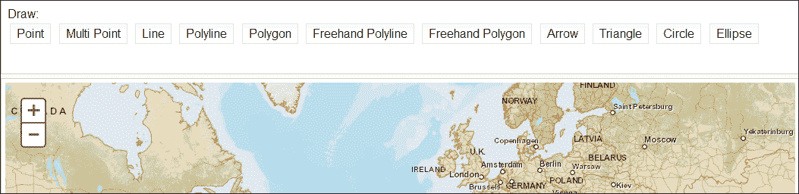

首先浏览前面的屏幕截图，您可能会认为绘图工具栏只是一个您可以放入应用程序中的用户界面组件，但实际情况并非如此。ArcGIS API for JavaScript 提供了一个名为`esri/toolbars/Draw`的工具栏辅助类，以帮助完成此任务。此外，API 还提供了一个处理导航任务的类。这些辅助类的作用是为您节省绘制缩放框、捕获鼠标点击和其他用户发起的事件的工作。任何有经验的 GIS Web 开发人员都会告诉您，这并不是一件小事。将这些基本导航功能添加到 API 提供的辅助类中可以轻松节省数小时的开发工作。

在这一章中，我们将涵盖以下主题：

+   将工具栏添加到应用程序中

+   用户界面小部件

+   要素编辑

# 将工具栏添加到应用程序中

使用辅助类`Navigation`和`Draw`，API 提供了两种基本类型的工具栏，您可以将其添加到应用程序中。还有一个编辑工具栏，可用于通过 Web 浏览器编辑要素或图形。我们将在后面的章节中讨论这个工具栏。

## 创建工具栏的步骤

**Navigation**和**Draw**工具栏不仅仅是您可以放入应用程序中的用户界面组件。它们是辅助类，您需要采取几个步骤才能实际创建具有适当按钮的工具栏。对于工具栏的待办事项清单可能看起来有点令人生畏，但做一两次后，它就变得非常简单。以下是执行此操作的步骤，我们将详细讨论每一项：

1.  为每个按钮定义 CSS 样式。

1.  在工具栏内创建按钮。

1.  创建`esri/toolbars/Navigation`或`esri/toolbars/Draw`的实例。

1.  将按钮事件连接到处理程序函数。

### 定义 CSS 样式

您需要做的第一件事是为您打算在工具栏上包含的每个按钮定义 CSS 样式。工具栏上的每个按钮都需要一个图像、文本或两者，以及按钮的宽度和高度。这些属性都在 CSS 中定义在`<style>`标签内，如下面的代码片段所示。在下面的代码示例中，为`Navigation`工具栏定义了许多按钮。让我们来看一下**缩小**按钮，并跟随整个过程，以使事情变得更简单一些。我在下面的代码中突出显示了**缩小**按钮。与所有其他按钮一样，我们定义了一个用于按钮的图像（`nav_zoomout.png`），以及按钮的宽度和高度。此外，此样式的标识符被定义为`.zoomoutIcon`。

```js
<style type="text/css">
  @import"http://js.arcgis.com/3.7/js/dojo/dijit/themes/claro/claro.css";
    .zoominIcon{ background-image:url(images/nav_zoomin.png);width:16px; height:16px; }
 **.zoomoutIcon{ background-image:url(images/nav_zoomout.png);width:16px; height:16px; }**
    .zoomfullextIcon{ background-image:url(images/nav_fullextent.png); width:16px;height:16px; }
    .zoomprevIcon{ background-image:url(images/nav_previous.png); width:16px;height:16px; }
    .zoomnextIcon{ background-image:url(images/nav_next.png);width:16px; height:16px; }
    .panIcon{ background-image:url(images/nav_pan.png);width:16px; height:16px; }
    .deactivateIcon{ background-image:url(images/nav_decline.png); width:16px;height:16px; }
</style>
```

## 创建按钮

按钮可以在`<div>`容器内定义，该容器具有`BorderContainer`的`data-dojo-type`为`ContentPane` dijit，如下面的代码示例所示。在创建每个按钮时，你需要定义它应该引用的 CSS 样式以及按钮被点击时应该发生什么。按钮使用`iconClass`属性来引用 CSS 样式。在我们的示例中，**缩小**按钮的`iconClass`属性引用了我们之前定义的`zoomoutIcon`样式。`zoomoutIcon`样式定义了要用于按钮的图像以及按钮的宽度和高度。看一下下面的代码片段：

```js
<div id="mainWindow" data-dojo-type="dijit/layout/BorderContainer"data-dojo-props="design:'headline'">
  <div id="header"data-dojo-type="dijit/layout/ContentPane"data-dojo-props="region:'top'">
    <button data-dojo-type="dijit/form/Button"iconClass="zoominIcon">Zoom In</button>
 **<button data-dojo-type="dijit/form/Button"iconClass="zoomoutIcon" >Zoom Out</button>**
    <button data-dojo-type="dijit/form/Button"iconClass="zoomfullextIcon" >Full Extent</button>
    <button data-dojo-type ="dijit/form/Button"iconClass="zoomprevIcon" >Prev Extent</button>
    <button data-dojo-type="dijit/form/Button"iconClass="zoomnextIcon" >Next Extent</button>
    <button data-dojo-type="dijit/form/Button"iconClass="panIcon">Pan</button>
    <button data-dojo-type="dijit/form/Button"iconClass="deactivateIcon" >Deactivate</button>
  </div>
</div>
```

前面的代码块定义了工具栏上的按钮。每个按钮都是使用 Dijit（Dojo 的一个子项目）提供的`Button`用户界面控件创建的。每个控件都包含在网页的`<body>`标签内的`<button>`标签中，所有按钮都被包含在包含`ContentPane` dijit 的`<div>`标签中。

## 创建`Navigation`工具栏的实例

现在按钮的视觉界面已经完成，我们需要创建一个`esri/toolbars/Navigation`的实例，并连接事件和事件处理程序。创建`Navigation`类的实例就像调用构造函数并传入对`Map`的引用一样简单，很快你就会看到。但是，首先要确保添加对`esri/toolbars/navigation`的引用。以下代码示例添加了对`Navigation`工具栏的引用，创建了工具栏，将点击事件连接到按钮，并激活了工具。相关的代码行已经被突出显示和注释，以便你理解每个部分：

```js
<script>
  var map, **toolbar**, symbol, geomTask;

    require([
      "esri/map", 
      **"esri/toolbars/navigation",**
      "dojo/parser", "dijit/registry",

    "dijit/layout/BorderContainer", "dijit/layout/ContentPane", 
      "dijit/form/Button", "dojo/domReady!"
      ], function(
      Map, **Navigation**,
      parser, registry
    ) {
      parser.parse();

    map = new Map("map", {
      basemap: "streets",
      center: [-15.469, 36.428],
      zoom: 3
      });

      map.on("load", createToolbar);

    **// loop through all dijits, connect onClick event**
 **// listeners for buttons to activate navigation tools**
      **registry.forEach(function(d) {**
 **// d is a reference to a dijit**
 **// could be a layout container or a button**
 **if ( d.declaredClass === "dijit.form.Button" ) {**
 **d.on("click", activateTool);**
 **}**
 **});**

    **//activate tools**
      **function activateTool() {**
 **var tool = this.label.toUpperCase().replace(/ /g, "_");**
 **toolbar.activate(Navigation[tool]);**
 **}**

      **//create the Navigation toolbar**
      **function createToolbar(themap) {**
 **toolbar = new Navigation(map);**

      });
    </script>
```

希望前面的`Navigation`工具栏示例已经说明了通过 JavaScript API 向你的 Web 地图应用程序添加导航工具栏的步骤。你不再需要担心添加 JavaScript 代码来绘制和处理范围矩形或捕获鼠标坐标进行平移操作。此外，工具栏的用户界面组件可以通过 Dijit 库提供的各种用户界面控件轻松创建。`Draw`类同样可以轻松支持在类似工具栏中绘制点、线和多边形。

# 用户界面小部件

JavaScript API 提供了许多开箱即用的小部件，可以在应用程序中使用以提高生产力。包括`BasemapGallery`、`Bookmarks`、`Print`、`Geocoder`、`Gauge`、`Measurement`、`Popup`、`Legend`、`Scalebar`、`OverviewMap`、`Editor`、`Directions`、`HistogramTimeSlider`、`HomeButton`、`LayerSwipe`、`LocateButton`、`TimeSlider`和`Analysis`小部件。小部件与我们之前讨论的`Navigation`或`Draw`工具栏的按钮和工具不同。这些小部件是开箱即用的功能，你只需几行代码就可以将它们放入应用程序中，而不是工具栏，后者只是需要大量 HTML、CSS 和 JavaScript 代码的辅助类。

## `BasemapGallery`小部件

`BasemapGallery`小部件显示了来自[ArcGIS.com](http://ArcGIS.com)的基础地图集合和/或用户定义的地图或图像服务。从集合中选择一个基础地图时，当前的基础地图将被移除，新选择的基础地图将出现。当向基础地图库添加自定义地图时，它们需要与库中的其他图层具有相同的空间参考。当使用[ArcGIS.com](http://ArcGIS.com)的图层时，这将是 Web Mercator 参考，wkids 为 102100、102113 或 3857（wkids 是空间参考系统的唯一标识符）。出于性能原因，还建议所有基础地图都是切片图层。

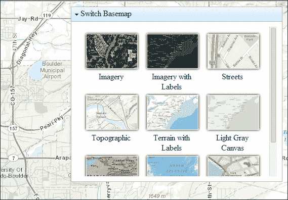

创建`BasemapGallery`小部件时，可以在构造函数中提供一些参数，如前面的屏幕截图所示，包括显示 ArcGIS 底图、定义一个或多个自定义底图以包含在库中、提供 Bing 地图密钥以及地图的引用等。创建`BasemapGallery`小部件后，需要调用`startup()`方法来准备用户交互。看一下以下的代码片段：

```js
require(["esri/dijit/Basemap", ... 
], function(Basemap, ... ) {
     var basemaps = [];
     var waterBasemap = new Basemap({
       layers: [waterTemplateLayer],
       title: "Water Template",
       thumbnailUrl: "images/waterThumb.png"
     });
     basemaps.push(waterBasemap);
...
});
```

在上一个代码示例中，创建了一个新的`Basemap`对象，其中包含标题、缩略图图像和一个包含单个图层的数组。然后将该`Basemap`对象推送到将添加到小部件中的底图数组中。

## 书签小部件

`Bookmarks`小部件用于向最终用户显示一组命名的地理范围。从小部件中点击书签名称将自动将地图范围设置为书签提供的范围。使用该小部件，您可以添加新书签，删除现有书签和更新书签。书签在 JavaScript 代码中定义为 JSON 对象，其中包含定义书签名称、范围和边界坐标的属性。要将书签添加到小部件中，您需要调用`Bookmark.addBookmark()`。看一下以下的屏幕截图：

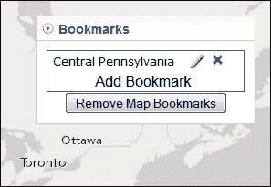

然后看一下以下的代码片段：

```js
require([
"esri/map", "esri/dijit/Bookmarks", "dojo/dom", ... 
], function(Map, Bookmarks, dom, ... ) {
     var map = new Map( ... );
     var bookmarks = new Bookmarks({
       map: map, 
       bookmarks: bookmarks
     }, dom.byId('bookmarks'));
...
});
```

在上一个代码示例中，创建了一个新的`Bookmarks`对象。它附加到地图，并添加了一个 JSON 格式的书签列表。

## 打印小部件

`Print`小部件是一个备受欢迎的工具，它简化了从 Web 应用程序打印地图的过程。它使用默认或用户定义的地图布局。该小部件需要使用 ArcGIS Server 10.1 或更高版本的导出 Web 地图任务。看一下以下的图：

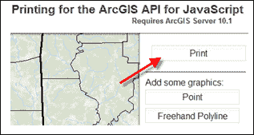

然后看一下以下的代码片段：

```js
require([
"esri/map", "esri/dijit/Print", "dojo/dom"... 
], function(Map, Print, dom, ... ) {
     var map = new Map( ... );
     var printer = new Print({
       map: map,
       url: "    http://servicesbeta4.esri.com/arcgis/rest/services/Utilities/ExportWebMap/GPServer/Export%20Web%20Map%20Task"
    }, dom.byId("printButton"));
...
});
```

在上一个代码示例中，创建了一个新的`Print`小部件。使用 URL 属性将小部件指向**Print**任务，并将小部件附加到页面上的 HTML 元素。

## 地理编码器小部件

地理编码器小部件允许您轻松地向应用程序添加地理编码功能。该小部件包括一个文本框，当最终用户开始输入地址时，结果会自动过滤。通过将`autoComplete`属性设置为`true`来启用自动完成。默认情况下，`Geocoder`小部件使用 ESRI World Locator 服务。您可以通过设置`geocoder`属性来更改这一点。看一下以下的屏幕截图：

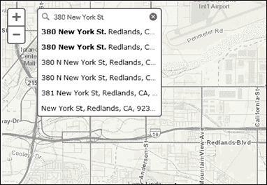

您还可以自动将值附加到用户输入的任何字符串中。例如，在本地应用程序中，您可能希望始终将特定城市和州附加到输入的任何地址中。这是通过`suffix`属性完成的。要使地图显示地理编码地址的位置，您可以将`autoNavigate`设置为`true`。从定位器返回多个潜在位置是完全可能的。您可以通过设置`maxLocations`属性来设置返回位置的最大数量。在接下来的练习中，您将学习如何将`Geocoder`小部件添加到您的应用程序中。

### 练习使用地理编码器小部件

在这个练习中，您将学习如何将`Geocoder`小部件添加到应用程序中。

1.  打开 ArcGIS JavaScript API Sandbox，网址为[`developers.arcgis.com/en/javascript/sandbox/sandbox.html`](http://developers.arcgis.com/en/javascript/sandbox/sandbox.html)。

1.  修改`<style>`标签，使其显示如下：

```js
<style>
html, body, #mapDiv {
height:100%;
width:100%;
margin:0;
padding:0;
}
body {
background-color:#FFF;
overflow:hidden;
font-family:"Trebuchet MS";
}
#search {
display: block;
position: absolute;
z-index: 2;
top: 20px;
left: 75px;
}
</style>
```

1.  从`<script>`标签中删除以下 JavaScript 内容，如下所示：

```js
<script>
**dojo.require("esri.map");**

**function init(){**
**var map = new esri.Map("mapDiv", {**
**center: [-56.049, 38.485],**
**zoom: 3,**
**basemap: "streets"**
 **});**
 **}**
**dojo.ready(init);**
</script>
```

1.  您已经有一个用于地图的`<div>`容器。在此步骤中，您将创建第二个`<div>`标记，用作“地理编码”小部件的容器。按照以下突出显示的代码添加小部件的容器。确保为`<div>`标记指定特定的`id`为`search`。这对应于我们在文件顶部定义的 CSS 样式，并在以下代码片段中突出显示。它将 HTML 的`<div>`标记连接到 CSS：

```js
<body class="tundra">
  <**div id="search"></div>**
  <div id="mapDiv"></div>
</body>
```

1.  创建变量来保存地图和`geocoder`对象，如下所示：

```js
<script>
**var map, geocoder;**
</script>
```

1.  在`<script>`标签中，添加`require()`函数并创建`Map`对象，如下所示：

```js
<script>
var map, geocoder;

**require([**
 **"esri/map", "esri/dijit/Geocoder", "dojo/domReady!"**
 **], function(Map, Geocoder) {**
**map = new Map("mapDiv",{**
**basemap: "streets",**
**center:[-98.496,29.430], //long, lat**
**zoom: 13** 
 **});**
 **});**
</script>
```

1.  按照以下方式创建地理编码小部件：

```js
require([
    "esri/map", "esri/dijit/Geocoder", "dojo/domReady!"
  ], function(Map, Geocoder) {
    map = new Map("map",{
        basemap: "streets",
        center:[-98.496,29.430], //long, lat
        zoom: 13 
    });

 **var geocoder = new Geocoder({**
 **map: map,**
 **autoComplete: true,**
 **arcgisGeocoder: {**
 **name: "Esri World Geocoder",**
 **suffix: " San Antonio, TX"**
 **}**
 **},"search");**
 **geocoder.startup();**

});
```

整个脚本应如下所示：

```js
<!DOCTYPE html>
<html>
<head>
<meta http-equiv="Content-Type" content="text/html;charset=utf-8">
<meta http-equiv="X-UA-Compatible" content="IE=7, IE=9,IE=10">
<meta name="viewport" content="initial-scale=1,maximum-scale=1,user-scalable=no"/>
<title>Geocoding Widget API for JavaScript | SimpleGeocoding</title>
<link rel="stylesheet"href="http://js.arcgis.com/3.7/js/esri/css/esri.css">
<style>
html, body, #mapDiv {
height:100%;
width:100%;
margin:0;
padding:0;
      }
      #search {
display: block;
position: absolute;
z-index: 2;
top: 20px;
left: 74px;
      }
</style>
<script src="http://js.arcgis.com/3.7/"></script>
<script>
var map, geocoder;

require([
        "esri/map", "esri/dijit/Geocoder", "dojo/domReady!"
      ], function(Map, Geocoder) {
map = new Map("mapDiv",{
basemap: "streets",
center:[-98.496,29.430], //long, lat
zoom: 13 
        });

var geocoder = new Geocoder({
map: map,
autoComplete: true,
arcgisGeocoder: {
name: "Esri World Geocoder",
suffix: " San Antonio, TX"
          }
        },"search");
geocoder.startup();

      });
</script>
</head>
<body>
<div id="search"></div>
<div id="mapDiv"></div>
</body>
</html>
```

1.  单击“运行”按钮执行代码。您应该看到类似以下屏幕截图的内容。注意“地理编码器”小部件。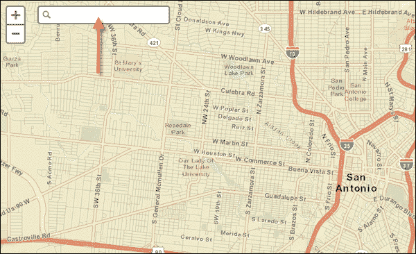

1.  开始输入“圣安东尼奥，德克萨斯州”的地址。您可以使用`1202 Sand Wedge`作为示例。在开始输入地址时，自动完成应该开始。当您看到地址时，请从列表中选择它。小部件将对地址进行地理编码，并将地图定位，使地址位于地图的中心，如下面的屏幕截图所示：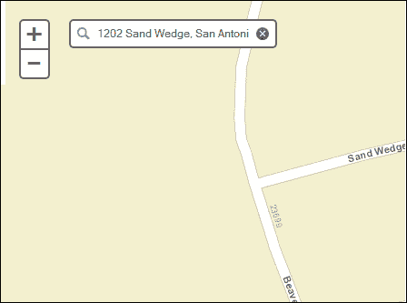

## 仪表小部件

“仪表”小部件在半圆仪表界面中显示来自`FeatureLayer`或`GraphicsLayer`的数字数据。您可以定义仪表指示器的颜色、驱动仪表的数字数据的字段、标签字段、引用的图层、最大数据值、标题等。请查看以下屏幕截图：

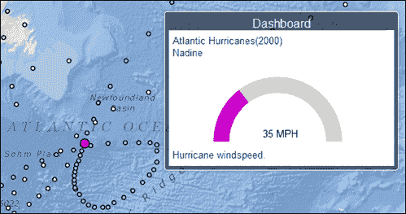

然后查看以下代码片段：

```js
require([
  "esri/dijit/Gauge", ... 
], function(Gauge, ... ) {
var gaugeParams = {
    "caption": "Hurricane windspeed.",
    "color": "#c0c",
    "dataField": "WINDSPEED", 
    "dataFormat": "value",
    "dataLabelField": "EVENTID",
    "layer": fl, //fl previously defined as FeatureLayer
    "maxDataValue": 120, 
    "noFeatureLabel": "No name",
    "title": "Atlantic Hurricanes(2000)",
    "unitLabel": "MPH"
  };
var gauge = new Gauge(gaugeParams, "gaugeDiv");
  ...
});
```

前面的代码示例显示了创建“仪表”小部件。许多参数被传递到仪表的构造函数中，包括标题、颜色、数据字段、图层、最大数据值等。

## 测量小部件

“测量”小部件提供了三种工具，使最终用户能够测量长度和面积，并获取鼠标的坐标。请查看以下屏幕截图：

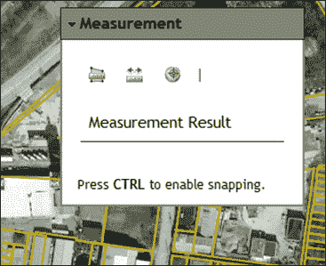

“测量”小部件还允许您更改测量单位，如下所示：

```js
var measurement = new Measurement({
  map: map
}, dom.byId("measurementDiv"));
measurement.startup();
```

前面的代码示例显示了如何创建“测量”小部件的实例并将其添加到应用程序中。

## 弹出小部件

“弹出”小部件在功能上类似于默认的信息窗口，用于显示有关要素或图形的属性信息。实际上，从 API 的 3.4 版本开始，该小部件现在是显示属性的默认窗口，而不是`infoWindow`参数。但是，它还包含其他功能，如缩放和突出显示要素、处理多个选择以及最大化窗口的按钮。界面还可以使用 CSS 进行样式设置。请参考以下屏幕截图，作为“弹出”小部件中可以显示的内容的示例。

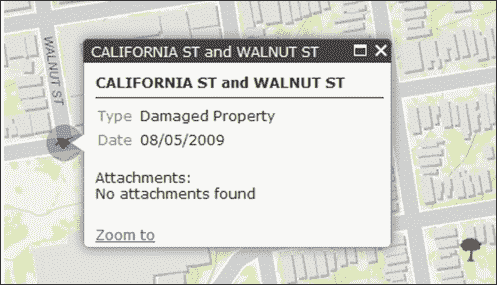

从版本 3.4 开始，“弹出”小部件支持以**从右到左**（**RTL**）方向呈现文本，以支持希伯来语和阿拉伯语等 RTL 语言。如果页面方向使用`dir`属性设置为 RTL，则 RTL 支持将自动应用。默认值为**从左到右**（**LTR**）。请查看以下代码片段：

```js
//define custom popup options
var popupOptions = {
  markerSymbol: new SimpleMarkerSymbol("circle", 32, null, new Color([0, 0, 0, 0.25])),
  marginLeft: "20", 
  marginTop: "20"
};
//create a popup to replace the map's info window
var popup = new Popup(popupOptions, dojo.create("div"));

map = new Map("map", {
  basemap: "topo",
  center: [-122.448, 37.788],
  zoom: 17,
  infoWindow: popup
});
```

在上一个代码示例中，创建了一个 JSON`popupOptions`对象来定义弹出窗口的符号和边距。然后将此`popupOptions`对象传递给`Popup`对象的构造函数。最后，将`Popup`对象传递给`infoWindow`参数，该参数指定应将`Popup`对象用作信息窗口。

## 图例小部件

`Legend`小部件显示地图中一些或所有图层的标签和符号。它具有尊重比例依赖性的能力，以便在缩放应用程序时，图例值更新以反映各种比例范围下的图层可见性。`Legend`小部件支持`ArcGISDynamicMapServiceLayer`、`ArcGISTiledMapServiceLayer`和`FeatureLayer`。

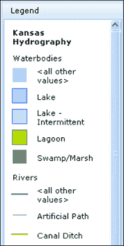

创建`Legend`小部件的新实例时，可以指定控制图例内容和显示特性的各种参数。`arrangement`参数可用于指定图例在其容器 HTML 元素中的对齐方式，并可定义为左对齐或右对齐。`autoUpdate`属性可设置为`true`或`false`，如果设置为`true`，则当地图比例尺发生变化或图层被添加或从地图中移除时，图例将自动更新其参数。`layerInfos`参数用于指定要在图例中使用的图层子集，`respectCurrentMapScale`可以设置为`true`，以根据每个图层的比例范围触发自动图例更新。最后，需要调用`startup()`方法来显示新创建的图例：

```js
var layerInfo = dojo.map(results, function(layer,index){return {layer: layer.layer,title: layer.layer.name};});if(layerInfo.length > 0){var legendDijit = new Legend({map: map,layerInfos: layerInfo},"legendDiv");legendDijit.startup();}
```

上述代码示例显示了如何创建一个图例小部件并将其添加到应用程序中。

## 概览地图小部件

`OverviewMap`小部件用于在较大区域的上下文中显示主地图的当前范围。此概览地图在主地图范围更改时更新。主地图的范围在概览地图中表示为一个矩形。此范围矩形也可以拖动以更改主地图的范围。

概览地图可以显示在主地图的一个角落，并在不使用时隐藏。它也可以放置在主地图窗口之外的`<div>`元素内，或者临时最大化，以便轻松访问感兴趣的远程区域。看一下下面的屏幕截图：


`OverviewMap`小部件在对象的构造函数中接受许多可选参数。这些参数允许您控制概览地图相对于主地图的放置位置、用于概览地图的基础图层、范围矩形的填充颜色、最大化按钮的外观以及概览地图的初始可见性。看一下下面的代码片段：

```js
var overviewMapDijit = new OverviewMap({map:map, visible:true});
overviewMapDijit.startup();
```

上述代码示例说明了创建`OverviewMap`小部件。

## 比例尺小部件

`Scalebar`小部件用于向地图或特定的 HTML 节点添加比例尺。`Scalebar`小部件以英制或公制值显示单位。从 API 的 3.4 版本开始，如果将`scalebarUnits`属性设置为`dual`，它可以同时显示英制和公制值。您还可以通过`attachTo`参数控制比例尺的位置。默认情况下，比例尺位于地图的左下角。看一下下面的屏幕截图：

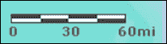

然后看一下下面的代码片段：

```js
var scalebar = new esri.dijit.Scalebar({map:map,scalebarUnit:'english'});
```

上述代码示例说明了使用英制单位创建`Scalebar`小部件。

## 方向小部件

`Directions`小部件使得计算两个或多个输入位置之间的方向变得容易。生成的方向，在下面的屏幕截图中显示，显示了详细的逐步转向说明和可选地图。如果地图与小部件关联，方向的路线和停靠点将显示在地图上。地图上显示的停靠点是交互式的，因此您可以单击它们以显示带有停靠点详细信息的弹出窗口，或者将停靠点拖动到新位置以重新计算路线。看一下下面的屏幕截图：

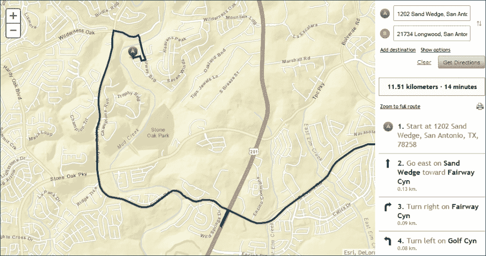

看一下下面的代码片段：

```js
var directions = new Directions({
map: map
},"dir");

directions.startup();
```

上一个代码示例显示了创建`Directions`对象。

## HistogramTimeSlider dijit

`HistogramTimeSlider` dijit 为地图上启用时间的图层提供了数据的直方图图表表示。通过 UI，用户可以使用`TimeSlider`小部件的扩展来临时控制数据的显示。

！[HistogramTimeSlider dijit]（graphics/7965OT_05_15.jpg）

看一下以下代码片段：

```js
require(["esri/dijit/HistogramTimeSlider", ... ],
function(HistogramTimeSlider, ... ){
  var slider = new HistogramTimeSlider({
    dateFormat: "DateFormat(selector: 'date', fullYear: true)",
    layers : [ layer ],
    mode: "show_all",
    timeInterval: "esriTimeUnitsYears"
  }, dojo.byId("histogram"));
  map.setTimeSlider(slider);
});
```

在上一个代码示例中，创建了一个`HistogramTimeSlider`对象并将其与地图关联。

## HomeButton 小部件

`HomeButton`小部件只是一个按钮，您可以将其添加到应用程序中，它将地图返回到初始范围。看一下以下截图：

！[HomeButton 小部件]（graphics/7965OT_05_16.jpg）

然后看一下以下代码片段：

```js
require([
      "esri/map", 
**"esri/dijit/HomeButton"**,
      "dojo/domReady!"
    ], function(
      Map, **HomeButton**
    )  {

var map = new Map("map", {
center: [-56.049, 38.485],
zoom: 3,
basemap: "streets"
      });

**var home = new HomeButton({**
**map: map**
 **}, "HomeButton");**
**home.startup();**

    });
```

上一个代码示例显示了创建`HomeButton`小部件。

## LocateButton 小部件

`LocateButton`小部件可用于查找并缩放到用户当前位置。此小部件使用地理位置 API 来查找用户当前位置。找到位置后，地图将缩放到该位置。该小部件提供选项，允许开发人员定义以下内容：

+   HTML5 地理位置提供了查找位置的选项，如`maximumAge`和`timeout`。 `timeout`属性定义了用于确定设备位置的最长时间，而`maximumAge`属性定义了在找到设备的新位置之前的最长时间。

+   定义自定义符号，用于在地图上突出显示用户当前位置的能力。

+   找到位置后要缩放的比例。！[LocateButton 小部件]（graphics/7965OT_05_17.jpg）

看一下以下代码片段：

```js
geoLocate = new LocateButton({
map: map,
highlightLocation: false
}, "LocateButton");
geoLocate.startup();
```

上一个代码示例显示了如何创建`LocateButton`小部件的实例并将其添加到地图中。

## TimeSlider 小部件

`TimeSlider`小部件用于可视化启用时间的图层。 `TimeSlider`小部件配置为具有两个拇指，因此仅显示两个拇指位置的时间范围内的数据。 `setThumbIndexes（）`方法确定每个拇指的初始位置。在这种情况下，在初始开始时间添加了一个拇指，另一个拇指定位在更高的时间步骤。看一下以下屏幕截图：

！[TimeSlider 小部件]（graphics/7965OT_05_18.jpg）

看一下以下代码片段：

```js
var timeSlider = new TimeSlider({
style: "width: 100%;"
}, dom.byId("timeSliderDiv"));
map.setTimeSlider(timeSlider);

var timeExtent = new TimeExtent();
timeExtent.startTime = new Date("1/1/1921 UTC");
timeExtent.endTime = new Date("12/31/2009 UTC");
timeSlider.setThumbCount(2);
timeSlider.createTimeStopsByTimeInterval(timeExtent, 2, "esriTimeUnitsYears");
timeSlider.setThumbIndexes([0,1]);
timeSlider.setThumbMovingRate(2000);
timeSlider.startup
```

上面的代码示例说明了如何创建`TimeSlider`对象的实例并设置各种属性，包括开始和结束时间。

## 图层滑动小部件

`LayerSwipe`小部件提供了一个简单的工具，用于在地图顶部显示图层或图层的一部分。您可以使用此小部件在地图上显示一个或多个图层的内容，以便比较多个图层的内容。该小部件提供水平，垂直和范围查看模式。

！[LayerSwipe 小部件]（graphics/7965OT_05_19.jpg）

看一下以下代码片段：

```js
varswipeWidget = new LayerSwipe({
type: "vertical",
map: map,
layers: [swipeLayer]
}, "swipeDiv");
swipeWidget.startup();
```

上一个代码示例显示了如何创建`LayerSwipe`的实例并将其添加到地图中。

## 分析小部件

在 ArcGIS API for JavaScript 的 3.7 版本中引入了许多新的分析小部件。分析小部件提供对 ArcGIS 空间分析服务的访问，允许您通过 API 对托管数据执行常见的空间分析。上一个屏幕截图显示了`SummarizeNearby`小部件的一部分，这是 12 个分析小部件之一。分析小部件包括以下 12 个小部件：

+   `AnalysisBase`

+   聚合点

+   创建缓冲区

+   创建驾驶时间区域

+   溶解边界

+   丰富图层

+   提取数据

+   查找热点

+   查找最近

+   合并图层

+   图层叠加

+   附近总结

+   `SummarizeWithin`

需要[ArcGIS.com](http://ArcGIS.com)订阅才能使用这些小部件。您不仅需要使用您的[ArcGIS.com](http://ArcGIS.com)帐户存储数据，还需要登录以作为基于信用的服务运行分析作业。执行分析任务和托管要素服务对个人帐户用户不可用。

# 特性编辑

当使用企业地理数据库格式存储的数据时，ArcGIS API for JavaScript 支持简单要素编辑。这意味着您的数据需要存储在由 ArcSDE 管理的企业地理数据库中。

编辑工作基于“最后提交者获胜”的概念。例如，如果两个人正在编辑图层中的同一要素，并且两者都提交了修改，最后提交更改的编辑者将覆盖第一个编辑者所做的任何更改。显然，在某些情况下，这可能会造成问题，因此在实现应用程序中的编辑之前，您需要检查您的数据可能受到的影响。

编辑的其他特性包括对域和子类型的支持，模板样式编辑以及编辑独立表和附件的能力。要使用编辑选项，您需要使用`FeatureService`和`FeatureLayer`。编辑请求通过 HTTP post 请求提交到服务器，大多数情况下需要使用代理。

编辑支持包括要素编辑，包括创建和删除简单要素，以及通过移动、切割、联合或重塑来修改要素的能力。此外，要素属性可以被编辑，文档可以附加到要素，并且可以向要素添加评论。

## 要素服务

Web 编辑需要要素服务来提供数据的符号和要素几何。要素服务只是启用了要素访问功能的地图服务。此功能允许地图服务以便于 Web 应用程序使用和更新的方式公开要素几何和它们的符号。

在构建 Web 编辑应用程序之前，您需要做一些工作来创建一个公开要进行编辑的图层的要素服务。这涉及设置地图文档，并可选择定义一些编辑模板。模板允许您预先配置一些常用要素类型的符号和属性。例如，为了准备编辑流，您可以为“主要河流”、“次要河流”、“小溪”和“支流”配置模板。模板是可选的，但它们使应用程序的最终用户轻松创建常见要素。

完成地图后，您需要将其发布到启用了要素访问功能的 ArcGIS Server。这将创建 REST URL 或端点，用于地图服务和要素服务。您将使用这些 URL 在应用程序中引用服务。

通过`FeatureLayer`对象，Web API 可以访问要素服务，我们在之前的章节中已经进行了检查。要素图层可以执行各种操作，并且可以引用地图服务或要素服务。但是，当您将`FeatureLayer`用于编辑目的时，您需要引用要素服务。

通过编辑功能，您的 Web 应用程序告诉`FeatureLayer`哪些属性已更改，以及（如果适用）几何图形如何更改。`FeatureLayer`对象还在编辑后显示更新的要素。您可以在要素图层上调用`applyEdits()`方法来应用编辑，然后将其提交到数据库。

## 编辑小部件

ArcGIS API for JavaScript 提供了小部件，使您更容易将编辑功能添加到您的 Web 应用程序中。这些小部件包括`Editor`、`TemplatePicker`、`AttributeInspector`和`AttachmentEditor`小部件。`Editor`小部件是默认的编辑界面，包括您编辑图层所需的一切，并允许您选择可用的工具的数量和类型。`TemplatePicker`显示一个预配置的模板，其中包含地图文档中每个图层的符号。这种模板样式编辑允许用户简单地选择一个图层并开始编辑。`AttributeInspector`小部件提供了一个界面，用于编辑要素的属性，并确保有效的数据输入。最后，`AttachmentEditor`将可下载文件与要素关联起来。我们将更详细地研究这些小部件。

### 编辑器小部件

`Editor`小部件显示在以下截图中，提供了 API 包含的默认编辑界面。它结合了其他小部件的功能，为您提供了编辑图层所需的一切。您可以选择小部件上可用的工具的数量和类型。

`Editor`小部件在进行编辑后立即保存您的编辑，例如，当您完成绘制一个点时。如果您决定不使用`Editor`小部件，您必须确定何时以及多久应用编辑。看一下以下截图：

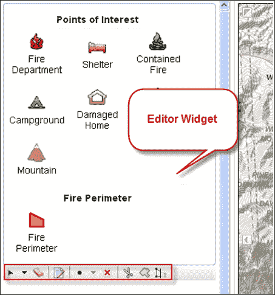

在以下代码示例中，通过将`params`对象传递到构造函数中来创建一个新的`Editor`对象。输入的`params`对象是开发人员定义编辑应用程序功能的地方。在这种情况下，只定义了必需的选项。必需的选项是地图、要编辑的要素图层和几何服务的 URL。看一下以下代码片段：

```js
var settings = {map: map,
  geometryService: new GeometryService("http://servicesbeta.esri.com/arcgis/rest/services/Geometry/GeometryServer"),layerInfos:featureLayerInfos};

var params = {settings: settings};**var editorWidget = new Editor(params);editorWidget.startup();**

```

`Editor`小部件使用要素服务中的可编辑图层提供开箱即用的编辑功能。它结合了开箱即用的`TemplatePicker`、`AttachmentEditor`、`AttributeInspector`和`GeometryService`，以提供要素和属性编辑。对于大多数编辑应用程序，您应该利用`Editor`小部件。该小部件允许您执行以下图表中列出的所有功能：

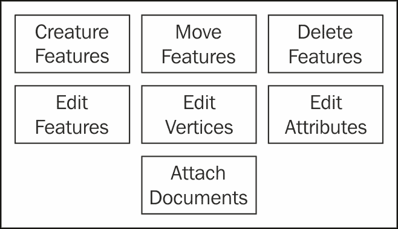

要在您的代码中使用`Editor`小部件，您需要首先使用`dojo.require`加载小部件。创建`Editor`的新实例所需的参数包括对`Map`对象和几何服务的引用。

### 模板选择器小部件

`TemplatePicker`小部件向用户显示了一组预配置的要素，每个要素都代表服务中的一个图层。通过从模板中选择一个符号，然后单击地图来添加要素，编辑可以非常简单地启动。模板中显示的符号来自您在要素服务的源地图中定义的编辑模板或应用程序中定义的符号。`TemplatePicker`也可以用作简单的图例。看一下以下截图：

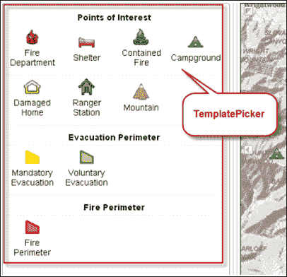

看一下以下代码片段：

```js
function initEditing(results) {var templateLayers = dojo.map(results,function(result){return result.layer;});**var templatePicker = new TemplatePicker({featureLayers: templateLayers,grouping: false,rows: 'auto',columns: 3},'editorDiv');templatePicker.startup();**var layerInfos = dojo.map(results, function(result) {return {'featureLayer':result.layer};});var settings = {map: map,**templatePicker: templatePicker,**layerInfos:layerInfos};var params = {settings: settings};var editorWidget = new Editor(params);editorWidget.startup();}
```

在上一个代码示例中，创建了一个新的`TemplatePicker`对象并将其附加到`Editor`小部件上。

### 属性检查器小部件

如下截图所示，`AttributeInspector`小部件为在 Web 上编辑要素属性提供了一个界面。它还通过将输入与预期数据类型进行匹配来确保用户输入的数据有效。还支持域。例如，如果对字段应用了编码值域，则允许的值会出现在下拉列表中，限制了输入其他值的可能性。如果字段需要日期值，则会出现一个日历，帮助用户提供有效的日期。看一下以下截图：

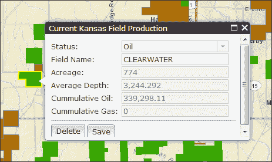

`AttributeInspector`小部件公开了图层上所有可用的属性以供编辑。如果要限制可用属性，必须编写自己的界面来输入和验证值。看一下以下代码片段：

```js
var layerInfos = [{
  'featureLayer': petroFieldsFL,
  'showAttachments': false,
  'isEditable': true,
  'fieldInfos': [
  {'fieldName': 'activeprod', 'isEditable':true, 'tooltip': 'Current Status', 'label':'Status:'},
  {'fieldName': 'field_name', 'isEditable':true, 'tooltip': 'The name of this oil field', 'label':'Field Name:'},
  {'fieldName': 'approxacre', 'isEditable':false,'label':'Acreage:'},
  {'fieldName': 'avgdepth', 'isEditable':false,'label':'Average Depth:'},
  {'fieldName': 'cumm_oil', 'isEditable':false,'label':'Cummulative Oil:'},
  {'fieldName': 'cumm_gas', 'isEditable':false,'label':'Cummulative Gas:'}
]
  }];

 **var attInspector = new AttributeInspector({**
 **layerInfos:layerInfos**
 **}, domConstruct.create("div"));**

  //add a save button next to the delete button
  var saveButton = new Button({ label: "Save", "class":"saveButton"});
 domConstruct.place(saveButton.domNode,attInspector.deleteBtn.domNode, "after");

saveButton.on("click", function(){
  updateFeature.getLayer().applyEdits(null, [updateFeature], null);    
});

**attInspector.on("attribute-change", function(evt) {**
 **//store the updates to apply when the save button is clicked** 
 **updateFeature.attributes[evt.fieldName] = evt.fieldValue;**
**});**

**attInspector.on("next", function(evt) {**
 **updateFeature = evt.feature;**
 **console.log("Next " + updateFeature.attributes.objectid);**
**});**

**attInspector.on("delete", function(evt){**
 **evt.feature.getLayer().applyEdits(null,null,[feature]);**
 **map.infoWindow.hide();**
**});**

map.infoWindow.setContent(attInspector.domNode);
map.infoWindow.resize(350, 240);
```

在上面的代码示例中，创建了一个`AttributeInspector`小部件并将其添加到应用程序中。此外，设置了几个事件处理程序，包括属性`change`、`next`和`delete`，以处理各种属性更改。

### AttachmentEditor 小部件

在某些情况下，您可能希望将可下载文件与要素关联起来。例如，您可能希望用户能够单击代表水表的要素并看到指向水表图像的链接。在 ArcGIS Web API 中，这样一个关联的可下载文件称为要素附件。

如下面的屏幕截图所示，`AttachmentEditor`小部件是一个帮助用户上传和查看要素附件的小部件。`AttachmentEditor`小部件包括当前附件的列表（带有**删除**按钮），以及一个**浏览**按钮，可用于上传更多附件。`AttachmentEditor`小部件在信息窗口内工作良好，但也可以放置在页面的其他位置。

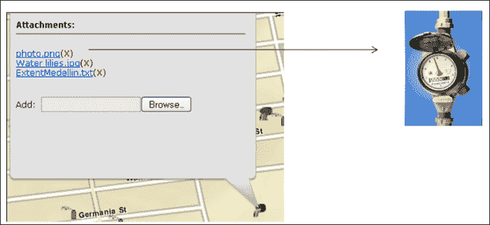

为了使用要素附件，必须在源要素类上启用附件。您可以在 ArcCatalog 或 ArcMap 中的**目录**窗口中为要素类启用附件。如果`Editor`小部件检测到附件已启用，它将包括`AttachmentEditor`。看一下以下代码片段：

```js
   var map;require(["esri/map","esri/layers/FeatureLayer",**"esri/dijit/editing/AttachmentEditor",**"esri/config","dojo/parser", "dojo/dom","dijit/layout/BorderContainer", "dijit/layout/ContentPane", "dojo/domReady!"], function(Map, FeatureLayer, **AttachmentEditor**, esriConfig,parser, dom) {parser.parse();// a proxy page is required to upload attachments// refer to "Using the Proxy Page" for more information:https://developers.arcgis.com/en/javascript/jshelp/ags_proxy.htmlesriConfig.defaults.io.proxyUrl = "/proxy";map = new Map("map", { basemap: "streets",center: [-122.427, 37.769],zoom: 17});map.on("load", mapLoaded);function mapLoaded() {var featureLayer = new FeatureLayer("http://sampleserver3.arcgisonline.com/ArcGIS/rest/services/SanFrancisco/311Incidents/FeatureServer/0",{mode: FeatureLayer.MODE_ONDEMAND});map.infoWindow.setContent("<div id='content' style='width:100%'></div>");map.infoWindow.resize(350,200);**var attachmentEditor = new AttachmentEditor({}, dom.byId("content"));attachmentEditor.startup();**featureLayer.on("click", function(evt) {var objectId = evt.graphic.attributes[featureLayer.objectIdField];map.infoWindow.setTitle(objectId);**attachmentEditor.showAttachments(evt.graphic,featureLayer);**map.infoWindow.show(evt.screenPoint, map.getInfoWindowAnchor(evt.screenPoint));});map.addLayer(featureLayer);}});
```

上面的代码显示了如何创建一个`AttachmentEditor`对象并将其添加到应用程序中。

### 编辑工具栏

有时您可能不想使用默认的`Editor`小部件，如下面的屏幕截图所示：

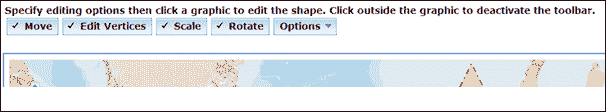

这些情况包括您希望编写自己的编辑逻辑，特别是关于客户端显示要素和图形的情况。在这些情况下，您可以使用**编辑**工具栏。**编辑**工具栏只是 API 的一部分，是一个 JavaScript 辅助类。它有助于放置和移动顶点和图形。这个工具栏类似于我们在本书前面讨论过的**导航**和**绘图**工具栏。

# 总结

小部件和工具栏为您的应用程序提供了一种简单的方式来添加预构建的功能，而无需编写大量代码。可用小部件的范围在 API 的各个版本中不断增加，预计在未来的版本中将提供许多新的小部件。工具栏与小部件类似，是提供导航、绘图功能和编辑工具功能的辅助类。但是，开发人员需要定义工具栏和按钮的外观。在下一章中，您将学习如何使用`Query`和`QueryTask`类创建空间和属性查询。
