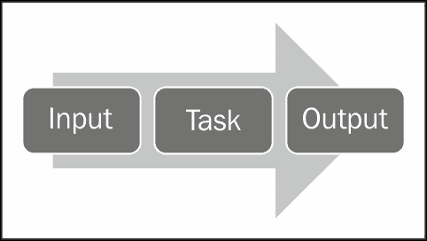
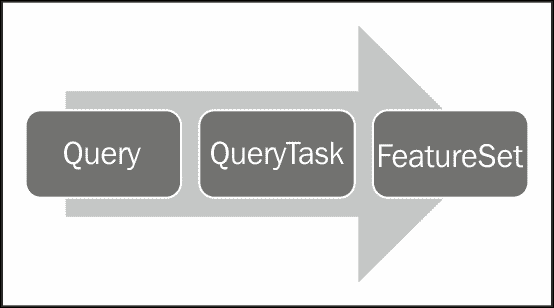
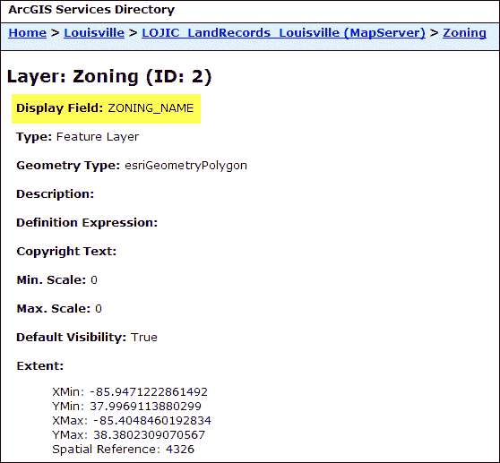
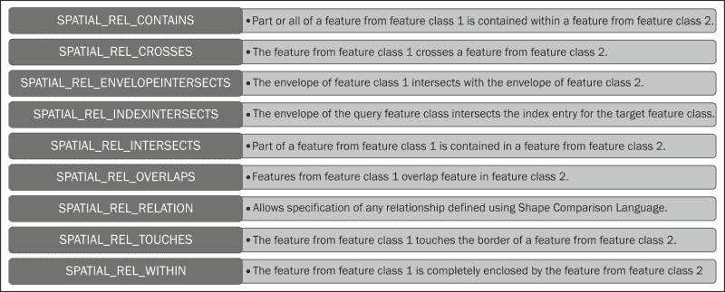
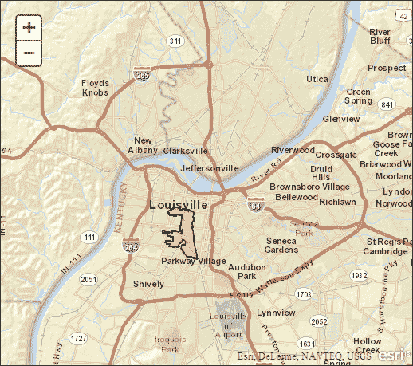

# 第六章：执行空间和属性查询

使用 ArcGIS Server 查询任务，您可以对地图服务中已公开的数据图层执行属性和空间查询。您还可以组合这些查询类型以执行组合的属性和空间查询。例如，您可能需要找到所有土地地块的评估价值大于 10 万美元并与百年洪水平面相交的情况。这将是一个包含空间和属性组件的组合查询的示例。在本章中，您将学习如何使用 ArcGIS API for JavaScript 中的`Query`、`QueryTask`和`FeatureSet`对象执行属性和空间查询。

本章将涵盖以下主题：

+   在 ArcGIS Server 中引入任务

+   属性和空间查询概述

+   查询对象

+   使用 QueryTask 执行查询

+   是时候练习空间查询了

# 在 ArcGIS Server 中引入任务

在本书的接下来的几章中，我们将讨论可以使用 ArcGIS API for JavaScript 执行的许多类型的任务。任务使您能够执行空间和属性查询，基于文本搜索查找要素，对地址进行地理编码，识别要素，并执行包括缓冲和距离测量在内的各种几何操作。所有任务都可以通过`esri/tasks`资源访问。

ArcGIS API for JavaScript 中的所有任务都遵循相同的模式。一旦您使用了一个或多个任务一段时间后，这种模式就很容易识别。输入对象用于向任务提供输入参数。使用这些输入参数，任务执行其特定功能，然后返回一个包含任务结果的输出对象。下图说明了每个任务如何接受输入参数对象并返回可在您的应用程序中使用的输出对象。



# 属性和空间查询概述

正如您将在其他任务中看到的那样，查询是使用一系列对象执行的，这些对象通常包括任务的输入、任务的执行以及从任务返回的结果集。属性或空间查询的输入参数存储在一个包含可以为查询设置的各种参数的`Query`对象中。`QueryTask`对象使用`Query`对象中提供的输入执行任务，并以`FeatureSet`对象的形式返回结果集，其中包含一系列`Graphic`要素，然后您可以在地图上绘制这些要素。

`Query`对象作为`QueryTask`的输入，由包括`geometry`、`where`和`text`在内的属性定义。`geometry`属性用于输入将在空间查询中使用的几何，可以是点、线或多边形几何。`where`属性用于定义属性查询，而`text`属性用于执行包含`like`运算符的`where`子句。`Query`对象还可以包含许多可选属性，包括定义作为查询结果返回的字段、返回几何的输出空间参考以及满足查询条件的要素的实际几何。



上图定义了创建属性和空间查询时将使用的对象序列。

## 查询对象

为了使`QueryTask`对象对地图服务中的图层执行查询，它需要使用`Query`对象定义的输入参数。输入参数定义查询是空间、属性还是两者的组合。属性查询可以由`where`或`text`属性定义。这些属性用于定义 SQL 属性查询。我们将在后面的部分中查看`Query.where`和`Query.text`之间的区别。

空间查询要求您设置`Query.geometry`属性以定义要在空间查询中使用的输入几何形状。

可以通过构造函数创建`Query`对象的新实例，如下面的代码示例所示：

```js
var query = new Query();
```

### 定义查询属性

正如我在本节的介绍中提到的，您可以在`Query`对象上设置各种参数。必须要么为属性查询（`Query.where`或`Query.text`）定义属性，要么为空间查询定义`Query.geometry`属性。您还可以同时使用属性和空间查询属性。

#### 属性查询

`Query`对象提供了两个属性，可以在属性查询中使用：`Query.where`和`Query.text`。在下面的代码示例中，我设置了`Query.where`属性，以便只返回`STATE_NAME`字段等于`'Texas'`的记录。这只是一个标准的 SQL 查询。请注意，我用引号括起了 Texas 这个词。在对文本列执行属性查询时，您需要用单引号或双引号括起要评估的文本。如果您对包含其他数据类型（如数字或布尔值）的列执行属性查询，则不需要这样做：

```js
query.where = "STATE_NAME = 'Texas'";
```

您还可以使用`Query.text`属性执行属性查询。这是一种使用`like`创建`where`子句的简便方法。查询中使用的字段是地图文档中定义的图层的显示字段。您可以在服务目录中确定图层的显示字段。下面的屏幕截图中说明了`ZONING_NAME`是显示字段。使用`Query.text`属性查询的就是这个显示字段。



```js
//Query.text uses the Display Name for the layer
query.text= stateName;
```

在下面的代码示例中，我们使用`query.text`执行属性查询，返回用户在网页上的表单字段中输入的州名的所有字段：

```js
query = new Query();
query.returnGeometry = false;
query.outFields = ['*'];
query.text = dom.byId("stateName").value;
queryTask.execute(query, showResults);
```

#### 空间查询

要对图层执行空间查询，您需要传递一个有效的几何对象用于空间过滤器，以及空间关系。有效的几何包括`Extent`、`Point`、`Polyline`和`Polygon`的实例。空间关系通过`Query.spatialRelationship`属性设置，并在查询期间应用。空间关系是通过以下常量值之一来定义的：`SPATIAL_REL_INTERESECTS`、`SPATIAL_REL_CONTAINS`、`SPATIAL_REL_CROSSES`、`SPATIAL_REL_ENVELOPE_INTERSECTS`、`SPATIAL_REL_OVERLAPS`、`SPATIAL_REL_TOUCHES`、`SPATIAL_REL_WITHIN`和`SPATIAL_REL_RELATION`。以下屏幕截图中的表描述了每个空间关系值：



以下代码示例将`Point`对象设置为传递到空间过滤器中的几何体，并设置空间关系：

```js
query.geometry = evt.mapPoint;
query.spatialRelationship = SPATIAL_REL_INTERSECTS;
```

#### 限制返回的字段

出于性能原因，您应该限制在`FeatureSet`对象中返回的字段，只返回应用程序中需要的字段。附加到`FeatureSet`对象的每一列信息都是必须从服务器传递到浏览器的额外数据，这可能导致您的应用程序执行速度比应该慢。要限制返回的字段，您可以将包含应该返回的字段列表的数组分配给`Query.outFields`属性，如下面的代码示例所示。要返回所有字段，可以使用`outFields = ['*']`。

此外，您可以通过`Query.returnGeometry`属性控制每个要素的几何返回。默认情况下，将返回几何；但是，在某些情况下，您的应用程序可能不需要几何。例如，如果您需要使用图层的属性信息填充表格，则不一定需要几何。在这种情况下，您可以设置`Query.returnGeometry = false`：

```js
query.outFields = ["NAME", "POP2000", "POP2007", "POP00_SQMI", "POP07_SQMI"];
query.returnGeometry = false;
```

## 使用 QueryTask 执行查询

一旦您在`Query`对象中定义了输入属性，就可以使用`QueryTask`执行查询。在执行查询之前，必须首先创建`QueryTask`对象的实例。通过在对象的构造函数中传递要对其执行查询的图层的 URL 来创建`QueryTask`对象。以下代码示例显示了如何创建`QueryTask`对象。请注意，它在 URL 的末尾包含一个索引编号，该索引编号引用地图服务中的特定图层进行查询：

```js
myQueryTask = new QueryTask("http://sampleserver1.arcgisonline.com/ArcGIS/rest/services/Demographics/ESRI_CENSUS_USA/MapServer/5");
```

创建后，`QueryTask`对象可用于使用`QueryTask.execute()`方法对具有输入`Query`对象的图层执行查询。`QueryTask.execute()`接受三个参数，包括输入的`Query`对象以及成功和错误回调函数。`QueryTask.execute()`的语法在以下代码中提供。输入的`Query`对象作为第一个参数传递：

```js
QueryTask.execute(parameters,callback?,errback?)
```

假设查询在没有任何错误的情况下执行，将调用成功的回调函数，并将`FeatureSet`对象传递到函数中。如果在执行查询期间发生错误，则会执行错误回调函数。成功和错误回调函数都是可选的；但是，您应该始终定义函数来处理这两种情况。

此时，您可能想知道这些`callback`和`errback`函数。ArcGIS Server 中的大多数任务返回`dojo/Deferred`的实例。`Deferred`对象是一个类，用作在`Dojo`中管理异步线程的基础。ArcGIS Server 中的任务可以是同步的，也可以是异步的。

异步和同步定义了客户端（使用任务的应用程序）与服务器交互并从任务中获取结果的方式。当服务设置为同步时，客户端等待任务完成。通常，同步任务执行速度快（几秒钟或更短）。异步任务通常需要更长时间来执行，客户端不等待任务完成。用户可以在任务执行时继续使用应用程序。当服务器上的任务完成时，它调用回调函数并将结果传递到该函数中，然后可以以某种方式使用这些结果。它们通常显示在地图上。

让我们看一个更完整的代码示例。在以下代码示例中，请注意我们首先创建一个名为`myQueryTask`的新变量，它指向`ESRI_CENSUS_USA`地图服务中的第 6 层（索引编号基于`0`）。然后，我们创建包含查询输入属性的`Query`对象，最后，我们使用`QueryTask`上的`execute()`方法执行查询。`execute()`方法返回一个包含查询结果的`FeatureSet`对象，并且这些要素通过在`execute()`方法中指定的`showResults`回调函数进行处理。如果在执行任务期间发生错误，则将调用`errorCallback()`函数：

```js
**myQueryTask = new QueryTask("http://sampleserver1.arcgisonline.com/ArcGIS/rest/services/Demographics/ESRI_CENSUS_USA/MapServer/5");**
//build query filter
myQuery = new Query();
myQuery.returnGeometry = false;
myQuery.outFields = ["STATE_NAME", "POP2007", "MALES", "FEMALES"];
myQuery.text = 'Oregon';
//execute query
**myQueryTask.execute(myQuery, showResults, errorCallback);**
function showResults(fs) {
    //do something with the results
    //they are returned as a featureset object
}

function errorCallback() {
  alert("An error occurred during task execution");
}
```

## 获取查询结果

正如我之前提到的，查询的结果存储在包含图形数组的`FeatureSet`对象中，如果需要，您可以在地图上绘制这些图形。

数组中的每个要素（图形）都可以包含几何、属性、符号和信息模板，如第三章中所述，“将图形添加到地图”。通常，这些要素被绘制在地图上作为图形。以下代码示例显示了在查询完成执行时执行的回调函数。`FeatureSet`对象被传递到回调函数中，并在地图上绘制图形：

```js
function addPolysToMap(featureSet) {
  var features = featureSet.features;
  var feature;
  for (i=0, il=features.length; i<il; i++) {
    feature = features[i];
    attributes = feature.attributes;
    pop = attributes.POP90_SQMI;
    map.graphics.add(features[i].setSymbol(sym));
  }
}
```

# 练习空间查询的时间

在这个练习中，您将学习如何使用 ArcGIS API for JavaScript 中的`Query`、`QueryTask`和`FeatureSet`对象执行空间查询。使用波特兰市的 Zoning 图层，您将查询地块记录并在地图上显示结果。

执行以下步骤完成练习：

1.  在[`developers.arcgis.com/en/javascript/sandbox/sandbox.html`](http://developers.arcgis.com/en/javascript/sandbox/sandbox.html)上打开 JavaScript 沙盒。

1.  从以下代码片段中我标记的`<script>`标签中删除 JavaScript 内容：

```js
<script>
**dojo.require("esri.map");**

**function init(){**
**var map = new esri.Map("mapDiv", {**
**center: [-56.049, 38.485],**
**zoom: 3,**
**basemap: "streets"**
 **});**
 **}**
**dojo.ready(init);**
</script>
```

1.  创建应用程序中将使用的变量。

```js
<script>
**var map, query, queryTask;**
**var symbol, infoTemplate**;
</script>
```

1.  添加如下标记的`require()`函数：

```js
<script>
  var map, query, queryTask;
  var symbol, infoTemplate;

 **require([**
 **"esri/map", "esri/tasks/query", "esri/tasks/QueryTask","esri/tasks/FeatureSet", "esri/symbols/SimpleFillSymbol",**
 **"esri/symbols/SimpleLineSymbol", "esri/InfoTemplate","dojo/_base/Color", "dojo/on", "dojo/domReady!"**
 **], function(Map, Query, QueryTask, FeatureSet,SimpleFillSymbol, SimpleLineSymbol, InfoTemplate, Color,on) {**

 **});**

</script>
```

1.  在`require()`函数内部，创建将在应用程序中使用的`Map`对象。地图将以肯塔基州路易斯维尔市为中心：

```js
require([
    "esri/map", "esri/tasks/query", "esri/tasks/QueryTask", "esri/tasks/FeatureSet", "esri/symbols/SimpleFillSymbol",
    "esri/symbols/SimpleLineSymbol", "esri/InfoTemplate", "dojo/_base/Color", "dojo/on", "dojo/domReady!"
  ], function(Map, Query, QueryTask, FeatureSet, SimpleFillSymbol, SimpleLineSymbol, InfoTemplate, Color, on) {

 **map = new Map("mapDiv",{**
 **basemap: "streets",**
 **center:[-85.748, 38.249], //long, lat**
 **zoom: 13** 
 **});**

})
```

1.  创建将用于显示查询结果的符号：

```js
require([
    "esri/map", "esri/tasks/query", "esri/tasks/QueryTask", "esri/tasks/FeatureSet", "esri/symbols/SimpleFillSymbol",
    "esri/symbols/SimpleLineSymbol", "esri/InfoTemplate", "dojo/_base/Color", "dojo/on", "dojo/domReady!"
  ], function(Map, Query, QueryTask, FeatureSet, SimpleFillSymbol, SimpleLineSymbol, InfoTemplate, Color, on) {
    map = new Map("map",{
      basemap: "streets",
      center:[-85.748, 38.249], //long, lat
      zoom: 13 
    });

  **symbol = new SimpleFillSymbol(SimpleFillSymbol.STYLE_SOLID,** 
 **new SimpleLineSymbol(SimpleLineSymbol.STYLE_SOLID, new Color([111, 0, 255]), 2), new Color([255,255,0,0.25]));**
 **infoTemplate = new InfoTemplate("${OBJECTID}", "${*}");**

});
```

1.  现在，在`require()`函数内部，我们将初始化`queryTask`变量，然后注册`QueryTask.complete`事件。添加以下标记的代码行：

```js
require([
    "esri/map", "esri/tasks/query", "esri/tasks/QueryTask", "esri/tasks/FeatureSet", "esri/symbols/SimpleFillSymbol",
    "esri/symbols/SimpleLineSymbol", "esri/InfoTemplate", "dojo/_base/Color", "dojo/on", "dojo/domReady!"
  ], function(Map, Query, QueryTask, FeatureSet, SimpleFillSymbol, SimpleLineSymbol, InfoTemplate, Color, on) {

    map = new Map("mapDiv",{
        basemap: "streets",
        center:[-85.748, 38.249], //long, lat
        zoom: 13 
    });

    symbol = new SimpleFillSymbol(SimpleFillSymbol.STYLE_SOLID,
    new SimpleLineSymbol(SimpleLineSymbol.STYLE_SOLID, new Color([111, 0, 255]), 2), new Color([255,255,0,0.25]));
    infoTemplate = new InfoTemplate("${OBJECTID}", "${*}");

 **queryTask = new QueryTask("http://sampleserver1.arcgisonline.com/ArcGIS/rest/services/Louisville/LOJIC_LandRecords_Louisville/MapServer/2");**
 **queryTask.on("complete", addToMap);**

});
```

`QueryTask`的构造函数必须是指向通过地图服务公开的数据图层的有效 URL 指针。在这种情况下，我们正在创建对 LOJIC_LandRecords_Louisville 地图服务中的 Zoning 图层的引用。这表明我们将对该图层执行查询。如果您还记得之前的章节，`dojo.on()`用于注册事件。在这种情况下，我们正在为我们的新`QueryTask`对象注册`complete`事件。当查询完成时，此事件将触发，并且在这种情况下将调用作为`on()`参数指定的`addToMap()`函数。

1.  现在我们将通过创建`Query`对象来定义任务的输入参数。在第一行中，我们创建一个新的`Query`实例，然后设置`Query.returnGeometry`和`Query.outFields`属性。将`Query.returnGeometry`设置为`true`表示 ArcGIS Server 应返回与查询匹配的要素的几何定义，而在`Query.outFields`中，我们指定了一个通配符，表示应返回与查询结果相关的 Zoning 图层的所有字段。在上一步中输入的代码下面添加以下标记的代码行：

```js
require([
"esri/map", "esri/tasks/query", "esri/tasks/QueryTask", "esri/tasks/FeatureSet", "esri/symbols/SimpleFillSymbol",
"esri/symbols/SimpleLineSymbol", "esri/InfoTemplate", "dojo/_base/Color", "dojo/on", "dojo/domReady!"
], function(Map, Query, QueryTask, FeatureSet, SimpleFillSymbol, SimpleLineSymbol, InfoTemplate, Color, on) {
  map = new Map("mapDiv",{
      basemap: "streets",
      center:[-85.748, 38.249], //long, lat
      zoom: 13 
  });

  symbol = new SimpleFillSymbol(SimpleFillSymbol.STYLE_SOLID,
  new SimpleLineSymbol(SimpleLineSymbol.STYLE_SOLID, new Color([111, 0, 255]), 2), new Color([255,255,0,0.25]));
  infoTemplate = new InfoTemplate("${OBJECTID}", "${*}");

    queryTask = new QueryTask("http://sampleserver1.arcgisonline.com/ArcGIS/rest/services/Louisville/LOJIC_LandRecords_Louisville/MapServer/2");
    queryTask.on("complete", addToMap);

 **query = new Query();**
 **query.returnGeometry = true;**
 **query.outFields = ["*"];**

});
```

1.  添加一行代码，将`Map.click`事件注册到`doQuery`函数。`doQuery`函数将接收用户在地图上点击的点。这个地图点将被用作空间查询中的几何体。在下一步中，我们将创建`doQuery`函数，该函数将接受地图上点击的点：

```js
require([
        "esri/map", "esri/tasks/query", "esri/tasks/QueryTask", "esri/tasks/FeatureSet", "esri/symbols/SimpleFillSymbol", 
        "esri/symbols/SimpleLineSymbol", "esri/InfoTemplate",  "dojo/_base/Color", "dojo/on", "dojo/domReady!"
        ], function(Map, Query, QueryTask, FeatureSet, SimpleFillSymbol, SimpleLineSymbol, InfoTemplate, Color, on) {

map = new Map("mapDiv",{
  basemap: "streets",
  center:[-85.748, 38.249], //long, lat
  zoom: 13 
});

symbol = new SimpleFillSymbol(SimpleFillSymbol.STYLE_SOLID, 
    new SimpleLineSymbol(SimpleLineSymbol.STYLE_SOLID, newColor([111, 0, 255]), 2), new Color([255,255,0,0.25]));
infoTemplate = new InfoTemplate("${OBJECTID}", "${*}");

**map.on("click", doQuery);**

queryTask = new QueryTask("http://sampleserver1.arcgisonline.com/ArcGIS/rest/services/Louisville/LOJIC_LandRecords_Louisville/MapServer/2");
queryTask.on("complete", addToMap);

**query = new Query();**
**query.returnGeometry = true;**
**query.outFields = ["*"];**

});
```

1.  现在我们将创建`doQuery`函数，该函数使用在`require()`函数中设置的`Query`属性以及用户在地图上点击的地图点执行`QueryTask`。`doQuery`函数接受在地图上点击的点，可以使用`mapPoint`属性检索。`mapPoint`属性返回一个`Point`对象，然后用于设置`Query.geometry`属性，该属性将用于查找用户在地图上点击的分区地块。最后，执行`QueryTask.execute()`方法。任务执行后，将返回包含与查询匹配的记录的`FeatureSet`对象。现在的问题是结果返回在哪里？在`require()`函数的闭合大括号下面添加以下代码块：

```js
function doQuery(evt) {
    //clear currently displayed results
    map.graphics.clear();

    query.geometry = evt.mapPoint;
    query.outSpatialReference = map.spatialReference;
    queryTask.execute(query);
}
```

1.  记住，我们注册了`QueryTask.complete`事件来运行`addToMap()`函数。我们还没有创建这个函数。添加以下代码来创建`addToMap()`函数。此函数将接受作为查询结果返回的`FeatureSet`对象，并在地图上绘制要素。还要注意为要素定义了信息模板。这将创建一个`InfoWindow`对象来显示返回要素的属性：

```js
function addToMap(results) {
  var featureArray = results.featureSet.features;
  var feature = featureArray[0];
  map.graphics.add(feature.setSymbol(symbol).setInfoTemplate(infoTemplate));
}
```

您可以在`spatialquery.html`文件中查看此练习的解决方案代码。

1.  单击**运行**按钮来执行代码。您应该会看到以下截图中的地图。如果没有，请检查您的代码是否准确。

单击地图上的任意位置来运行查询。您应该会看到高亮显示的分区多边形，类似于您在以下截图中看到的：



现在，单击高亮显示的分区多边形以显示详细的信息窗口，其中包含与多边形相关联的属性。


在刚刚完成的任务中，您学会了如何使用`Query`和`QueryTask`对象创建一个空间查询，以定位用户在地图上点击的点所相交的分区多边形。

# 摘要

在这一章中，我们介绍了 ArcGIS Server 中任务的概念。ArcGIS Server 为 Web 地图应用程序中常用操作提供了许多任务。属性和空间查询是 Web 地图应用程序中常见的操作。为了支持这些查询，ArcGIS API for JavaScript 提供了一个`QueryTask`对象，可以用来在服务器上执行这些查询。创建时，`QueryTask`对象接受一个指向地图服务器中将被查询的图层的 URL。通过`Query`对象提供了`QueryTask`的各种输入参数。输入参数可以包括`where`属性来执行属性查询，`geometry`属性来执行空间查询，`outFields`属性来定义应该返回的字段集，以及其他一些支持属性。在服务器上完成查询后，将`FeatureSet`对象返回给应用程序中定义的回调函数。回调函数可以显示`FeatureSet`（它只是一个`Graphic`对象数组）在地图上。在下一章中，您将学习如何使用另外两个任务：`IdentifyTask`和`FindTask`。两者都可以用来返回要素的属性。
