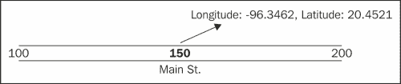
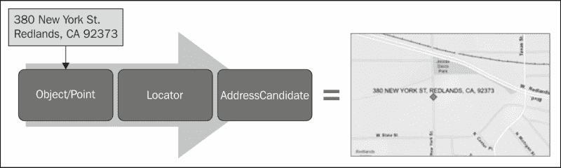
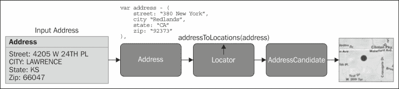
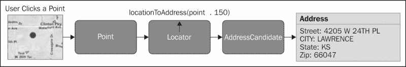
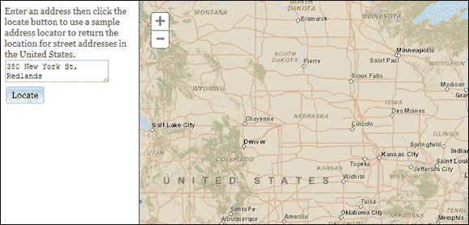
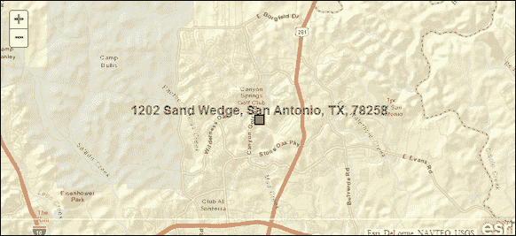

# 第八章：将地址转换为点和将点转换为地址

在 Web 地图应用程序中，绘制地址或感兴趣点在地图上是最常用的功能之一。要在地图上将地址绘制为一个点，首先需要获取纬度和经度坐标。地理编码是将物理地址转换为地理坐标的过程。为了将您的地址添加到地图上，它们必须经过一个将坐标分配给地址的地理编码过程。在 ArcGIS Server 中，地理编码是通过使用定位器服务来实现的，并通过 ArcGIS Server JavaScript API 中的`Locator`类来执行，该类访问这些服务以提供地址匹配功能以及反向地理编码。与 ArcGIS Server 提供的其他任务一样，地理编码需要各种输入参数，包括一个`Address`对象来匹配地址，或者在反向地理编码的情况下是一个`Point`对象。然后，这些信息被提交到地理编码服务，并返回一个包含地址匹配的`AddressCandidate`对象，然后可以在地图上绘制。

在本章中，我们将涵盖以下主题：

+   介绍地理编码

+   在 ArcGIS API for JavaScript 中使用定位器服务进行地理编码

+   地理编码过程

+   反向地理编码过程

+   练习定位器服务的时间

# 介绍地理编码

我们首先来看一个地理编码的例子，以便让您更好地了解这个过程。如果您有一个位于 Main St 150 号的地址，您必须先对该地址进行地理编码，然后才能将其绘制为地图上的一个点。如果 150 Main St 位于一个地址范围为 100 到 200 Main St 的街道段上，地理编码过程将会插值 150 Main St 的位置，使其正好位于这个街道段的中间。然后，地理编码软件将 150 Main St 分配给对应于 100 和 200 Main St 之间中点的地理位置。现在您已经有了该地址的坐标，可以在地图上绘制它。这个过程在下图中描述：



最常见的地理编码级别是街道段地理编码，它根据已知的地理编码在包含地址的街区或街道段的交叉口上分配纬度/经度坐标。这种地理编码方法使用了前面描述的插值过程。这种方法在地址间隔规则的城市地区中最准确。然而，它在准确地地理编码间隔不规则的地址和位于死胡同中的地址时存在问题。农村地区的坐标也因为不完整而臭名昭著，这导致这些地区的地理编码率较低。

# 在 ArcGIS API for JavaScript 中使用定位器服务进行地理编码

ArcGIS Server 的`Locator`服务可以执行地理编码和反向地理编码。使用 ArcGIS Server API for JavaScript，您可以将地址提交给`Locator`服务，并检索地址的地理坐标，然后可以在地图上绘制。以下图示了这个过程。一个由 JavaScript 中的 JSON 对象定义的地址是`Locator`对象的输入，它对地址进行地理编码，并将结果返回到一个`AddressCandidate`对象中，然后可以在地图上显示为一个点。这种模式与我们在前几章中看到的其他任务相同，其中一个输入对象（`Address`对象）为任务（`Locator`）提供输入参数，该任务将作业提交给 ArcGIS Server。然后，结果对象（`AddressCandidate`）被返回到一个回调函数中，该函数处理返回的数据。



## 输入参数对象

`Locator`任务的输入参数对象将采用地理编码的 JSON 地址对象或反向地理编码的`Point`对象的形式。从编程的角度来看，这些对象的创建方式不同。我们将在下一节讨论每个对象。

### 输入 JSON 地址对象

`Locator`服务可以接受`Point`（用于反向地理编码）或代表地址的`JSON`对象。JSON 对象定义了一个以对象形式格式化的地址，如下面的代码示例所示。该地址被定义为一系列在括号内定义的名称/值对，在这种情况下，名称/值对为街道、城市、州和邮政编码，但名称/值对将根据您在定位器中定义的地理编码服务的类型而变化。

```js
var address = {
    street: "380 New York",
    city: "Redlands",
    state: "CA",
    zip: "92373"
}
```

### 输入 Point 对象

对于反向地理编码，`Locator`服务的输入采用`esri/geometry/Point`对象的形式，通常是通过用户在地图上的点击或应用程序逻辑来定义。`Point`对象通过`Map.click`事件返回，可以被检索并用作`Locator`服务的输入对象。

## 定位器对象

`Locator`类包含可用于使用输入`Point`或`Address`对象执行地理编码或反向地理编码操作的方法和事件。`Locator`需要一个指向您在 ArcGIS Server 中定义的地理编码服务的 URL 指针。下面是一个代码示例，展示了如何创建`Locator`对象的新实例：

```js
var locator = new Locator("http://sampleserver1.arcgisonline.com/ArcGIS/rest/services/Locators/ESRI_Geocode_USA/GeocodeServer")
```

一旦创建了`Locator`类的新实例，就可以调用`addressToLocations()`方法对地址进行地理编码，或者调用`locationToAddress()`方法执行反向地理编码。这些方法会在操作完成时触发一个事件。在地址地理编码的情况下，会触发`address-to-locations-complete()`事件，在反向地理编码操作完成时会触发`on-location-to-address-complete()`事件。在任何情况下，然后会将`AddressCandidate`对象返回给事件。

### AddressCandidate 对象

`AddressCandidate`对象是`Locator`操作的结果。该对象中存储了各种属性，包括地址、属性、位置和分数。属性属性包含字段名称和值的名称/值对。位置是候选地址的 x 和 y 坐标。分数属性是一个介于 0 和 100 之间的数值，表示地址的质量，得分越高，表示匹配度越好。多个地址可以存储在该对象中作为候选对象数组。

现在，我们将更仔细地查看用于提交地址和点的定位器方法。`Locator.addressToLocations()`方法发送一个请求来对单个地址进行地理编码。创建一个输入地址对象，并将其用作`Locator`对象上找到的`addressToLocations()`方法的参数。地理编码操作的结果以`AddressCandidate`对象的形式返回。然后可以将地址作为图形绘制在地图上。

反向地理编码也可以通过`Locator`对象的`locationToAddress()`方法执行。通过地图上的用户点击或应用程序逻辑创建的`Point`对象被创建并作为参数传递到`locationToAddress()`方法中。还会传递第二个参数到该方法中，指示应从距离点多少米的地方找到匹配的地址。与`addressToLocations()`方法一样，`Locator`返回一个`AddressCandidate`对象，并包含一个地址（如果找到的话）。

## 地理编码过程

我们可以用 ArcGIS API for JavaScript 总结地理编码过程。通过引用 ArcGIS Server 实例上的地理编码服务，创建了一个`Locator`对象。然后，以 JSON 对象形式创建的输入地址通过`addressToLocations()`方法提交给`Locator`对象。这将返回一个或多个`AddressCandidate`对象，然后可以在地图上绘制。看一下下面的图表：



## 反向地理编码过程

让我们也来回顾一下反向地理编码过程。这个过程也使用了一个`Locator`对象，它引用了一个地理编码服务的 URL。`Point`几何对象是通过在地图上点击位置或其他应用程序生成的事件而创建的。然后，通过`locationToAddress()`方法将这个`Point`对象与一个距离值一起提交给`Locator`。以米为单位提供的`distance`属性确定了`Locator`将尝试在其中找到地址的半径。

如果在半径范围内找到地址，则会创建一个`AddressCandidate`对象，并且可以将其解码为地址。看一下下面的图表：



# 练习使用 Locator 服务的时间

在这个练习中，您将学习如何使用`Locator`类对地址进行地理编码，并将结果叠加在 ArcGIS Online 提供的底图上。打开 JavaScript 沙箱，网址为[`developers.arcgis.com/en/javascript/sandbox/sandbox.html`](http://developers.arcgis.com/en/javascript/sandbox/sandbox.html)，然后执行以下步骤：

1.  在您的`ArcGISJavaScriptAPI`文件夹中，用文本编辑器打开名为`geocode_begin.html`的文件。我使用的是 Notepad++，但您可以使用您最熟悉的任何文本编辑器。本练习的一些代码已经为您编写，这样您就可以专注于地理编码功能。

1.  复制并粘贴文件中的代码，以完全替换沙箱中当前的代码。

1.  添加以下引用，用于本练习中将要使用的对象：

```js
var map, **locator**;
require([
        "esri/map", **"esri/tasks/locator", "esri/graphic",**
 **"esri/InfoTemplate", "esri/symbols/SimpleMarkerSymbol",**
 **"esri/symbols/Font", "esri/symbols/TextSymbol",**
 **"dojo/_base/array", "dojo/_base/Color",**
 **"dojo/number", "dojo/parser", "dojo/dom"**, **"dijit/registry"**,"dijit/form/Button", "dijit/form/Textarea",
        "dijit/layout/BorderContainer","dijit/layout/ContentPane", "dojo/domReady!"
      ], function(
        Map, **Locator, Graphic,**
 **InfoTemplate, SimpleMarkerSymbol,** 
 **Font, TextSymbol,**
 **arrayUtils, Color,**
 **number, parser, dom, registry**
      ) {
        parser.parse();
```

1.  现在在`require()`函数中，我们将初始化`locator`变量，然后将其注册到`Locator`.`address-to-locations-complete`。在用于创建`Map`对象的代码块之后，添加以下两行代码：

```js
locator = newLocator("http://geocode.arcgis.com/arcgis/rest/services/World/GeocodeServer");
locator.on("address-to-locations-complete", showResults);
```

`Locator`的构造函数必须是一个有效的 URL 指针，指向一个定位器服务。在这种情况下，我们使用的是 World Geocoding Service。我们还为`Locator`对象注册了`Locator.address-to-locations-complete`事件。当地理编码完成时，此事件将触发，并在这种情况下调用作为`on()`参数指定的`showResults()`函数。

1.  让我们还为将触发地理编码的按钮注册`click`事件，只需在刚刚创建的两行代码之后添加以下代码。这将触发一个名为`locate()`的 JavaScript 函数的执行，我们将在下一步中创建：

```js
registry.byId("locate").on("click", locate);
```

1.  在这一步中，您将创建一个`locate()`函数，该函数将执行多项任务，包括清除任何现有图形，从网页上的输入文本框创建一个`Address` JSON 对象，定义几个选项，并调用`Locator.addressToLocations()`方法。在您输入的最后一行代码之后，添加以下代码块，如下所示：

```js
function locate() {
  map.graphics.clear();
  var address = {
    "SingleLine": dom.byId("address").value
  };
locator.outSpatialReference = map.spatialReference;
var options = {
  address: address,
  outFields: ["Loc_name"]
}
locator.addressToLocations(options);
}
```

此函数中的第一行代码清除了地图上的任何现有图形。当用户在一个会话中输入多个地址时，这是必需的。接下来，我们将创建一个名为`address`的变量，它是一个包含用户输入地址的 JSON 对象。然后，我们设置输出空间参考，并创建一个包含地址和输出字段的`options`变量，作为 JSON 对象。最后，我们调用`Locator.addressToLocations()`方法，并传入`options`变量。

1.  `showResults()`函数将接收`Locator`服务返回的结果，并在地图上绘制它们。在这种情况下，我们将仅显示得分在 0 到 100 之间的地址大于 80 的地址。`showResults()`函数的一部分已经为您编写了。通过添加以下突出显示的代码行来创建一个新变量来保存`AddressCandidate`对象：

```js
function showResults(evt) {
 **var candidate;**
  var symbol = new SimpleMarkerSymbol();
  var infoTemplate = new InfoTemplate(
    "Location", 
    "Address: ${address}<br />Score: ${score}<br />Sourcelocator: ${locatorName}"
   );
   symbol.setStyle(SimpleMarkerSymbol.STYLE_SQUARE);
   symbol.setColor(new Color([153,0,51,0.75]));
```

1.  在创建`geom`变量的代码行后，开始一个循环，该循环将遍历从`Locator`返回的每个地址：

```js
arrayUtils.every(evt.addresses, function(candidate) {

 });
```

1.  开始一个`if`语句，检查`AddressCandidate.score`属性是否大于 80 的值。我们只想显示匹配值高的地址：

```js
arrayUtils.every(evt.addresses, function(candidate) {
 **if (candidate.score > 80) {**

 **}**
});
```

1.  在`if`块内，创建一个包含地址、得分和`AddressCandidate`对象的字段值的新属性的 JSON 变量。除此之外，`location`属性将保存到`geom`变量中：

```js
arrayUtils.every(evt.addresses, function(candidate) {
     if (candidate.score > 80) {
       var attributes = { 
         address: candidate.address, 
         score: candidate.score, 
         locatorName: candidate.attributes.Loc_name 
       };   
       geom = candidate.location;

     }
});
```

1.  使用您之前创建的或为您创建的`geometry`、`symbol`、`attributes`和`infoTemplate`变量创建一个新的`Graphic`对象，并将它们添加到`GraphicsLayer`：

```js
arrayUtils.every(evt.addresses, function(candidate) {
     if (candidate.score > 80) {
       var attributes = { 
         address: candidate.address, 
         score: candidate.score, 
         locatorName: candidate.attributes.Loc_name 
       };   
       geom = candidate.location;
 **var graphic = new Graphic(geom, symbol, attributes, infoTemplate);**
 **//add a graphic to the map at the geocoded location**
 **map.graphics.add(graphic);**

     }
    });
```

1.  为位置添加文本符号：

```js
arrayUtils.every(evt.addresses, function(candidate) {
     if (candidate.score > 80) {
       var attributes = { 
         address: candidate.address, 
         score: candidate.score, 
         locatorName: candidate.attributes.Loc_name 
       };   
       geom = candidate.location;
var graphic = new Graphic(geom, symbol, attributes, infoTemplate);
       //add a graphic to the map at the geocoded location
       map.graphics.add(graphic);
**//add a text symbol to the map listing the location of the matchedaddress.**
 **var displayText = candidate.address;**
 **var font = new Font(**
 **"16pt",**
 **Font.STYLE_NORMAL,** 
 **Font.VARIANT_NORMAL,**
 **Font.WEIGHT_BOLD,**
 **"Helvetica"**
 **);** 

 **var textSymbol = new TextSymbol(**
 **displayText,**
 **font,**
 **new Color("#666633")**
 **);**
 **textSymbol.setOffset(0,8);**
 **map.graphics.add(new Graphic(geom, textSymbol));**

     }
    });
```

1.  在找到一个得分大于 80 的地址后跳出循环。许多地址将有多个匹配项，这可能会令人困惑。看一下以下代码片段：

```js
arrayUtils.every(evt.addresses, function(candidate) {
     if (candidate.score > 80) {
       var attributes = { 
         address: candidate.address, 
         score: candidate.score, 
         locatorName: candidate.attributes.Loc_name 
       };   
       geom = candidate.location;
var graphic = new Graphic(geom, symbol, attributes,infoTemplate);
       //add a graphic to the map at the geocoded location
       map.graphics.add(graphic);
//add a text symbol to the map listing the location of thematched address.
       var displayText = candidate.address;
       var font = new Font(
         "16pt",
         Font.STYLE_NORMAL, 
         Font.VARIANT_NORMAL,
         Font.WEIGHT_BOLD,
         "Helvetica"
       );          

        var textSymbol = new TextSymbol(
          displayText,
          font,
          new Color("#666633")
         );
         textSymbol.setOffset(0,8);
         map.graphics.add(new Graphic(geom, textSymbol));
         **return false; //break out of loop after one candidate with score greater  than 80 is found.**
     }
    });
```

1.  您可能需要通过检查位于`your ArcGISJavaScriptAPI/solution`文件夹中的解决方案文件`geocode_end.html`来仔细检查您的代码。

1.  当您单击**运行**按钮时，您应该看到以下地图。如果没有，请检查您的代码是否准确。

1.  输入一个地址或接受默认值，然后单击**定位**，如下面的屏幕截图所示：

# 摘要

ArcGIS Server 的`Locator`服务可以执行地理编码和反向地理编码。使用 ArcGIS API for JavaScript，您可以将地址提交给`Locator`服务，并检索地址的地理坐标，然后可以在地图上绘制出来。地址由 JavaScript 中的 JSON 对象定义，是`Locator`对象的输入，`Locator`对象对地址进行地理编码，并将结果返回为`AddressCandidate`对象，然后可以将其显示为地图上的点。这种模式与我们在前几章中看到的其他任务相同，其中输入对象（`Address`对象）为任务（`Locator`）提供输入参数，任务将作业提交给 ArcGIS Server。然后将结果对象（`AddressCandidate`）返回给回调函数，该函数处理返回的数据。在下一章中，您将学习如何使用各种网络分析任务。
