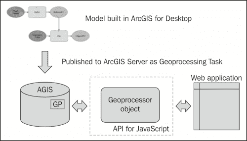
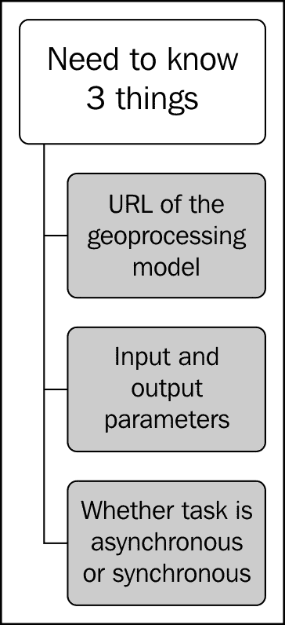
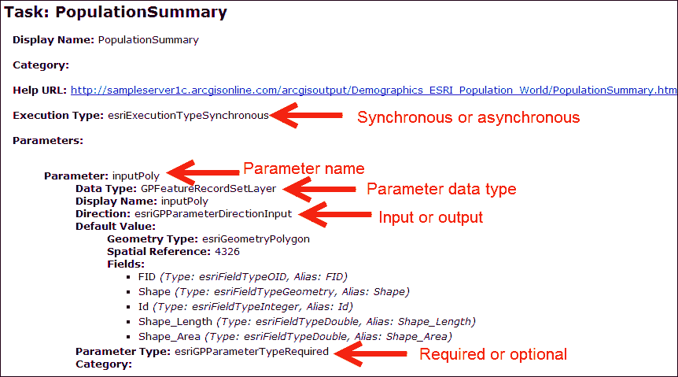
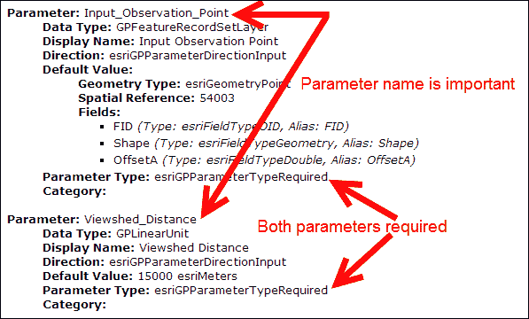
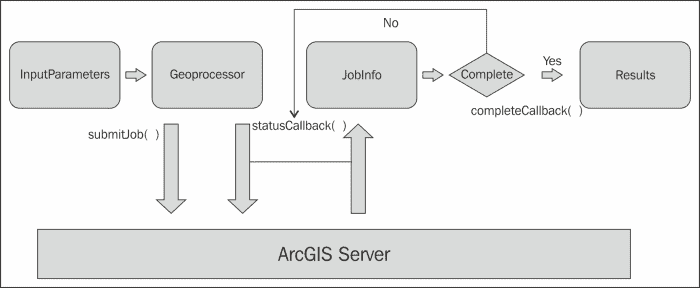
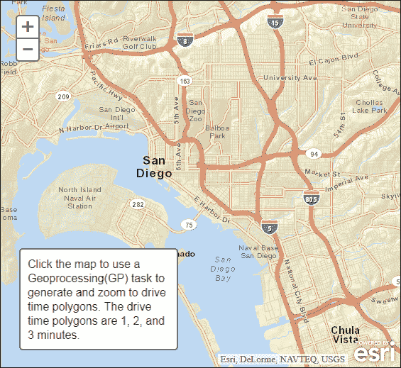
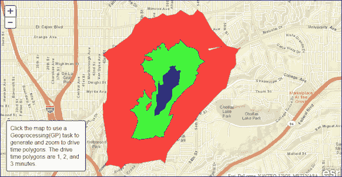

# 第十章。地理处理任务

地理处理是指以逻辑方式自动化和链接 GIS 操作，以完成某种 GIS 任务。例如，您可能希望对流图层进行缓冲，然后将植被图层裁剪到这个新创建的缓冲区。在 ArcGIS for Desktop 中可以构建模型，并且可以在桌面环境或通过 Web 应用程序访问的集中服务器上以自动化方式运行。ArcToolbox 中的任何工具，无论是您 ArcGIS 许可级别的内置工具还是您构建的自定义工具，都可以在模型中使用，并与其他工具链接在一起。本章将探讨如何通过 ArcGIS API for JavaScript 访问这些地理处理任务。

在本章中，我们将涵盖以下主题：

+   ArcGIS Server 中的模型

+   使用地理处理器-你需要知道

+   理解地理处理任务的服务页面

+   地理处理任务

+   运行任务

+   练习地理处理任务的时间到了！地理处理任务

上图显示了使用 ModelBuilder 构建的模型的组件。这些模型可以作为地理处理任务发布到 ArcGIS Server，然后通过你的应用程序访问。

# ArcGIS Server 中的模型

在 ArcGIS for Desktop 中使用 ModelBuilder 构建模型。构建完成后，这些模型可以作为地理处理任务发布到 ArcGIS Server。然后，Web 应用程序使用在 ArcGIS API for JavaScript 中找到的`Geoprocessor`对象来访问这些任务并检索信息。由于这些模型和工具需要计算密集型和 ArcGIS 软件，它们在 ArcGIS Server 上运行。作业通过您的应用程序提交到服务器，服务完成后会获取结果。通过`Geoprocessor`对象可以提交作业和检索结果。这个过程在下图中有所说明：



# 使用地理处理器-你需要知道的

在使用地理处理服务时，有三件事情是你需要知道的：

+   首先，您需要知道模型或工具所在的 URL。一个示例 URL 是[`sampleserver1.arcgisonline.com/ArcGIS/rest/services/Demographics/ESRI_Population_World/GPServer/PopulationSummary`](http://sampleserver1.arcgisonline.com/ArcGIS/rest/services/Demographics/ESRI_Population_World/GPServer/PopulationSummary)。

+   当您访问此链接时，您还可以找到有关输入和输出参数的信息，任务是异步还是同步，以及更多信息。说到输入和输出参数，您需要知道与这些参数相关的数据类型以及每个参数是否是必需的。

+   最后，您需要知道任务是异步还是同步，以及根据这一知识如何配置您的代码。所有这些信息都可以在地理处理任务的服务页面上找到。

# 理解地理处理任务的服务页面

地理处理服务的服务页面包括有关服务的元数据信息。这包括执行类型，可以是同步或异步。在下面的屏幕截图中看到的服务的情况下，**PopulationSummary**服务是一个同步任务，这表明应用程序将等待结果返回。这种执行类型通常用于执行速度快的任务。异步任务被提交为作业，然后应用程序可以在地理处理服务执行其工作时继续运行。任务完成时，它会通知您的应用程序处理已完成并且结果已准备就绪。

其他信息包括参数名称、参数数据类型、参数是输入还是输出类型、参数是必需还是可选、几何类型、空间参考和字段。



## 输入参数

关于提交给地理处理任务的输入参数，您必须记住一些细节。几乎所有地理处理任务都需要一个或多个参数。这些参数可以是必需的或可选的，并且被创建为 JSON 对象。在本节中，您将看到一个代码示例，向您展示如何创建这些 JSON 对象。在创建参数作为 JSON 对象时，您必须记住按照它们在服务页面上出现的确切顺序创建它们。参数名称也必须与服务页面上的名称完全相同。请参阅以下屏幕截图，了解如何阅读服务的输入参数的示例：



以下代码示例是正确的，因为参数名称拼写与服务页面上看到的完全相同（还要注意大小写相同），并且按正确顺序提供：

```js
var params = {
    Input_Observation_Point: featureSetPoints,
    Viewshed_Distance: 250
};
```

相比之下，以下代码示例将是不正确的，因为参数是以相反顺序提供的：

```js
var params = {
    Viewshed_Distance: 250,
    Input_Observation_Point: featureSetPoints
};
```

前面的屏幕截图显示了提交给地理处理任务的输入参数。在编写 JSON 输入参数对象时，非常重要的是您提供与服务页面上给出的确切参数名称，并且按照页面上出现的顺序提供参数。请注意，在我们的代码示例中，我们提供了两个参数：`Input_Observation_Point`和`Viewshed_Distance`。这两个参数都是必需的，并且我们已经将它们命名为它们在服务页面上出现的名称，并且它们的顺序是正确的。

# 地理处理任务

ArcGIS API for JavaScript 中的`Geoprocessor`类表示 GP 任务资源，这是地理处理服务中的单个任务。输入参数通过调用`Geoprocessor.execute()`或`Geoprocessor.submitJob()`传递给`Geoprocessor`类。我们将在后面讨论这两个调用之间的区别。执行地理处理任务后，结果将返回到`Geoprocessor`对象，然后由回调函数处理。创建`Geoprocessor`类的实例只需要传入指向 ArcGIS Server 暴露的地理处理服务的 URL。它需要您导入`esri/tasks/gp`。以下代码示例向您展示如何创建`Geoprocessor`对象的实例：

```js
gp = new Geoprocessor(url);
```

## 运行任务

一旦您了解了 ArcGIS Server 实例可用的地理处理模型和工具以及输入和输出参数，您就可以开始编写执行任务的代码。地理处理作业被提交到 ArcGIS Server 以进行同步或异步执行。同步执行意味着客户端调用执行任务，然后在继续应用程序代码之前等待结果。在异步执行中，客户端提交作业，继续运行其他函数，并稍后检查作业的完成情况。默认情况下，客户端每秒检查一次作业是否完成。服务页面告诉您如何为每个地理处理任务提交作业。只需在服务页面上查找执行类型。执行类型在模型发布为服务时设置。作为开发人员，在发布后，您无法控制类型。

### 同步任务

同步任务需要您的应用程序代码提交作业并等待响应，然后才能继续。因为您的最终用户必须等待结果返回才能继续与应用程序交互，所以这种类型的任务应该仅用于返回数据非常快的任务。如果任务需要的时间超过几秒钟，应将其定义为异步而不是同步。当数据在非常短的时间内返回时，用户很快就会对应用程序感到沮丧。

您需要使用`Geoprocessor.execute()`方法，其中包括属性输入参数和提供的回调函数。当地理处理任务返回提交的作业结果时，将执行回调函数。这些结果存储在`ParameterValue`数组中。

### 异步任务

异步任务需要您提交作业，同时继续在等待过程完成时处理其他函数，然后定期与 ArcGIS Server 检查以检索结果。异步任务的优势在于它不会强迫您的最终用户等待结果。相反，任务被提交，您的最终用户继续与应用程序交互，直到任务完成处理。处理完成后，将在您的应用程序中触发回调函数，您可以处理返回的结果。

`Geoprocessor.submitJob()`方法用于提交地理处理任务的作业。您需要提供输入参数、回调函数和状态回调函数。状态回调函数每次应用程序检查结果时执行。默认情况下，每秒检查一次状态。但是，可以使用`Geoprocessor.setUpdateDelay()`方法更改此间隔。每次检查状态时，都会返回一个`JobInfo`对象，其中包含指示作业状态的信息。当`JobInfo.jobStatus`设置为`STATUS_SUCCEEDED`时，将调用完成回调函数。

提供了异步任务流程的可视化图表，可能有助于加强这些类型任务的操作方式。创建输入参数并将其输入到`Geoprocessor`对象中，该对象使用这些参数向 ArcGIS Server 提交地理处理作业。然后，`Geoprocessor`对象以固定间隔执行`statusCallback()`函数。此函数检查地理处理服务，以查看作业是否已完成。返回一个`JobInfo`对象，其中包含指示其完成状态的状态指示器。此过程持续进行，直到作业完成，此时将调用完成回调函数，并传递作业的结果。



# 练习地理处理任务的时间

在本练习中，您将编写一个简单的应用程序，通过访问 Esri 提供的**CreateDriveTimePolygons**模型，在地图上显示行驶时间多边形。该应用程序将在地图上点击的点周围创建 1、2 和 3 分钟的行驶时间多边形。

1.  在[`developers.arcgis.com/en/javascript/sandbox/sandbox.html`](http://developers.arcgis.com/en/javascript/sandbox/sandbox.html)上打开 JavaScript 沙箱。

1.  从我在以下代码片段中突出显示的`<script>`标签中删除 JavaScript 内容：

```js
<script>
**dojo.require("esri.map");**

**function init(){**
**var map = new esri.Map("mapDiv", {**
**center: [-56.049, 38.485],**
**zoom: 3,**
**basemap: "streets"**
 **});**
 **}**
**dojo.ready(init);**
</script>
```

1.  为本练习中将使用的对象添加以下引用：

```js
<script>
**require([**
 **"esri/map",**
 **"esri/graphic",**
 **"esri/graphicsUtils",**
 **"esri/tasks/Geoprocessor",**
 **"esri/tasks/FeatureSet",**
 **"esri/symbols/SimpleMarkerSymbol",**
 **"esri/symbols/SimpleLineSymbol",**
 **"esri/symbols/SimpleFillSymbol",**
**"dojo/_base/Color"],**
**function(Map, Graphic, graphicsUtils, Geoprocessor, FeatureSet, SimpleMarkerSymbol, SimpleLineSymbol, SimpleFillSymbol, Color){**

 **});**
</script>
```

1.  按照以下代码片段中所示创建`Map`对象，并定义变量以保存`Geoprocessor`对象和行驶时间：

```js
<script>
require([
      "esri/map",
      "esri/graphic",
      "esri/graphicsUtils",
      "esri/tasks/Geoprocessor",
      "esri/tasks/FeatureSet",
      "esri/symbols/SimpleMarkerSymbol",
      "esri/symbols/SimpleLineSymbol",
      "esri/symbols/SimpleFillSymbol",
"dojo/_base/Color"],
function(Map, Graphic, graphicsUtils, Geoprocessor, FeatureSet, SimpleMarkerSymbol, SimpleLineSymbol, SimpleFillSymbol, Color){
**var map, gp;**
**var driveTimes = "1 2 3";**

**// Initialize map, GP and image params**
**map = new Map("mapDiv", {** 
 **basemap: "streets",**
 **center:[-117.148, 32.706], //long, lat**
 **zoom: 12**
**});**    });
</script>
```

1.  在`require()`函数内部，创建新的`Geoprocessor`对象并设置输出空间参考：

```js
// Initialize map, GP and image params
map = new Map("mapDiv", { 
  basemap: "streets",
  center:[-117.148, 32.706], //long, lat
  zoom: 12
});

**gp = newGeoprocessor("http://sampleserver1.arcgisonline.com/ArcGIS/rest/services/Network/ESRI_DriveTime_US/GPServer/CreateDriveTimePolygons");**
**gp.setOutputSpatialReference({wkid:102100});**

```

1.  为`Map.click()`事件设置事件监听器。每次用户在地图上单击时，都会触发计算行驶时间的地理处理任务的执行：

```js
gp = new Geoprocessor("http://sampleserver1.arcgisonline.com/ArcGIS/rest/services/Network/ESRI_DriveTime_US/GPServer/CreateDriveTimePolygons");
gp.setOutputSpatialReference({wkid:102100});
**map.on("click", computeServiceArea);**

```

1.  现在，您将创建`computeServiceArea()`函数，该函数作为`Map.click()`事件的处理程序。此函数将清除任何现有的图形，创建一个新的点图形，表示用户在地图上单击的点，并执行地理处理任务。首先，在定义处理程序的代码行的下方创建`computeServiceArea()`函数的存根：

```js
gp = new Geoprocessor("http://sampleserver1.arcgisonline.com/ArcGIS/rest/services/Network/ESRI_DriveTime_US/GPServer/CreateDriveTimePolygons");
gp.setOutputSpatialReference({wkid:102100});
map.on("click", computeServiceArea);

**function computeServiceArea(evt) {**

**}**

```

1.  清除任何现有的图形，并创建将表示在地图上单击的点的新`SimpleMarkerSymbol`：

```js
function computeServiceArea(evt) {
 **map.graphics.clear();**
 **var pointSymbol = new SimpleMarkerSymbol();**
 **pointSymbol.setOutline = new SimpleLineSymbol(SimpleLineSymbol.STYLE_SOLID, new Color([255, 0, 0]), 1);**
 **pointSymbol.setSize(14);**
 **pointSymbol.setColor(new Color([0, 255, 0, 0.25]));**
}
```

1.  当触发`Map.click()`事件时，将创建一个`Event`对象并将其传递给`computeServiceArea()`函数。此对象在我们的代码中由`evt`变量表示。在此步骤中，您将通过传递`Event.mapPoint`属性创建一个新的`Graphic`对象，该属性包含从地图单击返回的`Point`几何以及您在上一步中创建的`SimpleMarkerSymbol`实例。然后，将此新图形添加到`GraphicsLayer`中，以便在地图上显示：

```js
function computeServiceArea(evt) {
  map.graphics.clear();
  varpointSymbol = new SimpleMarkerSymbol();
  pointSymbol.setOutline = new SimpleLineSymbol(SimpleLineSymbol.STYLE_SOLID, new Color([255, 0, 0]), 1);
  pointSymbol.setSize(14);
  pointSymbol.setColor(new Color([0, 255, 0, 0.25]));

 **var graphic = new Graphic(evt.mapPoint,pointSymbol);**
 **map.graphics.add(graphic);**
}
```

1.  现在，创建一个名为`features`的数组，并将`graphic`对象放入数组中。这些图形的数组最终将被传递到将传递给地理处理任务的`FeatureSet`对象中：

```js
functioncomputeServiceArea(evt) {
  map.graphics.clear();
  var pointSymbol = new SimpleMarkerSymbol();
  pointSymbol.setOutline = new SimpleLineSymbol(SimpleLineSymbol.STYLE_SOLID, new Color([255, 0, 0]), 1);
  pointSymbol.setSize(14);
  pointSymbol.setColor(new Color([0, 255, 0, 0.25]));

  var graphic = new Graphic(evt.mapPoint,pointSymbol);
  map.graphics.add(graphic);

 **var features= [];**
 **features.push(graphic);**
}
```

1.  创建一个新的`FeatureSet`对象，并将图形数组添加到`FeatureSet.features`属性中：

```js
function computeServiceArea(evt) {
  map.graphics.clear();
  var pointSymbol = new SimpleMarkerSymbol();
  pointSymbol.setOutline = new SimpleLineSymbol(SimpleLineSymbol.STYLE_SOLID, new Color([255, 0, 0]), 1);
  pointSymbol.setSize(14);
  pointSymbol.setColor(new Color([0, 255, 0, 0.25]));

  var graphic = new Graphic(evt.mapPoint,pointSymbol);
  map.graphics.add(graphic);

  var features= [];
  features.push(graphic);
 **var featureSet = new FeatureSet();**
 **featureSet.features = features;**
}
```

1.  创建一个 JSON 对象，该对象将保存要传递给地理处理任务的输入参数，并调用`Geoprocessor.execute()`方法。输入参数包括`Input_Location`和`Drive_Times`。请记住，每个输入参数必须拼写与服务页面中看到的完全相同，包括大小写。参数的顺序也非常重要，并且也在服务页面上定义。我们将`Input_Location`参数定义为`FeatureSet`对象。`FeatureSet`对象包含一个图形数组，在本例中只有一个单个图形点。`Drive_Times`对象已经使用我们之前创建的`driveTimes`变量硬编码为 1、2 和 3 的值。最后，我们调用`Geoprocessor.execute()`方法，传入输入参数以及将处理结果的回调函数。接下来我们将创建这个回调函数：

```js
function computeServiceArea(evt) {
map.graphics.clear();
varpointSymbol = new SimpleMarkerSymbol();
pointSymbol.setOutline = new SimpleLineSymbol(SimpleLineSymbol.STYLE_SOLID, new Color([255, 0, 0]), 1);
pointSymbol.setSize(14);
pointSymbol.setColor(new Color([0, 255, 0, 0.25]));

var graphic = new Graphic(evt.mapPoint,pointSymbol);
map.graphics.add(graphic);

var features= [];
features.push(graphic);
varfeatureSet = new FeatureSet();
featureSet.features = features;
**var params = { "Input_Location":featureSet, "Drive_Times":driveTimes };**
**gp.execute(params, getDriveTimePolys);**
}
```

1.  在最后一步中，我们定义了一个名为`getDriveTimePolys()`的回调函数，当地理处理任务完成行驶时间分析时将被触发。让我们创建这个`getDriveTimePolys()`函数。在`computeServiceArea()`函数的结束大括号下方，开始`getDriveTimePolys()`的存根：

```js
**function getDriveTimePolys(results, messages) {**

**}**

```

1.  `getDriveTimePolys()`函数接受两个参数，包括结果对象和返回的任何消息。定义一个新的`features`变量，其中包含地理处理任务返回的`FeatureSet`对象：

```js
function getDriveTimePolys(results, messages) {
 **var features = results[0].value.features;**
}
```

1.  地理处理任务将返回三个`Polygon`图形。每个`Polygon`图形表示我们硬编码为输入参数的行驶时间（1、2 和 3 分钟）。创建一个`for`循环来处理每个多边形：

```js
function getDriveTimePolys(results, messages) {
  var features = results[0].value.features;

 **for (var f=0, fl=features.length; f<fl; f++) {**

 **}**
}
```

1.  在`for`循环内，使用不同的颜色对每个多边形进行符号化。第一个图形将是红色，第二个是绿色，第三个是蓝色。`FeatureSet`对象中将有三个多边形。使用以下代码块为每个定义不同的多边形符号，并将图形添加到`GraphicsLayer`中：

```js
function getDriveTimePolys(results, messages) {
var features = results[0].value.features;

for (var f=0, fl=features.length; f<fl; f++) {
 **var feature = features[f];**
 **if(f == 0) {**
 **var polySymbolRed = new SimpleFillSymbol();**
 **polySymbolRed.setOutline(new SimpleLineSymbol(SimpleLineSymbol.STYLE_SOLID, new Color([0,0,0,0.5]), 1));**
 **polySymbolRed.setColor(new Color([255,0,0,0.7]));**
 **feature.setSymbol(polySymbolRed);**
 **}**
 **else if(f == 1) {**
 **var polySymbolGreen = new SimpleFillSymbol();**
 **polySymbolGreen.setOutline(new SimpleLineSymbol(SimpleLineSymbol.STYLE_SOLID, new Color([0,0,0,0.5]), 1));**
 **polySymbolGreen.setColor(new Color([0,255,0,0.7]));**
 **feature.setSymbol(polySymbolGreen);**
 **}**
 **else if(f == 2) {**
 **var polySymbolBlue = new SimpleFillSymbol();**
 **polySymbolBlue.setOutline(new SimpleLineSymbol(SimpleLineSymbol.STYLE_SOLID, new Color([0,0,0,0.5]), 1));**
 **polySymbolBlue.setColor(new Color([0,0,255,0.7]));**
 **feature.setSymbol(polySymbolBlue);**
 **}**
 **map.graphics.add(feature);** 
}
```

1.  将地图范围设置为`GraphicsLayer`的范围，该范围现在包含您刚刚创建的三个多边形：

```js
function getDriveTimePolys(results, messages) {
  var features = results[0].value.features;

  for (var f=0, fl=features.length; f<fl; f++) {
    var feature = features[f];
    if(f === 0) {
      var polySymbolRed = new SimpleFillSymbol();
      polySymbolRed.setOutline(new SimpleLineSymbol(SimpleLineSymbol.STYLE_SOLID, new Color([0,0,0,0.5]), 1));
      polySymbolRed.setColor(new Color([255,0,0,0.7]));
      feature.setSymbol(polySymbolRed);
    }
    else if(f == 1) {
      var polySymbolGreen = new SimpleFillSymbol();
      polySymbolGreen.setOutline(new SimpleLineSymbol(SimpleLineSymbol.STYLE_SOLID, new Color([0,0,0,0.5]), 1));
      polySymbolGreen.setColor(new Color([0,255,0,0.7]));
      feature.setSymbol(polySymbolGreen);
    }
    else if(f == 2) {
      var polySymbolBlue = new SimpleFillSymbol();
      polySymbolBlue.setOutline(new SimpleLineSymbol(SimpleLineSymbol.STYLE_SOLID, new Color([0,0,0,0.5]), 1));
      polySymbolBlue.setColor(new Color([0,0,255,0.7]));
      feature.setSymbol(polySymbolBlue);
    }
    map.graphics.add(feature);
  }
 **map.setExtent(graphicsUtils.graphicsExtent(map.graphics.graphics), true);**
}
```

1.  添加一个`<div>`标签，用于保存应用程序的说明：

```js
<body>
<div id="mapDiv"></div>
**<div id="info" class="esriSimpleSlider">**
 **Click on the map to use a Geoprocessing(GP) task to generate and zoom to drive time polygons. The drive time polygons are 1, 2, and 3 minutes.**
**</div>**
</body>
```

1.  修改代码顶部的`<style>`标签，如以下代码的突出显示部分所示：

```js
<style>
**html, body, #mapDiv {**
**height: 100%;**
**margin: 0;**
**padding: 0;**
**width: 100%;**
 **}**
 **#info {**
**bottom: 20px;**
**color: #444;**
**height: auto;**
**font-family: arial;**
**left: 20px;**
**margin: 5px;**
**padding: 10px;**
**position: absolute;**
**text-align: left;**
**width: 200px;**
**z-index: 40;**
 **}**
</style>
```

1.  您可能希望在`ArcGISJavaScriptAPI`文件夹中查看解决方案文件（`drivetimes.html`），以验证您的代码是否已正确编写。

1.  点击**运行**按钮。您应该在以下截图中看到地图。如果没有，您可能需要重新检查代码的准确性。

1.  在地图上的某个地方点击。只需片刻，您应该看到行驶时间多边形显示出来。请耐心等待。有时这可能需要一点时间。

# 摘要

ArcGIS Server 可以公开地理处理服务，如模型和工具，您的应用程序可以访问。这些工具在 ArcGIS Server 上运行，因为它们需要进行计算密集型的操作，并且需要 ArcGIS 软件。作业通过您的应用程序提交到服务器，任务完成后返回结果。地理处理任务可以是同步或异步的，并且由 ArcGIS Server 管理员配置为其中一种类型运行。作为应用程序员，重要的是要了解您正在访问的地理处理服务的类型，因为您对服务的方法调用取决于这些信息。此外，要知道任务是同步还是异步，您还需要知道地理处理模型或工具的 URL 以及输入和输出参数。在下一章中，您将学习如何将 ArcGIS Online 的数据和地图添加到您的应用程序中。
