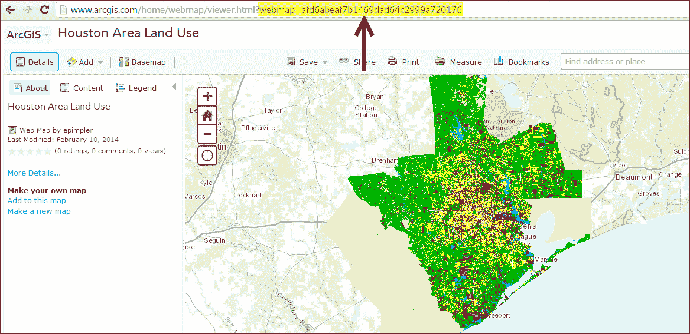
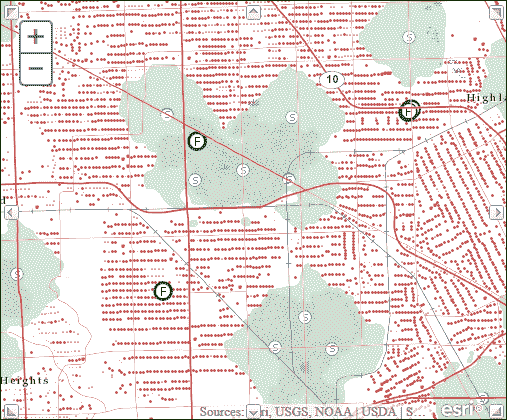
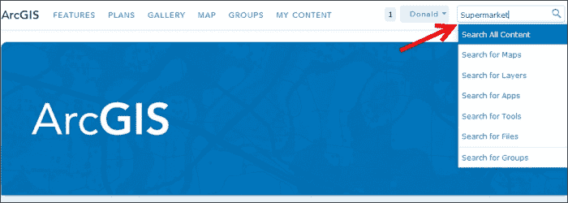
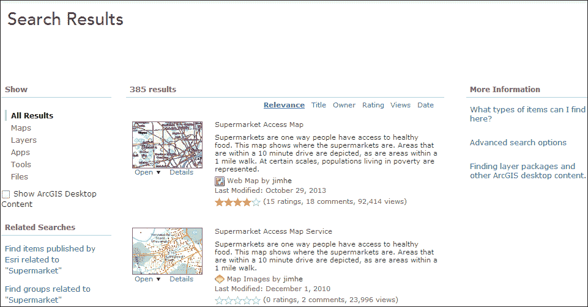
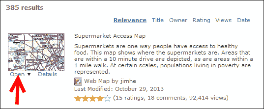
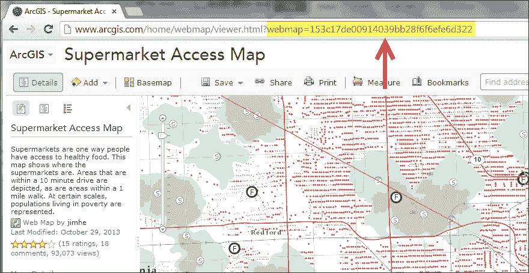
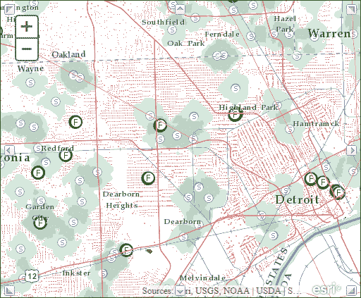

# 第十一章：与 ArcGIS Online 集成

ArcGIS Online 是一个专为处理地图和其他类型地理信息而设计的网站。在这个网站上，您将找到用于构建和共享地图的应用程序。您还将找到有用的底图、数据、应用程序和工具，您可以查看和使用，以及您可以加入的社区。对于应用程序开发人员来说，真正令人兴奋的消息是，您可以使用 ArcGIS Server JavaScript API 将 ArcGIS Online 内容集成到您的自定义开发的应用程序中。在本章中，您将探索如何将 ArcGIS Online 地图添加到您的应用程序中。

在本章中，我们将涵盖以下主题：

+   使用 webmap ID 将 ArcGIS Online 地图添加到您的应用程序

+   使用 JSON 将 ArcGIS Online 地图添加到您的应用程序

+   是时候练习 ArcGIS Online 了

# 使用 webmap ID 将 ArcGIS Online 地图添加到您的应用程序

ArcGIS Server JavaScript API 包括两个用于处理 ArcGIS Online 地图的实用方法。这两种方法都可以在`esri/arcgis/utils`资源中找到。`createMap()`方法用于从 ArcGIS Online 项目创建地图。

ArcGIS Online 图库中的每张地图都有一个唯一的 ID。当您开始创建集成来自 ArcGIS Online 的地图的自定义应用程序时，这个唯一的 ID，称为 webmap，将变得重要。要获取要添加到 JavaScript API 应用程序中的地图的 webmap ID，只需单击在 ArcGIS Online 中找到的共享地图。地址栏将包含地图的 webmap ID。您需要记下这个 ID。以下截图显示了如何从浏览器的地址栏中获取特定地图的 webmap ID：



一旦您获得了要集成到自定义 JavaScript API 应用程序中的 ArcGIS Online 地图的 webmap ID，您将需要调用`getItem()`方法，传入 webmap ID。`getItem()`方法返回一个`dojo`/`Deferred`对象。`Deferred`对象专门用于可能不会立即完成的任务。它允许您定义在任务完成时将执行的`success`和`failure`回调函数。在这种情况下，成功完成将向`success`函数传递一个`itemInfo`对象。

这个`itemInfo`对象将用于在您的自定义应用程序中从 ArcGIS Online 创建地图。您将看到一个代码示例，说明了这些主题中的一些内容。

```js
**var agoId = "fc160a96a98d4052ae191cc486961b61";**
**var itemDeferred = arcgisUtils.getItem(agoId);**

**itemDeferred.addCallback(function(itemInfo) {**
var mapDeferred = arcgisUtils.createMap(itemInfo, "map", {
mapOptions: {
  slider: true
  },
  geometryServiceURL: "http://sampleserver3.arcgisonline.com/ArcGIS/rest/services/Geometry/GeometryServer"
  });
mapDeferred.addCallback(function(response) {
map = response.map;
  map.on("resize", resizeMap);
  });
mapDeferred.addErrback(function(error) {
console.log("Map creation failed: " , json.stringify(error));
  });
**itemDeferred.addErrback(function(error) {**
console.log("getItem failed: ", json.stringify(error));
  });
}
```

我们将在两个单独的示例中涵盖整个功能。现在我们将检查`getItem()`方法的使用以及为成功或失败设置回调函数。这些代码行在前面的代码示例中有所突出。在第一行代码中，我们创建一个名为`agoId`的变量，并将其分配给我们想要使用的 webmap ID。接下来，我们调用`getItem()`，传入包含我们的 webmap ID 的`agoId`变量。这将创建一个新的`dojo`/`Deferred`对象，我们将其分配给一个名为`itemDeferred`的变量。使用这个对象，我们可以创建`success`和`error`回调函数。`success`函数称为`addCallback`，它传递一个`itemInfo`对象，我们将使用它来创建我们的地图。我们将在下一节中介绍地图的实际创建过程。在某种错误条件发生时，将调用`addErrback`函数。现在让我们看看地图是如何创建的。以下代码片段的突出显示行说明了地图的创建：

```js
var agoId = "fc160a96a98d4052ae191cc486961b61";
var itemDeferred = arcgisUtils.getItem(agoId);

itemDeferred.addCallback(function(itemInfo) {
**varmapDeferred = arcgisUtils.createMap(itemInfo, "map", {**
**mapOptions: {**
 **slider: true**
 **},**
 **geometryServiceURL: "http://sampleserver3.arcgisonline.com/ArcGIS/rest/services/Geometry/GeometryServer"**
 **});**
**mapDeferred.addCallback(function(response) {**
**map = response.map;**
 **map.on("resize", resizeMap);**
 **});**
**mapDeferred.addErrback(function(error) {**
**console.log("Map creation failed: " , json.stringify(error));**
 **});**
itemDeferred.addErrback(function(error) {
console.log("getItem failed: ", json.stringify(error));
  });
}
```

`createMap()`方法用于实际从 ArcGIS Online 创建地图。此方法接受`itemInfo`的实例，该实例是从成功调用`getItem()`返回的；或者，您可以简单地提供 webmap ID。与我们之前检查的`getItem()`方法一样，`createMap()`也返回一个`dojo`/`Deferred`对象，您可以使用它来分配成功和错误回调函数。成功函数接受一个包含我们用来检索实际地图的`map`属性的`response`对象。当发生阻止地图创建的错误时，错误函数运行。

# 使用 JSON 将 ArcGIS Online 地图添加到您的应用程序

使用 webmap ID 创建地图的替代方法是使用 JSON 对象创建地图，该对象是 web 地图的表示。这在应用程序无法访问 ArcGIS Online 的情况下非常有用。看一下下面的代码片段：

```js
var webmap = {};
webmap.item = {
  "title":"Census Map of USA",
  "snippet": "Detailed description of data",
  "extent": [[-139.4916, 10.7191],[-52.392, 59.5199]]
};
```

接下来，指定组成地图的图层。在前面的片段中，添加了来自 ArcGIS Online 的世界地形底图，以及一个叠加层，该叠加层向地图添加了额外的信息，如边界、城市、水体和地标以及道路。添加了一个操作图层，显示美国人口普查数据：

```js
webmap.itemData = {
"operationalLayers": [{
  "url": " http://sampleserver1.arcgisonline.com/ArcGIS/rest/services/Demographics/ESRI_Census_USA/MapServer",
  "visibility": true,
  "opacity": 0.75,
  "title": "US Census Map",
  "itemId": "204d94c9b1374de9a21574c9efa31164"
}],
"baseMap": {
  "baseMapLayers": [{
  "opacity": 1,
  "visibility": true,
  "url": "http://services.arcgisonline.com/ArcGIS/rest/services/World_Terrain_Base/MapServer"
  },{
  "isReference": true,
  "opacity": 1,
  "visibility": true,
  "url": "http://services.arcgisonline.com/ArcGIS/rest/services/Reference/World_Reference_Overlay/MapServer"
  }],
  "title": "World_Terrain_Base"
},
"version": "1.1"
};
```

一旦`webmap`被定义，使用`createMap()`从定义构建地图：

```js
var mapDeferred = arcgisUtils.createMap(webmap, "map", {
mapOptions: {
slider: true
  }
});
```

# 在 ArcGIS Online 中练习的时间

在这个练习中，您将学习如何将 ArcGIS Online 地图集成到您的应用程序中。这个简单的应用程序将显示来自 ArcGIS Online 的美国超市访问公共地图。这张地图显示了整个美国的数据。分析中包括的超市年销售额为 100 万美元或更多。贫困人口通过从人口普查中获取的街区组贫困率（例如，10%）来表示，然后根据该百分比对该街区组中的每个街区进行符号化。看一下下面的截图：



绿点代表生活在距离超市一英里内的贫困人口。红点代表生活在超过一英里步行距离的贫困人口，但可能在 10 分钟的车程内，假设他们有车。灰点代表给定区域的总人口。执行以下步骤：

1.  在编写应用程序之前，让我们探索 ArcGIS Online，看看如何找到地图并检索它们的唯一标识符。打开一个网页浏览器，转到[`arcgis.com`](http://arcgis.com)。

1.  在搜索框中，输入`超市`，如下面的截图所示：

1.  这将返回一个结果列表。我们将把**超市访问地图**结果添加到我们的应用程序中：

1.  单击地图缩略图下的**打开**链接。

1.  这将在 ArcGIS Online 查看器中打开地图。您需要复制下面截图中显示的 web 地图编号。我建议您要么在某个地方写下这个编号，要么复制并粘贴到记事本中。这是地图的唯一 ID：

1.  在[`developers.arcgis.com/en/javascript/sandbox/sandbox.html`](http://developers.arcgis.com/en/javascript/sandbox/sandbox.html)打开 JavaScript 沙盒。

1.  从我以下划线标记的`<script>`标签中删除 JavaScript 内容：

```js
<script>
**dojo.require("esri.map");**

**function init(){**
**var map = new esri.Map("mapDiv", {**
**center: [-56.049, 38.485],**
**zoom: 3,**
**basemap: "streets"**
 **});**
 **}**
**dojo.ready(init);**
</script>
```

1.  添加我们在这个练习中将使用的对象的以下引用：

```js
<script>
**require([**
 **"dojo/parser",**
 **"dojo/ready",**
 **"dojo/dom",**
 **"esri/map",** 
 **"esri/arcgis/utils",**
 **"esri/dijit/Scalebar",**
 **"dojo/domReady!"**
 **], function(**
**parser,ready,dom,Map,arcgisUtils,Scalebar) {**
 **});**
</script>
```

1.  在这个简单的例子中，我们将在应用程序中硬编码 webmap ID。在`require()`函数内部，创建一个名为`agoId`的新变量，并将其分配给您获取的 webmap ID，如下所示：

```js
<script>
require([
        "dojo/parser",
        "dojo/ready",
        "dojo/dom",
        "esri/map", 
        "esri/arcgis/utils",
        "esri/dijit/Scalebar",
        "dojo/domReady!"
      ], function(
parser,ready,dom,Map,arcgisUtils,Scalebar) {

 **var agoId = "153c17de00914039bb28f6f6efe6d322";** 

    });

</script>
```

1.  在这个练习的最后两个步骤中，我们将处理`arcgisUtils.getItem()`和`arcgisUtils.createMap()`方法。这两种方法都返回所谓的`Dojo`/`Deferred`对象。您需要对`Deferred`对象有基本的了解，否则代码就不会有太多意义。`dojo`/`Deferred`对象专门用于可能不会立即完成的任务。它允许您定义成功和失败的回调函数，当任务完成时将执行这些函数。成功的回调函数将由`Deferred.addCallback()`调用，而失败函数将采用`Deferred.errCallback()`的形式。在`getItem()`的情况下，成功完成将向成功函数传递一个`itemInfo`对象。这个`itemInfo`对象将用于在您的自定义应用程序中从 ArcGIS Online 创建地图。由于某种原因未能完成将导致生成一个错误被传递给`Deferred.addErrback()`函数。将以下代码块添加到您的应用程序中，然后我们将进一步讨论其细节：

```js
<script>
require([
        "dojo/parser",
        "dojo/ready",
        "dojo/dom",
        "esri/map", 
        "esri/arcgis/utils",
        "esri/dijit/Scalebar",
        "dojo/domReady!"
      ], function(
parser,ready,dom,Map,arcgisUtils,Scalebar) {

    var agoId = "153c17de00914039bb28f6f6efe6d322";
 **var itemDeferred = arcgisUtils.getItem(agoId);**

 **itemDeferred.addCallback(function(itemInfo) {**
 **var mapDeferred = arcgisUtils.createMap(itemInfo,"mapDiv", {**
 **mapOptions: {**
 **slider: true,**
 **nav:true**
 **}**
 **});**

 **});**
 **itemDeferred.addErrback(function(error) {**
 **console.log("getItem failed: ",json.stringify(error));**
 **});**

 **});**

</script>
```

在第一行代码中，我们调用`getItem()`函数，传入`agoId`变量，该变量引用来自 ArcGIS Online 的**超市访问地图**。此方法返回一个`Dojo`/`Deferred`对象，存储在名为`itemDeferred`的变量中。

`getItem()`函数获取有关 ArcGIS Online 项目（webmap）的详细信息。传递给回调的对象是一个具有以下规范的通用对象：

```js
{
item: <Object>,
itemData: <Object>
}
```

假设对`getItem()`的调用成功，然后将这个通用的项目对象传递给`addCallback()`函数。在回调函数内部，我们然后调用`getMap()`方法，传入`itemInfo`对象，地图容器的引用以及定义地图功能的任何可选参数。在这种情况下，地图参数包括导航滑块和导航按钮的存在。`getMap()`方法然后返回另一个`Dojo`/`Deferred`对象，存储在`mapDeferred`变量中。在下一步中，您将定义处理将被传回的`Deferred`对象的代码块。

1.  传递给`mapDeferred.addCallback()`函数的对象将采用以下形式：

```js
{
  Map: <esri/Map>,
itemInfo: {
item: <Object>,
itemData: <Object>
  }
}
```

1.  添加以下代码来处理返回的信息：

```js
<script>
require([
        "dojo/parser",
        "dojo/ready",
        "dojo/dom",
        "esri/map", 
        "esri/arcgis/utils",
        "esri/dijit/Scalebar",
        "dojo/domReady!"
      ], function(
parser,ready,dom,Map,arcgisUtils,Scalebar) {

    var agoId = "153c17de00914039bb28f6f6efe6d322";
    var itemDeferred = arcgisUtils.getItem(agoId);

    itemDeferred.addCallback(function(itemInfo) {
    var mapDeferred = arcgisUtils.createMap(itemInfo,"mapDiv", {
      mapOptions: {
      slider: true,
      nav:true
        }
      });
          **mapDeferred.addCallback(function(response) {**
 **map = response.map;**
 **});**
 **mapDeferred.addErrback(function(error) {**
 **console.log("Map creation failed: ", json.stringify(error));**
 **});**

      });
      itemDeferred.addErrback(function(error) {
          console.log("getItem failed: ",json.stringify(error));
      });

  });

</script>
```

成功函数（`mapDeferred.addCallback`）从响应中提取地图并将其分配给地图容器。

1.  您可能希望查看解决方案文件（`arcgisdotcom.html`）在您的`ArcGISJavaScriptAPI`文件夹中，以验证您的代码是否已正确编写。

1.  单击**运行**按钮后，您应该看到以下地图。如果没有，您可能需要重新检查代码的准确性：

# 总结

ArcGIS Online 正变得越来越重要，作为创建和共享地图和其他资源的平台。作为开发人员，您可以将这些地图集成到自定义应用程序中。每张地图都有一个唯一的标识符，您可以使用它来将地图拉入使用 ArcGIS Server 和 JavaScript API 开发的自定义应用程序中。因为从 ArcGIS Online 返回这些地图可能需要一些时间，`getItem()`和`createMap()`方法返回`Dojo`/`Deferred`对象，这些对象提供了成功和失败的回调函数。一旦成功从 ArcGIS Online 获取地图，它们就可以像任何其他地图服务一样在您的应用程序中呈现。在下一章中，您将学习如何在 JavaScript 中使用 ArcGIS API 进行移动应用程序开发。
