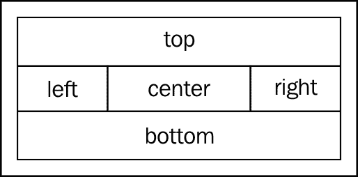
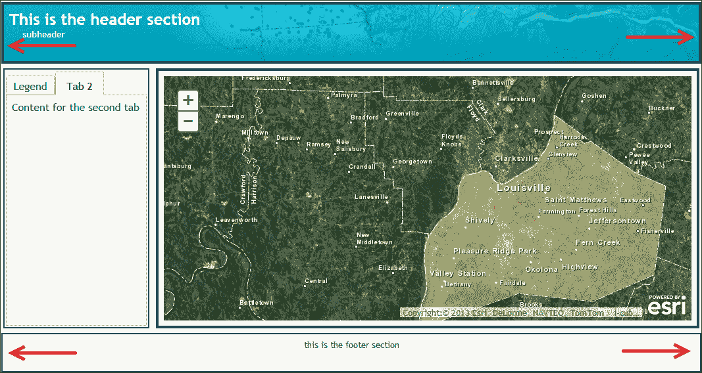
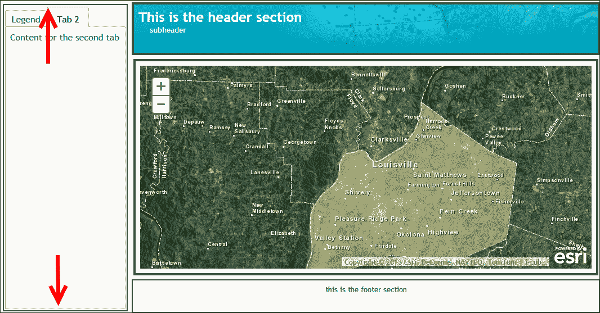
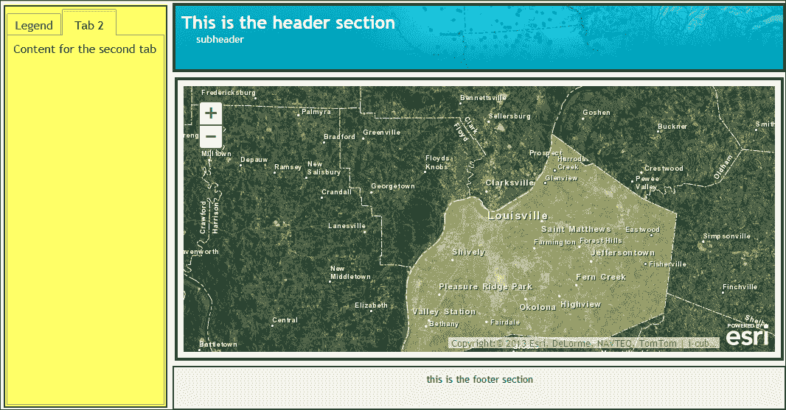
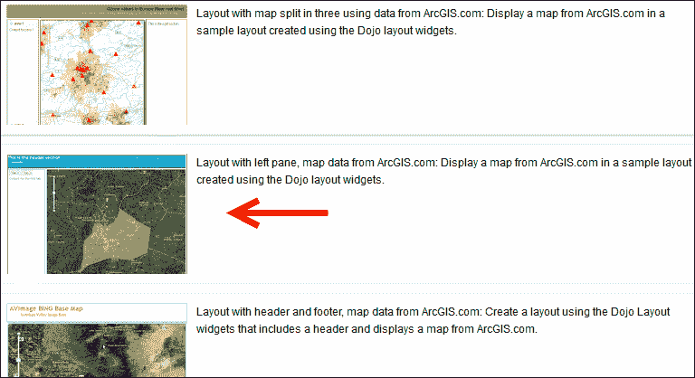
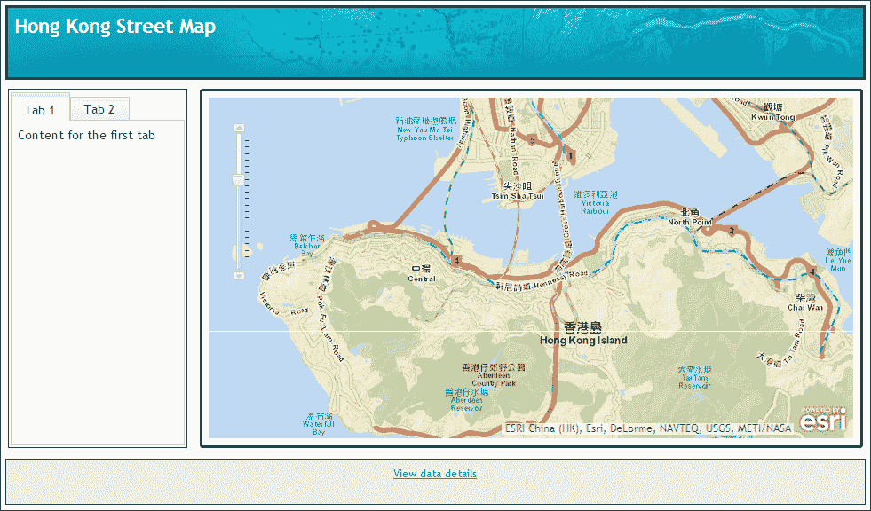
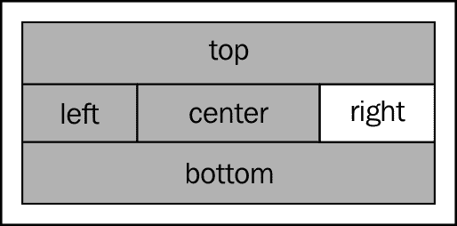

# 附录 A. 使用 ArcGIS 模板和 Dojo 设计应用程序

对于许多 Web 开发人员来说，构建 GIS 应用程序时最困难的任务之一是设计和创建用户界面。ArcGIS JavaScript API 和 Dojo 极大地简化了这项任务。Dojo 的布局 dijits 提供了一种简单高效的方式来创建应用程序布局，并且 Esri 提供了许多示例应用程序布局和模板，您可以使用这些示例快速启动。在本附录中，读者将学习快速设计应用程序布局的技巧。

# Dojo BorderContainer dijit

由于 AGIS JavaScript API 直接构建在 Dojo JavaScript 框架之上，因此您自动可以访问用户界面 Dojo 库，包括布局 dijits，如`BorderContainer`。布局 dijits 是一组用户界面元素，您可以将其添加到应用程序中，以便对应用程序的布局进行控制。`BorderContainer` dijit 主要用作其他子容器的容器，并且可以是这两种设计类型之一：标题或侧边栏。您可以使用`design`属性定义设计类型。设计类型可以是`headline`或`sidebar`，并且都可以分为多达 5 个不同的区域：`top`、`bottom`、`right`、`left`和`center`。每个区域通常由 Dojo 布局元素填充。还可以嵌套区域，以更好地控制应用程序的布局。例如，您可以在主`BorderContainer`的`center`区域内包含第二个`BorderContainer`。使用这个第二个`BorderContainer`，您可以进一步划分`center`区域。



在以下代码示例中，我们将`design`定义为`headline`类型。这将导致您在代码中看到的一般配置，`top`和`bottom`区域横跨整个屏幕空间的宽度。在这种情况下，您只需要为`top`和`bottom`区域设置`height`属性：

```js
<div id="main-pane" dojoType="dijit.layout.BorderContainer" design="headline">
```

在以下代码示例中，我们将`design`定义为`sidebar`。使用`sidebar`设计，`left`和`right`区域会扩展以占据窗口高度的`100%`，从而牺牲了`top`和`bottom`区域的可用区域。在这种情况下，您只需要定义`width`样式属性，因为高度将始终为`100%`。

```js
<div id="main-pane" dojoType="dijit.layout.BorderContainer" design="sidebar">
```

在任一情况下，中心区域将根据其他区域的大小调整以适应可用的空间。您将看到的以下截图展示了`BorderContainer`可用的两种设计类型。第一种显示了`headline`样式，而第二种显示了`sidebar`样式。



# 其他 Dojo 布局元素

`BorderContainer`的每个区域（顶部、底部、左侧、右侧和中心）都可以由 Dojo 布局元素填充。这些元素包括`AccordionContainer`、`SplitContainer`、`StackContainer`和`TabContainer`。您还可以创建一组嵌套的`BorderContainer`对象，以进一步划分可用的布局空间。

通过使用`region`属性将子元素放置在区域内，如以下代码示例所示。请注意，在突出显示的部分中，`region`属性设置为`left`。这将在`left`区域创建`ContentPane`。`ContentPane`是一个非常基本的布局元素，用作其他小部件的容器。在这种情况下，它将容纳`TabContainer`（突出显示），其中包含其他`ContentPane`对象。

```js
<div dojotype="dijit.layout.ContentPane" id="leftPane" region="left">
 **<div dojotype = "dijit.layout.TabContainer">**
    <div dojotype="dijit.layout.ContentPane" title = "Tab 1" selected="true">
      Content for the first tab
    </div>
    <div dojotype="dijit.layout.ContentPane" title = "Tab 2" >
      Content for the second tab
    </div>
  </div>
</div>
```

以下截图说明了使用`ContentPane`和`TabContainer`生成的位置和内容：



`AccordionContainer`包含一组窗格，其标题可见，但一次只有一个窗格的内容可见。当用户点击标题时，窗格内容变得可见。这些是可以在小区域内容纳大量信息的优秀用户界面容器。

Esri 提供了许多示例布局，您可以使用这些布局来开始设计应用程序的布局。ArcGIS API for JavaScript 的帮助页面包含一个**Samples**选项卡，其中包含数十个示例脚本，您可以在应用程序中使用，包括各种布局示例。在下一节中，您将学习如何将这些示例布局之一集成到您的应用程序中。

# 练习使用示例布局

在此练习中，您将下载 Esri 提供的示例布局。然后，您将检查布局，以了解 Dojo 提供的基本布局元素。最后，您将对布局进行一些更改。

1.  在开始此练习之前，您需要确保可以访问 Web 服务器。如果您无法访问 Web 服务器，或者计算机上尚未安装 Web 服务器，您可以下载并安装开源 Web 服务器 Apache（[`httpd.apache.org/download.cgi`](http://httpd.apache.org/download.cgi)）。Microsoft IIS 是另一个常用的 Web 服务器，还有许多其他可供选择。在本练习中，我将假设您正在使用 Apache Web 服务器。

1.  在本地计算机上安装的 Web 服务器将通过 URL 称为`http://localhost`。如果您在 Windows 平台上安装了 Apache，则指向`C:\Program Files\Apache Software Foundation\Apache2.2\`下的`htdocs`文件夹。

1.  在 ArcGIS API for JavaScript 网站的**Samples**选项卡（[`developers.arcgis.com/en/javascript/jssamples/`](https://developers.arcgis.com/en/javascript/jssamples/)）中，在搜索框中搜索`Layouts`以生成可用布局示例的列表。

1.  在搜索结果列表中向下滚动，直到看到以下截图中显示的**带有左侧窗格的布局**示例。点击这个项目：

1.  点击**Download as a zip file**链接下载示例。

1.  在`C:\Program Files\Apache Software Foundation\Apache2.2\`文件夹下的`htdocs`文件夹中创建一个名为`layout`的新文件夹。将下载的文件解压缩到这个文件夹中。这将创建一个名为`index.html`的文件，以及`css`和`images`文件夹。

1.  打开 Web 浏览器，转到 URL`http://localhost/layout/index.html`，以便查看当前布局。您应该看到类似以下截图的内容：

1.  在您喜爱的文本或 Web 编辑器中打开`index.html`。

1.  滚动到文件底部，直到看到`<body>`标签。

1.  最高级别的布局容器是`BorderContainer`。一个`<div>`标签将包含`BorderContainer`，所有其他子布局元素都需要位于这个`<div>`标签内。检查以下代码。突出显示的部分是用于定义我们顶级`BorderContainer`的代码。请注意，设计已设置为`headline`，这意味着顶部和底部区域将在整个屏幕宽度上滚动：

```js
<body class="claro">
  **<div id="mainWindow" data-dojo-type="dijit.layout.BorderContainer" data-dojo-props="design:'headline'"**
 **style="width:100%; height:100%;">**

    <div id="header" data-dojo-type="dijit.layout.ContentPane" data-dojo-props="region:'top'">
        <div id="title">
      </div>
    </div>

    <div data-dojo-type="dijit.layout.ContentPane" id="leftPane" data-dojo-props="region:'left'">
      <div data-dojo-type="dijit.layout.TabContainer">
        <div data-dojo-type="dijit.layout.ContentPane" data-dojo-props="title:'Tab 1', selected:'true'">
          Content for the first tab
        </div>
        <div data-dojo-type="dijit.layout.ContentPane" data-dojo-props="title:'Tab 2'">
          Content for the second tab
        </div>
      </div>
    </div>

    <div id="map" data-dojo-type="dijit.layout.ContentPane" data-dojo-props="region:'center'"></div>

    <div id="footer" data-dojo-type="dijit.layout.ContentPane" data-dojo-props="region:'bottom'">
      <span id="dataSource">
      </span>
    </div>

  </div>
</body>
```

1.  在`BorderContainer`内，您将找到使用`ContentPane` dijit 定义的几个子布局元素。`ContentPane`是一个非常通用的布局元素，只是包含文本或其他布局元素，例如`TabContainer`或`AccordionContainer`。

```js
<body class="claro">
  <div id="mainWindow" data-dojo-type="dijit.layout.BorderContainer" data-dojo-props="design:'headline'"
    style="width:100%; height:100%;">

    **<div id="header" data-dojo-type="dijit.layout.ContentPane" data-dojo-props="region:'top'">**
      <div id="title">
      </div>
    </div>

    **<div data-dojo-type="dijit.layout.ContentPane" id="leftPane" data-dojo-props="region:'left'">**
      <div data-dojo-type="dijit.layout.TabContainer">
        **<div data-dojo-type="dijit.layout.ContentPane" data-dojo-props="title:'Tab 1', selected:'true'">**
          Content for the first tab
        </div>
 **<div data-dojo-type="dijit.layout.ContentPane" data-dojo-props="title:'Tab 2'">**
          Content for the second tab
        </div>
      </div>
    </div>

    **<div id="map" data-dojo-type="dijit.layout.ContentPane" data-dojo-props="region:'center'"></div>**

    **<div id="footer" data-dojo-type="dijit.layout.ContentPane" data-dojo-props="region:'bottom'">**
      <span id="dataSource">
      </span>
    </div>

  </div>
</body>
```

### 提示

请注意，在上一个代码示例中，每个`ContentPane`布局元素都有一个为每个布局元素设计的区域。在这种情况下，我们已定义了所有可用区域，除了`right`区域。这在以下截图中有所说明：



1.  接下来，检查下面突出显示的代码。这段代码定义了`left`区域的内容。定义了一个简单的`ContentPane`布局元素，正如我之前提到的，它是其他布局元素或文本的一个非常简单的容器。在这个`ContentPane`中，我们创建了一个`TabContainer`布局元素并分配了两个选项卡。每个选项卡都被创建为`ContentPane`。

```js
<body class="claro">
  <div id="mainWindow" data-dojo-type="dijit.layout.BorderContainer" data-dojo-props="design:'headline'"
    style="width:100%; height:100%;">

      <div id="header" data-dojo-type="dijit.layout.ContentPane" data-dojo-props="region:'top'">
        <div id="title">
        </div>
      </div>

      <div data-dojo-type="dijit.layout.ContentPane" id="leftPane" data-dojo-props="region:'left'">
 **<div data-dojo-type="dijit.layout.TabContainer">**
 **<div data-dojo-type="dijit.layout.ContentPane" data-dojo-props="title:'Tab 1', selected:'true'">**
 **Content for the first tab**
 **</div>**
 **<div data-dojo-type="dijit.layout.ContentPane" data-dojo-props="title:'Tab 2'">**
 **Content for the second tab**
 **</div>**
 **</div>**
      </div>

      <div id="map" data-dojo-type="dijit.layout.ContentPane" data-dojo-props="region:'center'"></div>

      <div id="footer" data-dojo-type="dijit.layout.ContentPane" data-dojo-props="region:'bottom'">
      <span id="dataSource">
      </span>
    </div>

  </div>
</body>
```

1.  一个常见的情景是创建一个包含地图图例的选项卡容器，如下面的屏幕截图所示：

1.  现在你已经理解了创建布局元素的基本概念，你可以为`right`区域添加内容。添加以下突出显示的代码：

```js
<body class="claro">
  <div id="mainWindow" data-dojo-type="dijit.layout.BorderContainer" data-dojo-props="design:'headline'"
    style="width:100%; height:100%;">

    <div id="header" data-dojo-type="dijit.layout.ContentPane" data-dojo-props="region:'top'">
      <div id="title">
      </div>
    </div>

    <div data-dojo-type="dijit.layout.ContentPane" id="leftPane" data-dojo-props="region:'left'">
      <div data-dojo-type="dijit.layout.TabContainer">
        <div data-dojo-type="dijit.layout.ContentPane" data-dojo-props="title:'Tab 1', selected:'true'">
          Content for the first tab
        </div>
        <div data-dojo-type="dijit.layout.ContentPane" data-dojo-props="title:'Tab 2'">
          Content for the second tab
        </div>
      </div>
    </div>

    **<div data-dojo-type="dijit.layout.ContentPane" id="rightPane" data-dojo-props="region:'right'">**
 **Content for right pane**
 **</div>**

    <div id="map" data-dojo-type="dijit.layout.ContentPane" data-dojo-props="region:'center'"></div>

    <div id="footer" data-dojo-type="dijit.layout.ContentPane" data-dojo-props="region:'bottom'">
      <span id="dataSource">
      </span>
    </div>

  </div>
</body>
```

1.  在之前的练习中提取的`css`文件夹中，有一个名为`layout.css`的文件。这个文件包含了我们应用程序的样式信息。在文本编辑器中打开这个文件。

1.  在下面的代码示例中找到文本`#rightPane`。为区域的背景颜色、前景颜色、边框样式和宽度定义了属性：

```js
#rightPane {
  background-color:#FFF;
  color:#3f3f3f;
  border:solid 2px #224a54;
  width:20%;
}
```

1.  回想一下，在你添加的上一个代码块中，我们给`right`区域的`id`设置为`rightPane`。CSS 部分将通过给它设置背景颜色（白色）、前景颜色、宽度和边框来设置我们的窗格。

1.  保存文件。

1.  如果需要，打开你的网络浏览器并重新加载`http://localhost/layout/index.html`，或者如果你已经打开了该页面，只需刷新页面。现在你应该看到应用程序`right`区域的新内容。目前，它只包含一些文本作为内容，但你可以很容易地添加额外的内容，包括用户界面小部件（dijits）。在下一步中，当我们添加`AccordionContainer`时，我们将这样做。

1.  接下来，我们将`AccordionContainer`添加到`right`区域。

1.  首先，添加对`AccordionContainer`资源的引用，如下面突出显示的代码所示：

```js
dojo.require("dijit.layout.BorderContainer");
dojo.require("dijit.layout.ContentPane");
dojo.require("dijit.layout.TabContainer");
dojo.require("esri.map");
dojo.require("esri.arcgis.utils");
dojo.require("esri.IdentityManager");
**dojo.require("dijit.layout.AccordionContainer");**

```

1.  现在，在`right`区域的`ContentPane`中添加`AccordionContainer`以及每个窗格的内容。下面的突出显示的代码应该添加到你在第 14 步中创建的`ContentPane`中：

```js
<div data-dojo-type="dijit.layout.ContentPane" id="rightPane" data-dojo-props="region:'right'">
  **<div data-dojo-type="dijit.layout.AccordionContainer" >**
 **<div data-dojo-type="dijit.layout.ContentPane" title="Pane 1">**
 **Content for Pane 1**
 **</div>**
 **<div data-dojo-type="dijit.layout.ContentPane" title="Pane 2">**
 **Content for Pane 2**
 **</div>**
 **<div data-dojo-type="dijit.layout.ContentPane" title="Pane 3">**
 **Content for Pane 3**
 **</div>**
 **</div>**
</div>
```

1.  保存文件。

1.  刷新你的浏览器，看到新的`AccordionContainer`布局元素，如下面的屏幕截图所示。在这个练习中，你学会了如何使用 Esri 示例布局快速创建应用程序布局。

# 总结

设计和实现 GIS 网络地图应用程序的外观通常是开发人员的一项困难任务。设计和开发是两种非常不同的技能。大多数人在这两方面都不擅长。然而，Dojo 的布局小部件和 Esri 示例模板使得用很少的编码就能更容易地构建复杂的设计。在这个附录中，你学会了如何使用 Esri 示例快速定义和构建应用程序的布局。
