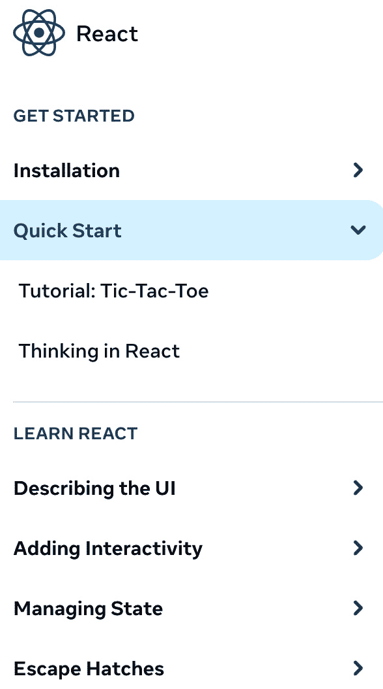
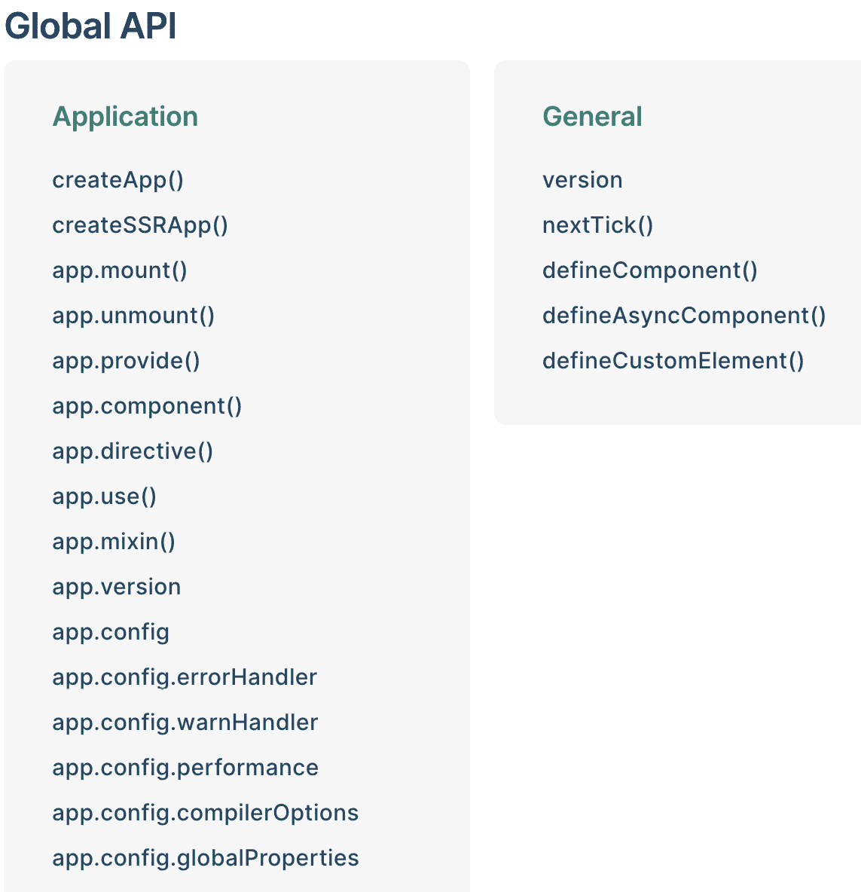
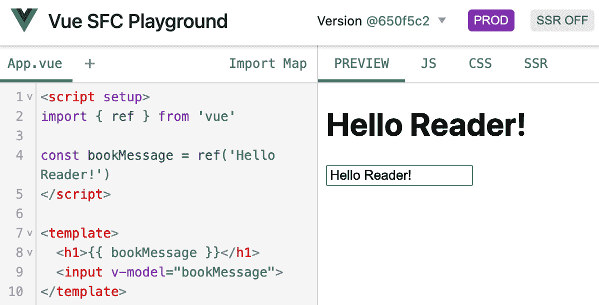
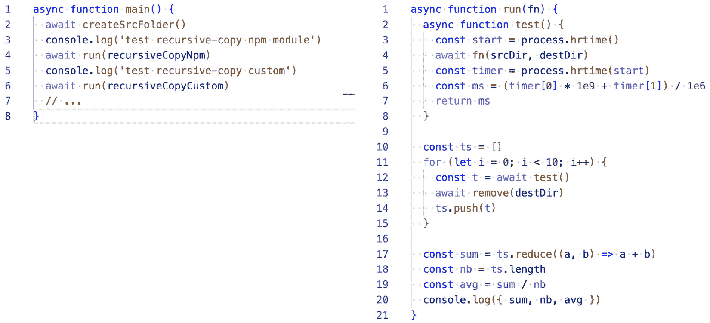
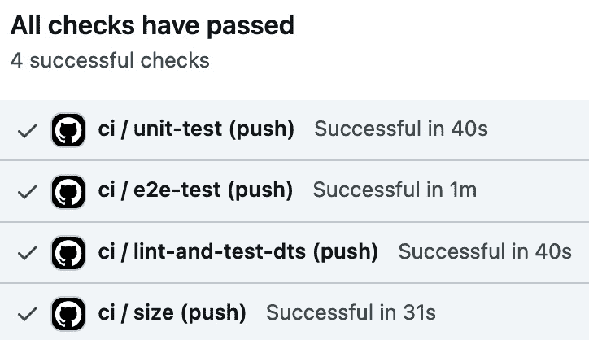
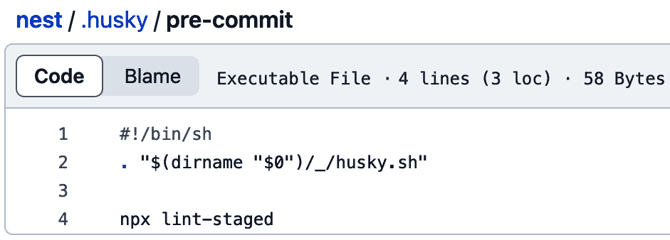
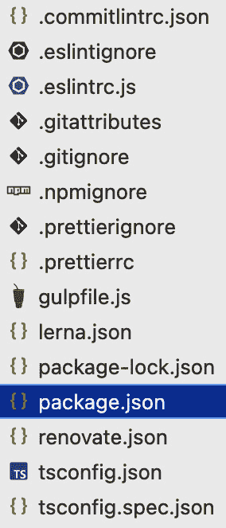

# 第四章：确保框架可用性和质量

继续探讨前一章中框架架构的主题，我们将开始研究 JavaScript 框架的更多架构方面。虽然技术架构扮演核心角色并提供框架的精髓，但工程师还可以添加额外的系统架构元素，以便项目具有更高的可用性和质量。由于我们主要专注于 JavaScript 项目，我们将发现各种有助于我们关注质量的工具。这些工具通常是用 JavaScript 构建的，但它们也与其他系统集成，使得熟悉该语言的人更容易珍惜这些好处。

支持框架的技术可用性是一系列开发质量和可用性模式。这包括作为框架开发和使用的部分使用的附加基础设施。通常，我们将这些组件视为提高我们框架生命周期的工具。首先是确保框架可用性的技术，对于框架作者、贡献者和用户来说。其次是支持性基础设施，如文档和多种类型的测试。

我们将在本章中探讨这些重要主题，重点关注帮助我们构建框架的开发支持模式。就像技术架构一样，这些技能和工具可以在构建任何类型的 JavaScript 框架时应用。本章的主题包括探索以下内容：

+   **框架文档** – 一套书面或生成的材料，提供有关框架功能和如何利用框架进行新项目的信息。为了向最佳实践学习，在本节中，我们将探讨其他 JavaScript 框架如何制作公开和内部文档。

+   **框架测试的多样性** – 广泛用于使用不同类型的工具（如单元测试、端到端测试等）检查框架的正确性。进一步关注 JavaScript 项目，本节将探讨框架项目的测试能力。

+   **开发工具** – 帮助开发过程的外部工具。这包括额外的配置和工具，这些工具有助于框架的内部工作流程，例如持续集成、源代码控制增强和开发调整。在接下来的章节中，我们将看到 Vue.js 和 Nest.js 等 JavaScript 项目使用哪些类型的开发者工具。

+   **通用框架结构** – 理解我们如何根据从其他开源框架架构和本书中迄今为止看到的模式中吸取的教训来创建自己的框架结构。这将为我们提供一个很好的概述，了解作者如何在大型项目中组织 JavaScript 框架代码。

# 技术要求

您可以在本书的存储库中找到本章的资源：[`github.com/PacktPublishing/Building-Your-Own-JavaScript-Framework`](https://github.com/PacktPublishing/Building-Your-Own-JavaScript-Framework)。为了更容易地与本章的实际部分互动，请使用 `chapter4` 目录。交互式脚本将使您更容易运行本章的示例。它的工作方式如下，从您的命令提示符或计算机上的终端窗口执行：

```js
> npm install
...
> npm start
Welcome to Chapter 4!
? Select the demo to run: (Use arrow keys)
> Next.js with Tailwind CSS
  Practical Docus.dev example
```

与其他章节一样，存储库中的代码旨在在可以运行 Node.js 运行时的操作系统上工作，例如 Windows、macOS 和大多数 Linux 变体。

JavaScript 测试复习

在本章中，我们将讨论与 JavaScript 测试相关的话题。如果您需要复习或需要更多资源来深入了解各种测试技术，请查看 Packt 出版物的额外出版物，详情请访问 [subscription.packtpub.com/search?query=javascript+testing](http://subscription.packtpub.com/search?query=javascript+testing)。

# 开发支持

让我们深入研究一系列技术工具，这些工具使开发者能够构建专注于可用性和易用性的高质量框架。学习和利用这些类型的开发支持策略将有助于我们的框架开发，使我们的项目在内部（工作项目）或公共环境中（开源/公开发布的项目）更具可用性。

其中一些开发方法和技能并不特定于 JavaScript 框架开发；它们被广泛应用于许多 JavaScript 和 Web 应用程序开发任务中。然而，在框架开发的背景下，对这些工具和可用性模式的方法与常规应用程序项目不同。例如，一个框架可能有一个特定的扩展测试集，确保新功能和更改不会破坏使用它的现有应用程序。这种扩展测试是仅适用于框架项目而不适用于应用程序项目的特定情况。

此外，一个框架可能更注重技术设计基准测试和兼容性测试，支持各种用例。这很大程度上源于框架消费者和利益相关者的需求。

在 *第三章* 的 *核心 API* 部分，我们看到了接口和功能的示例，例如 *依赖注入*。这些接口旨在通过其灵活性和功能集赋予框架用户权力。然而，这些接口需要文档化，以便开发者可以访问。否则，即使框架接口足够简单或强大，但不可发现或解释，可能不会被用户使用。这些接口还需要进行彻底的测试，无论是独立测试还是作为更大系统的一部分。最后，我们需要各种类型的基础设施来支持这一测试、维护和文档化过程。幸运的是，有许多现有解决方案通过 JavaScript 社区提供的工具和外部软件服务，使框架开发和维护变得更加容易。

让我们关注三个可帮助构建优秀框架的可用性和质量模式类别：

+   **文档** – 针对不同框架利益相关者的材料集合。这些可能是由框架的开发者生成或编写的。此参考也可以是内部的，展示了设计决策和技术架构。

+   **框架测试** – 测试基础设施对于开发、功能集和维护至关重要，因为它们确保框架质量。这包括使用各种工具，例如单元测试、端到端测试和集成测试。

+   **开发工具** – 提高开发者内部工作流程的辅助工具。这些工具集成了简化项目工作的技术。它们通过引入源代码控制改进、持续集成等流程来实现这一点。

这些模式类别的每个类别都有几个子类型。在大多数情况下，多个现有框架在其项目中依赖于这些类型的技巧。我们将在本章中深入探讨这些模式。

*图 4**.1* 展示了 JavaScript 框架今天使用的各种文档类型、测试类型和附加工具的详细概述：

| **文档** | **框架测试** | **开发工具** |
| --- | --- | --- |
| 公共 API | 单元测试 | 持续集成 |
| 示例 | 集成测试 | 源代码控制 |
| 内部文档 | 端到端测试 | 包配置 |
|  | 基准测试 |  |

图 4.1：框架中使用的工具和模式的子类型

我们首先关注文档，这是我们框架无法生存的东西。

## 文档

编写文档是框架适应性和可用性最重要的任务之一。产生的参考资料可以使开发者正确利用提供的工具。框架开发者花费了大量时间编写和调整他们的文档，专注于提供框架功能的组件最详细和最简单的解释。对于一个典型的 Web 应用，你已经有了一些关于如何运行它和配置其部分的功能文档。然而，在开发框架时，需要更多的文档，包括 API 方法、学习材料和其它解决方案，以便更容易地充分利用框架。今天，大多数框架都投资于展示框架的 API 方法，编写帮助开发者从头开始学习框架的文章，创建交互式教程，并提供详细示例，展示框架如何应对特定功能集的挑战。

一个优秀的文档范例来自 React 的创造者——在最近推出的新学习平台[`react.dev`](https://react.dev)上，该平台鼓励在整个生态系统和框架内使用该库。为了鼓励采用和成功知识转移，他们的重点是创建与 API 参考一起的学习环境。

当你开始构建你的框架时，请记住，仅提供一个程序性 API 列表是不够的。在*图 4*.*2*中，我们可以看到有价值参考材料的优秀示例：



图 4.2：学习 React 文档

尽管 React 是一个库，但我们仍然可以从这个项目的文档结构中学到很多。它包括几个关键项。首先是安装指南；这可以包括包安装指南和使用框架搭建新项目的能力。然后，现有或潜在的框架用户将得到一个教程和工具背后的思维模型解释。最后，一系列文章解释了开发者在使用工具时需要了解的最重要的话题。

你的框架应该追求类似的学习文档形式。即使在内部框架开发的情况下，你或你的团队仍然应该记录并创建学习参考材料，以鼓励正确使用你的框架流程。这种做法引导我们进入文档的下一个重要部分——API。

### 公共 API

在*第三章*中，作为探索框架包的一部分，我们检查了框架的入口点。文档作为另一种类型的入口点；开发者通过利用提供的文档与框架交互。主要来说，这种交互可以通过**公共 API**或**API 参考**来实现，这些是从框架的代码及其接口中创建的。

在本书中，我们看到的每个框架都附带了一个与框架一起发布的 API 参考。这种类型的 API 参考可以是静态生成或动态生成的。在*图 4.3*中，我们看到这样一个文档的例子；Vue.js 文档是从[gihub.com/vuejs/docs](http://github.com/vuejs/docs)仓库生成的，并使用静态站点生成器组装的：



图 4.3：Vue.js API 参考的一部分

有许多开源项目可以帮助您更容易地生成和维护文档文件：

+   **Docusaurus** ([docusaurus.io](http://docusaurus.io)) – 一个静态文档站点生成器。特别为框架设计，它提供了搜索、根据框架发布进行版本控制等功能。

+   **MarkDoc** ([markdoc.dev](http://markdoc.dev)) – 另一个用于自定义文档站点的开源项目。它是可扩展的，旨在提供最佳的文档编写和发布体验。

+   **Docus** ([docus.dev](http://docus.dev)) – 一个利用我们熟悉的框架（如 Nuxt.js 和 Vue.js）的文档生成器。支持 Markdown 语法，并在许多服务上实现零配置部署。

+   **TypeDoc** ([typedoc.org](http://typedoc.org)) – 用于 TypeScript 源代码的文档生成器。基于 TypeScript 文件内的注释创建静态站点。该工具还具有将解析的源代码输出为 JSON 文件的能力。类似工具**JSDoc** ([jsdoc.app](http://jsdoc.app))也适用于纯 JavaScript 项目。

+   **TSDoc** ([tsdoc.org](http://tsdoc.org)) – 与 TypeDoc 类似的项目，由微软支持。它通过为其他工具提供基于注释的文档生成引擎，专注于文档生成器的标准化工作。与多个其他项目（如 ESLint 和 Visual Studio Code）有集成。

如果您的框架刚刚起步，使用我们刚刚列出的工具可能有些过度，但鉴于文档对于框架的可用性至关重要，您需要确保使维护可读性和干净的文档变得更容易。您还可以从像 Angular 这样的更大、更复杂的框架中汲取灵感。该项目已经提供了深入的 API 参考（[angular.io/api](http://angular.io/api)），但除此之外，作者还提供了一份关于概念、错误类型和诊断的详尽参考。所有这些都可以在 Angular 网站的**指南**部分（例如，[angular.io/guide/file-structure](http://angular.io/guide/file-structure)）中找到。

随着您开发框架，您可能会在版本与版本之间引入重大的破坏性更改。如果您处于已经存在现有框架消费者的环境中，那么您应该花时间创建一个迁移参考文档。良好的迁移指南有助于您的利益相关者跟上变化并使用最新的修复。一些好的迁移指南示例包括 Electron 的*破坏性更改*指南（[electronjs.org/docs/latest/breaking-changes](http://electronjs.org/docs/latest/breaking-changes)）和 Express 迁移概述（[expressjs.com/en/guide/migrating-5.html](http://expressjs.com/en/guide/migrating-5.html)）。

文档工具的实际应用

本章的仓库目录中包含了一个文档工具实际应用的示例。在这个例子中，示例使用了 Docus，Nuxt.js 框架为项目的后台基础设施提供动力。您可以在自己的电脑上通过在`chapter4`目录中运行交互式脚本或手动导航到`practical-docus`并运行`npm install`，然后`npm run dev`来尝试这个示例。文档站点将在端口`3001`上运行，您可以通过编辑目录中的文件来实时编辑和与文档工具交互。

基本文档可以极大地改善您的框架体验，但您还可以做更多的事情来使适应变得更加容易。在下一节中，我们将重点讨论提供框架使用示例的重要性。这些有意义的资源可以突出框架的强大元素以及与其他系统的集成简便性。

### 示例

提供示例极大地有助于减少适应框架最具挑战性的方面之一——学习曲线。为了鼓励采用并减少摩擦，框架开发者投入时间来制作框架使用的示例。这些可以作为参考文档的一部分，或者与框架源代码一起提供。如果您正在开发一个内部框架，投资于示例仍然是有益的。如果您的项目将被许多内部团队或新员工使用，维护一个示例的基础可以减少问题数量和困惑。

在我参与 JavaScript 测试框架贡献的经验中，最有效的开发投资之一就是专注于创建集成指南和开发示例。这对于测试框架项目尤其重要，因为这些资源的可用性使得开发者更容易将测试框架集成到他们的系统中。它还展示了项目的成熟度，表明它能够与许多不同的系统协同工作。这不仅仅是我的经验，几乎所有 JavaScript 框架都专注于提供即时可运行的示例。这些项目利用 **StackBlitz** ([stackblitz.com](http://stackblitz.com)) 和 **CodePen** ([codepen.io](http://codepen.io)) 等工具，使潜在的开发者能够在几秒钟内进入框架环境。例如，访问 [stackblitz.com/fork/angular](http://stackblitz.com/fork/angular) 会为你提供一个现成的 Angular 框架应用程序。

为了获得更多灵感，Next.js 考虑到示例的思考方式；该框架维护着超过 50 个示例，位于 [github.com/vercel/next.js/tree/canary/examples](http://github.com/vercel/next.js/tree/canary/examples)。这些示例包括对 GraphQL 支持、CMS 和博客用例、与其他工具的集成以及部署目标。为了快速启用用户运行示例，`create-next-app` CLI 支持使用 `example` 参数基于示例来构建：

```js
npx create-next-app --example with-tailwindcss-emotion next-example-app
```

在为您的框架开发示例时，请记住，您将需要维护您创建的所有示例，就像文档参考一样。如果某些示例代码过时且不再按预期工作，那么这将给作为框架维护者的您带来更多负担。

Next.js 的实际示例

您可以在 `next-example-app` 目录下的 `chapter4` 目录中查看此示例。按照 `README.md` 文件中的指南设置 Firebase 项目。该项目需要 Firebase 项目凭据才能正常运行。要初始化 Next.js 应用程序，请运行 `npm install` 然后运行 `npm run dev`。您还可以直接从 `chapter4` 目录使用交互式脚本。

要打开应用程序，请使用 localhost URL，这可能是 `http://localhost:3000`。按照终端输出中的说明操作。要编辑文件，请使用 Visual Studio Code 打开 `next-example-app` 项目目录。

根据您框架的性质，您可以使用 JavaScript 运行时工具为您自己的框架创建一个游乐场环境。在 *图 4**.4 中，我们看到 Vue.js 组件游乐场的示例；这种环境将示例的概念进一步发展：



图 4.4：Vue.js 单文件组件游乐场

每一个“游乐场”示例，你都可以使用最基本的功能来教授框架，从更高级的使用案例。

当你开始自己的框架时，最好将你的示例作为框架存储库的一部分。为了减轻维护负担，确保你在测试基础设施中执行你的示例（更多内容将在*第十章*，有关框架维护）中。如果你独自或与小型团队一起工作，在你的框架中使用包含的示例可以极大地提高开发过程，帮助你快速迭代。

### 内部文档

内部文档的目的是帮助框架作者继续开发框架。即使你是框架的唯一作者，维护内部文档仍然很有用，即使是为了你自己的利益。这样，你可以回顾过去的代码和设计决策，并使更新你的项目更容易。主要来说，这种类型的文档不应该被框架用户或利益相关者消费。然而，对于调试用例，公开这些材料仍然是有用的。

内部文档可能包括内部模块的详细接口。它可能描述内部实现的原理。例如，Nuxt.js 框架在其参考页面上结合了面向公众和内部文档。框架的渲染器、构建器、生成器和其他类在内部术语表中进行了描述（[github.com/nuxt/nuxtjs.org/tree/main/content/en/docs/6.internals-glossary](http://github.com/nuxt/nuxtjs.org/tree/main/content/en/docs/6.internals-glossary)）。例如，Nuxt 提供了自己的模块系统（[nuxtjs.org/docs/directory-structure/modules](http://nuxtjs.org/docs/directory-structure/modules)）以扩展框架功能，该功能的内部实现由 `ModuleContainer` 类支持。这个类是框架内部的一部分，应该仍然被记录。它还使外部开发者能够理解和扩展框架，进行插件开发。

在 Vue.js 中，可以看到使用这种类型文档的另一个框架示例。该框架内部使用 TSDoc 工具来确保其函数的规范，例如共享实用方法。

以下代码是从框架的开发者工具存储库中提取的（[github.com/vuejs/devtools/blob/main/packages/shared-utils/src/util.ts](http://github.com/vuejs/devtools/blob/main/packages/shared-utils/src/util.ts)），它是框架开发者在浏览文件时可以使用的文档注释的简单示例，可以稍后导出到外部文档，或者在使用此辅助函数时由 IDE 预览：

```js
/**
 * Compares two values
 * @param {*} value Mixed type value that will be cast to string
 * @param {string} searchTerm Search string
 * @returns {boolean} Search match
 */
function compare (value, searchTerm) {
  return ('' + value).toLowerCase().indexOf(searchTerm) !== -1
}
```

**贡献指南**也是这类内部文档的一部分。对于开源和封闭框架，都可能有人想要对框架进行更改或贡献，无论是帮助你修复问题还是引入新功能。贡献文档有助于实现这一点，提供了快速编写和测试新框架更改的步骤。作为贡献说明的一部分，通常很重要列出以下几项重要信息：

+   首先，如何修改框架、构建它以及测试它。这包括指向所有使开发过程更易于接近的相关脚本。

+   其次，如何在开源和内部环境中成功编写补丁，包括遵循源代码控制指南和提交历史规则。

+   为了使框架贡献更容易，这类文档应提及关于公共和内部 API 的编码规则、文件格式化以及其他潜在的风格指南。

例如，Ember.js 在其贡献指南页面[guides.emberjs.com/release/contributing](http://guides.emberjs.com/release/contributing)上有一个页面，其他框架如 Angular 在其 GitHub 存储库[github.com/angular/angular/blob/main/CONTRIBUTING.md](http://github.com/angular/angular/blob/main/CONTRIBUTING.md)中包含一个`CONTRIBUTING.md`文件。

## 框架测试

就像任何软件项目一样，框架需要一系列测试来确保框架按预期工作。在框架的上下文中，你会找到许多针对正确性、性能以及需要处理所有可能使用场景的特殊框架用例的深入测试。我们在*第一章*的[*测试框架*](https://wiki.example.org/testing_frameworks)部分看到了测试框架的例子；这些可以在我们的框架内部使用，以简化测试工作流程。在本节中，我们将探讨 JavaScript 框架内部使用哪些技术来确保最终框架产品具有高质量。

### 单元测试

就像大多数软件项目一样，框架也包括针对其接口的单元测试。它们使用与我们在*第一章*中看到的类似的测试框架。通常，你会看到这些类型的测试被称为“specs”，这意味着它们是*规范测试*。这意味着，对于框架的某个组件，存在一个它应该遵守的技术规范。在框架的上下文中，全面的测试有助于更快地重构主要组件。开源框架在接收外部代码贡献时，也受益于良好的单元测试套件。当存在大量现有测试和新测试作为变更的一部分被添加时，审查代码变更并对其有信心要容易得多。

根据 JavaScript 框架的类型，测试环境和测试挑战可能会有所不同。在针对浏览器的框架中，单元测试需要模拟浏览器和 Web API。例如，Angular 引入了几个内部测试接口，以简化与注入到 DOM 中的组件一起工作。Angular 的“变更检测”和其他与 DOM 相关的功能使用这些测试接口来抽象处理`document`对象实例。例如，Angular 开发者创建了几个测试包装器，以便更容易地将框架的节点树附加到 DOM 主体，如下面的函数所示：

```js
export function withBody<T extends Function>(html: string, blockFn: T): T {
 return wrapTestFn(() => document.body, html, blockFn);
}
```

`change_detection_spec.ts` 文件依赖于测试工具中的 `withBody` 辅助函数；这些工具依赖于在一个存在 `document` 对象的环境中执行许多框架的测试。

在后端框架中，项目可以选择模拟现有接口或创建仅用于测试的类。例如，Nest.js 定义了一个 `NoopHttpAdapter` 类 ([`github.com/nestjs/nest/blob/master/packages/core/test/utils/noop-adapter.spec.ts`](https://github.com/nestjs/nest/blob/master/packages/core/test/utils/noop-adapter.spec.ts))，它扩展了之前在*第二章*的“后端抽象”部分中看到的 `AbstractHttpAdapter`。以下代码显示了测试适配器的结构，以便更容易在框架测试中使用它：

```js
export class NoopHttpAdapter extends AbstractHttpAdapter {
  constructor(instance: any) {
    super(instance);
  }
  close(): any {}
  initHttpServer(options: any): any {}
  // …
  }
}
```

这个 `HttpAdapter` TypeScript 类在框架的规范测试中使用，以确保主要的 `Application`、`Routing` 和 `Middleware` 类按预期工作。

在开发 JavaScript 框架时，确保对每个新添加的组件或接口进行单元测试。这个过程将以多种方式帮助你：

+   这将提高代码质量，并帮助你组织框架，使其组件更好地协同工作。

+   框架开发过程充满了持续的重构或更改。随着框架的增长，你的单元测试套件也会增长，并且随着你编码，你将增加对更改的信心。

最后，确保你的单元测试套件运行高效。例如，Vue.js 使用 Vitest 测试运行器。Vue 有超过 2,500 个单元测试，大约在 20 秒内执行。你的框架单元测试应该尽可能快地运行，以便在你忙于开发新框架功能时提供快速的反馈循环。

### 集成测试

集成测试的目的是为了测试框架的多个接口或组件如何协同工作。这些测试可以捕捉到单元测试/规范测试无法检测到的问题，因为这些类型的测试旨在单独测试组件。集成测试模拟组件之间的交互，确保功能能够良好地协同工作。

在框架的背景下，内部核心架构必须相互匹配。这意味着集成测试将验证这种行为。例如，对于一个全栈框架来说，一个好的集成测试将确保当调用特定的`router`路由时，组件会被渲染。这种测试确保所有这些组件都能良好地协同工作。

此外，框架通常需要与其他系统集成。这意味着开发者还需要在框架和外部系统之间产生集成测试。例如，Gatsby 框架为其静态站点渲染、命令行界面和缓存基础设施提供了集成测试([github.com/gatsbyjs/gatsby/tree/master/integration-tests](http://github.com/gatsbyjs/gatsby/tree/master/integration-tests))。这些测试验证了框架的功能。然而，Gatsby 还包括集成测试来验证它与其他技术的兼容性。该框架有一个集成测试来验证与 JavaScript ESM 模块标准的兼容性。

编写集成测试可能具有挑战性，因为你必须验证所有类型的接口组合是否能够无缝协同工作。尽管它是框架开发过程中的一个基本部分，但如果你在匆忙交付新的框架项目，这种类型的测试最终可能比单元测试更有益。

### 端到端测试

端到端测试评估框架作为一个整体系统的工作情况。通常，这些测试模拟了几乎真实的用户交互。对于一个前端框架来说，创建这些测试通常意味着配置一个端到端测试框架。对于服务器端框架，端到端测试通常模拟对由框架驱动的服务器的真实请求。类似于其集成测试集，Gatsby 也维护了一套`transition`、`grid`和`tree-view`接口。这些可以在[github.com/vuejs/core/tree/main/packages/vue/__tests__/e2e](http://github.com/vuejs/core/tree/main/packages/vue/__tests__/e2e)找到。这些测试使用 Puppeteer 在无头 Chrome 浏览器中执行命令，从而模拟真实的浏览器和用户行为。

一个广泛的端到端测试套件可以通过几种方式支持你的框架开发：

+   捕获整个系统的回归，例如模拟常见的框架命令和预期功能。

+   确认在您进行更改和开发新功能时，框架的所有组件都能协同工作。

+   将性能测试集成到端到端测试中，以便能够检测框架的缓慢性能。

+   确保框架能够正确地与外部系统协同工作。这些系统可以包括不同类型的网络浏览器或不同的后端环境。

另一种对许多当前项目都相关的框架测试形式是基准测试。

### 基准测试

基准测试的过程是在你框架的特定场景上运行一系列评估和试验。这些基准测试可以由框架作者或第三方编写。为了构建框架的目的，我们专注于前者，即框架将其一系列基准测试作为其内部测试的一部分。框架可以在诸如渲染特定组件配置等任务上通过基准测试分数进行竞争。对于后端框架，内存利用率、请求吞吐量和延迟等因素通常会被基准测试。为了获得灵感，Nest.js 在 [github.com/nestjs/nest/tree/master/benchmarks](http://github.com/nestjs/nest/tree/master/benchmarks) 维护了一套基准测试工具，以比较框架提供的 HTTP 服务器的性能。在其他类型的框架中，如应用开发（Electron）和测试框架，基准测试也集中在性能上。正如我们在本章前面的 *框架测试* 部分所看到的，测试框架本身需要尽可能高效地执行测试套件。

对于 JavaScript 框架来说，在运行时对代码的性能进行基准测试是至关重要的。在浏览器运行时，基准测试主要关注高效的渲染和大量输入的处理。在完整的全栈 Next.js 框架中，作者包含了一些基准测试脚本以测试各种功能（位于 [github.com/vercel/next.js/blob/canary/bench](http://github.com/vercel/next.js/blob/canary/bench)）。当你开发自己的基准测试时，请记住你可能不需要任何复杂的工具。相反，你可以依赖运行时的内置方法——在这种情况下，是 Node.js。

*图 4**.5* 展示了一个简单的基准测试脚本 [github.com/vercel/next.js/blob/canary/bench/recursive-copy/run.js](http://github.com/vercel/next.js/blob/canary/bench/recursive-copy/run.js))：



图 4.5：Next.js 仓库中的基准测试

在 *图 4**.5* 中，主函数提供了一个递归复制实现给测试。使用两种不同的实现执行 `run` 函数，为我们提供了这两个函数的比较结果。

对于后端框架，内存利用率、请求吞吐量和延迟等因素通常会被基准测试。为了获得灵感，Nest.js 在 [github.com/nestjs/nest/tree/master/benchmarks](http://github.com/nestjs/nest/tree/master/benchmarks) 维护了一套基准测试工具，以比较框架提供的 HTTP 服务器的性能。在其他类型的框架中，如应用开发（Electron）和测试框架，基准测试也集中在性能上。正如我们在本章前面的 *框架测试* 部分所看到的，测试框架本身需要尽可能高效地执行测试套件。

作为框架开发者，你应该专注于为两种用例设置基准测试：

+   首先，基准测试针对你框架公开的公共接口。这些将允许你衡量你的框架完成任务所需的时间。

+   其次，你希望深入了解框架内部的微基准测试。这些内部基准测试有助于优化框架核心的特定部分，从而提高内部函数的速度。

随着你进一步开发你的项目，关注你的基准测试的测量结果，确保你不会降低框架的速度。

## 开发工具

框架开发和发布流程可以从包含提高框架项目质量和可用性的额外工具中受益。这些工作流程可以应用于框架的各个方面，例如依赖管理、测试、编辑器配置、格式化等。我们已经在 *第三章* 的 *二进制和脚本* 部分看到了类似的方法，依赖于额外的脚本和工具。可以改善我们框架开发周期的额外工具包括引入持续集成步骤、改进源控制和添加包级实用工具。

### 持续集成

作为开发周期的一部分，就像许多 Web 应用程序项目一样，框架配置 **持续集成** (**CI**) 步骤来测试代码更改和新版本。这些 CI 系统运行所有类型的测试，如本章 *框架测试* 部分中提到的测试。使用版本控制系统提交的每个更改都必须通过现有的测试套件。这确保了更改不会引入破坏性更改或错误。除了运行测试之外，CI 还运行其他类型的分析，如格式检查、linting 等。这些确保了一致性、可用性和质量。

如果我们专注于框架开发，CI 有一些特殊用途。它确保框架在不同的 JavaScript 环境中正常工作。对于一个前端框架来说，这意味着在不同的平台上执行各种浏览器的测试。浏览器支持测试是双向的——新功能必须在旧浏览器版本中工作，而新浏览器不应该破坏现有框架的任何功能。运行在后端的 Node.js 和 Deno 框架跟踪新的运行时版本，遵循 [github.com/nodejs/release](http://github.com/nodejs/release) 发布计划。在 CI 中运行这些兼容性检查是最佳解决方案；CI 平台允许快速启动不同版本的环境，并在此环境中并行化测试执行。

除了在各种环境中关注测试之外，CI 步骤还可以运行一系列依赖于你的框架的项目测试。例如，它可以生成并运行一个示例应用程序或外部脚本，应用新的框架更改。这样，它可以检查更改是否兼容。

根据框架 CI 配置的不同，集成故事可能会有所不同。在 *图 4*.6 中，我们看到四个成功的检查；这是 Vue.js CI 管道的一部分：



图 4.6：Vue.js 报告其 CI 状态

在 Angular 的情况下，在代码更改可以合并到存储库之前，CI 管道中存在超过 20 个检查。越来越多的集成步骤的原因是执行任务而不是测试。这些可能包括格式化、拼写和 JavaScript 代码可用性检查。

CI 步骤的复杂性和类型可能有所不同，它们还可以为您的框架发布过程做出贡献。无论您正在开发哪种类型的框架，内部或公共的，都强烈建议将 CI 步骤配置为框架开发的一部分。这种方法将确保代码质量并帮助您在框架开发中保持效率。

### 源代码控制

对于框架，使用源代码控制类似于使用它进行其他应用程序项目。尽管如此，JavaScript 框架依赖于源代码控制工具来标记框架发布和跟踪功能开发分支。在此背景下使用源代码控制要深入一些。例如，框架作者可能需要为框架的旧版本编写补丁，这意味着需要回退到旧的 Git 标签以引入该更改。在许多情况下，大型框架重构也发生在临时的 Git 分支中。

大多数 JavaScript 框架也会配置补充的源代码控制脚本，以改善新功能和更改开发时的工作流程。在*图 4**.7*中，我们看到 Nest 框架使用 Git pre-commit 钩子来执行 JavaScript 代码检查脚本：



图 4.7：pre-commit 钩子配置

在此情况下（*图 4**.7*），pre-commit 钩子强制在提交更改之前执行代码质量标准。使用名为**Husky**（[typicode.github.io/husky](http://typicode.github.io/husky)）的 JavaScript 模块配置此类行为的步骤被简化了。您将在许多框架中找到这种模式，因为这是使开发过程更加友好的便捷补充。

到这一点，您将使用源代码控制来管理您的新框架是肯定的。然而，您可以通过学习本书中看到的一些现有框架来投资额外的工具，以改善您的编码工作流程。

### 包配置

`package.json`文件和框架目录根目录中的附加文件定义了项目的包配置。此类配置的数量可能因您在框架中使用的工具类型而异。

Nest.js 的包配置由许多工具组成，例如 ESLint、Git、npm 和 Gulp 等。类似于*图 4**.8*中看到的 Nest.js 配置，`package.json`文件将是您框架的开发入口点：



图 4.8：Nest.js 的包配置

`package.json` 文件包含有关框架、其依赖项以及由其他工具使用的辅助配置的信息。例如，Nest.js 的包文件 ([github.com/nestjs/nest/blob/master/package.json](http://github.com/nestjs/nest/blob/master/package.json)) 存储了 `nyc` 代码覆盖率工具的配置、`mocha` 测试运行器的配置以及变更日志工具的命令。除了这些配置条目之外，包文件还有一个 `scripts` 对象。此对象包含在框架开发期间可以使用的命令。在 Nest.js 的情况下，这些命令执行以下一些操作：

+   **构建** – 编译或构建框架的命令。Nest.js 将 TypeScript 编译器作为此命令的一部分执行。

+   **清理** – 一个快速命令，用于清理框架项目的工作目录。通常，这意味着删除任何生成的或构建的文件。

+   **测试** – 运行框架中包含的所有类型测试的命令。在 Nest.js 和许多其他框架的情况下，这些类型的命令通常根据它们运行的测试类型进行拆分。

+   **代码风格检查** – 分析项目中的 JavaScript 代码，寻找编码风格错误、陷阱和潜在问题。Nest.js 使用 ESLint，并行运行以快速诊断框架文件。

+   `npm`.

+   **安装** – 安装项目的依赖项。在 Nest.js 的情况下，依赖模块提供了运行后端服务所需的功能。开发者依赖列表包含所有用于框架项目的基础设施模块。

+   **覆盖率** – 运行测试代码覆盖率工具以确定是否需要更多测试来完全覆盖所有框架逻辑。例如，Nest.js 使用 **Istanbul** ([istanbul.js.org](http://istanbul.js.org)) 生成代码覆盖率报告。

这不是一个详尽的列表，但它为你的项目中可以包含的命令类型提供了一些灵感。`package.json` 文件的 `scripts` 部分通常遵循 [docs.npmjs.com/cli/using-npm/scripts](http://docs.npmjs.com/cli/using-npm/scripts) 上的参考材料，但不同的 JavaScript 包管理器可能对这些命令的处理略有不同。你的框架应该利用 `package.json` 的优势，创建快速可访问的脚本，并将 `package.json` 文件配置为框架开发工作流程的入口点。

正如我们在本节中看到的，有许多开发工具可以增强框架开发，并且对于使项目成功至关重要。这些开发模式已经经过多年的改进，并且现在已深深嵌入到许多 JavaScript 项目中。在下一节中，我们将探讨框架结构的整体图景，这将为我们自己的框架项目提供一个坚实的轮廓。

# 从其他架构中学习

在当前和前几章中，我们看到了框架使用的技术结构、工具和模式。如果我们浏览在*第一章*的“框架展示”部分收集的框架源代码，我们可以开始清楚地看到重复的模式。遵循这些实践，我们可以在自己的框架开发中利用它们。通过从不同类型的 JavaScript 框架的现有设计中汲取知识，我们可以构想出一个结构系统，它在我们构建项目时能为我们提供良好的服务。我们可以将这些方法和实践融合到一个通用的框架结构中。

以下代码显示了通用的 JavaScript 框架结构：

```js
<root framework directory>
  | <main framework packages>
    + <core framework interfaces...>
    + <compiler / bundler>
  | <tests>
    + <unit tests>
    + <integration and end-to-end tests>
    + <benchmarks>
  | <static / dynamic typings>
  | <documentation>
  | <examples / samples>
  | <framework scripts>
  | LICENSE
  | README documentation
  | package.json (package configuration)
  | <.continuous integration>
  | <.source control add-ons>
  | <.editor and formatting configurations>
```

本项目结构应有助于阐明我们的框架项目结构的处理方法，并赋予您作为开发者设计自己项目结构的能力。框架文件和目录结构是前两章的总结，结合了我们迄今为止看到的大部分组件——框架包、编译器基础设施、框架测试、文档、脚本等。未来的章节将使用这个结构来构建我们的框架。

当我们查看核心架构和框架项目的示例时，有助于我们形成我们的框架将包含的内容和外观。在当前架构示例中我们看到的一切并不一定都是我们的框架功能或成功所必需的。实际上，如果您只为内部项目构建框架，那么您将选择不同的工具组合来帮助您进行开发。

# 摘要

本章介绍了框架文档的重要性、提高稳定性的各种测试以及建立高效框架工作流程的内部工具。对良好文档的投资有助于框架作者和框架用户。缺乏明确定义的文档可能会对框架的成功造成毁灭性的影响。幸运的是，有许多工具可以帮助简化文档的方法。同样，存在用于测试工作流程的工具，涵盖了框架内代码测试的所有方面。最后，额外的工具，如改进的源代码控制和编辑器配置，使得在框架上工作变得更加愉快，并帮助作者专注于框架内部。所有这些开发支持因素在框架开发和架构中发挥着至关重要的作用。从其他项目学习并利用支持开发过程的模式可以帮助我们扩展我们的架构技能并提高效率。

到目前为止，我们已经了解了大量现有的框架技术，这些技术能够支持针对 JavaScript 运行时的 Web 应用程序和后端服务开发。在接下来的章节中，利用这些知识和对现有框架项目的详细了解，我们将深入探讨我们框架构建的各个方面。这意味着从头开始启动一个全新的项目。利用从现有项目中学到的模式、抽象和经验教训，我们能够体验到构建我们自己的框架需要哪些要素。

下一章将重点介绍框架作者在开始新项目之前需要考虑的一些因素。

# 第二部分：框架开发

在本部分，本书基于现实世界的框架示例，并转换方向，专注于从头开始创建框架的编程方面。目标是涵盖规划、架构和发布全新全栈框架的完整过程。这些阶段包括几个重要的考虑因素和关于各种类型组件架构的教训。重点是每个过程步骤的实用方法和指导，这对所有类型的开发者都有益。

在本部分，我们涵盖了以下章节：

+   *第五章*，*框架考虑因素*

+   *第六章*，*通过示例构建框架*

+   *第七章*，*创建全栈框架*

+   *第八章*，*架构前端框架*
