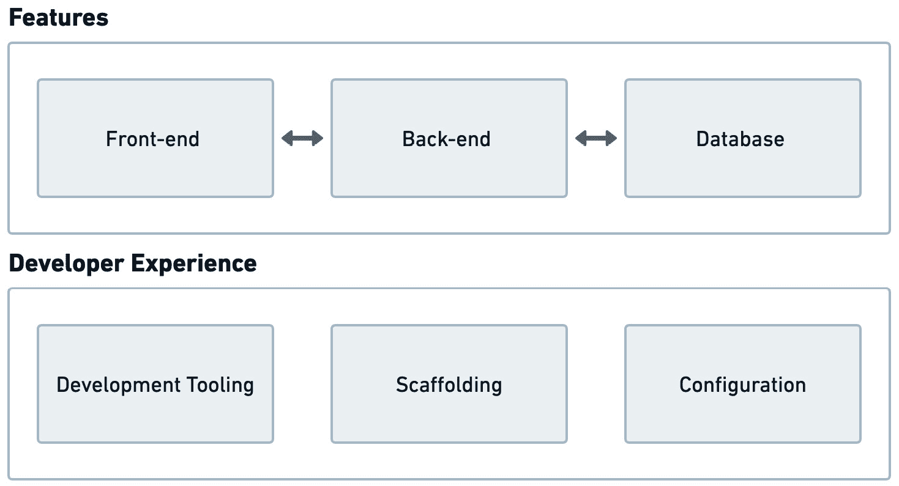
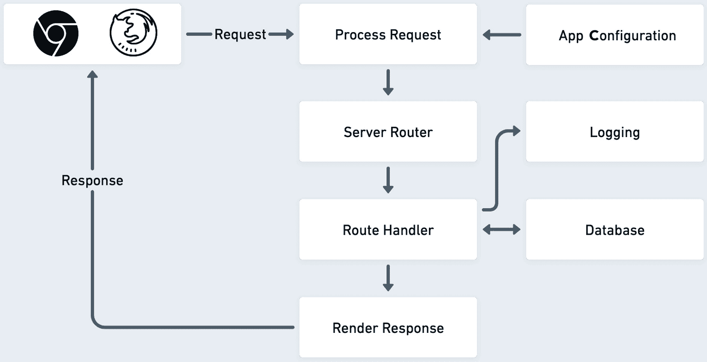
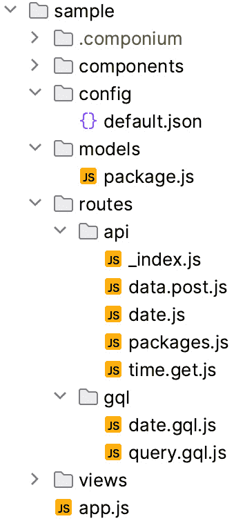
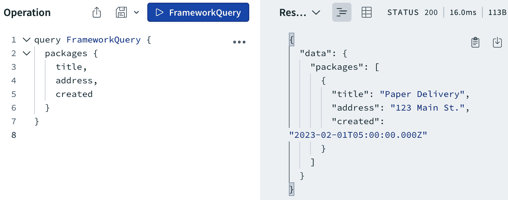
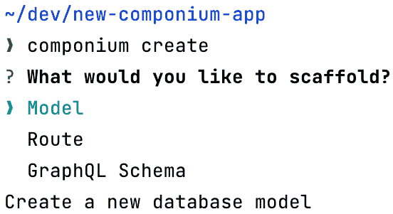

# 第七章：创建全栈框架

在*第六章*中，我们学习了一个构建简单 JavaScript 测试框架的实用示例。在本章中，我们将继续这种实用方法，进一步深入框架的开发。

下一个目标是开发一个全栈框架，它将使开发者能够构建大型和小型 Web 应用程序。本章将从开发此类框架的后端部分开始，重点关注服务器端组件和集成基本开发者工具。一旦建立这些后端组件，将帮助我们支持我们在*第八章*中创建的框架的前端元素。在本章中开发后端功能集将帮助我们完成以下工作：

+   定义我们新全栈框架的技术架构和目标。这与*第六章*的练习类似，但现在我们将切换上下文，更多地关注后端服务器功能的技术挑战。

+   了解构建功能齐全的全栈工具所需的组件。我们将研究和探索我们可以构建的抽象以及框架的核心部分，这将使其在许多开发场景中可用。

+   确定将提高可用性的功能，重点关注赋予开发者权力并提高效率的功能。这些包括帮助从模板自动生成框架脚手架并提高开发生产力的工具。

# 技术要求

实现的框架代码位于本书的代码库中，网址为[`github.com/PacktPublishing/Building-Your-Own-JavaScript-Framework`](https://github.com/PacktPublishing/Building-Your-Own-JavaScript-Framework)。资源和代码位于`chapter7`目录中。与*第六章*一样，我们将利用 Node.js v20 或更高版本进行此项目。

如果您想在本地运行或调整框架文件，请参阅章节目录中框架的`README.md`文件。`npm scripts`在开发期间使用快捷方式很有用。与其他项目一样，要开始工作于框架，您需要使用`npm install`安装依赖项。

该框架提供了一个可执行文件，有助于创建项目的框架轮廓、运行新创建的应用程序等。要从`chapter7`目录本地安装`componium`框架的可执行文件，可以将可执行文件链接到不同的目录中使用。为此，从已签出的存储库目录，使用`npm link <path>/chapter7/componium`。这将链接全局框架可执行文件到您的终端 shell，您可以在示例项目中使用它。此外，如果您对框架文件进行了任何更改，可执行文件将立即获取这些更改，因为脚本是直接链接的。查看详细的`npm link`指令，链接为[docs.npmjs.com/cli/commands/npm-link](https://docs.npmjs.com/cli/commands/npm-link)以及关于 Windows 兼容性的以下注意事项。

关于 Windows 兼容性的注意事项

在 Windows 操作系统中使用框架可执行文件和命令（如`npm link`）时，有一些事项需要注意。当运行`npm link chapter7\componium`或其他命令时，您可能会遇到一些与可执行环境相关的问题。可能会发生一些常见错误，包括以下内容。

如果您遇到与`enoent ENOENT: no such file or directory AppData\Roaming\npm`相关的错误，请确保在指定路径中创建该目录。这通常是 Windows 上`npm`安装程序的一个副作用。

如果遇到`UnauthorizedAccessException`问题，这是 Windows 的标准安全措施。要修复此问题，请运行`Set-ExecutionPolicy RemoteSigned`并允许执行。有关更多信息，请参阅 Microsoft 的文档，链接为[learn.microsoft.com/en-us/powershell/module/microsoft.powershell.security/set-executionpolicy](https://learn.microsoft.com/en-us/powershell/module/microsoft.powershell.security/set-executionpolicy)。

您还可以参考 npm 的[常见错误](https://docs.npmjs.com/common-errors)文章。如果您能够成功使用 PowerShell 或命令提示符运行`componium --version`，则表示您的环境配置正确。

# 全栈框架目标

在我们进入这个项目的软件架构部分之前，我们需要更深入地了解一个全栈框架将包含哪些内容，特别是在 JavaScript 环境和语言生态系统中。当开发一个全栈 JavaScript 框架时，我们可以创建一系列抽象和约定，以帮助开发者根据 JavaScript 语言及其生态系统的模块化特性，生成前端和后端组件的组合。从 JavaScript 语言的角度来看，框架可以利用最新的语法和功能改进，例如 ES6 模块和现代 Web API。在生态系统方面，我们将大量依赖已经建立的模块来启用某些功能。类似于*第六章*中的方法，这种策略使我们能够专注于更大的系统设计，并实现更好的功能覆盖。

全栈框架的主要目标是简化应用程序开发过程，通过提供一种结构化和标准化的方式来构建应用程序，使其更快、更高效。我们在*第一章*中看到了这些技术解决方案的多样性，其中像 Next.js 这样的框架在整个栈上创建了一个更加流畅和有见地的工作流程。与 Next.js 类似的项目封装了开发的所有方面，覆盖了许多用例，旨在消除在不同开发层决定不同技术的必要性，并提供一个单一的统一愿景。本章中我们样本框架项目的目标之一是关注开发统一功能集的类似示例，其中组件可以自然地结合在一起。

本章中框架的实现愿景应该提供一个统一的 API，以便使用该 API 的开发者可以轻松熟悉其结构和功能，减少与新技术采用相关联的学习曲线。不同功能之间的熟悉度和互操作性确保了开发者能够获得无缝的体验。框架 API 提供了抽象（在*第二章*的“关于抽象”部分中突出显示），这使得复杂操作变得简单，同时不牺牲高级用例所需的灵活性。创建易于使用的公共框架 API 接口的方法对于支持开发者的不同技能水平和稳健应用的需求至关重要。当你开发或支持本章中类似实际示例的全栈框架时，你也将不得不考虑各种功能。你会发现，在你的特定场景中，你将更多地投资于对你组织来说优先级更高的功能集。

首先查看服务器端功能集，一个全栈 JavaScript 框架必须能够提供一组基本构建块来处理标准用例，基于不同的技术挑战。这些由构建块驱动的功能可能包括请求路由、数据库集成、事件、日志和性能扩展的统一接口。在某些情况下，框架还可以提供超出开发者项目需求的功能。因此，作为开发过程的一部分，我们必须在使用内置功能和提供各种可扩展性选项之间取得平衡。我们在*第三章*的“插件和扩展 API”部分中看到了这种情况，其中服务器端框架包括扩展和启用附加功能的方法。除了提供具有最佳开发者体验的庞大、灵活的功能集外，应用程序还必须易于部署，并在生产环境中运行时能够进行监控。在这种情况下，追求的目标是使开发者能够轻松部署他们的应用程序，随着流量的增加而扩展这些应用程序，并监控延迟和错误率。这涉及到构建设置多个服务器实例的实用程序、定义数据库迁移等。

在定义全栈框架的预期功能时，我们需要定义前端和后端功能将如何相互交互以及我们希望从哪里开始初始开发。全栈框架这两方面的考虑将在下一节中探讨。

## 前端功能

在全栈框架的前端方面，重点应放在提供与后端服务良好交互的前端组件的无缝集成。这些类型的功能的例子可能包括轻松从服务器获取数据、渲染前端组件以及访问静态文件。Ember.js，连同 EmberData，提供了如何有效地与服务器端系统协作的实例。另一个例子是 Next.js，它为服务器和客户端提供了一种紧密集成的解决方案。通常，有偏见的组件可以定义框架如何与网络请求接收到的数据交互，以及数据如何绑定到前端视图和组件上。

前端功能集应该能够处理标准的前端需求。这可能包括通过提供一种简单的方法将库集成到项目中，来与流行的库一起工作。一个广泛的前端解决方案应该促进客户端路由，并能够管理依赖关系、处理表单验证、用户输入净化和 JavaScript 代码打包。应用程序状态管理是另一个重要的组件，可以帮助管理大型项目的复杂性。



图 7.1：全栈框架的焦点

最终，开发一个全面的全栈框架的过程需要探索技术的许多方面。这一举措还需要广泛的编程技能。你将需要深入前端功能的复杂性，在那里你将关注用户体验，以及后端挑战，重点关注服务器、数据库和应用逻辑。开发过程将提高你的编码能力，并促进对整个 Web 开发生态系统的更好理解。在*图 7**.1*中，我们分解了我们框架开发的两个重要方面。**功能**将提供构建前端和后端组件所需的功能，与数据库等服务进行交互，而**开发者体验**将使这些功能可重用且易于访问，适用于应用项目。所有这些工作的结果将是一个可供各种利益相关者使用的项目，满足开发者生产能够推动新服务和基于 Web 的软件产品的 Web 应用程序的需求。

## 后端功能

我们首先从后端功能开发开始。这种方法将为项目提供一个基础，以便稍后在其之上添加前端功能，以完成全栈功能集。在下一章中，我们将重点关注前端功能和架构。目前，我们将假设我们的后端框架可以向浏览器客户端发送文件，并且可以与任何前端框架一起使用。基于浏览器的应用程序可以向服务器端组件发出请求，以获取数据、静态文件或网页。


图 7.2：我们的全栈框架标志

我们将重用*第六章*中建立的相同 Componium 项目标识和品牌。我们现在有一个新的标志，如图*图 7**.2*所示，作为品牌示例，以识别我们的全栈项目。Componium 术语和品牌将涵盖框架的所有部分，并将被用于命令行界面。考虑到目标开发者用户群，以下是为该项目列出的一些潜在的后端入门功能：

+   **API 部署**：部署 API 服务的能力。API 功能应该足够灵活，使我们能够轻松配置端点并添加功能中间件到所选端点。API 功能还应包括定义 GraphQL 资源和模式时的模块化方法。

+   **页面渲染功能**：提供带有自定义和可重用布局的网页，其中包含静态和动态数据的能力。

+   **中间件机制**：可以添加各种类型的服务器中间件（如身份验证）到应用程序的所有或某些路由中。

+   **数据库功能**：提供使用不同类型数据库技术的数据库**对象关系映射**（ORM）功能。

+   **应用程序可伸缩性**：设计用于处理高负载情况并提供可伸缩性和性能优化选项。该框架应提供必要的工具来测试、调试和部署应用程序。

+   **开发工具**：该框架提供各种辅助工具以简化开发过程。这些工具可能包括应用程序引导和标准组件的脚手架搭建。通过避免每次更改手动重启进程，实时重新加载后端服务器也可以节省大量时间。

这些功能目标现在定义得足够详细，涵盖了前端和后端体验。利用本节中的考虑因素，我们已准备好进入构建全栈框架初始部分的激动人心的步骤。

# 架构

现在我们对后端功能有了更清晰的定义，我们可以开始设计框架的包和组件。我们需要对服务器和路由接口进行封装，以及额外的组件，使我们能够与数据库通信，获取特定应用程序配置，并通过日志记录报告指标或日志。



图 7.3：请求生命周期

*图 7.3* 表示了我们框架将处理的请求生命周期的简化视图。请求可以来自浏览器客户端，或者可能是直接请求到我们框架需要处理的服务的 API 端点。您可以在章节目录下的 `tests/sample` 中找到使用我们框架构建的示例应用程序。



图 7.4：一个示例应用程序布局

我们现在对框架如何通过其内部处理请求有一个概述。*图 7.4* 展示了一个应用程序布局的示例，包括后端 API 和 GraphQL 路由。开发者可以利用这种结构来构建不同类型的后端应用程序。在接下来的章节中，我们将深入探讨使这种应用程序布局成为可能的入口点、路由器、配置、数据库和可观察性功能。您可以在章节目录下的 `componium/tests/sample` 中找到文件。其中一些文件，如 `*.log` 文件，将在应用程序启动并产生一些日志时自动生成；通常，这些日志文件会被版本控制系统忽略。

## 入口点

服务器文件是我们后端框架提供大部分功能的入口点。它启动一个进程，加载适当的配置，如果指定则连接到数据库，并建立请求路由处理程序。在*第六章*中，我们有一个更简单的服务器（位于项目文件`componium-test/blob/main/packages/browser/server.js`），使用`http.createServer(...)` Node.js API 开发。我们可以遵循相同的策略，从头开始构建一个新的服务器。然而，对于一个全栈框架，我们需要一个更成熟的解决方案，它已经提供了许多服务器接口。对于这个项目，一个很好的折中方案是使用`express`模块并在其之上创建抽象。*Express*将允许我们定义中间件、自定义路由器、解析请求、构建 API 响应等。如果这听起来很熟悉，这是因为这与*第四章*中预览的 NestJS 框架项目架构相似。

为了扩展服务器功能，我们还将允许开发者在同一应用程序上下文中创建多个服务器，如下所示：

```js
import Componium from "componium";
const app = await Componium.initialize();
const server = await app.createServer({...});
```

在服务器接口就绪后，我们现在可以在端口上接受请求，并使用符合我们要求的选项配置服务器。一旦创建服务器，如前述代码所示，其主要目的是处理端点并执行后端任务。为了处理端点，我们将引入*路由*接口。它在接受请求并启用 API 功能时发挥作用。

## 路由器

在这个框架中，我们希望提供基于文件和动态路由的选项。这涉及到使用与 Next.js 中基于文件的路由器类似的功能。我们在*第二章*的构建块概述中看到了这个概念。路由器的实现可以在框架的服务器包中找到 – 例如，基于文件的路由器在`packages/server/file-router.js`。

基于文件的路由实现能够从目录结构中递归地加载 API 端点。基于文件的功能允许进行一些手动配置。默认情况下，框架可以在项目的`routes`目录中查找。然而，这可以通过向服务器配置传递文件路由目录选项来调整。有关基于文件的路由实现详情，请参考以下包 – `packages/server/file-router.js`。

由于我们需要在文件路由中处理不同的 HTTP 方法，我们可以为 HTTP 方法建立一个模式。这样，如果你发起一个`POST`或`DELETE`请求，你仍然能够表明文件应该响应哪种类型的 HTTP 方法。为了启用此功能，我们将配置框架以以下方式处理文件。以`.post.js`结尾的文件将表示此路由是一个`POST`方法路由。省略此配置的文件将默认为`GET`处理器。为了处理索引或根端点路由，我们将使用一个`_index.js`文件。这表示它是根处理器。例如，`api/`目录可以有一个`_index.js`文件，它将处理对 API 根端点的请求。请参阅*图 7**.4*以查看`api/`目录的目录结构。你可以在 GitHub 仓库的示例应用程序中找到这个例子，网址为`componium/tests/sample/routes/api/_index.js`。

除了基于文件的路由之外，开发者有时需要在他们的代码中直接或通过编程方式定义路由和模块化路由器。为了支持这些用例，我们的框架提供了几个服务器方法，以允许在路由、中间件和自定义路由器周围具有灵活性，如下面的代码块所示：

```js
server.addMiddleware("middleware1", () => {
  console.log("Server middleware log");
});
server.addRoute("/dynamic", function (request, response) {
  return response.send("Dynamic Path");
});
const router = server.createRouter("/router");
router.addMiddleware("routerMiddleware", (request) => {
  console.log("Router middleware:", request.originalUrl);
});
router.addRoute("/sample", function (request, response) {
  return response.send("Router Sample");
});
```

阅读前面的中间件代码，我们可以看到我们的框架提供的某些方法，以启用动态路由。在`express`包的原始基础上，我们可以创建一个更抽象的系统，它提供了一种自定义的方式来描述路由定义。一如既往，它也允许我们在需要时替换`express`模块。`addRoute`方法存在于服务器和自定义路由器对象上。这些允许我们添加自定义路由处理器，而不是使用基于文件的处理器。`addRoute`函数接受一个路由路径和一个具有请求/响应参数的函数作为参数，用于处理请求。这个路由处理流程在上面的代码中得到了可视化，它创建了一个服务器中间件、一个新的路由以及一个具有自己的路由实体的额外路由器。有关路由器功能的更多详细信息，请参阅[expressjs.com/en/guide/routing.html](https://expressjs.com/en/guide/routing.html)。

除了路由方法之外，我们还有额外的中间件管理函数，例如`addMiddleware`。这些方法允许我们配置任何自开发的或外部中间件。在这种情况下，它使我们的框架与基于 express 的中间件兼容。例如，我们可以使用它通过`passport`模块（[github.com/jaredhanson/passport](https://github.com/jaredhanson/passport)）对我们的端点添加身份验证；这将使框架能够支持大量的身份验证选项。

路由器和入口点的既定架构使我们能够实际创建一个可以接受请求的应用程序进程。在以下小节中，我们将定义配置我们框架不同组件的能力。

## 配置

开发者期望有一种干净的方式来配置基于框架的应用程序，并具有在本地、测试和生产环境中运行它的能力。为了实现这一点，我们将利用`config`包（位于[npmjs.com/package/config](https://npmjs.com/package/config)）。这个包将允许我们优雅地组织配置选项，并让应用程序代码库根据环境表现出不同的行为。

以一个简单的例子来说明，如果我们只有一个属性需要配置，那么我们的配置文件`default.json`可能看起来像这样：

```js
{
  "database": {
    "connection_uri": "sqlite::memory"
  }
}
```

使用`config`包，我们可以在框架的任何模块中访问配置，并允许它在代码库内用于任何开发目的：

```js
import config from "config";
console.log("config", config.get
  ("database.connection_uri"));
```

`config` 包自动加载所需的文件，并允许我们从配置存储中获取数据，访问所有设置的属性。在先前的配置代码中，我们可以获取用于启动数据库连接的数据库连接 URL。

与其他模块一样，我们可以在`config`包上创建抽象。然而，我们希望为开发者提供包的核心功能。`config`包支持多种应用程序配置文件格式，如 YAML ([yaml.org](https://yaml.org))、JSON 或纯 JavaScript。提供格式选择是有帮助的，因为它使我们能够满足应用程序部署工具的要求。例如，开发者运营可能更喜欢使用 YAML 文件来结构化所有生产配置。

在框架内配置应用程序的各个方面可能会变得非常复杂，因为可用的配置格式和方法种类繁多。JavaScript 生态系统提供了数十个可以帮助你进行配置的包。尝试评估其中的一些，以找到最适合你需求的那个。考虑一个包支持的配置文件扩展类型以及它可以执行什么样的验证。此外，在以下小节中，我们将强调你的框架应该如何提供一组适用于用户的默认值。

## 合理的默认值

`config` 包的功能将允许我们在`default.js`文件中指定默认值。此文件将作为应用程序配置的模板。配置文件也可以以不同的方式构建；我们将在*开发者* *体验*部分进一步探讨这一点。

减少框架中的配置量是值得追求的。这是创建一致体验和减轻使用框架构建新项目负担的关键。

## 数据库

随着我们向框架添加`database`功能，我们需要确保支持多种数据库。项目还应提供一种统一、抽象的方式来处理数据库对象。为了支持这些用例，我们可以依赖一个支持 ORM 的更高抽象库。在本章的示例中，我们将依赖一个名为**Sequelize**的开源 ORM 库（[sequelize.org](https://sequelize.org)）。这个库为我们提供了 MySQL、PostgreSQL 和 MSSQL 的原生支持。它还使我们能够在本地开发和其它环境中使用 SQLite，这使得数据库操作变得非常容易，而不需要连接到更复杂的数据库服务。像 Sequelize 这样的 ORM 库将添加使用 JavaScript 与数据库交互的能力。它将允许我们将数据库实体视为对象，简化数据操作和提取。

在 Componium 中，数据库接口可以在`db`包中找到。虽然与 Sequelize 交互的一些部分被抽象化，但我们仍然依赖框架的用户直接熟悉这个库及其功能。由于实现和支持多个数据库引擎需要大量的代码和时间投资，因此看到大型框架依赖于单独的 ORM 层是很常见的。

当在代码中初始化新应用程序时，框架会自动尝试连接到配置的数据库。为了与数据库实体操作，应用程序需要加载模型文件。在 Componium 框架中，模型存储在`models`目录中，并在初始化时加载。这种应用程序结构允许框架用户保持数据模型有组织和模块化。然后，您可以在路由处理程序中使用这些模型与数据库交互，无论是创建、读取、更新还是删除数据。以下是我们可以在应用程序中使用的模型示例：

```js
import { DataTypes, Model } from "sequelize";
class Package extends Model {}
Package.init(
  {
    title: DataTypes.STRING,
    address: DataTypes.STRING,
    created: DataTypes.DATE,
  },
  { sequelize: componium.db, modelName: "package" }
);
```

要在我们的路由处理程序中访问或修改此模型，我们可以使用`componium`对象来获取数据库实体对象并执行操作：

```js
export default async (req, res) => {
  const packages = await componium.models
    ["package"].findAll();
  componium.logger.info(`Found packages ${JSON.stringify
    (packages)}`);
  res.json(packages);
};
```

之前代码位于应用程序的`sample/api/packages.js`中，它查询存储在`Package`模型中的包。最后，它在路由处理程序中返回查询中找到的所有对象。在本章中，数据库实现相当简单，但如果愿意，你可以接受挑战，使代码更适应处理多个数据库并提高模型文件耦合度。

## GraphQL 支持

除了定义 API 端点的几种选项之外，我们的框架还支持**GraphQL**，这是一种强大的查询语言，对于后端数据检索非常有用。一些开发者可能更喜欢在我们的框架中使用 GraphQL，并且他们应该有良好的集成此系统的经验。

GraphQL 模块可以在`packages/server/graphql.js`的章节文件中找到。遵循类似文件路由的设计，`componium`框架有一个特性，使其更容易为 GraphQL 开发模块化模式。这些模式可以在单独的文件中定义，稍后组装成由每个 Componium 服务器对象支持的完整模式。每个 GraphQL 类型定义都可以在其自己的`*.gql.js`文件中定义。以下是一个`packages.gql.js`文件的示例：

```js
const typeDefs = `#graphql
  scalar Date
  type Package {
    title: String,
    address: String,
    created: Date,
  }
  type Query {
    packages: [Package]
  }
`;
```

首先，我们为包类型定义一个示例定义，以便我们可以查询该特定模型的数据：

```js
const resolvers = {
  Query: {
    packages: async () => {
      const packages = await componium.models
        ["package"].findAll();
      componium.logger.info(`Found packages ${JSON.
        stringify(packages)}`);
      return packages;
    },
  },
};
export {typeDefs, resolvers };
```

上述代码使用了包类型的模式定义，该定义查询与`Package`模型相关的对象的条目，检索数据库中存储的所有包。`.findAll()`调用是底层的 ORM 包内置的接口。



图 7.5：Apollo GraphQL 沙盒请求

现在可以使用查询语言检索数据库项。*图 7*.*5*显示了`@apollo/server`包的界面。通过在创建新的 Componium 服务器时指定`gql`选项，可以通过调用`app.createServer({gql:` `false})`方法来启用或禁用 GraphQL 支持。

如果你想要了解更多关于 GraphQL 的信息，可以查看[packtpub.com/search?query=graphql&products=Book](https://packtpub.com/search?query=graphql&products=Book)上与之相关的出版物，特别是《使用 GraphQL 和 React 进行全栈 Web 开发》这本书。GraphQL 的许多方面可能会迅速变得非常复杂，但它是一个很好的例子，说明你可以将这个特性添加到你的框架中，以实现基于既定规范的强大查询语言。

下一个子节重点介绍可观察性，这将有助于确保 GraphQL 特性在应用程序中正常工作，并且我们可以通过日志记录获得足够的项目内部可见性。

## 可观察性

值得特别强调的最后一个特性是**可观察性**。我们的框架应该提供一个接口，允许开发者将关键操作记录到文件中。框架本身应该自动记录开发者应该注意的任何敏感操作。

这就是基于*winston*的`Logger`类发挥作用的地方；你可以在框架的`packages/app/logger.js`文件中找到其实现。winston ([github.com/winstonjs/winston](https://github.com/winstonjs/winston))是一个可以以灵活方式输出日志的日志库，并且与各种部署环境兼容。它提供了一个简单直观的日志记录接口，允许开发者以最小的努力将日志记录轻松集成到他们的应用程序中。这不仅确保了开发者可以对记录的内容有细粒度的控制，而且也标准化了整个应用程序中日志的生成方式。

日志记录器类旨在对日志环境具有灵活性。它被配置为在非生产环境中将日志记录到控制台，允许在开发阶段进行实时调试。在生产中，日志将被写入指定的文件，提供应用程序操作和行为的永久记录，在需要时可以参考。这种环境分离还提供了一定程度的安全性，确保在开发过程中不会意外泄露敏感数据。这些日志可以用来诊断和排除问题，增强应用程序的可观察性和可靠性。如之前在 *GraphQL 支持* 部分讨论的，我们将使用日志记录器来跟踪找到的包：

```js
componium.logger.info(`Found packages ${JSON.
  sstringify(packages)}`);
```

在开发模式下，这个日志记录器将在终端控制台中提供信息；这样，在功能开发阶段可以轻松地看到这些信息。一旦应用程序部署并运行在生产环境中，它将记录到 `error.log` 和 `combined.log` 文件中。这些文件中的日志格式将是 JSON，如下所示：

```js
{"level":"info","message":"Found packages [{\"id\":1,\"title\":\"Paper Delivery\",\"address\":\"123 Main St.\",\"createdAt\":\"2023-02-01T05:00:00.000Z\",\"updatedAt\":\"2023-02-01T05:00:00.000Z\"}]","service":"package-service"}
```

这个 `logger` 类提供了记录 `.info`、`.warn` 和 `.error` 消息的接口。它将通过提供一种跟踪应用程序行为、调试问题和存储必要日志的方法来赋予开发者权力，这些日志可以在以后被解析。

在总结 *架构* 部分时，我们现在对入口点、路由、日志记录、数据库和端点支持有了深入了解。这些都是项目第一迭代中的大量功能。进一步来说，我们将把这些功能与改进的开发者体验相结合。

# 开发者体验

在构建了几个基本的后端功能之后，我们现在可以专注于开发者体验方面。如之前在 *图 7**.1* 中提到的，这是框架我们将关注的第二个重要方面。引入框架相关开发者工具背后的目标是减少适应我们框架特性的摩擦。它还有助于简化体验，并创建一种统一的方式来与框架的原始功能协同工作。

为了启用大部分这种体验，我们将在框架安装时依赖随框架一起提供的 `componium` 可执行文件。这个可执行文件将负责许多日常任务，例如初始化应用程序和构建标准组件。它还将通过启用如实时服务器重新加载等特性来消除常见的摩擦点。

在接下来的三个小节中，我们将探讨三种潜在的面向开发者的体验提供方案，您可以将这些方案提供给框架的用户。

## 引导新的应用程序

Componium 框架中附带的可执行文件`componium`简化了启动新应用程序的过程。开发者无需从头开始设置新应用程序，只需运行`npx componium init`命令即可。此命令将提供选项以创建具有所有必要配置和依赖项的基本项目结构。初始化过程可以节省大量时间并确保使用该框架构建的不同项目之间的一致性。该命令具有接受参数的灵活性，例如`npx componium init my-app`，在`my-app`目录中创建新的应用程序结构。对于开发者来说，`init`功能非常出色，因为它自动化了从无到有创建新应用程序的重复和易出错的流程。

使此启动过程变得简单对于新开发者开始使用该框架至关重要。回顾*第一章*，你会发现几乎每个框架都提供一种或几种启动项目的方法，使用 CLI 工具或类似机制。

## 搭建

为了继续探讨减少易出错任务的主题，搭建是一个高度有益的功能，它进一步增强了开发者体验。它允许开发者自动为框架支持的组件生成样板代码。在本章的框架练习中，我们将支持创建诸如模型、GraphQL 模式、路由等事物。



图 7.6：搭建体验示例

*图 7.6*展示了运行框架可执行文件以在新应用程序内部搭建一些新组件时的开发者体验。可以为每个选项提供高度详细说明，以帮助解释每个操作的潜在选项。`create`命令还可以支持直接设置参数，以避免框架高级用户使用`Select`界面。搭建命令可以展示最佳实践并快速教会开发者关于框架功能的知识。

此外，新的项目初始化搭建选项可以包括开发者想要使用的框架功能。例如，他们可以选择默认设置或自定义项目，并选择他们的数据库类型，启用 GraphQL 支持，选择基于文件的路由器等。要成功执行此工作流程步骤，框架必须提供有关初始化和设置项目的清晰说明。

搭建在许多项目中都非常常见，对于新项目来说是必备的。在某些情况下，搭建功能可以与主项目分开提供。然而，提供搭建能力可以极大地提高与框架的交互。

## 文件监控

文件监视是`componium`可执行文件提供的另一个有价值的功能。在这种情况下，它通过`componium dev`命令用于内部使用。此功能监视应用程序源代码文件中的更改。一旦检测到更改，它将自动重新构建并重新启动服务器。这意味着开发者可以更快地看到他们更改的结果，并更快地进行迭代。随着我们进一步开发框架的后端功能，这种文件监视基础设施将非常有用。它也可以对下一章有益，在那里我们将介绍需要随着迭代而重新构建的前端组件。

这些功能的组合——易于初始化、详细的代码脚手架和文件监视——为开发者创造了一个出色的体验，因为它允许开发者专注于项目需求。我们将在下一节中看到这些开发者功能的相关性，因为它们与利用我们新开发的框架的示例工作流程相关。

三个改进开发者体验的示例有助于定义框架作者可以投资的特定任务。这些增强旨在提高项目的整体可用性。在下一节中，我们将讨论如何利用这些脚手架和文件监视工具，以及它们如何伴随框架项目，使其使用更加愉快。

# 开发者工作流程

在本章的前几节中，我们确定了项目目标，开发了架构，并描述了框架的一些示例功能。在本节工作流程中，让我们总结一下开发者如何利用项目并了解他们的工作流程。

下面是工作流程的各个部分，包括框架开发者侧需要执行的一些步骤，以使项目可供使用。

## 框架分发

新创建的 JavaScript 框架在`npm`包注册库中公开发布或私下发布。当框架作者希望将项目完全保持私密时，它可以从内部基础设施中的私有 Git 仓库中消费。整个框架包包括一个`README`文件和框架文档，这些文档有助于外部开发者开始构建新的应用程序。

## 新项目需求

以框架使用的一个例子来说，开发者想要构建一个跟踪包的示例应用程序。系统需要能够列出进站和出站的包，更改这些包的属性，并添加和删除新的包。最终，开发者希望启用这些功能并将它们部署到远程环境中，在那里应用程序与生产/预发布数据库环境交互。

## 开始一个项目

要开始构建应用程序，开发者需要安装框架。他们可以使用如`npm install -g componium`这样的命令。该命令全局安装框架。这类似于我们之前使用的`npm link`命令，用于获取对可执行文件的访问权限。然而，在这种情况下，框架是从 npm 包管理器数据库中下载的。在你的情况下，如果你觉得这样更容易，可以使用可执行的 npm 链接版本。

安装框架后，开发者现在可以运行`componium init`来创建一个新的应用程序结构。终端将显示以下内容：

```js
> cd new-app
> componium init
Creating /Users/user/dev/new-app/app.js...
...
Installing dependencies...
New Componium application initialized.
```

## 使用框架

初始化脚本会自动安装项目所需的部分，包括一个`package.json`文件。根据这些选择，代码将必要的文件构建到项目目录中。现在，起点为开发者留下一个全新的项目目录，他们可以在其中开始开发。这个工作流程的预期确保了安装过程中的最小摩擦，并向开发者展示了运行应用程序代码的示例。开发者的下一步是使用`componium dev`或`componium create`命令。第一个命令`dev`将在项目目录中启动开发服务器，第二个命令`create`可以在项目内部构建新的组件。开发者需要决定他们是否想使用脚手架助手或根据提供的框架文档从头编写代码。这两个命令将在工作流程的下一部分中派上用场，其中开发者可以开始添加新的 API 模型和服务器端点。

## 创建 API 和模型

现在，通过遵循关于路由创建和处理的文档，开发者可以创建必要的端点来支持他们正在构建的项目需求。例如，他们可以从使用基于文件的路由器来定义两个端点开始——一个用于创建新的*包*条目，另一个用于列出它们。为此，他们可以创建一个名为`api`的目录并添加一个新文件，`api/packages.js`。你可以在`chapter7/componium/tests/sample/models/package.js`找到这个文件的示例。

而不是手动进行，脚手架工具还可以帮助生成一个新的路由文件和一个新的模型文件，然后将它们放置到正确的目录中。对于路由生成，命令看起来是这样的：

```js
> componium create
? What would you like to scaffold? Route
? Enter a name for your ROUTE packages
```

这将现在提供一个端点来处理请求。开发者可能会开始寻找方法来丰富 API 端点以包含实际数据。API 创建步骤要求应用程序作者了解可用的选项和创建新端点的机制。他们很可能会从框架文档和提供的示例应用程序中学习这些内容。

## 扩展 API

在 API 路由功能正常后，现在是时候启用数据持久性了。在这种情况下，开发者需要添加数据库功能来保存和列出*包*。框架已经确保它可以连接到本地的开发数据库，因此这一步已经处理好了。工作流程的下一步是添加一个*Package*模型并在 API 端点中加载它。脚手架工具可以使用 CLI 提示或命令在正确的位置生成模型文件。例如，CLI 可以运行`componium create`来提示开发者输入数据库模型详情。为了成功完成这个工作流程任务，应用程序作者需要了解脚手架工具或框架内管理数据库模型的手动方法。一旦我们创建了模型，我们就可以更新`models/package.js`文件来存储不同包的属性：

```js
import Package from "../../models/package.js";
export default async (req, res) => {
  const model = await Package();
  const sample = await model.create({
    title: "Paper Delivery",
    address: "123 Main St.",
    created: new Date(2023, 1, 1),
  });
  const packages = await model.findAll();
  componium.logger.info(`Found packages ${JSON.
    stringify(packages)}`);
  res.json(packages);
};
```

在前面的代码中，我们既可以创建新的包，然后响应数据库中所有包的信息。此外，我们可以将创建逻辑和查询逻辑拆分到不同的路由中。完整的包文件可以在`tests/sample/routes/api/packages.js`中找到。

到这个工作流程步骤结束时，端点现在应该有了与新建的 Package 模型交互的代码逻辑，当访问`packages.js`路由时可以列出记录。

## 添加测试

在我们的工作流程的这个阶段，我们已经有一个可以与数据库交互的工作 API。开发者已经手动使用示例请求测试了端点。他们还可以添加一些功能测试用例以确保 API 正常工作。为了成功添加测试，需要有关建议测试端点方式的文档。这些建议可以包括使用第三方测试库或来自*第六章*的内置`componium-test`库。

## 配置环境

在测试了路由后，现在是时候尝试将应用程序部署到远程环境，看看它是否工作正常。我们在*第一章*中看到的框架以部署的简便性而自豪。因此，期望尽可能使应用程序易于部署。

要成功完成这一步骤，我们的框架提供了一个生产配置文件，`config/production.json`。这个 JSON 文件包含了应用程序在生产环境中运行时使用的各种环境特定设置。开发者仍然需要正确理解如何安全地指定数据库信息和其他配置选项。框架文档可以指导应用程序作者建议使这一步骤正常工作的最佳方式。虽然框架提供了这个文件，但开发者仍然有责任理解如何安全地指定所需的属性。这些细节的指定方式可以显著影响应用程序的安全性和性能，因此正确完成这一点至关重要。

## 部署应用程序

在生产配置正确配置后，开发者现在可以将应用程序部署到他们的服务器环境中并测试新的 API。这一步骤完成了我们的示例工作流程，如果开发者能够成功测试他们的更改并与数据库交互，那么工作流程就是成功的。

这只是一个框架工作流程的例子，它使我们能够记录从安装到运行中的应用程序的步骤。可能还有更多步骤可以添加；这很大程度上取决于我们愿意探索这个工作流程有多远。例如，使用框架的中间件 API，我们可以探索如何轻松地将认证等常见中间件添加到新的端点。我们也没有涵盖应用程序作者需要前端视图来管理和与端点交互的使用案例。

确定这些类型的工作流程可以帮助我们识别摩擦和改进框架开发者体验的机会。它还确保我们了解在进一步开发项目时，可以添加哪些类型的文档和工具改进。 

在应用程序部署的这个阶段，我们得出工作流程标准进度的结论。更广泛的工作流程中的附加步骤可能涉及进行更深入的数据库操作和使用框架的 GraphQL 功能。总的来说，关注这些类型的工作流程可以帮助框架作者微调利益相关者与他们的系统交互的方式。在下一节中，我们将查看使所有这一切成为可能的外部依赖项列表。

# 依赖项

我们在上一节中提到的流程是由几个外部库和模块实现的。以下是本章中 Componium 框架使用的一些模块的回顾：

+   `@apollo/server` 和 `@graphql-tools/schema`：这两个工具的组合使我们能够提供本框架项目的 GraphQL 功能。Apollo Server 能够与 Componium 服务器集成，并提供一个易于使用的沙箱来测试 GraphQL 模式。

+   `Chokidar`: 这是一个文件监视库，通过监视应用程序文件的变化并执行诸如重启开发服务器等步骤，从而帮助创建更好的体验。

+   `@inquirer`和`yargs`: 这些库允许我们创建`componium`命令行工具。*Inquirer*可以创建交互式终端界面，这对于 Componium 开发命令，如`componium create`非常有用。*Yargs*帮助我们处理命令行命令、标志和选项，使得为我们的项目快速开发一个简洁的开发界面变得更容易。

+   `express`和`body-parser`: 这些是底层服务器库，使得初始化 Componium 服务器和添加路由和中间件成为可能。

+   `Winston`: 这是底层`Logging`类中使用的日志库。它帮助我们为 Componium 应用程序提供向不同类型的日志记录的方式。

+   `sequelize`: 这是一个 ORM 层库，它帮助应用程序与各种数据库集成。

+   `componium-test`: 这是来自*第六章*的测试库，我们可以利用它来测试后端框架。

+   `debug`: 这是一个用于在开发期间追踪和调试框架内部问题的日志模块。正如*第六章*中提到的，它支持通过使用`DEBUG=componium:*`环境变量将调试级别限定到特定的组件。

+   `config`: 这是一个配置管理模块，它帮助以不同格式存储和组织应用程序配置。

其中一些模块在服务器端框架和其他 Node.js 工具中相当常见。对于您自己的框架，您可以选择我们刚才讨论的包，或者找到更适合您用例的替代方案。幸运的是，Node.js 生态系统在 ORM、日志和测试解决方案方面提供了很多选择。

# 摘要

在本章中，我们进一步发展了早期对测试框架的经验，通过构建一个全新的服务器端框架，该框架能够路由请求、处理 API 调用等更多功能。这支持我们的计划开发一个全栈框架，该框架涵盖前端和后端功能，组件在相同的统一愿景中相互交互。我们的目标是创建一个可用于多种应用程序用例和功能集组合的东西。

我们首先定义了我们的项目目标，然后我们后来开发了框架的核心架构方面。这个架构包括生成诸如服务器进程管理、环境配置和数据库交互等功能。为了提高可用性和提高开发者生产力，我们还专注于生成一些专注于开发者体验的功能。

这是我们框架经验中的第二次实际练习，并且希望这能让你对自己的技能开发框架更有信心。为了更进一步，下一章将专注于我们的最终挑战——为我们的全栈框架构建前端组件。下一章中前端组件的引入将使我们的新创建框架的全栈体验得以实现。
