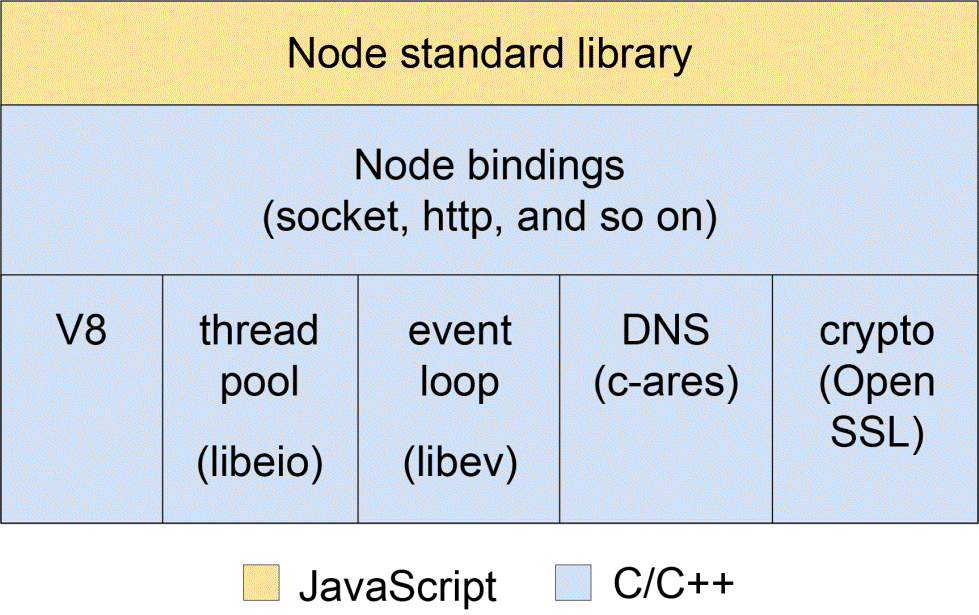

# 第一章：Node.js 简介

本章旨在涵盖 Node.js 中的一些基本概念，为我们后续的 API 开发奠定基础。

让我们从 Node.js 的工作原理和最近的使用情况开始这第一章。然后我们将看一下它的模块系统和异步编程模型。让我们开始吧。

到本章结束时，您将能够：

+   描述 Node.js 的基本工作原理

+   列出 Node.js 在现代软件开发中的应用

+   描述 Node.js 使用的模块系统

+   为应用程序实现基本模块

+   解释 Node.js 中的异步编程基础

+   使用`async`/`await`实现基本应用

# Node.js 的基础知识

Node.js 是一个事件驱动的服务器端 JavaScript 环境。Node.js 使用由谷歌开发用于其 Chrome 浏览器的 V8 引擎来运行 JS。利用 V8 允许 Node.js 提供一个服务器端运行环境，以便以闪电般的速度编译和执行 JS。

Node.js 作为一个单线程进程运行，对*回调*进行操作，永远不会在主线程上阻塞，使其在 Web 应用程序中具有高性能。回调基本上是一个传递给另一个函数的函数，以便在该函数完成后可以调用它。我们将在以后的主题中研究这一点。这被称为**单线程事件循环模型**。其他 Web 技术主要遵循**多线程请求-响应**架构。

以下图表描述了 Node.js 的架构。正如您所看到的，它主要是由 JavaScript 层包装的 C++。我们不会详细介绍每个组件，因为这超出了本章的范围。



Node 的目标是以一种简单而安全的方式在 JavaScript 中构建高性能和可扩展的网络应用程序。

# Node.js 的应用

Node.js 有以下四个主要应用：

+   **创建 REST API**：我们将在后续章节中更深入地研究这个问题

+   **创建实时服务**：由于 Node 的异步事件驱动编程，它非常适合*反应性*实时服务

+   **构建微服务**：由于 Node.js 的核心非常精简，最适合构建微服务，因为您只会添加实际需要的微服务依赖，而不是其他框架所带来的过剩

+   **工具**：例如，DevOps 自动化等

# 活动：运行基本的 Node.js 代码

**开始之前**

打开 IDE 和终端来实现这个解决方案。

**目标**

学习如何编写基本的 Node.js 文件并运行它。

**场景**

您正在编写一个非常基本的数学库，其中包含方便的数学函数。

**完成步骤**

1.  创建您的项目目录（文件夹），其中将保存本章和其他章节的所有代码。您可以称之为`beginning-nodejs`以简洁。在此目录中，创建另一个名为`lesson-1`的目录，在其中创建另一个名为`activity-a`的目录。所有这些都可以使用以下命令完成：

```js
mkdir -p beginning-nodejs/lesson-1/activity-a
```

1.  在`activity-a`中，使用`touch maths.js`命令创建一个文件。

1.  在此文件中，创建以下函数：

+   `add`：这需要任意两个数字并返回两者的和，例如，`add(2, 5)`返回`7`

+   `sum`：与`add`不同，它接受任意数量的数字并返回它们的总和，例如，`sum(10, 5, 6)`返回`21`

1.  在这些函数之后，编写以下代码作为代码的测试：

```js
console.log(add(10, 6)); // 16
console.log(sum(10, 5, 6)); // 21
```

1.  现在，在终端上，切换到`lesson-1`目录。这是我们在整个章节中将运行大部分代码的地方。

1.  要运行代码，请运行以下命令：

```js
node activity-a/math.js
```

`16`和`21`的值应该在终端上打印出来。

即使您可以配置 IDE，使 Node.js 代码可以通过单击按钮运行，但强烈建议您从终端运行代码，以了解 Node.js 的实际工作方式。

为了统一起见，如果您使用 Windows 机器，则从 Git Bash 终端运行命令。

对于参考解决方案，请使用`Code/Lesson-1/activity-solutions/activity-a`中的`math.js`文件。

# 模块系统

让我们来看看 Node 的模块系统和 Node.js 模块的不同类别。

# 应用程序模块化

像大多数编程语言一样，Node.js 使用模块来组织代码。模块系统允许您组织代码，隐藏信息，并且只使用`module.exports`公开组件的公共接口。

Node.js 使用 CommonJS 规范进行模块系统：

+   每个文件都是自己的模块，例如，在下面的示例中，`index.js`和`math.js`都是模块

+   每个文件都可以使用`module`变量访问当前模块定义

+   当前模块的导出由`module.exports`变量确定

+   要导入模块，请使用全局可用的`require`函数

让我们看一个简单的例子：

```js
// math.js file
function add(a, b) 
{
  return a + b;
}
…
…
module.exports = 
{
  add,
  mul,
  div,
};
// index.js file
const math = require('./math');
console.log(math.add(30, 20)); // 50
```

要调用其他函数，如`mul`和`div`，我们将使用对象解构作为导入模块时的替代方法，例如`const { add } = require('./math');`。

*模块系统*部分的代码文件放置在`Code/Lesson-1/b-module-system`中。

# 模块类别

我们可以将 Node.js 模块分为三类：

+   **内置（本地）模块**：这些是 Node.js 本身附带的模块；您不必单独安装它们。

+   **第三方模块**：这些通常是从软件包存储库安装的模块。 npm 是一个常用的软件包存储库，但您仍然可以在 GitHub、您自己的私有服务器等上托管软件包。

+   **本地模块**：这些是您在应用程序中创建的模块，就像之前给出的示例一样。

# 内置模块

如前所述，这些是可以直接使用而无需进一步安装的模块。您只需要导入它们。它们有很多，但我们将重点介绍一些在构建 Web 应用程序时可能会遇到的模块。

+   `assert`：提供一组断言测试，用于单元测试

+   `缓冲区`：处理二进制数据

+   `child_process`：运行子进程

+   `crypto`：处理 OpenSSL 加密函数

+   `dns`：进行 DNS 查找和名称解析函数

+   `events`：处理事件

+   `fs`：处理文件系统

+   `http`或`https`：用于创建 HTTP(s)服务器

+   `stream`：处理流数据

+   `util`：访问实用程序函数，如 deprecate（用于标记函数为已弃用）、format（用于字符串格式化）、inspect（用于对象调试）等

例如，以下代码使用内置的`fs`模块读取`lesson-1/temp/sample.txt`文件的内容：

```js
const fs = require('fs');
let file = `${__dirname}/temp/sample.txt`;
fs.readFile(file, 'utf8', (err, data) => 
{
  if (err) throw err;
  console.log(data);
});
```

此代码的详细信息将在本章后面讨论异步编程时解释。

# npm - 第三方模块注册表

**Node Package Manager**（**npm**）是 JavaScript 的软件包管理器和全球最大的软件注册表，使开发人员能够发现可重用代码的软件包。

要安装 npm 包，只需在项目目录中运行命令`npm install <package-name>`。我们将在接下来的两章中经常使用这个命令。

让我们看一个简单的例子。如果我们想在项目中使用`request`这样的软件包（库），我们可以在终端中运行以下命令，在项目目录中：

```js
npm install request
```

要在我们的代码中使用它，我们需要导入它，就像导入其他模块一样：

```js
const request = require('request');
request('http://www.example.com', (error, response, body) => 
{
  if (error) console.log('error:', error); // Print the error if one occurred
  else console.log('body:', body); // Print the HTML for the site.
});
```

有关 npm 的更多详细信息，请访问：[`docs.npmjs.com/`](https://docs.npmjs.com/)。最近，一个名为 YARN 的新软件包管理器发布了（[`docs.npmjs.com/`](https://docs.npmjs.com/)），它变得越来越受欢迎。

当您第一次在项目上运行`npm install <module-name>`命令时，`node_modules`文件夹将在项目的根目录下创建。

# 扫描 node_modules

值得注意的是 Node.js 如何解析特定的`required`模块。例如，如果文件`/home/tony/projects/foo.js`有一个 require 调用`require('bar')`，Node.js 按以下顺序扫描文件系统中的`node_modules`。找到的第一个`bar.js`将被返回：

+   /home/tony/projects/node_modules/bar.js

+   /home/tony/node_modules/bar.js

+   /home/node_module/bar.js

+   /node_modules/bar.js

Node.js 在当前文件夹中查找`node_moduels/bar`，然后在每个父文件夹中查找，直到达到当前文件系统树的根目录。

模块`foo/index.js`可以被要求为`foo`，而不需要指定`index`，并且将默认选择它。

# 方便的 npm 命令

让我们深入了解一下 npm，看一些你经常会使用的方便的 npm 命令：

+   npm init：初始化一个 Node.js 项目。这应该在项目的根目录运行，并将创建一个相应的`package.json`文件。这个文件通常有以下部分（键）：

+   `name`：项目的名称。

+   `version`：项目的版本。

+   `description`：项目描述。

+   `main`：项目的入口点，主文件。

+   `scripts`：这将是其他键的列表，其值将是要运行的脚本，例如，`test`，`dev-server`。因此，要运行此脚本，你只需要输入命令，如`npm run dev-server`，`npm run test`等。

+   `dependencies`：项目使用的第三方包及其版本列表。每当你执行`npm install <package-name> --save`时，此列表会自动更新。

+   `devDependencies`：不是生产必需品的第三方包列表，只在开发过程中使用。这通常包括帮助自动化开发工作流程的包，例如，类似 gulp.js 的任务运行器。每当你执行`npm install <package-name> --save-dev`时，此列表会自动更新。

+   `npm install`：这将安装`package.json`文件中指定的所有包。

+   `npm install <package-name> <options>`：

+   使用`--save`选项，安装包并将详细信息保存在`package.json`文件中。

+   使用`--save-dev`选项，安装包并将详细信息保存在`package.json`的`devDependencies`下。

+   使用`--global`选项，在整个系统中全局安装包，而不仅仅在当前系统中。由于权限问题，这可能需要以管理员权限运行命令，例如，`sudo npm install <package-name> --global`。

+   `npm install <package-name>@<version>`，安装包的特定版本。通常，如果未指定版本，将安装最新版本。

+   `npm list`：列出已为项目安装的包，从`node_modules`中安装的内容中读取。

+   `npm uninstall <package-name>`：移除已安装的包。

+   `npm outdated`：列出已过时的已安装包，即已发布更新版本的包。

# 本地模块

我们已经看过了如何从之前的示例中加载本地模块，其中包括`math.js`和`index.js`。

由于**JavaScript 对象表示**（**JSON**）在 Web 中是如此重要，Node.js 已完全将其作为数据格式采纳，甚至在本地也是如此。你可以从本地文件系统加载 JSON 对象，就像加载 JavaScript 模块一样。在模块加载序列期间，每当找不到`file.js`时，Node.js 都会寻找`file.json`。

查看`lesson-1/b-module-system/1-basics/load-json.js`中的示例文件：

```js
const config = require('./config/sample');
console.log(config.foo); // bar
```

在这里，你会注意到一旦*required*，JSON 文件会隐式地转换为 JavaScript 对象。其他语言可能要求你读取文件，或者使用不同的机制将内容转换为数据结构，比如映射、字典等。

对于本地文件，扩展名是可选的，但如果存在冲突，可能需要指定扩展名。例如，如果我们在同一个文件夹中有`sample.js`和`sample.json`文件，`.js`文件将被默认选择；最好指定扩展名，例如：`const config = require('./config/sample.json');`

当您运行`npm install`时，没有指定要安装的模块，npm 将安装项目中`package.json`文件中指定的包列表（在`dependencies`和`devDependencies`下）。如果`package.json`不存在，它将给出一个错误，指示未找到这样的文件。

# 活动：使用上一个 math.js 代码的第三方包

**开始之前**

这个活动将建立在本章的*运行基本 Node.js*活动之上。

**目标**

如果参数是一个数组，对数字求和，如果是多个数组，首先将数组合并成一个再求和。我们将使用`lodash`中的`concat()`函数，这是一个我们将安装的第三方包。

**场景**

我们想创建一个新的函数`sumArray`，它可以对一个或多个数组中的数字进行求和。

**完成步骤**

1.  在`Lesson-1`中，创建另一个名为`activity-b`的文件夹。

1.  在终端上，切换到`activity-b`目录并运行以下命令：

```js
npm init
```

1.  这将带您进入交互式提示符；只需一直按*Enter*，将答案留在建议的默认值。这里的目的是让我们得到一个`package.json`文件，这将帮助我们组织我们安装的包。

1.  由于我们将使用`lodash`，让我们安装它。运行以下命令：

```js
npm install lodash--save
```

请注意，我们在命令中添加了`--save`选项，以便在`package.json`中跟踪安装的包。当您打开步骤 3 中创建的`package.json`文件时，您将看到一个带有详细信息的`dependencies`键。

1.  在`activity-b`目录中创建一个`math.js`文件，并将*Activity*，*Running Basic Node.js*中的`math.js`代码复制到这个文件中。

1.  现在，在`sum`函数之后添加`sumArray`函数。

1.  从要求`lodash`开始，我们在步骤 4 中安装了它，因为我们将在`sumArray`函数中使用它：

```js
const _ = require('lodash');
```

1.  `sumArray`函数应该调用`sum`函数来重用我们的代码。提示：在数组上使用展开运算符。参见以下代码：

```js
function sumArray() 
{
  let arr = arguments[0];
  if (arguments.length > 1) 
  {
    arr = _.concat(...arguments);
  }
  // reusing the sum function
  // using the spread operator (...) since
  // sum takes an argument of numbers
  return sum(...arr);
}
```

1.  在文件末尾，使用`module.exports`导出三个函数，`add`，`sum`和`sumArray`。

1.  在相同的`activity-b`文件夹中，创建一个名为`index.js`的文件。

1.  在`index.js`文件中，*require* `./math.js`，然后继续使用`sumArray`：

```js
// testing
console.log(math.sumArray([10, 5, 6])); // 21
console.log(math.sumArray([10, 5], [5, 6], [1, 3])) // 30
```

1.  在终端上运行以下代码：

```js
node index.js
```

你应该看到`21`和`30`被打印出来。

解决方案文件放在`Code/Lesson-1/activitysolutions/activity-b`。

# 使用 Node.js 进行异步编程

让我们来看看 Node.js 工作原理的核心部分，即异步编程模型。

# 回调

回调是异步执行的函数，或者在以后的某个时间执行的函数。异步程序可能根据先前函数的顺序和速度在不同的时间执行不同的函数，而不是按顺序从上到下逐步执行代码。

由于 JavaScript 将函数视为任何其他对象，我们可以将一个函数作为参数传递给另一个函数，并执行传入的函数，甚至返回它以便以后执行。

我们之前在*模块系统*部分查看`fs`模块时看到了这样一个函数。让我们重新访问一下：

```js
const fs = require('fs');
let file = `${__dirname}/temp/sample.txt`;
fs.readFile(file, 'utf8', (err, data) => 
{
  if (err) throw err;
  console.log(data);
});
```

*使用 Node.js 进行异步编程*的代码文件放置在`Code/Lesson-1/c-async-programming`。

在第 3 行，我们使用`globals`的一个变量部分，`_ _dirname`，它基本上给了我们当前文件（`read-file.js`）所在的目录（文件夹）的绝对路径，从中我们可以访问`temp/sample.txt`文件。

我们讨论的主要内容是第 5 行到第 8 行之间的代码块。就像您将在 Node.js 中遇到的大多数方法一样，它们大多数都将回调函数作为最后一个参数。

大多数回调函数将接受两个参数，第一个是错误对象，第二个是结果。对于前面的情况，如果文件读取成功，错误对象`err`将为 null，并且文件的内容将在数据对象中返回。

让我们分解这段代码，以便更容易理解：

```js
const fs = require('fs');
let file = `${__dirname}/temp/sample.txt`;
const callback = (err, data) => 
{
  if (err) throw err;
  console.log(data);
};
fs.readFile(file, 'utf8', callback);
```

现在，让我们看看异步部分。让我们在前面的代码中添加一行额外的行：

```js
const fs = require('fs');
let file = `${__dirname}/temp/sample.txt`;
const callback = (err, data) => 
{
  if (err) throw err;
  console.log(data);
};
fs.readFile(file, 'utf8', callback);
console.log('Print out last!');
```

看看我们得到了什么打印输出：

```js
Print out last!
 hello,
 world
```

为什么`Print out last!`先出现？这就是异步编程的全部意义。Node.js 仍然在单个线程上运行，第 10 行以非阻塞方式执行并移动到下一行，即`console.log('Print out last!')`。由于前一行需要很长时间，下一行将首先打印。一旦`readFile`过程完成，它将通过回调打印出文件的内容。

# 承诺

承诺是传递异步计算结果的回调的替代方法。首先，让我们先看一下承诺的基本结构，然后简要地看一下使用承诺而不是普通回调的优势。

让我们用承诺重写上面的代码：

```js
const fs = require('fs');
const readFile = (file) => 
{
  return new Promise((resolve, reject) => 
  {
    fs.readFile(file, 'utf8', (err, data) => 
    {
      if (err) reject(err);
      else resolve(data);
    });
  });
}
// call the async function
readFile(`${__dirname}/../temp/sample.txt`)
  .then(data => console.log(data))
  .catch(error => console.log('err: ', error.message));
```

这段代码还可以通过使用`util.promisify`函数进一步简化，该函数采用遵循常见的 Node.js 回调样式的函数，即以`(err, value) => …`回调作为最后一个参数，并返回一个返回承诺的版本：

```js
const fs = require('fs');
const util = require('util');
const readFile = util.promisify(fs.readFile);
readFile(`${__dirname}/../temp/sample.txt`, 'utf8')
  .then(data => console.log(data))
  .catch(error => console.log('err: ', error));
```

从我们迄今为止所见，承诺提供了处理异步代码的标准方式，使其更易读一些。

如果您有 10 个文件，您想要读取它们吗？`Promise.all`来拯救。`Promise.all`是一个方便的函数，可以让您并行运行异步函数。它的输入是一组承诺；其输出是一个用结果数组满足的单个承诺：

```js
const fs = require('fs');
const util = require('util');
const readFile = util.promisify(fs.readFile);
const files = [
  'temp/sample.txt',
  'temp/sample1.txt',
  'temp/sample2.txt',
];
// map the files to the readFile function, creating an
// array of promises
const promises = files.map(file => readFile(`${__dirname}/../${file}`, 'utf8'));
Promise.all(promises)
  .then(data => 
  {
    data.forEach(text => console.log(text));
  })
  .catch(error => console.log('err: ', error));
```

# 异步/等待

这是 Node.js 的最新添加之一，早在 2017 年的 7.6 版本中就已经添加了，提供了一种更好的编写异步代码的方式，使其看起来和行为更像同步代码。

回到我们的文件*读取*示例，假设您想要获取两个文件的内容并按顺序连接它们。这是您可以使用`async`/`await`实现的方法：

```js
const fs = require('fs');
const util = require('util');
const readFile = util.promisify(fs.readFile);
async function readFiles() 
{
  const content1 = await readFile(`${__dirname}/../temp/sample1.txt`);
  const content2 = await readFile(`${__dirname}/../temp/sample2.txt`);
  return content1 + '\n - and - \n\n' + content2;
}
readFiles().then(result => console.log(result));
```

总之，任何返回承诺的异步函数都可以*等待*。

# 活动：使用异步函数转换文本文件

开始之前

您应该已经完成了之前的活动。

目标

读取文件（使用`fs.readFile`），`in-file.txt`，正确格式化名称（使用`lodash`函数`startCase`），然后按字母顺序对名称进行排序，并将它们写入到单独的文件`out-file.txt`（使用`fs.writeFile`）。

场景

我们有一个文件`in-file.txt`，其中包含人们的名字列表。一些名字没有正确的大小写格式，例如，`john doe`应更改为`John Doe`。

完成步骤

1.  在`Lesson-1`中，创建一个名为`activity-c`的文件夹。

1.  在终端上，切换到`activity-c`目录并运行以下命令：

```js
npm init
```

1.  就像在以前的活动中一样，这将带您进入交互提示符；只需按照建议的默认值一路按*Enter*。这里的目的是让我们获得一个`package.json`文件，这将帮助我们组织我们安装的软件包。

1.  由于我们这里也将使用`lodash`，让我们安装它。运行`npm install lodash --save`。

1.  将`student-files`目录中提供的`in-file.txt`文件复制到您的`activity-c`目录中。

1.  在您的`activity-c`目录中，创建一个名为`index.js`的文件，您将在其中编写您的代码。

1.  现在，继续实现一个`async`函数`transformFile`，它将接受文件路径作为参数，按照之前描述的方式进行转换，并将输出写入作为第二个参数提供的输出文件。

1.  在终端上，您应该指示何时正在阅读、写作和完成，例如：

+   “读取文件：in-file.txt”

+   “写入文件：out-file.txt”

+   完成

您应该阅读有关`fs.writeFile`的快速参考文档，因为我们还没有使用它。但是，您应该能够看到它与`fs.readFile`的相似之处，并将其转换为一个 promise 函数，就像我们之前所做的那样。

解决方案文件放置在`Code/Lesson-1/activitysolutions/activity-c`中。

# 摘要

在本章中，我们快速概述了 Node.js，看到了它在幕后的样子。

我们编写了基本的 Node.js 代码，并使用 Node.js 命令从终端运行它。

我们还研究了 Node.js 的模块系统，学习了 Node.js 模块的三个类别，即内置模块、第三方模块（从 npm 注册表安装）和本地模块，以及它们的示例。我们还看了 Node.js 在*require*模块时如何解析模块名称，通过在各个目录中搜索来实现。

然后，我们通过查看 Node.js 工作方式的异步编程模型来结束，这实际上是 Node.js 运行的核心。我们看了您可以编写异步代码的三种主要方式：使用*callbacks*、*Promises*和

新的*async/await*范式。

现在我们已经为使用 Node.js 实现我们的 API 奠定了基础。在构建 API 时，这些概念中的大部分将再次出现。
