# 第二章：构建 API - 第一部分

本章旨在介绍使用 Node.js 构建 API。我们将从构建基本的 HTTP 服务器开始，以了解 Node.js 的工作原理。

在本章结束时，您将能够：

+   使用 Node.js 内置的`http`模块实现一个基本的 HTTP 服务器

+   为 API 实现基本的 Hapi.js 设置

+   描述基本的 HTTP 动词及其之间的区别

+   实现使用不同的 HTTP 动词为 API 实现各种路由

+   实现记录 Web 应用程序

+   验证 API 请求

# 构建一个基本的 HTTP 服务器

让我们首先来看一下 Node.js Web 应用程序的基本构建块。内置的`http`模块是其核心。但是，从以下示例中，您还将欣赏到这有多么基本。

将以下代码保存在名为`simple-server.js`的文件中：

```js
const http = require('http');
const server = http.createServer((request, response) => 
{
  console.log('request starting...');
  // respond
  response.write('hello world!');
  response.end();
});
server.listen(5000);
console.log('Server running at http://127.0.0.1:5000');
```

使用`Code/Lesson-2`中的`simple-server.js`文件作为参考。

现在，让我们运行这个文件：

```js
node simple-server.js
```

当我们在浏览器中访问示例中的 URL 时，我们会得到以下内容：

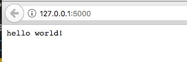

# 设置 Hapi.js

**Hapi.js**（**HTTP API**），是一个用于构建应用程序和服务的丰富框架，专注于编写可重用的应用程序逻辑。还有许多其他框架；其中值得注意的是 Express.js。但是，从头开始，Hapi.js 被优化用于构建 API，我们将在构建应用程序时很快看到这一点。

# 练习 1：构建一个基本的 Hapi.js 服务器

在这个练习中，我们将构建一个基本的 HTTP 服务器，就像之前那样，但现在使用 Hapi.js。您会注意到大部分事情都是在 Hapi.js 的幕后为我们完成的。但是，Hapi.js 也是建立在`http`模块之上的。

对于接下来的练习，从第三章的第一个练习，《构建 API - 第二部分》，我们将在每个练习中逐步构建。因此，我们可能需要返回并修改以前的文件等：

1.  在您的`Lesson-2`文件夹中，创建一个名为`hello-hapi`的子文件夹。

使用`Code/Lesson-2`中的`exercise-b1`文件夹作为参考。

1.  在终端上，切换到`hello-hapi`文件夹的根目录。

1.  将其初始化为一个基本的 Node.js 项目，并运行以下命令：

```js
npm init -y
```

1.  创建一个名为`server.js`的文件。

1.  通过执行以下命令安装 Hapi.js：

```js
npm install hapi --save
```

1.  在文件中，编写以下代码：

```js
const Hapi = require('hapi');
// create a server with a host and port
const server = new Hapi.Server();
server.connection
({
  host: 'localhost',
  port: 8000,
});
// Start the server
server.start((err) => 
{
  if (err) throw err;
  console.log(`Server running at: ${server.info.uri}`);
});
```

使用`Code/Lesson-2/exercise-b1`中的`server.js`文件作为参考。

让我们试着理解这段代码：

+   我们首先通过要求我们刚刚包含的 Hapi.js 框架来开始。

回想一下我们的子主题，《模块系统》，在第一章，《Node.js 简介》中？我们看了第三方模块——这是其中之一。

+   然后我们通过初始化 Server 类来创建一个服务器，因此是一个新的`Hapi.Server()`。

+   然后将该服务器绑定到特定的主机（`localhost`）和端口（`8000`）。

+   之后，我们创建一个示例路由，`/`。正如您所看到的，对于每个创建的路由，我们必须指定三个主要内容（作为传递给`server.route`方法的对象的键）：

+   `method`：这是该路由的 HTTP 方法。我们将在后面的部分更深入地了解 HTTP 动词的类型。对于我们的示例，我们使用 GET。基本上，正如名称所示，这会从服务器获取资源。

+   `path`：这是服务器上到达特定资源的路径。

+   `handler`：这是一个执行实际获取操作的闭包（匿名函数）。

我们将在我们的主项目中查看另一个额外的关键字，称为`config`。

+   完成此设置后，我们使用`server.start`方法启动服务器。该方法接受一个闭包（回调函数），一旦服务器启动，就会调用该函数。在此函数中，我们可以检查启动服务器时是否发生了任何错误。

1.  通过转到终端并运行以下命令来运行服务器：

```js
node server.js
```

1.  您应该在终端上看到这个打印出来：

```js
Server running at: http://localhost:8000
```

您应该在`http://localhost:8000`看到类似于这样的东西：

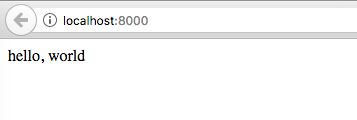

打开另一个终端，更改目录到相同的项目文件夹，并运行相同的命令，`node server.js`。我们会收到此错误：`Error: listen EADDRINUSE 127.0.0.1:8000`。

我们收到此错误的原因是因为我们的主机上只能运行一个特定端口的服务器。请记住，主机 IP`127.0.0.1`是我们所谓的`localhost`。`if (err) throw err;`是抛出错误的行。

我们可以通过将第二个服务器的端口号更改为`8001`之类的内容来解决此问题。但是，最佳实践是，除了不断更改代码之外，我们可以将端口号作为终端参数传递，即运行应用程序为`node server.js <port-number>`，然后更改我们的代码（在`port`部分）为`port: process.argv[2] || 8000,`。

在这里，我们说，如果端口作为脚本的第一个参数提供，那么使用该端口，否则使用`8000`作为端口号。现在，当您运行：`node server.js 8002`时，服务器应该从`localhost:8002`正常运行。

对于`process.argv`数组，索引`0`是运行脚本的程序，node 和索引`1`是正在运行的脚本，`server.js`。因此，传递给脚本的参数从索引`2`开始计算。您可以稍后在这里阅读有关`process.argv`的更多信息。

# 使用 API 客户端

为了充分利用客户端，能够执行所有请求类型（`GET`，`POST`，`UPDATE`等），我们需要一个 API 客户端。有很多选择，但我们建议使用 Postman ([`www.getpostman.com/`](https://www.getpostman.com/))或 Insomnia ([`insomnia.rest/`](https://insomnia.rest/))。在我们的示例中，我们将使用 Insomnia。

安装 Insomnia 后，添加一个 GET 请求到`http://localhost:8000`：

1.  我们将首先创建一个用于 Insomnia 的*请求*页面，我们将在其中进行所有请求：

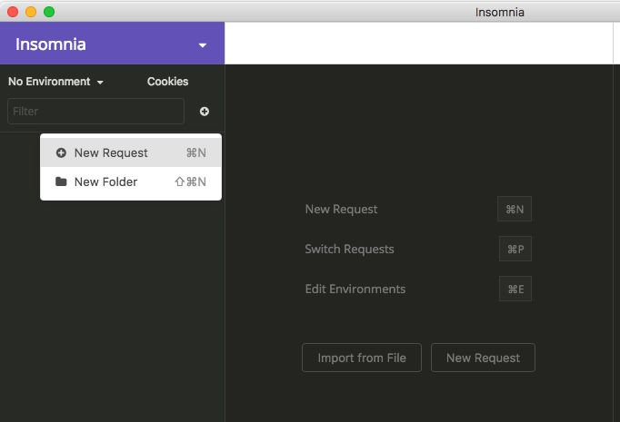

为新请求输入名称：

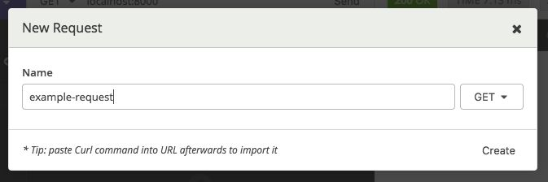

1.  然后，我们将通过输入路由并单击发送来发出我们的请求：

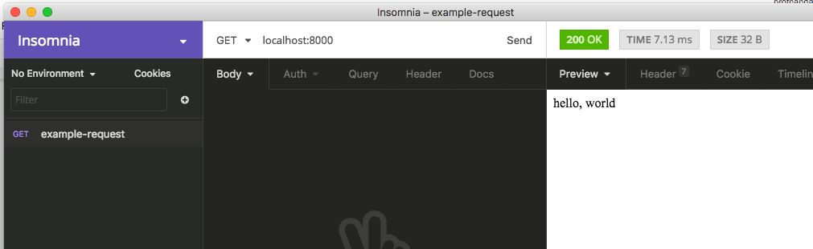

当我们将类型从 GET 更改为 POST 并单击发送时，我们会收到 404 错误，因为在我们的服务器上，我们目前只为路由`/`定义了 GET 方法。

# 返回 JSON 字符串

由于我们现在正在构建我们的 API，我们需要一种正式的方式来表示我们的请求中的数据，通过发送或接收它。**JavaScript 对象表示法**（**JSON**）是 REST API 的传统数据交换格式。

关于 JSON 的一件事需要注意的是，它起源于 JavaScript，现在已被广泛采用于其他语言。因此，当涉及到 Node.js 时，您将看到如何使用 JSON 变得如此简单和自然。

# 练习 2：返回 JSON

1.  让我们回到我们的`server.js`文件，从*练习 1*，*构建基本的 Hapi.js* *服务器*。

使用`exercise-b2`文件夹作为`Code/Lesson-2`的参考。

1.  要为我们的`/`路由返回 JSON，我们需要更改的只是我们返回的字符串为一个对象：

```js
handler: (request, reply) => 
{
  return reply({ message: 'hello, world' });
}
```

1.  通过转到运行服务器的终端并按下*Ctrl* + *C*来停止服务器。然后，通过运行以下命令再次启动服务器以生效更改：

```js
node server.js
```

1.  现在返回到 Insomnia 并进行另一个 GET 请求。您可以看到这实际上已更改为 JSON 字符串：

```js
{
  "message": "hello, world"
}
```

这在 Hapi.js 中是开箱即用的，而在某些框架中，例如 Express.js，您必须使用`json`函数进行转换。

# 使用 nodemon 进行开发工作流

您可能已经注意到，在第一个练习中进行更改后，我们不得不返回并停止服务器，然后重新开始。每次更改代码时都这样做变得非常麻烦。幸运的是，工具可以拯救我们。

有一个名为`nodemon`的 Node.js 包，它可以在我们的文件发生更改时自动帮助重新启动服务器。

# 练习 3：使用 nodemon

在这个练习中，我们将介绍一个名为`nodemon`的 Node 模块，我们将使用它来运行我们的 Web 服务器。这使得服务器在我们对其进行更改时可以自动重新加载，因此避免了在我们对服务器进行更改时手动停止服务器并重新启动服务器的繁琐过程：

1.  返回终端并停止服务器（按*Ctrl + C*），然后运行以下命令。

1.  我们需要全局安装这个包（记住您可能需要一些管理权限，所以在 Unix 系统中，您需要以`sudo`身份运行命令）：

```js
npm install --global nodemon
```

1.  安装完成后，我们可以使用`nodemon`运行：

```js
nodemon server.js
```

你应该会得到类似这样的东西：

```js
[nodemon] 1.12.1
[nodemon] to restart at any time, enter `rs`
[nodemon] watching: *.*
[nodemon] starting `node server.js`
Server running at: http://localhost:8000
```

# 设置日志记录

日志记录是任何 Web 应用程序的非常重要的组成部分。我们需要一种方式来保存服务器的历史记录，以便我们随时可以回来查看它是如何处理请求的。

最重要的是，您不希望日志记录成为事后才考虑的事情，只有在您遇到生产错误时才实施，这会使您的 Web 应用程序在您试图找出问题所在时崩溃。

Hapi.js 内置了最小的日志功能，但如果您需要一个广泛的日志功能，一个很好的例子叫做**good**（[`github.com/hapijs/good`](https://github.com/hapijs/good)）。

# 练习 4：设置日志记录

在这个练习中，我们将在我们创建的 Web 服务器上添加一个日志记录机制，以便可以通过日志轻松跟踪每个请求和服务器活动：

1.  让我们回到*练习 2：返回 JSON*的项目。

使用`Code/Lesson-2`中的`exercise-b4`文件夹作为参考。

1.  我们首先需要安装一些将帮助我们记录日志的包（`good`和`good-console`）。运行以下命令：

```js
npm install --save good good-console 
```

`good-console`是我们称之为写入流的东西。有其他与 good 一起工作的写入流，但为简单起见，我们不会去看它们。您可以查看[`github.com/hapijs/good`](https://github.com/hapijs/good)获取更多信息。

1.  然后，我们将修改我们的`server.js`代码来配置我们的日志记录。首先，在 Hapi.js 之后要求好：

```js
const Hapi = require('hapi');
const good = require('good');
```

1.  然后，在启动服务器之前将其注册到服务器上：

```js
// set up logging
const options = {
  ops: {
    interval: 100000,
  },
  reporters: {
    consoleReporters: [
    { module: 'good-console' },
    'stdout',
…
});
```

使用`Code/Lesson-2/exercise-b4`中的`server.js`文件作为参考。

1.  如果您仍在使用`nodemon`运行服务器，现在您将开始在终端上定期看到服务器日志被更新；类似于：

```js
171102/012027.934, [ops] memory: 34Mb, uptime (seconds):
100.387, load: [1.94580078125,1.740234375,1.72021484375]
171102/012207.935, [ops] memory: 35Mb, uptime (seconds):
200.389, load: [2.515625,2.029296875,1.83544921875]
...
```

1.  现在，返回 Insomnia 并尝试在`localhost:8000/`上进行另一个 GET 请求。您将看到已创建一个额外的日志，显示了请求的时间（`时间戳`），路由，方法（`get`），状态代码（`200`）以及请求所花费的时间：

```js
171102/012934.889, [response] http://localhost:8000: get /{} 200 (13ms)
```

当您尝试优化服务器的性能时，所花费的时间非常有用，可以看到哪些请求花费的时间比预期的长。

# 理解请求

让我们来看看请求的概念和不同的 HTTP 请求方法。

# 查看 HTTP 请求方法

设置好服务器后，我们准备开始构建我们的 API。路由基本上构成了实际的 API。

我们将首先查看 HTTP 请求方法（有时称为*HTTP 动词*），然后使用一个简单的*待办事项列表*示例将它们应用到我们的 API 中。我们将查看五个主要的方法：

+   `GET`：请求指定资源的表示。使用`GET`的请求应该只检索数据，不应该用于对资源进行更改。

+   `POST`：用于向指定资源提交条目，通常会导致状态的改变。

+   `PUT`：用请求有效负载替换目标资源的所有当前表示。

+   `DELETE`：删除指定的资源。

+   `PATCH`：用于对资源应用部分修改。

在接下来的练习中，我们将重写之前的代码，其中我们已经将数据硬编码，以便我们可以使用直接来自数据库的真实和动态数据进行操作。

# 练习 5：获取资源列表

1.  让我们回到*练习 4：设置日志记录*的项目。

使用`exercise-c1`文件夹作为你在`Code/Lesson-2`的参考。

1.  因为我们将有各种路由，现在将路由分割到一个单独的文件中以便组织是明智的。在项目中，创建一个名为`routes`的子文件夹。

1.  在创建的文件夹中，创建一个名为`todo.js`的文件。在`todo.js`中，这是我们将为`todo`资源拥有所有路由的地方。这个文件（模块）将导出一个路由列表。

1.  让我们从一个简单的路由开始，它在`GET`请求上返回一个待办事项列表：

```js
const todoList = [
  {
    title: 'Shopping',
    dateCreated: 'Jan 21, 2018',
    list: [
    { 
      text: 'Node.js Books', done: false },
      ...
    ]
  },
  {
];
```

使用`todo.js`文件作为你在`Code/Lesson-2/exercise-c1/routes`的参考。

1.  然后我们回到我们的`server.js`文件，要求`todo`路由模块，并使用`server.route`方法在服务器上注册它：

```js
const routes = {};
routes.todo = require('./routes/todo')
// create a server with a host and port
const server = new Hapi.Server();
server.connection(
{
  host: 'localhost',
  port: process.argv[2] || 8000,
});
server.route(routes.todo);
```

使用`server.js`文件作为你在`Code/Lesson-2/exercise-c1`的参考。

1.  使用 Insomnia，对`http://localhost:8000/todo`发出`GET`请求。你应该看到这个返回：

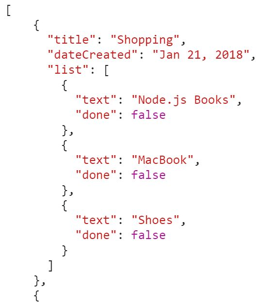

# 练习 6：获取特定资源

1.  现在，让我们尝试获取一个特定的待办事项。因为我们没有带有 ID 的数据库，我们将把索引视为 ID，`[0]`为`1`，依此类推。

使用`exercise-c1`文件夹作为你在`Code/Lesson-2`的参考。

1.  让我们为此添加一个路由。注意我们使用`{<parameter-key>}`作为将请求参数传递给我们的`route`函数的一种方式，然后通过`request.params.id`获取它：

```js
module.exports = [
 {
 method: 'GET',
 path: '/todo',
 ...
 handler: (request, reply) => {
 const id = request.params.id - 1; 
 // since array is 0-based index
 return reply(todoList[id]);
 }
 },
];
```

使用`todo.js`文件作为你在`Code/Lesson-2/exercise-c1/routes`的参考。

1.  转到 Insomnia，对`http://localhost:8000/todo/1`发出`GET`请求。你应该看到这个：

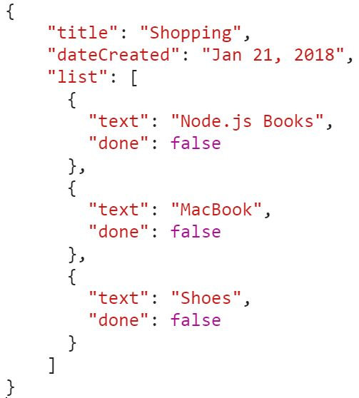

# 练习 7：使用 POST 创建新的待办事项

1.  现在让我们添加一个新的待办事项。这就是`POST`的用武之地。`POST`请求应该始终带有一个负载，这是被*发布*的数据。我们将添加一个新的路由来处理这个：

```js
module.exports = [
  // previous code
  {
    method: 'POST',
    path: '/todo',
    handler: (request, reply) => {
      const todo = request.payload;
      todoList.push(todo);
      return reply({ message: 'created' });
    …
];
```

使用`todo.js`文件作为你在`Code/Lesson-2/exercise-c1/routes`的参考。

1.  关于失眠：

1.  将请求类型改为 POST：

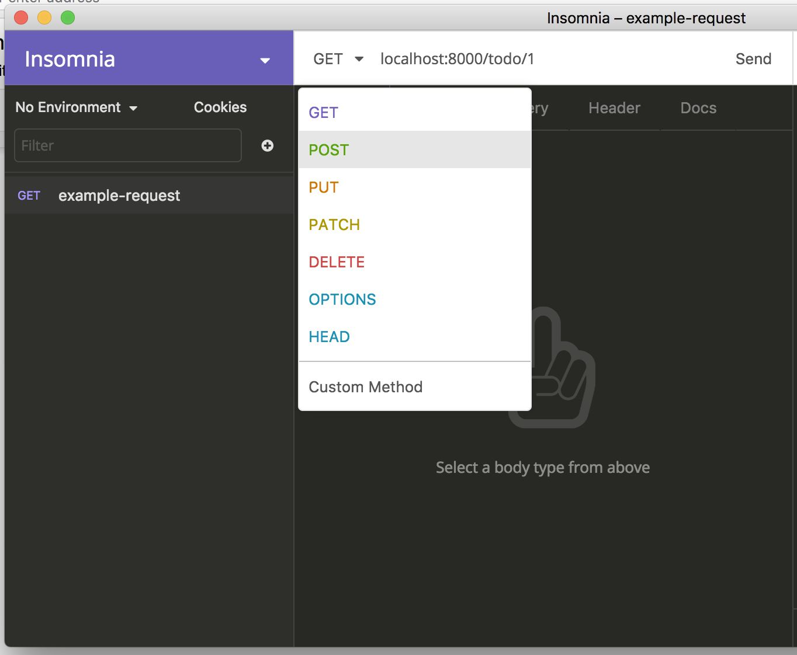

+   1.  将请求体改为 JSON：

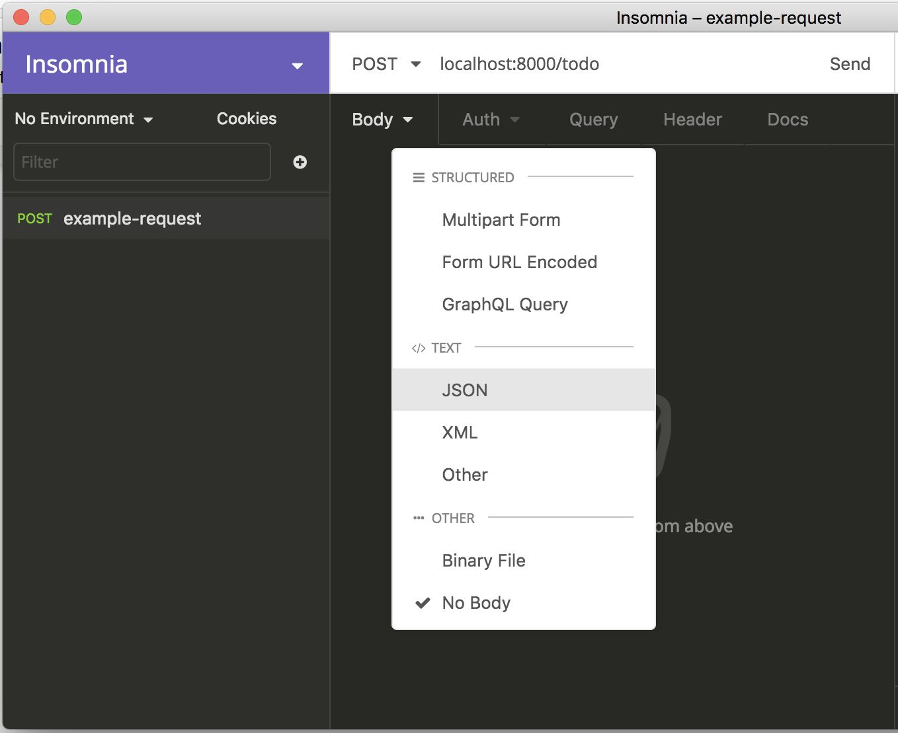

+   1.  适当添加请求体和 URL：

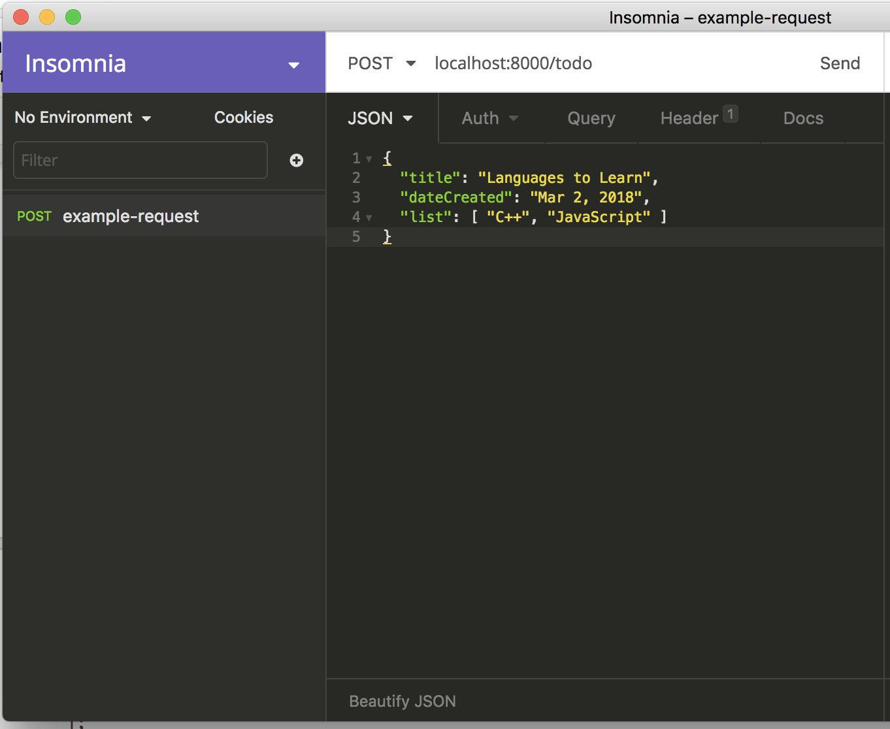

1.  当你发送请求时，你应该看到这个作为响应：

```js
{
  "message": "created"
}
```

1.  现在，当你对`http://localhost:8000/todo`发出`GET`请求时，你应该看到新创建的待办事项出现在响应中：

```js
[
...
  {
    "title": "Languages to Learn",
    "dateCreated": "Mar 2, 2018",
```

```js
    "list": 
     [
       "C++",
       "JavaScript"
    ]
  }
]
```

# 练习 8：使用 PUT 更新资源

1.  如果我们想要更新，比如说，第一个待办事项列表，按照惯例，`PUT`要求我们发送整个更新后的待办事项资源。现在让我们创建一个`PUT`路由：

```js
{
  method: 'PUT',
  path: '/todo/{id}',
  handler: (request, reply) => {
    const index = request.params.id - 1;
    // replace the whole resource with the new one
    todoList[index] = request.payload;
    return reply({ message: 'updated' });
  }
}
```

使用`todo.js`文件作为你在`Code/Lesson-2/exercise-c1/routes`的参考。

1.  现在去 Insomnia 发出请求。记得把请求类型改为 PUT：

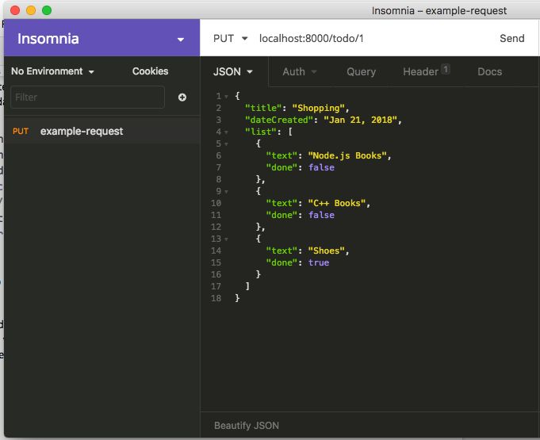

1.  你应该看到以下响应：

```js
{
  "message": "updated"
}
```

1.  当你在`http://localhost:8000/todo/1`上执行`GET`时，你应该得到更新后的资源：

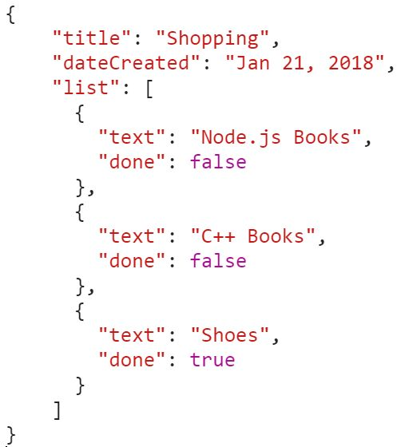

# 练习 9：使用 PATCH 更新

1.  你会意识到，在我们之前的练习中，我们不得不发布整个资源才能改变其中的一部分。这样做的更好方法是使用`PATCH`，这样负载只包含所需的内容。现在让我们创建一个`PATCH`路由：

```js
{
  method: 'PATCH',
  handler: (request, reply) => 
  {
    …
    Object.keys(request.payload).forEach(key => 
    {
      if (key in todo) 
      {
        todo[key] = request.payload[key];
        …
    return reply({ message: 'patched' });
    },
}
```

使用`todo.js`文件作为你在`Code/Lesson-2/exercise-c1/routes`的参考。

1.  现在，你可以提供任何键和它们的值，它们将分别更新。例如，发出以下请求，只改变第一个待办事项的标题：

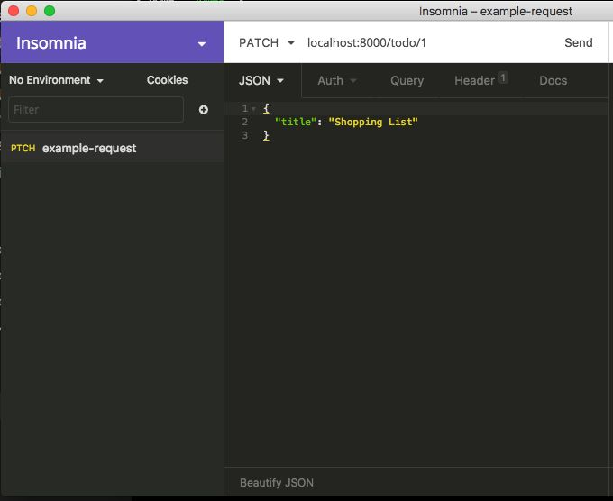

1.  你应该得到以下响应：

```js
{
  "message": "patched"
}
```

1.  当你在`http://localhost:8000/todo/1`上执行`GET`时，你应该得到更新后的资源：

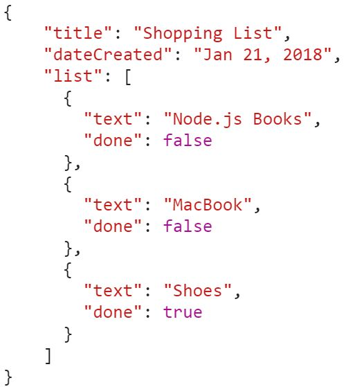

# 练习 10：使用 DELETE 删除资源

1.  当我们想要删除一个资源时，我们使用`DELETE`方法。让我们创建一个`DELETE`路由：

```js
{
  method: 'DELETE',
  path: '/todo/{id}',
  handler: (request, reply) => {
    const index = request.params.id - 1;
    delete todoList[index]; // replaces with `undefined`
    return reply({ message: 'deleted' });
  },
},
```

使用`exercise-c1`文件夹作为你在`Code/Lesson-2`的参考。

1.  现在去 Insomnia 测试一下——你应该得到这个响应：

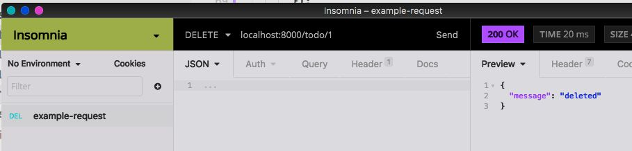

1.  现在尝试访问先前删除的资源-您应该会收到`404`错误。但是，在我们之前的`GET`路由（在*练习 6：获取特定资源*中），我们没有考虑到这一点，所以让我们去修改我们的`GET：/todo/{id}路由`：

```js
{
  method: 'GET',
  path: '/todo/{id}',
  handler: (request, reply) => 
  {
    const id = request.params.id - 1;
    // should return 404 error if item is not found
    if (todoList[id]) return reply(todoList[id]);
    return reply({ message: 'Not found' }).code(404);
  }
}
```

在`Code/Lesson-2/exercise-c1/routes`中使用`todo.js`文件作为您的参考。

如果您从未遇到过状态码`404`，请不要担心。我们将在本节的最后一个小节中介绍主要的状态码。

1.  请记住，服务器将重新加载，因此已删除的资源仍将被带回，因此返回并重复*步骤 2*。

1.  现在，当您对`http://localhost:8000/todo/1`进行`GET`请求时，您应该看到这个：

```js
{
  "message": "Not found"
}
```

关于 Insomnia 的简短结语

您应该能够在历史记录下找到所有以前的请求。单击右上角的时间图标。

# 请求验证

我们需要验证传入的请求，以确保它们符合服务器可以处理的内容。

这是我看到 Hapi.js 在其他框架上闪耀的地方之一。在 Hapi.js 中，您可以将验证作为`route`对象的一部分的配置对象来挂钩。对于验证，我们将使用 Joi 库，它与 Hapi.js 很好地配合。

# 练习 11：验证请求

在这个练习中，我们将看到*请求验证*的概念。我们将为其中一个路由编写一个示例验证，但同样的方法也可以应用于其他路由：

1.  例如，如果我们回到*练习 1：构建基本的 Hapi.js 服务器*中的`POST`路由，我们可以发布一个空的有效载荷，仍然可以获得状态码`200！`显然，我们需要一种验证的方法。

1.  让我们从安装 Joi 开始：

```js
npm install joi --save
```

在`Code/Lesson-2`的`exercise-c2`文件夹中使用。

1.  在`routes/todo.js`文件中，我们需要要求 Joi，然后通过向`route`对象添加`config.validate`键来修改我们的 post 路由：

```js
{
  method: 'POST',
  path: '/todo',
  handler: (request, reply) => 
  {
    const todo = request.payload;
    todoList.push(todo);
    return reply({ message: 'created' });
  },
...
},
```

在`Code/Lesson-2/exercise-c1/routes`中使用`todo.js`文件作为您的参考。

1.  当我们尝试提交一个空的有效载荷时，我们现在会收到错误`400`：

！[](img/00021.jpeg)

1.  这样，直到我们为待办事项提供一个标题，因为标题是必需的：

！[](img/00022.jpeg)

Joi 是一个功能齐全的验证库，有许多选项可供使用。在这个练习中，我们只是涉及了一个基本的例子。

您可以通过在验证键及其相应类型中提出相应的键/值对来验证请求的任何部分：

`有效载荷`（用于请求有效载荷，如前面的练习中），`params`（用于请求参数）和`query`（用于查询参数）。

例如，对于请求`GET：/todo/:id`，如果我们想验证 ID 是否为整数，我们将添加这个`config`对象：

`config: {`

`  验证：

{`

`    params：

{`

`      id: Joi.number()`

`    }`

`  }

}`

有关 Joi 的更多详细信息，请访问：[`github.com/hapijs/joi`](https://github.com/hapijs/joi)。

# 总结

本章介绍了使用 Node.js 构建 API 的初始部分。我们首先查看了仅使用内置的 HTTP 模块构建的基本 HTTP 服务器，以便我们能够欣赏 Node.js Web 应用程序的基本构建块。然后我们介绍了使用 Hapi.js 框架做同样的事情。

然后，我们通过示例讨论了各种 HTTP 动词（请求方法），并使用 Hapi.js 构建了我们的基本 API。这些是`GET`，`POST`，`PUT`，`PATCH`和`DELETE`。

我们还介绍了一些 Web 应用程序的基本概念，如日志记录，使用良好的请求验证和 Joi 的使用。
