# 第三章：构建 API - 第二部分

本章旨在重新审视以前的实现，这次将我们的数据保存在持久存储（数据库）中。它还将涵盖身份验证，单元测试和托管作为额外的值得了解的概念（但不是必要的）。因此，更加注重使用 knex.js 处理数据库和使用 JWT 对 API 进行身份验证。

在本章结束时，您将能够：

+   使用 Knex.js 实现数据库连接

+   描述常用的 Knex.js 方法

+   使用 Knex.js 重写我们以前的 todo 路由实现

+   使用 JWT 实现 API 身份验证

+   描述为 API 编写单元测试的重要性

+   使用 Lab 对 API 进行基本测试

# 使用 Knex.js 处理数据库

在本节中，我们将介绍与数据库一起工作的基本概念。我们将继续从以前的 todo 项目逐步构建。您可能已经注意到，我们上一个项目中，我们将信息存储在计算机内存中，并且一旦服务器返回，它就会立即消失。在现实生活中，您将希望将这些数据持久存储以供以后访问。

那么，什么是 Knex.js？它是用于关系数据库的 SQL 查询构建器，如 PostgreSQL，Microsoft SQL Server，MySQL，MariaDB，SQLite3 和 Oracle。基本上，使用类似 Knex 的东西，您可以编写一段代码，可以轻松地与提到的任何数据库中的任何一个工作，而不需要额外的努力，只需切换配置。

让我们在解释概念的同时进行练习。

# 练习 12：设置数据库

让我们回到我们在第二章的*练习 11：验证请求*中停下的地方。在这个例子中，我们将使用 MySQL 作为我们的首选数据库。确保您的计算机已设置为使用 MySQL 和 MySQL Workbench：

使用`Code/Lesson-3/exercise-a`文件夹作为参考。

1.  打开 MySQL Workbench。点击+按钮创建一个连接：

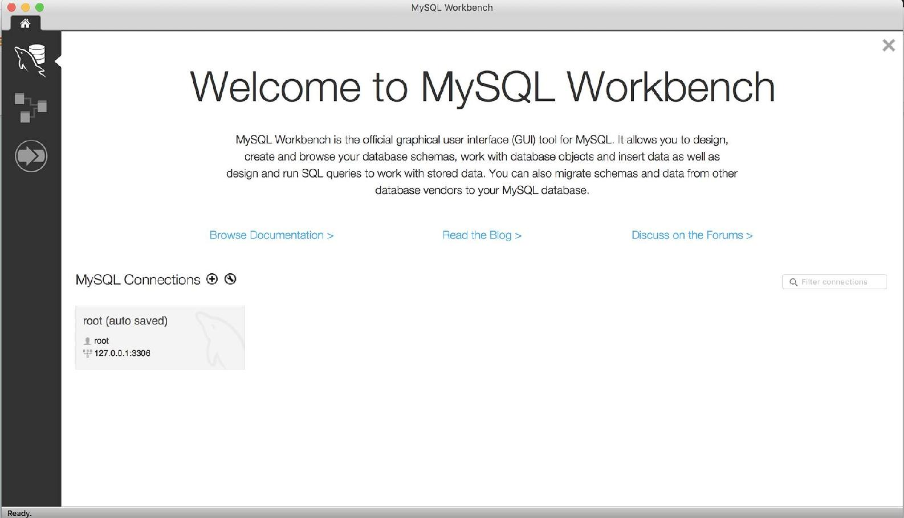

1.  将连接名称添加为`packt`，用户名添加为`root`，密码（如果有）。点击“测试连接”以查看连接是否正确，然后点击“确定”：

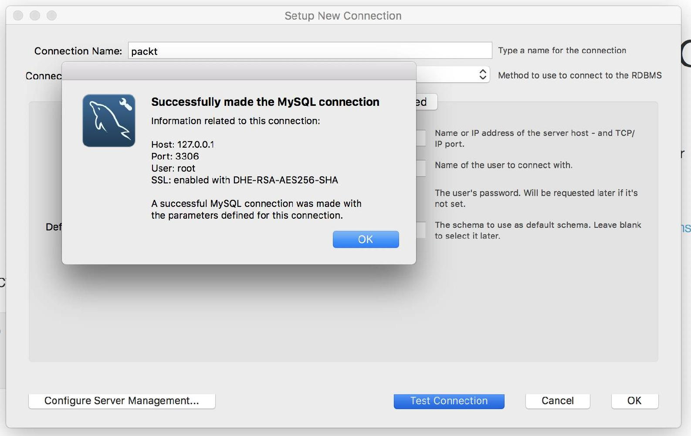

1.  点击确定以创建连接。

1.  现在，点击连接，packt：

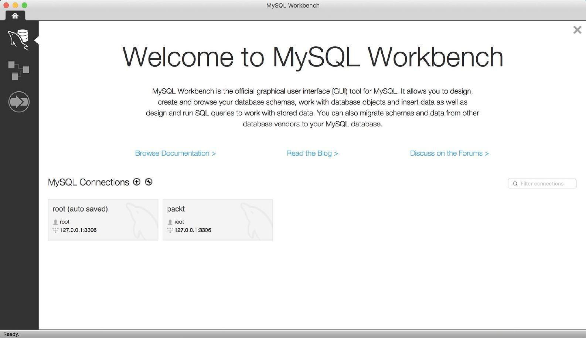

1.  通过运行以下查询来创建 todo 数据库，并点击执行图标：

```js
CREATE DATABASE todo;
```

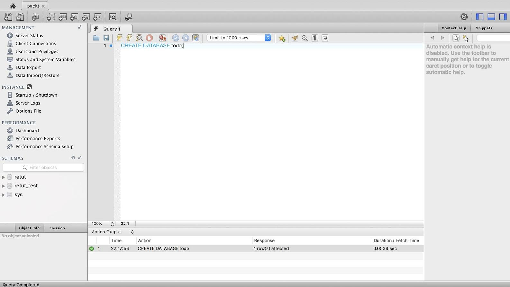

1.  本章的文件包含了我们的 todo 示例项目的基本 SQL 模式，几乎与我们在以前的练习中使用的基本 JavaScript 数组类似：

1.  在`Code/Lesson-3`文件夹中，有一个名为`raw-sql.sql`的文件。用您的代码编辑器打开文件并复制文件的内容。

1.  然后，回到 MySQL Workbench。

1.  将您从文件中复制的内容粘贴到文本框中，然后点击执行图标：

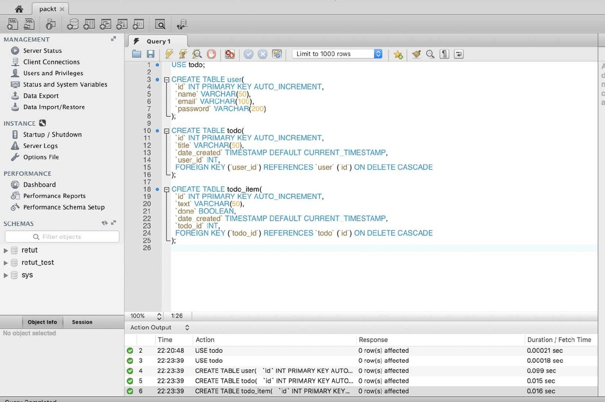

1.  1.  当您点击 SCHEMAS 标签右侧的刷新图标并点击表时，您应该会看到创建的表（`todo`，`todo_item`，`user`）的列表如下：

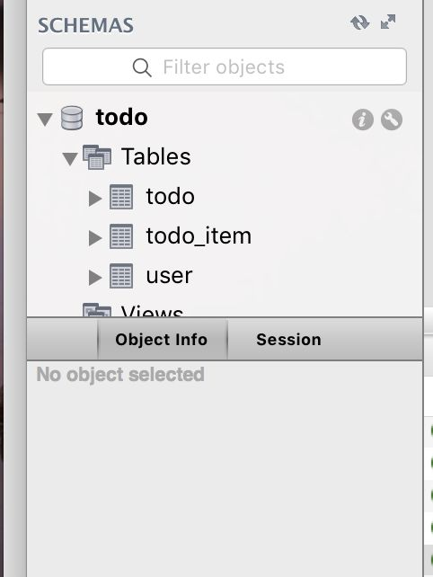

# 练习 13：连接到数据库

现在我们已经创建了数据库，在这个练习中，我们将使用必要的 npm 包（即`knex`和`mysql`）将我们的应用程序连接到我们的数据库：

1.  在终端上，切换到我们项目的根目录，并运行以下命令：

```js
npm install mysql knex --save
```

1.  让我们创建一个名为`db.js`的文件，并添加以下代码，根据需要适当替换用户和密码：

```js
const env = process.env.NODE_ENV || 'development';
const configs = 
{
  development: 
  {
    client: 'mysql',
    ...
    const Knex = require('knex')(configs[env]);
    module.exports = Knex;
```

您可以在`Code/Lesson-3/exercise-a`中找到`db.js`文件的完整代码。

1.  让我们测试一下我们的配置是否正确。我们将创建一个`test-db.js`文件：

```js
const Knex = require('./db');
Knex.raw('select 1+1 as sum')
.catch((err) => console.log(err.message))
.then(([res]) => console.log('connected: ', res[0].sum));
```

1.  现在，让我们转到终端并运行测试文件：

```js
node test-db.js
```

您应该会得到以下打印：

```js
connected: 2
```

# 练习 14：创建记录

在这个练习中，我们将编写代码来保存 todo 及其*项目*。首先，让我们创建一个虚拟用户，因为我们将在代码中硬编码用户 ID。稍后，在*练习 19：保护所有路由*中，我们将从身份验证详细信息中选择 ID：

1.  返回 MySQL Workbench。 

1.  清除先前的查询并粘贴以下查询，并单击执行图标：

```js
USE todo;
INSERT INTO 'user' ('id', 'name', 'email', 'password')
VALUES (NULL, 'Test User', 'user@example.com',
MD5('u53rtest'));
```

1.  当您点击用户表时，您应该看到以下内容；我们新创建的用户的 ID 为`1`：

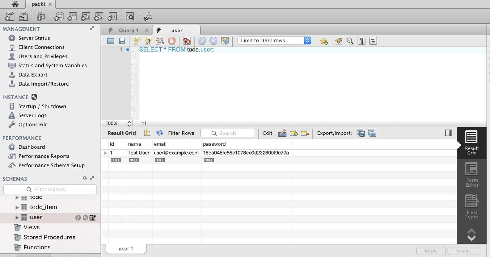

1.  现在，让我们转到我们的路由文件，`/routes/todo.js`，并修改代码，对于`POST: /todo`路由；将代码更改为如下（只有`handler`正在更改，注意更改为`async`函数）：

1.  让我们从`./db.js`中要求我们的 Knex 实例开始。在要求 Joi 的行后面，添加这个：

```js
const Knex = require('../db');
```

注意两个点，`../db.js`，因为`db.js`在父文件夹中。回想一下我们在第一章中关于在 Node.js 中要求本地模块的主题，*Node.js 简介*。

1.  1.  现在，让我们修改`POST: /todo`路由的处理程序。在这里，我们使用`Knex.insert`方法，并添加一个可选的`.returning`方法，以便我们得到添加的`todo`的 ID：

```js
{
  method: 'POST',
  path: '/todo',
  handler: async (request, reply) => 
  {
    const todo = request.payload;
    todo.user_id = 1; // hard-coded for now
    // using array-destructuring here since the
    // returned result is an array with 1 element
    const [ todoId ] = await Knex('todo')
      .returning('id')
      .insert(todo);
...
  }
},
```

您可以在`Code/Lesson-3/exercise-a/routes`的`todo.js 文件`中找到完整的代码。

与我们在第二章中的先前练习不同，*构建 API - 第一部分*，我们将把`POST: /todo`路由拆分为两个，`POST: /todo`，用于添加 todo 列表，以及`POST: /todo/<id>/item`，用于向列表添加项目。

1.  现在，让我们测试我们新创建的端点。如果您已经停止了服务器，请返回终端并使用`nodemon`再次启动它：

```js
nodemon server.js
```

1.  转到 Insomnia 并进行 post 请求；您应该会得到类似这样的东西（注意返回的`todo_id`，因为我们将在下一个示例中使用它）：

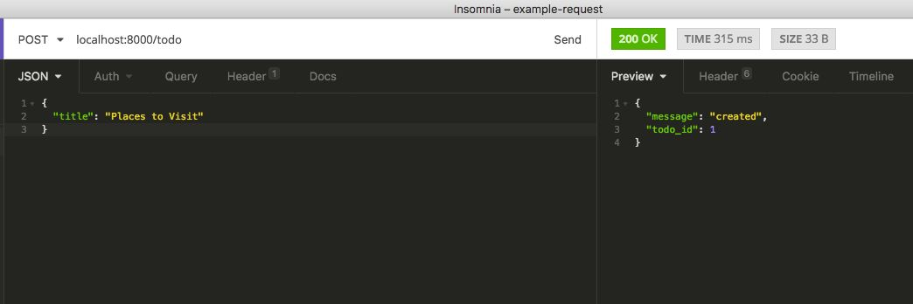

1.  现在，让我们添加一个用于添加 todo 项目的路由，`POST: /todo/<id>/item`；因此，在上一个`route`对象旁边，添加这个`route`对象：

```js
{
  method: 'POST',
  path: '/todo/{id}/item',
  handler: async (request, reply) => 
  {
    const todoItem = request.payload;
    todoItem.todo_id = request.params.id;
    const [ id ] = await Knex('todo_item')
      .insert(todoItem);
    return reply({ message: 'created', id: id });
...
},
```

您可以在`Code/Lesson-3/exercise-a/routes`的`todo.js`文件中找到完整的代码。

1.  现在，让我们测试路由，`/todo/1/item`，`1`是我们在步骤 6 中创建的`todo`的 ID：

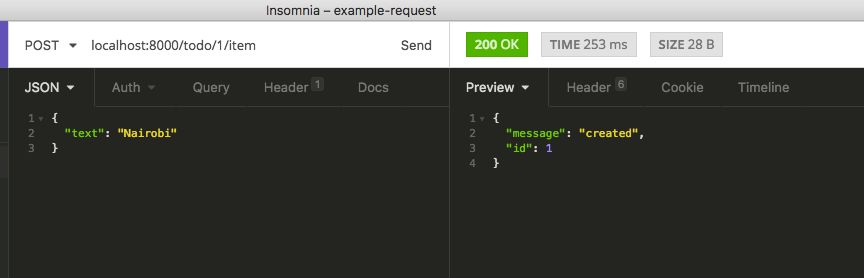

# 练习 15：从数据库中读取

在这个练习中，我们将编写以下路由：

+   列出特定用户的所有`todo`

+   获取单个 todo 项目的详细信息

+   列出特定 todo 的项目

我们将使用一些`Knex`方法：

+   `Knex('<table_name>')`，这相当于'`SELECT * FROM <table_name>`'

+   `.where()`，用于向查询添加 where 子句

1.  要获取所有 todo 的列表，我们将修改之前的`GET: /todo`路由。在这里，您只想列出特定认证用户的 todo 项目。现在，我们将使用我们硬编码的测试用户：

```js
{
  method: 'GET',
  path: '/todo',
  handler: async (request, reply) => 
  {
    const userId = 1; // hard-coded
    const todos = await Knex('todo')
      .where('user_id', userId);
    return reply(todos);
  },
},
```

1.  让我们修改获取单个`todo`项目的路由，`GET: /todo/<id>`：

```js
{
  method: 'GET',
  path: '/todo/{id}',
  ...
    .where({
    id: id,
    user_id: userId
    });
  if (todo) return reply(todo);
  return reply({ message: 'Not found' }).code(404);
  },
},
```

您可以在`Code/Lesson-3/exercise-a/routes`的`todo.js`文件中找到完整的代码。

我们在这里也使用了数组解构，因为结果（如果有）将是长度为 1 的数组，所以我们从数组中获取第一个且唯一的元素：`const [ todo ] = ...`

1.  现在，让我们添加用于获取特定`todo`的项目列表的路由对象，最好是在我们在*练习 14：创建记录*中添加`todo`项目的路由之后：

```js
{
  method: 'GET',
  path: '/todo/{id}/item',
  handler: async (request, reply) =>
  {
    const todoId = request.params.id;
    const items = await Knex('todo_item')
      .where('todo_id', todoId);
    return reply(items);
  },
},
```

1.  现在，让我们测试路由：

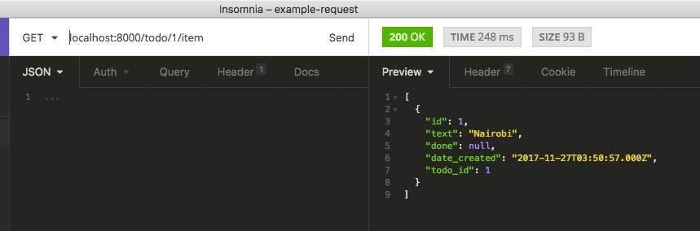

# 练习 16：更新记录

在这个练习中，我们将编写用于更新 todo 标题或 todo 项目的路由，这里我们将介绍一个新的 Knex 方法`.update()`：

1.  让我们从修改之前的`PATCH: /todo/<id>`路由开始。我们还添加了额外的验证，以确保`title`作为`payload`提供：

```js
{
  method: 'PATCH',
  path: '/todo/{id}',
  ...
    title: Joi.string().required(),
    }
  }
  }
},
```

1.  让我们测试路由：

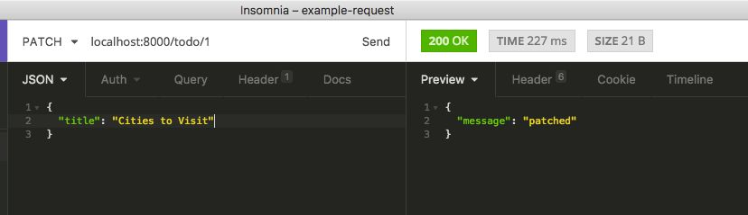

1.  现在，让我们为`/todo/<id>/item`添加另一个`PATCH`路由，这将有助于编辑`todo`项目的文本，并标记`todo`项目是否完成：

```js
{
  method: 'PATCH',
  path: '/todo/{todo_id}/item/{id}',
  handler: async (request, reply) => 
  {
    const itemId = request.params.id;
    ...
    payload: 
    {
      text: Joi.string(),
      done: Joi.boolean(),
    }
  ...
},
```

您可以在`Code/Lesson-3/exercise-a/routes`的`todo.js`文件中找到完整的代码。

1.  这个路由可以一次接受每个负载项（当使用例如 Web 或移动 UI 时，这将是最实际的情况），或者一次接受所有负载项：

1.  例如，将项目从`内罗毕`更改为`尼日利亚`，或者：

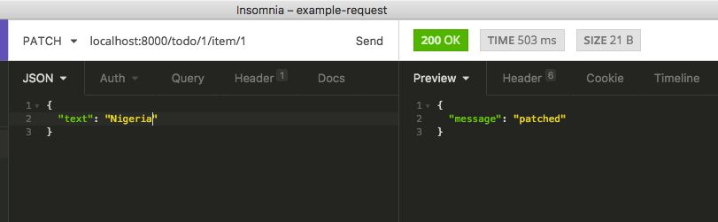

1.  1.  标记项目为`done`：

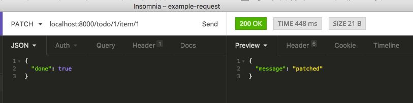

1.  当我们通过`GET：/todo/<id>/item`路由再次列出项目时，您将看到更新后的项目：

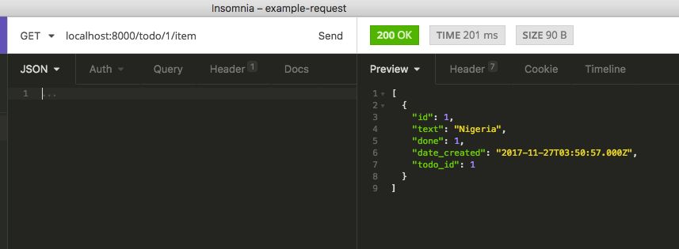

# 练习 17：删除记录

在这个练习中，我们将介绍最后一个重要的 Knex 方法，以完成我们的**创建**，**读取**，**更新**，**删除**（CRUD）之旅，`.delete()`：

1.  让我们添加一个用于删除`todo`项目的路由：

```js
{
  method: 'DELETE',
  path: '/todo/{todoId}/item/{id}',
  handler: async (request, reply) =>
  {
    const id = request.params.id;
    const deleted = await Knex('todo_item')
      .where('id', id)
      .delete();
    return reply({ message: 'deleted' });
  },
},
```

1.  现在，让我们在之前的`todo`（ID 为`1`）上添加一个项目，然后将其删除：

1.  添加项目：

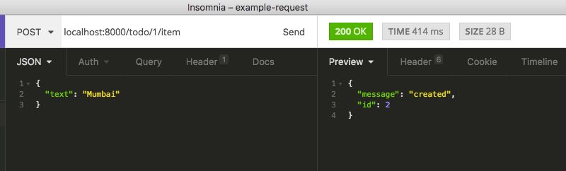

1.  1.  现在我们已经有了它的 ID（在这种情况下是`2`），删除它：

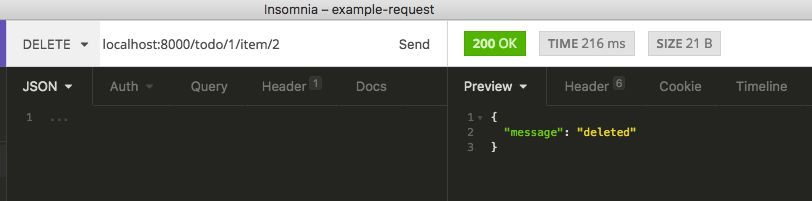

# 练习 18：清理代码

现在，我们几乎更新了从第二章*,* *构建 API - 第一部分*中获得的所有路由，现在让我们删除所有不再需要的代码：

1.  删除先前硬编码的 todo 列表：

```js
const todoList = [
...
];
```

1.  删除`PUT：/todo/<id>`路由对象：

```js
{
  method: 'PUT',
  path: '/todo/{id}',
  handler: (request, reply) =>
  {
    const index = request.params.id - 1;
    // replace the whole resource with the new one
    todoList[index] = request.payload;
    return reply({ message: 'updated' });
  },
},
```

1.  重新实现`DELETE：/todo/<id>`路由对象，与*练习 17：删除记录*非常相似；区别只是路由：

```js
{
  method: 'DELETE',
  path: '/todo/{id}',
  handler: async (request, reply) =>
  {
    const id = request.params.id;
    const deleted = await Knex('todo')
      .where('id', id)
      .delete();
    return reply({ message: 'deleted' });
  },
},
```

由于我们的 SQL 查询有这样一行，它添加了一个约束，当删除一个`todo`时可能发生，所有属于该`todo`的项目也会被删除：

`CREATE TABLE todo_item(`

`  'id' INT PRIMARY KEY AUTO_INCREMENT,`

`  'text' VARCHAR(50),`

`  'done' BOOLEAN,`

`  'date_created' TIMESTAMP DEFAULT CURRENT_TIMESTAMP,`

`  'todo_id' INT,`

`  FOREIGN KEY (`todo_id`) REFERENCES `todo` (`id`) ON DELETE CASCADE`

`）;`

# 使用 JWT 对 API 进行身份验证

到目前为止，我们一直在使用我们的 API 而没有任何身份验证。这意味着如果这个 API 托管在公共场所，任何人都可以访问任何路由，包括删除我们所有的记录！任何合适的 API 都需要身份验证（和授权）。基本上，我们需要知道谁在做什么，以及他们是否被授权（允许）这样做。

**JSON Web Tokens**（**JWT**）是一种开放的、行业标准的方法，用于在两个参与方之间安全地表示声明。声明是您希望其他人能够读取和/或验证但不能更改的任何数据位。

为了识别/验证用户的 API，用户在请求的标头中放置一个基于标准的令牌（使用 Authorization 键），（在单词*Bearer*之前加上）。我们将很快在实践中看到这一点。

# 练习 19：保护所有路由

在这个练习中，我们将保护我们创建的所有`/todo/*`路由，以便没有经过身份验证的用户可以访问它们。在*练习 21：实施授权*中，我们将区分*未经身份验证*和*未经授权*的用户：

1.  我们将首先安装一个用于 JWT 的 Hapi.js 插件，`hapi-auth-jwt`。转到终端并运行：

```js
npm install hapi-auth-jwt --save
```

使用`Code/Lesson-3/exercise-b`作为您的参考。

1.  我们将修改从`./routes/todo.js`中获取的路由数组，在`server.js`文件中：

1.  首先，从文件顶部要求安装的`hapi-auth-jwt`：

```js
const hapiAuthJwt = require('hapi-auth-jwt');
```

1.  1.  然后，用这个替换旧的一行，`server.route`(`routes.todo`)：

```js
server.register(hapiAuthJwt, (err) => 
{
  server.auth.strategy('token', 'jwt', 
  {
    key: 'secretkey-hash',
    verifyOptions: 
    {
      algorithms: [ 'HS256' ],
...
    // add auth config on all routes
...
});
```

您可以在`Code/Lesson-3/exercise-b`的`server.js`文件中找到完整的代码。

1.  现在，尝试访问任何路由，例如`GET：/todo`；你应该会得到这个：

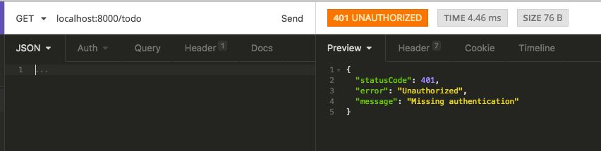

# 练习 20：添加用户身份验证

现在我们已经保护了所有的待办事项路由，我们需要一种方法来为有效的用户发放令牌以访问 API。用户将他们的电子邮件和密码发送到一个路由(`/auth`)，我们的 API 将返回一个用于每个请求的认证令牌：

1.  在`/routes`文件夹中，创建一个名为`auth.js`的文件。

1.  现在，我们需要另外两个包，`jsonwebtoken`用于签署认证令牌，`md5`用于比较密码，因为你可能还记得，我们之前使用了 MySQL 的`md5`函数来存储用户的密码：

```js
npm install jsonwebtoken md5 --save
```

1.  在`auth.js`文件中，添加以下代码：

```js
const jwt = require('jsonwebtoken');
const Joi = require('joi');
const md5 = require('md5');
const Knex = require('../db');
module.exports =
  {
  method: 'POST',
  path: '/auth',
...
};
```

您可以在`Code/Lesson-3/exercise-b/routes`文件夹中找到`auth.js`文件的完整代码。

1.  现在，让我们在服务器上注册我们的`auth.js`路由。在`server.js`中，在`routes.todo = ...`之后，添加以下代码：

```js
routes.auth = require('./routes/auth');
```

1.  在初始化服务器的行之后，我们可以添加`route`注册：

```js
server.route(routes.auth);
```

1.  现在，让我们尝试我们的路由，`POST: /auth`：

1.  首先，使用不正确的邮箱/密码组合：

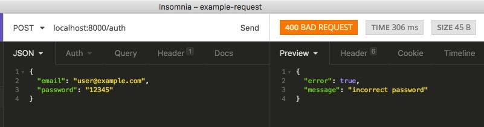

1.  1.  然后，使用正确的密码，记住*练习 14：创建记录*，*步骤 2*，我们创建了测试用户和密码：

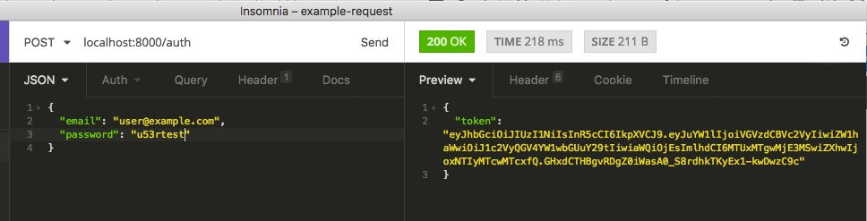

1.  现在，我们可以复制生成的令牌，并在以后的请求中使用，例如通过添加一个授权头来进行`GET: /todo`请求。因此，请记住，我们从单词`Bearer`开始，然后是一个空格，然后粘贴令牌；这是 JWT 的约定：

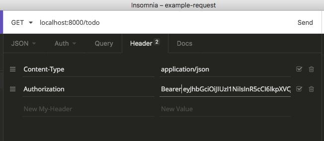

1.  现在，我们可以访问路由而不会收到未经授权的响应，就像在第 20 个练习的*步骤 6*中一样：

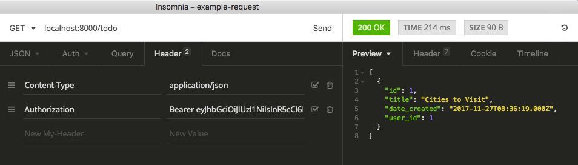

1.  现在，让我们回到`./routes/todo.js`文件中我们之前硬编码用户的地方，并从认证对象中获取它们，即：

```js
const userId = request.auth.credentials.id;
```

回想一下之前的*步骤 3*，当我们签署我们的令牌时，我们提供了用户的详细信息，即`name`，`email`和`id`。这就是我们在`request.auth.credentials.id`中得到`.id`的地方：

`jwt.sign(`

`{`

`  name: user.name,`

`  邮箱：user.email，`

`  id: user.id,`

`},`

`...`

`）;`

1.  现在，让我们回到我们的 phpMyAdmin 网络界面，并创建另一个用户，就像我们在*练习 14：创建记录*，*步骤 2*中所做的一样，并将以下 SQL 粘贴到 SQL 文本区域中：

```js
INSERT INTO 'user' ('id', 'name', 'email', 'password')
VALUES (NULL, 'Another User', 'another@example.com',
MD5('12345'));
```

1.  现在，让我们去做另一个`POST: /auth`请求，使用新用户并获取令牌：

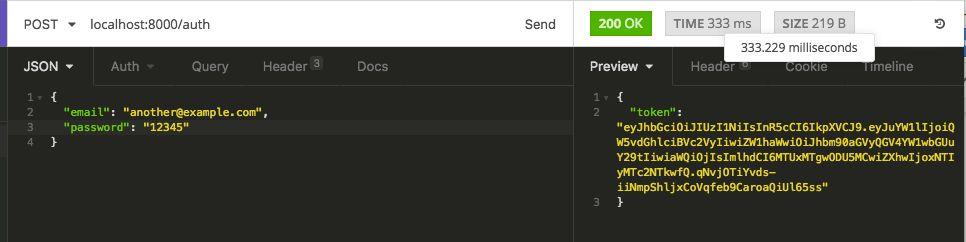

1.  让我们使用这个新令牌通过`POST: /todo`请求创建另一个待办事项清单：

1.  在 Insomnia 中，转到头部部分，删除先前的授权头，并用新的替换它：

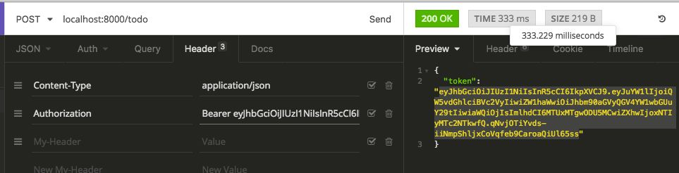

1.  1.  现在，让我们发出我们的请求：

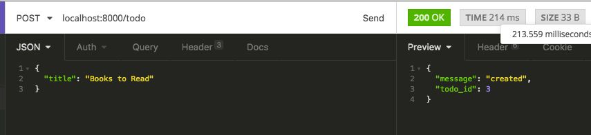

1.  1.  通过`GET: /todo`请求，让我们看看新的待办事项清单：

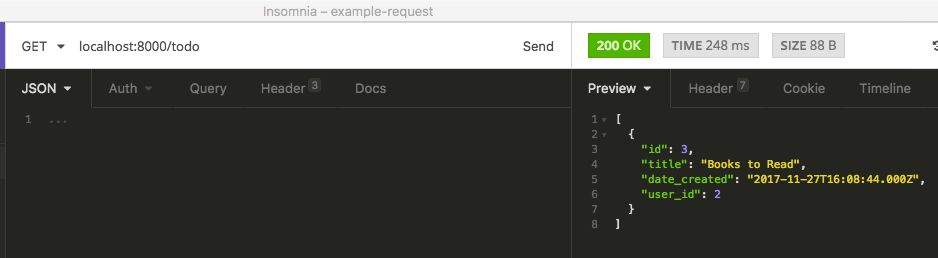

1.  1.  正如您所看到的，新创建的用户只能看到他们创建的内容。就授权而言，我们到目前为止做得很好。然而，让我们尝试并检查属于第一个用户的待办事项 ID`1`的内容：

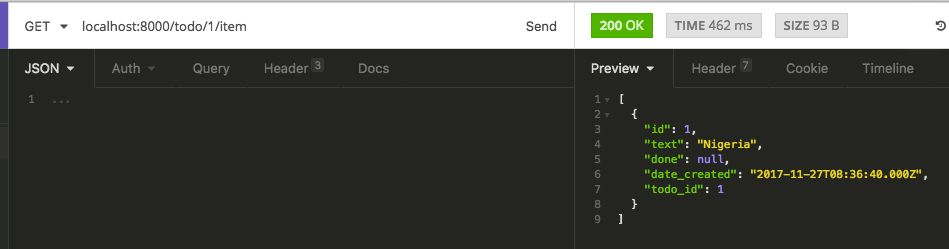

糟糕！我们可以看到别人的待办事项清单；这是一个安全漏洞。这将引导我们进入这个主题的最后一部分，**授权**。

# 认证与授权

通过认证，我们知道谁在访问我们的 API；通过授权，我们可以告诉谁可以在我们的 API 中访问什么。

# 练习 21：实施授权

在这个练习中，我们将完善我们的 API，以确保用户只有授权才能访问他们的待办事项和待办事项内容：

1.  首先，让我们修复我们在*练习 20：添加用户认证*，*步骤 12*中遇到的漏洞。因此，我们将修改`/routes/todo.js`中的`GET: /todo/<id>`路由对象，首先检查用户是否拥有该待办事项，然后才能访问其内容：

```js
{
  method: 'GET',
  path: '/todo/{id}/item',
  handler: async (request, reply) =>
  {
    const todoId = request.params.id;
    ...
    return reply(items);
  },
},
```

您可以在`Code/Lesson-3/exercise-b/routes`文件夹中找到`todo.js`文件的完整代码。

1.  现在，当我们再次访问`GET: /todo/1/item`时，我们会得到正确的错误消息：

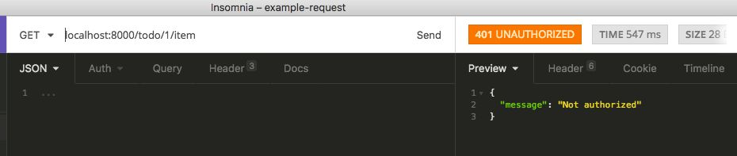

1.  您可以为以下路由添加额外的授权逻辑：

+   +   `POST`：`/todo/<id>/item`，确保用户不能向不属于他们的待办事项添加项目。

+   `PATCH`：`/todo/<id>`，用户不能对不属于他们的待办事项进行修补。

+   `PATCH`：`/todo/<todoId>/item/<id>`，用户不能对不属于他们的待办事项进行修补。

+   `DELETE`：`/todo/<id>`，用户不能删除不属于他们的待办事项。

+   `DELETE`：`/todo/<todoId>/item/<id>`，用户不能对不属于他们的待办事项进行修补。

跨域资源共享（CORS）是一种机制，它使用额外的 HTTP 头来让用户代理（浏览器）获得许可，以访问来自不同源（域）的服务器上选择的资源，而不是当前使用的站点。例如，当您在另一个域上托管 Web 应用程序前端时，由于浏览器限制，您将无法访问 API。

因此，我们需要明确声明我们的 API 将允许跨域请求。我们将修改`server.js`文件，在我们初始化服务器连接的地方，以启用 CORS：

```js
server.connection(
{
   host: 'localhost',
   port: process.argv[2] || 8000,
   routes:
   {
     cors: true,
   }
});
```

# 使用 Lab 测试您的 API

在本节中，我们将简要介绍为 Hapi.js API 编写单元测试。测试是一个庞大的主题，可能需要一个完整的课程来讲解，但在本节中，我们将介绍一些基本部分，让您能够开始运行。

让我们首先强调为您的 API 编写单元测试的重要性：

+   **可维护性**：这是我认为为软件添加测试最重要的价值。当您有了测试，您可以放心地在几个月后回来修改您的代码，而不必担心您的更新是否会破坏任何东西。

+   需求规格：测试确保您的代码满足要求。对于我们的例子，我们开始时实现了要求，因为我们想传达一些基本概念。但实际上，最好是在实现路由之前先从测试开始。

+   **自动化测试**：您意识到在我们之前的例子中，我们一直在检查我们的 API 客户端（Insomnia）以查看我们的 API 是否正常工作；这可能有点麻烦。有了测试，一旦您编写了正确的测试，您就不必担心这个问题。

Hapi.js 通常使用 Lab（https://github.com/hapijs/lab）作为其测试框架。我们将在下一个练习中为我们的 API 编写一些测试。

# 练习 22：使用 Lab 编写基本测试

在这个练习中，我们将介绍为 Hapi.js web API 编写单元测试的概念，主要使用第三方`lab`模块和内置的`assert`模块。理想情况下，我们应该为我们的测试有一个单独的数据库，但为了简单起见，我们也将分享我们的开发数据库用于测试：

1.  让我们首先安装必要的软件包。请注意，我们使用`--save-dev`，因为测试不需要用于生产，因此它们是*开发依赖项*：

```js
npm install lab --save-dev
```

使用`Code/Lesson-3/exercise-c`作为参考。

1.  在项目的根目录下创建一个`test`文件夹，那里将有我们的测试。由于我们的 API 很简单，我们只会有一个文件包含所有的测试。

1.  在`test`中，创建一个名为`test-todo.js`的文件。

1.  作为设置，`test/test-todo.js`需要我们测试所需的模块：

```js
const assert = require('assert');
// lab set-up
const Lab = require('lab');
const lab = exports.lab = Lab.script();
// get our server(API)
const server = require('../server');
```

在第一行中，我们要求 assert，如果您回忆起第一章中的介绍，这是一个内置模块。或者，您也可以使用其他断言库，如`chai`（https://github.com/chaijs/chai）、`should.js`（https://github.com/tj/should.js）等。

Lab 测试文件必须要求`lab`模块并导出一个测试脚本，如前面的第 4 行所示。我们将在接下来的行中获取 lab 的其余部分；我们很快就会看到它们发挥作用。

1.  由于我们在`test-todo.js`文件的第 6 行中需要服务器，因此我们需要返回到我们的`server.js`文件，并在最后一行导出`server`对象。

```js
module.exports = server;
```

1.  对于 DB 配置，让我们修改我们的`db.js`文件，包括指向开发配置的测试环境配置。在`configs`定义之后添加这一行：

```js
configs.test = configs.development;
```

1.  让我们修改服务器连接设置代码，以便在运行测试时从环境变量设置测试服务器的端口。这允许我们在不同端口上运行测试服务器，而我们的开发服务器正在运行：

```js
server.connection(
{
  host: 'localhost',
  port: process.env.PORT || 8000,
  routes:
  {
    cors: true,
  }
});
```

1.  我们将使用`lab`模块中的一些方法；我们需要使用对象解构来获取它们。在我们的`test-todo.js`文件中添加以下行：

```js
const
{
  experiment,
  test,
  before,
} = lab;
```

1.  让我们从编写一个简单的测试开始，确保`GET: / request`被执行，并返回`{ message: 'hello, world' }`。

```js
experiment('Base API', () => 
{
  test('GET: /', () => 
  {
    const options =
    {
      ...
      assert.equal(response.result.message, 'hello, world');
    });
  });
});
```

您可以在`Code/Lesson-3/exercise-c/test`的`test-todo.js`文件中找到完整的代码。

我们现在看到`experiment`、`test`和`assert.equal`方法在起作用。`experiment`基本上是将测试组合在一起的一种方式，实际测试是在`test`方法的回调函数（称为*测试用例*）中编写的。这里的`assert.equal`只是比较两个值，以确保它们相等，如果不相等，将抛出*断言错误*。

1.  现在，让我们运行我们的测试：

1.  在终端（如果您在其中一个终端上运行 API，请打开一个新的终端），导航到我们项目的根目录并运行以下命令：

```js
PORT=8001 ./node_modules/lab/bin/lab test --leaks
```

我们正在添加一个可选的`--leaks`选项来关闭内存泄漏检测，因为我们现在不需要它。

在命令的开头，我们添加了`PORT=8001`；这是一种向我们的脚本传递环境变量的方式，这就是为什么我们之前在步骤 7 中更改了我们的代码的原因。我们现在在端口`8001`上运行我们的测试服务器，而我们的开发服务器仍在端口`8000`上运行。

1.  1.  当您运行命令时，您应该看到与此类似的内容：

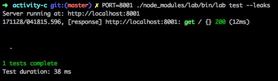

1.  我们可以通过将其添加到我们的`package.json`文件的脚本中来缩短我们的测试命令：

1.  替换以下代码行：

```js
"test": "echo \"Error: no test specified\" && exit 1"
```

1.  1.  使用以下行：

```js
"test": "PORT=8001 ./node_modules/lab/bin/lab test --leaks"
```

1.  1.  现在，回到终端，只需运行：

```js
npm test
```

1.  现在，让我们测试我们的身份验证是否正常工作。添加以下内容

前一个段落之后的部分：

```js
experiment('Authentication', () =>
{
  test('GET: /todo without auth', () =>
  {
    const options =
    {
      method: 'GET',
      url: '/todo'
    };
    server.inject(options, (response) => 
    {
      assert.equal(response.statusCode, 401);
    });
  });
});
```

1.  现在，返回并运行`npm test`。两个测试都应该通过：

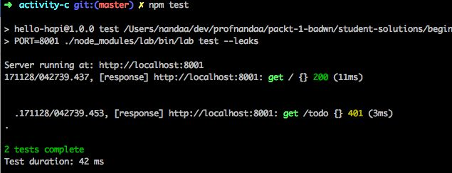

1.  您会意识到我们不得不每隔一段时间回到终端运行测试。这与在 API 客户端（Insomnia）上进行测试一样麻烦；我们需要一些自动化：

1.  我们将需要 gulp.js，并且还需要两个其他的 Gulp 插件。让我们安装它们：

```js
install gulp gulp-shell gulp-watch --save-dev
```

1.  1.  现在，让我们在我们项目的根目录编写一个简单的`gulpfile.js`来自动化我们的测试任务：

```js
const gulp = require('gulp');
const shell = require('gulp-shell');
const watch = require('gulp-watch');
...
gulp.task('test', shell.task('npm test'));
```

您可以在`Code/Lesson-3/exercise-c`的`gulpfile.js`文件中找到完整的代码。

1.  1.  现在，让我们转到`package.json`并在之前的`test`旁边添加另一个`gulp`任务的脚本选项：

```js
"scripts": 
{
  "test": "PORT=8001 ./node_modules/lab/bin/lab test --leaks",
  "test:dev": "./node_modules/.bin/gulp test:dev"
},
```

1.  1.  现在，转到终端，而不是`npm test`，运行以下命令：

```js
npm run test:dev
```

1.  1.  监视任务将被启动，因此，在前面一点中`src`数组中的任何文件进行的更改，测试将自动运行。这意味着您可以继续进行开发工作，并定期检查测试是否全部通过：

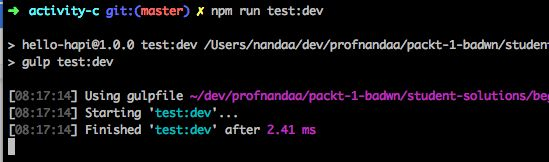

1.  现在，让我们为`GET: /todo`路由编写一个示例测试。请记住，对于所有经过身份验证的路由，我们需要首先获得令牌，以便我们能够成功发出请求。因此，在任何测试开始之前，我们将需要一个脚本来获取令牌。这就是我们在步骤 8 中得到的`before`函数发挥作用的地方。在我们的`test-todo.js`文件中，添加以下部分：

```js
experiment('/todo/* routes', () => 
{
  const headers = 
  {
    Authorization: 'Bearer ',
  };
  before(() => 
  {
    const options = 
    {
      method: 'POST',
      url: '/auth',
      ...
});
```

您可以在`Code/Lesson-3/exercise-c/test`的`test-todo.js`文件中找到完整的代码。

# 摘要

在本章中，我们探讨了很多内容。我们首先介绍了 Knex.js 以及如何使用它来连接和使用数据库。我们了解了基本的 CRUD 数据库方法。然后，我们介绍了如何对我们的 API 进行身份验证，并防止未经授权的访问，使用 JWT 机制。我们还提到了关于 CORS 的一些重要内容，浏览器如何处理它，以及我们如何在我们的 API 上启用它。最后，我们涉及了关于使用 Lab 库测试我们的 API 的概念。我们还简要介绍了使用 gulp.js 进行测试自动化的概念。

在这本书中，我们首先学习了如何实现必要的模块，使简单的应用程序能够运行起来。然后，我们开始实现异步和等待函数，以高效处理异步代码。在介绍了 Node.js（应用程序构建方面）之后，我们开始构建一个使用 Node.js 的 API。为了做到这一点，我们最初使用了内置模块，然后利用了丰富的 Hapi.js 框架。我们也了解了 Hapi.js 框架的优势。之后，我们学会了如何处理来自 API 客户端的请求，最后，我们通过涉及与数据库的交互来完成了这本书。

这是一个实用的快速入门指南。为了进一步提高您的知识，您应该考虑使用 Node.js 构建实时应用程序。我们在下一节推荐了一些书籍，但请确保您查看我们的网站，以找到其他可能对您感兴趣的书籍！
