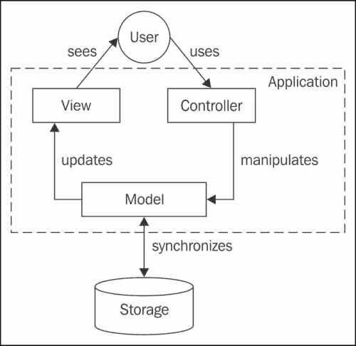
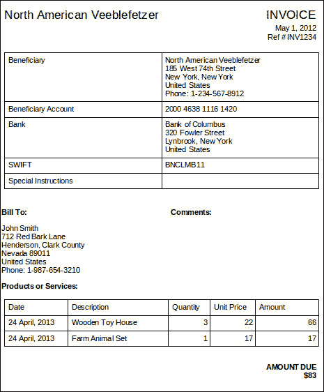
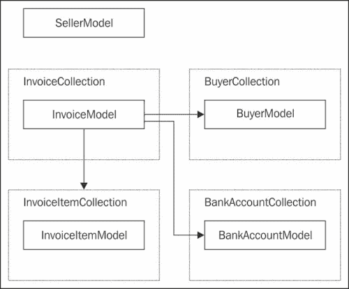
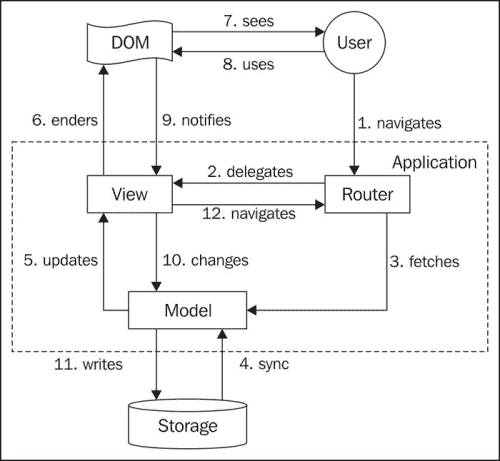
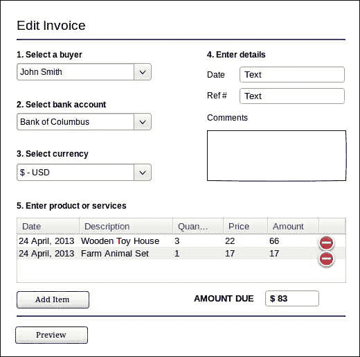
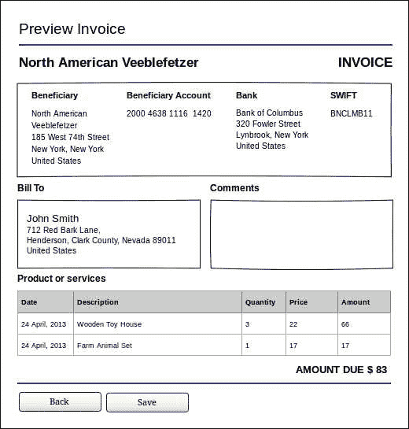
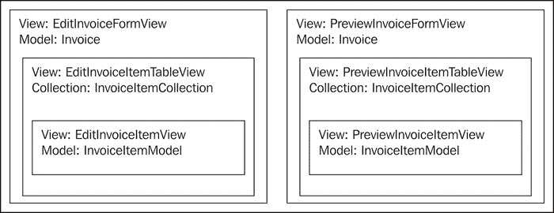
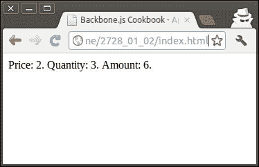
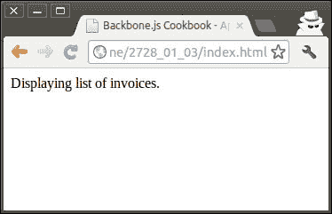
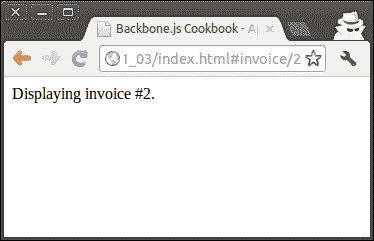

# 第一章. 理解 Backbone

在本章中，我们将涵盖以下内容：

+   使用 MVC 模式设计应用程序

+   使用模型和集合定义业务逻辑

+   使用视图和路由器模拟应用程序的行为

+   从零开始创建应用程序结构

+   编写你的第一个 Backbone 应用程序

+   在你的应用程序中实现 URL 路由

+   使用插件扩展应用程序

+   为 Backbone 项目做出贡献

# 简介

Backbone.js 是一个基于模型-视图-控制器（MVC）模式的轻量级 JavaScript 框架，允许开发者创建单页网页应用程序。使用 Backbone，可以通过 REST 方法快速更新网页，同时客户端和服务器之间传输的数据量最小。

Backbone.js 正在日益流行，并被广泛应用于网页应用程序和 IT 创业公司；以下是一些例子：

+   Groupon Now！：团队决定他们的第一个产品将侧重于 AJAX，但仍应具有可链接性和可分享性。尽管他们对 Backbone 完全陌生，但他们发现其学习曲线非常快，因此他们能够在两周内交付可工作的产品。

+   Foursquare：这个项目使用了 Backbone.js 库来为 foursquare 中的实体创建模型类（例如，地点、签到和用户）。他们发现 Backbone 的模型类提供了一个简单且轻量级的机制来捕获对象的数据和状态，并包含经典继承的语义。

+   LinkedIn 移动版：这个项目使用了 Backbone.js 来创建其下一代 HTML5 移动网页应用程序。Backbone 使应用程序模块化、组织化和可扩展变得容易，因此可以编程 LinkedIn 用户体验的复杂性。此外，他们正在使用相同的代码库在 iOS 和 Android 平台上的移动应用程序中。

+   WordPress.com：这是 WordPress 的 SaaS 版本，并在其通知系统中使用了 Backbone.js 的模型、集合和视图，并将 Backbone.js 集成到主页的统计标签和其他功能中。

+   Airbnb：这是一个用户可以列出、发现和预订世界各地独特空间的社区市场。其开发团队在许多最新产品中使用了 Backbone。最近，他们使用 Backbone.js 和 Node.js 重建了一个移动网站，并与名为 Rendr 的库结合在一起。

你可以通过以下链接了解 Backbone.js 的其他使用示例：

[`backbonejs.org/#examples`](http://backbonejs.org/#examples)

Backbone.js 由 DocumentCloud 的 Jeremy Ashkenas 于 2010 年启动，现在全世界许多开发者正在使用 Git，这个分布式版本控制系统，来使用和改进它。

在本章中，我们将提供一些如何使用 Backbone.js 的实用示例，并按照 MVC 和 Backbone 模式为名为计费应用程序的程序设计一个结构。我们还将在此书后面的章节中参考这个结构。如果你是 Backbone.js 的新手开发者，阅读本章特别有用。如果你觉得自己是经验丰富的开发者，可以跳过这一章。

# 使用 MVC 模式设计应用程序

MVC 是一种广泛用于面向用户软件（如 Web 应用程序）的设计模式。它的目的是以方便用户交互的方式分割数据并展示数据。为了理解它做什么，理解以下内容：

+   模型：它包含数据和提供用于运行应用程序的业务逻辑

+   视图：它向用户展示模型

+   控制器：它通过更新模型和视图来响应用户输入

MVC 实现可能会有所不同，但通常它符合以下方案：



全球实践表明，使用 MVC 模式为开发者提供了各种好处：

+   遵循关注点分离的原则，将应用程序分割成独立的部分，这使得修改或替换变得更加容易。

+   它通过在不同的视图中渲染模型来实现代码重用，而无需在每个视图中实现模型功能

+   对于组织中的新开发者来说，它需要更少的培训，并且启动时间更快

为了更好地理解 MVC 模式，我们将设计一个计费应用程序。在学习特定主题时，我们将参考这个设计。

我们的计费应用程序将允许用户生成发票、管理它们并将它们发送给客户。根据全球惯例，发票应包含参考编号、日期、买方和卖方信息、银行账户详情、提供的产品或服务列表以及发票总额。让我们看一下下面的截图，以了解发票的外观：



## 如何操作...

让我们遵循以下步骤来为计费应用程序设计 MVC 结构：

1.  让我们为这个应用程序列出功能需求。我们假设最终用户可能希望能够执行以下操作：

    +   生成发票

    +   将发票通过电子邮件发送给买方

    +   打印发票

    +   查看现有发票列表

    +   管理发票（创建、读取、更新和删除）

    +   更新发票状态（草稿、已发行、已支付和已取消）

    +   查看年度收入图表和其他报告

1.  为了简化创建多个发票的过程，用户可能希望在创建发票之前，在应用程序的特定部分管理买家的信息和其个人详细信息。因此，我们的应用程序应向最终用户提供以下附加功能：

    +   查看买家列表并在生成发票时使用它的能力

    +   管理买家（创建、读取、更新和删除）的能力

    +   查看银行账户列表并在生成发票时使用它的能力

    +   管理他/她的银行账户（创建、读取、更新和删除）的能力

    +   编辑个人详细信息并在生成发票时使用它们的能力

    当然，我们可能想要有更多的功能，但这足以展示如何使用 MVC 模式设计应用程序。

1.  接下来，我们使用 MVC 模式设计应用程序。

    在我们定义了应用程序的功能之后，我们需要了解哪些更与模型（业务逻辑）相关，哪些更与视图（展示）相关。让我们将功能分成几个部分。

1.  然后，我们学习如何定义模型。

    模型展示数据和提供特定于数据的数据逻辑。模型可以相互关联。在我们的案例中，它们如下：

    +   InvoiceModel

    +   InvoiceItemModel

    +   BuyerModel

    +   SellerModel

    +   BankAccountModel

1.  然后，我们将定义模型集合。

    我们的应用程序允许用户操作多个模型，因此它们需要组织成一个名为 Collection 的特殊可迭代对象。我们需要以下集合：

    +   InvoiceCollection

    +   InvoiceItemCollection

    +   BuyerCollection

    +   BankAccountCollection

1.  接下来，我们定义视图。

    视图向应用程序用户展示模型或集合。单个模型或集合可以被多个视图渲染。我们应用程序中需要的视图如下：

    +   EditInvoiceFormView

    +   InvoicePageView

    +   InvoiceListView

    +   PrintInvoicePageView

    +   EmailInvoiceFormView

    +   YearlyIncomeGraphView

    +   EditBuyerFormView

    +   BuyerPageView

    +   BuyerListView

    +   EditBankAccountFormView

    +   BankAccountPageView

    +   BankAccountListView

    +   EditSellerInfoFormView

    +   ViewSellectInfoPageView

    +   ConfirmationDialogView

1.  最后，我们定义一个控制器。

    控制器允许用户与应用程序交互。在 MVC 中，每个视图都可以有不同的控制器，用于执行以下操作：

    +   将 URL 映射到特定视图

    +   从服务器获取模型

    +   显示和隐藏视图

    +   处理用户输入

# 使用模型和集合定义业务逻辑

现在，是时候使用 MVC 和 OOP 方法为计费应用程序设计业务逻辑了。

在这个菜谱中，我们将定义应用程序的内部结构，包括模型和集合对象。虽然模型代表单个对象，但集合是一组可以迭代、过滤和排序的模型。

计费应用程序中模型和集合之间的关系符合以下方案：



## 如何操作...

对于每个模型，我们将创建两个表格：一个用于属性，另一个用于方法：

1.  我们定义 BuyerModel 属性。

    | 名称 | 类型 | 必需 | 唯一 |
    | --- | --- | --- | --- |
    | id | Integer | 是 | 是 |
    | name | 文本 | 是 |   |
    | address | 文本 | 是 |   |
    | phoneNumber | 文本 | 否 |   |

1.  然后，我们定义 SellerModel 属性。

    | 名称 | 类型 | 必需 | 唯一 |
    | --- | --- | --- | --- |
    | id | Integer | 是 | 是 |
    | name | 文本 | 是 |   |
    | address | 文本 | 是 |   |
    | phoneNumber | 文本 | 否 |   |
    | taxDetails | 文本 | 是 |   |

1.  在此之后，我们定义 BankAccountModel 属性。

    | 名称 | 类型 | 必需 | 唯一 |
    | --- | --- | --- | --- |
    | id | Integer | 是 | 是 |
    | beneficiary | 文本 | 是 |   |
    | beneficiaryAccount | 文本 | 是 |   |
    | bank | 文本 | 是 |   |
    | SWIFT | 文本 | 是 |   |
    | specialInstructions | 文本 | 否 |   |

1.  我们定义 InvoiceItemModel 属性。

    | 名称 | 参数 | 返回类型 | 唯一 |
    | --- | --- | --- | --- |
    | calculateAmount | - | Decimal |   |

1.  接下来，我们定义 InvoiceItemModel 方法。

    我们不需要在模型中存储项目金额，因为它始终取决于价格和数量，因此可以计算得出。

    | 名称 | 类型 | 必需 | 唯一 |
    | --- | --- | --- | --- |
    | id | Integer | 是 | 是 |
    | deliveryDate | 日期 | 是 |   |
    | description | 文本 | 是 |   |
    | price | Decimal | 是 |   |
    | quantity | Decimal | 是 |   |

1.  现在，我们定义 InvoiceModel 属性。

    | 名称 | 类型 | 必需 | 唯一 |
    | --- | --- | --- | --- |
    | id | Integer | 是 | 是 |
    | referenceNumber | 文本 | 是 |   |
    | date | 日期 | 是 |   |
    | bankAccount | 引用 | 是 |   |
    | items | 集合 | 是 |   |
    | comments | 文本 | 否 |   |
    | status | Integer | 是 |   |

1.  我们定义 InvoiceModel 方法。

    发票金额可以轻松计算为发票项目金额的总和。

    | 名称 | 参数 | 返回类型 | 唯一 |
    | --- | --- | --- | --- |
    | calculateAmount |   | Decimal |   |

1.  最后，我们定义集合。

    在我们的案例中，它们是 InvoiceCollection、InvoiceItemCollection、BuyerCollection 和 BankAccountCollection。它们用于存储适当类型的模型，并提供一些方法来向集合中添加/删除模型。

## 它是如何工作的...

Backbone.js 中的模型通过扩展 Backbone.Model 实现，集合通过扩展 Backbone.Collection 创建。要实现模型和集合之间的关系，我们可以使用特殊的 Backbone 扩展，这些扩展在本书的后续章节中有所描述。

## 参见

+   在第二章中，操作模型属性的配方，模型

+   在第三章中，创建模型集合的配方，集合

要了解更多关于对象属性、方法和 JavaScript 中的 OOP 编程的信息，您可以参考以下资源：

[`developer.mozilla.org/en-US/docs/JavaScript/Introduction_to_Object-Oriented_JavaScript`](https://developer.mozilla.org/en-US/docs/JavaScript/Introduction_to_Object-Oriented_JavaScript)

# 使用视图和路由器建模应用程序的行为

与传统的 MVC 框架不同，Backbone 不提供任何实现控制器功能的独立对象。相反，控制器在 Backbone.Router 和 Backbone.View 之间分散，以下是如何做的：

+   路由器处理 URL 变化并将应用程序流程委托给视图。通常，路由器异步从存储中获取模型。当模型被获取时，它触发视图更新。

+   视图监听 DOM 事件，要么更新模型，要么通过路由器导航应用程序。

以下图显示了 Backbone 应用程序中的典型工作流程：



## 如何做到这一点...

让我们按照以下步骤来了解如何在我们的应用程序中定义基本视图和路由：

1.  首先，我们需要为应用程序创建线框。

    让我们在本食谱中绘制几个线框：

    +   编辑发票页面允许用户选择买方，从列表中选择卖方的银行账户，输入发票的日期和参考编号，以及构建已发货的产品和服务表格。

    +   预览发票页面显示了买方将看到的最终发票。这种显示应该渲染我们在编辑发票表单中输入的所有信息。买方和卖方信息可以在应用程序存储中查找。用户可以选择返回到编辑显示或保存此发票。

1.  然后，我们将定义视图对象。

    根据之前的线框，我们需要有两个主要视图：EditInvoiceFormView 和 PreviewInvoicePageView。这些视图将与 InvoiceModel 一起操作；它引用其他对象，如 BankAccountModel 和 InvoiceItemCollection。

1.  现在，我们将视图拆分成子视图。

    对于产品或服务表中的每一项，我们可能希望根据用户在价格和数量字段中输入的内容重新计算金额字段。做到这一点的一种方法是在用户更改表格中的值时重新渲染整个视图；然而，这不是一种高效的方法，并且需要大量的计算机功率来完成。

    如果我们只想更新视图的一小部分，我们不需要重新渲染整个视图。最好是把大视图拆分成不同的、独立的片段，例如子视图，它们只能渲染大视图的特定部分。在我们的例子中，我们可以有以下视图：

    

    如我们所见，EditInvoiceItemTableView 和 PreviewInvoiceItemTableView 通过辅助视图 EditInvoiceItemView 和 PreviewInvoiceItemView 来渲染 InvoiceItemCollection，这些辅助视图负责渲染 InvoiceItemModel。这种分离使我们能够在项目发生变化时重新渲染集合中的项目。

1.  最后，我们将定义与相应视图关联的 URL 路径。在我们的例子中，我们可以有多个 URL 来显示不同的视图，例如：

    +   /invoice/add

    +   /invoice/:id/edit

    +   /invoice/:id/preview

    在这里，我们假设 Edit Invoice 视图可以用于创建新的发票或编辑现有的发票。在路由实现中，我们可以加载此视图并在特定的 URL 上显示它。

## 它是如何工作的...

Backbone.View 对象可以被扩展以创建我们自己的视图，该视图将渲染模型数据。在视图中，我们可以定义处理用户操作的手柄，例如数据输入和键盘或鼠标事件。

在应用程序中，我们可以有一个单独的 Backbone.Router 对象，它允许用户通过更改浏览器地址栏中的 URL 来导航应用程序。该路由对象包含一系列可用的 URL 和回调函数。在回调函数中，我们可以触发与 URL 关联的特定视图的渲染。

如果我们希望用户能够从一个视图跳转到另一个视图，我们可能希望他们点击与视图关联的常规 HTML 链接，或者通过编程方式导航到应用程序。

## 参见

+   第二章, 视图

# 从头开始创建应用程序结构

在本食谱中，我们将讨论如何从头开始创建 Backbone 项目。在处理本书的后续章节时，有一些重要信息是我们应该注意的。

## 如何实现...

我们将讨论 Backbone 依赖关系以及我们项目的目录结构。请遵循以下指南：

1.  下载 Backbone.js。

    访问 [`backbone.js`](http://backbone.js) 并下载 Backbone.js 库。有多个版本可供选择：生产版、开发版和边缘版。

    您可以使用生产版本以获得最佳性能，因为它已经过优化和最小化。在开发应用程序时，可以使用开发版本，这样您就可以使用您 IDE 的代码补全和调试功能。最后，您还可以使用 Backbone 的边缘版本，但请自行承担风险，因为它可能尚未完全测试。

1.  下载 Backbone 依赖项。

    Backbone.js 依赖于 Underscore.js 库，可以从 [`underscorejs.org`](http://underscorejs.org) 下载。Underscore 还提供了三个不同版本。

    此外，Backbone.js 依赖于 jQuery 或 Zepto 库。这些库具有相同的语法，并且都为开发者提供了有用的功能。它们简化了与文档树、事件处理、AJAX 和 JavaScript 动画的工作。

    在本书的许多示例中，我们将使用 jQuery 库，可以从 [`jquery.com`](http://jquery.com) 下载。它提供了开发和生产版本。

1.  创建项目目录结构。

    如果你遵循特定的目录结构，将更容易找到任何文件并与之工作，因为这种应用程序结构为你的项目带来了更多的秩序。以下是一个可以用于简单 Backbone 应用的目录结构示例：

    +   lib/: 这是一个用于第三方库的目录，例如以下内容：

        backbone.js: 这是 Backbone.js 的源代码

        underscore.js: 这是 Underscore.js 的源代码

        jquery.js: 这是 jQuery 的源代码

    +   js/: 这是项目 JavaScript 文件的目录。

        main.js: 这是项目中使用的主体 JavaScript 文件

        index.html: 这是我们的应用程序的主要文件。

    创建应用程序的主要文件，即 index.html。它应该包含第三方库和你的应用程序文件，如下面的代码所示：

    ```js
    <!DOCTYPE html>
    <html>
      <head>
        <meta charset="utf-8">
        <title>Backbone.js Cookbook – Application Template</title>

        <script src="img/jquery.js"></script>
        <script src="img/underscore.js"></script>
        <script src="img/backbone.js"></script>

        <script src="img/main.js"></script>
      </head>
      <body></body>

    </html>
    ```

1.  创建名为 main.js 的主要 JavaScript 文件，它将包含你的应用程序代码。

    ```js
    (function($){

      // Your code is here

    })(jQuery);
    ```

    当我们将脚本包含到 head 标签中时，它们会在浏览器处理 body 内容之前以及整个 HTML 文档加载之前执行。

    在 Backbone 应用程序中，就像在许多其他 JavaScript 应用程序中一样，我们想要确保我们的程序在文档加载后立即开始运行，因此 main.js 应该看起来像以下代码片段：

    ```js
    (function($){

      // Object declarations goes here

      $(document).ready(function () {

       // Start application code goes here

      });
    })(jQuery);
    ```

    ### 小贴士

    你可以使用这个应用程序模板来创建你自己的 Backbone 应用。我们也将使用这个模板作为本书中的示例。

# 编写你的第一个 Backbone 应用程序

在本食谱中，我们将编写我们的第一个 Backbone 应用程序。让我们将其作为账单系统的一个简单部分。

例如，我们可以为发票项目实现一个模型和一个视图。让我们创建包含数量和价格字段并计算项目金额的 InvoiceItemModel。我们还需要有一个用于渲染模型的 PreviewInvoiceItemView。

我们演示应用程序的输出可能非常简单，如下面的截图所示：



## 如何做到...

本食谱中的新代码应该放入我们在上一个食谱中创建的 main.js 文件中；我们将这样做：

1.  通过扩展 Backbone.Model 对象来定义模型。

    ```js
      var InvoiceItemModel = Backbone.Model.extend({

        // Set default values.
        defaults: {
          price: 0,
          quantity: 0
        },

        // Calculate amount.
        calculateAmount: function() {
          return this.get('price') * this.get('quantity');
        }
      });
    ```

    在 InvoiceItemModel 对象中，我们初始化了默认值并执行了业务逻辑，一个计算总金额的函数。

1.  创建一个模型实例。

    ```js
        var invoiceItemModel = new InvoiceItemModel({
          price: 2,
          quantity: 3
        });
    ```

1.  定义将渲染模型的视图。

    ```js
      var PreviewInvoiceItemView = Backbone.View.extend({

        // Define template using templating engine from
        // Underscore.js.
        template: _.template('\
          Price: <%= price %>.\
          Quantity: <%= quantity %>.\
          Amount: <%= amount %>.\
        '),

        // Render view.
        render: function () {

          // Generate HTML by rendering the template.
          var html = this.template({

            // Pass model properties to the template.
            price: this.model.get('price'),
            quantity: this.model.get('quantity'),

            // Calculate amount and pass it to the template.
            amount: this.model.calculateAmount()
          });

          // Set html for the view element using jQuery.
          $(this.el).html(html);
        }
      });
    ```

    如我们所见，我们的视图使用了在创建时传递给视图的 this.model 和 this.el 属性。

    ```js
        var previewInvoiceItemView = new PreviewInvoiceItemView({
          model: invoiceItemModel,
          el: 'body'
        });
    ```

    在视图中，我们使用了 jQuery 库来设置与视图关联的元素的内容 $(this.el).html(html)。在我们的例子中，this.el 包含 'body'，它也是一个 jQuery 选择器。

    这样的选择器类似于 CSS 选择器，并允许 jQuery 使用 $() 函数找到任意 HTML 元素。

1.  要渲染一个视图，我们只需执行 render() 方法。

    ```js
      previewInvoiceItemView.render();
    ```

    在渲染视图时，我们还使用了 Underscore.js 提供的模板引擎。这个模板引擎用数据替换模板并输出静态 HTML。有关模板的更多信息，请参阅 第六章 中的“在视图中使用模板”配方，模板、表单和 UX 糖。

1.  启动应用程序。

    启动应用程序有多种方式。如果你的应用程序只有一个视图，你可以创建其新实例并手动渲染它。

    应用程序应该在 HTML 页面加载后立即启动。让我们编写一些代码来启动一个简单的 Backbone 应用程序：

    ```js
      // When document is ready create the Model and show
      // the View.
      $(document).ready(function () {

        // Create InvoiceItemModel instance and set
        // model attributes.
        var invoiceItemModel = new InvoiceItemModel({
          price: 2,
          quantity: 3
        });

        // Create PreviewInvoiceItemView instance.
        var previewInvoiceItemView = new PreviewInvoiceItemView({

          // Pass our model.
          model: invoiceItemModel,

          // Set element where to render HTML.
          el: 'body'
        });

        // Render view manually.
        previewInvoiceItemView.render();
      });
    ```

## 参见

+   第二章, 模型

+   第三章, 集合

+   第四章, 视图

+   第五章, 事件和绑定

# 在你的应用程序中实现 URL 路由

Backbone.Router 对象用于应用程序内的导航。如果你想通过点击适当的 URL 访问不同的视图页面，你应该使用它。用户还可以通过浏览器的历史记录栏在应用程序中进行导航。

默认情况下，路由器与哈希路径配合良好，例如 index.html#path/to/page。任何放置在哈希字符之后的字符串都应被视为路由，并由 Backbone.Router 处理。

## 如何操作...

在这里，我们将解释如何在我们的应用程序中创建自己的路由器：

1.  通过将 Backbone.Router 扩展到 Workspace 对象中并设置路由和回调函数的成对关系，在传递给 extend() 方法的 routes 属性中，定义一个路由器。这为路由器提供了信息，在访问适当的路由时应该执行哪个回调。

    ```js
      var Workspace = Backbone.Router.extend({
        routes: {
          // Default path.
          '': 'invoiceList',

          // Usage of static path.
          'invoice': 'invoiceList',
        },
      });
    ```

1.  向路由器对象添加回调方法。

    ```js
        invoiceList: function() {
          var invoiceListView = new InvoiceListView({
            el: 'body'
          });
          invoiceListView.render();
        }
    ```

    如果用户访问 index.html 或 index.html#invoice，则会执行 invoiceList() 回调，该回调渲染 InvoiceListView。在这里，InvoiceListView 是一个简单的占位符。

    

1.  告诉 Backbone 使用此路由并启动应用程序。

    ```js
      $(document).ready(function () {
        new Workspace();
        Backbone.history.start();
      });
    ```

    在这里，我们创建一个新的 Workspace 对象并执行 Backbone.history 对象的 start() 方法，该对象用于全局应用程序路由。一如既往，我们应该在 HTML 页面完全加载后启动我们的应用程序。

## 它是如何工作的...

Backbone.Router 仅用于定义路由和回调。所有重要工作都由 Backbone.history 完成，它作为全局路由器（每帧）来处理 hashchange 或 pushState 事件，匹配适当的路由并触发回调。您永远不需要创建全局路由器的实例——您应该使用 Backbone.history 的引用，该引用将在您使用带有路由的路由器时自动为您创建。

## 更多内容...

Backbone 路由器允许定义带有参数的路由，我们将在本节中解释。

### 在 URL 中解析参数

如果我们想让路由解析 URL 中的参数，需要在参数名称之前使用冒号字符（:）。以下是一个示例，展示了 Backbone.Router 如何解析带有参数的 URL。

```js
  var Workspace = Backbone.Router.extend({
    routes: {
      // Usage of fragment parameter.
      'invoice/:id': 'invoicePage',
    },

    // Shows invoice page.
    invoicePage: function(id) {
      var invoicePageView = new InvoicePageView({
        el: 'body',

        // Pass parameter to the view.
        id: id
      });
      invoicePageView.render();
    },
  });
```

例如 index.html#invoice/1 和 index.html#invoice/2 这样的路径将被路由器解析。在这两种情况下，invoicePage() 回调都会执行；它将 ID 参数传递给 InvoiceLPageView 并渲染它。



### 小贴士

**在您的路由器中验证参数**

在路由定义中设置参数的数据类型或格式的限制没有默认方式。所有传递给路由器回调的参数都是字符串，验证它们是开发者的责任。

## 相关内容

+   在 第五章 中的处理路由事件配方，事件和绑定

+   在 第四章 中使用 Backbone.Router 的切换视图配方，视图

# 使用插件扩展应用程序

Backbone 的核心小巧、经过良好测试且维护良好。然而，开发者可能需要额外的功能来用于复杂的 Web 应用程序。Backbone 框架的力量取决于模块化和灵活性。现有组件可以轻松地扩展或替换；因此，许多开发者创建了他们自己的插件。

您可以从 [`github.com/documentcloud/backbone/wiki/Extensions,-Plugins,-Resources`](https://github.com/documentcloud/backbone/wiki/Extensions,-Plugins,
-Resources) 下载并使用超过 100 个插件，在您的应用程序中。在这本书中，我们将使用其中的一些，因此我们需要了解如何使用插件扩展我们的应用程序。

## 如何操作...

如果插件是一个单独的 JavaScript 文件，只需将其复制到项目的 lib 文件夹中，并在 index.html 中包含它。

```js
  <script src="img/backbone.plugin.js"></script>
```

或者，如果插件附带额外的文件，例如 CSS 和图片，请将所有插件文件放置在 lib 文件夹下的 plugin-name 目录中，然后在 index.html 中包含 JS 和 CSS 文件。

### 小贴士

**使用 Git 子模块**

如果您的项目托管在 Git 仓库中，您可以使用 Git 子模块命令在您的项目仓库中插入插件仓库。如果您想通过编写单个 git 命令轻松更新项目插件，这将非常有用。

## 相关内容

+   在 第八章 的 Grunt 菜谱中创建 Backbone.js 扩展，特殊技巧

# 贡献到 Backbone 项目

Backbone.js 是一个由强大社区开发的开源项目。在这个菜谱中，我们将讨论一些帮助你成为这个社区一部分并改进 Backbone.js 的内容。

## 如何操作...

让我们遵循以下步骤来使 Backbone.js 更好：

1.  处理问题队列。

    如果你发现了 Backbone.js 中的错误或希望实现新功能，你可以将你的问题提交到 [`github.com/documentcloud/backbone/issues`](https://github.com/documentcloud/backbone/issues) 的问题队列中。在这样做之前，请确保没有类似的问题；否则，你可以更新现有的问题队列。

1.  贡献代码。

    你可以向 Backbone 项目提交自己的代码。这样的贡献对社区和项目本身都非常有帮助。

    通过使用 Backbone，你可以节省自己的时间。通过为项目做出贡献，你不仅节省了使用它的其他开发者的时间，也节省了你未来再次处理相同问题的自己的时间。

    有关代码贡献过程的详细指南可以在 [`github.com/documentcloud/backbone/wiki/Contributing-to-Backbone`](https://github.com/documentcloud/backbone/wiki/Contributing-to-Backbone) 的维基页面上找到。

1.  从事 Backbone.js 的文档工作。

    官方文档位于 [`backbonejs.org`](http://backbonejs.org)，基于 GitHub 仓库中的最新版本的 Backbone.js。你可以通过更新 index.html 文件或 docs 目录来改进文档。如果你想添加一个新示例，请使用 examples 文件夹。
