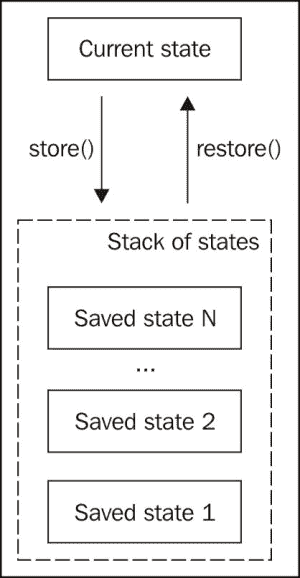
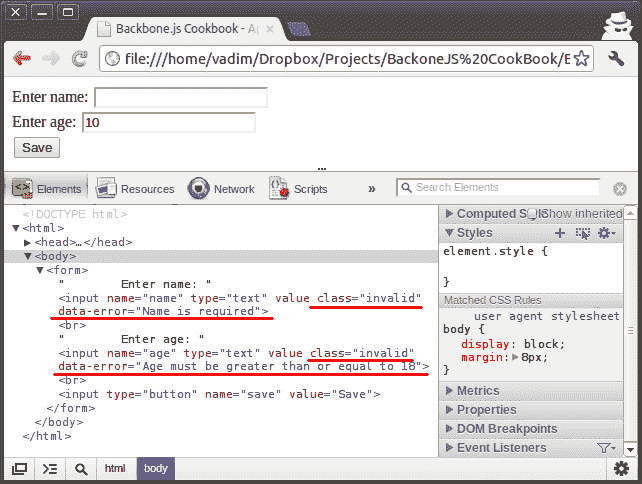

# 第二章. 模型

本章将涵盖以下内容：

+   创建模型

+   操作模型属性

+   操作模型标识符

+   验证模型属性

+   覆盖获取器和设置器

+   创建撤销点以存储/恢复模型的状态

+   实现模型的工作流程

+   在模型中使用高级验证

+   验证 HTML 表单

+   在模型中处理嵌套属性

+   实现一对一关系

# 简介

在本章中，我们将学习 Backbone 模型的概念以及如何使用它。我们还将考虑各种 Backbone 扩展，它们提供了许多改进，并为我们的模型带来了惊人的功能。

本章的前三个菜谱包含了对 Backbone 不熟悉的初学者的信息；其他菜谱提供了额外的价值，并涵盖了更多高级主题。

# 创建模型

模型是任何 MVC 应用程序的基本构建块，它包含数据、提供验证、执行访问控制和实现应用程序所需的具体业务逻辑。在 `Backbone.js` 中，模型通过从 `Backbone.Model` 对象扩展其实例来定义。在本菜谱中，我们将学习如何在 `Backbone.js` 中处理模型。

## 如何操作...

执行以下步骤以定义新的模型对象并创建其实例：

1.  通过扩展 `Backbone.Model` 定义模型。

    ```js
      var InvoiceItemModel = Backbone.Model.extend({

      });
    ```

    在模型对象内部不需要定义数据结构，因为 Backbone 允许在初始化模型时动态定义。

1.  创建一个 `Backbone.Model` 实例，并用属性值初始化它。

    ```js
      var invoiceItemModel = new InvoiceItemModel({
        date: '2013-04-24',
        description: 'Wooden Toy House',
        price: 22,
        quantity: 3
      });
    ```

## 更多...

在本节中，我们将学习如何克隆模型以及如何使用默认值初始化模型。

### 模型的克隆

当你将一个模型分配给另一个变量时，它使得一个模型反映另一个模型的变化。如果你需要一个模型的独立副本，请使用 `clone()` 方法。

```js
newModel = invoiceItemModel.clone();
```

### 设置默认属性值

有时候，你可能希望模型在创建新的模型实例时具有默认值初始化的属性，这样你就不需要手动设置它们。以下是定义默认属性的方法：

```js
  var InvoiceItemModel = Backbone.Model.extend({

    // Define default attributes.
    defaults: {
      date: '',
      description: '',
      price: 0,
      quantity: 1
    },
  });
```

以下示例显示 `quantity` 和 `date` 属性默认被初始化：

```js
  var invoiceItemModel2 = new InvoiceItemModel({
    description: 'Farm Animal Set',
    price: 17
  });

  invoiceItemModel2.get('date') != undefined; // true
  invoiceItemModel2.get('quantity'); // 1
```

### 使用多行表达式设置默认属性值

如果你想要使用多行表达式设置默认值，你可以将其包装在一个函数中，并在设置 `defaults` 中的默认属性时调用它。

```js
  // Create new model object
  var InvoiceItemModel = Backbone.Model.extend({

    // Set default attributes.
      defaults: {
        description: '',
        price: 0,
        quantity: 1,

    // Use function for multiline expression.
        date: function() {
          var date = new Date();

        // Return attribute value.
          return date.toISOString();
        }
      }
    });
```

同样，也可以在 `initialize()` 方法中实现相同的功能，该方法在模型对象创建并初始化后立即调用。

```js
  // Crate new model
  var InvoiceItemModel = Backbone.Model.extend({

    // Set default values.
    defaults: {
      description: '',
      price: 0,
      quantity: 1,
    },

    // Set default values in initialize method.
    // Following method is run after the object is created.
    initialize: function() {

      // Check that attribute is not initialized yet.
        if (!this.has('date')) {
          var date = new Date();

        // Set attribute value.
          this.set('date', date.toISOString());
        }
      }
    }
```

在 `initialize()` 方法中，我们使用 JavaScript 的 `Date` 对象将 `date` 属性设置为今天的日期。在这样做之前，我们需要检查 `date` 属性尚未初始化，这样我们就不覆盖它了。

### 小贴士

如果默认属性被定义，那么它们可以覆盖在 `initialize()` 方法中定义的属性，因此我们需要从 `default` 值中删除这些属性，否则它们将作为默认值初始化。

## 参见

+   在当前的食谱示例中，我们使用了 `has()` 和 `set()` 方法，这些方法在以下食谱中有描述：*操作模型属性*

# 操作模型属性

属性是模型存储所有数据的地方。与用于存储内部对象信息的模型属性不同，属性不能通过 `.` 操作符访问。有一些特殊的方法可以用来操作它们，我们将在本食谱中学习。

## 如何做...

与模型属性一起工作的主要方法有 `get()`、`set()`、`unset()` 和 `clear()`。

1.  使用 `get()` 方法获取属性值。

    ```js
    var quantity = invoiceItemModel.get('quantity');
    ```

    如果找不到属性，则返回 `undefined`。

1.  使用 `set()` 方法来更新/创建单个属性值。

    ```js
    invoiceItemModel.set('quantity', 5);
    ```

    +   要更新多个属性，请使用键值格式。

        ```js
            invoiceItemModel.set({
              quantity: 5,
              price: 10
            });
        ```

    当设置一个属性如果它不存在时，会创建一个。如果验证没有失败，`set()` 方法返回一个值 `true` 的引用到模型；否则返回值 `false`。我们将在食谱中了解更多关于验证的信息，*验证模型属性*。

1.  使用 `unset()` 方法从模型中删除一个属性。

    ```js
    invoiceItemModel.unset('quantity');
    ```

1.  使用 `clear()` 方法从模型中删除所有属性。

    ```js
    invoiceItemModel.clear();
    ```

## 它是如何工作的...

属性存储在 `attributes` 属性中。最好不要直接访问属性，而应使用我们之前学过的方法；否则，可能会破坏事件触发机制或与其他 Backbone 扩展的集成。

当一个新的模块初始化时，`defaults` 属性的值被分配给 `attributes`。

## 还有更多...

在本节中，我们将学习一些与模型属性一起使用的有用方法。

### 检查模型是否有属性

要检查模型是否有属性，请使用 `has()` 方法。如果属性存在，则返回 `true`，否则返回 `false`。

```js
if (!invoiceItemModel.has('quantity')) {
  console.log('Quantity attribute does not exists!')
}
```

### 获取 HTML 转义属性值

如果你打算显示用户输入的文本，你假设它是纯文本格式，你应该担心安全问题。防止可能导致可能的 XSS 攻击的最佳方式是在输出任何用户输入的文本之前使用 `escape()` 方法。这阻止浏览器通过转义 HTML 字符来解析任何 HTML 代码。让我们看看它是如何工作的：

```js
  var hacker = new Backbone.Model({
    name: "<script>alert('xss')</script>"
  });
  var escaped_name = hacker.escape('name');
  // &lt;script&gt;alert('xss')&lt;/script&gt;
```

# 操作模型标识符

每个模型都有一个唯一的标识符属性 ID，这允许区分一个模型和另一个模型。当开发 Backbone 应用程序时，通常需要操作标识符。

## 如何做...

以下步骤解释了如何设置和获取 `id` 属性：

1.  设置和获取 `id` 属性非常简单。

    ```js
      invoiceItemModel.id = Math.random().toString(36).substr(2);
    ```

    获取 id 属性如下所示：

    ```js
      var id = invoiceItemModel.id;
    ```

## 它是如何工作的...

`id` 属性提供了直接访问存储标识符的属性。默认情况下它是 `id`；然而，在扩展模型时，你可以通过设置 `idAttribute` 来覆盖它。

```js
  var Meal = Backbone.Model.extend({
    idAttribute: "_id"
  });
```

当创建新的模型时，除非手动分配，否则标识符为空。

## 还有更多...

如果你的模型中 `id` 尚未初始化，则可以使用客户端标识符，该标识符可以通过 `cid` 属性访问。`cid` 的值是唯一的，并在创建新的模型实例时自动分配。客户端标识符可以采用如 `c0`、`c1`、`c2` 等形式。

# 验证模型属性

为了防止意外行为，我们通常需要验证模型属性。

## 如何做到...

执行以下步骤以设置属性验证：

1.  可以通过定义 `validate()` 方法来进行验证。

    ```js
      var InvoiceItemModel = Backbone.Model.extend({

        // Define validation criteria.
        validate: function(attrs) {
          if (attrs.quantity <= 0) {
            return "quantity can't be negative or equal to zero";
          }
        }
      });
    ```

    `attrs` 参数包含已更改的属性值。如果它们未通过验证，`validate()` 方法将返回错误信息。

1.  属性验证在 `save()` 方法上触发。如果传递 `{validate: true}` 作为最后一个参数，它也可以在 `set()` 方法上触发。

    ```js
      var invoiceItemModel = new InvoiceItemModel({
        description: 'Wooden Toy House',
        price: 10
      });

        // Set value that is not valid.
        invoiceItemModel.set('quantity', -1, {validate: true});
    ```

    ### 小贴士

    当验证模型时，你可以通过 `this.get()` 或 `this.attributes` 的帮助访问旧属性值。

## 它是如何工作的...

`validate` 在 `save()` 之前被调用，并接受从 `save()` 传递的更新后的模型属性。如果 `validate()` 返回错误字符串，`save()` 将不会继续，并且模型属性将不会被修改。失败的验证会触发 `invalid` 事件。如果你想在 `set()` 方法中触发验证，请将 `{validate: true}` 作为最后一个参数传递。

## 还有更多...

在本节中，我们将更深入地研究验证的细节。

### 处理验证错误

如果模型没有通过验证，我们通常需要继续运行应用程序并提供自定义代码来处理事件。让我们看看它是如何完成的。

```js
  invoiceItemModel.on("invalid", function(model, error) {
    console.log(error);
  });
```

这样的错误处理程序应该在触发验证事件之前绑定。

另一种处理事件的方法允许我们将错误处理函数作为选项传递给 `set()`、`fetch()`、`save()` 或 `destroy()` 方法。

```js
  var invoiceItemModel2 = new InvoiceItemModel({
    description: 'Animal Farm',
    price: 17
  });
    invoiceItemModel2.set({quantity: 0}, {
      invalid: function(model, error) {
        console.log(error);
      },
      validate: true
    });
```

### 手动触发验证

虽然验证在每次模型更新或保存到存储时都会执行，但有时你可能想手动检查模型是否通过验证。让我们弄清楚如何做到这一点。

```js
  var invoiceItemModel3 = new InvoiceItemModel({
    description: 'Wooden Toy House',
    price: 10,
    quantity: -5
  });
    invoiceItemModel3.isValid(); // false
```

`isValid()` 返回 true 或 false，但不会触发 `invalid` 事件。

## 参考内容

+   *在第五章中处理 Backbone 对象的事件*，*事件和绑定*

# 覆盖获取器和设置器

有时需要覆盖应用程序中的获取器或设置器。这样做可能有不同的原因：

+   一个属性以不同于输入或输出的格式存储

+   你有一个虚拟属性，它不在模型中存储，但依赖于其他属性

+   防止将非法值分配给属性

默认情况下，Backbone 不允许用户覆盖获取器或设置器，但有一个名为 `Backbone.Mutators` 的扩展，允许这样做。

## 准备工作

从 **GitHub** 页面 [`github.com/asciidisco/Backbone.Mutators`](https://github.com/asciidisco/Backbone.Mutators) 可以下载 `Backbone.Mutators`。

要将此扩展包含到项目中，将 `backbone.mutators.js` 文件保存到 `lib` 文件夹，并在 `index.html` 中包含对其的引用。

### 注意

在 第一章 的 *使用插件扩展应用程序* 菜单中，详细描述了如何在项目中包含 Backbone 扩展。

## 如何做到这一点...

我们可以为不存在的虚拟属性指定获取器或设置器。在某些情况下这可能很有用，例如，如果虚拟属性依赖于其他属性。

1.  通过覆盖获取器来引入一个新的虚拟属性。

    ```js
      var BuyerModel = Backbone.Model.extend({

        // Use mutators
        mutators: {

        // Introduce virtual attribute.
          fullName: {
            get: function () {
              return this.firstName + ' ' + this.lastName;
            }
          }
        }
      });
    ```

    在模型对象中，我们定义了一个新的 `mutators` 属性，为名为 `fullName` 的新虚拟属性提供了获取器。这个属性不假定存储在模型中，因为它包含现有属性 `firstName` 和 `lastName` 的值。现在，让我们看看我们如何使用覆盖的获取器。

    ```js
      var buyerModel = new BuyerModel();
      buyerModel.set({
        firstName: 'John',
        lastName: 'Smith'
      });

        buyerModel.get('fullName'); // John Smith
        buyerModel.get('firstName'); // John
        buyerModel.get('lastName'); // Smith
    ```

1.  覆盖设置器，这样虚拟属性实际上不会在模型中保存，而是更新其他属性。

    ```js
      var BuyerModel = Backbone.Model.extend({

        // Use mutators
        mutators: {

          // Introduce virtual attribute.
          fullName: {
            set: function (key, value, options, set) {
              var names = value.split(' ');
              this.set('firstName', names[0], options);
              this.set('lastName', names[1], options);
            }
          }
        }
      });
    ```

    在 `fullName` 属性的设置器中，我们将值分割成一个数组，然后将 `firstName` 和 `lastName` 属性分配给它的部分。以下是一个示例，演示了如何使用它：

    ```js
        var buyerModel2 = new BuyerModel()
        buyerModel2.set('fullName', 'Joe Bloggs');

        buyerModel2.get('fullName'); // Joe Bloggs
        buyerModel2.get('firstName'); // Joe
        buyerModel2.get('lastName'); // Bloggs
    ```

### 小贴士

**使用 set() 方法初始化属性**

如果你为属性使用设置器突变器，触发它的唯一方法是调用 `set()` 方法。如果你在创建新模型时分配属性，设置器突变器将不会工作，因为在这种情况下不会触发 `change` 事件。否则，你需要为特定属性触发 `change` 事件。

## 它是如何工作的...

`Backbone.Mutators` 扩展覆盖了 `Bakcbone.Model` 的 `get()` 和 `set()` 方法。新方法尝试调用被覆盖的获取器和设置器。如果没有，则运行原始的 `get()` 或 `set()` 方法。

它还覆盖了 `toJSON()` 方法，并替换了被覆盖获取器的属性。

## 更多内容...

在本节中，我们将学习 `Backbone.Mutators` 扩展的高级用法。

### 覆盖现有属性的获取器和设置器

如果需要将属性以不同于输出或输入的格式存储，可以覆盖现有属性的设置器。可以覆盖此属性的获取器和设置器以解决这个问题。让我们看看如何使用 `Backbone.Mutators` 为现有属性：

```js
  var BuyerModel = Backbone.Model.extend({

    // Use mutators.
    mutators: {

      // Override existing attribute.
      vip: {
        get: function() {
          return this.vip === true ? 'VIP' : 'Regular';
        },
        set: function (key, value, options, set) {
          set(key, value === 'VIP', options);
        }
      }
    }
  });
```

在此模型中，存在一个 `vip` 属性，它是 `boolean` 类型的。我们希望这个属性以字符串形式呈现给用户，因此我们将覆盖它的获取器和设置器。

使用语法与常规属性相同。

```js
    var buyerModel3 = new BuyerModel();
    buyerModel2.set({
      fullName: 'Mister X',
      vip: 'VIP'
    });

    buyerModel2.get('vip'); // VIP
    buyerModel2.attributes.vip; // true
```

### 小贴士

Mutators 旨在覆盖设置器或获取器，但它们本身不修改属性值。您可以通过访问模型的`attributes`属性来始终获取原始属性。

### 处理 mutators 事件

您可以将回调绑定到`mutators:set:*`事件。以下是实现方式：

```js
    buyerModel3.on('mutators:set:fullName',
      function (a, b, c, d) {
        console.log('mutators:set:fullName is triggered');
    });

    buyerModel3.set({
      fullName: 'Mister Y'
    });
```

## 参见

+   在第五章中*处理 Backbone 对象的事件*，*事件和绑定*

# 创建撤销点以存储/恢复模型的状态

有时，您可能需要在应用程序中管理模型的状态。在以下情况下这可能很有用：

+   您的应用需要撤销/重做功能

+   您想实现事务

+   您的应用模拟某些过程

+   您想临时更改模型然后恢复它

通常，对于所有上述情况，开发者经常使用`Memento`模式。在 Backbone 中有一个此模式的实现，可在`Backbone.Memento`扩展中找到。此扩展允许开发者存储或恢复模型的状态，并提供一个用于操作多个状态的栈。

## 准备工作

您可以从**GitHub**页面[`github.com/derickbailey/backbone.memento`](https://github.com/derickbailey/backbone.memento)下载`Backbone.Memento`扩展。要将此扩展包含到您的项目中，请将`backbone.memento.js`文件保存到`lib`文件夹中，并在`index.html`中包含对其的引用。

### 注意

在第一章中详细描述了将 Backbone 扩展包含到您的项目中，*理解 Backbone*的*扩展应用程序与插件*配方。

## 如何实现...

执行以下步骤以操作模型状态：

1.  在`initialize()`方法中扩展模型以使用`Backbone.Memento`扩展。

    ```js
      var InvoiceItemModel = Backbone.Model.extend({

        // Extend model instance with memento instance.
        initialize: function() {
          _.extend(this, new Backbone.Memento(this));
        }
      });
    ```

1.  创建模型实例并用值初始化它。

    ```js
      var invoiceItemModel = new InvoiceItemModel();
      invoiceItemModel.set('price', 10);
    ```

1.  使用`store()`方法保存状态。

    ```js
      invoiceItemModel.store();
    ```

1.  更新模型以使用临时值。

    ```js
      invoiceItemModel.set('price', 20);
    ```

1.  使用`restore()`方法检索之前保存的状态。

    ```js
      invoiceItemModel.restore();
    ```

1.  获取保存状态中的模型值。

    ```js
      invoiceItemModel.get('price'); // 10
    ```

## 它是如何工作的...

Memento 使用**LIFO**（**后进先出**）数据结构，也称为栈，用于存储模型状态。因此，可以多次保存模型状态，然后以反向顺序恢复它们。以下图表显示了它是如何工作的：



每次调用`store()`方法时，状态都会被保存在栈顶。每次调用`restore()`方法时，最后保存的状态将被恢复并从栈顶删除。

## 更多...

在本节中，我们将了解 Memento 的高级功能。

### 使用 Memento 栈工作

下面是一个示例，演示如何处理这样的状态栈：

```js
    // States stack demo.
    var invoiceItemModel2 = new InvoiceItemModel();
    invoiceItemModel2.set('price', 10);

    // Save state and update value.
    invoiceItemModel2.store();
    invoiceItemModel2.set('price', 20);

    // Save state and update value.
    invoiceItemModel2.store();
    invoiceItemModel2.set('price', 30);

    // Restore last state and get value.
    invoiceItemModel2.restore();
    invoiceItemModel2.get('price'); // 20

    // Restore last state and get value.
    invoiceItemModel2.restore();
    invoiceItemModel2.get('price'); // 10
```

如前述代码所示，处理栈相当简单。

### 从栈中的第一个状态恢复

有时，需要将模型重置为最初在堆栈中保存的状态，无论之后保存了多少状态。这可以通过使用`restart()`方法来完成。

```js
    invoiceItemModel3.restart();
```

### 忽略被恢复的属性

在`Backbone.Memento`中有一个有趣的功能，允许你忽略一些模型属性不被保存或恢复。如果一个模型包含一些技术属性，这些属性不是作为状态的一部分使用，这个功能就非常有用。当在`initialize()`方法中扩展模型时，将需要忽略的属性传递给`ignore`选项。

```js
  var AnotherInvoiceItemModel = Backbone.Model.extend({

    // Extend model instance with memento instance.
    // Ignore restoring of description attribute.
    initialize: function() {
      _.extend(this, new Backbone.Memento(
        this, {ignore: ["description"]}
      ));
    }
  });
```

### 与集合一起工作

Memento 扩展还允许扩展集合以具有 Memento 功能。它在处理集合时提供相同的方法：`store()`、`restore()`和`restart()`。

## 参见

+   还有一个名为`Backbone.actAs.Mementoable`的扩展，它以更准确的方式实现了 Memento 模式，因为它使用单独的对象来存储状态。它更灵活，但默认不提供堆栈，并且不能忽略特定属性被保存/恢复。

+   `Backbone.actAs.Mementoable`可以从**GitHub**页面[`github.com/iVariable/Backbone.actAs.Mementoable`](https://github.com/iVariable/Backbone.actAs.Mementoable)下载。

+   你可以在第三章 *集合* 中了解更多关于与集合一起工作的内容。

# 实现模型的流程

如果你正在实现一个业务逻辑，该逻辑假设模型可以处于不同的状态，并且对状态变化有特殊的规则，你应该使用`workflow.js`扩展，这对于构建此类功能非常有帮助。

## 准备工作

你可以从 GitHub 页面[`github.com/kendagriff/workflow.js`](https://github.com/kendagriff/workflow.js)下载`workflow.js`扩展。要将此扩展包含到你的项目中，将`workflow.js`文件保存到`lib`文件夹中，并在`index.html`中包含对其的引用。

### 注意

在第一章 *理解 Backbone* 的“通过插件扩展应用程序”配方中详细描述了如何将 Backbone 扩展包含到你的项目中。

## 如何做...

让我们为`InvoiceModel`创建一个流程，因为它有一个`status`属性，它表示模型状态，非常适合作为流程示例。

1.  绘制状态和可能转换的图。

    可用的状态有草稿、已发行、已支付和已取消。还有一些允许一个状态变为另一个状态的转换。如果没有合适的转换，则这种变化是不可能的。

1.  在代码中定义`workflow`。

    ```js
      var InvoiceModel = Backbone.Model.extend({

        // Define workflow states.
        workflow: {

          // Define initial state.
          initial: 'draft',

          // Define state transitions.
          events: [
            { name: 'issue', from: 'draft', to: 'issued' },
            { name: 'payout', from: 'issued', to: 'paid' },
            { name: 'cancel', from: 'draft', to: 'canceled' },
            { name: 'cancel', from: 'issued', to: 'canceled' },
          ]
        },

        initialize: function() {
          // Extend model instance with workflow instance.
          // Set attribute name which contains status.
          _.extend(this,
            new Backbone.Workflow(this, {attrName: 'status'})
          );
        }
      });
    ```

    如我们所见，有一个新的`workflow`属性，它描述了我们的流程。转换定义在一个数组中，该数组被分配给`events`属性。

    转换数组中的每个元素都应该包含转换名称、起始状态和目标状态。模型初始状态应在 `initial` 属性中定义。

    在前面的示例中，在 `initialize()` 方法中，我们通过 `Backbone.Workflow` 对象的实例扩展了我们的模型对象，并将状态属性名称 (`attrName`) 作为选项传递，其中包含 `'status'` 而不是默认值 `'workflow_state'`。

1.  通过调用 `triggerEvent()` 方法触发工作流转换。

    ```js
        var invoiceModel = new InvoiceModel();
        invoiceModel.get('status'); // draft

        invoiceModel.triggerEvent('issue');
        invoiceModel.get('status'); // issued

        invoiceModel.triggerEvent('payout');
        invoiceModel.get('status') // paid
    ```

    如前述代码所示，`triggerEvent()` 接受一个参数，即转换名称。如果触发了不适当的转换，则会抛出异常。

## 它是如何工作的...

`Workflow.js` 扩展是用 **CoffeeScript** 编写的，并且很容易理解。它只提供了 `triggerEvent()` 方法，该方法切换 `workflow` 属性并触发事件。

## 更多内容...

在本节中，我们将学习如何处理转换事件。

### 绑定回调到转换事件

有时，你可能想在特定转换被触发时执行代码。在这种情况下，你需要将回调函数绑定到转换事件。如果正在触发事件，则执行此回调。

`Workflow.js` 提供了两种类型的事件 `transition:from:*` 和 `transition:to:*`。第一种事件在工作流失去特定状态时触发，第二种事件在工作流达到特定状态时触发。让我们为我们的模型定义事件绑定。

```js
  var InvoiceModel = Backbone.Model.extend({

    // Define workflow states.
    // [workflow definition goes here]

    initialize: function() {
      // Extend model instance with workflow instance.
      // Set attribute name which contains status.
      _.extend(this,
        new Backbone.Workflow(this, {attrName: 'status'})
      );

      // Bind reaction on event when status changes from
      // draft to any.
      this.bind('transition:from:draft', function() {
        this.set('createdDate', new Date().toISOString());
      });

      // Bind reaction on event when status changes
      // from any to paid.
      this.bind('transition:to:paid, function() {
        this.set('payoutDate', new Date().toISOString());
      });
    }
  });
```

在前面的示例中，我们绑定了一些回调函数，当适当的事件被触发时，这些回调函数会更新日期属性。

下面的代码片段是一个示例，演示了当工作流事件被触发时会发生什么。

```js
    var invoiceModel = new InvoiceModel();
    invoiceModel.get('status'); // draft

    invoiceModel.triggerEvent('issue');
    invoiceModel.get('status'); // issued
    invoiceModel.get('createdDate');
    // 2012-05-01T12:00:10.234Z

    invoiceModel.triggerEvent('payout');
    invoiceModel.get('status') // paid
    invoiceModel.get('payoutDate');
    // 2012-05-01T12:00:10.238Z
```

### 小贴士

**始终在改变状态时使用 triggerEvent() 方法**

只有当事件由 `triggerEvent()` 方法触发时，事件回调才会执行。这就是为什么当对象被初始化或者使用 `set()` 方法更新工作流状态时，事件回调不会执行。

## 参见

+   在 第五章 *事件和绑定* 中 *处理 Backbone 对象的事件*

# 在模型中使用高级验证

默认情况下，Backbone 提供了一种简单的方法来使用 `validate()` 方法验证模型属性，这允许你创建自己的验证函数，但与使用现有解决方案相比，这可能会花费开发者更多的时间。

## 准备工作

你为什么不使用另一个名为 `Backbone.Validation` 的 Backbone 扩展来节省时间，它提供了许多功能，并允许重用现有的验证器。它可以从 **GitHub** 页面 [`github.com/thedersen/backbone.validation`](https://github.com/thedersen/backbone.validation) 下载。

要将此扩展包含到你的项目中，将 `backbone-validation.js` 文件保存到 `lib` 文件夹中，并在 `index.html` 中包含对其的引用。

### 注意

在第一章的*通过插件扩展应用*食谱中详细描述了将 Backbone 扩展包含到你的项目中。

## 如何做到这一点...

执行以下步骤以设置模型的验证标准：

1.  使用`Backbone.Validation.mixin`扩展`Backbone.object()`。

    ```js
      _.extend(Backbone.Model.prototype, Backbone.Validation.mixin);
    ```

    ### 注意

    在第八章的*使用 mixins 与 Backbone 对象*食谱中可以找到更多关于 mixins 的信息，*特殊技术*。

1.  在`validation`属性中定义验证标准。

    ```js
      var BuyerModel = Backbone.Model.extend({

        // Defining a validation criteria.
        validation: {
          name: {
            required: true
          },
          email: {
            pattern: 'email'
          }
        }
      });
    ```

## 它是如何工作的...

`Backbone.Validation`扩展覆盖了`Backbone.Model`的`validate()`方法，因此我们仍然可以像往常一样调用`validate()`和`isValid()`方法，并且当模型更新时，验证会自动执行。让我们看看这个例子。

```js
    var buyerModel = new BuyerModel();

    // Set attribute values which do not validate.
    buyerModel.set({
      email: 'http://example.com'
    }, {validate: true});

    // Check if model is valid.
    buyerModel.isValid(); // false
    buyerModel.get('email'); // undefined
```

## 还有更多...

在本节中，我们将学习更多关于内置验证器的知识。

### 使用内置验证器

在上一个示例中，我们重用了现有的验证器，例如`required`和`pattern`。它们被称为内置验证器。在本食谱中，我们将学习如何使用它们的所有功能。

+   **required**: 它验证属性是否必需。它可以等于 true 或 false。

    ```js
      var BuyerModel = Backbone.Model.extend({
        validation: {
          name: {
            required: true
          },
        }
      });
    ```

+   **acceptance**: 它验证是否必须接受某些内容，例如使用条款。它检查属性值是否为 true 或 false。它与`boolean`属性一起工作。

    ```js
       var UserRegistrationModel = Backbone.Model.extend({
        validation: {
          terms: {
            acceptance: true
          },
        }
      });
    ```

+   **min**: 它验证属性值必须是一个数字，并且等于或大于指定的最小值。

    ```js
      var BuyerModel = Backbone.Model.extend({
        validation: {
          age: {
            min: 18
          },
        }
      });
    ```

+   **max**: 它验证属性值必须是一个数字，并且等于或小于指定的最大值。

    ```js
      var EventRegistrationModel = Backbone.Model.extend({
        validation: {
          guests: {
            max: 2
          },
        }
      });
    ```

+   **range**: 它验证属性值必须是一个数字，并且等于或介于指定的两个数字之间。

    ```js
      var ChildTicketModel = Backbone.Model.extend({
        validation: {
          age: {
            range: [2, 12]
          },
        }
      });
    ```

+   **长度**: 它验证属性值必须是一个字符串，其长度等于指定的长度值。

    ```js
      var AddressModel = Backbone.Model.extend({
        validation: {
          zip: {
            length: 5
          },
        }
      });
    ```

+   **minLength**: 它验证属性值必须是一个字符串，其长度等于或大于指定的最小长度值。

    ```js
      var UserModel = Backbone.Model.extend({
        validation: {
          password: {
            minLength: 8
          },
        }
      });
    ```

+   **maxLength**: 它验证属性值必须是一个字符串，其长度等于或小于指定的最大长度值。

    ```js
      var UserModel = Backbone.Model.extend({
        validation: {
          password: {
            maxLength: 8
          },
        }
      });
    ```

+   **rangeLength**: 它验证属性值必须是一个字符串，并且等于或介于指定的两个数字之间。

    ```js
      var BuyerModel = Backbone.Model.extend({
        validation: {
          phoneNumber: {
            rangeLength: [10, 12]
          },
        }
      });
    ```

+   **oneOf**: 它验证属性值必须等于指定数组中的某个元素。它使用区分大小写的匹配。

    ```js
      var BuyerModel = Backbone.Model.extend({
        validation: {
          type: {
            oneOf: [''person'', ''organization'']
          },
        }
      });
    ```

+   **equalTo**: 它验证属性值必须等于指定名称的属性的值。

    ```js
      var UserModel = Backbone.Model.extend({
        validation: {
          password: {
            required: true
          },
          passwordRepeat: {
            equalTo: 'password'
          }
        }
      });
    ```

+   **pattern**: 它验证属性值必须匹配指定的模式。它可以是一个正则表达式，或者内置模式之一的名字。

    ```js
    var BuyerModel = Backbone.Model.extend({
      validation: {
        email: {
          pattern: 'email'
        }
      }
    });
    ```

    模式可以接受以下属性值之一：

    +   **number**: 匹配任何十进制数字

    +   **digits**: 匹配任何数字序列

    +   **email**: 匹配有效的电子邮件地址

    +   **url**: 匹配任何有效的 URL

    您也可以指定任何正则表达式。

    ```js
    var BuyerModel = Backbone.Model.extend({
      validation: {
        phoneNumber: {
          pattern: /^(\+\d)*\s*(\(\d{3}\)\s*)*\d{3}(-{0,1}|\s{0,1})\d{2}(-{0,1}|\s{0,1})\d{2}$/
        }
      }
    });
    ```

## 参见

+   在这个菜谱中，我们学习了`Backbone.Validation`扩展的基础知识，尽管还有更多技术可以在**GitHub**文档页面[`github.com/thedersen/backbone.validation`](https://github.com/thedersen/backbone.validation)上找到。

+   `Backbone.Validation`还有一些替代方案。它们是`Backbone.validations`和`Backbone.Validator`扩展。它们都非常相似，但`Backbone.Validation`有更好的文档，并提供更多方法和事件。

# 验证 HTML 表单

大多数网络应用程序使用 HTML 表单进行数据输入，Backbone 也不例外。应用程序应该让用户了解任何验证错误。此类功能的实现可能落在开发者的肩上，但不是在 Backbone 中！

幸运的是，`Backbone.Validation`提供了与视图的集成，并且与 HTML 表单配合良好。

## 准备工作

确保您已安装`Backbone.Validation`扩展。安装方法在之前的菜谱*在模型中使用高级验证*中描述。

## 如何操作...

执行以下步骤以验证表单：

要允许表单验证，我们需要在视图的`initialize()`方法中将视图绑定到`Backbone.Validation`对象。

```js
Backbone.Validation.bind(this);
```

`Backbone.Validation`假设您的模型存储在`this.model`中，并且您已经实现了从表单元素获取数据并使用它更新模型值。

## 它是如何工作的...

如果用户输入的信息无法验证，那么`Backbone.Validation`会将`invalid`类添加到适当的表单元素中，并使用错误消息设置`data-error`属性。

### 注意

`data-*`属性是 HTML5 的一个特性。它们可以通过 CSS3 或自定义 JavaScript 轻松显示。它们也受到主要前端框架的支持，如 jQueryMobile 或 Twitter Bootstrap。

以下截图说明了`Backbone.Validation`如何验证 HTML 表单中输入的错误数据：



## 还有更多...

以下代码片段是此菜谱示例的完整列表：

```js
(function($){

  // Define new model.
  var BuyerModel = Backbone.Model.extend({
    defaults: {
      name: '',
      age: ''
    },

    // Define validation criteria.
    validation: {
      name: {
        required: true
      },
      age: {
        min: 18
      }
    }
  });

  var BuyerModelFormView = Backbone.View.extend({

    // Bind Backbone.Validation to a view.
    initialize: function(){
      Backbone.Validation.bind(this);
    },

    // Define a template.
    template: _.template('\
      <form>\
        Enter name:\
        <input name="name" type="text" value="<%= name %>"><br>\
        Enter age:\
        <input name="age" type="text" value="<%= age %>"><br>\
        <input type="button" name="save" value="Save">\
      </form>\
    '),

    // Render view.
    render: function(){
      // Render template with model values.
      var html = this.template(this.model.toJSON());

      // Update html.
      $(this.el).html(html);
    },

    // Bind save callback click event.
    events: {
      'click [name~="save"]': 'save'
    },

    // Save callback.
    save: function(){

      // Update model attributes.
      this.model.set({
        name: $('[name~="name"]').val(),
        age: $('[name~="age"]').val()
      });
    }
  });

  $(document).ready(function () {
     // Create new model instance.
     var buyerModel = new BuyerModel();

     // Create new view instance.
     var buyerModelFormView = new BuyerModelFormView({
       model: buyerModel,
       el: 'body'
     });

     // Render view.
     buyerModelFormView.render();
  });
})(jQuery);
```

# 在模型中处理嵌套属性

有时需要嵌套属性来操作存储在模型中的复杂层次结构。这通常是通过使用 JavaScript 对象作为嵌套属性来完成的；然而，这不是 Backbone 的方式。幸运的是，有`Backbone-Nested`扩展，它在使用嵌套属性时提供了各种改进。

## 准备工作

您可以从**GitHub**页面[`github.com/afeld/backbone-nested`](https://github.com/afeld/backbone-nested)下载`Backbone-Nested`扩展。要将此扩展包含到您的项目中，将`backbone-nested.js`文件保存到`lib`文件夹中，并在`index.html`中包含对其的引用。

### 注意

在 第一章 的 *使用插件扩展应用程序* 菜谱中描述了将 Backbone 扩展添加到您的项目中，*详细理解 Backbone*。

## 如何做到...

要在模型中使用嵌套属性，请执行以下步骤：

1.  在扩展新模型时，使用 `Backnone.NestedModel` 作为基础对象。

    ```js
      var BuyerModel = Backbone.NestedModel.extend({

      });
    ```

1.  使用 `Backbone-Nested` 扩展提供的点语法设置嵌套属性值。

    ```js
        buyerModel.set({
          'name.title': 'Mr',
          'name.generation': 'II'
        });
    ```

    您仍然可以使用典型的 JavaScript 对象语法来设置多个值。

    ```js
        buyerModel.set({
          name: {
            first: 'John',
            last: 'Smith',
            middle: {
              initial: 'P',
              full: 'Peter'
            }
          }
        });
    ```

1.  使用点语法获取属性值。

    ```js
        buyerModel.get('name.middle.full'); // Peter
        buyerModel.get('name.middle');
        // { full: 'Peter', initial: 'P }
        buyerModel.get('name.title'); // Mr
    ```

## 它是如何工作的...

`Backbone-Nested` 扩展基于 `Backbone.Model` 提供了一个新的模型对象 `Backbone.NestedModel`。它覆盖了现有方法，如 `get()`、`set()`、`has()`、`toJSON` 等。它还提供了新的 `add()` 和 `remove()` 方法。

## 还有更多...

本节描述了 `Backbone-Nested` 扩展的高级用法。

### 使用嵌套属性数组进行操作

当然，还有处理更复杂结构（如嵌套属性数组）的方法。您也可以使用对象语法来设置它。

```js
    buyerModel.set({
      'addresses': [
        {city: 'Brooklyn', state: 'NY'},
        {city: 'Oak Park', state: 'IL'}
      ]
    });
```

或者，您可以使用点和中括号语法在嵌套数组中设置属性，如下面的示例所示：

```js
    buyerModel.set({
      'addresses[1].state': 'MI'
    });
```

并且相同的语法也用于从嵌套数组中获取属性。

```js
    buyerModel.get('addresses[0].state'); // NY
    buyerModel.get('addresses[1].state'); // MI
```

### 向/从嵌套数组中添加/删除元素

`Backbone-Nested` 提供了处理嵌套数组的一些额外方法。`add` 方法可以向嵌套数组中添加新元素。以下是它的工作方式。

```js
    buyerModel.add('addresses', {
      city: 'Seattle',
      state: 'WA'
    });

    buyerModel.get('addresses[2]');
    // { city: 'Seattle', state: 'WA' }
```

`remove()` 方法从嵌套数组中删除所需的元素。让我们看看它是如何完成的。

```js
    buyerModel.remove('addresses[1]');

    buyerModel.get('addresses').length; // 2
```

### 将回调绑定到事件

当将回调绑定到事件时，您可以使用之前描述的相同的点和中括号语法。让我们看看以下将回调绑定到事件的示例：

```js
    buyerModel.bind('change:addresses[0].city', function(model, value){
      console.log(value);
    });

    buyerModel.set('addresses[0].city', 'Chicago');
```

此外，`Backbone-Nested` 还提供了额外的 `add:*` 和 `remove:*` 事件来处理数组更新事件。

## 参见

+   在 第五章 的 *处理 Backbone 对象的事件* 菜谱中可以找到更多关于事件处理的信息，*事件和绑定*。

+   `Backbone-Nested` 扩展有一些替代方案，例如 `Backbone-deep-model` 和 `Backbone-dotattr`。它们都非常相似，但 `Backbone-Nested` 提供了更多功能，并且维护得更好。

# 实现一对一关系

在任何应用程序中，我们可能都需要具有相互关联的模型。例如，博客文章模型可以与其作者的模型或评论模型相关联。

在处理博客文章时，我们可能还需要快速访问评论，或者列出特定作者的博客文章列表。此外，我们可能希望以单个 JSON 格式导出包含作者信息和评论的博客文章。

在 Backbone 应用程序中，这可以通过 `Backbone-relational` 扩展来实现。

## 准备工作

您可以从 **GitHub** 页面 [`github.com/PaulUithol/Backbone-relational`](https://github.com/PaulUithol/Backbone-relational) 下载 `Backbone-relational` 扩展。要将 `Backbone-relational` 包含到您的项目中，将 `backbone-relational.js` 文件保存到 `lib` 文件夹，并在 `index.html` 中包含对其的引用。

### 注意

在 第一章 的 *使用插件扩展应用程序* 菜单中详细描述了将 Backbone 扩展包含到您的项目中。

## 如何实现...

让我们回顾我们的发票应用程序，并尝试找出我们如何在其中应用一对一关系。假设我们希望买家登录应用程序并查看分配给他们的所有发票。

在这种情况下，我们需要将买家凭证存储在某个地方。这可以是一个与现有 `BuyerModel` 关联的新 `UserModel`。我们知道每个用户对应一个买家，反之亦然，所以我们处理的是一对一关系。让我们实现这样一个一对一关系。

1.  从 `Backbone.RelationalModel` 扩展模型，并传递带有关系定义的 `relations` 属性。

    ```js
      // Define new model object.
      var UserModel = Backbone.RelationalModel.extend({

      });

      // Define new model object.
      var BuyerModel = Backbone.RelationalModel.extend({

        // Define one-to-one relationship.
        relations: [
          {
             // Relationship type
             type: Backbone.HasOne,

             // Relationship key in BuyerModel.
             key: 'user',

             // Related model.
             relatedModel: UserModel,

             // Define reverse relationship.
             reverseRelation: {
               type: Backbone.HasOne,
               key: 'buyer'
             }
          }
        ]
      });
    ```

    如前例所示，`relations` 属性接受一个数组，因此可能存在多个关系。

    ### 小贴士

    注意，`UserModel` 应该在 `BuyerModel` 之前定义，因为它在代码中之后被引用（在 `BuyerModel` 的 `relations` 属性中）。

1.  通过在 `BuyerModel` 实例中引用 `UserModel` 实例或反之亦然来初始化一对一关系。

    ```js
        var userModel1 = new UserModel({
          login: 'jsmith',
          email: 'jsmith@example.com'
        });

        var buyerModel1 = new BuyerModel({
          firstName: 'John',
          lastName: 'Smith',
          user: userModel1
        });
    ```

    在创建 `BuyerModel` 和 `UserModel` 时，也可以通过传递单个输入 JSON 来实现相同的效果。

    ```js
        var buyerModel = new BuyerModel({
          firstName: 'John',
          lastName: 'Smith',
          user: {
            login: 'jsmith',
            email: 'jsmith@example.com'
          }
        });
    ```

1.  如果定义了反向关系，则在初始化 `UserModel` 时传递一个 `BuyerModel` 数组。

    ```js
        var userModel = new UserModel({
          login: 'jsmith',
          email: 'jsmith@example.com',
          buyer: {
            firstName: 'John',
            lastName: 'Smith'
          }
        });
    ```

1.  可选地，使用 `get()` 方法帮助访问相关模型。

    ```js
        buyerModel1.get('user').get('email');
        // jsmith@example.com
        userModel1.get('buyer').get('lastName'); // Smith
    ```

## 它是如何工作的...

每个 `Backbone.RelationalModel` 在创建时会将自己注册到 `Backbone.Store`（在销毁时从 `Store` 中移除）。当创建或更新一个关系中的键属性时，被移除的相关对象会收到移除通知，而新的相关对象会在 `Store` 中查找。

## 参考以下内容

+   一对多关系和多对多关系在 第三章 的 *实现一对一关系* 菜单中描述，*集合*。

+   `Backbone-relational` 扩展的完整文档可以在 **GitHub** 页面 [`github.com/PaulUithol/Backbone-relational`](https://github.com/PaulUithol/Backbone-relational) 上找到。

+   此外，还有一些与 `Backbone-relational` 非常相似但称为 `Backbone-associations` 和 `ligament.js` 的替代方案。然而，它们不提供一对一和多对多关系。
