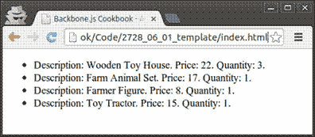
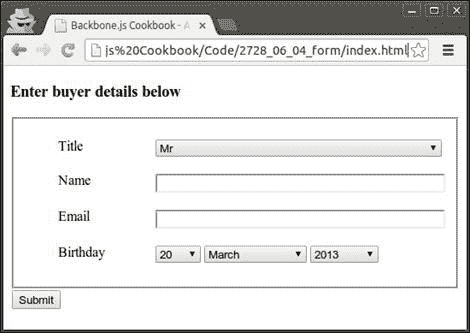
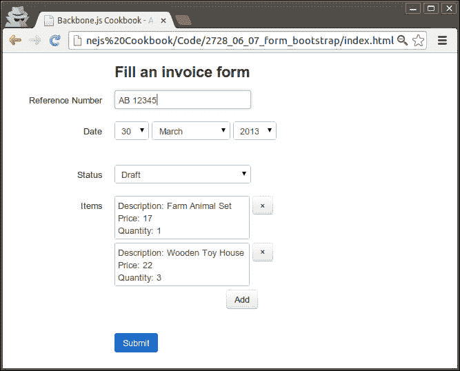
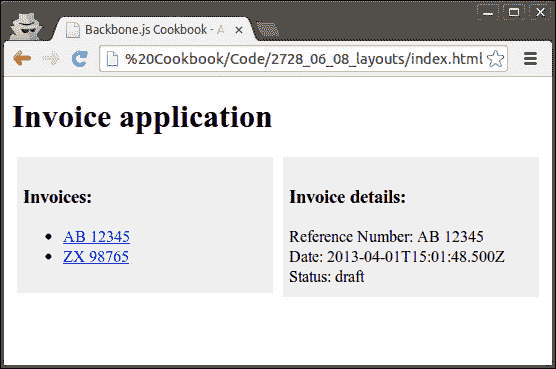
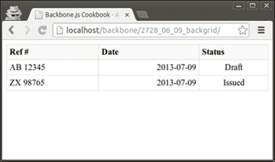
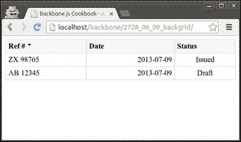
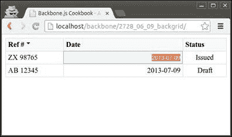
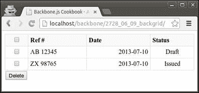
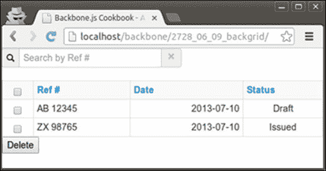
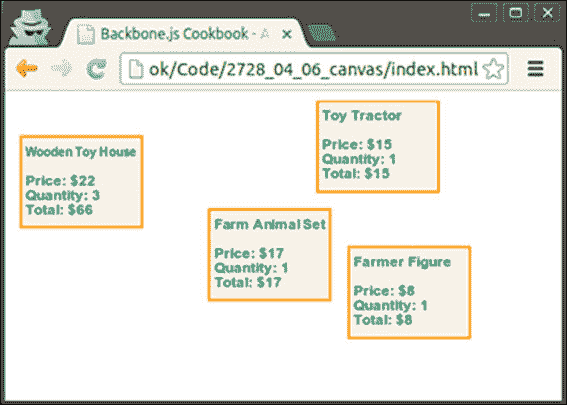

# 第六章。模板和 UX 糖

在本章中，我们将介绍以下食谱：

+   在视图中使用模板

+   实现模板加载器

+   使用 Mustache 模板

+   定义一个表单

+   向表单添加验证

+   处理表单事件

+   使用 Bootstrap 框架自定义表单

+   使用 LayoutManager 组装布局

+   构建语义化和易于样式的数据网格

+   在 HTML5 画布上绘制

# 简介

本章向您介绍了模板，它们用于将 HTML 标记与应用程序代码分离。因此，应用程序变得更加结构化和整洁。我们将讨论 Underscore.js 提供的模板引擎，并学习如何将 Backbone 与第三方模板引擎（如 Mustache.js）集成。

此外，我们还将讨论有用的 Backbone 扩展，它允许使用表单、布局和网格。

# 在视图中使用模板

在这个食谱中，您将学习如何在 Backbone 视图中使用模板。默认情况下，Backbone.js 与 Underscore.js 提供的模板引擎集成。

让我们以 第四章 中 *在视图中渲染集合* 食谱的例子为例，我们在视图中渲染了一个集合，并使用 Underscore 的模板引擎更新了代码。结果将类似于以下图像：



## 如何操作...

按照以下步骤在视图中使用模板：

1.  确保您已定义模型和集合对象。

    ```js
      var InvoiceItemModel = Backbone.Model.extend({

      });

      var InvoiceItemCollection = Backbone.Collection.extend({
        model: InvoiceItemModel
      });
    ```

1.  使用包含模板的 `template` 属性定义一个视图。然后，在渲染视图时，使用 `template()` 返回渲染的 HTML。

    ```js
      var InvoiceItemListView = Backbone.View.extend({

        // HTML element name, where to render a view.
        tagName: 'ul',
        // Define template.
        template: _.template(
          '<% _.each(items, function(item) { %>' + 
          '   <li>' + 
          '      Description: <%= item.description %>.' +
          '      Price: <%= item.price %>.' +
          '      Quantity: <%= item.quantity %>.' +
          '   </li>' +
          '<% }); %>'
        ),

        // Render view.
        render: function() {

          // Render template and set html for the view element 
          // using jQuery.
          this.$el.html(this.template({
            items: this.collection.toJSON()
          }));

          return this;
        }
      });
    ```

1.  创建一个集合实例。

    ```js
    var invoiceItemCollection = new InvoiceItemCollection([
      { description: 'Wooden Toy House', price: 22, quantity: 3 },
      { description: 'Farm Animal Set', price: 17, quantity: 1 },
      { description: 'Farmer Figure', price: 8, quantity: 1 },
      { description: 'Toy Tractor', price: 15, quantity: 1 }
    ]);
    ```

1.  创建一个视图实例，渲染它，并将结果设置为 `body` 的值。

    ```js
    $('body').html(new InvoiceItemListView({
      collection: invoiceItemCollection
    }).render().el);
    ```

## 它是如何工作的...

通过 Underscore.js 提供的 `_.template()` 方法，我们可以在 `<% … %>` 括号内包含 JavaScript 代码的 HTML 模板中定义。要将变量输出到模板中，我们需要使用 `<%= … %>` 语法，而要将转义后的 HTML 变量输出，我们可以使用 `<%- … %>` 语法。

此外，在 `render()` 方法中，我们将以 JSON 格式将集合项传递给模板。

## 更多内容...

在本节中，我们将学习如何将模板拆分为部分。

### 将模板拆分为部分

部分是一个可以从其他模板中调用的模板，作为一个函数。

如果我们想要重用现有模板的部分，我们可以将一个模板拆分为不同的部分。为此，请按照以下步骤操作：

1.  定义模板部分。

    ```js
    itemTemplate: _.template(
      'Description: <%= description %>.' + 
      'Price: <%= price %>.' +
      'Quantity: <%= quantity %>.'
    ),
    ```

1.  定义主模板。

    ```js
    template: _.template(
      '<% _.each(items, function(item) { %>' +
      '  <li>' +
      '    <%= itemTemplate(item) %>' +
      '  </li>' +
      '<% }); %>'
    ),
    ```

1.  在渲染模板时，将部分方法作为设置传递。

    ```js
    this.$el.html(this.template({
      items: this.collection.toJSON(),
      itemTemplate: this.itemTemplate
    }));
    ```

## 相关内容

要获取有关 Underscore.js 中模板的更多信息，您可以参考官方文档[`underscorejs.org/#template`](http://underscorejs.org/#template)。

# 实现模板加载器

在一个大型应用程序中，遵循关注点分离范式，将模板存储在视图之外是很重要的，这样网页设计师可以轻松地修改它们，而不会损害视图。这种做法也提供了应用程序内的模板可重用性。

### 小贴士

**将所有模板存储在单个 HTML 文件中**

对于服务器端应用程序，开发者通常将模板存储在单独的文件中，以实现方便访问和编辑它们。然而，这种方法几乎不能应用于客户端应用程序，因为它会使浏览器从服务器下载多个小文件，从而延迟应用程序的启动。

在这个菜谱中，我们将把模板存储在单独的 HTML 文件中，除了视图之外。我们还将编写一个模板加载器，它将加载这些模板到内存中，允许从应用程序的各个部分访问它们。

## 如何操作...

按照以下步骤实现模板加载器：

1.  将包含在`script`标签中的模板添加到`index.html`文件的头部分。设置`id`属性以区分不同的模板。

    ```js
    <head>

      …

      <script type="text/html" class="template" id="items">
        <% _.each(items, function(item) { %>
          <li>
            <%= itemTemplate(item) %>
          </li>
        <% }); %>
      </script>

      <script type="text/html" class="template" id="item">
        Description: <%= description %>.
        Price: <%= price %>.
        Quantity: <%= quantity %>
      </script>

    </head>
    ```

1.  创建一个模板加载实用工具，并将其放置到`js/template-loader.js`文件中。

    ```js
    (function($){

      $(document).ready(function () {

      	 // Store variable within global jQuery object.
        $.tpl = {}

        $('script.template').each(function(index) {

          // Load template from DOM.
          $.tpl[$(this).attr('id')] = _.template($(this).html());

          // Remove template from DOM.
          $(this).remove();
        });
      });

    })(jQuery);
    ```

1.  将模板加载器包含到`index.html`文件中。

    ```js
    <head>
      ...
      <script src="img/template-loader.js"></script>
      …
    </head>
    ```

1.  在渲染视图时，使用全局`$.tpl`数组中定义的模板。

    ```js
    this.$el.html($.tpl'items',
      itemTemplate: $.tpl['item']
    }));
    ```

## 它是如何工作的...

由于我们在`index.html`中定义了我们的模板，它们可以即时加载。然后，在模板加载器中，当文档完全加载后，我们将它们移动到全局变量`$.tpl`中，并从 DOM 中删除模板。这应该会加快我们模板的进一步使用，就像我们在 JS 文件中定义它们一样。现在，我们可以在应用程序的不同视图中使用这些模板。

# 使用 Mustache 模板

Mustache 是一种美丽且无逻辑的模板语法。它可以用于 HTML、配置文件、源代码等。存在各种针对不同语言的 Mustache 实现，例如 JavaScript、PHP、Ruby、Python 以及许多其他语言。

在本章中，我们将学习如何使用 Mustache.js，这是 JavaScript 的 Mustache 实现，与 Backbone.js 一起使用。

## 准备工作

您可以从其 GitHub 页面[`github.com/janl/mustache.js`](https://github.com/janl/mustache.js)下载 Mustache.js。要将 Mustache.js 包含到您的项目中，将`mustache.js`文件保存到`lib`文件夹中，并在`index.html`中包含对其的引用。

在第一章的*使用插件扩展应用程序*菜谱中详细描述了如何将 Backbone 扩展包含到您的项目中。

## 如何操作...

按照以下步骤使用 Mustache 模板：

1.  在视图中定义一个 Mustache 模板。

    ```js
    // Define template.
    template: '{{#items}}<li>' +
              '  Description: {{description}}' +
              '  Price: {{price}}.' +
              '  Quantity: {{quantity}}.' +
              '</li>{{/items}}',
    ```

1.  运行`Mustache.render()`方法来渲染模板。

    ```js
    this.$el.html(
      Mustache.render(this.template, {
        items: this.collection.toJSON()
      })
    );
    ```

## 它是如何工作的...

`Mustache.render()`将模板字符串编译成 JavaScript 代码，然后执行它。模板字符串包含像`{{placeholder}}`这样的占位符，这些占位符将被第二个参数中提供的值替换。

## 还有更多...

本节描述了如何在 Mustache.js 中使用编译后的模板和部分。

### 使用编译后的模板

为了提高应用程序的性能，您可以在使用之前通过调用`Mustache.compile()`编译模板。此方法接受模板字符串作为单个参数，并返回一个 JavaScript 函数，可以调用以返回 HTML 代码。以下示例演示了如何操作：

```js
  var InvoiceItemListView = Backbone.View.extend({
    tagName: 'ul',

    template: Mustache.compile(
                '{{#items}}<li>' + 
                '  Description: {{description}}' +
                '  Price: {{price}}.' +
                '  Quantity: {{quantity}}.' +
                '</li>{{/items}}'
              ),

    render: function() {
      this.$el.html(this.template({
        items: this.collection.toJSON()
      }));

      return this;
    }
  });
```

### 使用部分

与 Underscore 模板一样，Mustache.js 允许使用部分。要调用部分模板，请使用`>`语法。

```js
{{#items}}
  <li>{{> item }}</li>
{{/items}}
```

部分模板将如下所示：

```js
  Description: {{description}}
  Price: {{price}}.
  Quantity: {{quantity}}.
```

您可以通过以下几种方式传递部分模板：

+   可以将部分对象（也是字符串）作为第三个参数传递给`Mustache.render()`。该对象应按部分的名称键入，其值应为部分文本。

    ```js
    Mustache.render(
      this.template,
      { items: this.collection.toJSON() },
      { item: this.itemTemplate }
    );
    ```

+   模板部分也可以使用`Mustache.compilePartial()`函数进行编译。此函数的第一个参数是部分在父模板中的名称。第二个参数是部分模板字符串。

    ```js
    Mustache.compilePartial(
      'item', 
      'Description: {{description}}. Price: {{price}}.\
       Quantity: {{quantity}}.'
    );
    ```

## 相关内容

要了解更多关于 Mustache.js 语法的知识，您可以访问其官方 GitHub 页面[`github.com/janl/mustache.js`](https://github.com/janl/mustache.js)。

# 定义表单

几乎任何 Web 应用程序都需要 HTML 表单来收集用户输入。在前面的章节中，我们学习了如何手动渲染表单并将其绑定到视图模型。

然而，我们应该寻找允许我们通过编写更少的代码来更轻松地处理表单的 backbone-forms 扩展。在本配方和后续配方中，我们将学习如何使用此扩展。

让我们为`BuyerModel`创建一个简单的表单，它将如下截图所示：


## 准备工作

要将 backbone-forms 添加到您的项目中，请从 GitHub 页面下载整个扩展存档（[`github.com/powmedia/backbone-forms`](https://github.com/powmedia/backbone-forms)），并将其提取到`lib/backbone-forms`目录中。然后，将扩展文件的引用包含到`index.html`中。

```js
<link href="lib/backbone-forms/distribution/templates/default.css" rel="stylesheet" />

<script src="img/backbone-forms.min.js"></script>
```

在第一章的*使用插件扩展应用程序*配方中详细描述了将 Backbone 扩展添加到您的项目中，*理解 Backbone*。

## 如何操作...

按照以下步骤定义一个表单：

1.  在模型对象内部定义表单模式定义。

    ```js
    var BuyerModel = Backbone.Model.extend({
      schema: {
        title:   { type: 'Select', options: ['Mr', 'Mrs', 'Ms'] },
        name:    'Text',
        email:   { validators: ['required', 'email'] },
        birthday:'Date',
      }
    });
    ```

1.  创建一个视图，该视图应使用`Backbone.Form`对象渲染表单。

    ```js
      var BuyerFormView = Backbone.View.extend({
        render: function() {
          this.form = new Backbone.Form({ model: this.model });

          this.$el.html('<h3>Enter buyer details below</h3>');
          this.$el.append(this.form.render().el);
          this.$el.append('<button>Submit</button>');

          return this;
        },
      });
    ```

1.  向视图添加一个`submit`回调。在这个回调中，表单被验证，其值通过表单的`commit()`方法传递给模型。

    ```js
        events: {
          'click button': 'submit'
        },

        submit: function() {
          this.form.commit();

          console.log(this.model.toJSON());
          // Object { title: "Mr", name: "John Doe",
          // email: "john.doe@example.com",
          // birthday: Thu Mar 20 1986 00:00:00 GMT+0200 (EET) }
        }
    ```

## 它是如何工作的...

`Backbone.Form` 对象通过重写 `render()` 方法扩展了 `Backbone.Views`，在该方法中，它根据我们传递给模型的模式定义构建表单。如果模型有初始值，则这些值将被分配给表单元素。

通过执行 `commit()` 方法，执行表单验证并将表单值分配给模型属性。如果将 `{validate: true}` 选项传递给此方法，则同时执行表单验证和模型验证。

## 更多...

本节描述了如何在没有模型的情况下构建表单。

### 使用无模型的表单

我们可以创建一个表单，而不需要将模式定义绑定到模型上。以下示例展示了如何实现：

```js
var form = new Backbone.Form({
  data: {
    title: 'Mr',
    name: 'John Doe',
    email: 'john.doe@example.com',
    birthday: '1986-03-20'
  },

  schema: {
    title:   { type: 'Select', options: ['Mr', 'Mrs', 'Ms'] },
    name:    'Text',
    email:   { validators: ['required', 'email'] },
    birthday:'Date',
  }
}).render();
```

要获取表单值，请使用 `getValue()` 方法。

```js
var this.data = this.getValue();
```

## 相关链接

要了解更多关于模式定义的信息，您可以查看他们的官方文档，链接为[`github.com/powmedia/backbone-forms#schema-definition`](https://github.com/powmedia/backbone-forms#schema-definition)。在后续的食谱中，我们将继续学习 backbone-forms 扩展。

# 向表单添加验证

在本食谱中，我们将继续学习 backbone-forms 扩展，并将讨论表单验证，这是一个非常有用的功能，几乎任何利用 backbone-forms 扩展的 Web 应用程序都需要。

## 如何实现...

按照以下步骤向表单添加验证：

1.  确保您已经定义了模型模式。

    ```js
      var BuyerModel = Backbone.Model.extend({
        schema: {
          email: 'Text',
        }
      });
    ```

1.  添加验证器。

    ```js
      var BuyerModel = Backbone.Model.extend({
        schema: {
          email: {
            type: 'Text',
            validators: ['required', 'email']
          }
        }
      });
    ```

1.  设置验证消息。

    ```js
      var BuyerModel = Backbone.Model.extend({
        schema: {
          email: {
            type: 'Text',
            validators: [
              {
                type: 'required',
                message: 'Email field is required'
              },
              'email'
            ],
          }
        }
      });
    ```

## 它是如何工作的...

要启用验证，我们需要将 `validators` 数组传递给模式字段定义。验证器可以是一个字符串、一个对象、一个正则表达式（regular expression）或一个函数。

使用字符串设置内置验证器，这些验证器不需要额外的参数。这些验证器是 `required`、`email` 和 `url`。如果验证器需要额外的参数（例如，`match` 和 `regexp`），或者如果我们想覆盖错误消息，我们需要使用对象来定义验证器。

```js
password: {
  validators: [ {
    type: 'match',
    field: 'passwordConfirm', 
    message: 'Passwords must match!'
  }]
}
```

要执行自定义验证器，我们需要传递一个带有两个参数的验证函数：`value`，它是表单元素的值，以及 `formValues`，它是所有表单值的哈希。

```js
//Custom function 
username: { validators: [ 
  function checkUsername(value, formValues) { 
    var err = { 
      type: 'username', 
      message: 'Usernames must be at least 3 characters long' 
    }; 

    if (value.length < 3) return err; 
  } 
] }
```

验证是在调用 `form.validate()` 或 `form.commit()` 方法时执行的。

## 更多...

本节描述了更多关于表单验证的信息。

### 自定义错误信息

对于特定类型的所有内置验证器，可以同时覆盖错误消息。通过在 `Backbone.Form.validators.errMessages`（配置对象）中覆盖值，可以轻松地做到这一点。我们可以使用 Mustache 标签。以下是实现方式：

```js
Backbone.Form.validators.errMessages.required =
  'Please enter a value for this field.';

Backbone.Form.validators.errMessages.match =
  'This value must match the value of {{field}}';

Backbone.Form.validators.errMessages.email =
  '{{value}} is an invalid email address.';
```

### 执行模型验证

如果您想在提交或验证表单时执行模型验证，请确保模型的 `validate()` 方法返回一个按字段名称键控的错误消息对象。

```js
    validate: function(attrs) {
      var errs = {};

      if (this.usernameTaken(attrs.username)) {
        errs.username = 'The username is taken'
      }

      if (!_.isEmpty(errs)) return errs;
    },
```

## 相关链接

要了解更多关于表单验证的信息，您可以参考[`github.com/powmedia/backbone-forms#validation`](https://github.com/powmedia/backbone-forms#validation)上的文档。

# 处理表单事件

`Backbone.Form`扩展提供了我们可以在应用程序中使用的一些事件。例如，通过利用这些事件，我们可以实现一些特定的功能，其中一个字段的值依赖于另一个字段的值。

在这个菜谱中，我们将为`InvoiceModel`模型创建一个表单，其中**支付日期**字段仅在**支付**选项作为**状态**字段值被选中时显示。我们的表单将如下截图所示：



## 如何操作...

按照以下步骤处理表单事件：

1.  定义模型和表单模式。

    ```js
      var InvoiceModel = Backbone.Model.extend({
        schema: {
          referenceNumber: { type: 'Text'},

          date: { type: 'Date'},

          status: {
            type: 'Select',
            options: [
              { val: 'draft', label: 'Draft' },
              { val: 'issued', label: 'Issued' },
              { val: 'paid', label: 'Paid' },
              { val: 'canceled', label: 'Canceled' }
            ]
          }

          paidDate: { type: 'Date' },
        }
      });
    ```

1.  根据`Backbone.Form`创建`InvoiceForm`。

    ```js
      var InvoiceForm = Backbone.Form.extend({

      }
    ```

1.  覆盖父类的`initialize()`方法，将`status`字段的`change`事件绑定到回调函数，该函数将更新相关字段。

    ```js
        initialize: function() {

          // Call parent method.
          InvoiceForm.__super__.initialize.apply(this, arguments);

          // Bind change status change event to the
          // update callback.
          this.on('status:change', this.update);
        }
    ```

1.  实现表单的`update`方法，该方法将更新相关字段。

    ```js
        update: function(form, editor) {
          if (form.fields.status.editor.getValue() == 'paid') {
            form.fields.paidDate.$el.show();
          }
          else {
            form.fields.paidDate.$el.hide();  
          }
        }
    ```

1.  覆盖表单的`render`方法，在那里我们需要运行`update`方法以确保相关字段正确显示。

    ```js
        render: function() {

          // Call parent method. 
          InvoiceForm.__super__.render.apply(this, arguments);
          // Esnure dependent are shown properly.
          this.update(this);

          return this;
        }
    ```

## 它是如何工作的...

`Backbone.Form`提供了几个表单事件，我们可以使用`on()`方法将它们绑定到我们的回调函数。它们是：

+   `change`：每当发生影响`form.getValue()`结果的事件时，都会触发此事件。

+   `focus`：每当此表单获得焦点时，即当此表单内编辑器的输入成为`document.activeElement`时，都会触发此事件。

+   `blur`：每当此表单失去焦点时，即当此表单内编辑器的输入停止成为`document.activeElement`时，都会触发此事件。

+   `<key>:<event>`：`change`、`focus`或`blur`事件会针对由`key`指定的表单元素触发。

`Backbone.Form`扩展了`Backbone.Views`并实现了`initialize()`和`render()`方法。在我们的子对象中，我们需要使用这些方法，因此我们需要确保父方法被执行，这是由于 JavaScript 的`__super__`关键字所实现的。然后，应用该方法。

## 参见

+   第五章中*处理 Backbone 对象的事件*菜谱，*事件和绑定*

# 使用 Bootstrap 框架自定义表单

默认的 backbone-form 样式看起来相当无聊，我们可能想用像 Bootstrap 这样的酷炫样式来替换它们。在这种情况下，我们的表单看起来会更好，如下面的截图所示：



在这里，我们也使用一个列表元素（即编辑器）来允许用户输入发票项目详情。当用户点击**添加**按钮时，以下弹出窗口会生成并显示给用户：


## 准备工作

按照以下步骤准备使用 Bootstrap.js：

1.  从其 GitHub 页面[`twitter.github.com/bootstrap`](http://twitter.github.com/bootstrap)下载 Bootstrap 框架存档，并将其提取到应用程序的`lib`文件夹中。

1.  从`index.html`中移除`default.css`样式的引用。

1.  将 Bootstrap 文件包含到`index.html`中。

    ```js
    <link rel="stylesheet" href="lib/bootstrap/css/bootstrap.css" />

    <script src="img/bootstrap.js"></script>
    ```

1.  包含对`Backbone.Forms`扩展、列表编辑器、Bootstrap 模态适配器、Bootstrap 模板和样式的链接。

    ```js
    <script src="img/backbone-forms.js">
    </script>

    <script src="img/list.js">
    </script>

    <script src="img/backbone.bootstrap-modal.js">
    </script>

    <script src="img/bootstrap.js">
    </script>

    <link rel="stylesheet" href="lib/backbone-forms/distribution/templates/bootstrap.css" />
    ```

在第一章的*使用插件扩展应用程序*配方中详细描述了将 Backbone 扩展包含到您的项目中。

## 如何做...

按照以下步骤使用 Bootstrap 框架自定义表单：

1.  将以下代码行添加到`main.js`中，以设置默认模态适配器：

    ```js
    Backbone.Form.editors.List.Modal.ModalAdapter = Backbone.BootstrapModal;
    ```

1.  将发票项目字段定义添加到 Backbone 模式中。

    ```js
          items:    {
            type: 'List', itemType: 'Object', subSchema: {
              description: { validators: ['required'] },
              price: 'Number',
              quantity: 'Number',          
            }
          }
    ```

## 它是如何工作的...

我们包含了覆盖默认 backbone-forms 模板和样式的文件，以实现与 Bootstrap 框架的集成。此外，我们还使用了列表元素，它会对 Bootstrap 模态适配器进行特殊调用，以显示一个漂亮的模态弹出窗口。

## 更多...

本节描述了如何覆盖表单模板。

### 覆盖表单模板

在上一个示例中，我们将`lib/backbone-forms/distribution/templates/bootstrap.js`包含到我们的项目中，以确保使用适当的模板，以便与 Bootstrap 引擎提供集成。在此文件中，通过调用`Backbone.Form`对象的`setTemplates()`方法来覆盖默认模板。

```js
  var Form = Backbone.Form;

  Form.setTemplates({
    form:
      '<form class="form-horizontal">{{fieldsets}}</form>',

    // ...
    field:
      '<div class="control-group field-{{key}}">' +
      '  <label class="control-label" for="{{id}}">' +
      '    {{title}}' +
      '  </label>' +
      '  <div class="controls">' +
      '    {{editor}}' +
      '    <div class="help-inline">{{error}}</div>' +
      '    <div class="help-block">{{help}}</div>' +
      '  </div>' +
      '</div>',
  }, {
    error: 'error'
    // Set error class on the field tag when validation fails
  });
```

模板定义使用 Mustache 语法，可以覆盖的模板有：`form`、`fieldset`、`field`、`nestedField`、`list`、`listItem`、`date`、`dateTime`和`'list.Modal'`。

要使用与为表单元素定义的模板不同的特定模板，添加一个模板，并在模式定义中的模板参数中传递其名称。

```js
title: { type: 'Select', options: ['Mr', 'Mrs', 'Ms'], template: 'customField'}
```

要为表单使用特定的模板，在创建新表单时传递其名称。

```js
this.form = new Backbone.Form({
  model: this.model, template: 'customForm'
});
```

## 参见

您可以通过查看[`twitter.github.com/bootstrap`](http://twitter.github.com/bootstrap)上的官方 Bootstrap.js 文档来了解更多信息。还可以查看`lib/backbone-forms/distribution/templates/default.js`文件，以找出所有可覆盖的模板。

# 使用 LayoutManager 组装布局

**Backbone.LayoutManager**是 Backbone.js 最有用的扩展之一。它允许轻松构建由面板组成的布局，并且与仅使用 Backbone 视图相比，可以减少许多代码行。LayoutManager 还提供了从主 HTML 文件或外部文件加载模板的机制。

让我们构建一个将有两个面板的应用程序。在第一个面板中，用户将看到发票列表，而在另一个面板中，他将看到发票详情。



通过单击第一个面板中的发票号码，我们的应用程序将立即更新第二个面板。

## 准备工作

您可以从其 GitHub 页面[`github.com/tbranyen/backbone.layoutmanager`](https://github.com/tbranyen/backbone.layoutmanager)下载 Backbone.LayoutManager。要将 LayoutManager 包含到您的项目中，将`backbone.layoutmanager.js`文件保存到`lib`文件夹中，并在`index.html`中包含对其的引用。

在第一章的“使用插件扩展应用程序”食谱中详细描述了如何将 Backbone 扩展添加到您的项目中，*理解 Backbone*。

## 如何做到这一点...

按照以下步骤组装布局：

1.  确保您已定义模型和集合对象。

    ```js
      var InvoiceModel = Backbone.Model.extend({

      });

      var InvoiceCollection = Backbone.Collection.extend({
        model: InvoiceModel
      });
    ```

1.  定义发票列表面板。

    ```js
      var InvoiceListPane = Backbone.Layout.extend({

        // Returns selector for template.
        template: "#invoice-list-pane",

        // Set selector for template.
        serialize: function() {
          return {
            // Wrap the collection.
            invoices: _.chain(this.collection.models)
          };
        }
      });
    ```

1.  定义发票面板。

    ```js
      var InvoicePane = Backbone.Layout.extend({

        // Set selector for template.
        template: "#invoice-pane",

        // Returns data for template.
        serialize: function() {
          return {
            invoice: this.model
          };
        }
      });
    ```

1.  定义一个带有路由的 router 并在其`initialize()`方法中创建集合实例。

    ```js
      var Workspace = Backbone.Router.extend({
        routes: {
          '': 'page',
          'invoice/:id': 'page',
        },

        // Initialize function run when Router object instance// is created.
        initialize: function() {
          //  Create collection
          this.collection = new InvoiceCollection([
            {
              referenceNumber: 'AB 12345',
              date: new Date().toISOString(),
              status: 'draft'
            },
            {
              referenceNumber: 'ZX 98765',
              date: new Date().toISOString(),
              status: 'issued'
            },
          ]);
        },

      });
    ```

1.  向路由器添加页面回调，它创建一个`Backbone.Layout`对象并将其渲染。

    ```js
        page: function(id) {
          if (!id) {
            // Set default id.
            id = this.collection.at(0).cid;
          }

          var layout = new Backbone.Layout({
            // Attach the layout to the main container.
            el: "body",

            // Set template selector.
            template: "#layout",

            // Declaratively bind a nested View to the layout.
            views: {
              "#invoice-list-pane": new InvoiceListPane({
                collection: this.collection
              }),
              "#invoice-pane": new InvoicePane({
                model: this.collection.get(id)
              }),
            }
          });

          // Render the layout.
          layout.render();
        },
    ```

1.  将模板添加到页面元素的`<head>`标签中。

    ```js
      <script class="template" type="template" id="layout">
        <h1>Invoice application</h1>
        <div id="invoice-list-pane"></div>
        <div id="invoice-pane"></div>
      </script>

      <script class="template"
          type="template"id="invoice-list-pane">
        <h3>Invoices:</h3>
        <ul>
          <% invoices.each(function(invoice) { %>
            <li>
              <a href="#invoice/<%= invoice.cid %>">
                <%= invoice.get('referenceNumber') %>
              </a>
            </li>
          <% }); %>
        </ul>
      </script>

      <script class="template" type="template" id="invoice-pane">
        <h3>Invoice details:</h3>
        Reference Number:
          <%= invoice.get('referenceNumber') %><br>
        Date: <%= invoice.get('date') %><br>
        Status: <%= invoice.get('status') %><br>
      </script>
    ```

## 它是如何工作的...

`Backbone.LayoutManager`对象实现了模板加载器、`render()`方法，并提供了许多其他酷炫的功能，这通常是开发者所做的事情。在视图选项中，我们可以选择将哪个布局面板或 Backbone 视图附加到主模板中指定的 HTML 元素。

## 参见

请参阅 LayoutManager 文档以了解有关扩展的更多信息，[`github.com/tbranyen/backbone.layoutmanager/wiki`](https://github.com/tbranyen/backbone.layoutmanager/wiki)。

# 构建语义化和易于样式的数据网格

在您的应用程序中，您可能希望以可排序、可过滤和可编辑的网格形式输出数据，这直接从头开始做并不容易。在本食谱中，我们将学习使用 Backgrid.js，Backbone 应用程序构建数据网格的强大扩展，来快速解决这个问题。

在此应用程序中，我们将使用 Backgrid 示例创建一个简单的网格。它将看起来像以下截图：



当用户点击列标题时，网格将按此列排序。



如果用户双击特定单元格，则该单元格将被输入元素替换，用户可以在其中输入新值。



## 准备工作

按照以下步骤准备使用 Backgrid 扩展：

1.  从其官方网站[`backgridjs.com/`](http://backgridjs.com/)下载 Backgrid.js 扩展。

1.  通过将此扩展提取到`lib/backgrid`文件夹中来将 Backgrid.js 包含到您的项目中。

1.  在`index.html`中包含对扩展文件的引用。

    ```js
    <link rel="stylesheet" href="lib/backgrid/lib/backgrid.css" />
    <script src="img/backgrid.js"></script>
    ```

在第一章的“使用插件扩展应用程序”食谱中详细描述了如何将 Backbone 扩展添加到您的项目中，*理解 Backbone*。

## 如何操作...

按照以下步骤构建网格：

1.  确保您已定义了模型和集合对象。

    ```js
      var InvoiceModel = Backbone.Model.extend({

      });

      var InvoiceCollection = Backbone.Collection.extend({
        model: InvoiceModel
      });
    ```

1.  创建一个集合实例。

    ```js
        var invoiceCollection = new InvoiceCollection();
    ```

1.  定义网格列设置。

    ```js
        var columns = [
          {
            name: "referenceNumber",
            label: "Ref #",
            editable: false,
            cell: 'string'
          },
          {
            name: "date",
            label: "Date",
            cell: "date"
          },
          {
            name: "status",
            label: "Status",
            cell: Backgrid.SelectCell.extend({
              optionValues: [
                ['Draft', 'draft'],
                ['Issued', 'issued']
              ]
            })
          }
        ];
    ```

1.  初始化一个新的网格实例。

    ```js
        var grid = new Backgrid.Grid({
          columns: columns,
          collection: invoiceCollection
        });

        $('body').append(grid.render().$el);

        invoiceCollection.add([
          {
            referenceNumber: 'AB 12345',
            date: new Date().toISOString(),
            status: 'draft'
          },
          {
            referenceNumber: 'ZX 98765',
            date: new Date().toISOString(),
            status: 'issued'
          },
        ]);
    ```

1.  将模型添加到集合中。

    ```js
        invoiceCollection.add([
          {
            referenceNumber: 'AB 12345',
            date: new Date().toISOString(),
            status: 'draft'
          },
          {
            referenceNumber: 'ZX 98765',
            date: new Date().toISOString(),
            status: 'issued'
          },
        ]);
    ```

1.  启动应用程序。

    ```js
      Backbone.history.start();
    ```

# 它是如何工作的...

`Backgrid.Grid` 扩展了 `Backbone.View`，因此您可以创建其实例并传递通过 `columns` 参数键控的列设置。列设置定义为数组，每一行具有以下属性：

+   `name`：它是模型属性的名称。

+   `label`：它是标题列的标签。

+   `sortable`：它返回一个布尔值以检查列是否可排序。

+   `editable`：它返回一个布尔值以检查列是否可编辑。

+   `cell`：它是单元格类型，可以是以下之一：`datetime`、`date`、`time`、`number`、`integer`、`string`、`uri`、`email`、`boolean` 和 `select`。

如果需要为单元格类型指定额外的参数，您可以扩展相应的类并将其传递给 `cell` 属性。

```js
Backgrid.SelectCell.extend({
  optionValues: [
    ['Draft', 'draft'],
    ['Issued', 'issued']
  ]
})
```

## 还有更多...

在本节中，我们将使用几个 Backgrid 扩展，这些扩展可以为我们的网格添加额外功能。

### 在网格模型上执行批量操作

我们将向我们的网格添加一个额外的列，该列将包含复选框，允许用户在网格中选择特定的模型并对其执行批量操作，例如删除。以下截图显示了我们的表格将看起来像什么：



要完成此任务，请按照以下步骤操作：

1.  将 SelectAll 扩展文件包含到 `index.html` 中。

    ```js
    <link rel="stylesheet" href="lib/backgrid/lib/extensions/select-all/backgrid-select-all.css" />

    <script src="img/backgrid-select-all.js"></script>
    ```

1.  将网格包裹在 `TableView` 中。

    ```js
      var TableView = Backbone.View.extend({
        initialize: function(columns, collection) {
          this.collection = collection;

          this.grid = new Backgrid.Grid({
            columns: columns,
            collection: this.collection
          });
        },

        render: function() {
          this.$el.html(this.grid.render().$el);

          return this;
        },
      });
    ```

1.  在 `initialize()` 方法中添加复选框的列。

    ```js
        initialize: function(columns, collection) {
          this.collection = collection;

          columns = [{
            name: "",
            cell: "select-row",
            headerCell: "select-all",
          }].concat(columns)

          this.grid = new Backgrid.Grid({
            columns: columns,
            collection: this.collection
          });
        },
    ```

1.  在 `render()` 方法中追加删除按钮。

    ```js
        render: function() {
          this.$el.html(this.grid.render().$el);

          this.$el.append('<button class="delete">Delete</button>');

          return this;
        },
    ```

1.  处理按钮点击事件。

    ```js
        events: {
          'click button.delete': 'delete'
        },

        delete: function() {
          _.each(this.grid.getSelectedModels(), function (model) {
            model.destroy();
          });
        }
    ```

1.  创建一个新的 `TableView` 实例并将其追加到 `body` 元素中。

    ```js
    $('body').append(new TableView(columns, invoiceCollection).render().$el);
    ```

### 执行记录过滤

为了允许用户过滤记录，我们将使用 Select 扩展和 Lunr.js 库，这些库包含在 Backgrid 包中。此外，我们将应用 Bootstrap 样式以使搜索框看起来整洁。



按照以下步骤执行记录过滤：

1.  将 Select 扩展、Lunr 库和 Bootstrap 文件包含到 `index.html` 中。

    ```js
    <link rel="stylesheet" href="lib/backgrid/assets/css/bootstrap.css" />

    <link rel="stylesheet" href="lib/backgrid/lib/extensions/filter/backgrid-filter.css" />

    <script src="img/lunr.js"></script>

    <script src="img/backgrid-filter.js"></script>
    ```

1.  如我们在 *在网格模型上执行批量操作* 部分中所做的那样，将网格包裹在 `TableView` 中。

1.  在 `TableView.initalize()` 方法中初始化 `ClientSideFilter`。

    ```js
    this.clientSideFilter =
          new Backgrid.Extension.ClientSideFilter({
            collection: collection,
            placeholder: "Search by Ref #",
            fields: ['referenceNumber'],
            wait: 150
          });
    ```

1.  在 `TableView.render()` 方法中预置 `ClientSideFilter`。

    ```js
          this.$el.prepend(this.clientSideFilter.render().$el);
    ```

## 参见

Backgrid 扩展实际上非常广泛，无法在本食谱中完全考虑。因此，您可以查看官方 Backgrid 文档，网址为 [`backgridjs.com/`](http://backgridjs.com/)。

# 在 HTML5 canvas 上绘制

有时，我们可能希望将视图渲染到 HTML5 canvas 元素上，这可以提供更多的自由和灵活性。canvas 可以用于渲染图表，也可以用于创建在线游戏。

在这个例子中，我们将可视化 HTML5 画布上的模型集合。我们代码的输出将类似于以下截图：



## 准备工作

在本食谱中，我们将从第四章中“将视图拆分为子视图”的食谱中取一个例子，以改变`InvoiceItemView`和`InvoiceItemListView`。

## 如何做到这一点...

按照以下步骤操作：

```js
InvoiceItemView  var InvoiceItemView = Backbone.View.extend({

});
```

1.  在`InvoiceItemView`的`initialize()`方法中设置矩形框的边界。

    ```js
      initialize: function() {
        // Set box size
        this.w = 100;
        this.h = 75;

        // Set random position
        this.x = Math.random() * (this.options.canvasW - this.w);
        this.y = Math.random() * (this.options.canvasH - this.h);
      }
    ```

1.  在`InvoiceItemView`的`render()`方法中绘制一个矩形框，并在`ctx`（画布上下文）上输出模型值。

    ```js
        render: function() {

          // Get canvas context from parameters.
          ctx = this.options.ctx;

          // Draw transparent box
          ctx.fillStyle = '#FF9000';
          ctx.globalAlpha = 0.1;
          ctx.fillRect(this.x, this.y, this.w, this.h);

          // Stroke the box
          ctx.strokeStyle = '#FF9900';
          ctx.globalAlpha = 1;
          ctx.lineWidth = 2;
          ctx.strokeRect(this.x, this.y, this.w, this.h);

          // Output text in the box
          ctx.fillStyle = '#009966';
          ctx.font = 'bold 12px Arial';
          var textX = this.x + 4,
              textY = this.y + 4,
              textMaxW = this.w - 8,
              lineHeight = 12;

          ctx.fillText(
            this.model.get('description'),
            textX,textY + lineHeight, textMaxW
          );
          ctx.fillText(
            'Price: $' + this.model.get('price'),
            textX, textY + lineHeight*3,
            textMaxW
          );
          ctx.fillText(
            'Quantity: ' + this.model.get('quantity'),
             textX, textY + lineHeight*4, textMaxW
          );
          ctx.fillText(
            'Total: $' + this.model.calculateAmount(),
             textX, textY + lineHeight*5, textMaxW
          );

          return this;
        }
    ```

1.  定义`InvoiceItemListView`，它创建一个空白的画布并触发模型视图的迭代渲染，同时传递`ctx`作为选项。

    ```js
      var InvoiceItemListView = Backbone.View.extend({

        // Set a canvas as element tag name and define it's size.
        tagName: 'canvas',
        attributes: {
          width: 400,
          height: 200
        },

        // Render view.
        render: function() {

          // Get canvas context and it's size.
          var ctx = this.el.getContext("2d")
              canvasW = this.el.width,
              canvasH = this.el.height;
          // Clear canvas.
          ctx.clearRect(0, 0, canvasW, canvasH);

          // Iterate through models in collection and render them.
          this.collection.each(function(model) {
            new InvoiceItemView({
              model: model,

              // Pass canvas context and it's size.
              ctx: ctx,
              canvasW: canvasW,
              canvasH: canvasH
            }).render();
          }, this);

          return this;
        }
      });
    ```

## 它是如何工作的...

`InvoiceItemListView`将画布定义为主要的视图元素，并设置其边界。在`render()`方法中，我们通过调用`getContext()`方法获取`ctx`，即画布的上下文对象。上下文对象允许我们通过运行特殊的 HTML5 方法在画布上绘制。

通过将`ctx`和画布尺寸作为选项传递给子视图，我们允许它们用于输出到画布上的文本和形状。

## 参考以下内容

HTML 5 画布参考可以在[`www.w3schools.com/html/html5_canvas.asp`](http://www.w3schools.com/html/html5_canvas.asp)找到。
