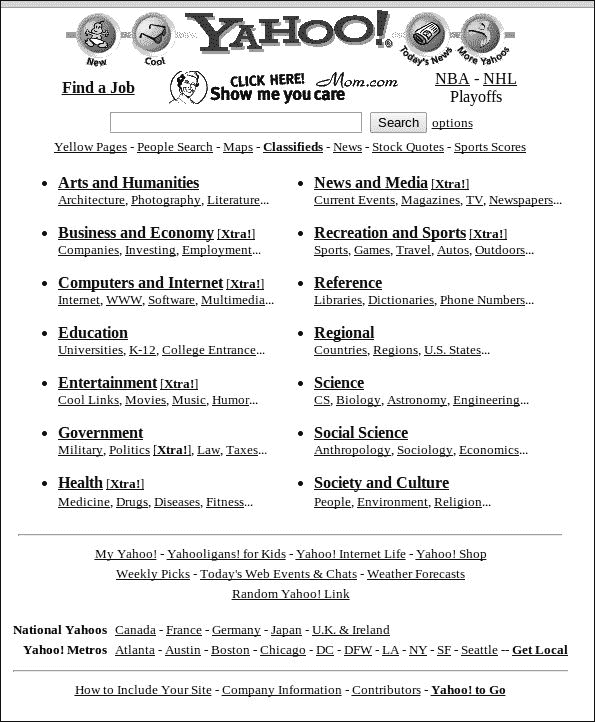

# 第一章：使用 Backbone 构建单页面网站

在本章中，你将了解 Backbone 是什么，以及为什么你想要使用它来创建网络应用。特别是，我们将探讨以下主题：

+   Backbone 的历史以及它如何融入网络开发的更大历史

+   Backbone 的 **单页面** 架构的优势

+   真实世界中的公司如何使用 Backbone 为他们的网站提供动力

# 什么是 Backbone？

Backbone 是由 Jeremy Ashkenas 在 2010 年创建的，它是 JavaScript 库家族中一个全新的分支的一部分。根据你询问的对象不同，这种类型的库可以被称作富应用框架、单页面库、厚客户端库，或者仅仅是 JavaScript 框架。无论你选择如何称呼它们，Backbone 及其相关库，如 Angular、Ember 和 CanJS，都提供了可以用来构建功能强大、超越传统网站，成为完整网络应用的工具。

Backbone 由以下五个主要工具组成：

+   一个类系统，它使得实践面向对象编程变得容易

+   一个 `Model` 类，它允许你存储和操作任何类型的数据，以及使用 AJAX 与远程服务器交换这些数据

+   一个 `Collection` 类，它允许你在模型组上执行相同的数据操作和传输

+   一个 `View` 类，它可以用来渲染构成页面的 DOM 元素，也可以用来管理在这些元素上发生的任何用户交互

+   一个 `Router` 类，它允许你仅使用一个 HTML 文件创建一个包含任意数量虚拟页面的整个网站

虽然在概念上非常简单，但所有这些组件结合起来，允许你创建具有前所未有的复杂性和鲁棒性的网站，这些网站在 **万维网**（**WWW**）上以前从未见过。

# 为什么选择 Backbone？

为什么你会想要在你的项目中选择 Backbone 真正有两个方面。首先，是“为什么根本要使用富应用框架？”的问题，其次，是“为什么选择 Backbone 而不是其他替代品？”的问题。让我们先从第一个问题开始。

要真正理解 **单页面应用**（**SPA**）的价值，了解之前发生的事情是至关重要的。所有之前的网站都可以分为三大类，我将它们称为静态、基于服务器和 JavaScript 辅助。每种类型都与网络开发历史的不同时期相对应。

# 网络开发简史

在许多方面，网络开发的历史可以看作是从基于服务器的逻辑到基于客户端逻辑的演变。这个故事始于 1993 年，当时推出了世界上第一个真正的网络浏览器：Mosaic。在当时，网络甚至还没有 JavaScript（或者更不用说 CSS 了），只有 HTML。在那些早期日子里，大多数网站都是简单的静态网站，任何包含动态元素的网站都必须完全基于服务器。JavaScript 的第一个版本要到两年后的 1995 年底才被引入，而且要过好几年，这种语言才对除了简单的表单验证之外的其他事情有用。



1997 年 Yahoo!的无 JavaScript 网站

幸运的是，网络确实在发展，很快 JavaScript 开发者见证了整个新的 JavaScript 库的诞生，如 Dojo、MochiKit、YUI，当然还有 jQuery。这些库使得开发者能够轻松地操作 DOM，避免当时普遍存在的跨浏览器问题，并利用一种新引入的技术，即**AJAX**。换句话说，它们使得开发者能够创建一种新的网站类型，即 JavaScript 辅助但仍然主要基于服务器的网络应用程序。

即使有了这些进步，服务器仍然控制着网站基础设施的两个关键部分：导航和页面渲染。这个问题要到几年后，随着现代 JavaScript 框架的引入，即第一个且最受欢迎的 Backbone，才得到解决。使用 Backbone，网络开发者终于能够仅使用客户端技术 JavaScript、HTML 和 CSS 来控制整个网站，这意味着他们可以创建一种全新的网络应用程序，即厚客户端或单页网站。

今天，即使 Backbone 和相关库的出现，许多开发者仍然继续创建前三种类型的网站，只要他们的目标适度，这是完全合理的。换句话说，如果你只是想向朋友展示你的婚礼照片，那么你可能不需要 Backbone 的全部功能。然而，如果你的目标是构建一个强大而健壮的网络应用程序，那么 Backbone 网站的优势是显而易见的。

# Backbone 和单页应用程序的优势

虽然采用厚客户端架构对网站有许多好处，但它们可以归纳为三个主要类别：资产控制、更简单的数据管理和性能提升。

## 完整的用户界面资产控制

开发传统多页网站的一个挑战是共享 HTML 资产。在这样的网站上，HTML 是通过服务器端工具生成的，例如 Django 模板、ERBs 或 **JavaServer Pages**（**JSPs**），但当然，客户端逻辑也严重依赖于相同的 HTML。在较小的组织中，这意味着程序员经常需要在 JavaScript 和服务器端语言之间分配注意力，这可能会因为频繁的上下文切换而感到沮丧。

在团队分离的大型组织中，HTML 资产通常由服务器端团队管理。这有时会使客户端团队甚至难以对网站的 HTML 进行最基本的更改，因为他们必须跨越界限工作。当他们未能这样做时，结果往往是他们创建了服务器端团队工作的并行版本，这种重复必然会导致错误。

Backbone 驱动的厚客户端应用程序通过让网站的 HTML 明确受客户端团队的严格控制来解决这些问题，无论是以模板系统、原始 HTML 文件还是 DOM 操作 JavaScript 逻辑的形式。两个团队之间的任何交互都通过精心协商的 API 集合发生，使得两组都能够专注于自己的核心专业领域，而不会相互干扰。

## 简化数据管理和事件触发

随着应用的扩展，管理其各个组件之间的交互可能会变得困难。解决这个问题的强大方法之一是使用基于事件的控制系统，但在 Backbone 出现之前，这样的系统在 JavaScript 中很少见。诚然，DOM 事件长期以来一直是网络开发的一部分，但没有像 Backbone 这样的框架，开发者只能局限于用户生成的事件。要真正实现基于事件系统的强大功能，还需要数据驱动的事件，这是 Backbone 的一个重要组成部分。

另一个常见的扩展挑战来自 JavaScript 对面向对象编程（**OOP**）的支持不足。OOP 允许程序员将大型、复杂的逻辑组织成更小、更易于管理的类，这在扩展应用程序时非常有用。虽然 JavaScript 有内置的类系统，但它相当不寻常，并且往往劝阻开发者采用 OOP 技术。Backbone 通过提供一个更友好的系统来解决此问题，虽然它仍然在 JavaScript 语言的限制内构建，但看起来更接近于在像 Java 这样的强大 OOP 语言中找到的系统。

## 提高性能

在互联网上，速度至关重要，一个网站速度的重要因素是其 HTML 文件的大小。在多页应用中，每次用户访问新页面时，他们的浏览器都必须发送请求并等待服务器的响应。当响应返回时，它不仅仅包含该页面的唯一 HTML。相反，响应包含了一切内容的 HTML，包括任何常见的网站组件，如菜单或页脚。当用户访问下一页时，他们又必须下载相同的公共组件 HTML，即使它没有变化。

此外，不仅仅是重复的 HTML 被下载：表格中的多行、列表中的多个搜索结果或任何其他重复内容也必须多次下载其 HTML。例如，考虑以下 HTML：

```js
<tr>
    <td>Fake Book</td>
    <td>This is a description of a fake book</td>
    <td><a href=""/buy/book1"">Buy Fake Book</a></td>
</tr>
<tr>
    <td>Another Fake Book</td>
    <td>I hope you like fake book titles because plenty more are coming in future chapters...</td>
    <td><a href=""/buy/book2"">Buy Another Fake Book</a></td>
</tr>
```

在前面的代码中，只有两本书的名称、描述和 URL 是唯一的，但即便如此，所有非唯一部分的代码也必须与之一起下载。如果网站显示 50 本书，用户就需要下载 50 份书行 HTML。即使一个网站没有公共组件或重复元素，当用户访问新页面时，浏览器仍需要经历整个请求-响应周期，然后重新加载和重新绘制页面，所有这些都需要时间。

在单页应用中，这些问题都不存在。网站的基础 HTML 只下载一次，之后所有的页面转换都完全通过 JavaScript 完成。由于客户端知道如何渲染公共和重复的组件，因此根本不需要下载它们的任何 HTML。在 Backbone 网站上，服务器只通过 AJAX 发送唯一数据，如果没有唯一数据需要下载，用户可以无需向服务器发出任何新的请求而继续前进。

# Backbone 及其竞争对手

我们刚才讨论的许多优势适用于任何单页应用，而不仅仅是 Backbone。这意味着即使你使用 Backbone 的竞争对手库，如 Ember 或 Angular，你也可以实现许多这些好处。无论你是否考虑过使用这些框架，你可能至少会想知道：“Backbone 能否提供我现在和未来构建网站所需的一切？”

回答这个问题时首先要考虑的是 Backbone 是否有活跃的社区并且会继续积极开发。Backbone 用户在这方面可以感到安心：在撰写本书时，Backbone 的 GitHub 页面有超过 1500 名关注者和超过 21000 颗星，比其最接近的竞争对手（Ember）多出 400 名关注者和 7000 颗星。其他框架如 CanJS 和 Google 的 Angular 在 GitHub 上的关注度更少。虽然这当然不能使 Backbone 优于那些库，但它显示了其社区的力量，并应该让你有信心 Backbone 将会存在很多年。

选择 Backbone 时感到自信的另一个原因是，它只尝试执行一组特定的任务，将其他一切留给外部库。这意味着，如果你在未来发现了一个更好的模板系统、依赖管理工具或其他任何库，你可以轻松地切换到使用它。其他框架将模板系统等紧密耦合到框架中，这让你在未来的选择上更少。

然而，可能是 Backbone 活力的最大指标是已经使用它来完成惊人成就的公司。从 USA Today 到 Pandora、Hulu、Gawker Media、AirBnB、Khan Academy、Groupon，甚至沃尔玛，这些多样化的公司都使用 Backbone 来创建强大的网络应用。如果 Backbone 足够强大以支持这些大型公司，那么它几乎可以肯定也足以支持你的项目。

另有一家公司也使用 Backbone，那就是我所在的公司——Syapse。在 Syapse，我们构建了一个精准医疗数据平台，帮助医院以结构化格式接收遗传数据，从各种内部健康信息技术系统中提取患者的临床数据，并在一个交互式网络应用中将这些数据一起展示出来。通过这个界面，医生可以在上下文中看到他们的患者的遗传和临床数据，从而能够选择最适合患者自身遗传特征的药物。

创建像 Syapse 这样的应用并不容易，而且在癌症等严重疾病面前，几乎没有犯错的空间。然而，使用 Backbone，Syapse 已经在短短三年内从一名开发者成长为一个拥有六人客户端团队的团队，拥有超过 21,000 行代码（不包括库）。如果不是 Backbone 的可扩展性，我们根本无法如此快速地成长，至少在过程中不会对架构进行重大更改。

简而言之，尽管 Backbone 本身可能还不到五年历史，但其在现实世界中的应用已经证明了其价值和可扩展性。如果你的目标是创建一个强大且健壮的网络应用，单个开发者可以轻松启动，同时也能由一个完整的团队进行扩展和维护，那么 Backbone 是一个不错的选择。

# 摘要

在本章中，我们探讨了 Backbone 如何代表网络开发的新篇章，以及为什么如果你的目标是创建强大且可扩展的网络应用，Backbone 是你项目的最佳框架。

在下一章中，我们将开始探讨构成 Backbone 的组件，特别是其易于使用的类系统。我们还将查看 Backbone 的姐妹库 Underscore，它也是由 Jeremy Ashkenas 创建的，并且是 Backbone 本身的要求。
