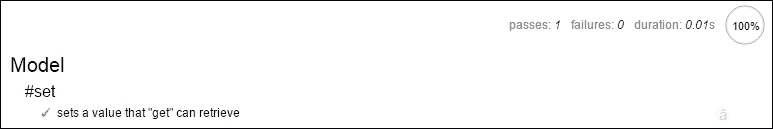

# 第十章. 驱虫之道 – 如何测试 Backbone 应用程序

在本章中，我们将探讨测试 Backbone 应用程序的挑战，包括以下内容：

+   选择单元测试框架

+   在 BDD 和 TDD 测试风格之间做出决定

+   在测试中模拟相关组件

+   使用 Selenium 创建验收测试

# JavaScript 中的测试？

在许多年里，测试 JavaScript 代码的想法是可笑的。毕竟，谁会为一些表单验证脚本编写测试套件呢？此外，即使你正在做一些更有趣的事情，实际上可以从测试中受益，但当时没有 JavaScript 库简化测试，所以不得不从头开始。

2008 年，随着一波新的自动化 JavaScript 测试工具的出现，所有这些库都专注于单元测试或对代码特定部分的测试（通常是一个单独的方法或小型类）。最早的两个单元测试库 QUnit 和 Jasmine 提供了在浏览器中进行测试的对抗性方法（TDD 与 BDD），而第三个库 JS Test Driver 则提供了命令行测试。紧随其后的是其他一些单元测试库，包括 Buster.js 和 Mocha.js，以及测试支持或`mock`库，如 JsMockito、JSMock 和 Sinon.JS。

现在，随着 JavaScript 开发者创建越来越先进的 Web 应用程序（尤其是 Backbone 所可能实现的类型），测试已经成为绝对必要的。测试可以防止由于代码的复杂性而难以甚至无法找到的 bug。更重要的是，也许，一个合适的测试套件允许开发者安全地重构他们的代码，这对于保持代码库可维护性是一个频繁且必要的任务。

到目前为止，如果你正在使用 Backbone 构建一个严肃的 Web 应用程序，那么测试套件不仅仅是一种奢侈，更是一种必需品。

# 选择哪个库

为现代 Web 应用程序构建适当的测试能力需要以下三个主要部分：

+   单元测试框架：一个用于测试代码特定单元（通常是函数或小型类）的工具

+   模拟库：一个通过创建对象的假版本来简化测试的工具

+   接受测试框架：一个用于测试完整用户体验的工具，例如登录您的网站或订购产品

根据你选择的单元测试库，你可能还需要下载额外的工具。例如，许多库提供替代的测试报告风格，这些风格必须单独下载并包含在内。此外，如果你使用的是一个无法在命令行中运行测试的库，你可能希望使用无头浏览器（如非常流行的 PhantomJS）来添加此功能。这样做将使自动化测试更容易，例如，可以定期运行或在代码提交时运行。虽然可以选择多种不同的模拟库（我们将在稍后解释为什么你需要一个），但我们推荐使用最受欢迎的 Sinon.JS。Sinon 既强大又易于使用，因此它几乎适合任何项目。同样，接受测试的主要选项只有一个，那就是 Selenium。我们将在本章末尾讨论 Selenium，所以现在我们将专注于单元测试库的选择。

测试库的质量非常高，功能差异也很多，不可能在这本书中全部正确地涵盖它们。然而，我们确实需要为这一章的示例选择一个库，因此我们选择了 Mocha.js。Mocha 是可用的较新库之一，也是功能最强大和最稳健的库之一。Mocha 可以使用传统的 xUnit/TDD 风格，这种风格被 QUnit 等库所使用，也可以使用由 Jasmine（至少在 JavaScript 中）普及的 BDD 风格。此外，虽然它可以在浏览器中运行，但也可以通过使用 PhantomJS 在命令行中运行。

在所有这些之上，Mocha 为其用户提供选择四种不同的断言库。虽然其他主要测试库将断言作为库本身的一部分（这确实更方便：需要下载的文件更少），但 Mocha 更倾向于给开发者选择。因为断言的实现方式可能存在细微的差异，Mocha 允许你选择风格，这样你可以选择最吸引你的风格。

然而，尽管我们将在这章中使用 Mocha，但我们将要展示的大部分内容实际上将与许多其他流行的测试库的工作方式相似（如果不是完全相同）。

# 开始使用 Mocha

要使用 Mocha，你首先需要从项目的 GitHub 页面（可在[`github.com/mochajs/mocha`](https://github.com/mochajs/mocha)找到）下载`mocha.css`和`mocha.js`文件。你还需要下载一个断言库；在这个例子中，我们将使用`Expect.js`（你可以从[`github.com/Automattic/expect.js`](https://github.com/Automattic/expect.js)下载）。

接下来，你需要创建一个新的 HTML 页面，并为你的应用程序的所有 JavaScript 文件以及所有库文件（例如，Backbone 和 jQuery）添加脚本标签。你还需要添加一些 Mocha 模板代码。总的来说，你应该得到一个看起来像以下这样的 HTML 文件：

```js
<html>
<head>
<!-- External Library Files -->
<script src="img/underscore.js"></script>
<script src="img/jQuery.js"></script>
<script src="img/Backbone.js"></script>

<!-- Application-Specific Files -->
<script src="img/SomeModel.js"></script>
<script src="img/SomeView.js"></script>
<script src="img/SomeOtherNonBackboneCode.js"></script>

<!-- Test Library Files -->
<script src="img/mocha.js"></script>
<link rel="stylesheet" type="text/css" href="/mocha.css"></link>
<script src="img/expect.js"></script>
</head>
<body>
<div id="mocha"></div>
<!-- Test Code -->
<script>
mocha.setup('bdd'); // start Mocha in BDD mode
// *INSERT TESTS HERE*
mocha.run();
</script>
</body>
</html>
```

## TDD 与 BDD：有什么区别？

在前面的代码中，我们调用 `mocha.setup`（bdd），这启动 Mocha 在 BDD 模式下（而不是 TDD 模式）。但这究竟是什么意思？

**测试驱动开发**（**TDD**）是一种开发风格，其中开发者开始所有工作都是通过编写一个（失败的）测试用例。然后开发者只添加足够多的代码到他的应用程序中，以使该测试通过，但不超过这个程度。一旦测试通过，开发者就会编写一个新的（失败的）测试，并重复这个循环。

TDD 的优势有两个。首先，通过始终先编写测试，开发者保证他的代码总是完全被测试覆盖。其次，TDD 风格自然地迫使开发者以可测试的方式编写代码，这意味着采用像写几个短函数而不是一个长函数这样的实践。正如我们在上一章中提到的，这些实践的好处超出了测试环境。

然而，TDD 也有其缺点。也许，最显著的一个是它可能导致过多的、无用的测试，这些测试需要大量的时间来维护。此外，由于其本质，TDD 非常重视代码的“如何”而不是“做什么”，但许多程序员会争论代码的“做什么”对测试来说更为重要。

这种区别在重构时尤其重要。根据定义，当你改变代码执行的方式而不改变其执行的内容时，就需要进行重构操作。由于基于 TDD 的测试非常重视“如何”，每当发生重构时，测试都需要更新以匹配新的代码。

**行为驱动开发**（**BDD**）与 TDD 非常相似，但试图通过关注代码执行的内容来解决与 TDD 相关的问题。这主要通过对组织测试和测试套件的语法进行稍微更详细的描述来实现。当然，一个人不一定需要不同的语法来编写关注代码执行内容的测试，但 BDD 语法的优点是它自然地鼓励这种行为。

考虑以下使用 Mocha 的 TDD 语法和更好的断言库编写的关于 Backbone `Model` 的 `set` 方法的假设测试。它通过创建 `testModel`，设置一个属性（`a`）的值（`1`），然后确认属性/值对已添加到 `Model` 的测试属性中：

```js
suite('Model', function() {
    var testModel;
    setUp(function() {
        testModel = new Backbone.Model();
    });
    suite('set', function() {
        test('set adds a value to the model\'s attributes', function() {
            testModel.set('a', 1);
            assert(testModel.attributes.a === 1);
        });
    });
});
```

如您所见，在 TDD 代码中，测试是通过使用`test`函数来注册的，而测试组则被组织成套件。此外，测试通过使用`assert`语句来验证代码的有效性。现在，让我们看看使用 BDD 语法创建的类似想象中的测试：

```js
describe('Model', function() {
    var testModel;
    beforeEach(function() {
        testModel = new Backbone.Model();
    });
    describe('#set', function() {
        it('sets a value that "get" can retrieve', function() {
            testModel.set('a', 1);
            expect(testModel.get('a')).to.be(1);
        });
    });
});
```

注意这两个测试是多么相似：虽然第一个例子使用了*suite*，而第二个使用了*describe*，但这两个函数都有分组测试的相同效果。同样，在 BDD 示例中，测试仍然被定义，并且仍然包含有效性检查，但测试是通过`it`函数定义的，而不是断言，我们有期望（expect 调用）。

然而，有两个重要的区别，不仅仅是函数名称的差异。首先，后者例子读起来更像一个英语句子，这使得在代码中阅读以及稍后查看测试结果都更容易。其次，更重要的是，第一个测试强调了`set`的工作方式，而第二个则强调了它应该做什么。虽然 TDD 或 BDD 风格中并没有内在的东西强迫测试以某种特定方式编写，但这个例子突出了语法如何仍然可以影响测试的设计。如果 Backbone 开发者将来改变 Backbone 以使用不同于*attributes*的名称，这可能会变得很重要，因为他们将不得不重写第一个测试，而第二个则无需调整即可继续工作。

最终，使用任何一种测试风格都可以测试代码的功能，因此，这实际上只是一个关于你更喜欢哪种风格的问题。然而，如果你对此没有意见，BDD 语法可能是一个更好的起点，这不仅因为其改进的可读性，还因为它自然强调描述代码应该做什么。出于这些原因，我们将继续在本章的其余部分使用 BDD 语法。

## 描述、beforeEach 和 it

如果你之前在其他语言中使用过测试库，你可能已经理解了前面的代码，如果没有，让我来解释一下。测试从对 Mocha 的`describe`函数的调用开始。这个函数创建了一个*套件*（或分组）的测试，你可以选择嵌套更多的`describe`函数来进一步组织你的测试。使用`describe`语句的一个好处是，当你运行测试时，你可以选择只运行由`describe`定义的特定套件，而不是一次性运行所有测试。`describe`函数接受两个参数：一个字符串，表示正在描述的内容，以及一个函数，用于包装`describe`函数内的所有测试。

接下来，我们有一个 `beforeEach` 调用，正如你可能想象的那样，它定义了在每个测试之前运行的代码。这可能是一个有用的地方，用于分离 `describe` 语句中所有测试的共同代码（例如，在前面的例子中创建一个新的 `Backbone.Model` 类）。Mocha 还有一个等效的 `afterEach` 函数，在每个测试完成后以类似的方式运行，可以用来清理测试的副作用。Mocha 还有一个 `before` 和 `after` 函数，它们类似，但它们只在每个 `describe` 语句（即每个测试套件）中运行一次，而不是在每个测试中运行一次。

在另一个 `describe`（这次是为了将相关的 `set` 测试分组），我们来到了 `it` 函数，它实际上定义了一个特定的测试。和 `describe` 一样，`it` 函数接受两个参数：一个字符串，描述了它（被测试的代码）应该做什么，以及一个函数，用于测试是否发生了指示的行为。如果传递给 `it` 函数的函数在完成时没有抛出错误，Mocha 会认为这个测试已经通过，而如果抛出了错误，它将标记该测试为失败（并在测试输出中提供抛出错误的堆栈跟踪，以便您可以轻松地调试相关代码）。

最后，我们有 `expect` 函数（如果选择了不同的断言库，它也可以被称为 `assert` 或其他名称）。`expect` 函数接受一个参数，然后使用类似 jQuery 的链式调用来断言关于第一个参数的内容。以下是一些示例：

```js
expect(1).to.be(1); // asserts that 1 === 1
expect(1).not.to.be(2); // asserts that 1 !== 2
expect(1).to.eql("1") // asserts that 1 == "1"
expect(1).to.be.ok(); // asserts that 1 is "truthy" (evaluates true when used as a boolean)
expect(1).to.be.a('number'); // asserts typeof 1 === 'number'
```

`Expect.js` 库还有其他几种断言形式，所有这些都可以在它们的 GitHub 页面上找到详细说明。

## 运行我们的测试

现在我们已经了解了所有的工作原理，让我们尝试实际运行我们的测试。为此，只需将以下行替换为我们之前提供的 `describe` 代码即可：

```js
// *INSERT TESTS HERE*
```

或者，你也可以选择将 `describe` 代码放入一个单独的文件中，并用一个引用此文件的脚本标签替换插入行。无论哪种方式，保存文件并在您最喜欢的网络浏览器中打开它。你应该会看到类似以下内容：



我们的测试通过了！

# 介绍模拟

只要我们正在测试的代码相对简单，Mocha 和 Expect.js 就足够我们测试了。然而，代码很少保持简单，特别是有两个复杂问题可能会让我们需要另一个工具，即所谓的 `mocking` 库，让我们能够创建对象的假版本或模拟。

首先，让我们想象我们想要测试一个虚构的 `ExampleModel` 类的以下方法：

```js
foo: function() {
    this.bar += 1;
    this.baz();
}
```

现在，我们将想要测试我们的 `foo` 方法是否调用了 `baz` 方法。然而，与此同时，我们（可能）已经有一个针对 `baz` 方法本身的单独测试。这让我们陷入了两难：如何在 `foo` 的测试代码中测试 `foo` 调用 `baz` 而不重复 `baz` 的测试代码？

或者，让我们考虑另一个可能想要测试的虚构方法：

```js
fetchThenDoFoo: function() {
    this.fetch().done(this.foo);
}
```

在这种情况下，我们想要测试在 `fetch` 操作完成后是否调用了 `foo`，但要真正测试这一点，我们需要通过 AJAX 从服务器实际获取一个 `Model` 类。这反过来会使我们的测试需要活跃的服务器，从而使测试速度显著减慢，并可能导致测试对服务器产生副作用。

解决这两个问题的方法是使用一个模拟库，如 `Sinon.js`。为此，只需从 [`sinonjs.org/`](http://sinonjs.org/) 下载 sinon.js，然后通过一个 `script` 标签将此文件包含在运行测试的 HTML 页面上。

一旦 Sinon 可用，我们就可以用它来解决我们的测试问题。首先，让我们用它来为我们的 `foo` 方法创建一个特殊的模拟类型 `stub`，如下所示：

```js
describe('foo', function() {
    var bazStub,
        example;
    beforeEach(function() {
        example = new ExampleModel();
        // Replace the real "baz" with a fake one that does nothing
        bazStub = sinon.stub(example, 'baz');
    });
    it('calls baz', function() {
        example.foo();
        expect(bazStub.calledOnce).to.be(true); // did foo call baz?
    });
    afterEach(function() {
        // Restore the original baz (in case another test uses it)
        baz.restore();
    });
});
```

如您在前面的代码中所见，我们能够使用 Sinon 创建一个 `stub` 来替换正常的 `baz` 方法。虽然这个 `stub` 实际上没有做什么，但它确实跟踪了它被调用的次数（以及使用了哪些参数，尽管我们没有测试这一点），这使得我们能够编写一个测试，确保 `foo` 会调用 `baz`，而无需重复任何 `baz` 的测试代码。

对于我们的第二个问题，即测试 AJAX 方法，我们可以使用一个特定的 AJAX 模拟工具，如 MockJax。然而，Sinon 的功能如此强大，我们实际上真的不需要使用任何其他工具；考虑以下测试：

```js
describe('fetchThenDoFoo', function() {

    var fetchStub,
        fooStub,
        example;
    beforeEach(function() {
        example = new ExampleModel();
        // Replace the real "fetch" with a fake one that returns an
        // already-resolved $.Deferred
        var deferred = new $.Deferred().resolve();
        fetchStub = sinon.stub(example, 'fetch').returns(deferred);
        // Since we only want to test whether or not foo was called,
        // we can also use stub for it
        fooStub = sinon.stub(example, 'foo');
    });
    it('calls foo after fetch completes', function() {
        example.fetchThenDoFoo();
        expect(fooStub.calledOnce).to.be(true);
    });
    afterEach(function() {
        // Restore the original versions of our stub functions
        fetchStub.restore();
        fooStub.restore();
    });
});
```

在这个例子中，我们使用了两个 `stub` 函数。我们使用 `fooStub` 函数的方式与我们在上一个例子中使用 `bazstub` 函数的方式相似，以检查 `foo` 是否被调用，但我们的 `fetchStub` 扮演了不同的角色。通过在 `stub` 创建时链式调用 `returns` 方法，我们创建了一个 `stub` 函数，与之前的 `stub` 函数不同，它实际上做了些事情：它返回了我们的已解析的延迟函数。由于 jQuery 将已解析的延迟函数处理方式与它处理完成的 AJAX 调用的方式相同（通过调用调用的任何完成代码），我们模拟了 AJAX 调用的返回，而不涉及任何实际的服务器。

Sinon 还有许多与 `stub` 相关的其他有用方法，以及其他类型的模拟函数，如 `spy` 和 `mock`，所有这些都在他们的网站上得到了很好的文档说明。Sinon 还有一个名为 `sandbox` 的功能，它可以在每次测试运行后（当 `sandbox` 被清理时）自动激活，从而消除所有的 `baz.restore()` 代码。同样，你可以在 Sinon 的网站上找到这个功能的所有详细信息。

# Selenium

到目前为止，我们一直专注于单元测试，但值得一提的是，还有许多其他形式的测试可以惠及 Backbone 应用程序，例如负载测试、冒烟测试和可用性测试。然而，对所有这些测试的详细讨论超出了本书的范围，并且在大多数工作环境中，这些测试通常不由开发团队负责。相反，它们将由质量保证（QA）部门管理。

然而，有一种测试类型，即验收测试，值得特别提及。在缺乏质量保证（QA）部门的较小组织中，验收测试通常由开发者创建和维护，即使在较大的组织中，开发者协助创建和维护这些测试的情况也并不少见。

验收测试通过检查用户是否能够执行特定操作来测试您网站的功能。一个特定的验收测试可能会检查用户是否可以登录网站、更改密码或下订单。与测试较小功能部分（如单个`placeOrder`函数）的单元测试不同，验收测试验证了用于完成特定用户交互的所有不同功能。

在网络上，有一个工具几乎完全主导了验收测试：Selenium WebDriver ([`www.seleniumhq.org/`](http://www.seleniumhq.org/))。Selenium WebDriver 允许您创建自动化的测试，这些测试可以完美地模拟真实用户在您网站上的操作。Selenium 测试可以点击按钮、填写文本字段、滚动，以及做几乎任何实际用户能做的事情。

Selenium 支持多种不同的语言，包括 JavaScript。它可以直接通过 Selenium WebDriver 使用（[`code.google.com/p/selenium/wiki/WebDriverJs`](https://code.google.com/p/selenium/wiki/WebDriverJs)）或者被一个提供不同语法的库（如 Nightwatch.js ([`nightwatchjs.org/`](http://nightwatchjs.org/)))包装。以下是从 Nightwatch.js 主页上的一个示例，展示了使用 Nightwatch.js 编写的简单验收测试：

```js
module.exports = {
    'Demo test Google' : function (client) {
        client
          .url('http://www.google.com')
          .waitForElementVisible('body', 1000)
          .assert.title('Google')
          .assert.visible('input[type=text]')
          .setValue('input[type=text]', 'rembrandt van rijn')
          .waitForElementVisible('button[name=btnG]', 1000)
          .click('button[name=btnG]')
          .pause(1000)
          .assert.containsText('ol#rso li:first-child',
            'Rembrandt - Wikipedia')
          .end();
  }
};
```

如前例所示，Nightwatch.js（以及 Selenium 本身）使用与您已经用于 CSS 和 jQuery 相同的选择器，以及如`waitForElementVisibility`之类的特殊方法来控制时间并防止自动化脚本在测试中移动过快。这允许您模拟任何您想要的用户故事，无论它多么简单或复杂，然后，反复重复这个故事来测试您的网站。

然而，基于 Selenium 的测试确实有其局限性，最大的局限性在于 Selenium 在用户级别操作，对代码级别发生的事情没有意识。如果一个 Selenium 测试失败，它不会提供堆栈跟踪或指向失败的代码行；相反，它只会简单地提醒你某个特定操作失败了，而调试工作将取决于你手动完成，就像处理用户提交的缺陷一样。理想情况下，你应该尽量在你的单元测试套件中捕捉尽可能多的失败，并且只依赖基于 Selenium 的验收测试来发现那些在单元测试中“漏网之鱼”的缺陷。

# 摘要

在本章中，我们学习了如何结合各种工具来测试您的 Backbone 应用程序。我们了解了 TDD 和 BDD 之间的区别，以及 QUnit 和 Jasmine 等主要测试库之间的差异。我们深入探讨了如何使用 Mocha 框架创建测试套件，以及如何使用 Sinon 库在该套件中模拟代码的部分。

在下一章中，我们将探讨各种其他第三方工具，这些工具可以帮助您创建 Backbone 应用程序。我们将查看通用工具，例如 Require.js 依赖管理系统，以及 Backbone 特定的工具，例如 BackGrid 和 BackSupport。
