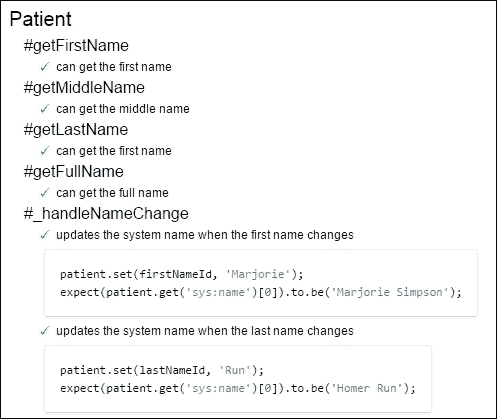

# 第十二章。总结和进一步阅读

在本章中，我们首先回顾了前几章中我们所涵盖的所有内容。然后我们看看 Backbone 是如何被用来驱动一个真实世界的医疗应用的，最后，我们展望一下你如何继续你的 Backbone 学习。特别是我们将涵盖以下内容：

+   总结各种 Backbone 组件的角色

+   了解 Backbone 今天是如何被用来驱动 Syapse 的

+   考虑一下我们所学的所有内容是如何应用到 Syapse 用例中的

+   看看进一步学习 Backbone 的机会

# 将所有这些放在一起

在这本书的前半部分，我们研究了四个 Backbone 类（`Collection`、`Model`、`Router`和`View`），以及它们如何组合在一起构建一个 Web 应用。为了回顾，一个由 Backbone 驱动的网站从`Router`类开始，该类用于将 URL 映射到应用的虚拟页面。`Router`构成了 MVC `Controller`层的一半，而`View`类构成了另一半。`View`类还负责 Web 应用的 MVC `View`层，因为`View`类不仅渲染构成网站的页面，还监听并响应用户生成的事件。

当然，数据或 MVC `Model`层对于几乎任何应用都是必不可少的，这个层由`Model`和`Collection`类处理。代表单个数据对象的`Model`类，既用于管理客户端的数据，也用于向服务器发送和接收数据。`Collection`类持有`Model`类的集合，但除此之外，它们在管理数据和将其传输到/从服务器方面被用于类似的方式。`Model`和`Collection`类主要被`View`类使用，这些类将它们的数据渲染到 DOM 元素中。

所有这些类不仅设计为直接使用，而且还可以扩展到具有特定于您应用程序的逻辑的新子类。第三方 Backbone 库，如 BackGrid 和 BackSupport，使用相同的扩展机制来提供进一步扩展您应用程序功能的组件。然而，Backbone 特定的库并不是您可以在 Backbone 应用程序中使用的唯一第三方库。通过将非 Backbone 组件包装在您自己的自定义 Backbone 类中，您可以干净地集成模板系统或 jQuery UI 小部件等工具到您的应用程序中。即使不能包装在 Backbone 类中的库，如 Underscore、RequireJS 或 Mocha，也可以独立使用以添加功能，而不会失去 Backbone 本身的任何好处。

简而言之，这总结了到目前为止我们所学的所有内容，但由于我们最初是逐个介绍这些信息的，所以我们一次只关注一个组件。随着这本书的完成，回顾一下所有这些部分如何共同用于实现一个真实世界的用例将是有益的。这个用例是 Syapse。

# Syapse 是什么？

如第一章中所述，*使用 Backbone 构建单页网站*，Syapse([`www.syapse.com`](http://www.syapse.com))是一个由 Backbone 驱动的 Web 应用程序，用于请求和提供精准医疗结果。Syapse 的客户是使用基因测序来分析患有严重疾病（如癌症）的患者的实验室和医院。一旦测序，这些基因图谱可以与大量研究相结合，根据患者的 DNA 确定针对特定患者的最佳治疗和剂量。

让我们来看看 Syapse 是如何构建的。

## 俯瞰全局

Syapse 的客户端代码使用 Require.js 进行组织（参见第十一章中的*使用 RequireJS 进行依赖管理*，*(不)重新发明轮子：利用第三方库*)。每个模块要么是一个类，要么是一个单例实例（用于实用库），要么是一个函数（用于路由）。Syapse 有两个不同的网站，一个用于实验室，另一个用于诊所，因此我们使用 RequireJS 为每个网站编译单独的 JavaScript 文件。

每个这些文件都有自己的 Backbone `Router`，允许每个网站拥有完全不同的 URL 和页面集（参见第六章中的*多路由*）。

*使用路由器创建客户端页面*)。这些`Router`类构成了 RequireJS 依赖树的顶层，引入（或依赖于）网站的所有路由。这些路由模块随后引入网站的用户界面`Views`类，这些类反过来又引入网站的`Model`和`Collection`类。

应用程序中的每个其他类都继承自四个“基础”类。这些基础类基于 BackSupport 类（参见第十一章中的*使用 BackSupport 简化生活*，*(不)重新发明轮子：利用第三方库*)，并用于定义 Syapse 特有的新功能。例如，由于 Syapse 使用 Handlebars 模板库，基础`View`类包含了渲染 Handlebars 模板的逻辑（参见第十一章中的*使用 Handlebars 进行模板化*，*(不)重新发明轮子：利用第三方库*)。

Syapse 使用 `Page View` 模式（参见第五章中的 *页面视图*，*使用视图添加和修改元素*），为实验室界面使用一个基 `Page View` 类，为诊所界面使用另一个。这些渲染了网站在页面之间共享的所有部分，例如导航菜单，这两个 `Page View` 模式共享一个共同的基 `View` 类，允许它们重用两个网站共有的通用页面渲染逻辑。

## 视图层

Syapse 实验室网站中的页面分为三个部分，每个部分都有自己的 `View` 类：一个左侧导航部分、一个页眉区域和一个主要内容区域。在页面实例化时，这些部分可以可选地被覆盖，这样每个路由只需修改其独特的部分。例如，大多数路由不会更改左侧导航栏，因此当这些路由实例化页面 `View` 类时，它们只是依赖于这个 `View` 类的默认导航栏。

每个 `View` 的子类都处理页面一部分的渲染。因为 Syapse 依赖于 *The combined approach*（参见第五章，*使用视图添加和修改元素*) 来进行渲染，这些 `View` 类使用 Handlebars 模板和其他子 `View` 类的组合来生成其内容。对于特别复杂的页面，这可能会导致不仅子 `View` 类，还有孙子、曾孙，有时甚至曾曾孙 `View` 类。只要可能，Syapse 都会使用多个较小的 `View` 类而不是一个大的类，以使每个 `View` 类的逻辑尽可能简单。

为了保持一致性，这些 `View` 类中的所有渲染方法都返回这个结果。此外，为了保持一致性，每个 `View` 类都设计为可重新渲染的，这样它就可以轻松地监听和响应其 `Model` 类中的更改事件（参见第五章中的 *其他渲染考虑因素*，*使用视图添加和修改元素*）。

## 数据层

在服务器端，Syapse 使用 Python 和 Django REST 框架库来驱动其所有 API，虽然这给了服务器团队对 API 的很大控制权，但他们仍然受到库的限制，不能总是创建返回理想 Backbone JSON 的 API。因此，Syapse 的许多 `Model` 和 `Collection` 类都使用 `parse` 和 `toJSON` 方法重写来从 API 中提取或发送正确的 JSON（参见第三章中的 *从服务器获取数据* 和 *将数据保存到服务器*，*使用模型访问服务器数据*）。

有时，Syapse 的 API 不仅返回特定 `Model` 或 `Collection` 类的数据，还返回补充信息。例如，返回患者 `Model` 类的 API 可能包括该患者医生的 ID，但由于最终用户希望看到名称而不是 ID，API 响应还包括一个 ID 到名称的单独映射。为了跟踪这些补充信息，Syapse 依赖于一个全局的 pub/sub 系统（参见第七章 *将方钉嵌入圆孔 - 高级 Backbone 技巧* 中的 *发布/订阅* Chapter 7，*将方钉嵌入圆孔：高级 Backbone 技巧*）。每当 `Model` 类在获取过程中解析这样的补充信息时，它就会触发一个带有此信息作为额外参数的“补充信息”特殊事件。然后，一个或多个网站范围的 `Collection` 缓存会监听此事件，聚合补充信息并将其提供给 `View` 类。

## 支持层

Syapse 的所有代码都使用 Selenium 进行验收测试，以及 Mocha/Sinon 进行单元测试（参见第十章 *如何测试 Backbone 应用程序* 中的 *Testing? In JavaScript?* 和 *Selenium* Chapter 10，*如何排除错误：如何测试 Backbone 应用程序*）。通过使用表达式的测试名称和 BDD 测试输出风格（参见第十章 *TDD 与 BDD：有什么区别？* Chapter 10，*如何排除错误：如何测试 Backbone 应用程序*），我们确保 Syapse 的测试输出非常具体，如下所示：

对于文档，Syapse 主要依赖于内联文档，使用 JSDoc 注释而不实际渲染文档页面（参见第九章 *我在想什么？记录 Backbone 代码* 中的 *健壮的文档方法* Chapter 9，*我在想什么？记录 Backbone 代码*）。然而，Syapse 还有一个面向客户的 JavaScript API，其文档比生成的 JSDoc API 页面和基于 Docco 的教程都要详细得多。

# 构建自己的 Syapse

您的应用程序可能像 Syapse 一样，是一个旨在帮助解决关键问题（如对抗癌症）的严肃工具。或者，您的应用程序可能更有趣，比如一个游戏或个人项目。在两种情况下，Backbone 都提供了您构建网站所需的一切，并且在整个生命周期中继续添加和维护网站。

然而，没有一本书能解释清楚像 Backbone 这样灵活且强大的库的每一个可能的细微差别。在核心上，Backbone 努力只做好几件重要的事情，并将其他所有事情留给您，即程序员。这不仅意味着巨大的力量和灵活性，还意味着您必须自己做出大量决定，以确定您想要如何使用 Backbone。为了做出正确的决定，真正利用 Backbone 提供的一切，您无疑会想要继续尽可能多地学习关于 Backbone 以及一般网络开发的知识。

# 进一步阅读

了解 Backbone 的地方有很多，但或许，最好的地方就是 Backbone 的自身源代码。作为 Backbone 和 Docco 的作者，杰里米·阿什肯纳斯（Jeremy Ashkenas）使用 Docco 文档工具提供 Backbone 源代码的注释版本，您可以在[`backbonejs.org/docs/backbone.html`](http://backbonejs.org/docs/backbone.html)找到它。

然而，您不需要注释版本来阅读 Backbone 的代码。实际上，每当 Backbone 的某个部分看起来令人困惑或难以理解时，学习更多的一个最好的方法是将调试语句抛入 Backbone 源代码本身，然后使用浏览器的调试工具运行您的应用程序。通过在调试器中遍历代码，您可以看到逻辑在 Backbone 的类和方法中逐步推进，而且由于源代码写得非常好且易于阅读，这项任务将比几乎任何其他主要的 JavaScript 库都要简单得多。

Backbone 还提供了一个位于 [`github.com/jashkenas/backbone/wiki`](https://github.com/jashkenas/backbone/wiki) 的维基百科。除了基本 Backbone 信息外，这个维基还包含了插件和开发工具的集合、使用 Backbone 的公司列表，以及大量的教程和信息性博客文章。这个后者列表（可在 [`github.com/jashkenas/backbone/wiki/Tutorials,-blog-posts-and-example-sites`](https://github.com/jashkenas/backbone/wiki/Tutorials,-blog-posts-and-example-sites) 找到）尤其有价值，有超过五十个不同的高质量网站，您可以在这些网站上了解更多关于 Backbone 的信息。

Backbone 的另一个信息来源是 Packt Publishing，它提供了许多专注于 Backbone 的书籍。虽然它们确实覆盖了与本书相同的一些基础知识，但你可能会发现 Andrew Bugess 编写的 *BackboneJS Blueprints* 中的示例应用程序或 Vadim Mirgood 编写的 *Backbone.js Cookbook* 中的食谱很有价值。如果你更喜欢更深入地了解你可以使用的有用 Backbone 模式，那么 Swarnendu De 的 *Backbone.js Patterns and Best Practices* 可能对你很有用。此外，如果你对 第十章 *消除虫子：如何测试 Backbone 应用程序* 感兴趣，那么 Ryan Roemer 的 *Backbone.js Testing* 是你学习 Backbone 测试的完美文本。

然而，尽管书籍很棒，但它们永远无法完全跟上新兴 Backbone 技术的最新发展，这就是某些网站可以非常有价值的地方。一个令人难以置信的资源是 Stack Overflow ([`www.stackoverflow.com`](http://www.stackoverflow.com))，任何倾向的程序员都可以在这里找到他们技术问题的答案，包括关于 Backbone 的问题。然而，当你没有具体问题时，Stack Overflow 同样很有价值。因为该网站在每个问题都有 *标签* 和 *投票*，你可以搜索带有 `backbone.js` 标签的问题，然后按投票排序；顶部的问题很可能是有教育意义的。在撰写本文时，Stack Overflow 特点了超过 12,000 个不同的 Backbone 问题及其答案（总共有超过 17,000 个问题）。

另一个类似的问题和答案网站，它不是以编程为重点的是 Quora ([`www.quora.com/`](https://www.quora.com/))。虽然 Stack Overflow 限制自己只回答客观问题，但 Quora 没有这样的限制，因此非常适合回答更主观的问题，例如“Backbone.js 的优势是什么”([`www.quora.com/What-are-the-advantages-of-Backbone-js`](http://www.quora.com/What-are-the-advantages-of-Backbone-js))。

另一个了解 Backbone 的优秀地方是 Backbone Google Group ([`groups.google.com/forum/#!forum/backbonejs`](https://groups.google.com/forum/#!forum/backbonejs))，这里有一个活跃的社区。另一方面，如果你更喜欢关注一系列新闻文章，Reddit 上的 Backbone 子版块 ([`www.reddit.com/r/backbonejs/`](http://www.reddit.com/r/backbonejs/)) 是一个很好的资源，可以帮助你保持最新信息。最后，在更广泛的意义上，Hacker News ([`news.ycombinator.com/`](https://news.ycombinator.com/))、Lobsters ([`lobste.rs`](https://lobste.rs)) 和 Dzone ([`www.dzone.com/links/index.html`](http://www.dzone.com/links/index.html)) 都提供了各种编程相关新闻和文章的连续更新，包括许多关于 JavaScript（特别是 Backbone）的文章。

# 摘要

在本章中，我们回顾了前十一章的内容，并总结了如何使用 Backbone 构建健壮的 Web 应用的模式。我们还特别探讨了 Backbone 如何被用于构建抗癌应用 Syapse。最后，我们考察了其他你可以学习更多关于 Backbone 的地方，包括 Packt 出版的其他优秀书籍。我们希望你喜欢这本书，并祝愿你在使用 Backbone 创建强大的 Web 应用时一切顺利。
