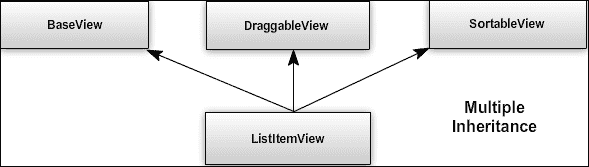
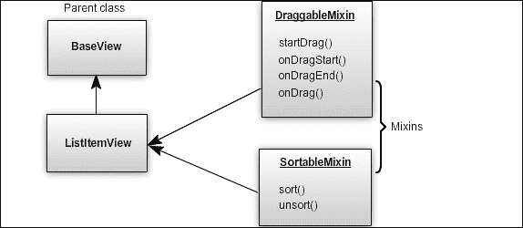

# 第一章. 通过插件开发减少样板代码

> "当你在涉及大量 JavaScript 的 Web 应用上工作时，你最先学到的一件事就是停止将你的数据绑定到 DOM 上。创建 JavaScript 应用变得过于简单，最终结果可能是一堆混乱的 jQuery 选择器和回调函数，它们疯狂地试图在 HTML UI、你的 JavaScript 逻辑和服务器上的数据库之间保持数据同步。对于富客户端应用，一种更结构化的方法通常更有帮助。"

来自[`backbonejs.org`](http://backbonejs.org)的上一段摘录精确地指定了 Backbone.js 解决的问题。Backbone.js 提供了一种简化 JavaScript 应用程序结构的方法，这在几年前甚至是一个噩梦。今天，我们已经从紧密耦合的基于 jQuery 的应用程序发展到重型前端应用程序，现在应用程序逻辑的大部分现在依赖于 UI 部分。这意味着组织应用程序结构现在是应用程序开发中最重要的一面，应该注意应用程序组件的可重用性、模块化和可测试性。

作为一个非常轻量级的库，Backbone.js，连同实用库 Underscore.js，提供了一套工具，帮助您组织代码，并使开发单页 Web 应用变得更加容易。Backbone 提供了一种简约的解决方案来分离应用程序的关注点；功能包括 RESTful 操作、持久策略、模型、带逻辑的视图、事件驱动的组件通信、模板和路由功能。其简洁的本质、优秀的文档以及庞大的开发者社区使得学习如何使用这个库变得容易。

然而，为了开发一个健壮的系统，我们不仅仅依赖于框架的基本功能组件；我们必须使用许多其他库、插件和可重用的附加组件来支持核心系统。虽然 Backbone.js 及其核心组件提供了一种在基础级别结构化应用程序的方法，但直到我们开发自己的或使用其他开源扩展、插件和有用的模式，这还远远不够。为了创建坚实的软件架构，我们需要充分利用现有组件并遵循适当的设计模式。这正是我们在这本书中想要提供的。

这不是一本通用介绍书，我们期望我们的读者对 Backbone.js 框架有一个基本的了解。如果你是初学者，正在寻找开始 Backbone.js 的好资源，我们建议你参考这本书的附录 A，即*书籍、教程和参考资料*，其中我们列出了一些有用的资源，以帮助你掌握 Backbone.js。

我们将首先了解如何通过开发自定义扩展、插件和混入来重用我们的代码并减少样板代码。在后面的章节中，我们将开始讨论每个 Backbone.js 组件的常见问题、技巧、模式、最佳实践和开源插件。我们还将了解如何使用 Backbone.js 来构建和设计复杂的 Web 应用程序，并理解基于 JavaScript 应用程序的基本单元测试。此外，我们不是开发跨越所有章节的单个应用程序，而是试图在本书的每个主题上提供简单而完整的示例。在本章中，我们将通过示例学习一些重要主题。这些主题和概念将在后续章节中多次使用。它们如下：

+   **Backbone.js 的基本组件**: 这包括对 Backbone 组件定义的简要讨论

+   **Underscore.js 的使用**: 这包括对 Underscore.js 的简要讨论以及使用此库进行基于 JavaScript 的项目的好处

+   **使用扩展重用代码**: 这包括通过将常用代码块移动到父级类中来重用 Backbone 代码

+   **Backbone 混入**: 这包括对混入的解释以及如何以及在哪里与 Backbone 一起使用混入

# Backbone.js 的基本组件

在进入插件开发部分之前，我们将探讨 Backbone.js 和 Underscore.js 的一些基本概念。Backbone.js 是一个客户端 MV*框架，提供了一套构建 JavaScript 应用程序所需工具和构建块。Backbone.js 提供的重要工具有以下几项：

+   `Backbone.Model`: 模型是应用程序的实体，存储数据并包含一些与数据相关的逻辑，如验证、转换和数据交互。

+   `Backbone.View`: 视图将组织您的**文档对象模型**（**DOM**）界面到逻辑块中的概念呈现出来，并在其中表示模型和集合数据。视图是组织所有 JavaScript 事件处理程序和通过可选使用 JavaScript 模板在应用程序中添加动态 HTML 内容的优秀工具。由于 Backbone 遵循 MV*模式，Backbone 视图主要作为演示者工作，并负责应用程序功能的大部分。

+   `Backbone.Collection`: 集合是一组模型。集合包含许多功能以及 Underscore 实用方法，以帮助您处理多个数据模型。

+   `Backbone.Router`: 路由器提供客户端页面路由的方法，并在浏览器 URL 发生变化时相应地执行。路由器根据 URL 变化维护应用程序状态。

+   `Backbone.Events`: 事件是 Backbone 中的一个重要概念，因为它们提供了一种使用发布/订阅模式并解耦应用程序组件的机制。

除了这些，还有一些其他工具，例如`Backbone.History`，它根据路由器管理浏览器历史记录和后退/前进按钮。还有`Backbone.Sync`，这是一个提供对 Backbone 模型和集合通过网络访问的优雅抽象的单个方法。

# 使用 Underscore.js

Underscore.js ([`underscorejs.org/`](http://underscorejs.org/))是一个强大的实用库，为你的 JavaScript 代码提供了大量的函数式编程支持。一般来说，JavaScript 本身提供的实用方法非常有限，大多数时候我们需要自己开发函数或者依赖其他库来获得这些方法。Underscore 提供了一系列高效的实用方法，使其成为 JavaScript 项目的优秀工具。它提供的函数可以分为以下几类：

+   集合（数组或对象）

+   数组

+   函数

+   对象

+   工具

+   连接操作

这些包括迭代、排序、过滤、转换、模板、比较、作用域绑定等功能。使用这个小型库的主要好处如下：

+   它帮助你使 JavaScript 代码更加直观和简洁。

+   除了方便的方法外，Underscore 还实现了更现代浏览器中可用的 JavaScript 函数的跨浏览器版本。Underscore 会检测浏览器是否支持该方法，如果存在，则使用原生实现。这在很大程度上提高了函数的性能。

+   库的压缩和 gzip 版本仅重 4.9 KB，这几乎没有任何理由不利用这个库。

+   该库完全无 DOM——因此你也可以在服务器端 JavaScript 代码中使用它。

+   与 Backbone.js 类似的优秀文档，包含示例，可在[`underscorejs.org/`](http://underscorejs.org/)找到。

Backbone.js 对 Underscore.js 有硬依赖，如果你使用 Backbone.js 开发应用程序，你必然会用到它。然而，即使你不使用 Backbone，我们也鼓励你在 JavaScript 项目中使用 Underscore.js。它不会增加任何开销，易于集成，即使你并不了解这个库所使用的所有底层工程原理，它也能让你的代码更加健壮。

另有一个名为`Lo-dash` ([`lodash.com`](http://lodash.com))的库，它提供了一个 Underscore 库，用于替换 Underscore.js 库。据说它的性能略优于 Underscore.js。你可以尝试使用它们中的任何一个来实现相同的结果。

# 使用扩展重用代码

与其他库相比，Backbone 是一个非常小的库。任何复杂的应用程序都可以使用 Backbone 来构建和开发，但该框架本身并不包含预构建的小部件或可重用的 UI 组件。在本节中，我们将讨论一些 Backbone 和 JavaScript 技巧，这些技巧将帮助您构建一个可重用的界面库。

对于简单和小的应用程序，代码的可重用性并不总是那么必要。但随着您继续创建具有多个视图、模型和集合的应用程序，您会发现代码的某个部分被重复多次。在这种情况下创建可重用的扩展和插件可以通过增强模块化和减少代码大小来提高应用程序的性能。让我们创建一个简单的 Backbone 视图来了解我们如何创建扩展，如下面的代码片段所示：

```js
var User = Backbone.Model.extend({
  defaults: {
    name: 'John Doe'
  }
});

var UserItemView = Backbone.View.extend({
  template: '<span><%= name %></span>',
  render: function () {
    var tpl = _.template(this.template),
      html = tpl(this.model.toJSON());

    this.$el.html(html);
    return this;
  }
});

// Create a view instance passing a new model instance
var userItem = new UserItemView({
  model: new User
});

$(document.body).append(userItem.render().el);
```

命名为 `UserItemView` 的视图是一个简单的 Backbone 视图，我们想在模板中显示我们的模型数据，并将此视图元素附加到 DOM 中。这是 Backbone 的基本功能，其主要要求是以视图的形式显示模型的数据。如果我们有另一个具有相同模型的类似视图，并且它具有相同的功能，那么 `render()` 函数也将是相同的。那么，如果我们把通用代码移动到基类并将该类扩展以继承功能，这不是很有益吗？答案是肯定的。让我们看看以下示例部分中我们如何做到这一点。

## 创建基类

我们创建了一个 `BaseView` 类，其中添加了如 `render()` 方法等常见功能。然后所有其他视图类都可以从这个基类扩展，并最终继承渲染功能。以下是一个具有最小渲染功能的 `BaseView` 类：

```js
// Parent view which has the render function
var BaseView = Backbone.View.extend({
  render: function () {
    var tpl = _.template(this.template),
      data = (this.model) ? this.model.toJSON() : {},
      html = tpl(data);

    this.$el.html(html);
    return this;
  }
});
```

现在，`UserItemView` 将会看起来更好。我们将扩展 `BaseView` 类，并只提供以下模板：

```js
// A simpler view class
var UserItemView = BaseView.extend({
  template: '<span><%= name %></span>'
});
```

### 小贴士

**下载示例代码**

您可以从您在 [`www.packtpub.com`](http://www.packtpub.com) 购买的所有 Packt 书籍的账户中下载示例代码文件。如果您在其他地方购买了这本书，您可以访问 [`www.packtpub.com/support`](http://www.packtpub.com/support) 并注册以直接将文件通过电子邮件发送给您。

如果您想在视图的 `render()` 方法中添加一些额外的功能，例如调用另一个函数，您可以覆盖基类的 `render` 方法。请查看以下示例：

```js
var UserItemView = BaseView.extend({
  tagName: 'div',
  template: '<span><%= name %></span>',
  render: function () {
    // Call the parent view's render function
    BaseView.prototype.render.apply(this, arguments);

    // Add your code here
    this.anotherFn();
    return this;
  },

  anotherFn: function () {}
});
```

根据您的需求，您可以将许多功能移动到您的基类中。例如，在一个非平凡的应用程序中，我们经常需要用另一个视图替换一个视图，通过从 DOM 中移除旧视图来销毁它，并清理其他依赖项。因此，我们可以在 `BaseView` 中添加一个 `close()` 方法（如下面的代码所示），它可以处理每个视图移除机制。

```js
var BaseView = Backbone.View.extend({
  render: function () {
    var tpl = _.template(this.template),
      data = (this.model) ? this.model.toJSON() : {},
      html = tpl(data);

    this.$el.html(html);
    return this;
  },

  close: function () {
    // Extra stuff goes here

    // Remove the view
    this.remove();
  }
});
// This is not production-ready code, but it clearly gives you the concept of using custom widgets to reduce boilerplate in your code. It will not always be necessary to extend a Backbone class to create a plugin.
```

## 不扩展基类开发插件

有时候我们发现，创建一个构造函数并向其原型添加方法，可能比扩展 Backbone 基础类更好。例如，在以下代码的`Pagination`插件中，我们不会通过扩展`Backbone.Collection`来创建`PaginationCollection`类，我们更倾向于选择一个更简单的类——一个接受两个参数的构造函数：一个集合和每页要显示的项目数量。

```js
// Pagination constructor function
var Pagination = function (collection, noOfItemsInPage) {
  if (!collection) {
    throw "No collection is passed";
  }
  this.currentPage = 1;
  this.noOfItemsInPage = noOfItemsInPage || 10;
  this.collection = collection;
}

// Use Underscore's extend method to add properties to your plugin
_.extend(Pagination.prototype, {
  nextPage: function () {},
  prevPage: function () {}
});

var User = Backbone.Model.extend({
  defaults: {
    name: 'John Doe'
  }
});

var Users = Backbone.Collection.extend({
  model: User
});

var paging1 = new Pagination(10, new Users());
var paging2 = new Pagination(20, new Users());
```

我们没有添加实际的功能，只是展示了`Pagination`类可能的样子。当你已经有一个集合并且想要实现分页而不扩展父集合类时，你可以观察到这种好处。我们在构造函数中添加了成员变量，这样这个类的单个实例就可以有自己的变量集。另一方面，方法被添加到类的原型中，这样它们就可以被类的所有实例共享。

当你需要一个不是 Backbone 视图、模型或集合类型的自定义插件时，这种机制可能很有用。

# 理解 JavaScript 混入

在上一节中，我们看到了从父类原型继承属性提供了大量的可重用性。在某些情况下，我们可能希望在多个视图、模型或集合中重用类似的方法。这可以通过创建一个它们可以扩展的父类来实现；然而，这并不总是一个好的做法，因为它创建了一些不必要的层和无意义的子类型。

例如，假设你想要将`UserItemView`视图元素（它已经扩展了`BaseView`）设置为可拖动的。因此，你包含一个扩展`BaseView`类的`DraggableView`类，并且你的`UserItemView`扩展了`DraggableView`。现在突然出现了需求变更，你被要求将名为`UserItemView`的视图也设置为可排序视图。你会引入另一个新的类`SortableView`并将其放在某个链中吗？如果是的话，那么这种多层继承肯定会创建一个绝对难以管理和令人沮丧的逻辑。看看以下图表，它以更好的方式描述了这种情况：



## 什么是混入？

幸运的是，JavaScript 中有一个可行的替代方案，称为 **混入**。在一般计算机科学中，混入是一个提供与特定类型相关的一组函数的类。这些混入类不会被实例化，但它们的函数只是被复制到主类中，以在不进入继承链的情况下实现类似继承的行为。看看以下图表来理解这个概念：



我们有一个 `ListItemView` 类，它扩展了 `BaseView` 类，并代表列表的一个单独的项目。现在我们想让这些项目可拖动。我们如何实现这一点？在 `ListItemView` 类中添加一些处理拖动功能的方法怎么样？这种方法是可行的，但如果还有更多组件也需要可拖动，那么我们必须创建一个具有这些方法的可重用对象，并在所有所需的类中使用该对象。这就是混入概念——一组将被复制到需要此功能的类中的方法。

## 创建经典混入

最基本的混入定义将是一个具有一些属性（如下面的代码片段所示）的简单对象：

```js
// A simple object with some methods
var DraggableMixin = {
  startDrag: function () {
    // It will have the context of the main class 
    console.log('Context = ', this);
  },
  onDrag: function () {}
}

// UserItemView already extends BaseView
var UserItemView = BaseView.extend({
  tagName: 'div',
  template: '<%= name %>'
});
```

我们将使用 Underscore 方法，`_.extend()`，将混入属性复制到主类的原型：

```js
// We just copy the Mixin's properties into the View
_.extend(UserItemView.prototype, DraggableMixin, {
  otherFn: function () {}
});

var itemView = new UserItemView();

// Call the mixin's method
itemView.startDrag();
```

注意，与阻力相关的现在方法已从 `DraggableMixin` 复制到其原型。同样，我们可以使用相同的 `_.extend()` 方法将 `SortableMixin` 的方法复制到实现可排序行为，而不需要创建任何多层继承。

有时你可能不想在类中复制混入的所有方法。在这种情况下，只需在类中创建一个属性，并将从混入中复制所需函数到该属性中：

```js
UserItemView.prototype.startDrag = DraggableMixin.startDrag;
```

当你只需要混入的部分功能时，这很有帮助。

## 创建功能混入

定义混入还有其他一些方法。以下是一个功能模式的示例：

```js
// Functional mixin
var DraggableMixin = function (config) {
  this.startDrag = function () {};
  this.onDrag = function () {};

  return this;
}

// DraggableMixin method is called passing the config object 
DraggableMixin.call(UserItemView.prototype, {
  foo: 'bar'
});
// SortableMixin.call(UserItemView.prototype);

new UserItemView().startDrag();
```

这里的混入作为一个动词使用，这种功能方法在社区中得到了很好的接受。`this` 函数始终指向接收器，即 `UserItemView`。功能完全相同，但有一个主要区别——这次不再需要 `_.extend()` 方法，混入方法也不是复制，而是克隆。这并不是一个大问题——只是每次使用混入时都会重新定义函数。然而，这也可以通过在混入中缓存函数来最小化。让我们看看我们如何在下一节中实现这一点。

### 缓存混入函数

我们可以通过将混入包裹在闭包中来缓存初始函数定义：

```js
// Functional mixin with cache
var DraggableMixin = (function () {
  var startDrag = function () {};
  var onDrag = function () {};

  return function (config) {
    this.startDrag = startDrag;
    this.onDrag = onDrag;

    return this;
  };
})(); 
```

尽管混入被多次调用，闭包只执行一次来定义方法。然而，这又提出了另一个问题——在混入方法内部，我们如何使用我们传递的 `config` 对象？这个问题可以通过使用一个名为 `curry` 的有趣模式来解决。

### 使用柯里化组合函数和参数

如 *Douglas Crockford* 在其书籍 *JavaScript: The Good Parts* 中所述：

> "柯里化允许我们通过组合一个函数和一个参数来生成一个新的函数。"

假设你有一个函数和一组参数。你希望以某种方式将这些参数与函数结合，以便当你调用该函数而不传递任何内容时，这些参数仍然可用于该函数。请看以下示例：

```js
// Simple function
function foo(){
  console.log(arguments);
}

// We want this bar object to be available in the foo() function
var bar = {
  name: 'Saswata Guha'
};

// Calling foo() without passing anything. Using curry, the 
// function will have the bar object in its scope
foo();  
```

`curry()` 模式的定义相当简单，即该方法被添加到函数原型中，因此当它被调用在任何函数上时，它会将传递给自身的参数与主函数的参数合并，如下面的代码片段所示：

```js
// Definition of curry
Function.prototype.curry = function () {
  var slice = Array.prototype.slice,
    args = slice.apply(arguments),
    that = this;
  return function () {
    return that.apply(null, args.concat(slice.apply(arguments)));
  };
};
```

现在我们来看如何将 `curry` 应用到我们的 `DraggableMixin` 函数中，以便 `config` 对象对所有方法都可用，如下面的代码片段所示：

```js
// Functional mixin with cache
var DraggableMixin = (function () {
  var startDrag = function (options) {
    console.log('Options = ', options);
  };
  var onDrag = function () {};

  return function (config) {
    this.startDrag = startDrag.curry(config);
    this.onDrag = onDrag;

    return this;
  };
})();

DraggableMixin.call(UserItemView.prototype, {
  foo: 'bar'
});
```

因此，当我们对 `startDrag()` 方法调用 `curry` 时，我们传递了在应用混入时接收到的 `config` 对象，它作为参数对 `startDrag` 可用。你可以使用经典或函数式方法来定义混入，尽管我个人更喜欢后者。

混入是一个重要的概念，许多流行的 JavaScript 库如 Sencha 和 Dojo 都遵循这个概念。虽然这个概念相当简单，但在应用程序中找到一个合适的上下文来使用混入有点困难。然而，一旦你意识到它的用途，你很快就会发现在你的应用程序中强制重用性是有益的。

# 摘要

如果你曾经检查过 Backbone 的注释源代码（[`backbonejs.org/docs/backbone.html`](http://backbonejs.org/docs/backbone.html)），你可能会发现库的体积非常小（v1.1.0 版本的生产文件只有 6.4 KB）。它的唯一目的是以最少的复杂性提高你代码的结构和可维护性。因此，一旦你开始使用 Backbone，你就会发现，在开发的每一步，你都需要编写自定义小部件和插件。在本章中，我们学习了 Backbone.js 的基础知识以及与 Backbone.js 一起使用 Underscore.js 的实用性。我们还看到了如何开发可重用组件和自定义插件可以减少代码中的样板。最后，我们了解了 JavaScript 插件的概念，并讨论了定义混入的不同方法。在接下来的章节中，我们将多次使用这些概念。

在下一章中，我们将讨论与 Backbone 视图相关的问题以及可能的解决方案。我们还将看到自定义视图插件或混入如何解决大多数问题。
