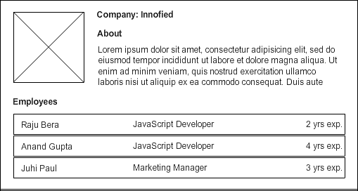
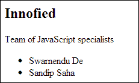
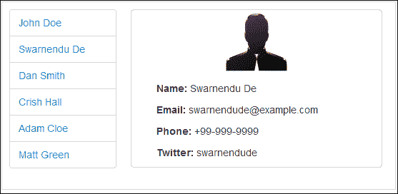

# 第二章：与视图一起工作

Backbone 视图作为应用程序的表现层。简单来说，你可以将其定义为你 HTML 元素的抽象层。它不包含任何自己的 HTML 标记，但它包含使用 JavaScript 模板呈现模型数据的逻辑。

如果你阅读了 Backbone 视图的注释源代码，你会发现 `Backbone.View` 是一个方法非常少的类，包括一个空的 `initialize()` 方法和几乎空的 `render()` 方法，通常意味着任何自定义视图类都可以重写它们。在本章中，我们将调查一些常见问题以及开发者开发现实世界 Backbone.js 应用程序时面临的问题的解决方案。

Backbone 的一些基本问题与视图渲染或更新以及维护应用程序中的多个视图有关。我们将基于复杂性分析以下主题：

+   **视图的基本用法**：我们将学习 Backbone 视图的基本概念、其属性、函数和事件处理。

+   **部分更新视图**：我们将学习如何在不重新渲染整个视图的情况下仅更新视图的一部分。

+   **嵌套视图**：随着应用程序布局复杂性的增加，我们感到需要维护多个视图的层次结构。嵌套视图或子视图在很大程度上简化了事件处理和布局管理。我们将探讨以下主题：

    +   当我们需要使用子视图时

    +   如何初始化和渲染嵌套视图

    +   在大量嵌套视图和复杂的视图 DOM 结构的情况下，如何避免 DOM 重新流

    +   当你删除父视图时，如何清理资源（子视图、事件）

+   **模板**：模板是 Backbone 的一个重要部分，与视图结合使用以创建可重用的 HTML 标记副本。我们将讨论以下主题：

    +   存储和加载模板文件的不同选项

    +   模板预编译和将预编译的模板存储在客户端的优点

    +   模板辅助函数的使用

+   **Marionette 视图**：我们可以使用 Marionette 库的自定义视图扩展来减少视图样板代码。

+   **布局管理器**：我们可以使用 Backbone 布局管理器插件简化复杂的布局架构。

# 视图的基本用法

Backbone 视图是提供逻辑结构的工具，用于你的应用程序的 HTML 标记。视图通过 JavaScript 模板表示 Backbone 模型或集合的数据。对于关联模型或集合的任何更改，你不需要重新绘制整个页面，只需更新相关的视图即可。一个基本的视图可以这样定义：

```js
var UserView = Backbone.View.extend({
  render: function () {
    var html = "Backbone.js rocks!";
    this.$el.html(html);
    return this;
  }
});

// create an instance
var userView = new UserView();
$('#container').append(userView.render().el);
```

在这里，我们创建了一个简单的 HTML 标记，将其放置在这个视图元素内部，并在 DOM 中显示视图。让我们通过查看所有步骤来进一步理解这个概念。

## 理解 el 属性

什么是`this.$el`属性？它是指向`el`的 jQuery 包装版本的属性。每个视图都拥有一个`el`属性，该属性要么持有视图最终将要渲染的 DOM 引用，要么是一个充当视图主要元素的 HTML 元素。在先前的例子中，我们没有指定`el`属性。因此，当我们实例化视图时，`el`元素就对我们可用，尽管它还没有在 DOM 中渲染。我们必须通过将视图元素附加到`#container`元素来显式地进行渲染。然而，如果我们已经在视图定义中或创建其实例时提到了指向`#container`元素的`el`属性，我们就不需要将其特别附加到文档中。如下代码片段所示：

```js
var UserView = Backbone.View.extend({
  ...
  el: '#container'
});

// render it to document body
new UserView.render();
```

这会产生与第一个例子相同的结果。然而，当你创建多个`UserView`类的实例时，这种方法会引发问题，因为它们都指向`el`中给出的相同元素，并且因为最后一个实例将覆盖前面的实例。然而，如果你每次创建视图实例时都传递`el`属性，这可以最小化问题，尽管这不是一个好的做法。此外，与视图销毁相关的问题仍然存在——如果你销毁这个视图，它也会移除`#container`元素——因此，如果你稍后创建另一个`UserView`实例并将相同的`#container`元素作为`el`属性传递，它将引发错误。一个好的做法是让视图创建自己的元素，并让父视图或布局管理器负责渲染视图。

有一些其他属性与 Backbone 视图的`el`属性相关；这些是`tagName`、`id`、`className`和`attributes`。`tagName`属性期望一个 HTML 标签名作为值，该值将用于创建视图的主要元素。例如，如果你将`tagName`指定为`'ul'`，Backbone 创建的`el`元素将是一个空的`UL`元素。默认情况下，`tagName`的值为`'div'`，也就是说，如果没有指定`tagName`，视图元素将是一个`DIV`元素。

`id`和`className`属性分别指定元素的 ID 和 CSS 类。`attributes`属性包含所有 HTML 属性作为一个对象：

```js
var UserView = Backbone.View.extend({
    tagName : 'p',
    id : 'user_details',
    className : 'user-details',
    attributes : {
        'data-name' : 'User Details'
    }
});
```

生成的视图元素将看起来像这样：

```js
<p data-name="User Details" id="user_details" class="user-details"></p>
```

## 监听视图事件

你可以使用视图的`events`属性将 DOM 事件监听器附加到 DOM 元素上。这些事件只能在视图元素及其子元素上注册：

```js
var UserView = Backbone.View.extend({
  html: '<button id="btn">Click me</button>',
  events: {
    'click #btn': 'onButtonClick'
  },

  render: function () {
    this.$el.html(this.html);
    return this;
  },

  onButtonClick: function () {
    console.log('Button clicked');
  }
});
```

我们在按钮上添加了一个`click`事件，并定义了当用户点击该按钮时要调用的处理程序。

Backbone 将所有视图事件委托出去，这样即使元素尚未在 DOM 中渲染，事件也会附加到它上。所以，如果你为视图 DOM 内尚未可用的元素添加一个事件散列，事件将在元素渲染时立即附加到它上。

## 使用模板显示模型数据

这是最重要的部分，因为视图的主要目的是显示与之关联的数据。在最简单的情况下，每个 Backbone 视图都关联到一个模型，并且它会随着模型的变化而更新自己：

```js
var User = Backbone.Model.extend({});

// UserView definition
var UserView = Backbone.View.extend({
// We will use Underscore template
  template: _.template('Hello <%= firstName %> <%=lastName %>!'),

  render: function () {
    if (!this.model) {
      throw "Model is not set for this view";
    }

    var html = this.template(this.model.toJSON());
    this.$el.html(html);
    return this;
  }
});

var userView = new UserView({
// Set a model for this view
  model: new User({
    firstName: 'Payel',
    lastName: 'Pal'
  })
});

$('#container').append(userView.render().el);
```

之前的代码很容易理解；在这里，我们在`render()`函数中将`model`实例传递给视图，并将模型值设置为模板。一旦渲染，视图将显示包含模型数据的 HTML 标记。

我们还需要确保模型任何属性的更改都能立即反映在视图中。我们可以通过监听模型的`change`事件来实现这个功能：

```js
initialize: function () {
  this.listenTo(this.model, 'change', this.render);
  // Or, this.model.on('change', this.render, this);
}

...
// Change an attribute of the model
userView.model.set('lastName', 'Dey');
```

在`initialize()`方法中，我们监听模型的`change`事件并重新渲染视图。我们可以使用`on()`和`listenTo()`来实现这个功能，但`listenTo()`方法的优势在于，如果视图被销毁，它会自动解绑使用`listenTo()`方法添加的所有事件。另一方面，如果你使用`on()`方法绑定事件，你必须明确地解绑这些事件。

在某些情况下，一个模型可能有很多属性，你可能不希望每次属性变化时都重新渲染整个视图。相反，只更新视图的这部分似乎更实际。让我们在下一节中详细了解如何部分更新视图。

# 部分更新视图

部分视图更新是一个许多开发者请求的常见功能。要求是重新渲染视图的一部分，而不是整个视图。这在有复杂视图和大量数据，但只需要更改一小部分的情况下非常重要。每次小更改都重新渲染整个视图可能会影响性能。另一方面，这个解决方案相当简单。在以下示例中，如果`address`属性发生变化，那么视图的 DOM 中的地址部分将被更新，而整个视图将不会重新渲染：

```js
...

template : _.template('<p><% name %></p><p><%= address %></p>'),

initialize: function() {
  this.listenTo(this.model, 'change:address', this.showChangedAddress);
},

showChangedAddress: function () {
  // we are using the same main view template here though 
  // another subtemplate for only the address part can 
  // anyway be used here
  var html = this.template(this.model.toJSON()),

    // Selector of the element whose value needs to be updated
    addressElSelector = ".address",

    // Get only the element with "address" class
    addressElement = $(addressElSelector, html);  

  // Replace only the contents of the .address element
  this.$(addressElSelector).replaceWith(addressElement);
}

...
```

在这个例子中，我们在`render`函数中使用模型数据填充模板。我们不是监听模型的`change`事件，而是监听`change:address`事件。在`showChangedAddress()`方法内部，我们首先使用模板和最新的模型数据创建 HTML 字符串。然后我们从这个 HTML 字符串中提取`address` DOM 元素。最后，我们只需用最新的一个替换视图当前的`address` DOM 元素。

同样的功能也可以通过子视图或子视图来实现，这确实是一个更好的解决方案。然而，在某些情况下，为如此小的更改创建一个新的子视图可能是多余的，而先前的解决方案可能更有利。在下一节中，我们将了解实际场景中（以及如何）我们应该使用子视图。

# 理解嵌套视图

嵌套视图或子视图基本上是一个子视图。当我们的视图复杂并且我们想要为了简化、更好的事件处理和更好的模型-视图关系而将其一部分分离出来时，子视图的必要性就出现了。

为了给您举个例子，假设我们有一组相似的数据，并且我们需要为每种数据类型显示一个列表项。在这种情况下，最好有独立的视图和模型，这样可以为每个模型附加的视图提供控制其行为的选择。当您点击一个项目时，您可能需要使用该项目的数据进行进一步处理。如果该项目是一个子视图，我们可以从附加到它的模型中轻松获取数据。我们将在下面的例子中解释这个概念。

我们在第一章中看到了`UserItemView`，*通过插件开发减少样板代码*，它使用了`User`模型。现在，让我们介绍一组将作为列表显示的用户数据：

```js
var User = Backbone.Model.extend();

// Users collection
var Users = Backbone.Collection.extend({
  model: User
});

// Add some data in the collection
var users = new Users([{
  id: 1,
  name: 'John Doe'
}, {
  id: 2,
  name: 'Dan Smith'
}]);
```

初始时，我们将只使用一个视图通过创建`UsersView`来渲染整个集合：

```js
var UsersView = Backbone.View.extend({
  tagName: 'ul',
  render: function () {
    var html = '';

    // Iterate over the collection and 
    // add each name as a list item
    this.collection.each(function (model) {
      html += '<li>' + model.get('name') + '</li>';
    }, this);

    this.$el.html(html);
    return this;
  }
});

var usersView = new UsersView({
  // add the collection instance
  collection: users
});

// Display the view
$(document.body).append(usersView.render().el);
```

在`render()`方法中，我们遍历整个集合数据，创建一个 HTML 列表项，并将其附加到`UsersView`类的元素中。这工作得很好，显示了名字列表。

上述实现绝对没问题，除非您想通过点击用户的名字来接收用户的数据。在这种情况下，我们必须在列表项的 HTML 标记中添加用户 ID，这样您就可以从浏览器的`event`对象中访问它：

```js
html += '<li data-id="' + model.get('id) + '">' + model.get('name') + '</li>';
```

在`click`事件中，我们调用`showUserName()`方法来显示`user`模型的名字：

```js
...
events: {
  'click li': 'showUserName'
},

showUserName: function (e) {
  var userId = $(e.target).attr('data-id'),
    user = this.collection.get(userId);

  if (!user) {
    return;
  }

  console.log('Clicked user\'s name =', user.get('name'));
}
...
```

列表元素的`data-id`属性可以从`event`对象的`target`属性中提取，并且具有相同`data-id`属性的模型可以从`collection`中获取。这种方法在您的应用程序中有许多视图时效果良好。以这种方式管理事件对于大型应用程序来说变得繁琐。那么，我们如何解决这个问题呢？我们使用子视图！

## 了解何时使用子视图

之前的模式类似于我们在基于简单 jQuery 的应用程序中通常使用的模式，其中所有数据和事件都紧密耦合到 DOM 上。以这种方式继续事件绑定最终会导致在后期阶段出现很多复杂性。子视图可以在很大程度上简化这个过程。我们将每个列表项分开，并为每个列表项引入一个`UserItemView`变量：

```js
var UserItemView = Backbone.View.extend({
  tagName: 'li',
  template: _.template( '<%= name %>'),
  events: {
    'click': 'showUserName'
  },
  render: function () {
    var html = this.template(this.model.toJSON());
    this.$el.html(html);
    return this;
  },

  showUserName: function () {
    console.log('Clicked user\'s name =', this.model.get('name'));
  }
});
```

这很简单。我们只为每个模型定义一个视图。在`UsersView`的`render()`方法中，我们消除了丑陋的 HTML 字符串，因为我们只需要创建每个子视图（`UserItemView`）的实例，并将它们的元素附加到主视图中：

```js
render: function () {
  var userItemView;

  // clean up the view first 
  this.$el.empty();

  // iterate over the collection and add each name as a list item
  this.collection.each(function (model) {
    userItemView = new UserItemView({
      model: model
    });

    this.$el.append(userItemView.render().el);
  }, this);

  return this;
}
```

我们创建新的 `UserViewItem` 实例，将模型传递给它，并在主视图中渲染它。现在的事件监听器是子视图特定的，子视图方法可以直接访问附加到其上的模型。这使得应用程序的流程更清晰，并且消除了通过 ID 查找特定模型所需的时间，尽管这个时间很小。如果你的视图有多个类似的子项，并且每个子项都需要自己的事件集，那么子视图是正确的做法。

在本章的最后部分，我们将探讨一个很棒的库，MarionetteJS，它提供了一些有用的现成 BackboneJS 扩展。`ItemView` 和 `CollectionView` 扩展提供了一种类似于前一个示例的功能，但以更稳健和灵活的方式。

## 避免多次 DOM 重排

我们使用了 jQuery 的 `$.append()` 方法将子视图元素添加到主视图中。发现如果数据集很大，逐个将视图元素添加到 DOM 中可以创建严重的性能问题；这将影响应用程序的 UI 响应性。在现代浏览器中，性能下降甚至可以感觉到，因为每次添加都会导致 DOM 重排，并迫使浏览器重新计算 DOM 树的大小和位置。

可以通过使用 `DocumentFragment` 来避免多次 DOM 重排，这由 *John Resig* 在 [`ejohn.org/blog/dom-documentfragments`](http://ejohn.org/blog/dom-documentfragments) 中描述为 *一个可以容纳 DOM 节点的轻量级容器*。我们可以在 `DocumentFragment` 内部收集所有的视图元素，然后将这个片段添加到 DOM 中。这将导致整个集合的单次重排，从而提高性能。

让我们看看使用单个重排的 `render()` 方法：

```js
render: function () {
  // create a document fragment
  var fragment = document.createDocumentFragment();

  this.collection.each(function (model) {
    // add each view element to the document fragment
    fragment.appendChild(new UserItemView({
      model: model
    }).render().el);
  }, this);

  // append the fragment to the DOM
  this.$el.html(fragment);
  return this;
}
```

如果有多个子视图并且视图的 HTML 结构很复杂，这个过程可以增强性能。一般来说，不是很多开发者使用它，你应该只在 HTML 标记非常复杂时才使用它。对于简单的 HTML 标记，测试显示性能几乎没有变化。

## 重新渲染父视图

想象以下场景，我们需要显示公司详情以及其员工列表。在这里我们将创建两个视图：一个 `Company` 视图作为主视图，一个 `Employee` 视图作为子视图，代表列表中的每个员工：



因此，将有一个 `Company` 模型和 `Employees` 集合。我们将以类似于之前讨论的方式渲染完整的视图以及子视图。如果 `Company` 模型发生变化，我们将重新渲染 `Company` 视图，但这意味着我们也必须重新渲染所有子视图。我们真的需要这样做吗？实际上我们不需要，也不应该这样做，因为这将会增加开销。

在大多数情况下，当你重新渲染父视图时，它不应该每次都重新初始化其子视图。因此，最好在父视图的`initialize()`方法中初始化子视图，并将它们添加到一个数组中，稍后在`render()`方法中使用：

```js
var ParentView = Backbone.View.extend({
  initialize: function () {
    this.subViews = []; 

   // Initializing the child views
    this.subViews.push(new ChildView(), new ChildView()];
  },

  render: function () {
    this.$el.html(this.template);

  // Render each child view
    _(this.subViews).each(function (view) {
      this.$el.append(view.render().el);
    }, this);

    return this;
  }
});
```

这样，对父`render()`方法的多次调用将保持视图的状态，并且只会重新渲染子视图。

## 移除父视图

在上一个场景中，当公司详情及其员工列表被显示时，我们假设了一个需要销毁这个完整视图并显示新视图的情况。现在，我们如何销毁一个视图？我们只需在它上面调用`remove()`方法，它就会解除使用`listenTo()`方法注册的所有事件。它还会从 DOM 中移除完整的视图及其子视图元素。

我们在这里是否解除了子视图的事件？不是的。子视图确实从 DOM 中移除了，但我们没有在它们上面调用`remove()`方法。因此，模型仍然存在，附加到模型上的事件仍然引用视图（或视图的方法）。结果，即使视图的`el`属性从 DOM 中移除，这些视图对象也不会被垃圾回收。

为了防止这些内存泄漏，我们在移除父视图时应该始终跟踪子视图。例如，在上一个部分中，我们看到了如何将子视图存储在`this.subViews`数组中。我们可以在`Company`视图类中覆盖`remove()`方法，在移除主视图之前单独销毁子视图：

```js
var Company = Backbone.View.extend({
  ...
  remove: function () {
    _(this.subViews).each(function (view) {
      this.stopeListening(view);
      view.remove();
    }, this);

    Backbone.View.prototype.remove.call(this, arguments);
  }
});
```

这将确保在父视图之前移除所有子视图。因此，为了解决内存泄漏问题，请记住以下几点：

+   总是保留对当前顶级视图的引用

+   在父视图中保留所有子视图的引用

+   确保每个事件都被解除绑定

此外，如果你使用的是 Backbone.js 版本低于 V9.9.0，仅调用`remove()`方法将不会清理事件，你必须显式地解除它们。使用`on()`方法而不是`listenTo()`方法注册的事件也是如此。对于 Backbone 的旧版本，你可能需要使用以下类似代码：

```js
remove: function () { 
  this.unbind(); // Unbind all local event bindings

  // Unbind reference all such items
  this.model.unbind('change', this.render, this);  

  // Remove this view
  Backbone.View.prototype.remove.call(this, arguments);

  // Delete the jQuery wrapped object variable
  delete this.$el;  

  // Delete the variable reference to this node
  delete this.el; 
}
```

### 小贴士

有一些工具可以帮助你检查你的应用程序是否泄漏内存。你可以使用 Chrome 开发者工具([`developers.google.com/chrome-developer-tools/docs/javascript-memory-profiling`](https://developers.google.com/chrome-developer-tools/docs/javascript-memory-profiling))来跟踪它，或者你可以使用 Backbone-Debugger([`github.com/Maluen/Backbone-Debugger`](https://github.com/Maluen/Backbone-Debugger))。

# 使用模板进行工作

模板是 Backbone 应用程序开发的一个组成部分。使用 Backbone，Underscore.js 提供了一个内置的微模板引擎，尽管我们也可以使用其他流行的模板引擎，如 Handlebars、Mustache 或 Jade。在下一节中，我们将介绍一些有趣的模板模式，这些模式将帮助你在大型应用程序中管理模板并提高它们的性能。

## 将模板存储在 HTML 文件中

在最简单的情况下，我们以两种方式存储模板；我们要么直接将它们作为视图属性内联添加到视图中，要么将它们添加到`index.html`文件中的`script`标签内。在前面的例子中，我们已经看到了第一种情况。让我们看看第二种选项：

```js
<script type="text/template" id="tpl_user_details">
  <h3> <%= name %> </h3>
  <p><%= about %></p>
</script>
```

在这里，我们只需将模板字符串放在一个`script`标签内，并给它一个类型`text/template`，这样它就不会被当作 JavaScript 来评估。你可以始终通过脚本 ID 来检索模板：

```js
var userDetailsTpl = $('#tpl_user_details').html();
```

### 小贴士

Underscore 模板的默认定界符有时很烦人，看起来很丑。Mustache 风格的`{{}}`看起来更干净，并且大多数开发者都更喜欢它。你可以通过使用`_.templateSettings 属性`轻松地将你的 Underscore 定界符转换为 Mustache 风格：

```js
_.templateSettings = {
  interpolate: /\{\{(.+?)\}\}/g
};
```

当应用程序规模较小时，这两种模板存储方式都运行良好。然而，一旦应用程序的规模开始增加，管理 JavaScript 文件中的大量模板字符串以及包含所有模板的巨大 HTML 文件就变得相当困难。有许多选项可以存储模板并使用它们。例如，我们可以为我们的模板创建单独的 HTML 文件；这种方法给我们带来了诸如语法高亮、适当的缩进以及单独管理模板的选项等好处。然而，这种技术将导致另一个严重问题——模板需要通过 AJAX 请求单独加载。在大型项目中，通过多个 XHR 请求加载模板是一个糟糕的想法，并且会对性能造成巨大影响；避免这样做。

让我们看看一些其他选项，这些选项可能有助于你以更好的方式组织你的模板。

## 将模板存储在 JavaScript 文件中

许多开发者建议，尽管模板是一段 HTML 标记，但它并不完全是 HTML，将标记保存在 JavaScript 文件中是一个更好的选择。我们可以创建包含应用程序所有模板的单个或多个`.js`文件。模板将以字符串格式存储，但你可以通过使用`join()`方法以更易于阅读的方式呈现它们：

```js
var TplManager = {
  templates: {}
};

TplManager.templates.userProfile = [
  '<h3> <%= name %> </h3>',
  '"',
  '<p>Address : <%= address %></p>'
].join('\n');

TplManager.templates.userLogin = [
  '<ul>',
  '<li>Username: <input type="text" /></li>',
  '<li>Password: <input type="password" /></li>',
  '</ul>'
].join('\n');
```

你可以为你的模块维护单独的模板文件，例如，`User.js`和`Dashboard.js`。你也可以有特定于应用程序的模板命名空间，例如，`App.User`和`App.Dashboard`。关键点是你可以在以后将它们合并和压缩以获得一个文件，这可以大大提高应用程序的性能。

对于大型应用程序，你可能不希望在 JavaScript 文件中这样存储模板，因为在其中你将无法获得任何格式化和突出显示 HTML 代码的便利。然而，这种模式的实用性不容否认，尤其是在我们得到一个包含所有预编译模板的单一压缩 JavaScript 文件时。在附录 B，*服务器端预编译模板*中，我们详细讨论了这一过程。

随着 Require.js 和**异步模块定义**（**AMD**）的流行，大多数开发者今天更倾向于将单个模板存储在单独的模板或 HTML 文件中。当整个项目的源代码被优化后，它将创建一个包含所有模板的单一压缩文件。这种方法现在是一种流行的方法，我们在附录 C，*使用 AMD 和 Require.js 组织模板*中详细解释了这一功能。

## 预编译模板

模板编译是什么？一般来说，我们创建模板作为字符串，并在其中包含模板表达式。一旦我们传递这个字符串进行编译，模板库就会分析这个字符串以创建一个可以应用数据的格式。这个编译后的函数随后返回另一个函数，我们传递数据并返回一个包含数据集成 HTML 字符串的函数。这个过程被称为模板编译。

为什么我们需要预编译模板？这是因为当我们多次使用模板字符串，比如`TplManager.templates.userProfile`时，相同的编译过程会每次重复。这显然是额外的劳动，将显著影响应用程序的性能。你可以比较 Igor Hlina（[`twitter.com/srigi`](https://twitter.com/srigi)）进行的这个 jsperf 测试（[`jsperf.com/underscore-templates-classic-vs-precompiled`](http://jsperf.com/underscore-templates-classic-vs-precompiled)）中的差异。测试表明，模板的预编译比经典方法快 99%。

通过预编译模板并缓存它们，你可以大幅度减少开销。让我们给我们的模板管理器添加一个方法，这个方法只会编译一次模板，并在每次调用时返回缓存的版本：

```js
var TplManager = {
  templates: {},
  cachedTemplates: {},

  // Returns compiled template
  getCachedTemplate: function (tplName) {
    // If compiled template already exists, return that
    if (this.cachedTemplates.hasOwnProperty(tplName)) {
      return this.cachedTemplates[tplName];
    }

    if (this.templates.hasOwnProperty(tplName)) {
      // Compile and store the template functions 
      this.cachedTemplates[tplName] = _.template(this.templates[tplName]);
    }

    return this.cachedTemplates[tplName];
  }
};
TplManager.getCachedTemplate('userProfile'); 
```

因此，我们可以从`getCachedTemplate`方法访问编译后的模板。这是一个没有太多错误处理的非优化解决方案，但这个概念可以应用于你所有的模板。

### 小贴士

`_.template()`方法通常接受两个参数。如果你传递模板字符串和数据，它将发送包含数据的完整 HTML 字符串给你。然而，如果你只传递模板字符串，它将返回一个函数，该函数接受数据作为参数。

## 避免在模板中进行评估

我从 Sencha 库中学到了许多模板最佳实践。Sencha 的 `XTemplate` 功能不允许你在模板字符串中添加任何 JavaScript 代码评估，但它提供了一系列变量和选项来添加自定义函数，这有助于保持模板的整洁；我在创建复杂模板时从未遇到过任何问题。

Underscore.js 模板和大多数其他模板引擎都提供了一种在模板内部评估 JavaScript 代码的功能。一方面，这看起来相当难看，另一方面，随着项目中模板数量的增加，它也增加了复杂性。在模板中放置一些 JavaScript 逻辑会使代码管理变得非常困难。因此，建议将 JavaScript 代码与你的 HTML 标记分离：

```js
<h3>
  <%= companyName %>
</h3>
<ul>
  <% employees.forEach(function (employee) { %>
    <li>
      <%= employee.name %>
    </li>
  <% }); %>
</ul>
```

当展示员工列表时，我们需要遍历列表并显示员工姓名。Underscore.js 没有提供任何内置机制来完成这项工作，但我们可以在这里使用一个子模板，将评估部分从这段代码中排除。这个子模板将很简单，例如：

```js
<li> <%= name %> </li>
```

你将在 JavaScript 代码中遍历列表，使用这个子模板仅渲染这个 `li` 元素，然后将元素附加到主元素上。虽然这样做可能需要更多努力，但它将帮助你避免在模板中进行 JavaScript 评估。

另一方面，有一些模板引擎，如 HandleBars.js，提供了内置逻辑（例如循环、传递上下文、if-unless 块辅助函数等）。因此，如果你觉得子模板需要更多的工作，你可以选择一个更好的模板库，它可能不像 Underscore 那样轻量级，但提供了更多的内置辅助函数。

避免在模板中进行评估的另一个想法是使用辅助函数。让我们在下一节中看看它们。

## 使用模板辅助函数

使用模板辅助函数相当简单。想象一下这样的场景：在你的应用程序中展示用户资料时，在用户头像的位置，你可能需要显示用户的照片，或者必须显示默认的头像图片。这就是你在模板中编写该条件的方式：

```js
<% if(typeof(avatar) === 'undefined') %>
  " />
<% } else { %>
  
<% } %>
```

这是一个选项，但我们已经决定不在我们的模板中评估 JavaScript。辅助函数在这里可能很有用。尝试这个函数：

```js
// A cleaner template
var tplString = '" />'; 
var data = this.model.getJSON();
var html = _.template(tplString, _.extend(data, {
  // A template helper function to be merged with data
  getAvatar: function (avatar) {
    return avatar || "images/default_avatar.png";
  }
}));
```

因此，当你将数据传递给 `_.template()` 方法时，你需要确保模板方法作为属性或子属性存在。问题是为什么我们需要将辅助函数作为数据的一部分添加？原因是大多数模板库，包括 Underscore 的模板，都会创建一个数据对象，并将其作为函数的上下文传递给它。因此，辅助函数是在数据的上下文中调用的，并且只能以这种方式可用。

### 小贴士

有许多模板引擎内置了一些之前的解决方案。如果您正在开发一个小型应用程序，您可能会发现 Underscore 的微模板解决方案足够用于开发。但如果您打算在应用程序中使用复杂的模板，我们建议选择 `Handlebars`，这是一个流行且广受欢迎的模板引擎。

# 理解自动模型-视图数据绑定

当附加模型的任何属性发生变化时，我们会刷新视图以显示更新后的数据。在视图的 `initialize()` 方法中，我们为模型附加了一个 `change` 事件监听器，如下所示：

```js
this.listenTo(this.model, 'change', this.render);
```

然而，有一些选项可以自动处理这种数据绑定，您不需要为每个模型-视图关系处理它。这个原则比 Backbone 的 MV* 模式更接近 MVVM 设计模式，您可以在 `Knockout.js` 和 `Meteor.js` 等框架中找到它。

对于 Backbone，有多个插件，例如 `Backbone.Stickit` ([`nytimes.github.io/backbone.stickit/`](http://nytimes.github.io/backbone.stickit/))、`Backbone.ModelBinder` ([`github.com/theironcook/Backbone.ModelBinder`](https://github.com/theironcook/Backbone.ModelBinder)) 和 `Rivets.js` ([`www.rivetsjs.com/`](http://www.rivetsjs.com/))。这些插件提供了类似的数据绑定功能。我们在这里不会讨论每个插件；然而，这些插件的实现过程简单且相似。如果您希望使用此类功能，请查看这些插件并使用适合您需求的插件。

# 使用 Marionette 的 ItemView、CollectionView 和 CompositeView

Marionette ([`marionettejs.com/`](http://marionettejs.com/)) 是一个用于 Backbone.js 的复合应用程序库。由 Derick Bailey 开发，它是一组常见的模式和解决方案，用于解决 Backbone 的问题。这是一个很棒的库，许多开发者都将其用于他们的基于 Backbone 的应用程序。

关于 Marionette 的一个重要事情是它为视图、区域等提供了几个独立的包，并允许您自由使用它们，而无需使用完整的库。在本节中，我们将探讨 Marionette 的 `ItemView`、`CollectionView` 和 `CompositeView` 功能。这些视图解决了我们在上一节中讨论的许多问题。

## ItemView

`ItemView` 代表一个项目的单个视图，它可以是模型视图或集合视图。它扩展了 `Marionette.View` 类，这是一个具有许多可重用函数的核心视图。`Marionette.View` 负责触发、委派和取消委派事件。

如果您计划使用 Marionette，具有模型或集合的视图应该扩展 `ItemView` 类。它提供了一系列功能，包括：

+   一个 `serializeData()` 方法，这是一个通用方法，用于返回视图附加的模型或集合的数据。

+   一个 `close()` 方法，负责从 DOM 中移除视图并清理资源。这与我们在 第一章 中学习的 `BaseView` 类的 `close()` 方法类似，*通过插件开发减少样板代码*。

+   一些自定义事件，例如：

    +   `'render' / onRender` 事件

    +   `'before:render' / onBeforerender` 事件

    +   `'close' / onClose` 事件

    +   `'before:close' / onBeforeClose` 事件

让我们看看以下代码中所示的基本 `ItemView` 类定义：

```js
var UserItemView = Marionette.ItemView.extend({
  tagName: 'li',
  template: _.template('<%= firstName %> <%= lastName %>'),

  onRender: function () {
    // After render functionality here
  },

  onClose: function () {
    // Do some cleanup here
  }
});
```

我们将创建一个实例并按照以下方式传递模型：

```js
var userItemView = new UserItemView({
  model: new Backbone.Model({
    firstName: 'Sudipta',
    lastName: 'Kundu'
  })
});

$(document.body).append(userItemView.render().el);

// Close and destroy the view after 2 seconds
setTimeout(function () {
  // userItemView.close();
}, 2000); 
```

这是一个简单的 `ItemView` 类的示例，其中我们传递模型并使用其方法来显示数据。看看，我们没有提供任何 `render()` 方法定义。这是因为 `ItemView` 默认提供简单的渲染功能。`ItemView` 有一个 `serializeData()` 方法，它发送模型数据或附加到该视图的集合数据，而 `render()` 方法将此数据应用于其模板，并自动用生成的 HTML 内容填充视图。以下是 Marionette 中 `serializeData()` 方法的样子：

```js
  // Serialize the model or collection for the view. If a model is
  // found, '.toJSON()' is called. If a collection is found,
 '// .toJSON()'is also called, but is used to populate an 'items'
  // array in the resulting data. If both are found, defaults to 
  // the model. You can override the 'serializeData' method in your 
  // own view definition, to provide custom serialization for your 
  // view's data.
  serializeData: function () {
    var data = {};

    if (this.model) {
      data = this.model.toJSON();
    } else if (this.collection) {
      data = {
        items: this.collection.toJSON()
      };
    }

    return data;
  }
```

因此，`ItemView` 期望一个模板、一个模型或一个集合，并且它减少了渲染视图的初始样板代码。正如你所见，许多基本和可重用的功能都在 `ItemView` 类中处理。它提供了我们在 `BaseView` 类中讨论的所有功能。将其用作视图的基础类可以为基于 Backbone.js 的应用程序提供很多灵活性。

## CollectionView

`CollectionView` 类，正如其名所示，显示指定集合中每个模型项的项列表。其功能与前面的示例类似，但具有更强大的子视图功能。`CollectionView` 类为每个数据项创建一个 `ItemView` 实例并将其元素追加到主视图的 `el`。

`CollectionView` 的某些常见功能包括：

+   创建、添加和删除子视图。

+   当集合为空时显示空视图。

+   集合的 `'add'`、`'remove'` 和 `'reset'` 事件的自动渲染和重新渲染，其中集合视图自动渲染更改。

+   提供了多个有用的自定义事件：

    +   `'render' / onRender` 事件

    +   `'before:render' / beforeRender` 事件

    +   `'closed' / 'collection:closed'` 事件

    +   `'before:item:added' / 'after:item:added'` 事件

    +   `'item:removed'` 事件

    +   从子视图中冒泡的 `'itemview:*'` 事件

+   包含一个 `close()` 方法，在关闭之前移除子视图。

现在，让我们使用之前的 `UserItemView` 类作为子项并创建一个 `CollectionView` 类：

```js
// Create a collection view and pass the item view class
var UsersView = Marionette.CollectionView.extend({
    tagName: 'ul',
    itemView: UserItemView
});

var usersView = new UsersView({
    collection: new Backbone.Collection([{
        firstName: 'Sandip',
        lastName: 'Maity'
    }, {
        firstName: 'Debopam',
        lastName: 'Biswas'
    }])
});

$(document.body).append(usersView.render().el); 
```

比较一下，与我们在本章早期开发的用于显示项目列表的代码相比，代码量是多么的小。我们只需在`CollectionView`实例中将类名`UserItemView`作为`itemView`传递，它就会负责从渲染到在父视图被移除时销毁子项的所有事情。

Marionette 的`CollectionView`在很大程度上减少了你的代码中的样板代码。如果你正在开发一个具有多个列表视图的应用程序，你可以使用 Marionette 的集合视图生成更干净的代码，因为它自己提取了大部分可重用功能。

## 使用`CompositeView`

`CompositeView`扩展自`Marionette.CollectionView`类。一般来说，你可以将其视为`ItemView`和`CollectionView`的组合，其中它接受一个表示单个数据集的模型和一个显示多个数据的集合。这在你有层次结构或树状结构时特别有用。你可以将其与我们提到的*重新渲染父视图*部分联系起来。在那里，我们必须一起显示`Company`模型和`Employees`集合的数据，而`CompositeView`将是一个提供紧凑解决方案的绝佳工具。

组合视图除了基本的`CollectionView`功能外，还提供了一些特定的功能，具体说明如下：

+   `CompositeView`的模型数据应用于其模板属性。

+   它有一个`itemViewContainer`属性，用于指定集合视图将在哪个元素内渲染。`itemViewContainer`属性可以是 jQuery 选择器或 jQuery 对象，或者它可以是返回 jQuery 选择器或 jQuery 对象的函数。

+   当`itemViewContainer`不足以指定`ItemView`的确切位置时，覆盖`CollectionView`的`appendHtml()`方法可能提供所需的结果，如下面的代码片段所示：

    ```js
    appendHtml: function (galleryView, imageView, index) {
      // Put the imageView i.e. ItemView instances 
      // inside element with class "box-result"
      galleryView.$(".box-result").append(imageView.el);
    }
    ```

假设我们有一个场景，需要显示公司详情以及员工列表。因此，将会有一个`Company`模型，如下面的代码片段所示：

```js
// Company model
var Company = Backbone.Model.extend({
  defaults: {
    name: '',
    specialty: ''
  }
});
```

同样，每个员工也必须有一个`Employee`模型，如下所示：

```js
// Employee model
var Employee = Backbone.Model.extend({
  defaults: {
    name: ''
  }
});
```

让我们定义一个`Employees`集合来表示员工列表，如下所示：

```js
// Employees collection
var Employees = Backbone.Collection.extend({
  model: Employee
});
```

对于组合视图，我们希望将每个员工表示为一个单独的`ItemView`实例，以便于事件委托：

```js
// Create an ItemView instance for the child items
var EmployeeItemView = Marionette.ItemView.extend({
  tagName: 'li',
  template: _.template('<%= name %>')
});
```

现在，我们可以定义一个组合视图，它将一起显示模型数据和集合数据，如下面的代码所示：

```js
// Create a collection view and pass the item view class
var CompanyView = Marionette.CompositeView.extend({
  template: _.template(['<h2><%= name %> </h2>',
    '<span><%= specialty %> </span>',
    '<ul class="employees"></ul>'
  ].join('')),
  itemView: EmployeeItemView,
  itemViewContainer: '.employees',

  // Add a company details to this view's model and collection
  addCompany: function (data) {
    if (!data) return;

    if (data.employees) {
      this.collection = new Employees(data.employees);
    }

    delete data.employees;
    this.model = new Company(data);
  }
});
```

在这里，我们首先定义了一个模板，其中我们为员工列表留出了位置。然后我们提到了 `itemView` 选项，即 `EmployeeView` 类，该类将由集合使用以创建实例，并用每个员工的数据填充它。这些项目视图将堆叠在 `itemViewContainer` 属性中提到的元素中。现在，让我们创建复合视图实例，向其中添加一个公司，并渲染它，如下面的代码片段所示：

```js
var companyView = new CompanyView();

// Add a company details
companyView.addCompany({
  name: 'Innofied',
  specialty: 'Team of JavaScript specialists',
  employees: [{
    name: 'Swarnendu De'
  }, {
    name: 'Sandip Saha'
  }]
});

$(document.body).append(companyView.render().el);
```

我们得到的结果如下面的截图所示：



因此，您可以看到复合视图提供了一种紧凑的机制，可以在单个视图中显示与模型关联的模型和集合。您可能有一个树状结构的数据，为此需要创建多个复合视图。默认情况下，复合视图的渲染机制是层次性的，如果未覆盖，则 `itemView` 属性为 `CompositeView` 类型。

我们希望我们向您提供了所有 Marionette 视图的基本概念。讨论这些视图的高级内容超出了本书的范围，但 Marionette 文档将为您提供框架的完整描述。我们在 附录 A 中提到了关于 Marionette 的资源和书籍，*书籍、教程和参考资料*。

# 使用 Layout Manager

当您在应用程序中处理多个视图时，管理诸如多个视图渲染、向元素添加动画或用另一个视图替换视图等活动往往变得困难。让我们看看一个优秀的扩展，`LayoutManager` ([`github.com/tbranyen/backbone.layoutmanager`](https://github.com/tbranyen/backbone.layoutmanager))，它为在应用程序中组装布局和视图提供了逻辑基础。

Marionette 也提供了类似的功能，通过其 `RegionManager`，但我们选择在这里讨论 `LayoutManager` 插件，因为并非每个人都使用 Marionette，并且此插件可以独立与您的 Backbone 应用程序一起工作。如果您已经使用 Marionette，我建议您验证 `RegionManager` 是否满足您的需求。或者，您可以使用 `LayoutManager` 插件与 Marionette 一起使用。

`LayoutManager` 扩展为解决许多痛点提供了解决方案：

+   如果您计划从外部文件动态加载模板，它处理视图的异步渲染

+   它将布局定义为 HTML 结构，并将视图分配到布局配置中给出的适当元素

+   它提供了执行以下活动的功能：

    +   插入视图，将数据应用到给定的模板中，并自动渲染它们

    +   根据多个选择标准检索或删除视图

    +   通过从视图或从作为上下文的模型/集合中解绑所有事件来清理视图

我们将通过创建一个简单的布局来探讨这些点，如下面的截图所示：



有一个用户列表，当你点击用户项时，用户的详细信息将显示在布局的右侧。你可以在我们的示例代码中找到包含所有 HTML、CSS 和其他文件的完整代码示例。在这里，我们将描述关键部分。

我们首先创建一个用户模型和集合，如下代码片段所示：

```js
// Change template delimiter to Mustache type
_.templateSettings = {
  interpolate: /\{\{(.+?)\}\}/g
};

// User Model
var User = Backbone.Model.extend({
  defaults: {
    avatar: '',
    name: '',
    email: '',
    phone: '',
    twitter: ''
  }
});

// Users collection
var Users = Backbone.Collection.extend({
  model: User
});
```

我们将为这个页面创建三个视图：`UserList`、`UserItem` 和 `UserDetails` 视图。`UserItem` 视图将作为 `UserList` 视图的子视图。首先，让我们为这三个视图编写模板：

```js
<!—- Layout manager template -->
<script type="text/template" id="tpl_main_content">
  <div id="main_content">
    <div class="user-list"></div>
    <div class="user-details"></div>
  </div>
</script>

<!—- User item template -->
<script type="text/template" id="tpl_user_item">
  <a class="name" href="#">{{name}}</a>
</script>

<!—- User details template -->
<script type="text/template" id="tpl_user_details">
  <div class="avatar"></div>
    <ul>
      <li><strong>Name:</strong>  {{name}}</li>
      <li><strong>Email:</strong>  {{email}}</li>
      <li><strong>Phone:</strong>  {{phone}}</li>
      <li><strong>Twitter:</strong>  {{twitter}}</li>
    </ul>
</script>
```

视图模板相当简单。定义页面结构的布局模板在这里是最重要的。任务有三个方面：你必须根据需要将布局分成多个部分，添加适当的样式以对齐它们，然后在 `LayoutManager` 配置中定义你的视图，这些视图将自动在这些部分中渲染。

首先，我们将定义用户列表项，它将只显示用户的姓名。

```js
// UserItem sub view
var UserItem = Backbone.View.extend({
  tagName: 'li',
  template: '#tpl_user_item',
  manage: true,

  // LayoutManager uses serialize method to apply the data into template
  serialize: function () {
    return this.model.toJSON();
  }
});
```

注意这里有两个新属性：manage 和 serialize。`manage` 属性是一个布尔属性，用于确定视图是否被视为布局。如果你打算在布局管理器内部使用视图并处理其渲染函数，则必须将 `manage` 属性设置为 `true`。你也可以将其全局设置为 `true`，对于特定视图，如果需要，可以将其设置为 `FALSE`。

`LayoutManager` 使用 `serialize()` 方法将数据应用到视图的模板中。`serialize()` 方法的默认实现返回一个空对象。你应该重写它以发送你想要显示的数据。在这里，我们发送与视图关联的模型数据。

`LayoutManager` 为视图提供了两个自定义事件，`beforeRender` 和 `afterRender`，因为它自己处理渲染函数。当使用 `beforeRender()` 方法时，视图的元素尚未可用，但如果你将视图插入到布局中，`LayoutManager` 会跟踪它，并在父视图在 DOM 中可用时进行渲染。我们可以使用此方法在用户集合上迭代并插入 `UserItem` 视图到列表视图中：

```js
// User List view
var UserList = Backbone.View.extend({
  tagName: 'ul',
  className: 'nav nav-tabs nav-stacked',
  manage: true,

  // Before rendering the list, 
  //insert all the child list items into it
  beforeRender: function () {
    this.collection.each(function (model) {
      // insertview method inserts the views 
      // directly inside the parent view
      this.insertView(new UserItem({
        model: model
      }));
    }, this);
  }
});  
```

有两个类似的方法 `insertView`/`insertViews` 和 `setView`/`setViews`。这两个函数都根据给定的选择器名称将视图插入到布局中。`setView()` 方法有一个额外的 `insert` 参数，它是一个布尔值，用于确定视图是否会替换选择器的完整内容，或者只是简单地附加到它。我们创建 `UserItem` 视图，将模型附加到它们，并将它们插入到 `UserList` 视图中。子视图将自动在内部渲染。

我们完成了基本列表定义。现在，让我们定义布局管理器的功能如下：

```js
// Create a collection with some data
var users = new Users([{
  name: 'John Doe',
  avatar: 'avatar.png',
  phone: '+88-888-8888',
  twitter: 'johndoe',
  email: 'johndoe@example.com'
}, {
  name: 'Swarnendu De',
  avatar: 'avatar.png',
  phone: '+99-999-9999',
  twitter: 'swarnendude',
  email: 'swarnendude@example.com'
}]);

// Define the main layout
var MainLayout = Backbone.Layout.extend({
  template: "#tpl_main_content",

  // Assign the view to specific selectors
  views: {
    '.user-list': new UserList({
      collection: users
    })
  }
});
```

`LayoutManager` 也是一种 `Backbone.View` 类型，你可以像对任何其他 Backbone 视图一样渲染它。在 `views` 属性中，我们可以指定一个或多个视图实例。在我们的例子中，我们创建了 `UserList` 实例，将其集合传递给它，并让 `LayoutManager` 负责其他所有渲染到 `.user-list` 元素中的工作。

因此，到目前为止，我们已经渲染了包含用户列表的布局。剩下的唯一动作是在我们点击用户项时显示用户详情。让我们定义 `UserDetails` 视图，这是一个简单的视图：

```js
// User Details view
var UserDetails = Backbone.View.extend({
  manage: true,
  template: '#tpl_user_details',

  serialize: function () {
    return this.model.toJSON();
  },

  // Set the selected model 
  setModel: function (model) {
    if (model) {
      this.model = model;
    }

    return this;
  }
}); 
```

这与我们的 `UserItem` 视图定义完全相同，只是多了一个 `setModel()` 方法，该方法将模型设置为所选的模型。现在，当我们在列表项上点击时，我们将插入这个视图。为此，我们将向 `UserItem` 视图添加一个点击事件处理器，如下面的代码所示：

```js
var UserItem = Backbone.View.extend({
  ...
  events: {
    'click a': 'showDetails'
  },

  showDetails: function () {
    // Check Whether details view exists
    var detailsView = mainLayout.getView('.user-details');

    // If details view doesn't exist, create one, 
    // set the new model and render it
    if (!detailsView) {
      mainLayout.setView('.user-details', new UserDetails().setModel(this.model).render());
    } else {
      // Set the latest clicked model and re-render
      detailsView.setModel(this.model).render();
    }
  }
});
```

我们使用 `getView` 方法，可以根据多个标准检索视图，如选择器、模型或函数。我们检查详情视图是否可用。如果没有，我们创建一个 `DetailsView` 实例，设置模型，并渲染它。否则，我们重置模型并重新渲染视图。

因此，我们已经完成了完整的布局管理。观察到大多数渲染功能都是由管理器本身处理的。这只是一个基本示例；`LayoutManager` 可以提供更多选项和功能，并消除你 90%的视图管理任务。务必彻底阅读它们的文档，因为你在应用程序中能够使用其中的大部分。

# 摘要

在本章中，我们讨论了大多数 Backbone 开发者会遇到的一些重要问题，并学习了多种解决方案来解决这些问题。首先，我们讨论了部分视图渲染和嵌套视图。任何 Backbone 应用都需要处理嵌套视图，如果我们能正确维护它们的初始化、DOM 重新流和清理，这将大大提高整个应用程序的性能。

我们讨论了不同的模板处理方法，看到了从外部文件加载预编译模板的多种解决方案，组织了应用程序内的模板，并了解了辅助函数如何消除模板内 JavaScript 代码的评估，并帮助我们创建更干净的模板。

最后，我们了解了一些非常重要的扩展：Marionette 的 `ItemView`、`CollectionView`、`CompositeView` 和 `LayoutManager`。所有这些扩展通过移除大量样板代码并通过大量管理视图提供了极大的灵活性。

在下一章中，我们将讨论 Backbone 模型；我们将探讨模型数据验证、不同的验证插件、模型序列化和关系数据模型。
