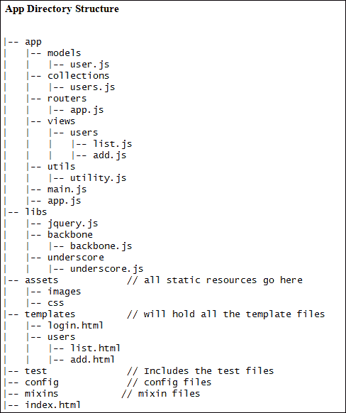
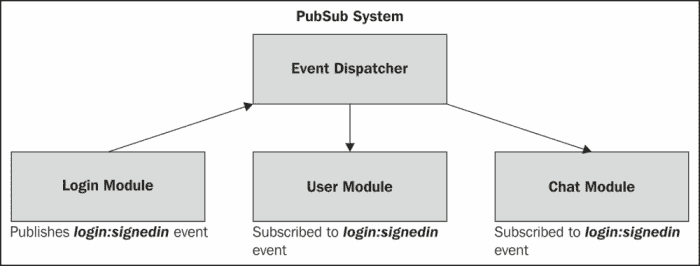

# 第七章. 组织 Backbone 应用程序 – 结构、优化和部署

在本书的前几章中，我们探讨了 Backbone.js 的各个组件，并学习了几个有助于创建更好应用程序的良好实践。然而，Backbone 本身并不提供任何应用程序结构或关于如何组织应用程序源代码的指导。这使得初级程序员很难理解如何创建文件夹结构、添加适当的命名空间、按适当顺序加载脚本文件，并遵循模式创建健壮的应用程序架构。

几乎每个 Backbone.js 开发者，在某个时刻都会遇到这个问题。您可以在网络上找到许多文章（检查附录 A 中的应用程序架构博客链接，*书籍、教程和参考资料*），其中开发者们描述了他们如何尝试结构化他们的 Backbone 代码库。但这又使得任务变得困难，因为您可能需要从众多不同意见中选择一个特定的解决方案，并理解这是否是最佳解决方案。在本章中，我们将逐步探讨如何为小型和大型应用程序组织结构的过程。

+   **应用程序目录结构**：代码组织对于开始开发非平凡 JavaScript 应用程序至关重要。本节展示了一个样板目录结构，可能有助于您概念化应用程序结构。

+   **异步模块定义**：与在 HTML 文件中堆叠多个 JavaScript 文件不同，**异步模块定义**（**AMD**）以微妙的方式帮助定义模块并异步加载其依赖项。

+   **应用程序架构**：本节提供了一个完整的逐步指南，介绍您在应用程序架构中应遵循的模式和最佳实践，以使其灵活且易于维护。

# 理解应用程序目录结构

在文件系统中进行代码组织在应用程序开发中扮演着重要角色。它为以下问题提供了解决方案：

+   管理视图、模型、集合和路由的关注点分离

+   定义应用程序的清晰入口点

+   正确的命名空间

我们将要提出的目录结构并不是适用于每个应用程序的通用解决方案。由于 JavaScript 没有提供固有的代码组织机制，没有一种适用于所有应用程序的最佳模式；它完全取决于具体情况。您可以使用以下结构，许多开发者都在他们的项目中使用它而没有问题：



我们将所有静态资源都保存在`assets`文件夹内。如果您有其他类型的静态资源，可以添加更多文件夹。模板存储在一个单独的目录中，与`views`文件夹结构相匹配。我们将根据需要动态加载这些模板，并在之后对其进行优化，以创建包含所有模板的单个文件（有关更多详细信息，请参阅附录 C，*使用 AMD 和 Require.js 组织模板*）。`main.js`文件是应用的入口点。在下一节讨论使用 AMD 时，您将看到它的用法。`app.js`文件包含作为应用最高父类的应用类。所有如`utility.js`或`helper.js`之类的实用文件，主要包含辅助方法，都位于`util`文件夹中。`test`文件夹是存储所有测试脚本的主体目录。`config`和`mixin`文件夹分别用于存储配置和可重用混合文件。这种文件结构是基本的，可以作为您应用的模板。

最近，对于大型和复杂的应用程序，另一种模式变得流行起来——模块化方法。在这种情况下，我们将完整的应用程序划分为多个小型模块；每个模块将为应用添加特定的功能。我们将在本章的后面部分探讨它，但我们可以在这里讨论这种模式的文件结构。一个模块包括它自己的视图、模型和集合。您可以每个模块有一个`templates`文件夹，并将该模块的模板分别放置在该文件夹中，或者您可以将它们作为一个单独的`templates`文件夹保留在完整项目中。我们将选择后者；`app`文件夹将类似于以下截图：


如您所见，这里没有单独的`models`、`collections`或`views`文件夹；相反，有一个包含应用所有模块的`modules`目录。每个模块都包含一个`main.js`文件，该文件作为该模块的起点。

现在，您将如何从使用这种模块化模式中受益呢？实际上，这不仅仅是对目录结构的改变，而是一种全新的应用架构。我们注意到，对于不太熟悉模块模式的初级开发者来说，从这种结构开始可能会觉得有些困难——可能是因为这是一个新概念。然而，一旦您开始使用它，您会发现它相当容易操作，并且也很灵活。使用这种结构的优点如下：

+   模块通常相互独立。因此，您可以在其他地方重新使用一个模块，只需进行最小限度的修改。

+   模块通常不会直接相互通信；它们使用一个公共媒介进行通信。因此，您可以在其他模块保持不变的情况下更改或删除一个模块。

+   随着每个模块封装其功能，您的代码库变得更加模块化和灵活。例如，一个`User`模块执行所有与用户相关的功能；应用程序的任何其他部分都不会处理任何与用户相关的任务。

之前的结构并不是使应用程序模块化的唯一方式。还有其他几个概念，您可以根据需求选择其中任何一个。例如，我在使用这个框架时经常使用 AuraJS 目录结构（来自[`github.com/aurajs/todomvc`](https://github.com/aurajs/todomvc)的`TodoMVC`应用程序）。它既相似又不同，且很有用。所以，如果您了解多个这样的目录结构但不知道选择哪一个，就选择我们之前提到的那个。遵循标准结构没有坏处；这比选择一个无结构的项目目录要好。

# 使用异步模块定义（AMD）进行工作

到目前为止，我们已经学会了在 HTML 文件中的`SCRIPT`标签内添加所有我们的脚本文件。浏览器会同步加载这些文件，因此我们始终需要确保如果一个文件依赖于另一个文件，那么后者应该始终在前者之前加载。由于所有这些依赖项的引用都是通过全局变量进行的，因此这些依赖项必须按正确的顺序加载，并且开发者在添加新的脚本文件到应用程序之前必须注意它们。尽管这个过程运行得很好，但随着依赖项数量的增加，管理大型应用程序可能会变得困难。AMD 提供了解决这个问题的方案。

AMD 是一种机制，用于定义一个模块，使得模块及其依赖项可以异步加载。因此，可以并行加载多个 AMD 模块，一旦最后一个依赖模块加载完成，主模块就会执行。此外，AMD 通过封装模块定义来避免使用全局变量，并提供了一种将多个模块加载到单个文件中的方法，从而消除了显式命名空间的需求。

目前，支持 AMD 的最流行的脚本加载器是 Require.js ([`requirejs.org`](http://requirejs.org))。它提供了模块模式的实现，并允许我们使用其 map 配置创建一个集中管理的依赖映射。详细讨论 Require.js 超出了本章的范围。因此，如果您想全面了解这个概念，我们建议您首先访问他们的网站，然后再继续阅读以下部分。

## 将 Require.js 添加到您的项目中

当`require.js`加载您应用程序的所有模块时，它是您需要在`index.html`文件中包含的唯一文件。在`HEAD`标签内添加以下脚本标签：

```js
<script data-main="app/main" src="img/require.js"></script>
```

`data-main` 属性指定了作为应用程序起点的 JavaScript 文件。在这种情况下，它是我们的 `main.js` 文件。一旦 `require.js` 文件被加载，它会查找 `data-main` 属性的入口点并加载该脚本。我们将把整个 `require.js` 配置以及所有库及其依赖项添加到该文件中。你不需要为任何文件添加 `.js` 扩展名，因为 RequireJS 会自动添加。

## 配置依赖项

我们将把所有库文件及其路径和依赖项添加到 `main.js` 文件中：

```js
// File: app/main.js

require.config({
  baseUrl: 'libs',
  paths: {
    jquery: 'jquery',
    underscore: 'underscore/underscore',
    backbone: 'backbone/backbone'
  },
  shim: {
    // We assume the backbone file here is a non-AMD file
    backbone: {
      exports: 'Backbone',
      deps: ['underscore', 'jquery']
    }
  }
});
```

我们在 `data-main` 入口文件中调用 `require.config()` 方法，并向它传递一个包含一组属性的配置对象。有许多属性可以作为配置选项使用，但我们将只讨论目前最重要的那些。你可以在 `require.js` API 中找到完整的列表（[`requirejs.org/docs/api.html`](http://requirejs.org/docs/api.html)）：

+   `baseUrl`: 此配置定义了根路径，因此你不需要在文件路径中每次都包含它。

+   `paths`: 此配置指定了每个文件的快捷别名以及文件路径相对于 `baseUrl` 的位置。

+   `shim`: 此配置仅适用于非 AMD 文件，即尚未调用 `define()` 方法的脚本。它对 AMD 文件不起作用。

+   `exports`: 此配置是该模块的全局变量名。

+   `deps`: 此配置是一个依赖项数组，必须在相应模块加载之前先加载。

如果你想要直接使用库文件，需要查找其 AMD 启用版本。否则，你必须通过 `shim` 选项进行访问。

## 定义模块

RequireJS 提供了两个重要的方法——`define()` 和 `require()`，分别用于模块定义和依赖项加载。`define()` 方法接受一个可选的模块 ID、一个可选的数组，该数组包含此模块可能需要的依赖项，以及一个函数，该函数按顺序执行以实例化模块。Backbone 模型最基本的模块定义看起来像这样：

```js
// File: app/models/user.js 

define([
     'jquery',
     'underscore',
     'backbone'
   ],
   function ($, _, Backbone) {
     var User = Backbone.Model.extend({
       defaults: ['name', 'age']
     });
     return User;
   });
```

现在，这个模型可以像其他依赖项一样在另一个文件中使用。有趣的是，RequireJS 确保特定文件只加载一次，无论你在多个文件中包含它的次数有多少。现在，让我们创建一个 `Users` 集合并使用我们的 `User` 模型：

```js
// File: app/collections/users.js

define(function (require) {
  var $ = require('jquery'),
    _ = require('underscore'),
    Backbone = require('backbone'),
    UserModel = require('app/models/user');

  var Users = Backbone.Collection.extend({
    model: UserModel
  });

  return Users;
});
```

这听起来很简单，对吧？此外，请注意，我们加载依赖项的方式与我们用于模型定义的方式不同。这种模式被称为`Sugar`语法，它利用`require()`方法来加载依赖项。你可以使用这两种语法之一来定义你的模块。当有大量依赖项时，使用`Sugar`语法比仅仅将它们作为函数的参数更容易组织依赖变量。

因此，使用 AMD，你可以以相同的方式定义所有文件。脚本依赖项的加载方式与我们之前看到的方式相同，而文本依赖项可以使用 RequireJS 的`text`插件（[`github.com/requirejs/text`](https://github.com/requirejs/text)）来加载。我们已经在附录 C 中详细讨论了这一点，*使用 AMD 和 Require.js 组织模板*，当时我们使用此插件加载外部模板文件。在下一节中，我们将看到如何使用这些概念启动完整的应用程序架构。

# 创建应用程序架构

> Backbone 的核心前提始终是尝试发现构建 JavaScript Web 应用时最有用的最小数据结构（模型和集合）和用户界面（视图和 URL）原语。
> 
> Jeremy Ashkenas，Backbone.js、Underscore.js 和 CoffeeScript 的创造者

如 Jeremy 所提到的，Backbone.js 至少在近期内没有打算提高其标准以提供应用程序架构。Backbone 将继续作为一个轻量级工具，以产生开发 Web 应用所需的最小功能。那么，我们应该责怪 Backbone.js 没有包括这种功能，尽管在开发者社区中对此有巨大的需求吗？当然不是！Backbone.js 只提供创建应用程序骨架所需的组件，并给我们完全的自由，以我们想要的方式构建应用程序架构。

> 如果正在开发一个规模较大的 JavaScript 应用程序，请记住为规划底层架构投入足够的时间，这个架构应该是最有意义的。它通常比你最初想象的要复杂。
> 
> Addy Osmani，大型 JavaScript 应用程序架构模式书籍的作者

因此，当我们开始深入探讨创建应用程序架构的更多细节时，我们不会谈论简单的应用程序或类似待办事项列表应用程序的内容。相反，我们将研究如何构建中等或大型应用程序的结构。在与许多开发者讨论后，我们发现他们面临的主要问题是，在线博客文章和教程提供了多种方法来组织应用程序。虽然大多数这些教程都讨论了良好的实践，但很难从中选择一个。考虑到这一点，我们将探索一系列你应该遵循的步骤，以确保你的应用程序在长期内既健壮又易于维护。

## 管理项目目录

这是创建稳固的应用程序架构的第一步。我们已经在前面的章节中详细讨论了这一点。如果你习惯于使用另一种目录布局，那就继续使用吧。如果应用程序的其他部分组织得当，目录结构就不会很重要。

## 使用 AMD 组织代码

我们将在我们的项目中使用 RequireJS。如前所述，它附带了一系列功能，例如以下内容：

+   在一个 HTML 文件中添加大量的脚本标签并自己管理所有依赖项可能适用于中等规模的项目，但对于大型项目来说，这种方法最终会失败。这样的项目可能有数千行代码；管理如此规模的代码库需要在每个单独的文件中定义小的模块。使用 RequireJS，你不需要担心你有多少个文件——你只需知道，如果正确遵循标准，它肯定能工作。

+   全局命名空间永远不会被触及，你可以自由地为与之最匹配的东西赋予最佳名称。

+   调试 RequireJS 模块比其他方法容易得多，因为你知道每个模块定义中每个依赖项的依赖关系和路径。

+   你可以使用`r.js`，这是 RequireJS 的一个优化工具，它可以最小化所有的 JavaScript 和 CSS 文件，来创建生产就绪的构建。

## 设置应用程序

对于 Backbone 应用程序，必须有一个中心化的对象来整合应用程序的所有组件。在简单的应用程序中，大多数人通常只是让主路由器作为中心对象工作。但这对大型应用程序肯定不起作用，你需要一个`Application`对象，它应该作为父组件工作。这个对象应该有一个方法（通常是`init()`），它将作为应用程序的入口点并初始化主路由器以及 Backbone 历史记录。此外，你的`Application`类应该扩展`Backbone.Events`，或者它应该包含一个指向`Backbone.Events`类实例的属性。这样做的好处是`app`或`Backbone.Events`实例可以作为中心事件聚合器，你可以在其上触发应用程序级事件。

一个非常基本的 `Application` 类将类似于以下代码片段：

```js
// File: application.js

define([
  'underscore',
  'backbone',
  'router'
], function (_, Backbone, Router) {
  // the event aggregator
  var PubSub = _.extend({}, Backbone.Events);

  var Application = function () {
    // Do useful stuff here
  }

  _.extend(Application.prototype, {
    pubsub: new PubSub(),
    init: function () {
      Backbone.history.start();
    }
  });

  return Application;
});
```

`Application` 是一个简单的类，具有 `init()` 方法和 `PubSub` 实例。`init()` 方法作为应用程序的起点，而 `PubSub` 作为应用程序级的事件管理器。您可以为 `Application` 类添加更多功能，例如启动和停止模块，以及添加用于视图布局管理的区域管理器。建议尽可能保持此类尽可能简短。

### 使用模块模式

我们经常看到中级开发者最初使用基于模块的架构时感到有些困惑。对于他们来说，从简单的 MVC 架构过渡到模块化 MVC 架构可能有点困难。虽然本章讨论的点适用于这两种架构，但我们始终应优先使用模块化概念，以实现更好的可维护性和组织。

在目录结构部分，我们看到了模块由一个 `main.js` 文件、其视图、模型和集合组成。`main.js` 文件将定义模块并具有管理该模块其他组件的不同方法。它作为模块的起点。一个简单的 `main.js` 文件将类似于以下代码：

```js
// File: main.js

define([
  'app/modules/user/views/userlist',
  'app/modules/user/views/userdetails'
], function (UserList, UserDetails) {
  var myVar;

  return {
    initialize: function () {
      this.showUserList();
 },

    showUsersList: function () {
      var userList = new UserList();
      userList.show();
    },

    showUserDetails: function (userModel) {
      var userDetails = new UserDetails({
        model: userModel
      });
      userDetails.show();
    }
  };
});
```

正如您所看到的，此文件的责任是初始化模块并管理该模块的组件。我们必须确保它只处理父级任务；它不应包含其视图理想中应该有的方法。

这个概念并不复杂，但您需要正确设置它，以便在大型应用程序中使用。您甚至可以采用现有的应用程序和模块设置，并将其与您的 Backbone 应用程序集成。例如，Marionette 为 Backbone 应用程序提供了一个应用程序基础设施。您可以使用其内置的 `Application` 和 `Module` 类来构建您的应用程序。它还提供了一个通用的 `Controller` 类——这是 Backbone 库中没有的，但可以用作中介来提供通用方法，并在模块之间作为共同媒介。

您还可以使用 AuraJS ([`github.com/aurajs/aura`](https://github.com/aurajs/aura))，这是一个由 Addy Osmani ([`addyosmani.com`](http://addyosmani.com)) 和许多人开发的框架无关的事件驱动架构；它与 Backbone.js 工作得相当好。AuraJS 的详细讨论超出了本书的范围，但您可以从其文档和示例 ([`github.com/aurajs/todomvc`](https://github.com/aurajs/todomvc)) 中获取大量有用的信息。它是一个出色的样板工具，可以为您的应用程序提供一个起点，我们强烈推荐它，尤其是如果您不使用 Marionette 应用程序基础设施。以下是使用 AuraJS 的一些好处；它们可能有助于您为应用程序选择此框架：

+   AuraJS 是框架无关的。尽管它与 Backbone.js 配合得很好，但你即使不使用 Backbone.js，也可以用它来构建你的 JavaScript 模块架构。

+   它利用了模块模式，使用外观（沙盒）和中介者模式进行应用级和模块级通信。

+   它抽象了你使用的实用库（例如模板和 DOM 操作），这样你就可以在需要时随时替换替代方案。

### 管理对象和模块通信

保持应用程序代码可维护的最重要方法之一是减少模块和对象之间的紧密耦合。如果你遵循模块模式，你永远不应该让一个模块直接与另一个模块通信。松散耦合在你的代码中增加了一层限制，一个模块的变化永远不会强制应用程序其他部分发生变化。此外，它还允许你在其他地方重用相同的模块。但是如果没有直接关系，我们如何进行通信呢？在这种情况下，我们使用的两个重要模式是观察者和中介者模式。

#### 使用观察者/PubSub 模式

PubSub 模式不过是我们在第六章中讨论的事件分发概念，*处理事件、同步和存储*。它作为触发事件的对象（发布者）和接收通知的另一个对象（订阅者）之间的消息通道。



我们之前提到，我们可以将应用级事件聚合器作为`Application`对象的属性。这个事件聚合器可以作为其他模块通信的公共通道工作，而且无需直接交互。

即使在模块级别，你也可能只需要为该模块提供一个公共事件分发器；该模块的视图、模型和集合可以使用它来相互通信。然而，通过分发器发布太多事件有时会使管理它们变得困难，你必须足够小心地理解哪些事件应该通过通用分发器发布，哪些事件应该在特定组件上触发。无论如何，这种模式是设计解耦系统的最佳工具之一，你应该始终为你的基于模块的应用程序准备一个可供使用的模式。

#### 使用中介者模式

有时候，你可能会发现你的应用程序模块之间存在太多的关系，你需要一个中心控制点来帮助管理所有通信。这个集中式系统被称为中介者；它作为一组模块之间的*共享主题*工作，通过不明确引用模块来促进松散耦合。所有模块都将引用这个中介者。

调解模式在某种程度上类似于观察者模式，但它不作为一个广播系统工作。它包括一组对所有共享此调解者的模块都适用的方法。调解者可以是一个具有多个必需方法的简单对象：

```js
var Mediator = {
  method1: function(){},
  method2: function(){}
};
```

任何模块都可以访问这个调解者的任何方法。

|   | *调解者最好应用于两个或更多对象具有间接工作关系，并且业务逻辑或工作流程需要规定这些对象的交互和协调时。* |   |
| --- | --- | --- |
|   | --*Addy Osmani* |

一旦我们查看一个简单的示例，调解者的概念就会变得更加清晰。假设我们有两个模块：`User`和`Event`。`User`模块有一个`getUserDetails()`方法，可以根据用户 ID 检索用户的详细信息。`Event`模块有一个`loadEvents()`方法，其任务是加载用户当前位置附近的所有事件。现在，获取当前登录用户的 ID 或当前位置是一个不是特别模块特定的功能，最好将其保存在`Mediator`实例中。看看以下示例：

```js
// Mediator
define(['util'], function (Util) {
  var Mediator = {
    getLoggedinUser: function () {
      return Util.getCookie('userid');
    },

    getUserCurrentLocation: function () {
      // returns user's current location
    }
  };

  return Mediator;
});

// User module
define(['app/mediator'],
  function (Mediator) {
    var User = function () {};

    User.prototype.getUserDetails = function () {
      var userId = Mediator.getLoggedinUser();

      // Load user's details with the loggedin user id
    }

    return User;
  });

// Event module
define(['app/mediator'],
  function (Mediator) {
    var Event = function () {};

    Event.prototype.loadEvents = function () {
      var userLocation = Mediator.getUserCurrentLocation();

      // load events nearby user's location
    }

    Event.prototype.showEventDetails = function () {}

    return Event;
  });
```

如您所见，我们只是在模块定义中传递`Mediator`实例，并将可重用和共享的方法放在调解者内部，以便可以从任何模块访问它们。这是一个基本示例；我们希望它能传达使用调解者的概念。在完整的应用程序级别，调解者可能负责很多功能。不了解其正确使用方法就使用调解者不是一个好主意——让我们来看看使用调解模式的优缺点：

+   优点如下：

    +   使用调解模式的最大优点是它强制模块之间的通信渠道从多对多变为多对一。因此，模块将不会直接相互通信，而是通过`mediator`对象进行通信。

    +   它消除了模块之间的紧密耦合，从而减少了大型应用程序的架构复杂性。

+   缺点如下：

    +   这种模式的最大缺点是它可能引入一个单点故障。

    +   通过调解者进行来回沟通有时可能会导致性能下降。

无论如何，这两种模式——观察者和调解者，如果您已经注意到，它们是实施起来最简单的之一。如果使用得当，它们可以成为组织和管理您应用程序的最佳资源。使用它们并不是什么大问题；您甚至可以在小型和中型应用程序中实现这些概念。每当您感到需要模块或组件通信时，调解者或 PubSub 模式就可以派上用场。

## 理解视图管理

Backbone 视图是非常轻量级的组件，你几乎需要在每个应用中添加一些自定义函数来处理事件绑定、适当的布局、数据集成和生命周期管理。因此，始终有一个处理这些常见功能的基础视图是更可取的；所有其他视图都将从这个视图扩展出来。为此，我们建议你选择 MarionetteJS，它提供了三个极其有用的视图类：`ItemView`、`CollectionView`和`CompositeView`。这些类，连同 Marionette 的基础`View`类，简化了一个人可能需要为其应用视图使用的最重要的样板功能。

视图管理的两个更重要方面是布局管理器和模板处理器。我们在第二章*与视图一起工作*中详细讨论了这两个主题。在一个大型应用中，一个页面可能包含多个视图，主要任务涉及创建、切换和销毁这些视图。虽然你可以自己处理这种布局管理，但现有的强大布局管理器将帮助你维护这些视图并清理内存。你可以选择`Backbone.LayoutManager`插件或`Marionette.RegionManager`扩展来完成这项工作。这两个都提供了类似的功能，并且在开发者社区中得到了良好的接受。

对于模板，我们建议你在开发大型应用时注意以下重要点：

+   使用 Handlebars 而不是 Underscore 的模板引擎，尽管选择其他模板引擎没有限制。只需确保你不在模板中评估 JavaScript 代码——正如我们在第二章*与视图一起工作*中讨论的那样，这会增加复杂性。

+   将你的视图模板保存在单独的文件中。

+   总是预先编译你的模板。我们在第二章、附录 B*在服务器端预编译模板*和附录 C*使用 AMD 和 Require.js 组织模板*中讨论的许多过程描述了如何预编译你的模板并将它们加载。

## 理解其他重要特性

在开发复杂应用时，还有一些其他需要注意的事项。具体如下：

+   **多个路由器**：与一个巨大的路由器类别相比，拥有多个路由器总是更可取。我们已经在第五章*路由最佳实践和子路由*中讨论了子路由的概念。

+   **实用方法**：每个应用都需要一套通用的实用方法，这些方法可以被应用的任何组件使用。根据需求，你应该始终有一个或多个“实用”类，并且这些类应该负责所有常见的实用方法。

+   **DOM 处理**：你在视图中与 DOM 交互越多，后期维护就会越困难。始终尽量减少直接 DOM 操作。

+   **错误处理器**：准备一个通用的错误/异常处理器；它应该作为一个错误/警告的单一点，并向用户显示消息。

+   **内存管理**：在单页大型应用中，内存泄漏是一个真正需要关注的问题。因此，你必须非常小心，不要初始化全局变量，在它们不再使用时清理引用，以及当相关元素或组件被移除时解绑事件。

# 摘要

本章讨论了基于 Backbone.js 的应用开发中最重要的主题之一。在框架层面，学习 Backbone 相当容易，开发者可以在非常短的时间内完全掌握它。用几页简单应用开发从未成为问题。但当涉及到大型复杂应用时，布局架构变得相当混乱，包括什么和不包括什么。在本章中，我们试图讨论与应用架构相关的每一个点，并说明了何时以及为什么应该使用特定的模式。此外，这些模式中的大多数都成功应用于多个大型应用。因此，你可以毫不犹豫地采用这些概念。

到目前为止，我们讨论了几乎所有与 Backbone.js 应用开发相关的内容。然而，没有适当的测试，任何项目都是不完整的，这就是我们在下一章和最后一章将要学习的内容，第八章，*单元测试、存根、间谍和模拟你的应用*。
