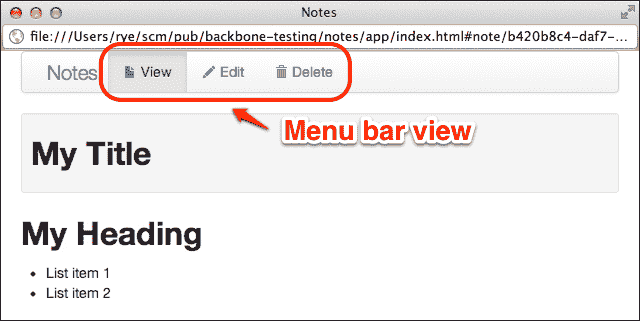
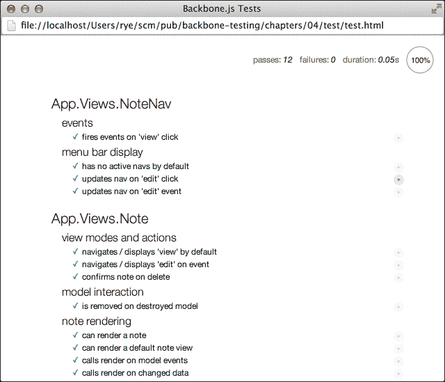

# 第四章。测试间谍

当我们开始查看我们 Backbone.js 应用程序中更复杂的部分时，隔离依赖项和可测试行为的流程可能会变得越来越艰巨。为了在这些领域提供一些帮助，我们将介绍 Sinon.JS，这是一个强大的测试模拟、存根和间谍库，在本章中。

Sinon.JS 允许我们人为地隔离 Backbone.js 组件并测试特定的行为，而无需与应用程序的其他部分交互。我们将从以下主题开始讨论 Sinon.JS：

+   识别在 Backbone.js 应用程序和测试场景中通常发现的测试限制，以及可以从中受益的测试模拟

+   介绍 Sinon.JS 测试替身和断言库

+   学习如何使用测试间谍检查应用程序行为

+   将 Sinon-Chai 插件集成到 Chai 中以实现更好的测试断言

+   使用测试间谍和其他 Sinon.JS 工具测试 Backbone.js 应用组件

# 假装你做到了

理想情况下，我们将在 Backbone.js 应用程序的所有部分上运行隔离、快速且一致的测试，而无需任何修改。实际上，这些目标至少在 Backbone.js 应用程序的一些实际代码路径上会遇到障碍。

我们希望对 Backbone.js 组件进行 *隔离* 测试，但许多组件依赖于应用程序的其他部分。我们还想让测试 *快速* 运行，但 Backbone.js 应用程序中的许多部分可能会减慢速度，包括以下内容：

+   网络通信，例如将模型状态持久化到远程后端数据存储或第三方 API

+   使用 Backbone.js 视图和模板进行复杂的 DOM 操作

+   定时事件和 DOM 动画，尤其是那些故意等待的（例如缓慢的 jQuery 淡入）

最后，Backbone.js 应用程序中的许多事件和执行路径是非确定性的。例如，并行网络请求和用户输入可以以任何顺序被应用程序接收。为了处理这些问题，我们有时必须超越实际的程序代码，并在测试期间模拟应用程序的一些部分。有关一些常见的测试限制和模拟动机的深入了解，请参阅 Christian Johansen（Sinon.JS 的创造者）所著的 *规划、作弊和模拟通过 JavaScript 测试*，可在 [`msdn.microsoft.com/en-us/magazine/gg649850.aspx`](http://msdn.microsoft.com/en-us/magazine/gg649850.aspx) 查看。

用于观察和/或替换程序行为的现代技术统称为 **测试替身**。本书中使用的测试替身包括：

+   **间谍**：测试间谍包装要测试的方法并记录输入和输出以供以后使用。然而，它不会更改任何底层方法功能，因为间谍只是一个观察者。测试间谍在需要检查给定函数如何以及何时从应用程序的其他部分被调用的情况下非常有用。

+   **桩（Stubs）**: 测试桩是一个间谍，它除了替换被测试方法的函数功能外，还添加了新的行为。桩对于测试隔离非常有用。例如，当测试一个通常调用其他函数的单个方法时，我们可以简单地使用预编程的行为“桩化”外部函数调用。这样，测试就可以执行特定的测试代码，同时伪造其他所有内容。

+   **模拟（Mocks）**: 模拟是间谍和桩的组合（观察函数调用并替换函数行为），在执行期间还验证预期的函数行为。

### 注意

对于关于测试替身的良好概述，包括我们识别出的三种方法之外的方案，请参阅*探索测试替身连续体*（*Exploring The Continuum Of Test Doubles*）由*马克·西曼*（*Mark Seeman*）所著（[`msdn.microsoft.com/en-us/magazine/cc163358.aspx`](http://msdn.microsoft.com/en-us/magazine/cc163358.aspx)）以及*测试替身模式*网页（*Test Double Patterns*）由*杰拉尔德·梅萨罗斯*（*Gerard Meszaros*）所著（[`xunitpatterns.com/Test%20Double%20Patterns.html`](http://xunitpatterns.com/Test%20Double%20Patterns.html)）。

# 了解 Sinon.JS

Sinon.JS 是一个流行的测试替身库，它提供了间谍、桩、模拟、假服务器和各种辅助工具。在本章中，我们将介绍两个 Sinon.JS 接口——间谍和沙盒测试辅助工具——并在第五章（[`example.org/ch05.html`](http://example.org/ch05.html) "第五章。测试桩和模拟"）*测试桩和模拟*中讨论其余内容。

## 使用 Sinon.JS 监视函数

Sinon.JS 提供了可扩展的测试间谍，可以记录函数执行的许多不同方面，包括调用参数、返回值和抛出的异常。基本开发者工作流程是创建一个间谍，将其连接到被测试的函数，执行该函数，然后验证间谍记录的信息与测试期望相匹配。在本节中，我们将介绍创建间谍的不同方法，并讨论 Sinon.JS 间谍 API 中一些最有用的部分。

### 匿名间谍

间谍可以作为匿名独立函数创建，这通常用于测试 Backbone.js 应用程序中的事件逻辑。例如，我们在以下代码中创建了一个 Backbone.js 事件对象和一个匿名 Sinon.JS 间谍。间谍监听 `foo` 事件，我们触发该事件。然后，我们可以检查间谍并断言间谍被调用了一次，并且传递了 `42` 作为参数：

```js
it("calls anonymous spy on event", function () {
  var eventer = _.extend({}, Backbone.Events),
    spy = sinon.spy();

  // Set up the spy.
  eventer.on("foo", spy);
  expect(spy.called).to.be.false;

  // Fire event.
  eventer.trigger("foo", 42);

  // Check number of calls.
  expect(spy.calledOnce).to.be.true;
  expect(spy.callCount).to.equal(1);

  // Check calling arguments.
  expect(spy.firstCall.args[0]).to.equal(42);
  expect(spy.calledWith(42)).to.be.true;
});
```

### 间谍断言

Sinon.JS 为许多间谍方法和属性提供了 `sinon.assert` 对象的断言辅助函数。在先前的示例中，我们使用了 Chai 断言来验证间谍记录的信息。但是，我们也可以等效地使用 Sinon.JS 断言，如下所示：

```js
it("verifies anonymous spy on event", function () {
  var eventer = _.extend({}, Backbone.Events),
    spy = sinon.spy();

  eventer.on("foo", spy);
  sinon.assert.notCalled(spy);

  eventer.trigger("foo", 42);
  sinon.assert.callCount(spy, 1);
  sinon.assert.calledWith(spy, 42);
});
```

`sinon.assert` 辅助函数与大多数等效的 Chai 断言相比有一个优点，即失败信息是信息性和具体的。例如，对于 `sinon.assert.calledWith(spy, 42)` 的失败断言会产生错误信息 `AssertError: expected spy to be called with arguments 42`。

### 函数间谍

Sinon.JS 间谍还可以包装现有的函数。在以下示例中，我们使用间谍包装函数 `divide`，产生 `divAndSpy`。然后，我们可以以任何可以用于 `divide` 的方式调用 `divAndSpy`。我们还可以检查包装间谍的间谍属性，如 `calledWith()`：

```js
it("calls spy wrapper on function", function () {
  var divide = function (a, b) { return a / b; },
    divAndSpy = sinon.spy(divide);

  // Call wrapped function and verify result.
  expect(divAndSpy(4, 2)).to.equal(2);

  // Now, verify spy properties.
  sinon.assert.calledOnce(divAndSpy);
  sinon.assert.calledWith(divAndSpy, 4, 2);

  // Sinon.JS doesn't have assert for returned.
  expect(divAndSpy.returned(2)).to.be.true;
});
```

### 对象方法间谍

最后，Sinon.JS 间谍可以包装对象中的方法。这是在整体类或 Backbone.js 组件中监视一个方法以在整个执行路径中收集信息的特别强大的手段。包装的对象方法包含 Sinon.JS 间谍属性，这意味着我们不需要单独跟踪间谍变量。

包装的对象方法在用 `restore()` 函数取消包装之前仍然是间谍，该函数移除间谍并恢复原始函数。作为一个例子，让我们考虑以下具有两个方法的对象：

```js
var obj = {
  multiply: function (a, b) { return a * b; },
  error: function (msg) { throw new Error(msg); }
};
```

我们可以监视 `multiply` 来验证其调用和返回值，并监视 `error` 来检查它是否抛出预期的异常。在这两种情况下，我们直接调用包装的对象方法（例如，`obj.multiply()`），然后访问方法间谍。最后，我们需要在测试结束时调用 `restore()` 来取消包装 `obj` 上的间谍：

```js
it("calls spy on wrapped object", function () {
  // Wrap members with `sinon` directly.
  sinon.spy(obj, "multiply");
  sinon.spy(obj, "error");

  expect(obj.multiply(5, 2)).to.equal(10);
  sinon.assert.calledWith(obj.multiply, 5, 2);
  expect(obj.multiply.returned(10)).to.be.true;

  try {
    obj.error("Foo");
  } catch (e) {}
  sinon.assert.threw(obj.error, "Error");

  // Have to restore after tests finish.
  obj.multiply.restore();
  obj.error.restore();
});
```

## 使用 Sinon.JS 测试助手在沙盒中玩耍

之前示例规范的问题之一是，如果在调用 `restore()` 之前断言失败，对象方法仍然被间谍包装。如果任何后续（并且其他方面通过）的测试尝试包装已经包装的方法，Sinon.JS 将抛出错误，例如 `TypeError: Attempted to wrap <function name> which is already wrapped>`。

因此，确保每个间谍最终都调用 `restore()` 是很重要的，无论底层测试是否通过。实现这一目标的一种方法是在测试中使用 `try`/`finally` 块。另一种方法是创建间谍在 `before` 函数中，并在 `after` 函数中调用它们上的 `restore()`。然而，最简单且最灵活的方法可能是使用 `sinon.test` 沙盒函数。

Sinon.JS 提供了一个称为 **沙盒** 的执行环境，可以配置间谍、存根、模拟和其他假对象（例如，假定时器和 AJAX 请求）。方便的是，所有伪造的属性和方法都可以通过在沙盒对象上调用单个 `restore()` 调用来取消包装。

### 小贴士

高度推荐查看 [Sinon.JS 沙盒文档](http://sinonjs.org/docs/#sandbox)。在沙盒中应用程序执行方式的变化涉及一些微妙的问题和惊喜。例如，默认沙盒会伪造时间和相关函数，如 `setTimeout`。这意味着如果您的代码在执行前等待 10 毫秒，它将不会在开发者**手动**推进假 `clock` 对象的时间之前运行。

`sinon.test` 包装函数通过创建默认的沙盒，并在包装的代码执行完成后自动恢复，将这一步进一步。使用 `sinon.test` 重复我们之前的对象方法示例，可以得到一个更优雅的规范版本，其中我们不需要手动在间谍上调用 `restore()`，同时仍然保证包装的对象方法被恢复：

```js
it("calls spy with test helper", sinon.test(function () {
  // Wrap members using context (`this`) helper.
  this.spy(obj, "multiply");
  this.spy(obj, "error");

  expect(obj.multiply(5, 2)).to.equal(10);
  sinon.assert.calledWith(obj.multiply, 5, 2);
  expect(obj.multiply.returned(10)).to.be.true;

  try {
    obj.error("Foo");
  } catch (e) {}
  sinon.assert.threw(obj.error, "Error");

  // No restore is necessary.
}));
```

虽然 `sinon.test` 辅助工具是管理 Sinon.JS 对象的有用工具，但它并不总是适合每个规范。例如，异步 Mocha 测试很棘手，因为 `sinon.test` 可能会在测试代码中稍后调用 `done()` 参数之前恢复整个沙盒。此外，使用 `sinon.test` 的副作用是，Mocha 测试报告器在测试驱动网页中点击规范描述时将不再显示测试代码。这个原因是有道理的——`sinon.test` 包装了实际的测试函数，因此 `sinon.test` 是 Mocha 报告器所看到的全部。何时使用 `sinon.test` 简化方法，最终取决于开发者的直觉和经验。在这本书中，我们使用包装器来处理我们基于 Sinon.JS 的同步规范的一部分子集。

## 深入了解 Sinon.JS 间谍 API

Sinon.JS 间谍提供了一套相当全面的属性和方法，用于检查执行信息（有关完整列表，请参阅[`sinonjs.org/docs/#spies`](http://sinonjs.org/docs/#spies)）。间谍可以被一般地检查，以查看在执行过程中是否遇到了某个参数或返回值，或者具体地检查单个函数调用的信息。

### 间谍 API

一套有用的间谍方法和属性包括：

+   `spy.callCount(num)`: 此方法返回被监视函数被调用的次数。这可以作为断言使用，例如`sinon.assert.callCount(spy, num)`。

+   `spy.called`: 如果函数被调用一次或多次，则此值为`true`。Sinon.JS 还提供了一些属性来验证特定的调用次数，例如`spy.calledOnce`。断言版本包括`sinon.assert.called(spy)`、`sinon.assert.notCalled(spy)`和`sinon.assert.calledOnce(spy)`。

+   `spy.calledWith*`/`spy.notCalledWith*`: Sinon.JS 提供了可以验证间谍是否有时/总是使用预期参数调用的方法。例如，`spy.calledWithExactly(arg1, arg2)`检查函数是否一次或多次使用`arg1`和`arg2`调用。相比之下，`spy.alwaysCalledWith(arg1)`检查每次函数调用是否都有一个第一个参数`arg1`以及任意数量的附加参数。

+   `spy.returned(obj)`/`spy.alwaysReturned(obj)`: 如果函数一次或多次/每次调用都返回了`obj`，则此方法返回`true`。

Sinon.js 间谍还会记录抛出的异常，可以使用以下方法进行检查：

+   `spy.threw()`: 如果函数一次或多次抛出异常，则返回 `true`。`spy.alwaysThrew()` 选项在每次调用都抛出异常时返回 `true`。两者都可以接受可选的字符串类型（例如，`"Error"`）或实际的错误对象，以要求异常类型匹配。断言版本分别是 `sinon.assert.threw(spy)` 和 `sinon.assert.alwaysThrew(spy)`。

### The spy call API

每次被监视的函数被调用时，Sinon.JS 都会将包含相关信息的 **调用对象** 存储在一个内部数组中。调用对象在需要检查特定调用，但被监视的函数执行多次的情况下非常有用。

调用对象可以通过多种方式从间谍中访问：

+   `spy.getCall(n)`: 从零索引数组中检索间谍的第 *n* 个调用对象。例如，`spy.getCall(1)` 检索间谍函数第二次被调用时的调用对象。

+   `spy.firstCall`、`spy.secondCall`、`spy.thirdCall` 和 `spy.lastCall`: 这些是辅助属性，用于访问常用调用对象。

调用对象提供了封装特定函数调用的方法和属性：

+   `spyCall.calledOn(obj)`: 如果 `obj` 是调用时的上下文（`this`）变量，则返回 `true`。`this` 变量的值也可以直接从 `spyCall.thisValue` 属性中获取。

+   `spyCall.calledWith*`/`spyCall.notCalledWith*`: 这些是间谍调用方法，用于验证是否使用特定参数进行了 *单个* 调用。它与间谍 API 方法平行，后者检查 *所有* 函数调用，而不仅仅是单个调用。调用对象还提供了函数被调用时的特定参数，在 `spyCall.args` 属性中。

+   `spyCall.returnValue`: 这是包含函数调用返回值的属性。

+   `spyCall.threw()`: 这会返回 `true` 如果函数调用抛出了异常。异常对象本身可以通过 `spyCall.exception` 获取。

# 使用 Sinon.JS 插件丰富 Chai

使用 Chai 库的主要动机之一是其链式断言的自然语言语法。Chai 的另一个优点是它在断言失败时产生清晰的错误消息。

不幸的是，Sinon.JS 间谍在我们的测试框架中创建了一些断言挑战。为了说明问题，让我们关注之前的例子，该例子断言 `obj.multiply()` 方法（被间谍包装）以参数 `5` 和 `2` 被调用。

在这一点上，我们已经遇到了两种在 Sinon.JS 间谍上进行断言的方式——使用 Chai 断言和使用 Sinon.JS 内置的间谍断言。从第一种方法开始，我们可以在间谍上编写一个 Chai 断言，如下所示：

```js
expect(obj.multiply.calledWith(5, 2)).to.be.true;
```

然而，这个声明的缺点是，如果断言失败，Chai 将产生无用的错误消息 `expected false to be true`。

如果我们使用 Sinon.JS 断言版本，可以得到一个更好的错误消息，`AssertError: expected multiply to be called with arguments 5, 2`。

```js
sinon.assert.calledWith(obj.multiply, 5, 2);
```

但这样我们就失去了 Chai 点符号语法的自然可读性。

我们真正想要的是一个在出现错误时显示类似`expected multiply to have been called with arguments 5, 2`的错误消息，并且断言如下所示：

```js
expect(obj.multiply).to.be.calledWith(5, 2);
```

幸运的是，我们可以通过使用 Chai 的插件功能，获得两个世界的最佳之处——可读的 Chai 断言和具有信息性的库特定错误消息。

## 引入和安装 Chai 插件

Chai 支持插件([`chaijs.com/plugins`](http://chaijs.com/plugins))，这些插件通过上下文有用的更改和错误消息来修改和扩展 Chai 断言 API。在本节中，我们将介绍并安装 Chai 的 Sinon.JS 适配器，为我们提供更简洁且最终更有用的测试替代表述。

### 注意

推荐使用 Sinon.JS 适配器，但这完全是可选的。尽管我们将在本书的其余部分使用该插件，但我们的所有测试断言都可以使用原生的 Chai 重写为等效语句。

**Sinon-Chai**插件([`chaijs.com/plugins/sinon-chai`](http://chaijs.com/plugins/sinon-chai))可以从 GitHub 下载，地址为[`raw.github.com/domenic/sinon-chai/2.4.0/lib/sinon-chai.js`](https://raw.github.com/domenic/sinon-chai/2.4.0/lib/sinon-chai.js)。目前我们使用的是版本 2.4.0。该文件应放置在我们其他测试库相同的目录(`test/js/lib/`)中，并在测试驱动网页中与其他库一起包含：

```js
<!-- JavaScript Test Libraries. -->
<script src="img/mocha.js"></script>
<script src="img/chai.js"></script>
<script src="img/sinon-chai.js"></script>
<script src="img/sinon.js"></script>
```

Sinon-Chai 必须在 Chai 之后包含，并且可以在 Sinon.JS 库之前或之后包含。有了这个额外的包含，我们就准备好开始编写更易读和更有信息的 Chai 断言。

### 小贴士

其他可能对 Backbone.js 应用程序测试有用的 Chai 插件包括 Backbone.js 适配器([`chaijs.com/plugins/chai-backbone`](http://chaijs.com/plugins/chai-backbone))和 jQuery([`chaijs.com/plugins/chai-jquery`](http://chaijs.com/plugins/chai-jquery))。Backbone.js 插件为 Backbone.js 特定的结构添加了断言，例如`trigger`（用于事件）和`routes.to`（用于路由）。jQuery 插件将各种 jQuery 函数代理到 Chai 断言中，使得可以编写如下语句：`expect($text).to.have.html("<em>Edit your note!</em>")`。

## Sinon.JS 插件

Sinon-Chai 插件扩展了 Chai，增加了几个与 spy 相关的断言，包括以下内容：

+   **调用次数**：`expect(spy).to.have.been.called`、`expect(spy).to.have.been.calledOnce`、`expect(spy).to.have.been.calledTwice`和`expect(spy).to.have.been.calledThrice`

+   **调用顺序**：`expect(spy1).to.have.been.calledAfter(spy2)`和`expect(spy1).to.have.been.calledBefore(spy2)`

+   **调用参数**：`expect(spy).to.have.been.calledWithNew`，`expect(spy).to.have.been.calledOn(context)`，`expect(spy).to.have.been.calledWith(arg1, arg2, ...)`，`expect(spy).to.have.been.calledWithExactly(arg1, arg2, ...)`，以及 `expect(spy).to.have.been.calledWithMatch(arg1, arg2, ...)`

+   **返回值**：`expect(spy).to.have.returned(returnVal)`

+   **错误**：`expect(spy).to.have.thrown()`

该插件还添加了一个新的断言标志：

+   `always`：它表示间谍函数必须通过 *每个* 函数调用的断言，而不仅仅是单个或多个函数调用。例如，我们可以将以下检查 *任何* 函数调用的断言转换为检查 *每个* 调用的断言：

    ```js
    expect(spy).to.always.have.been.calledWith(arg1, arg2, ...);
    expect(spy).to.have.always.returned(returnVal);
    expect(spy).to.have.always.thrown();
    ```

现在，我们可以使用 Sinon-Chai 断言重写我们之前的一个测试示例，如下所示：

```js
it("calls spy with chai plugin", sinon.test(function () {
  this.spy(obj, "multiply");
  this.spy(obj, "error");

  expect(obj.multiply(5, 2)).to.equal(10);
  expect(obj.multiply).to.have.been.calledWith(5, 2);
  expect(obj.multiply).to.have.returned(10);

  try { obj.error("Foo"); } catch (e) {}
  expect(obj.error).to.have.thrown("Error");
}));
```

在之前的重构测试中，任何间谍断言失败都会产生如`expected multiply to have been called with arguments 5, 2`之类的信息。因此，Sinon-Chai 插件允许我们在 Chai 的链式点号格式中保留间谍断言，同时生成有用的失败信息。

# 使用间谍测试 Backbone.js 组件

在我们的 Sinon.JS 间谍和其他实用工具准备就绪后，我们将开始监视我们的 Backbone.js 应用程序。在本节中，我们将介绍并测试两个笔记应用程序视图——菜单栏视图和单个笔记视图。

### 小贴士

**通过示例进行操作**

重申前一章的观点，我们将首先展示菜单栏视图和单个笔记视图的实现代码，然后是测试代码，以帮助维持一个正确介绍笔记应用程序的叙述结构（并使内容简短）。这并不是实际测试开发的首选顺序。

因此，在阅读每个组件描述的行为后，我们建议您暂时放下这本书，尝试为示例应用程序组件设计并实现自己的测试。完成这个练习后，您可以继续阅读，并将您的测试与本章中的组件测试套件进行比较。

## 笔记菜单栏视图

笔记菜单栏视图 `App.Views.NoteNav` 控制单个笔记的 **编辑**、**查看** 和 **删除** 菜单栏按钮。以下截图展示了带有活动 **查看** 按钮的菜单栏。



单页菜单栏视图

`App.Views.NoteNav` 视图协调视图、编辑和删除菜单操作的事件。例如，如果在之前的图中点击了 **编辑** 按钮，`App.Views.NoteNav` 视图将发出以下自定义 Backbone.js 事件：

+   `nav:update:edit`：这会导致活动 HTML 菜单栏项切换到新的选定操作，例如，从 **查看** 切换到 **编辑**。

+   `nav:edit`：这个事件被触发以向其他 Backbone.js 组件发出操作动作（例如，视图或编辑）已更改的信号。例如，`App.Views.Note` 视图监听此事件，并在其视图区域显示相应动作面板的 HTML。

菜单栏视图附加到 DOM 列表 `#note-nav`，这是由 `notes/app/index.html` 应用页面提供的。`#note-nav` 的 HTML 可以简化为以下基本部分：

```js
<ul id="note-nav"
  class="nav region region-note"
  style="display: none;">
  <li class="note-view active">View</li>
  <li class="note-edit">Edit</li>
  <li class="note-delete">Delete</li>
</ul>
```

菜单栏列表默认隐藏（但由 `App.Views.Note` 显示）。实例化后，`App.Views.NoteNav` 视图设置各种监听器并激活适当的菜单栏项。

### 菜单栏视图

现在我们已经审查了视图的显示设置和整体功能，我们可以深入研究 `notes/app/js/app/views/note-nav.js` 中的应用代码：

```js
App.Views.NoteNav = Backbone.View.extend({

  el: "#note-nav",
```

在指定默认 `el` 元素以附加视图之后，视图将用户菜单栏点击绑定到适当的动作（例如，编辑）在 `events` 中，并在 `initialize` 中设置监听器以在发生外部事件时更新菜单栏。

```js
  events: {
    "click .note-view":   "clickView",
    "click .note-edit":   "clickEdit",
    "click .note-delete": "clickDelete",
  },

  initialize: function () {
    // Defaults for nav.
    this.$("li").removeClass("active");

    // Update the navbar UI for view/edit (not delete).
    this.on({
      "nav:update:view": this.updateView,
      "nav:update:edit": this.updateEdit
    });
  },
```

函数 `updateView` 和 `updateEdit` 切换 `active` CSS 类，这会在菜单栏中视觉上改变高亮的标签：

```js
  updateView: function () {
    this.$("li").not(".note-view").removeClass("active");
    this.$(".note-view").addClass("active");
  },
  updateEdit: function () {
    this.$("li").not(".note-edit").removeClass("active");
    this.$(".note-edit").addClass("active");
  },
```

函数 `clickView`、`clickEdit` 和 `clickDelete` 发出与菜单栏动作对应的视图事件：

```js
  clickView: function () {
    this.trigger("nav:update:view nav:view");
    return false;
  },
  clickEdit: function () {
    this.trigger("nav:update:edit nav:edit");
    return false;
  },
  clickDelete: function () {
    this.trigger("nav:update:delete nav:delete");
    return false;
  }
});
```

### 测试和监视菜单栏视图

`App.Views.NoteNav` 视图相当小，本质上只是代理事件并更新菜单栏 UI。我们的测试目标同样简单：

+   验证 `App.Views.NoteNav` 是否正确绑定到 DOM，无论是默认为 `#note-nav` 还是通过传递的 `el` 参数

+   检查菜单栏动作事件是否被正确触发和监听

+   确保菜单栏 HTML 在适当动作下被修改

在这些指南的指导下，让我们逐步审查 `chapters/04/test/js/spec/views/note-nav.spec.js`，这是菜单栏视图的套件。

该套件首先设置一个测试固定装置和视图。`before()` 调用创建了我们为生成适合测试视图的菜单栏列表所需的最低限度的 HTML。`beforeEach()` 函数将 `this.$fixture` 附带到 DOM 中已存在的 `#fixtures` 容器，并创建一个新的 `App.Views.NoteNav` 对象。`afterEach()` 调用移除视图，`after()` 完全清空 `#fixtures` 容器：

```js
describe("App.Views.NoteNav", function () {
  before(function () {
    this.$fixture = $(
      "<ul id='note-nav'>" +
        "<li class='note-view'></li>" +
        "<li class='note-edit'></li>" +
        "<li class='note-delete'></li>" +
      "</ul>"
    );
  });

  beforeEach(function () {
    this.$fixture.appendTo($("#fixtures"));
    this.view = new App.Views.NoteNav({
      el: this.$fixture
    });
  });

  afterEach(function () {
    this.view.remove();
  });

  after(function () {
    $("#fixtures").empty();
  });
```

第一个嵌套套件 `events` 包含一个规格，验证点击菜单栏项是否触发适当的 `nav:*` 和 `nav:update:*` 事件。我们创建三个 Sinon.JS 监视器来帮助我们完成这项任务：

+   `navSpy` 和 `updateSpy`：这些对象监视 `nav:view` 和 `nav:update:view` 事件，应该在点击 **视图** 菜单栏项时被调用

+   `otherSpy`：这个监视器监听所有其他潜在的动作事件，并用于检查其他事件是否没有触发

我们使用 Sinon-Chai 适配器扩展来制作我们的监视器断言：

```js
  describe("events", function () {
    it("fires events on 'view' click", function () {
      var navSpy = sinon.spy(),
        updateSpy = sinon.spy(),
        otherSpy = sinon.spy();

      this.view.on({
        "nav:view": navSpy,
        "nav:update:view": updateSpy,
        "nav:edit nav:update:edit": otherSpy,
        "nav:delete nav:update:delete": otherSpy
      });

      this.$fixture.find(".note-view").click();

      expect(navSpy).to.have.been.calledOnce;
      expect(updateSpy).to.have.been.calledOnce;
      expect(otherSpy).to.not.have.been.called;
    });
  });
```

`menu bar display` 套件中的规范检查 DOM 内容和页面与视图的交互。第一个规范 `has no active navs by default` 检查菜单栏 HTML 默认没有活动选择——对于一个基于 Bootstrap 的导航栏，这意味着没有 `active` CSS 类：

```js
  describe("menu bar display", function () {
    it("has no active navs by default", function () {
      // Check no list items are active.
      expect(this.view.$("li.active")).to.have.length(0);

      // Another way - manually check each list nav.
      expect($(".note-view")
        .attr("class")).to.not.include("active");
      expect($(".note-edit")
        .attr("class")).to.not.include("active");
      expect($(".note-delete")
        .attr("class")).to.not.include("active");
    });
```

然后，剩余的规范检查点击**编辑**菜单栏标签或触发直接 `nav:update:edit` 事件是否会导致相应的菜单栏项被激活（通过插入 CSS 类 `active`）：

```js
    it("updates nav on 'edit' click", function () {
      $(".note-edit").click();
      expect($(".note-edit").attr("class")).to.include("active");
    });

    it("updates nav on 'edit' event", function () {
      this.view.trigger("nav:update:edit");
      expect($(".note-edit").attr("class")).to.include("active");
    });
  });
});
```

通过之前的测试，我们可以验证 `App.Views.NoteNav` 触发适当的事件，并且其 HTML 对用户点击和外部事件做出响应。

## 笔记单个笔记视图

`App.Views.Note` 视图控制了我们迄今为止遇到的关于单个笔记的所有内容。每个 `App.Views.Note` 对象实例化一个新的 `App.Views.NoteView` 对象，并引用外部的 `App.Views.NoteNav` 对象。

类的主要职责，我们将在测试中验证，包括以下内容：

+   响应菜单栏操作事件更新适当的查看面板模式（例如，编辑或查看）

+   删除单个笔记模型，然后清理视图并路由回所有笔记列表视图

+   在删除笔记之前要求用户确认

+   响应编辑表单字段变化，将笔记模型数据保存到后端存储

+   响应模型数据变化更新 HTML 显示面板

我们首先查看视图使用的 HTML 模板字符串。它在我们的应用程序模板文件 `notes/app/js/app/templates/templates.js` 中找到：

```js
App.Templates["template-note"] =
  "<div id=\"note-pane-view\" class=\"pane\">" +
  "  <div id=\"note-pane-view-content\"></div>" +
  "</div>" +
  "<div id=\"note-pane-edit\" class=\"pane\">" +
  "  <form id=\"note-form-edit\">" +
  "    <input id=\"input-title\" class=\"input-block-level\"" +
  "           type=\"text\" placeholder=\"title\"" +
  "           value=\"<%= title %>\">" +
  "    <textarea id=\"input-text\" class=\"input-block-level\"" +
  "              rows=\"15\"><%= text %></textarea>" +
  "  </form>" +
  "</div>";
```

模板提供了两个 `div` UI 面板用于操作模式——`note-pane-view` 用于 *查看* 笔记和 `note-pane-edit` 用于 *编辑* 数据。它还绑定两个模板变量——`title` 和 `text`——到 `note-form-edit` 表单中的编辑输入。

### 单个笔记视图

进入应用程序代码 `notes/app/js/app/views/note-nav.js`，我们首先声明 DOM 标识符和模板，然后设置两个事件——第一个事件在浏览器发生 `blur` 事件时保存笔记数据，第二个事件防止编辑表单执行真正的 HTTP 页面提交：

```js
App.Views.Note = Backbone.View.extend({

  id: "note-panes",

  template: _.template(App.Templates["template-note"]),

  events: {
    "blur   #note-form-edit": "saveNote",
    "submit #note-form-edit": function () { return false; }
  },
```

`initialize` 函数为视图做了大部分繁重的工作。首先，它从参数选项设置 `this.nav`，从选项或从外部的 `app` 应用程序对象设置 `this.router`。

### 注意

我们从 `opts` 参数中可选地获取路由对象的原因是它使得覆盖 Backbone.js 依赖项变得更容易。在我们的测试中，我们将使用 `opts` 传递一个 Sinon.JS 间谍而不是一个记录行为但不实际路由的真实路由器。对此场景的另一种方法（在下一章中介绍）是直接模拟或存根 `app.router`。

然后，视图通过调用辅助函数 `_addListeners` 在各种对象上设置事件监听器。最后，视图对象使用模型数据将 Underscore.js 模板渲染为 HTML，设置动作状态，并实例化一个子 `App.Views.NoteView` 对象以处理 Markdown 渲染：

```js
initialize: function (attrs, opts) {
    opts || (opts = {});
    this.nav = opts.nav;
    this.router = opts.router || app.router;

    // Add our custom listeners.
    this._addListeners();

    // Render HTML, update to action, and show note.
    this.$el.html(this.template(this.model.toJSON()));
    this.update(opts.action || "view");
    this.render();

    // Add in viewer child view (which auto-renders).
    this.noteView = new App.Views.NoteView({
      el: this.$("#note-pane-view-content"),
      model: this.model
    });
  },
```

作为初始化的一部分，`_addListeners` 辅助函数将对象事件绑定如下：

+   **模型** (`this.model`)：当模型被销毁时，视图会移除自己。当模型数据更改时，它会重新渲染并将模型保存到后端。

+   **菜单栏视图** (`this.nav`)：笔记视图监听菜单栏导航事件，并在用户点击 **查看** 时调用特定的动作函数，如 `viewNote()`。

+   **笔记视图** (`this`)：笔记视图还直接监听来自外部 Backbone.js 组件的动作状态（查看或编辑）事件。例如，应用程序路由器使用这些事件激活现有的 `App.Views.Note` 视图对象并设置适当的动作状态。

将此转换为代码产生以下函数：

```js
  _addListeners: function () {
    // Model controls view rendering and existence.
    this.listenTo(this.model, {
      "destroy": function () { this.remove(); },
      "change":  function () { this.render().model.save(); }
    });

    // Navbar controls/responds to panes.
    this.listenTo(this.nav, {
      "nav:view":   function () { this.viewNote(); },
      "nav:edit":   function () { this.editNote(); },
      "nav:delete": function () { this.deleteNote(); }
    });

    // Respond to update events from router.
    this.on({
      "update:view": function () { this.render().viewNote(); },
      "update:edit": function () { this.render().editNote(); }
    });
  },
```

`render()` 函数显示单个笔记视图的 HTML，并隐藏其他视图使用的任何 HTML 内容：

```js
  // Rendering the note is simply showing the active pane.
  // All HTML should already be rendered during initialize.
  render: function () {
    $(".region").not(".region-note").hide();
    $(".region-note").show();
    return this;
  },
```

`remove()` 方法首先移除包含的 `App.Views.NoteView` 对象，然后是 `App.Views.Note` 对象本身：

```js
  remove: function () {
    // Remove child, then self.
    this.noteView.remove();
    Backbone.View.prototype.remove.call(this);
  },
```

`update()` 方法接受一个动作字符串参数（`"view"` 或 `"edit"`），然后触发菜单栏视图更新到新状态，显示适当的 HTML 动作面板，并更新 URL 案件片段：

```js
  update: function (action) {
    action = action || this.action || "view";
    var paneEl = "#note-pane-" + action,
      loc = "note/" + this.model.id + "/" + action;

    // Ensure menu bar is updated.
    this.nav.trigger("nav:update:" + action);

    // Show active pane.
    this.$(".pane").not(paneEl).hide();
    this.$(paneEl).show();

    // Store new action and navigate.
    if (this.action !== action) {
      this.action = action;
      this.router.navigate(loc, { replace: true });
    }
  },
```

接下来的三个方法——`viewNote()`、`editNote()` 和 `deleteNote()`——处理单个笔记的基本动作。前两个方法只是使用适当的动作调用 `update()`，而 `deleteNote()` 则销毁笔记模型并路由回所有笔记列表（即应用程序主页）：

```js
  viewNote: function () {
    this.update("view");
  },
  editNote: function () {
    this.update("edit");
  },
  deleteNote: function () {
    if (confirm("Delete note?")) {
      this.model.destroy();
      this.router.navigate("", { trigger: true, replace: true });
    }
  },
```

最后，`saveNote()` 接收编辑表单输入并更新底层的笔记模型：

```js
  saveNote: function () {
    this.model.set({
      title: this.$("#input-title").val().trim(),
      text: this.$("#input-text").val().trim()
    });
  }
});
```

### 测试单个笔记视图

我们对 `App.Views.Note` 的测试集中在我们在介绍视图时讨论的类的各种职责。具体来说，我们想要验证笔记视图可以更新动作（例如查看和编辑）的 UI 元素，删除笔记，保存模型数据，并在各种其他 Backbone.js 应用程序组件之间正确绑定事件。

在 `chapters/04/test/js/spec/views/note.spec.js` 的单个笔记测试套件中，我们首先创建一个初始测试状态。在套件范围的 `before()` 函数中，我们添加了区域（其中 `App.Views.Note` 使用 region-note）的固定元素，为视图本身添加了 HTML 固定元素，然后存根笔记模型原型的 `save()` 方法。

### 笔记

尽管 Sinon.JS 存根在本章中未完全介绍，但我们在这里使用它来记录对 `save()` 的调用，就像间谍一样，并防止该方法尝试将数据保存到远程后端，这在本测试上下文中会引发错误。

```js
describe("App.Views.Note", function () {

  before(function () {
    // Regions for different views.
    $("#fixtures").append($(
      "<div class='region-note' style='display: none;'></div>" +
      "<div class='region-notes' style='display: none;'></div>"
    ));

    // App.Views.Note fixture.
    this.$fixture = $(
      "<div id='note-fixture region-note'>" +
        "<div id='#note-pane-view-content'></div>" +
      "</div>"
    );

    // Any model changes will trigger a `model.save()`, which
    // won't work in the tests, so we have to fake the method.
    sinon.stub(App.Models.Note.prototype, "save");
  });
```

在`beforeEach()`设置方法中，我们将视图固定装置附加到固定装置容器，并创建一个用来替换我们真实 Backbone.js 路由的间谍函数。然后，我们创建一个`App.Views.Note`对象，并将固定装置和一个新的`App.Models.Note`绑定到它。我们还向`App.Views.Note`实例提供了两个初始化选项：

+   `nav`：我们传递一个原始的`Backbone.View`对象作为菜单栏视图的替代品，通过它代理事件，同时省略了真实的视图逻辑和 DOM 交互

+   `router`：我们传递`this.routerSpy`以记录 Backbone.js 路由事件，而实际上并不改变我们的浏览器历史/URL 状态

    ```js
    beforeEach(function () {
        this.routerSpy = sinon.spy();
        this.$fixture.appendTo($("#fixtures"));

        this.view = new App.Views.Note({
          el: this.$fixture,
          model: new App.Models.Note()
        }, {
          nav: new Backbone.View(),
          router: {
            navigate: this.routerSpy
          }
        });
      });
    ```

值得注意的是，我们将四个视图依赖项（`el`、`model`、`nav`和`router`）注入到`App.Views.Note`中，以帮助隔离实例并使其可测试。在这种配置下，我们套件中的规范可以被认为是部分集成测试，因为我们正在使用（并测试）真实的 Backbone.js 对象，而不仅仅是测试下的视图。

关于之前的设置，另一个观察结果是`nav`和`router`选项参数是特意选择的，以避免触发完整应用程序的真实行为；例如，操作菜单栏 DOM 或更改浏览器的 URL。正如我们将在第五章中学习到的，“测试存根和模拟”，这种行为替换可以通过 Sinon.JS 存根或模拟更简洁、更适当地完成。

接下来进行测试拆解，在`afterEach()`中，我们清除测试固定装置并删除任何仍然存在的视图对象。（规范可能已经销毁了测试视图对象。）最后，在套件末尾的`after()`中，我们清除顶级固定装置容器并恢复`App.Models.Note`类的`save()`方法到其原始状态：

```js
  afterEach(function () {
    this.$fixture.empty();
    if (this.view) { this.view.model.destroy(); }
  });

  after(function () {
    $("#fixtures").empty();
    App.Models.Note.prototype.save.restore();
  });
```

我们的设置/拆解完成，接下来进入第一个嵌套测试套件，`视图模式和操作`，该套件验证用户 DOM 交互和 Backbone.js 事件可以控制笔记视图，并使其在编辑、查看和删除模式之间切换：

```js
  describe("view modes and actions", function () {
```

默认情况下，`App.Views.Note`视图路由到 URL 哈希片段`#note/:id/view`并显示查看模式 HTML。我们使用我们的路由间谍来验证使用 Sinon-Chai `calledWithMatch`扩展调用的哈希片段的后缀。然后，我们通过简单的 CSS `display`属性检查断言只有查看面板`#note-pane-view`是可见的：

```js
    it("navigates / displays 'view' by default", function () {
      expect(this.routerSpy).to.be.calledWithMatch(/view$/);

      // Check CSS visibility directly. Not necessarily a best
      // practice as it uses internal knowledge of the DOM, but
      // gets us a quick check on what should be the visible
      // view pane.
      expect($("#note-pane-view")
        .css("display")).to.not.equal("none");
      expect($("#note-pane-edit")
        .css("display")).to.equal("none");
    });
```

下一个规范触发`update:edit`事件，然后验证这会将 URL 哈希片段更改为`#note/:id/edit`并显示编辑面板：

```js
    it("navigates / displays 'edit' on event", function () {
      this.view.trigger("update:edit");
      expect(this.routerSpy).to.be.calledWithMatch(/edit$/);

      expect($("#note-pane-edit")
        .css("display")).to.not.equal("none");
      expect($("#note-pane-view")
        .css("display")).to.equal("none");
    });
```

我们通过模拟`confirm()`弹出窗口始终返回`false`（防止实际笔记删除）并调用`deleteNote()`来测试笔记删除行为。我们需要这个模拟来防止在测试运行期间实际弹出浏览器确认窗口。然后，我们使用存根的间谍属性来验证`confirm()`是否被正确调用：

```js
    it("confirms note on delete", sinon.test(function () {
      this.stub(window, "confirm").returns(false);
      this.view.deleteNote();
      expect(window.confirm)
        .to.have.been.calledOnce.and
        .to.have.been.calledWith("Delete note?");
    }));
  });
```

下一个测试套件`model interaction`包含一个规范，验证模型的删除会导致`App.Views.Note`对象及其包含的`App.Views.NoteView`对象移除。因此，我们在两个视图的`remove()`方法上设置了间谍。

### 小贴士

一旦不再使用视图、模型等，未能清理它们可能导致内存泄漏，这可能会对整体应用程序性能产生重大影响。在底层笔记模型被销毁时触发`App.Views.Note`和`App.Views.NoteView`对象移除是回收 Backbone.js 应用程序各个组件使用内存的一种方式。

同时，还有许多其他技术可以用来控制内存。*僵尸！跑！*([`lostechies.com/derickbailey/2011/09/15/zombies-run-managing-page-transitions-in-backbone-apps/`](http://lostechies.com/derickbailey/2011/09/15/zombies-run-managing-page-transitions-in-backbone-apps/))和*Backbone.js 与 JavaScript 垃圾回收*([`lostechies.com/derickbailey/2012/03/19/backbone-js-and-javascript-garbage-collection/`](http://lostechies.com/derickbailey/2012/03/19/backbone-js-and-javascript-garbage-collection/))是*Derick Bailey*发表的帖子，提供了对 Backbone.js 内存管理问题和解决方案的极佳介绍。

```js
  describe("model interaction", function () {
    afterEach(function () {
      // Wipe out to prevent any further use.
      this.view = null;
    });

    it("is removed on destroyed model", sinon.test(function () {
      this.spy(this.view, "remove"),
      this.spy(this.view.noteView, "remove");

      this.view.model.trigger("destroy");

      expect(this.view.remove).to.be.calledOnce;
      expect(this.view.noteView.remove).to.be.calledOnce;
    });
  });
```

最后一个嵌套测试套件`note rendering`检查模型数据是否正确渲染到 HTML，以及渲染是否在预期应用程序事件响应时触发。第一个规范`可以渲染笔记`验证`render()`显示了适当的 HTML 区域元素并隐藏了其余部分：

```js
  describe("note rendering", function () {

    it("can render a note", function () {
      // Don't explicitly call `render()` because
      // `initialize()` already called it.
      expect($(".region-note")
        .css("display")).to.not.equal("none");
      expect($(".region-notes")
        .css("display")).to.equal("none");
    });
```

接下来的两个规范检查`render()`方法是否在适当的变化时被触发。`在模型事件上调用 render`的规范验证每当模型更改时都会调用`render()`：

```js
    it("calls render on model events", sinon.test(function () {
      // Spy on `render` and check call/return value.
      this.spy(this.view, "render");

      this.view.model.trigger("change");

      expect(this.view.render)
        .to.be.calledOnce.and
        .to.have.returned(this.view);
    }));
```

最终规范修改了单个笔记编辑表中的数据，就像用户操作一样，然后触发`blur`事件以强制模型更改事件。规范监视`render()`方法，并检查渲染的 Markdown HTML 是否已更新以反映新数据：

```js
    it("calls render on changed data", sinon.test(function () {
      this.spy(this.view, "render");

      // Replace form value and blur to force changes.
      $("#input-text").val("# A Heading!");
      $("#note-form-edit").blur();

      // `Note` view should have rendered.
      expect(this.view.render)
        .to.be.calledOnce.and
        .to.have.returned(this.view);

      // Check the `NoteView` view rendered the new markdown.
      expect($("#pane-text").html())
        .to.match(/<h1 id=".*?">A Heading!<\/h1>/);
    }));
  });
});
```

在这个套件的所有规范中，我们增加了对`App.Views.Note`类能够发出/监听适当事件、在模型删除时清理应用程序对象以及其他我们之前确定的视图核心职责的信心。

## 连接和运行视图测试

现在我们有了`App.Views.NoteNav`和`App.Views.Note`的测试套件，让我们连接测试驱动页面`chapters/04/test/test.html`。我们可以重用`chapters/03/test/test.html`中的相同代码，其中有一些（在下述代码中突出显示）差异，添加了 Sinon-Chai 插件、更多的 Notes 应用程序库以及我们的新规范文件：

```js
<head>
  <!-- ... snipped ... -->

  <!-- JavaScript Test Libraries. -->
  <script src="img/mocha.js"></script>
  <script src="img/chai.js"></script>
  <script src="img/sinon-chai.js"></script>
  <script src="img/sinon.js"></script>

  <!-- JavaScript Core Libraries -->
  <!-- ... snipped ... -->

  <!-- JavaScript Application Libraries -->
  <script src="img/namespace.js"></script>
  <script src="img/config.js"></script>
  <script>
    // Test overrides (before any app components).
    App.Config = _.extend(App.Config, {
      storeName: "notes-test" // localStorage for tests.
    });
  </script>
  <script src="img/note.js"></script>
  <script src="img/notes.js"></script>
  <script src="img/templates.js"></script>
  <script src="img/note-nav.js"></script>
  <script src="img/note-view.js"></script>
  <script src="img/note.js"></script>

  <!-- ... snipped ... -->

  <!-- Tests. -->
  <script src="img/note-nav.spec.js"></script>
  <script src="img/note.spec.js"></script>
</head>
```

我们可以通过打开浏览器到`chapters/04/test/test.html`来运行测试。（注意，代码示例包含本章节为简洁而省略的附加规范）。



测试报告

# 摘要

我们在本章中介绍了 Sinon.JS 测试库，并学习了如何在各种测试场景中集成间谍。我们研究了 Chai 的插件架构，并使用 Sinon-Chai 适配器编写了更好的测试间谍断言。我们为菜单栏和单个笔记 Backbone.js 视图编写了规范，完成了笔记应用单个笔记部分的测试。

下一章将继续探索 Sinon.JS，通过研究存根、模拟和其他有用的假测试对象。我们将使用这些工具来完善我们的 Backbone.js 应用程序测试集合，并完善使用 Mocha、Chai 和 Sinon.JS 编写测试的基础知识。
