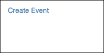
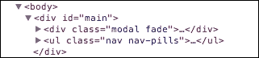
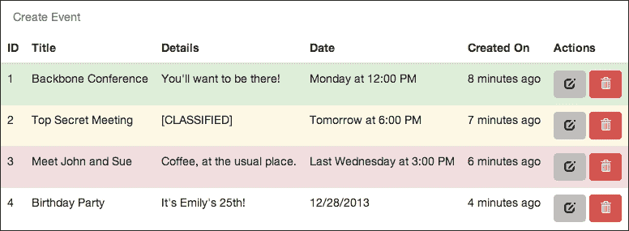
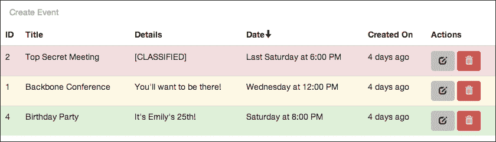
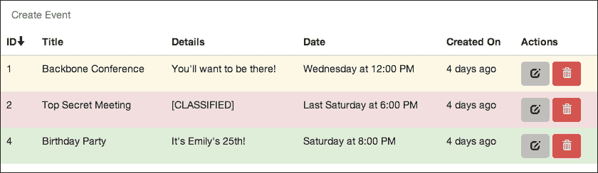

# 第三章：构建实时数据仪表板

这将是一个有趣的章节。到目前为止，我们已经创建了两个相对简单的应用程序。在两种情况下，我们主要是在浏览器中创建和读取数据。虽然这些都是浏览器端的内容，但它相当静态。这次，我们将做一些更有趣的事情；我们将构建一个跟踪事件的表格。然而，有趣的是，我们将构建一个表格，它将根据其他打开我们应用程序的浏览器中的更改自动更新。

以下是一些章节的剧透：

+   我们将探讨通过多个文件进行更好的代码组织

+   我们将编写代码来更新和删除模型实例

+   我们将构建一个轮询服务器以保持其集合更新的应用程序

我们将再次从项目模板开始；然而，在我们的最后两个项目中，我们需要做一些修改。你可能已经注意到我们的 `app.js` 文件变得有点长；这使得在组件之间导航变得困难，并且总的来说，使我们的代码保持整洁和可管理变得困难。所以在这个项目中，我们将把 Backbone 代码拆分成多个文件。我们将把模型和集合放在 `models.js` 中，视图放在 `views.js` 中，路由器放在 `router.js` 中。你可以继续在 `public` 文件夹中创建这些文件（它们现在将是空的）；同时，删除 `app.js`。然后，在 `index.ejs` 文件中，我们需要将 `app.js` 的脚本标签替换为那些新文件的脚本标签，如下所示：

```js
<script src="img/models.js"></script>
<script src="img/views.js"></script>
<script src="img/router.js"></script>
```

# 规划我们的应用程序

在前面的章节中，我们立即开始编写代码。然而，在现实世界中，你不会从一开始就有我来告诉你该写什么。你需要自己规划你的应用程序。所以让我们花点时间来做这件事。

我们想要构建一个应用程序，可以显示过去和即将发生的活动列表。一个活动将有一个标题、一个描述和一个发生日期。这种类型的数据可以很好地在表格中显示。我们需要能够创建新事件，但我们还希望能够编辑和删除现有事件。我们还希望定期轮询服务器以获取事件集合的更改，以便所有连接的客户端都能保持最新。

由于这是一个相当基础的应用，所以这就足够了。现在我们已经明确了它需要做什么，我们可以开始从 Backbone 组件的角度来思考。显然，我们需要一个 `Event` 模型和 `Events` 集合。表格将是一个 `EventsView` 实例，每一行将是一个 `EventView` 实例。我们需要一个用于创建新事件的表单，比如 `CreateEventView` 类，还需要另一个用于编辑现有事件的表单，比如 `EditEventView` 类。我们不需要一个用于删除事件的完整视图；我们只需要一个按钮，可能是在 `EventView` 类中。

关于路由呢？整个表格可以在主页路由`/`上显示。创建表单可以在`/create`上，而编辑表单可以在`/edit/<id>`上。

就这些了！这并不真正代表一个实际应用的规划过程，但它应该让你意识到构建应用不仅仅是编写代码。你可以遵循一些智能流程来简化这个过程。如果你是相对编程新手，你应该了解一下敏捷开发或测试驱动开发等主题。当你刚开始时，这些想法可能会让你觉得项目比必要的花费更多时间，但请相信我，它们会让构建和维护大型项目变得更加简单。

# 设置预编译模板

让我们先谈谈我们用于视图类的模板。在前一章中，我们把模板源文本直接放在`index.ejs`文件中的脚本标签内。这次我们要做一些不同的事情。我们将预编译我们的模板。想想模板的时间线；它从脚本标签中的文本开始。我们一直在获取这个文本，并将其传递给`_.template`函数，该函数将文本编译成一个`template`函数，并将其返回给我们。然后，我们将数据传递给这个函数，并得到带有数据插值的 HTML。所有这些都必须在我们能够向用户显示任何内容之前完成。

我们想要做的是从这个过程中省略几个步骤。我们希望将`template`函数发送到浏览器，而不是发送模板文本并让浏览器编译它。为了做到这一点，我们需要将模板作为我们开发过程的一部分进行编译。

做这件事最简单的方法是使用 Grunt，一个方便的构建工具。首先，我们需要安装它，使用以下命令：

```js
npm install grunt --save-dev
npm install grunt-contrib-jst --save-dev

```

我们在这里不会深入学习 Grunt。如果你不熟悉这个库，网上有很多很好的资源可以学习。从主页[`gruntjs.com/`](http://gruntjs.com/)开始。

我们使用 npm 安装 Grunt 和**JavaScript 模板**（**JST**）Grunt 插件。JST 将为我们进行编译。

接下来，我们需要一个`Gruntfile.js`文件，该文件将配置这个插件。将`Gruntfile.js`放在我们的项目目录的根目录下。在这个文件中，从以下代码开始：

```js
module.exports = function (grunt) {
  grunt.initConfig({});

  grunt.loadNpmTasks('grunt-contrib-jst');
  grunt.registerTask('default', ['jst']);
};
```

你可能还记得，在前一章中，我们使用了`exports`对象从我们的`signin.js`模块导出函数。我们也可以完全覆盖那个`exports`对象；然而，当我们这样做的时候，我们必须使用它的全名，即`module.exports`。我们将一个函数分配给这个对象，该函数接受一个`grunt`对象作为参数。然后，在这个函数内部，我们为我们的项目配置 Grunt。

我们首先调用 `initConfig` 方法，它配置所有插件。之后，我们使用以下代码将插件注册到 Grunt 中；最后，我们可以注册一个任务。我们创建了一个默认任务，当我们在命令行上调用 `grunt` 时将运行这个任务。我们只是简单地告诉它运行 `jst` 任务。

现在，让我们回到之前的 `initConfig` 方法调用，使用以下代码：

```js
grunt.initConfig({
  jst: {
    templates: {
      options:  {
        templateSettings: {
          interpolate : /\{\{(.+?)\}\}/g
        },
        processName: function (filename) {
          return filename.split('/')[1].split('.')[0];
        }
      },
      files: {
        "public/templates.js": ["templates/*.html"]
      }
    }
  }
});
```

我们从一个 `jst` 属性开始，因为那是我们配置的任务的名称。在里面，我们创建一个目标，这是一个为我们任务和想要执行任务（带有这些选项）的文件集的选项。我们称这个目标为 `templates`。第一个选项是 `templateSettings` 对象，我们在前几章中已经使用过；它允许我们使用花括号分隔符语法。我们设置的第二个选项是一个函数，它将为模板命名。我们的模板将是 `templates` 文件夹中的 HTML 文件，所以默认情况下它们的名称将是它们的文件路径；比如 `templates/event.html`。`processName` 函数将把它转换成 `event`。这个名字是我们从视图代码中引用它们的方式。

在 `files` 中，我们选择要处理的文件。在这里，我们说的是所有匹配字符串 `templates/*.html` 的模板文件将被编译成 `public/templates.js`。

这可能看起来设置起来有点多，但现在我们只需要在命令行上运行 `grunt` 来获取预编译的模板。我们将在创建视图时测试这一点。

# 创建模型

现在我们已经设置了模板创建过程，让我们开始项目代码。像之前一样，我们从模型开始。这些将放在 `models.js` 中：

```js
var Event = Backbone.Model.extend({});
var Events = Backbone.Collection.extend({
  model: Event,
  url: '/events'
});
```

目前就这样吧。我们稍后会回来做一些有趣的变化。

在 `server.js` 文件中，我们将为 `Events` 类中刚刚定义的路由创建路由函数。在此之前，我们需要数据库。我们创建它的方法如下：

```js
var db  = new Bourne("db/events.json");
```

这次，我将数据库 JSON 文件放在了一个单独的文件夹中；如果你要这样做，请确保你创建了 `db` 文件夹。

但现在，数据库已经就位，我们可以创建 GET 路由。这个路由将简单地发送我们数据库中的所有记录回浏览器：

```js
app.get("/events", function (req, res) {
  db.find(function (err, events) {
    res.json(events);
  });
});
```

POST 路由是新事件对象数据发送的地方。我们将属性收集到一个对象中并插入它；我们的回调函数只需将更新后的记录发送回浏览器。下面是这个样子：

```js
app.post("/events", function (req, res) {
  var attrs = {
    title: req.body.title,
    details: req.body.details,
    date: req.body.date,
    createdOn: new Date()
  };

  db.insert(attrs, function (err, event) {
    res.json(event);
  });
});
```

再多一个服务器方法，那就是根路由：

```js
app.get('/*', function (req, res) {
  db.find(function (err, events) {
    res.render("index.ejs", { 
      events: JSON.stringify(events) 
    });
  });
});
```

这个路由与我们在前几章中的 get-all 路由非常相似。它将渲染我们的 `index.ejs` 模板，并将所有事件记录发送到浏览器。

# 创建控件

让我们从一些控件开始。正如我们之前决定的，我们需要能够打开一个表单来创建新事件，所以让我们在页面顶部的控制栏上放一个按钮。

我们可以从模板开始。如果你还没有开始，请在项目的根目录下创建一个名为`templates`的目录。在里面，创建一个名为`controls.html`的文件，并将以下代码放入其中：

```js
<li><a href="/create"> Create Event </a></li>
```

我们只有一个控制项，实际上它不需要是一个模板，但这给了我们以后轻松扩展它的能力。我们实际上可以通过在命令行上运行`grunt`来测试预编译。当你这样做的时候，你应该会收到一条消息说**文件"public/templates.js"已创建**。太好了！如果你想查看该文件的内容，可以这样做：

```js
this["JST"] = this["JST"] || {};

this["JST"]["controls"] = function(obj) {
obj || (obj = {});
var __t, __p = '', __e = _.escape;
with (obj) {
__p += '<li><a href="/create"> Create Event </a></li>';

}
return __p
};
```

它相当混乱，但对我们来说足够了。重要的是要注意，我们现在可以通过`JST.controls`引用这个模板函数。这里的最后一步是将这个脚本包含在我们的`index.ejs`文件中，就在`views.js`中的脚本标签之上，如下所示：

```js
<script src="img/templates.js"></script>
```

说到`views.js`，我们已经准备好打开它并从这个模板开始处理视图。我们将称之为`ControlsView`：

```js
var ControlsView = Backbone.View.extend({
  tagName: "ul",
  className: "nav nav-pills",
  template: JST.controls,
  initialize: function (options) {
    this.nav = options.nav;
  },
  events: {
    'click a[href="/create"]': 'create'
  },
  render: function () {
    this.el.innerHTML = this.template();
    return this;
  },
  create: function (evt) {
    evt.preventDefault();
    this.nav("create", { trigger: true });
  }
});
```

由于我们的模板是一组列表项（好吧，一个单独的列表项），所以使用`<ul>`元素来表示这个视图是有意义的。然后，注意我们是通过`JST.controls`从`templates.js`文件中获取模板的；方便，不是吗？`render`函数非常基础。它只是渲染我们的模板；我们甚至不需要传递任何数据。更有趣的是，我们正在监听**创建事件**链接上的点击事件。当发生这种情况时，我们将阻止默认行为，即从服务器请求`/create`路由，而我们将将其发送到我们的 Backbone 路由器。

我们在第一章 *构建一个简单的博客* 中做了这件事，但我们采取了不同的方法。当时，我们在视图中使用了实际的路由对象；我们只是期望它作为一个全局变量可用。那是个坏主意。这次，我们在两个方面进行了改进。首先，当我们创建这个视图时，我们期望在`options`对象中接收到路由作为一个属性。你可以在`initialize`函数中看到，我们正在将`this.nav`从`options.nav`赋值。第二个改进是，这实际上并不是整个路由对象；它只是路由的`navigate`方法。这样，我们可以给选定的视图赋予改变路由的能力，同时它们仍然不能干扰路由的其他部分。

### 注意

这是一个名为依赖注入的软件设计模式。基本上，路由器的`navigate`方法是我们注入到`ControlsView`类中的一个依赖项。这允许我们将无关的代码分开，这可以使将来更新此代码的过程更加简单。例如，如果我们需要更改应用程序中路由的方式，我们只需要将新的或更新的依赖项注入到这个类中，并且希望在这个类中不进行太多更改。依赖注入是遵循依赖倒置原则的一种方式，这是五个 SOLID 设计原则之一。要了解更多信息，请从维基百科页面[`en.wikipedia.org/wiki/SOLID`](https://en.wikipedia.org/wiki/SOLID)开始阅读。

最后，你可能想知道`className`属性。正如你可能怀疑的那样，这个属性设置了我们的元素的`class`属性。但这些类是从哪里来的呢？嗯，在这个应用程序中，我们将使用 Twitter 的 Bootstrap 库，这些类创建了一个基本的导航/控制栏。

## 包含 Bootstrap

当然，为了使这可行，我们必须将这个库添加到我们的项目中。您可以访问[`getbootstrap.com`](http://getbootstrap.com)，点击**下载 Bootstrap**。这里有很多文件，但我们不需要全部。在我们的项目`public`目录中，创建一个名为`css`的文件夹，并将`bootstrap.min.css`文件复制到该文件夹中。我们还需要`bootstrap.min.js`，我们将将其放在`public`文件夹中。Bootstrap 还附带 GLYPHICONS 字体([`glyphicons.com/`](http://glyphicons.com/))，因此您需要在`public`目录中创建一个`fonts`文件夹，并将字体文件从 Bootstrap 的`font`目录复制过来。将这些组件放在一起，我们就可以在`index.ejs`文件的头部添加一个到`stylesheet`标签的链接：

```js
<link rel="stylesheet"  href="/css/bootstrap.min.css" />
```

然后，在底部，我们链接到 Bootstrap 的 JavaScript 部分：

```js
<script src="img/bootstrap.min.js"></script>
```

### 注意

如果你不太熟悉**GLYPHICONS**，它是一组你可以用于你的 Web 应用程序中的图标的符号。通常，你必须购买许可证，但其中一些是免费提供给 Bootstrap 用户的。

# 启动路由器

现在，为了渲染我们的控件，我们需要开始构建我们的路由器。我们已经创建了一个`router.js`文件，所以让我们打开它，如下所示：

```js
var AppRouter = Backbone.Router.extend({
  initialize: function (options) {
    this.main = options.main;
    this.events = options.events;
    this.nav = this.navigate.bind(this);
  },
  routes: {
    '': 'index'
  },
  index: function () {
    var cv = new ControlsView({
      nav: this.nav
    });
    this.main.html(cv.render().el);
  }
});
```

从我们的`initialize`函数中，我们可以看到我们期望从我们的`options`对象中获取主元素和`Events`集合作为属性。我们还在创建一个`nav`属性；这是我们在`ControlsView`中看到的`nav`方法。重要的是要意识到我们不能只是发送`this.navigate`；我们需要确保这个函数绑定到路由器对象上，我们通过它的`bind`方法来实现。当我们以这种方式绑定一个函数时，我们正在创建一个函数的副本，其`this`（在函数副本内部）的值是我们传递给`bind`方法的参数对象；所以无论我们在哪里调用存储在`this.nav`中的函数，`this`的值都将保持一致。要了解更多关于 JavaScript 中`this`的信息，JavaScript Garden 是一个很好的资源，可在[`bonsaiden.github.io/JavaScript-Garden/#function.this`](http://bonsaiden.github.io/JavaScript-Garden/#function.this)找到。

我们现在的索引路由非常简单。我们只是在渲染我们的控件。这是一个开始！现在，在`index.ejs`中，我们可以按照以下方式实例化路由器：

```js
var r = new AppRouter({
  main: $("#main"),
  events: new Events(<%- events %>)
});
Backbone.history.start({ pushState: true });
```

现在，我们可以启动服务器（`npm start`）并加载页面。这应该看起来像以下截图所示：



既然我们现在有一个按钮，让它工作起来是有意义的。目前，当我们点击按钮时，我们的路由会变为`/create`；但除此之外没有其他变化，因为我们还没有创建那个路由。所以按照以下方式将这个路由添加到我们的路由器的路由对象中：

```js
'create': 'create'
```

然后将`following`函数也添加到路由器中：

```js
create: function () {
  var cv = new CreateEventView({
    collection: this.events,
    nav: this.nav
  });
  this.main.prepend(cv.render().el);
}
```

我们还没有创建`CreateEventView`视图类，但你可以看到我们将传递我们的活动集合和`nav`方法。我们将渲染它并将其附加到主元素上。

### 注意

你可能还记得，在前一章中，当我们没有渲染时，我们没有将集合属性命名为`collection`，这样其他阅读我们代码的开发者就不会混淆将集合赋予视图的目的。然而，在这种情况下，我们将其命名为`collection`，因为`events`属性已经被 Backbone 用于分配 DOM 事件。

# 构建 CreateEventView 类

因此，让我们创建`CreateEventView`视图类。现在，让我们来点变化；既然我们在页面上有 Bootstrap，为什么不使用它的模态组件来显示我们的表单呢？

要做到这一点，我们首先创建我们的模板。创建`templates/createEvent.html`并将以下内容放入该文件中：

```js
<div class="modal-dialog">
<div class="modal-content">
  <div class="modal-header">
    <button class="close">&times;</button>
    <h4 class="modal-title"> Create New Event </h4>
  </div>
  <div class="modal-body">
    <form>
      <label>Title</label>
      <input type="text" class="form-control" id="title" />
      <label>Details</label>
      <textarea id="details"  class="form-control"></textarea>
      <label>Date</label>
      <input type="datetime-local" class="form-control" id="date" />    
    </form>
  </div>
  <div class="modal-footer">
    <a href="#" class="create btn btn-primary"> Create Event </a>
  </div>
</div>
</div>
```

这里有大量的 HTML 代码，但你能看到中间那里的表单，对吧？实际上，Bootstrap 模型需要另一个包装`<div>`，但视图类会提供这个。这是视图的第一个部分：

```js
var CreateEventView = Backbone.View.extend({
  className: "modal fade",
  template: JST.createEvent,
  initialize: function (options) {
    this.nav = options.nav;
  },
  render: function (model) {
    this.el.innerHTML = this.template();
    return this;
  }
});
```

这是我们开始的地方，这是一个非常基本的视图。这里最重要的要注意的是`className`属性；这些类样式化模态窗口。然而，在这个时候，如果我们编译我们的模板并点击我们的按钮，我们的模态窗口不会出现。这是怎么回事？如果你在浏览器的开发者工具中检查页面，你会看到视图的 HTML 被添加到页面中，但它不可见。你可以在以下屏幕截图中看到这一点：



问题是我们需要使用 Bootstrap 的 jQuery 模态插件，这是我们之前加载的（`bootstrap.min.js`）。我们可以使用这个插件来显示和隐藏模态。要显示表单，只需将以下代码行添加到我们的`render`方法中，在调用`template`函数之后即可：

```js
this.$el.modal("show"); 
```

我们获取“jQuery 化”的元素并调用`modal`方法，传递显示模态窗口的命令。

下一步是向这个类中添加几个事件。有两个按钮需要考虑：**创建事件**按钮（用于创建新的`Event`模型）和**x**按钮（用于关闭模态窗口，不创建新模型）：

```js
events: {
  "click .close": "close",
  "click .create": "create"
},
```

`close`方法将非常简单。请看以下代码：

```js
close: function (evt) {
  evt.preventDefault();
  this.$el.modal("hide");
},
```

我们阻止按钮的默认操作，然后隐藏模态窗口。

那么，接下来是编写`create`方法？我们使用以下代码来编写它：

```js
create: function (evt) {
  evt.preventDefault();
  var e = {
    title: this.$("#title").val(),
    details: this.$("#details").val(),
    date: this.$("#date").val()
  };
  this.$el.modal("hide");
  this.collection.create(e, { wait: true });
  return false;
}
```

我们收集我们新事件对象的所有属性，并使用集合的`create`方法将数据发送到服务器。我们传递`wait`选项，因为我们很快将会有视图监听新事件的创建。这样，视图不会在事件对象成功保存到服务器之前被通知。

这个谜题还剩下一部分；当点击任意一个按钮时，模态窗口关闭，但它的 DOM 元素仍然存在。为了消除构成视图的元素，我们需要调用视图的`remove`方法。这个方法会消除元素并移除与这些元素连接的所有事件处理器。那么我们究竟应该在什么时候调用这个`remove`方法呢？嗯，当我们隐藏模态窗口时，它将淡出；我们需要在之后移除视图。方便的是，我们使用的 jQuery 插件在不同的点发出事件。我们可以监听`hidden.bs.modal`事件，该事件将在模态窗口的淡出序列完成后触发。

因此，在视图的`initialize`方法中，我们将使用以下代码监听该事件：

```js
this.$el.on("hidden.bs.modal", this.hide.bind(this));
```

当它触发时，我们将在我们的视图中调用`hide`方法。这个方法看起来是这样的：

```js
hide: function () {
  this.remove();
  this.nav('/');
},
```

我们调用视图的`remove`函数来消除 DOM 和事件；然后，我们使用`nav`方法将我们的用户送回主页。

现在，让我们暂停一下，思考一下用户可能会如何浏览我们的应用程序。他们可以从主页开始，点击**创建活动**按钮，这将带他们到`/create`路由。然而，它不会重新加载页面；它只是淡入模态框。当他们关闭模态窗口（无论是通过提交表单还是关闭表单）时，他们将被带回到主页路由；表单将淡出，控制栏仍然存在。然而，用户也可能直接访问`/create`。他们将获得表单，它将正常工作；然而，当他们关闭模态时，他们将被带回到主页路由，但页面将是空的。这是因为当我们移动回该路由时，我们没有触发路由器的`index`方法（没有`{trigger: true}`）。为什么不触发那个方法呢？

我们没有触发它，因为这里有一个更好的方法；即使用户直接访问`/create`，我们也希望渲染控件（以及最终将出现在那里的表格）。这意味着在`create`路由方法中，我们需要检查是否已经调用了`index`。在我们的情况下，我们将通过检查导航的存在来做到这一点。在`create`方法中，在添加`CreateEventView`实例之前添加以下内容：

```js
if ($("ul.nav").length === 0) {
  this.index();
}
```

现在，如果用户直接访问`/create`路由，如果它尚未渲染，路由器的`index`方法将被调用。

# 创建活动表

到目前为止，我们已经成功创建新的活动记录并将它们存储在我们的数据库中。下一步是显示活动表。我们将从`EventsView`类开始。

实际上，我们将从这个视图的模板开始。在`templates/events.html`中，我们将创建`thead`和`tbody`元素，如下所示：

```js
<thead>
  <tr>
    <th data-field="id">ID</th>
    <th data-field="title">Title</th>
    <th data-field="details">Details</th>
    <th data-field="date">Date</th>
    <th data-field="createdOn">Created On</th>
    <th> Actions </th>
  </tr>
</thead>
<tbody></tbody>
```

如您所见，我们的表格将显示我们的活动拥有的五个字段。我们还有一个用于操作的第六列：编辑和删除操作。我们为每个表格标题元素添加了一个数据属性，其名称与`Event`记录的属性名称匹配。我们将在稍后使用这些属性进行排序。您可以在命令行上运行`grunt`来编译这个模板函数。

现在，关于`EventsView`，我们可以使用以下代码来编译它：

```js
var EventsView = Backbone.View.extend({
  tagName: "table",
  className: "table",
  template: JST.events,
  initialize: function (options) {
    this.nav = options.nav;
  },
  render: function () {
    this.el.innerHTML = this.template();
    this.renderRows();
    return this;
  },
  renderRows: function () {
    this.collection.forEach(this.addRow, this);
  },
  addRow: function (event) {
    this.$("tbody").append(new EventView({
      model: event,
      nav: this.nav
    }).render().el);
  }
});
```

我们首先将这个视图的元素制作成表格；我们还添加了 `table` 类以获取 Bootstrap 的表格样式。在 `initialize` 方法中，我们可以看到我们正在从 `options` 对象中获取 `nav` 方法，以便我们可以更改路由。在 `render` 中，我们渲染模板然后调用 `renderRows`。`renderRows` 方法遍历我们 `Events` 集合中的每个项目并调用 `addRow`。你可能想知道为什么我们不直接在这个 `render` 方法中放置单行代码；这是因为我们稍后还需要它。那个 `addRow` 方法将接受一个事件对象作为属性，并渲染一个 `EventView` 实例，将其放置在模板中我们放置的 `tbody` 元素中。我们将回到这个视图来添加和调整东西，但现在让我们转到 `EventView` 类。

如我们之前所做的那样，我们将从模板开始。以下代码片段应该是 `templates/event.html` 的内容：

```js
<td>{{id}}</td>
<td>{{title}}</td>
<td>{{details}}</td>
<td>{{date}}</td>
<td>{{createdOn}}</td>
<td>
  <button class="edit btn btn-inverse">
    <span class="glyphicon glyphicon-edit glyphicon-white"></span>
  </button>
  <button class="delete btn btn-danger">
    <span class="glyphicon glyphicon-trash"></span>
  </button>
</td>
```

模板的第一个部分很简单。我们只是在 `<td>` 元素中放置 `Event` 对象的属性。在最后一个 `<td>` 元素中，我们有两个按钮；我们使用 Bootstrap 的按钮和 Glyphicon 类来获取正确的样式。这些将是编辑和删除按钮。

以下代码片段是 `EventView` 类的开始：

```js
var EventView = Backbone.View.extend({
  tagName: "tr",
  template: JST.event,
  initialize: function (options) {
    this.nav = options.nav;
  }
});
```

这与其他我们之前看到的观点类似。然而，`render` 方法将会稍微复杂一些。在此之前，我们需要添加另一个第三方库：Moment ([`momentjs.com/`](http://momentjs.com/))。这个库是一个快速格式化日期的强大工具。从网站上下载脚本并将其添加到 `index.ejs` 文件中，在 `views.js` 文件之上任何位置，如下所示：

```js
<script src="img/moment.min.js"></script>
```

在设置好这些之后，我们可以在 `EventView` 类中添加一个 `render` 方法，如下所示：

```js
render: function () {
  var attrs = this.model.toJSON(),
      date = moment(attrs.date),
      diff = date.unix() - moment().unix();

  attrs.date = date.calendar();
  attrs.createdOn = moment(attrs.createdOn).fromNow();
  this.el.innerHTML = this.template(attrs);

  if (diff < 0) {
    this.el.className = "error";
  } else if (diff < 172800) { // next 2 days
    this.el.className = "warning";
  } else if (diff < 604800) { // next 7 days
    this.el.className = "info";
  }

  return this;
},
```

这无疑是迄今为止我们见过的最复杂的 `render` 方法。我们首先定义几个变量。首先获取我们模型的属性。然后，我们创建一个 `moment` 对象，并将我们模型的 `date` 属性传递给它。一个 `moment` 对象封装了一个日期，并为我们提供了访问几个有用的日期相关方法。最后，我们使用 Moment 的 `unix` 方法（返回自 Unix 纪元以来的时间，以秒为单位）来获取这个事件发生的时间和现在之间的时间差。

接下来，我们使用我们刚刚创建的 `date` 对象来覆盖属性对象中的默认日期值，使其更易于阅读。我们使用 Moment 的 `calendar` 方法来提供一个日期字符串，例如 `星期一晚上 6:30`（或对于更远的日期，例如 `10/30/2014`）。然后，我们将 `createdOn` 属性替换为不同的日期字符串。使用 Moment 的 `fromNow` 方法，我们得到一个字符串，例如 `6 小时前`。然后，我们将更新后的属性对象传递给 `this.template` 函数进行渲染。

渲染后，我们进行最后的调整。Bootstrap 有几个方便的类用于给表格行着色，所以我们将根据事件的时间来不同地着色一行。如果`diff`的值小于 0（这意味着事件在表格渲染之前开始），我们将添加`danger`类，结果会变成红色的一行。如果事件在接下来的两天内发生（`diff < 172800`），我们将使用`warning`（黄色的一行）。如果事件在下下周内（`diff < 604800`），`success`类会给我们一个绿色的一行。

让我们回到路由器，让`EventsView`和`EventView`类发挥作用。以下是新的`index`方法：

```js
index: function () {
  var cv = new ControlsView({
    nav: this.nav
  }),
  av = new EventsView({
    collection: this.events,
    nav: this.nav
  });
  this.main.html(cv.render().el);
  this.main.append(av.render().el);
},
```

这样一来，我们可以重新加载主页并看到表格。如果你添加一些事件，你应该会看到以下截图所示的内容：



目前情况看起来相当不错，你也会同意这一点。然而，在我们完成这个应用程序之前，还有很多事情要做。让我们先从让那个删除按钮真正删除一条记录开始。

# 删除记录

由于按钮已经就位，我们只需将其连接起来。在`EventView`中，让我们添加如下的事件监听器：

```js
events: {
  "click .delete" : "destroy"
},
```

你知道接下来是什么。我们需要在`EventView`类中创建`destroy`方法。可以像以下这样做：

```js
destroy: function (evt) {
  evt.preventDefault();
  this.model.destroy();
  this.remove();
},
remove: function () {
  this.$el.fadeOut(Backbone.View.prototype.remove.bind(this));
  return false;
}
```

`destroy`方法将调用模型的`destroy`方法，然后调用这个视图的`remove`方法。通常情况下，这就足够了，但我们还想添加更多。我们希望表格行淡出，然后移除 DOM 元素。因此，我们正在覆盖默认的 Backbone View `remove`方法。我们将使用 jQuery 来淡出元素。jQuery 的`fadeOut`方法接受一个回调，一个在淡出完成后将被调用的函数。我们可以从`Backbone.View.prototype`对象中获取通常的 Backbone View `remove`方法。当然，我们必须在正确的视图实例上调用它，通过将方法绑定到当前视图，`this`。

我们之前没有在视图的`destroy`方法中调用 Backbone 模型的`destroy`方法，就像我们现在这样做。这个方法向服务器发送一个 DELETE 请求，到`/events/<id>`路由。我们需要在我们的`server.js`文件中创建一个方法，如下所示：

```js
app.delete("/events/:id", function (req, res) {
  db.delete({ id: parseInt(req.params.id, 10) }, function () {
    res.json({});
  });
});
```

这相当基础；我们的数据库有一个`delete`方法，所以我们调用它，传递一个包含从路由中获取的`id`的查询对象。我们返回的内容无关紧要，所以我们将返回一个空对象。

有了这段代码，你现在可以点击任何事件表格行中的删除按钮，该行将淡出。刷新页面，你会发现它已经永久消失。

# 编辑事件记录

下一步是允许用户编辑他们的事件记录。连接我们的编辑按钮将很简单。首先，我们在`EventView`的`events`对象中监听点击，如下所示：

```js
"click .edit": "edit"
```

其次，我们导航到该事件的编辑路由：

```js
edit: function (evt) {
  evt.preventDefault();
  this.nav("/edit/" + this.model.get("id"), { trigger: true });
}
```

我们希望我们的编辑路由表现得就像创建路由一样。如果用户点击编辑按钮，一个模态框会淡入，允许编辑事件记录。但他们也应该能够直接访问编辑路由，表格将在模态框下加载。这意味着我们的路由器的`edit`方法应该非常类似于其`create`方法。

首先，我们将路由添加到路由器的`route`对象中，如下所示：

```js
'edit/:id': 'edit'
```

然后，`edit`方法本身使用以下代码：

```js
edit: function (id) {
  var ev = new EditEventView({
    model: this.events.get(parseInt(id, 10)),
    nav: this.nav
  });

  if ($("ul.nav").length === 0) {
    this.index();
  }

  this.main.prepend(ev.render().el);
}
```

我们还没有创建`EditEventView`，但如果你回顾一下`create`方法，你会看到这两个方法是多么相似。这就需要我们进行一些重构，就像我们在以下代码片段中所做的那样：

```js
create: function () {
  var cv = new CreateEventView({
    collection: this.events,
    nav: this.nav
  });
  this.modal(cv);
},
edit: function (id) {
  var ev = new EditEventView({
    model: this.events.get(parseInt(id, 10)),
    nav: this.nav
  });
  this.modal(ev);
},
modal: function (view) {
  if ($("ul.nav").length === 0) {
    this.index();
  }
  this.main.prepend(view.render().el);
}
```

我们已经将公共代码提取到一个`modal`方法中。然后，在`create`和`edit`操作中，我们将要渲染的视图传递给该方法。

接下来，我们需要创建`EditEventView`类。如果你稍作思考，你会意识到，由于我们希望它表现得像`CreateEventView`类一样，如果能尽可能多地重用该视图的代码就太好了。实际上，`create`视图和`edit`视图之间的主要区别在于，在`edit`视图中，记录的当前值已经存在于表单输入元素中。我们还将希望表单标题和按钮文本得到适当的更改。

我们可以从`templates`下的`createEvent.html`文件开始。我们将准备它以接收我们需要传递给它的值，如下所示：

```js
<div class="modal-dialog">
<div class="modal-content">
  <div class="modal-header">
    <button class="close">&times;</button>
    <h4 class="modal-title"> {{ heading }} </h4>
  </div>
  <div class="modal-body">
    <form>
      <label>Title</label>
      <input type="text" class="form-control" id="title" value="{{title}}" />
      <label>Details</label>
      <textarea id="details"  class="form-control">{{details}}</textarea>
      <label>Date</label>
      <input type="datetime-local" class="form-control" id="date" value="{{date}}" />    
    </form>
  </div>
  <div class="modal-footer">
    <a href="#" class="modify btn btn-primary"> {{btnText}} </a>
  </div>
</div>
</div>
```

注意，我们不仅期望在表单输入元素中有值，还期望有标题和按钮文本。而且，由于这个模板将由`CreateEventView`和`EditEventView`共同使用，让我们将其重命名为`templates/modifyEvent.html`。

不要忘记重新编译模板（使用命令行中的`grunt`）。

由于我们希望`EditEventView`类具有的大部分行为与我们为`CreateEventView`类创建的行为相同，让我们尽可能多地将其提取到`ModifyEventView`类中。以下是我们得出的代码：

```js
var ModifyEventView = Backbone.View.extend({
  className: "modal fade",
  template: JST.modifyEvent,
  events: {
    "click .close": "close",
    "click .modify": "modify"
  },
  initialize: function (options) {
    this.nav = options.nav;
    this.$el.on("hidden.bs.modal", this.hide.bind(this));
  },
  hide: function () {
    this.remove();
    this.nav('/');
  },
  close: function (evt) {
    evt.preventDefault();
    this.$el.modal("hide");
  },
  render: function (model) {
    var data = this.model.toJSON();
    data.heading = this.heading;
    data.btnText = this.btnText;
    this.el.innerHTML = this.template(data);
    this.$el.modal("show");  
    return this;
  },
  modify: function (evt) {
    evt.preventDefault();
    var a = {
      title: this.$("#title").val(),
      details: this.$("#details").val(),
      date: this.$("#date").val()
    };
    this.$el.modal("hide");
    this.save(a);
    return false;
  }
});
```

与`CreateEventView`类相比，这个类有几个关键的区别。首先，注意在`render`方法中，我们正在将`heading`和`btnText`添加到我们放入模板的数据中。我们稍后会了解到这些值从何而来。另一件事是，在`modify`方法中，我们调用`this.save`而不是`this.collection.create`。这是创建记录和更新记录之间的一大区别；我们保存它们的方式。因此，我们需要为每个创建一个`save`方法，说明如何确切地执行保存操作。

现在，如果这个视图类作为父类或超类，那么子视图呢？嗯，`EditEventView`非常简单，如下所示：

```js
var EditEventView = ModifyEventView.extend({
  heading: "Edit Event",
  btnText: "Update",
  save: function (e) {
    this.model.save(e);
  }
});
```

首先，注意我们是如何创建这个视图的：`ModifyEventView.extend`。Backbone 的类创建功能允许我们以扩展`Backbone.View`相同的方式扩展我们自己的视图。当然，我们可以访问所有方法和属性，以及我们添加的任何内容。这就是我们添加`heading`和`btnText`的地方，这些是我们`render`方法使用的。这也是`save`方法出现的地方。在这个视图中，我们只是使用模型的`save`方法将更新后的属性发送回服务器。我们将在稍后创建一个服务器方法来完成这个任务。但首先，我们需要使用以下代码更新我们的`CreateEventView`以使用`ModifyEventView`：

```js
var CreateEventView = ModifyEventView.extend({
  heading: "Create New Event",
  btnText: "Create",
  initialize: function (options) {
    ModifyEventView.prototype.initialize.call(this, options);
    this.model = new Event();
  },
  save: function (e) {
    this.collection.create(e, { wait: true });
  }
});
```

除了我们熟悉的`heading`、`btnText`和`save`部分之外，我们还重写了`initialize`方法。我们在那里确实调用了父类的`initialize`方法，但还有更多。如果你稍微思考一下我们的模板，你就会明白为什么。我们的模板期望接收属性来填充表单输入，但`CreateEventView`类没有模型可以提供；它的任务是创建模型！所以我们将创建一个具有空白属性的可用`Event`对象，这样实际上就不会填充任何值，但我们不会从模板函数中收到任何错误。

然而，你可能意识到一个空白的`Event`对象实际上没有任何属性。我们需要做的是添加默认值，这样`Event`对象将具有空属性以传递给模板。在`models.js`文件中，插入以下代码：

```js
var Event = Backbone.Model.extend({
  defaults: {
    title: "",
    details: "",
    date: ""
  }
});
```

这是我们的更新后的模型类。非常简单，但它解决了我们的视图问题。

不要忘记，我们在`EditEventView`类中调用`this.model.save`。这将通过向`/events/<id>`发送 PUT 请求将更新后的属性发送到服务器。在`server.js`中，这是我们处理这些 PUT 请求的方式：

```js
app.put("/events/:id", function (req, res) {
  var e = {
    title: req.body.title,
    details: req.body.details,
    date: req.body.date
  };

  db.update({ id: parseInt(req.params.id, 10) }, e, 
    function (err, e) {
      res.json(e);
    });
});
```

我们将把属性汇总成一个对象，并将其传递给数据库的`update`方法。为了找到要更新的正确记录，我们将传递一个包含记录 ID 的查询对象。然后，我们将以 JSON 格式将更新后的记录返回给浏览器以完成事务。

# 让它变得实时

到目前为止，我们有一个相当不错的应用程序。我们可以创建显示在我们表格中的事件。我们还可以更新和删除这些事件。然而，如果多个人使用相同的事件表，我们可能希望定期轮询服务器以获取数据集的更改。这样，有人可以保持页面打开，就像某种仪表板一样，它将始终保持最新。

这个功能听起来可能很难实现，但实际上比你想象的要容易得多。第一步是前往`model.js`文件，并扩展我们的`Events`集合，通过向其中添加以下方法：

```js
initialize: function (models, options) {
  this.wait = (options && options.wait) || 10000; 
},
refresh: function () {
  this.fetch();
  setTimeout(this.refresh.bind(this), this.wait);
}
```

`refresh` 方法在这里很重要。主要地，我们调用集合的 `fetch` 方法。这将从服务器获取模型集并将其设置为集合的模型。然而，它以智能的方式完成。如果有任何新模型，它将触发一个 `add` 事件；如果有任何更新的模型，它将触发一个 `change` 事件；如果有任何模型被删除，它将触发一个 `remove` 事件。然后，它将保持任何未更改的模型不变。然后，我们设置一个超时，在几秒钟后再次调用此方法。

我们还添加了一个 `initialize` 方法，允许选择在获取之间等待多少秒。如果 `options` 对象有一个 `wait` 属性，我们将使用它。否则，它是 10 秒。

现在，在 `EventsView` 类的 `initialize` 方法中，我们只需像这样调用集合的 `refresh` 方法：

```js
this.collection.refresh();
```

获取更新就这么简单。现在，我们需要监听事件并做正确的事情。

从更新中添加到集合中的任何新记录都会在集合上触发一个 `add` 事件。因此，在 `EventsView` 中，我们应该监听这个事件。我们还需要将其添加到其 `initialize` 方法中。所以，这里是整个 `initialize` 方法，包括这两个更新：

```js
initialize: function (options) {
  this.nav = options.nav;
  this.listenTo(this.collection, 'add', this.addRow);
  this.collection.refresh();
},
```

之前，我们使用了 `on` 方法来监听事件。然而，`listenTo` 是一个替代形式。它基本上做的是同样的事情，但它允许监听器——在这个例子中是视图——跟踪它正在监听的事件。这样，如果我们删除视图对象，`remove` 方法可以断开这些事件并节省浏览器内存。在这里，我们告诉我们的视图监听集合上的 `add` 事件；当这发生时，我们调用 `addRow`。正如我们所知，这将向我们的表格添加一个 `EventView` 类。

这样就处理了通过 AJAX 更新的添加。`remove` 和 `change` 事件将在事件模型上调用。这意味着我们在 `EventView` 中监听变化。在其 `initialize` 方法中，我们将监听这些事件。以下是整个新的 `EventView` `initialize` 方法：

```js
initialize: function (options) {
  this.nav = options.nav;
  this.listenTo(this.model, "remove", this.remove);
  this.listenTo(this.model, "change", this.render);
},
```

我们已经创建了 `render` 和 `remove` 方法，所以我们只需要这些。

就这样！现在，你可以在多个浏览器窗口中打开 `http://localhost:3000`。在其中一个浏览器窗口中添加一个事件；你应在不到 10 秒内看到它在另一个窗口中显示出来。你可以编辑或删除一个事件，你将在另一个窗口中看到变化。很酷，对吧？而且这只需要极少的代码。

# 排序事件

我们要为我们的应用程序添加一个新功能。我们有一个事件表，为什么不添加按我们点击的任何字段排序行的功能呢？

首先，我们需要对集合中的模型进行排序。你已经知道，当我们创建一个集合对象时，我们传递一个模型对象的数组。我们可以在创建集合时通过向 `Events` 类添加一个比较器来让集合对这些模型进行排序。在 `models.js` 中，向 `Events` 集合类添加以下行：

```js
comparator: 'date',
```

添加此行将按 `date` 字段对收集中的模型进行排序。这将按最初添加到收集中和随后添加的任何模型进行排序。然而，它不会在其中一个模型被更改后重新排序模型。这很重要，因为我们希望在编辑事件记录时，如果需要，我们的表格行可以重新排序。我们可以相当容易地实现这一点。然而，当我们编辑模型时，它将发出 `change` 事件，该事件会冒泡到收集中。我们可以在 `Events` 收集的 `initialize` 方法中监听它，如下所示：

```js
this.listenTo(this, 'change', this.sort);
```

这就像在收集中监听 `change` 事件一样简单；当发生这种情况时，我们手动在收集中调用 `sort` 方法。

然而，在收集过程中还有更多的事情要做。默认的 `sort` 方法只会按一个方向排序。我们希望能够点击一个标题两次并得到反向排序。因此，我们必须自己编写一个 `reverse` 方法。在 `Events` 收集中插入以下代码：

```js
reverse: function (options) {
  this.sort({ silent: true });
  this.models = this.models.reverse();
  this.trigger('sort', this, options);
}
```

首先，我们调用 `sort`；我们传递 `silent` 选项，以便不会触发 `sort` 事件。然后，我们获取内部的 `models` 属性；这是在收集中持有模型实例的数组。我们调用原生的数组方法 `reverse` 来反转数组中模型的顺序。我们将这个反转后的数组重新赋值给 `models` 属性。最后，我们触发 `sort` 事件；这是通常由 `sort` 方法触发的事件，但我们已经静音了它，以便我们可以反转数组。我们将收集体对象和传递给 `reverse` 的任何选项作为 `sort` 事件的参数。

如果我们的收集体已排序，当我们通过 `EventsView` 类遍历它以将记录添加到表格中时，它们将以正确的顺序添加。但我们要能够点击表格标题并按点击的标题对行进行排序。因此，下一步是在我们的 `EventsView` 类中监听点击事件。向该类添加以下代码：

```js
events: {
  'click th[data-field]': 'sort'
},
```

在这里，我们监听对任何具有我们放入模板中的 `data-field` 属性的表格标题的点击。因此，让我们在 `EventsView` 中按如下方式编写这个 `sort` 方法：

```js
sort: function (evt) {
  var target = evt.currentTarget,
      c = this.collection;

  c.comparator = target.getAttribute("data-field");

  if (target.getAttribute("data-direction") === "asc") {
    c.reverse();
    this.fixSortIcons(target, "desc");
  } else {
    c.sort();
    this.fixSortIcons(target, "asc");
  }
}
```

我们首先获取被点击的元素（`target`）；我们还为收集体创建了一个更短的变量，只是因为我们在这个方法中经常使用它。接下来，我们在收集中设置新的比较器。然后，我们需要确定我们正在尝试按哪个方向排序。我们通过表格标题上的另一个属性 `data-direction` 来做这件事。如果属性是 `asc`，我们将执行反向排序。否则，如果它是 `desc`，我们将执行常规排序。

但是，这个属性是从哪里来的？我们没有在模板中放入它。注意我们调用的`fixSortIcon`方法。这个方法做两件事。首先，正如我们所期望的，它将在元素上设置`data-direction`属性。但我们还在设置一个图标；一个指示排序方向的箭头。以下是那个方法：

```js
fixSortIcons: function (target, dir) {
  var icon = 'glyphicon glyphicon-arrow-' + (dir === 'asc' ? 'down' : 'up');
  this.$("th i").remove();
  target.setAttribute("data-direction", dir);
  $("<i>").addClass(icon).appendTo(target);
},
```

这个方法接受两个参数：目标元素（用户点击的表格标题）和方向（`asc`或`desc`）。首先，我们获取 Glyphicons 箭头图标的名称：对于`desc`是向上，对于`asc`是向下。为了显示这个图标，我们需要一个`<i>`元素。但是，对于除了第一次排序之外的所有排序，将有一个来自前一次排序的`<i>`元素。下一步是移除这些元素。然后，我们在目标元素上设置属性。最后一步是创建`<i>`元素，添加适当的类，并将其追加到目标元素。

因此，现在，当我们点击表头时，集合将按该属性排序。但是，我们实际上如何重新排列表格行？如您所知，当集合排序时，将发出一个`sort`事件。让我们在`EventsView`的`initialize`方法中捕获它，如下所示：

```js
this.listenTo(this.collection, 'sort', this.renderRows);
```

如我们之前所见，`renderRows`函数将为集合中的每条记录添加一行。我们已经在表中有了行，所以我们必须弄清楚如何处理这些行。最简单的方法就是简单地清空`<tbody>`元素，并创建大量的新`EventView`实例。然而，这对内存管理来说并不好。我们应该使用它们的`remove`方法正确地移除视图，取消事件监听器，然后我们可以创建新的`EventViews`类。我们将采取另一种方法；然而，我们将重新排列我们已创建的视图。这意味着我们需要保留对`EventView`实例的引用。在`EventsView`的`initialize`方法中，让我们创建一个`children`属性来跟踪这些视图。这可以通过以下简短的代码片段完成：

```js
this.children = {};
```

然后，我们需要更改`addRow`方法，使其利用这个属性。它现在应该看起来像这样：

```js
addRow: function (event) {
  if (!this.children[event.id]) {
    this.children[event.id] = new EventView({
      model: event,
      nav: this.nav
    }).render();
  }

  this.$("tbody").append(this.children[event.id].el);
},
```

现在，这个方法将首先检查我们的`children`对象中是否有具有此事件 ID 的属性。如果没有，我们将创建一个新的`EventView`对象，渲染它，并将其存储在`children`对象中。无论它是新创建的还是旧的，我们都会将其追加到`<tbody>`中。这种方法的优点是，即使它已经在`<tbody>`中，这也会将其移动到末尾。在遍历集合后，表格行将得到适当的排序。

所有的东西都已经到位！现在，前往浏览器，对排序功能进行一次全面测试。以下屏幕截图显示了实际操作的情况：



现在，您可以在以下屏幕截图中看到按 ID 列排序的情况：



# 摘要

我们在本章中涵盖了大量的内容。之前，我们只是在服务器上创建和读取模型。现在，我们知道了如何更新和删除服务器上的模型。这对于 Backbone 应用程序来说是基础性的内容。你构建的许多应用程序都将使用所有四个 CRUD 操作：创建、读取、更新和删除。

另一个需要记住的重要事情是我们通过从服务器获取数据来更新集合的方式。你不会在每一个应用程序中都这样做——定期轮询服务器，但我们在每个情况下都会监听相同的事件。实际上，这里有一个常见的 Backbone 习惯；在模型上监听 `change` 事件，并重新渲染显示该模型的视图。通常，你只需要调用 `render` 方法即可。由于视图的主要元素已经在 DOM 中，因此不需要重新附加它；当调用 `render` 时，它将更新。

此外，本章中一个值得注意的事情是我们创建了一个 `view` 类，然后通过两个子视图类来扩展它。不要忘记，你的模型、集合和视图都有 `extend` 方法，就像它们的 Backbone 父类一样。当你发现自己正在创建两个或更多极其相似组件时，你可以利用这个方法。

最后，请记住，丢弃视图不仅仅是删除其 DOM 元素。正确地调用视图的 `remove` 方法是很重要的。然而，正如我们所看到的，这不仅仅是那样。在视图的 `initialize` 方法中监听事件时，使用 `this.listenTo` 比使用 `this.model.on` 或 `this.collection.on` 更好。这样，当移除视图时，视图可以取消绑定这些事件。

在创建了这个 `events` 仪表板之后，你可能会认为它看起来像一张整洁的日历。然而，对于日历，我们可以做得更好。我们将在下一章中构建它。
