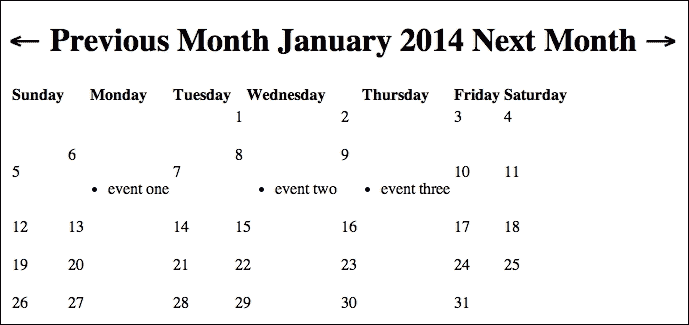
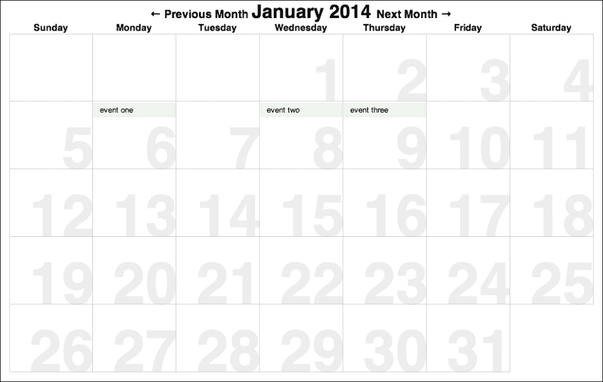
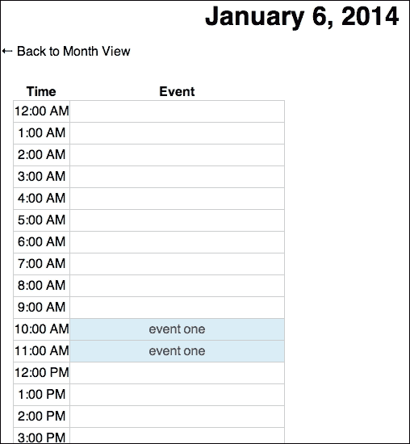
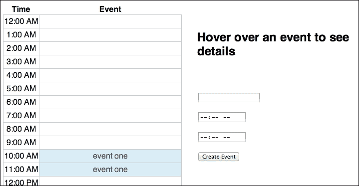
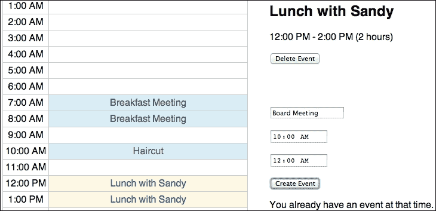

# 第四章：构建日历

我们将在本章中构建一个日历。你可能会认为这是我们上一章构建的，但这个将有所不同；它将类似于一个非常简化的 Google Calendar。我们将能够一次查看一个月或一天，并计划跨越一定小时数的事件。

在本章中，我们将讨论以下想法：

+   更好的应用程序组件组织，整个应用程序只有一个全局变量

+   将模型功能放在模型方法中

+   使用可丢弃的模型来封装我们不需要在服务器上存储的重要信息

+   在多个视图中显示单个模型实例

你可以从项目模板开始，就像我们之前做的那样。然而，我们将使用与上一章相同的预编译模板，并且我们还将把我们的代码分成`models.js`、`views.js`和`router.js`。你也可以选择复制上一个项目并清除自定义代码，这样你将会有我们上次创建的`Gruntfile.js`文件。

# 规划我们的应用程序

再次，我们将从规划我们的应用程序开始。我们的主要模型将是`Event`模型。它与我们在上一章中创建的模型同名，但略有不同。这个模型将包含标题、日期、开始时间和结束时间。我们将允许一天内有多个事件，但事件不能重叠（因为我们不能同时参加两个事件）。然后，我们还将创建一个`Calendar`集合类来存储我们的事件。

我们的应用程序将有两个屏幕。第一个将是一个月视图，以标准、表格、墙式日历风格。然后，点击该视图中的某一天将切换到日视图，这将显示该天的每小时事件分解。这也将是我们创建新事件的屏幕。

# 创建模型和集合

让我们从`Event`模型类开始，它将放在`public`文件夹的`models.js`文件中。将我们的代码分成多个文件是组织的好第一步，但我们还可以更进一步。之前，我们的每个类都通过它自己的全局变量进行引用。你可能知道这不是一个特别明智的技术。如果我们使用其他库、框架或插件，我们不希望两个组件使用相同的变量名并搞乱工作。在这个应用程序中，我们将把所有的类安全地放在一个单独的全局对象中。因此，我们以以下代码开始`models.js`文件：

```js
window.App = window.App || {};
App.Models = {};
```

第一行可能看起来有点棘手；为什么不直接使用 `var App = {};` 呢？嗯，我在这里使用的技巧允许我们不必担心文件在浏览器中加载的顺序。这一行首先检查 `window.App` 是否存在。如果存在，它将其分配给自己（基本上，它什么都不做）。如果不存在，我们可以确信这是我们的第一个加载的文件，因此我们将其创建为一个空对象。只要我们以这种方式开始所有自定义 JavaScript 文件，这个技巧就会起作用。

下一个行创建了一个 `Models` 属性。我们的模型和集合类将是这个对象上的属性。

现在，我们准备创建我们的 `Event` 模型类，如下所示：

```js
App.Models.Event = Backbone.Model.extend({});
```

我们将从一个基本模型开始，但我们会回来添加很多功能。如我之前提到的，将模型功能放在模型方法中是本章讨论的最重要行动点之一。

我们还有一个集合类，其代码如下：

```js
App.Models.Calendar = Backbone.Collection.extend({
  model: App.Models.Event,
  url: "/events",
});
```

这里没有什么新或独特的地方。请注意，我们确实需要通过其全名作为属性来引用我们的模型类，因为它不再是全局变量了。

实际上，我们还需要创建一个额外的模型；然而，这个模型不是我们要在服务器上存储实例或允许我们的用户了解的模型；它只是一个我们将内部使用的类，以使我们的视图代码更简单。记住，我们正在制作一个日历；这意味着我们需要关于我们显示的每个月的大量信息：月份的名称、天数以及该月开始的星期几，仅举几例。因此，我们将创建一个 `Month` 模型类，并使用它来跟踪所有这些数据。以下是为 `Month` 模型类编写的代码：

```js
App.Models.Month = Backbone.Model.extend({
  defaults: {
    year : moment().year(),
    month: moment().month()
  },
  initialize: function (options) {
    var m = this.moment();
    this.set('name', m.format('MMMM'));
    this.set('days', m.daysInMonth());
    this.set('weeks', Math.ceil((this.get('days') + m.day()) / 7));
  },
  moment: function () {
    return moment([this.get('year'), this.get('month')]);
  }
});
```

### 注意

我想明确指出，我们在这里不需要使用 `Backbone` 模型类。一个简单的 JavaScript 构造函数，在原型上添加一些方法，就足够了。然而，由于我们正在使用 Backbone，我们将创建一个模型类，这样我们就可以看到如何使用具有某种可丢弃数据包装器的模型。

我们包括了 `defaults` 属性，并不是因为我们期望需要 `defaults`，而是一种简单的方式来记录我们期望传递给 `Month` 构造函数的 `options` 对象应具有哪些属性。当我们创建 `Month` 实例时，我们需要给它一个年份和月份，两者都是数字。正如您可能预料的那样，我们在这个应用程序中大量使用 Moment 库，因为我们将进行大量的日期计算。记住，Moment 库使用零索引值作为月份数字，所以，一月是 0，十二月是 11。

在`initialize`方法中，我们首先调用`moment`方法，您可以在类的底部看到这个方法。这个方法简单地返回一个新的`moment`对象。`moment`构造函数可以接受一个包含时间值（年、月、日、小时等）的数组。我们只需要`年`和`月`，所以我们只传递这两个值。其余的值将默认为最早的可能值，因此这个`moment`对象将代表我们月份的第一天午夜。这很完美。

因此，回到`initialize`方法中，我们调用`moment`方法。然后，我们设置一些其他属性，这些属性是我们`Month`对象所需要的：月份的字符串名称、月份中的天数和月份中的周数。最后一个属性在我们渲染月份表格时将非常重要；我们需要知道需要多少表格行。我们可以通过将月份中的天数加上`moment`对象中的日期值来找到月份的周数。这将是一个表示月份第一天是星期几的数值。方便的是，这也是我们需要在月份开始时填充的前一个月的天数。然后，我们将这个数字除以 7，并向上取整。

在这些类设置好之后，我们就可以开始启动路由器了，所以请从`public`目录打开`router.js`文件。就像在`models.js`文件中一样，我们将从以下行开始：

```js
window.App = window.App || {};
```

然后，我们将编写路由器类，它最初将渲染用户的页面：

```js
App.Router = Backbone.Router.extend({
  initialize: function (options) {
    this.main = options.main;
    this.calendar = options.calendar;
    App.Router.navigate = this.navigate.bind(this);
  },
  routes: {
    '': 'month',
    ':year/:month': 'month'
  },
  month: function (year, month) {
    var c = this.clean(year, month);

    this.main.html(new App.Views.Month({
      collection: this.calendar,
      model: new App.Models.Month({ year: c[0], month: c[1] })
    }).render().el);
  }
});
```

就像我们之前的应用程序一样，我们的路由器构造函数期望接收一个主元素，我们的视图将在其中渲染，以及一个我们称之为`calendar`的集合对象。我们在`initialize`方法中将这些设置为局部变量。我们还创建了一个路由器`navigate`方法的绑定副本，以便我们的视图可以更改路由。这次，我们通过将其作为`Router`类的类属性来实现这一点。

接下来，我们有我们的路由。这次的情况有些不同，因为两个路由都会调用同一个方法：`month`。第二个路由是有道理的；任何符合`/year/month`模式的路由都会显示那个月份。然而，我们希望根路由显示当前月份；这就是为什么它调用相同的方法。

然后，`month`方法接受年和月参数，并将它们传递给一个`clean`函数以确保它们是可用的。这将返回一个包含年和月值的数组，我们可以使用它。那么，没有这些参数的根路由怎么办？`clean`方法将处理这个问题。之后，我们可以在主元素中放入一个新的`App.Views.Month`视图。这个视图将接受两个属性：`calendar`集合和一个`Month`模型。我们创建一个`Month`实例，传递给它从清理数组中获取的年和月。

`clean`方法相当简单：

```js
clean: function (year, month, day) {
  var now = moment();
  year  = parseInt(year, 10)             || now.year();
  month = (parseInt(month, 10) - 1) % 12 || now.month();
  day   = parseInt(day, 10)              || now.day();
  return [year, month, day];
}
```

这个函数接受三个参数：`year`、`month` 和 `day`。它们将是字符串，因为它们就是这样从路由中来的。每个都会被解析为整数，但可能其中一个不会解析为数字。如果是这样，我们将从 `moment` 对象中获取当前的年、月或日。然后，我们将返回一个包含所需数字的数组。这些内置默认值意味着根路由将获取当前的年月。它还有一个有趣的副作用；路由 `/what/4` 将显示当前年份的四月。

因此，有了路由器，我们可以转到 `views` 文件夹中的 `index.ejs` 文件。你首先想要确保所有脚本都已就绪。别忘了获取 Moment 库，就像我们在上一章中做的那样，并添加 `models.js`、`views.js` 和 `router.js`。最后，让我们实例化路由器，如下面的代码所示：

```js
<script>
  var r = new App.Router({
    main: $("#main"),
    calendar: new App.Models.Calendar([])
  });

  Backbone.history.start({ pushState: true });
</script>
```

注意当我们创建我们的日历时，我们放入了一个空数组。通常，这是我们从服务器获取模型的地方，但这次我们将有所不同。让我们在这里硬编码一些示例数据。这样，我们就可以现在专注于前端代码。我们很快就会得到后端的东西。所以，在这个数组中，添加一些模型，如下面的代码行所示：

```js
{ "title": "event one", "date": "2014-01-06", "startTime": "10:00", "endTime": "12:00", "id": 1 },
{ "title": "event two", "date": "2014-01-08", "startTime": "00:00", "endTime": "24:00", "id": 2 },
{ "title": "event three", "date": "2014-01-09", "startTime": "18:00", "endTime": "21:00", "id": 3 }
```

当你阅读这段内容时，你可能想要更改日期为当前日期。这是因为日历默认会显示当前月份，这样你就可以看到这些事件了。

在 `index.ejs` 文件中还有一件事要做；如果我们不做一些样式设计，我们真的无法得到一个好看的日历，所以我们将这样做——在文件的头部添加以下行：

```js
<link rel="stylesheet" href="/style.css" />
```

我们稍后会添加这个样式表文件。现在，我们准备好创建我们的视图了。

# 创建月份视图

月份视图将以表格的形式显示月份，就像墙上的日历一样。事件将在相应日期的单元格中显示。这需要几个嵌套视图，所以让我们从 `Month` 视图开始。这是我们的开始方式：

```js
App.Views.Month = Backbone.View.extend({
  template: JST.month,
  render: function () {
    this.el.innerHTML = this.template(this.model.toJSON());
    var weeks = this.model.get('weeks');

    for (var i = 0; i < weeks; i++) {
      this.$("tbody").append(new App.Views.WeekRow({
        week  : i,
        model : this.model,
        collection: this.collection
      }).render().el);
    }
    return this;
  }
});
```

我们将为这个类提供一个 `JST.month` 模板和一个 `render` 方法。在我们讨论 `render` 方法之前，让我们先看看模板文件。

### 注意

注意我们并没有像以前那样将视图命名为 `MonthView` 和 `WeekRowView`。相反，它们只是 `Month` 和 `WeekRow`。我们这样做是因为我们无论如何都要用 `App.Views.Month` 或 `App.Views.MonthTable` 来引用它们，所以没有必要两次都说 `View`。

正如你所看到的，以下代码将放在 `template` 文件夹中的 `month.html` 文件里：

```js
<h1>
  <span class="prev"> &larr; Previous Month </span> 
  {{name}} {{year}}
  <span class="next"> Next Month &rarr; </span>
</h1>
<table class='month'>
  <thead>
    <tr>
      <th>Sunday</th>
      <th>Monday</th>
      <th>Tuesday</th>
      <th>Wednesday</th>
      <th>Thursday</th>
      <th>Friday</th>
      <th>Saturday</th>
    </tr>
  </thead>
  <tbody>
  </tbody>
</table>
```

在顶部有一个标题，它将显示我们正在显示的月份的名称和年份。还将有按钮可以切换到下一个月和上一个月。下面，将有一个 `<table>` 元素，用于显示月份。别忘了运行 `grunt` 来编译模板。

现在，回顾一下 `render` 方法。我们首先渲染模板，传递给它来自 `Month` 模型的数据。然后，我们获取 `month` 模型的 `weeks` 属性；这告诉我们表格需要多少行（每周一行）。最后，我们循环这么多次，每次循环都将一个新的 `WeekRow` 视图添加到 `<tbody>` 元素中。一个 `WeekRow` 实例需要三个属性：周数（第一周为 0，第二周为 1，依此类推）、`month` 模型和 `calendar` 集合。

对于这种视图的最后一步是让我们的下个月和上个月按钮正常工作。将以下事件属性添加到 `Month` 视图中：

```js
events: {
  'click .prev': 'prev',
  'click .next': 'next'
},
```

这些事件监听器需要 `prev` 和 `next` 方法才能工作，所以让我们也把这个类中的这些方法添加上：

```js
prev: function () {
  var route = this.model.moment()
    .subtract(1, 'month').format('YYYY/MM');
  App.Router.navigate(route, { trigger: true });
},
next: function () {
  var route = this.model.moment()
    .add(1, 'month').format('YYYY/MM');
  App.Router.navigate(route, { trigger: true });
}
```

当点击 `<span>` 元素时，我们将分别调用 `next` 或 `prev` 方法。这两个方法通过向 `month` 模型的 `moment` 实例添加或减去一个月来获取下一个月或上一个月。然后，我们按需格式化它并触发路由更改。

## 构建周行

我们即将创建的 `WeekRow` 视图比我们之前所做的一切都要复杂。在我们查看代码之前，花一分钟时间思考一下表格中的周行。这里有三种情况。一个月的第一周可能需要在第一天之前有一些空白单元格，中间的周会有七天，而最后一周将只有剩余的天数。这将在 `render` 方法中需要一点额外的代码。以下是这个类的代码：

```js
App.Views.WeekRow = Backbone.View.extend({
  tagName: 'tr',
  initialize: function (options) {
    if (options) {
      this.week = options.week;
    }
  },
  render: function () {
    var month = this.model;

    if (this.week === 0) {
      var firstDay = month.moment().day();
      for (var i = 0; i < firstDay; i++) {
        this.$el.append("<td>");
      }
    }

    month.weekDates(this.week).forEach(function (date) {
      date = month.moment().date(date);
      this.$el.append(new App.Views.DayCell({
        model: date,
        collection: this.collection.onDate(date)
      }).render().el);
    }, this);

    return this;
  }
});
```

每个 `WeekRow` 视图的元素是 `<tr>`。在 `initialize` 方法中，我们获取 `week` 选项；正如你所知，`model` 和 `collection` 属性会自动获取。在 `render` 方法中，我们首先创建一个 `month` 变量，仅作为一个快捷方式来引用这个模型。接下来，我们寻找我们的第一个特殊情况：第一周。如果我们正在创建第一周的行，我们首先需要找到这个月是星期几开始。我们可以用 `month.moment().day()` 来做这个。`day` 方法返回一周中天数的零基于索引。这正是我们需要的，因为如果这个月从星期日开始，我们会得到一个 0，这就是我们需要空白单元格的数量，依此类推。

因此，`firstDay` 变量是我们需要的空白单元格的数量。然后我们循环，添加我们需要的那么多空 `<td>` 元素。

下一步是为 `WeekRow` 视图添加正确数量的 `DayCell` 视图。这听起来很简单；但实际上有点棘手，有两个原因。首先，因为第一周可能不会有七天，我们得弄清楚它应该有多少天。第二个原因是我们需要做一些数学计算来得到那个单元格的日期数字。为了使视图代码更简单，我们将在 `App.Models.Month` 类中创建一个方法。`weekDates` 方法将接受一个周数并返回一个包含该周日期的数组。在 `Month` 类的 `models.js` 文件中，添加以下方法：

```js
weekDates: function (num) {
  var days  = 7,
      dates = [],
      start = this.moment().day();

  if (num === 0) {
    days -= start;
    start = 0;
  }

  var date = num*7 + 1 - start, 
      end  = date + days;

  for (; date < end; date++) {
    if (date > this.get('days')) continue;
    dates.push(date);
  }
  return dates;
},
```

我们首先创建几个变量；一周中的天数，一个返回的日期数组，以及这个月开始的那一周是星期几。然后，如果我们正在处理第一周，我们从`start`中减去`day`，因为第一周没有七天。然后，我们将`start`设置为`0`，以供以后使用。

接下来，我们进行一些数学运算以获取`date`，这是本周的第一个日期。我们将周数乘以 7，然后加 1，这样它就不是零索引了。最后，我们减去`start`以纠正不是从星期日开始的那一周。最后，我们创建一个`end`变量，我们将使用它来停止循环。

然后，我们从`date`循环到`end`，并将递增的`date`推入`dates`数组。重要的是我们将`date`与这个月应有的天数进行比较，如果`date`大于这个值，则不要将其推入数组。

最后，我们返回`dates`数组。

现在，如果你回顾一下`WeekRow`视图的`render`方法，事情应该会更有意义。我们获取那一周的日期数组，并使用原生的`forEach`方法遍历它。对于每个`date`变量，我们创建一个实际的`moment`对象。我们获取月份的`moment`对象，并通过调用`date`方法来修改它，该方法在对象上设置日期（月份中的天数）。然后，我们将那个`date`变量和日历集合的一部分传递给一个新的`DayCell`视图，我们渲染并附加到元素上。

注意，我说的是“日历集合的一部分”；我们正在调用`onDate`方法，该方法返回一个只包含我们传递给方法的日期的事件的新`Calendar`集合实例。这个`onDate`方法位于`Calendar`集合的`models.js`文件中。然而，在我们到达那里之前，我们需要创建另一个方法；这是`Event`类的一个方法：

```js
start: function () {
  return moment(this.get('date') + " " + this.get('startTime'));
},
```

`Event`类的`start`方法返回事件开始时间的新`moment`实例。正如你所见，我们通过连接事件的日期和开始时间，然后将结果字符串传递给`moment`函数来获取这个。

我们将在`onDate`方法中使用这种方法，如下所示：

```js
onDate: function (date) {
  return new App.Models.Calendar(this.filter(function (model) {
    return model.start().isSame(date, 'day');
  }));
}
```

这将调用集合的`filter`方法，并且它只返回与`onDate`方法传入的日期相同的模型。然后，`filter`返回的数组被传递给一个新的`Calendar`实例。

### 注意

注意，我们不需要事件开始时间来完成这个目的，只需要事件发生的日期就足够了。然而，我们将在其他地方使用`start`方法。

## 构建日单元格

事情正在顺利进行！我们现在准备好使用在`WeekRow`视图中使用的`DayCell`视图类。让我们从`templates`文件夹中的`dayCell.html`文件中的模板开始。以下是这个模板的代码：

```js
<span class="date">{{num}}</span>
<ul>
  <% titles.forEach(function (title) { %>
    <li>{{ title }}</li>
  <% }); %>
</ul>
```

在这个模板中，我们做了一些新的尝试。我们加入了一些逻辑。之前，我们只使用双大括号来界定值以进行插值。然而，我们可以使用`<%`和`%>`界定符来运行我们想要的任何 JavaScript 文件。当然，对于大量代码来说这样做并不聪明，但我们只是用它来遍历一个数组。由于每个单元格代表日历上的一天，每个单元格可能有多个事件。我们将传递一个包含那些事件标题的数组给这个模板。然后，在模板内部，我们将遍历这些标题并为每个标题添加一个列表项。

那么视图类呢？它如下所示：

```js
App.Views.DayCell = Backbone.View.extend({
  tagName: 'td',
  template: JST.dayCell,
  events: {
    'click': 'switchToDayView'
  },
  render: function () {
    this.el.innerHTML = this.template({ 
      num: this.model.date(),
      titles: this.collection.pluck('title') 
    });
    return this;
  },
  switchToDayView: function () {
    App.Router.navigate(this.model.format('YYYY/MM/DD'), {
      trigger: true 
    });
  }
});
```

每个实例都将是一个`<td>`元素。在渲染时，我们将传递日期数字，这是我们通过传递给模型作为模型的`moment`实例获得的。我们还将使用集合的`pluck`方法从集合中的每个实例获取一个属性；在这里，我们从每个`Event`实例中提取`title`属性。

此外，请注意`events`对象。我们在根元素上监听点击事件。当发生这种情况时，我们将使用`App.Router.navigate`来进入单个日视图。我们通过格式化`moment`实例来获取路由。

信不信由你，我们现在已经准备好在浏览器中看到一些东西了。编译你的模板，启动你的服务器，并在浏览器中加载`http://localhost:3000/`。你应该会看到以下截图类似的内容：



这是可以的，但并不那么漂亮。然而，我们可以修复这个问题。记得我们在`index.ejs`文件中放入的`style.css`文件的链接吗？现在在`public`目录中创建这个文件。

我们将从以下代码开始：

```js
body {
  font-family: sans-serif;
  margin: 0;
}
```

这将为整个页面设置字体和边距。然后，我们继续到视图特定的样式：

```js
.prev, .next {
  font-size: 60%;
}
h1 {
  text-align: center;
  margin: 0;
}
```

这是`Month`视图的头部。它将缩小下一个和上一个按钮，并将标题居中在屏幕上。

为了给我们的表格添加边框，我们将添加以下代码：

```js
table { 
  border-collapse: collapse;
}

td {
  border: 1px solid #ccc;
}
```

这些是为任何表格的；所以这种样式将在单个日页面上使用，在那里我们将有另一个表格。但是，我们需要为月份表格做几件特别的事情，如下所示：

```js
table.month {
  table-layout: fixed;
  width: 1000px;
  height: 600px;
  margin: auto;
}
```

你会记得我们给月份的`<table>`元素添加了`month`类。我们在这里利用了这一点。如果你不熟悉`table-layout`属性，它基本上确保了所有列的宽度相同。

接下来，我们想要样式化单个单元格。这是如何做到的：

```js
table.month td {
  position: relative;
  vertical-align: top;
}
table.month td .date {
  font-weight: bold;
  position: absolute;
  font-size: 100px;
  bottom: -23px;
  right: -4px;
  color: #ececec;
  z-index: -1;
}
```

我们必须将`<td>`元素相对定位，以便我们可以将具有`date`类的`<span>`元素绝对定位在其内部，以达到效果。这是一个老技巧，它将允许我们将`<span>`元素绝对定位在其父元素（一个`<td>`元素）中，而不是整个页面上。其余的只是为了外观。

用户将点击这些 `<td>` 元素来进入单个日历页面，所以当用户悬停在单元格上时，我们是否给用户一点反馈？

```js
table.month td:hover {
  cursor: pointer;
}
table.month td:hover .date {
  color: #ccc;
}
```

最后一件事情是每个单元格将有的无序列表的事件标题。以下是它们的样式：

```js
td ul {
  list-style-type: none;
  padding: 0;
  margin: 0;
  font-size: 80%;
  height: 100%;
  overflow: scroll;
}

td li {
  padding: 3px 10px;
  margin: 2px 0;
  background: rgba(223, 240, 216, 0.5);
  border: 1px solid rgb(223, 240, 216);
}
```

注意到 `<ul>` 元素有 `overflow: scroll`。这样，如果某一天有很多事件，它根本不会创建额外的表格行；它只会使行滚动。

在所有这些样式设置完成后，您可以刷新页面，查看以下截图所示的内容：



不是更好吗？

# 创建单个日历屏幕

目前，当我们点击表格中的单元格时，我们的路由会改变，但屏幕上没有任何变化。这不是因为我们没有通过我们的路由交换触发更改；我们确实触发了。我们只是还没有在我们的路由器中创建那个方法。所以，那就是我们的下一个目的地。

在 `router.js` 文件中，向 `Router` 类的 `routes` 属性添加以下行：

```js
':year/:month/:day': 'day'
```

然后，我们需要在那里调用的 `day` 方法：

```js
day: function (year, month, day) {
  var date = moment(this.clean(year, month, day)); 
  this.main.html(new App.Views.Day({
    date: date,
    collection: this.calendar
  }).render().el);
},
```

此方法渲染 `App.Views.Day` 视图，这是单个页面的顶级视图。它需要一个表示显示日期的 Moment 对象和事件集合。我们通过将清理属性传递给 `moment` 方法来获取日期的 `moment` 对象。

### 注意

您可能期望我们通过我们的 `onDate` 方法将此集合限制为仅包含用户查看的特定日期的事件。然而，我们传递了整个集合，因为我们想要向这个 `Calendar` 实例添加新的事件实例。这是因为我们的月份视图使用 `this.calendar` 集合，我们想要确保在日历视图中添加的任何事件都会立即显示在月份视图中，无需刷新页面。

`App.Views.Day` 视图是一个包装视图。它包含三个主要视图：

+   `DayTable`：这提供了按小时分解的日历

+   `Details`：这提供了对用户当前悬停的任何事件的更详细查看

+   `CreateEvent`：这提供了一个用于创建新事件的表单

我们将使用 CSS 在垂直方向上分割屏幕。在左侧，我们将有 `DayTable` 视图；在右侧，我们将有 `Details` 视图和 `CreateEvent` 视图。`Day` 视图类的任务是放置这三个视图。

我们将从模板开始，通过在 `templates` 文件夹中的 `day.html` 文件中添加以下代码：

```js
<h1> {{ date }} </h1>
<p class='back'>&larr; Back to Month View </p>
<div class="splitView">
</div>
```

我们将在页面顶部显示日期，并提供一个链接返回到月份视图。然后，我们有一个具有 `splitView` 类的 `<div>` 元素。

我们中断代码，为您提供以下针对该 `splitView` 类的 CSS 代码。将此代码放入 `style.css` 文件中：

```js
.splitView > * {
  width: 45%;
  margin: 2%;
  float: left;
}
```

现在，让我们开始 `Day` 视图类的编写：

```js
App.Views.Day = Backbone.View.extend({
  template: JST.day,
  initialize: function (options) {
    this.date = options.date;
  },
  events: {
    'click .back' : 'backToMonth'
  },
  render: function () {
    this.el.innerHTML = this.template({ 
      date: this.date.format("MMMM D, YYYY") 
    });
    this.$('.splitView').append(new App.Views.DayTable({
      date: this.date,
      collection: this.collection
    }).render().el);
    return this;
  },
  backToMonth: function () {
    App.Router.navigate(this.date.format('/YYYY/MM'), { 
      trigger: true 
    });
  }
});
```

还有更多内容，但我们将从这里开始。我们设置模板。在 `initialize` 方法中，我们获取 `date` 属性。然后，我们绑定一个事件。当点击后退按钮时，我们将调用 `backToMonth` 方法，这将改变路由回到月份屏幕，就像我们切换到日屏幕一样。

然后，在 `render` 方法内部，我们将解决方案的一部分组合起来。我们获取 `<div class='splitView'>` 元素，并附加一个新的 `DayTable` 视图实例。这个视图接受本页的日期和事件集合。

这个 `DayTable` 视图可能是我们在本书到目前为止创建的最独特的视图。正如你所期待的那样，它将是一个 HTML 表格，其中每一行代表一天中的一个小时。左列将是时间，右列将显示在该小时发生的事件的标题（如果有的话）。棘手的部分是，大多数事件可能跨越多个小时，因此我们需要确定事件的开始和结束位置。

首先，这个视图的模板是什么样子？将以下代码存储在 `templates` 文件夹中的 `dayTable.html` 文件中：

```js
<thead>
  <tr>
    <th> Time </th>
    <th> Event </th>
  </tr>
</thead>
<tbody>
</tbody>
```

就像我们的其他基于表格的视图一样，模板是表格的核心。你可以看到两个列：时间和事件。

我们将分部分介绍这个视图类。`DayTable` 视图的代码如下：

```js
App.Views.DayTable = Backbone.View.extend({
  tagName: 'table',
  className: 'day',
  template: JST.dayTable,
  events: {
    'mouseover tr.highlight td.event': 'hover',
    'mouseout  tr.highlight td.event': 'hover'
  },
  initialize: function (options) {
    this.date = options.date;
    this.listenTo(this.collection, 'add', this.addEvent)
    this.listenTo(this.collection, 'destroy', this.destroyEvent)
    this.hours = {};
  }
});
```

这个视图的元素将是一个具有 `day` 类的表格。我们在该视图中监听两个事件；任何包含事件的表格行都将具有 `highlight` 类，而第二列中的每个表格单元格都将具有 `event` 类。当用户将鼠标移至包含事件标题的单元格上或移出时，我们将调用 `hover` 方法来突出显示该事件。

在 `initialize` 方法中，我们将获取 `date` 选项，然后监听我们的集合中模型被添加或销毁的情况。了解何时发生这些操作非常重要，这样我们就可以将它们添加或从表格中删除。我们将编写 `addEvent` 和 `destroyEvent` 方法来完成这项工作。

最后，我们创建了一个 `hours` 对象，我们将使用它来跟踪 `Hour` 视图，每个视图将是我们表格中的一行。我们在上一章中使用了这种技术，因此我们可以轻松地对表格中的行进行排序。这次，我们这样做是因为当我们想要在一天中添加或删除事件时，我们实际上并不想添加或删除 `Hour` 视图；我们只想添加或删除该视图中的事件标题。你很快就会看到这是如何工作的。

在这些部分就绪后，我们可以继续到 `render` 方法：

```js
render: function () {
  this.el.innerHTML = this.template();

  for (var i = 0; i < 24; i++) {
    var time = moment(i, "H").format('h:mm A');
    this.hours[time] = new App.Views.Hour({ time: time });
    this.$('tbody').append(this.hours[time].render().el);
  }
  this.collection.onDate(this.date).forEach(this.addEvent, this);
  return this;
},
```

这应该很容易理解。我们首先渲染模板。然后，我们循环 24 次；每次，我们创建一个 `App.Views.Hour` 视图实例，将其存储在 `this.hours` 属性中供以后使用，并将其附加到 `<tbody>` 元素。我们可以通过创建一个带有递增变量的 `moment` 对象来获取时间文本；由于 `i` 不是一个可理解的日期格式，我们需要传递 `"H"` 作为第二个参数，这样它就知道这只是一个小时。然后，我们将其格式化为一个漂亮的时间字符串。我们使用这个时间字符串作为属性名，在将视图实例存储在 `this.hours` 中时使用。此时（如果我们有一个 `Hour` 视图类），我们将有一个完整的表格，每天的小时都有一个行。然而，所有行都是空的；我们还没有渲染任何事件。这就是为什么我们接下来过滤 `collection` 以获取这一天的活动，并对它们进行循环，为每个活动调用 `addEvent` 方法。

正如我之前提到的，难点在于一个 `Event` 模型实例可能需要跨越几个 `Hour` 视图实例。为了编写 `addEvent` 方法，我们首先将一个 `hours` 方法添加到 `Event` 模型类中。

将以下代码添加到 `models.js` 文件中的 `App.Models.Event` 类：

```js
hours: function () {
  var hours = [],
      start = this.start(),
      end   = this.end();

  while (start.isBefore(end)) {
    hours.push(start.format('h:mm A'));
    start.add(1, 'hour');
  }
  return hours;
}
```

我们首先创建一个目前为空的 `hours` 数组，我们最终将返回它。然后，我们获取模型的 `start` 和 `end` 时间。我们已经创建了 `start` 方法，但我们需要创建 `end` 方法。它比 `start` 方法稍微复杂一些。将以下代码添加到我们正在工作的同一个类中：

```js
end: function () {
  var endTime = moment(this.get('date') + " " +this.get('endTime'));
  if (this.get('endTime') === '00:00') {
    endTime.add(1, 'day');
  }
  return endTime;
},
```

在 `start` 方法中，我们通过连接 `date` 和 `endTime` 创建 `moment` 对象。然而，有一个特殊情况；如果事件在午夜结束，技术上是在第二天结束。但是，我们的 `moment` 对象将指向事件日期的午夜，这是当天的小时。所以，如果结束时间是午夜，我们将向 `moment` 对象添加一天。然后，我们返回。

让我们回到 `hours` 方法。在获取 `start` 和 `end` 时间后，我们可以循环，当 `start` 时间在 `end` 时间之前时。我们将一个时间字符串推入 `hours` 数组；注意我们是以我们在表格中做的方式格式化它的。然后，我们将一个小时添加到 `start` 对象。最终，`start` 将与 `end` 相同，循环将停止。然后，我们将返回那个 `hours` 数组。

使用此方法，如果我们有一个从下午 1:00 到下午 4:00 举行的活动，我们将得到以下数组：

```js
['1:00 PM', '2:00 PM', '3:00 PM']

```

你可能认为我们还想在那里包含下午 4:00，但我们不需要。这是因为每个 `Hour` 视图实例代表一个完整的小时；所以，带有标签 `1:00 PM` 的小时指的是从下午 1:00 到下午 2:00 的小时。

使用这种方法后，我们可以回到 `App.Views.DayTable` 并编写 `addEvent` 方法。记住，我们为需要在表中显示的每个事件调用此方法。以下是为 `addEvent` 方法编写的代码：

```js
addEvent: function (evt) {
  evt.hours().forEach(function (hour) {
    this.hours[hour].displayEvent(evt);
  }, this);
},
destroyEvent: function (evt) {
  evt.hours().forEach(function (hour) {
    this.hours[hour].removeEvent();
  }, this);
},
```

`addEvent` 和 `destroyEvent` 方法非常相似，所以我们一起来看它们。在两种情况下，我们都会获取给定事件的时数组，然后使用原生数组的 `forEach` 方法遍历它。对于每个小时，我们从 `this.hours` 获取视图。在 `addEvent` 方法中，我们调用视图的 `displayEvent` 方法，并将事件传递给该方法。在 `destroyEvent` 方法中，我们只是调用视图的 `removeEvent` 方法；没有必要传递事件。

在我们到达 `Hour` 视图类之前，让我们写下这个类的最后一个方法：`hover`。这个方法在我们将鼠标移到或移出我们表格中的事件标题上时被调用。以下是 `hover` 方法的代码：

```js
hover: function (e) {
  var id = parseInt(e.currentTarget.getAttribute('data-id'), 10),evt = this.collection.get(id);

  evt.hours().forEach(function (hour) {
    this.hours[hour].hover();
  }, this);

  this.collection.trigger("hover", evt);
}
```

由于此方法是由 DOM 事件触发的，我们将获得一个 DOM 事件对象作为我们的参数（实际上，由于我们使用 jQuery，它将是一个 jQuery 包装的 DOM 事件对象）。在这个方法中的首要任务是确定我们悬停的行是哪个 `Event` 模型实例的一部分。我们可以通过获取 `Event` 实例的 ID 来做到这一点。该 DOM 事件对象的 `currentTarget` 属性将是触发事件的元素；稍后，当我们渲染它时，我们将给它我们在这里得到的 `data-id` 属性。由于我们在 `<td class='event'>` 元素上监听鼠标事件，所以 `currentTarget` 属性将是这个。

一旦我们知道 ID 是什么，我们就可以调用集合的 `get` 方法来找到具有该 ID 的模型。一旦我们得到该事件模型，我们可以使用 `hours` 获取该事件的时数。然后我们遍历这些时数，找到显示此事件的 `Hour` 视图实例，并调用它们的 `hover` 方法。最后，我们将在我们的集合上触发一个 `hover` 事件，并将事件模型作为参数传递。这是件新鲜事；到目前为止，我们只在我们的模型和集合上监听内置事件（如 `add` 和 `destroy`）。然而，我们也可以使用 `trigger` 方法来创建我们自己的事件。我们可以命名我们的事件为任何我们想要的；我们称这个事件为 `hover`。在其他地方，我们将监听此事件，并在事件发生时执行操作。

你可能会认为我们应该在 `Hour` 视图中监听这些鼠标事件，因为那将是受影响的视图。然而，在这种情况下，这不会起作用，因为我们需要在单个视图被悬停时更改多个 `Hour` 视图。

我们终于准备好创建 `Hour` 视图了。它的模板非常简单。将以下行放入 `templates` 文件夹中的 `hour.html` 文件：

```js
<td class='time'> {{ time }}</td>
<td class='event'></td>
```

模板只期望时间；我们将从 JavaScript 文件中填写（如果需要）事件名称。

现在，在我们的 `views.js` 文件中，添加以下代码：

```js
App.Views.Hour = Backbone.View.extend({
  tagName: 'tr',
  template: JST.hour,
  initialize: function (options) {
    this.time = options.time;
  },
  render: function () {
    this.el.innerHTML = this.template({ time: this.time });
    return this;
  },
  displayEvent: function (model) {
    this.$el.addClass("highlight");
    this.$('.event').attr('data-id', model.get('id'));
    this.$(".event").text(model.get('title'));
  },
  removeEvent: function () {
    this.$el.removeClass('highlight');
    this.$('.event').removeAttr('data-id');
    this.$('.event').text('');
  },
  hover: function () {
    this.$el.toggleClass('hover');
  }
});
```

如我们所知，这个视图将是一个`<tr>`元素。在`initialize`方法中，我们获取`time`属性。在这个情况下，`render`方法非常简单，因为大部分动作都在`displayEvent`和`removeEvent`方法中发生。正如我们所见，`App.Views.DayTable`视图类中的`addEvent`方法将调用这个`displayEvent`方法，并传递那个小时发生的`event`模型。在`displayEvent`方法中，我们将`highlight`类添加到那个小时，添加`data-id`属性，并将标题文本放入具有`event`类的`<td>`元素中。在删除事件时，我们做相反的操作；移除`highlight`类和`data-id`属性，并将文本设置为空。

最后，是`hover`方法。这个方法只是切换`<tr>`元素上的`hover`类。现在，在我们检查浏览器中的效果之前，让我们添加一些样式，将其添加到`style.css`文件中：

```js
table.day tr.highlight td.event {
  background: rgb(217, 237, 247);
  color: rgb(53, 103, 132);
}
table.day tr.highlight.hover td.event {
  background: rgb(252, 248, 227);
  color: rgb(53, 103, 132);
}
table.day td {
  padding: 4px 0;
  width: 100px;
  text-align: center;
}
table.day td.event {
  width: 500px;
}
```

这并没有什么特别的；它只是为表格添加了一些颜色和间距。有了所有这些，我们现在可以加载我们的日视图。你应该能看到以下截图所示的内容：



看起来还不错，不是吗？如果你悬停在任一彩色单元格上，你应该看到它们都切换到黄色背景。

那是我们分割视图的左侧部分。现在，是时候创建右侧部分了。你应该记得，右侧将包含`details`视图和创建表单。让我们从`details`视图开始。

再次，我们从模板开始：`templates`文件夹中的`details.html`。其代码如下：

```js
<h2>{{ title }}</h2>
<% if (start) { %>
<p> {{ start }} - {{ end }} ({{ duration }}) <p>
<p><button> Delete Event </button>
<% } %>
```

我们在模板中再次使用了一点点逻辑。如果`start`值不是一个空字符串，我们将渲染两个段落。我们将显示事件的`start`和`end`时间，以及持续时间。最后，我们将有一个**删除事件**按钮，这将允许我们删除事件。

我们使用这段逻辑的原因是因为当页面首次加载时，用户不会悬停在任何事件上。在这种情况下，我们将显示默认说明。

在`views.js`文件中，我们将创建以下视图类：

```js
App.Views.Details = Backbone.View.extend({
  template: JST.details,
  events: {
    'click button': 'delete'
  },
  initialize: function () {
    this.data = {
      title: "Hover over an event to see details",
      start: '',
      end: '',
      duration: ''
    };
    this.render();
  },
  render: function () {
    this.el.innerHTML = this.template(this.data);
    return this;
  },
  changeModel: function (model) {
    this.model = model;
    var s = this.model.start(),
        e = this.model.end();
    this.data = {
      title: model.get('title'),
      start: s.format('h:mm A'),
      end: e.format('h:mm A'),
      duration: e.diff(s, 'hour') + ' hours'
    }
    return this.render();
  },
  delete: function () {
    this.model.destroy();
  }
});
```

我们这次在`initialize`方法中会做一些不同的事情。首先，我们将为视图创建一些默认填充数据，称为`this.data`，在用户第一次悬停在小时之前显示。然后，我们立即在`initialize`方法中调用`render`方法。这不是你经常看到的一种模式，但真的没有不这样做的原因。在`render`方法中，我们处理这些数据并渲染模板。这个类中的重要方法是`changeModel`方法。它接受一个模型作为属性，并从该模型重新创建`data`属性。我们将`start`和`end`时间放入变量中，这样我们就不必调用这些方法两次。然后，我们通过再次调用`render`方法来重新渲染视图。

你可能会想知道为什么我们在`changeModel`方法中分配`this.model`。这是因为我们将在`delete`方法中使用它。我们需要获取当前显示的模型的引用，以便在点击删除按钮时将其销毁（你可以在`events`属性中看到我们正在连接到`delete`方法）。当然，为了使模型的销毁工作，我们需要编写一个服务器方法；我们很快就会做到这一点。

但首先，我们想要渲染这个视图。为此，回到`App.Views.Day`视图类中的`render`方法。到目前为止，这个方法只创建了一个`DayTable`视图（屏幕的左侧）。向该方法添加以下代码：

```js
var div = this.$('div').append('<div>')

this.details = new App.Views.Details();
div.append(this.details.el);
```

首先，我们在分割视图的右侧创建一个`<div>`元素。然后，我们创建一个`Details`视图实例并将其附加到那个`div`元素上。注意，由于我们在内部调用了`render`方法，所以我们在这里不需要调用它。此外，我们保留了对`Details`视图实例的引用，将其作为`this.details`。这是因为我们需要在`showDetails`方法中使用它，我们将在`Day`视图类中添加一个新的方法。`showDetails`方法的代码如下：

```js
showDetails: function (model) {
  this.details.changeModel(model);
}
```

这只是调用了`Details`视图上的`changeModel`方法。但这个方法是在哪里被调用的呢？记得我们手动触发的那次`hover`事件，当用户将鼠标移到行上时？回到`Day`视图类的`initialize`方法，因为我们将用这一行代码来监听那个事件：

```js
this.listenTo(this.collection, 'hover', this.showDetails);
```

太好了！所有这些都准备好了，你可以通过悬停在事件上测试它；`details`视图应该看起来像下面截图所示：


我们只剩下一个视图：`CreateEvent`视图。我们将从`createEvent.html`模板开始。以下是它的代码：

```js
<p><input type="text" id="eventTitle" /></p>
<p><input type="time" id="eventStartTime" /></p>
<p><input type="time" id="eventEndTime" /></p>
<p><button> Create Event </button></p>
<p class="error"></p>
```

如你所见，这是一个表单的内部结构；视图元素将是`<form>`元素本身。

这里是类开始的代码：

```js
App.Views.CreateEvent = Backbone.View.extend({
  tagName: 'form',
  template: JST.createEvent,
  initialize: function (options) {
    this.date = options.date;
  },
  events: {
    'click button': 'createEvent'
  },
  render: function () {
    this.el.innerHTML = this.template();
    return this;
  }
});
```

到现在为止，你已经理解了所有这些；即使是`render`函数也很简单。在`initialize`函数中，我们接受一个`date`选项，因为我们需要知道我们将在哪一天创建事件。有趣的部分开始于`createEvent`方法。你可以看到我们在表单中的按钮上监听点击事件，并在事件发生时调用`createEvent`方法。

这里是那个方法：

```js
createEvent: function (evt) {
  evt.preventDefault();

  var model = new App.Models.Event({
    collection: this.collection.onDate(this.date),
    title: this.$("#eventTitle").val(),
    date: this.date,
    startTime: this.$("#eventStartTime").val(),
    endTime: this.$("#eventEndTime").val()
  });

  if (model.isValid()) {
    this.collection.create(model, { wait: true });
    this.el.reset();
    this.$(".error").text('');
  } else {
    this.$(".error").text(model.validationError);
  }

  return false;
}
```

这是一个大项目，我知道。我们首先阻止默认的表单提交。然后，我们使用表单的数据和构造函数中的`date`来创建一个新的模型实例。创建这样的模型时，它不会立即保存到服务器。我们要么在模型上调用`save`方法，要么将其传递给集合的`create`方法。

你可能想知道为什么我们把`collection`对象做成这个模型实例的属性。这实际上是一种小窍门。解释的第一部分来自于方法的第二部分。你可以看到我们正在调用模型的`isValid`方法。Backbone 有在模型上执行验证的能力。如果我们的属性不符合给定的模式，我们可以阻止它们保存。我们在这里非常明确地这样做，通过调用这个方法。如果模型有效，我们将通过将其传递给集合的`create`方法将模型保存到服务器（我们传递`{wait: true}`是因为我们的`DayTable`视图正在监听集合的增加，以便将其添加到表格中；这样，它将在我们确定它已被保存之后才会被添加）。然后，我们清除表单元素，并从错误段落中删除任何错误。如果模型没有验证，这个错误就会发生。而不是保存，我们会在那个段落中显示模型的`validationError`属性。

目前，我们正在调用模型的`isValid`方法，但我们还没有创建任何验证规则。Backbone 的验证功能是基础版的。在我们的`Event`模型类中，我们将创建一个名为`validate`的方法。每次我们尝试保存模型时，这个方法都会被调用。作为参数，`validate`方法将接收一个包含模型属性的对象。在方法内部，我们编写我们想要的任何代码。如果一切检查无误，我们不返回任何内容。然而，如果有问题，我们可以返回一个错误消息（它可以是简单的字符串或更复杂的东西）。然后，错误消息将被分配给`model.validationError`。

所以，让我们编写验证方法：

```js
validate: function (attrs) {
  if (attrs.collection) {
    var takenHours = _.flatten(attrs.collection.invoke('hours'));

    var hours = this.hours().map(function (x) {
      return takenHours.indexOf(x);
    }).filter(function (x) {
      return x > -1;
    }).length;

    this.unset('collection');

    if (hours > 0) {
      return "You already have an event at that time.";
    }
  }
}
```

这是为什么我们把`collection`对象包含在我们的模型属性中的解释的第二部分。我们需要验证的是`start`和`end`时间。如果我们正在尝试创建的事件与日历中已经存在的事件冲突，我们不允许创建新的事件。然而，在模型的`validate`方法内部，我们无法访问集合。因此，我们通过使用`onDate`方法将其限制为这个日期的事件，将其作为我们正在验证的模型的一个属性传递。当然，这是一个小窍门；但它有效。

我们首先确保我们的属性中包含一个`collection`属性。如果我们已经有了，第一项任务是找出一天中已经被占用的时段。我们可以通过调用我们创建的`hours`方法来单独找到每个事件的时段。我们可以使用集合的`invoke`方法来调用其所有模型上的该方法；它将返回一个结果数组。由于每个结果都是一个数组，所以我们有一个数组的数组。然后，我们可以使用 Underscore 的`flatten`方法将其转换为一维数组。结果是包含所有已被占用的时段的数组。

接下来，我们进行一些函数式编程。我们首先调用`this.hours`来获取这个事件发生的时段数组。然后，我们将它映射到`takenHours.indexOf(x)`的值。这将遍历这个事件的小时，并获取它们在`takenHours`数组中的索引。这里的关键点是，如果一个小时不在`takenHours`中，它将返回`-1`。接下来，我们使用数组的`filter`进行过滤，只保留大于`-1`的值。最后，我们获取结果数组的`length`值。按照这个逻辑，`hours`变量将是`takenHours`和`this.hours`数组之间重叠的值的数量。

然后，我们将使用`unset`方法移除`collection`属性，因为我们不再需要它。

最后，如果重叠的小时数大于 0，我们将返回一个错误；你已经在那个时间有了事件。有了这个方法，你可以回顾`createEvent`方法，并确切地了解我们在做什么。

`CreateEvent`类的最后一步是将它显示在屏幕上。回到`App.Views.Day`类的`render`方法，并添加以下代码：

```js
div.append(new App.Views.CreateEvent({
  date: this.date.format('YYYY-MM-DD'),
  collection: this.collection
}).render().el);
```

我们将其放入我们为分割视图右侧创建的`div`元素中。按照要求，我们给它提供`date`字符串和`collection`对象，然后进行渲染。现在，我们的页面应该看起来像以下截图所示：



# 编写服务器代码

对于这个应用程序，服务器代码非常简单。首先，我们需要使用数据库中的事件模型渲染`index.ejs`模板。所以，确保我们的 GET 请求通配符看起来像以下代码：

```js
app.get('/*', function (req, res) {
  db.find(function (err, events) {
    res.render("index.ejs", { events: JSON.stringify(events) });
  });
});
```

现在，在`views`文件夹中的`index.ejs`文件中，在创建路由的代码中，移除我们放入的虚拟记录，并用模板数据替换它，如下所示：

```js
calendar: new App.Models.Calendar(<%- events %>)
```

回到`server.js`文件，当我们创建一个新的`Event`模型时，需要 POST 请求发送到的路由。其代码如下：

```js
app.post('/events', function (req, res) {
  var b = req.body;
  db.insert({
    title: b.title,
    date: b.date,
    startTime: b.startTime,
    endTime: b.endTime
  }, function (err, evt) {
    res.json(evt);
  -});
});
```

我们获取请求体，然后根据其属性创建我们的记录。一旦我们保存了记录，我们就会将其发送回服务器。

最后，我们需要在销毁模型时调用的路由。这是一个 DELETE 请求，其外观如下：

```js
app.delete('/events/:id', function (req, res) {
  var id = parseInt(req.params.id, 10);

  db.delete({ id: id }, function () {
    res.json({});
  });
});
```

我们获取记录的 ID，找到相关的行，并返回一个空响应。这就是服务器的全部内容。有了这段代码，你就可以尝试使用了。前往一个单独的日历页面并添加一些事件。你应该会得到以下截图所示的内容：



你可以在这里看到所有组件的运行情况；小时表、悬停效果和详情视图。你甚至可以看到当我们尝试创建一个与其他事件重叠的事件时出现的错误信息。

最后还有一步；实际上是一个小细节。如果你回到月份视图，你会注意到每一天单元格中的事件并不是按照时间顺序出现的。相反，它们是按照我们创建它们的顺序出现的。如果它们能按照发生顺序出现那就更好了，而这非常简单。在 `App.Models.Calendar` 类（在 `models.js` 文件中），我们可以写一个 `comparator` 方法来保持顺序：

```js
comparator: function (a, b) {
  return a.start().isAfter(b.start());
},
```

我们可以简单地返回 `moment` 对象的 `isAfter` 方法的结果，以确定哪个应该先出现；Backbone 会处理其余的部分。

# 摘要

在本章中，我们做了许多新颖有趣的事情。最困难的部分是获取悬停效果。这需要我们找到表示单个模型实例的所有视图。在 Backbone 应用程序中，大多数时候你只会有一个视图来表示一个模型实例。然而，正如你所看到的，虽然这是规范，但这绝对不是唯一可能的方式。

Backbone 的另一个巧妙用法是我们创建的 `Month` 类。我们实际上只是用它作为一个方便的包装器；我们没有理由不能写一个简单的函数来返回一个对象字面量。然而，我们这样做的方式展示了 Backbone 的灵活性。

本章最后一个，但可能是最重要的想法是将适当的逻辑移动到模型类中，而不是将其放在视图类中。这个想法的例子包括 `App.Models.Calendar` 类的 `onDate` 方法或 `App.Models.Event` 类的 `hours` 方法。这是模型-视图-控制器模式的一个大思想。当然，Backbone 并不是严格遵循 MVC，但许多原则仍然适用。尽可能让你的模型类更丰富，让你的视图和路由器更精简。这并不意味着将视图或路由逻辑放入模型中。这意味着任何不是专门关于视图或路由的逻辑可能都应该在一个模型类中。关于这个话题，网上有很多优秀的 MVC 资料可供参考；你可以从 [`dev.tutsplus.com/tutorials/mvc-for-noobs--net-10488`](http://dev.tutsplus.com/tutorials/mvc-for-noobs--net-10488) 开始。在下一章中，当我们创建一个实时双向聊天应用程序时，我们将把事情提升到一个全新的水平。
