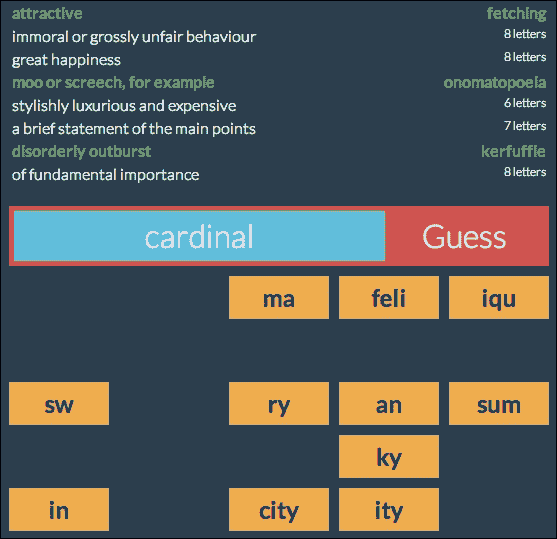
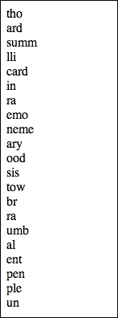
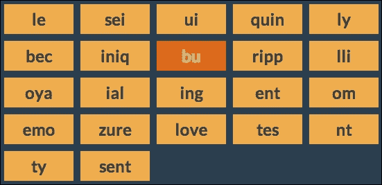
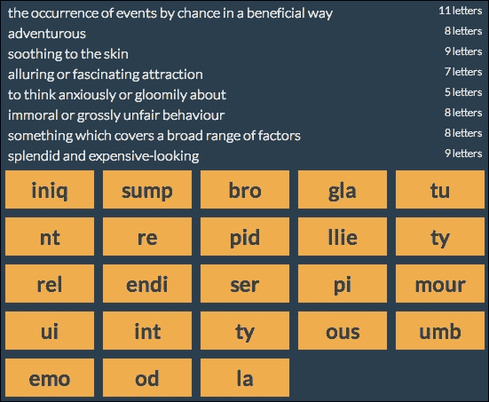
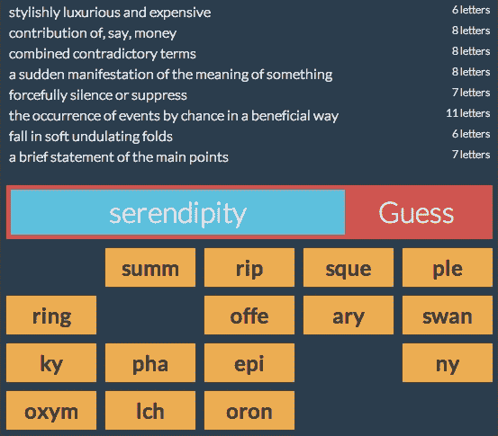
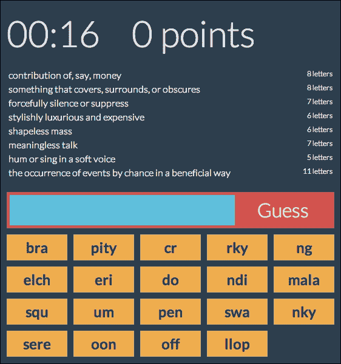
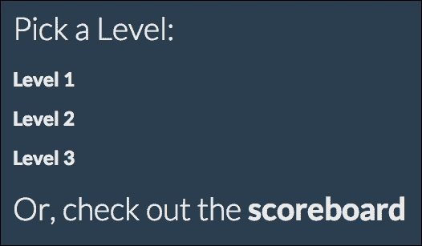
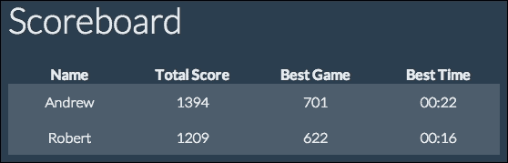
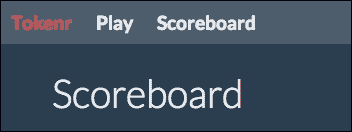

# 第七章. 构建游戏

我们已经来到了这本书的最后一章，如果我可以暂时以第一人称来谈谈，这是我最喜欢构建的应用程序。每个人都喜欢游戏，如果你喜欢文字游戏，你也会喜欢这个。我们迄今为止编写的应用程序大多数都是单视图应用程序；用户看到的唯一屏幕是执行应用程序主要动作的视图。然而，完整的 Web 应用程序通常还有其他不是应用程序主要目的的视图，但有助于完善应用程序。在这个应用程序中，我们有一个或两个这样的视图。

因此，以下是本章我们将涵盖的一些主题：

+   复习所有 Backbone 组件的主要用途

+   添加非 Backbone 页面以完善应用程序

+   构建一个使用用户未提供的数据的应用程序

+   编写（简单）的游戏逻辑

# 我们正在构建什么？

再次，我们将从描述我们计划构建的内容开始。这将是一款文字游戏，模仿我非常喜欢的一款非常简单的 iPhone 游戏，名为 *7 Little Words* ([`www.7littlewords.com/`](http://www.7littlewords.com/))。每一局游戏（或者可以说是回合，如果你愿意这样称呼的话）包含七个单词，这些单词被分成两个、三个或四个字母的部分。你的任务是根据你给出的简短定义重新组装这些单词。为了使问题更清晰，我并没有与这款 iPhone 游戏有任何关联，我只是喜欢玩它！

然而，我们将比那个游戏做得更深入，通过为单词分配不同的分数值，并且还计时我们的用户。这样，玩家可以比较分数和时间，使比赛更具竞争性。

下面是完成后的应用程序游戏视图的截图。在底部，你可以看到用户将选择组合成单词的标记。中间有一个文本框，显示用户已经组装的单词。然后，他们点击 **猜测** 按钮来查看单词是否与上面的定义之一匹配：



# 用户账户

我们将像上一章一样开始；通过向我们的基本应用程序添加用户账户。我们不会再次详细讲解整个过程；你可以从上一章的应用程序中复制它。我们只需要做一个小改动。在 `app.post('/create')` 路由中，我们创建一个 `userAttrs` 对象并将其存储在数据库中。这个应用程序的用户将有三项特定于应用程序的值需要存储：

+   `score`：这是他们的最高分

+   `time`：这是他们的最低时间

+   `games`：这是一个包含他们所玩游戏的数组

下面是创建 `userAttrs` 对象的代码：

```js
var userAttrs = {
  username: req.body.username,
  passwordHash: signin.hashPassword(req.body.password),
  score: 0,
  time: 3600,
  games: []
};
```

在此基础上，加上我们之前创建的所有其他用户账户创建代码，我们就有了一个应用程序的框架，可以开始定制。

# 模板

在之前的应用中，我们的服务器端模板相当基础。我们只有单个`index.ejs`文件，也许还有一个`login.ejs`文件。然而，在一个大型应用中，你可能会拥有多个不同的服务器端模板。当这种情况发生时，你希望尽可能减少代码重复。你如何进行取决于你使用的服务器端模板系统。由于我们使用的是`ejs`([`github.com/visionmedia/ejs`](https://github.com/visionmedia/ejs))，我们将通过**包含**来实现这一点。所以，在我们的项目`views`目录中创建一个名为`header.ejs`的文件。以下是文件中的内容：

```js
<!DOCTYPE html>
<html>
<head>
  <title> Tokenr </title>
  <link rel="stylesheet"  href="/style.css" />
</head>
<body>
```

基本且符合预期，对吧？现在，我们还在`views`目录中添加了一个`footer.ejs`文件，它将关闭这些标签：

```js
</body>
</html>
```

或者，你也可以只是记住在创建每个使用`header.ejs`包含文件的模板时，将这些两行添加到模板的底部（或者，如果你对 HTML5 的宽松性很熟悉，也可以完全省略它们），但我喜欢同时拥有`header.ejs`和`footer.ejs`文件带来的对称性。例如，我们位于`views`目录中的`login.ejs`文件，它包含了登录和注册表单：

```js
<% include header %>
<div id="main">
  <form method="post" action="/login">
    <h1> Sign In </h1>
    <p><input type='text' name='username' /></p>
    <p><input type='password' name='password' /></p>
    <p><button>Log In</button></p>
  </form>
  <form method="post" action="/create">
    <h1> Sign Up </h1>
    <p><input type='text' name='username' /></p>
    <p><input type='password' name='password' /></p>
    <p><button>Create Account</button></p>
  </form>
</div>
<% include footer %>
```

你明白我说的对称性吗？我们可以在`views`目录中的`index.ejs`文件中使用相同的技巧，它将开始如下：

```js
<% include header %>
<div id="main"></div>
<script src="img/jquery.js"></script>
<script src="img/underscore.js"></script>
<script src="img/backbone.js"></script>
<script src="img/models.js"></script>
<script src="img/views.js"></script>
<script src="img/router.js"></script>
<% include footer %>
```

如你所见，我们将再次将模型、视图和路由器拆分到单独的文件中。这在当前应用中尤为重要，因为模型将使用一些复杂的代码。所以现在我们在`views`目录中有一个`index.ejs`文件，我们可以渲染索引路由。在`server.js`文件中，这段代码应该是你的最终路由：

```js
app.get('/*', function (req, res) {
  if (!req.user) {
    res.redirect("/login");
    return;
  }
  res.render("index.ejs");
});
```

注意，我们没有向索引模板传递任何值；这个应用不需要这样的东西。这听起来可能有些奇怪。既然它是一个更高级的应用，难道你不期望它一开始就需要更多的数据吗？如果你的应用需要从服务器传输大量数据到浏览器，那么一次传输所有数据可能不是最佳选择；这可能会严重影响你的加载时间。更好的技术是在需要时加载数据，这正是我们将要做的。此外，可能在你确切知道需要哪些数据之前，你需要让用户做出决定；这也是延迟加载数据的另一个原因，在我们的案例中也是如此。

# 创建游戏数据

说到加载数据，下一步是创建我们游戏的数据——用户将要拼写的单词。实际上，这是本书中唯一一个从数据开始的应用，而不是仅仅处理用户提供给应用的数据。实际的原始数据将存储在我们项目的根目录下的`words.json`文件中。这个游戏成为好游戏的关键之一是有大量的单词可供选择。以下是文件开始的部分：

```js
[{"id":1,"level":3,"word":"anguine","definition":"snakelike"},
{"id":2, "level":1,"word":"cardinal","definition":"of fundamental importance"},
{"id":3, "level":3,"word":"detersion","definition":"act of cleansing"},
{"id":4, "level":3,"word":"exiguous","definition":"meager"},
{"id":5, "level":2,"word":"fraternise","definition":"associate with"},
```

当然，每个单词都有一个 ID。然后，重要的属性是单词和定义。定义是用户将看到的，而单词是他们需要拼凑的。级别是一个介于 1 到 3 之间的数字，其中级别 1 的单词是最简单的，级别 3 的单词是最难的。你可以编写自己的列表，或者从 GitHub 下载这个列表（[`gist.github.com/andrew8088/9627996`](https://gist.github.com/andrew8088/9627996)）。

### 注意

在开发这个应用程序的过程中，一个想法是使用字典 API（如[dictionaryapi.com](http://dictionaryapi.com)）从更大的数据库中随机选择单词。然而，这实际上并不实用，因为我们需要一个简短的、类似于填字游戏的定义，而标准的字典定义根本不够。此外，大多数 API 都没有选择随机单词的方法。

一旦我们有了单词列表，我们需要创建实际的数据库。将以下内容添加到`server.js`文件的顶部：

```js
var _ = require('./public/underscore');
var words = new Bourne('words.json');
```

我们在这里也需要 Underscore 库；你很快就会看到我们为什么需要它。我们需要与客户端相同的文件。这不会适用于每个文件；碰巧在撰写这本书的时候（1.6.0 版本），Underscore 的最新版本被编写为可以在客户端和服务器上运行。

用户每玩一次游戏都会有八个单词；这意味着我们需要从数据库中随机抽取八个单词，但所有单词的难度级别相同。为此，我们将在服务器文件中添加一个`getWords`函数：

```js
function getWords(level, cb) {
  words.find({ level: level }, function (err, records) {
    cb(null, _.shuffle(records).slice(0, 8));
  });
}
```

这个函数将接受一个级别数字和一个回调函数。然后，我们将获取数据库中该级别的所有单词。接下来，我们将使用 Underscore 的`shuffle`方法对记录数组进行洗牌。洗牌后，我们将从数组中取出前八个项目并传递给回调。

### 注意

应该指出，这可能不是从大多数数据库中获取八个随机单词的最佳方式。由于我为小型数据集编写了 Bourne 数据库系统，并且它将所有记录都保存在内存中，所以我们在这里所做的应该很快。然而，根据你使用的数据库系统，可能还有更好的方法。

现在我们有了获取单词的方法，我们需要为它创建一个路由：

```js
app.get('/game/:level', function (req, res) {
  var level = parseInt(req.params.level, 10);
  getWords(level, function (err, words) {
    res.json(words);
  });
});
```

游戏的级别是 URL 的一部分。我们将它转换为数字，然后调用我们的`getWords`函数。一旦我们有了单词，我们就可以将它们作为 JSON 发送回浏览器。

# 编写模型

由于这个应用程序的性质，我们将比通常有更多的模型。两个明显的模型是`Word`模型及其集合`Game`。这些几乎不需要解释。然而，请记住，我们将单词分成部分，我们将称之为标记。为此，我们将有一个`Token`模型和`Tokens`集合。这些实际上是简单的部分：

```js
var Token = Backbone.Model.extend({});
var Tokens = Backbone.Collection.extend({
  model: Token
});
```

由于这些只是被切碎的单词的壳，它们不需要太多。所有的主要逻辑都将包含在`Word`和`Game`类中。让我们从`Word`类开始：

```js
var Word = Backbone.Model.extend({
  initialize: function () {
    this.set('points', this.get('word').length + this.get('level'));
  },
  parts: function () {
    return Word.split(this.get('word'));
  }
});
```

每个`Word`实例都需要分配一个点值。这并不复杂；只需加上单词的长度和难度级别。稍后，将这个值乘以基于时间的另一个值。另一种方法调用`Word.split`函数，传递给它的单词。这就是代码变得稍微复杂的地方。

然而，在我们开始分割单词之前，请注意`split`方法是一个静态或类级别方法。这在我们之前看到的 Backbone 中并不常见；但 Backbone 使得添加静态方法变得非常简单。到目前为止，我们只向`Backbone.Model.extend`方法传递了一个参数；一个包含实例级别属性和方法的对象。然而，这个方法可以接受第二个对象，包含类属性和方法：

```js
Backbone.Model.extend({
  // instance properties
},
{
  // class properties
});
```

这不仅适用于模型；它还适用于集合、视图，甚至路由器。所以，给前面的`Word`模型添加一个类属性对象；我们将在下一节中使用它。

## 分割单词

将单词随机分割成标记并不是像你想的那么简单。我们希望随机进行，这样每次玩游戏时，单词的分割方式可能都不同。我们希望将每个单词分割成两个、三个或四个字母的标记。你可能认为，那么我们可以随机选择这些数字中的一个。然而，我们并不真的想要所有三种尺寸的数量相等；我们希望有两个字母标记更少。这需要加权随机选择，因此我们首先必须编写一个函数来实现这一点。表示我们的加权选项的方式是通过如下数组：

```js
[[2, 0.2], [3, 0.4], [4,0.4]]
```

这个数组中的每个数组都有两个元素。第一个是我们想要使用的值；这可以是一个字符串、一个对象或任何东西。第二个值是这个值被选中的概率。正如你可以从这个数组中看到的那样，值 2 将有 20%的概率被选中，值 3 和 4 将各有 40%的概率被选中。所以，这是一个接受该数组作为参数的函数。记住要将这个函数放在`Word`模型的类属性对象中：

```js
weightedRandomGenerator: function(items) {
  var total = items.reduce(function (prev, cur) { 
    return prev + cur[1]; 
  }, 0),sum = 0,list = [];
  for (var i = 0; i < items.length; i++) {
    sum = (sum*100 + items[i][1]*100) / 100;
    list.push(sum);
  }
  return function () {
    var random = Math.random() * total;
    for (var i = 0; i < list.length; i++) {
      if (random <= list[i]) {
        return items[i][0];
      }
    }
  }
}
```

第一步是计算数组中的百分比值。在我们的例子中，这些值加起来是 1，但它们不必是；如果它们加起来是某个其他值，这仍然有效。我们通过在数组上调用原生的`reduce`方法来实现这一点，将所有第二个元素相加。下一步是创建一个新数组，随着加权值的累加，我们将创建一个数组，例如：

```js
[0.2, 0.6, 1]
```

因此，我们创建了一个`sum`变量和一个名为`list`的数组。然后，我们遍历项目，将值添加到`sum`变量中，然后将该`sum`变量推入`list`数组中。我们现在有了所需的数组。最后，我们将返回一个函数。该函数将首先获取一个介于 0 和总数之间的随机数。然后，我们将遍历列表，检查每个项目是否小于或等于随机数。一旦我们找到匹配项，我们将使用相同的索引号从原始项目参数中返回值。这就是我们的加权随机生成器的全部内容。现在，我们准备在分割单词成标记的函数中使用它。这是`split`函数：

```js
function split(word) {
  word = word.split('');
  var tokens = [];

  var rand234 = Word.weightedRandomGenerator([[2, 0.2], [3, 0.4], [4,0.4]]),
    rand23  = Word.weightedRandomGenerator([[2, 0.5], [3, 0.5]]),
    rand24  = Word.weightedRandomGenerator([[2, 0.5], [4, 0.5]]);

  var w, length;
  while (word.length > 0) {
    w = word.length;
    if      (w  >  5) length = rand234();
    else if (w === 5) length = rand23();
    else if (w === 4) length = rand24();
    else              length = w;

    tokens.push(word.splice(0, length).join(''));
  }
  return tokens;
}
```

这个函数接受一个单词并将其分割成标记。首先，我们将字符串分割成一个数组，然后创建一个数组来保存标记。接下来，我们创建三个随机生成器，我们将在不同的点需要它们。然后，我们有一个`while`循环，用于当单词长度大于零时。如果单词长度大于五个字符，我们将使用返回 2、3 或 4 的生成器。如果单词是五个字符长，我们将使用返回 2 或 3 的生成器。如果它是四个字符长，我们将使用返回 2 或 4 的生成器。最后的`else`语句将用于单词长度小于四个字符的情况；我们将使用单词的长度。

所有这些确保单词将被分割成两个、三个或四个字符的标记；这也确保我们永远不会得到一个字母的标记，通过移除除了一个字母之外的所有字母。`while`循环的最后一步是使用单词数组的`splice`方法。这个方法将改变原始数组，将这些字母从数组中取出并返回（这就是单词长度在`while`循环条件中变化的原因）。一旦我们将单词分割成标记，我们返回标记数组。这是在`Word`类的`parts`方法中使用的函数。

这个集合的类是`Game`。这将从非常简单开始：

```js
var Game = Backbone.Collection.extend({
  model: Word,
  initialize: function (models, options) {
    this.guessedCorrectly = [];
    this.seconds = -1;
    this.score = 0;
    this.level = 1;
  },
  getWords: function () {
    return Backbone
      .ajax("/game/" + this.level)
      .then(this.reset.bind(this));
  },
  tokens: function () {
    var tokens = _.flatten(this.invoke('parts'));
    return new Tokens(tokens.map(function (token) {
      return { text: token };
    }));
  }
});
```

这实际上只是一个开始。这些集合实例中之一将处理更多内容，但我们终将到达那里。我们首先为这个集合设置模型类，然后创建`initialize`方法。集合对象将负责跟踪时间和分数，因此我们给它一个`seconds`和`score`属性。由于我们的游戏将有等级，所以我们还有一个`level`属性。然后，我们有`getWords`方法。

正如我们所知，我们并不是在页面初始加载时发送一组单词，因此这是完成这一任务的方法。它会对我们创建的用于发送单词的路由发起一个 AJAX 请求。`Backbone.ajax`方法实际上是对`jQuery.ajax`方法的封装。它返回一个承诺，我们在第六章中学习了承诺的概念，即*构建播客应用程序*，在这里。我们调用它的`then`方法，传递给它集合的`reset`方法。这个方法会用作为参数传递的模型数组替换集合中的任何模型。`then`方法将返回承诺对象，因此我们返回它。这样，我们就可以在单词加载后执行操作。

最后，请注意`tokens`方法；在这里，我们调用集合的`invoke`方法。这个方法接受另一个方法的名称，并在集合中的每个模型上调用它。这将返回一个值数组；在这种情况下，值将是一个标记数组，即分割后的单词。一个数组数组没有用，所以我们将使用 Underscore 的`flatten`方法将嵌套数组展平成一个标记的单个数组。然后，我们返回一个映射到对象数组的`Tokens`集合实例。

# 编写标记视图

现在我们已经将模型大致准备好，我们准备开始编写实际的视图。让我们从一个简单的东西开始：标记。我们从`TokensView`类开始：

```js
var TokensView = Backbone.View.extend({
  render: function () {
    this.collection.tokens()
      .shuffle().forEach(this.addToken, this);
    return this;
  },
  addToken: function (token) {
    this.el.appendChild(new TokenView({ 
      model: token 
    }).render().el);
  }
});
```

编写这个类非常简单。我们从游戏中获取标记集合，调用内置的`shuffle`方法来打乱标记，然后使用`addToken`方法将它们每个都渲染出来。这个方法渲染一个`TokenView`实例并将其附加到元素上。所以下一个步骤就是——`TokenView`类：

```js
var TokenView = Backbone.View.extend({
  className: 'token',
  events: {
    'click': 'choose'
  },
  render: function () {
    this.model.view = this;
    this.el.innerHTML = this.model.get('text');
    return this;
  },
  choose: function () {
    Backbone.trigger('token', this.model);
    this.hide();
  },
  hide: function () {
    this.$el.addClass('hidden');
  },
  show: function () {
    this.$el.removeClass('hidden');
  }
});
```

每个`TokenView`实例都将有一个类：`token`。`render`方法相当基础——它只是将标记的文本放入元素中。然而，请注意方法的第 1 行；我们正在给模型添加一个指向这个视图的视图属性。这是我们之前没有做过的事情；我们从未给模型添加指向渲染它的视图的链接。这并不总是被认为是一件好事；通常更好的做法是保持模型和视图之间的清晰分离。然而，有时这可以是一件好事，正如我们将在本例中看到的那样。无论如何，这样做非常简单。当这个元素被点击时，将调用`choose`方法。这个方法使用模型作为参数触发`token`事件。我们之前已经触发过事件，但这是第一次我们使用`Backbone.trigger`方法。我们可以使用这个方法在所有代码中全局触发和监听事件。在触发事件后，我们将隐藏视图。我们这里也有`hide`和`show`视图。这些在元素上添加或删除一个类来分别隐藏或显示标记。

通常，这会是启动路由器的点，这样我们就可以渲染我们的视图并对其进行样式化。然而，这次我们将走不同的路线。在构建更复杂的应用程序时，你可能会对正在处理的工作——在我们的例子中是视图——充满热情，并且你不想改变思维模式。在这种情况下，我会在`index.ejs`文件中放置一个`script`标签来测试我们刚刚创建的视图：

```js
<script>
  var game = new Game();
  game.getWords().then(function () {
    $('#main').append(new TokensView({ 
      collection: game 
    }).render().el);
  }.bind(this));
</script>
```

它快速而简单；我们创建一个`Game`对象，获取一组单词，然后将一个新的`TokensView`实例添加到页面上。你应该会看到类似这样的结果：



如果你点击单个标记并打开你的开发者工具，你会看到它们获得了`hidden`类，就像我们编码的那样。当然，现在还没有其他事情发生，这是因为我们没有为`'token'`事件添加监听器。这是一个好的开始，并且足够开始样式化。所以，打开`public`目录下的`style.css`文件。让我们从这里开始：

```js
@import url("//fonts.googleapis.com/css?family=Lato:300,400,700");
body {
  margin: 0;
  padding: 0;
  font-family: lato, helvetica-neue, sans-serif;
  background: #2B3E50;
  font-weight:300;
  color: #ebebeb;
}
#main {
  width: 540px;
  padding: 0 5%;
  margin: auto;
}
```

我们从引入一个 Google 字体开始。在[`www.google.com/fonts`](https://www.google.com/fonts)上有几个可供选择；我们选择了 Lato。在`<body>`元素上，我们将设置字体、字体颜色和背景。然后，我们将在主`<div>`元素上设置宽度，这是我们应用程序大部分内容所在的位置。接下来，我们将对我们的锚点元素添加一些样式：

```js
a {
  text-decoration: none;
  font-weight: 700;
  color: #ebebeb;
}
#main a:hover {
  text-decoration: underline;
}
```

所有链接都会有一些样式——没有下划线，一些加粗，以及新的颜色——但只有主元素中的锚点会得到悬停样式。这是因为我们很快将创建一个导航栏（在主元素外部），我们不希望当悬停时链接被下划线。现在，我们已经准备好为标记添加样式，我们使用以下代码来完成：

```js
.token {
  font-size: 150%;
  font-weight: 700;
  margin: 5px;
  padding:7px 0;
  display: inline-block;
  background:#F0AD4E;
  color: #474747;
  width: 100px;
  text-align:center;
}
.token:nth-child(5n+1) {
  margin-left: 0;
}
.token:nth-child(5n) {
  margin-right:0;
}
.token:hover {
  background: #DF691A;
  cursor: pointer;
  color: #ececec;
}
.hidden {
  visibility: hidden; 
}
```

我们将标记样式化为基本的橙色块。我们将它们均匀地间隔开；我们使用*n*th-child 选择器来移除其他块的外边缘的边距。我们为块添加一个悬停效果。最后，我们添加了`hidden`类。现在，刷新页面应该会得到类似这样的结果：



看起来不错，不是吗？现在，我们准备好进行下一个视图，即显示线索的视图，也就是定义。

# 线索视图

单词的线索——即定义——需要出现在标记上方。`CluesView`类相当简单：

```js
var CluesView = Backbone.View.extend({
  tagName: 'table',
  render: function () {
    this.collection.forEach(function (word) {
      this.el.appendChild(new ClueView({ 
        model: word 
      }).render().el);
    }, this);
    return this;
  }
});
```

线索将显示在表格中。在`render`方法中，我们将遍历集合，为每个`Word`模型渲染一个`ClueView`类。`ClueView`类是所有动作发生的地方。以下是`ClueView`类的代码：

```js
var ClueView = Backbone.View.extend({
  tagName: 'tr',
  template: _.template($('#clue').html()),
  initialize: function () {
    Backbone.on('correct', this.correct, this);
  },
  render: function () {
    this.el.innerHTML = this.template(this.model.toJSON());
    return this;
  },
  correct: function (word) {
    if (this.model.get('word') === word.get('word')) {
      this.$el.addClass('correct');
      this.$('.word')
        .removeClass('clue')
        .text(word.get('word'));
    }
  }
});
```

这个视图将使用表格行元素，这是我们第一个使用模板的视图。为了渲染模板，我们只需将模型的 JSON 版本传递给 `template` 函数。在 `initialize` 方法中，我们监听 `correct` 事件的发生。这是当玩家正确猜出一个单词时将被触发的事件。这是另一个全局事件，我们将在另一个位置触发。当它发生时，我们将调用 `correct` 方法。这个方法将作为参数接收正确单词的 `Word` 模型。尽管只有一个单词被猜出，但所有的 `ClueView` 实例都将监听 `correct` 事件。所以，第一步将是比较单词并找到正确的 `ClueView` 实例。如果这个视图的模型匹配，我们将添加 `correct` 类。然后，我们将从模板的一部分移除 `clue` 类并添加单词。

说到模板，将以下内容添加到 `views` 目录中的 `index.ejs` 文件：

```js
<script type='text/template' id='clue'>
  <td>{{ definition }}</td>
  <td class='word clue'>{{ word.length }} letters</td>
</script>
```

如你所知，这将放在我们的表格行元素内部。第一个 `<td>` 元素将包含定义。第二个将首先显示单词中的字母数量，作为另一个小线索。正如我们所见，当他们正确猜出单词时，线索将被单词本身替换。在我们检查浏览器中的效果之前，让我们在 `public` 目录中的 `style.css` 文件中添加一些样式：

```js
table {
  width: 100%;
}
td:nth-of-type(1) {
  width:75%;
}
.clue {
  font-size:75%;
}
.word {
  float: right;
}
.correct {
  color: #5CB85C;
  font-weight: 700;
}
```

我们将整理 `table` 元素以及每行的第一个 `<td>` 单元格。当第二个 `<td>` 单元格包含字母数量时，`clue` 类将稍微减小字体大小。然后，当单词被正确猜出时，我们将移除该类，并将 `correct` 添加到整个 `<tr>` 元素上，使其着色并加粗。

现在，回到 `index.ejs` 文件，你可以以同样的快速且简单的方式渲染这个视图。将 `getWords` 回调函数内的内容替换为以下内容：

```js
$('#main')
  .append(new CluesView({ collection: game }).render().el)
  .append(new TokensView({ collection: game }).render().el);
```

然后，刷新页面。它应该看起来像这样：



我们还看不到正确单词的样式，因为我们还无法猜测单词。这带我们到了下一步：猜测视图。

# 创建猜测视图

这将是我们的应用中最长的视图，因为它要做的事情最多。让我们从这个模板开始：

```js
<script type='text/template' id='guess'>
  <div class='btn text'></div>
  <div id='guessBtn' class='btn'> Guess </div>
</script>
```

看起来很简单。第一个 `<div>` 元素是玩家点击标记时标记文本将出现的地方。第二个 `<div>` 元素将是一个按钮；当玩家点击它时，他们的猜测将被“提交”。如果猜测是其中的一个单词，它将出现在正确的定义旁边。否则，标记将重新出现，与其他标记一起。这是 `GuessView` 类的代码：

```js
var GuessView = Backbone.View.extend({
  className: 'guess',
  template: $('#guess').html(),
  events: {
    'click #guessBtn': 'guess'
  },
  initialize: function () {
    Backbone.on('token', this.add, this);
    this.currentTokens = [];
  },
  render: function () {
    this.el.innerHTML = this.template;
    this.guessText = this.$('.text');
    return this;
  },
  add: function (token) {
    this.currentTokens.push(token);
    this.guessText.append(token.get('text'));
  }
});
```

这是开始；我们将给这个元素添加一个名为 `guess` 的类，并获取我们刚刚创建的先前的模板。在 `initialize` 方法中，我们将监听 `token` 事件。记住，当点击其中一个标记时，这个事件将在全局范围内触发。在这里，我们捕获这个事件并运行我们的 `add` 方法。`initialize` 方法中发生的另一件事是创建一个 `currentTokens` 属性。这将跟踪用户在实际猜测之前选择的标记。在 `render` 方法中，我们将获取模板（在这种情况下，它只是一个字符串，因为在这个视图中没有模板数据），然后创建一个指向我们用作文本字段的 `<div>` 元素的属性。这个属性在 `add` 方法中使用；该方法将 `Token` 模型作为参数。我们将缓存标记在 `currentTokens` 数组中，并将文本追加到元素中。

在我们继续之前，让我们给它添加样式。你知道该去哪里——`public` 目录下的 `style.css` 文件：

```js
.guess {
  overflow: hidden;
  margin: 20px 0 5px;
  border: 5px solid #D4514D;
}
.btn {
  background: #D4514D;
  width: 30%;
  cursor: pointer;
  line-height: 50px;
  height: 50px;
  font-size:200%;
  text-align: center;
  float:left;
}
.btn:hover {
  background: #C04946;
}
.btn.text {
  background: #5BC0DE;
  width:70%;
}
```

两个内部的 `<div>` 元素都有 `btn` 类；我们将它们浮动到左边并应用高度、宽度和着色。然后，对于同时具有 `btn` 和 `text` 类的元素，我们将调整背景颜色和宽度。当实际的按钮 `<div>` 被悬停时，我们将稍微改变背景颜色，因为按钮应该这样做。

现在，让我们渲染这个视图。回到 `index.ejs` 文件，再次更改 `getWords` 回调：

```js
$('#main')
  .append(new CluesView({ collection: game }).render().el)
  .append(new GuessView({ collection: game }).render().el)
  .append(new TokensView({ collection: game }).render().el);
```

在浏览器中打开此页面并点击几个标记。你应该会看到类似这样的内容：



在玩弄这个之后，你应该会看到我们需要对这个视图进行两个更改。一个明显的大问题是我们的 **Guess** 按钮没有任何作用。更小、与设计相关的问题是，我们的 `GuessView` 类的 `<div>` 元素的红色边框在按钮被悬停时不会改变颜色。由于它们是相同的颜色，这将是一个很好的触感。然而，当子元素被悬停时，我们无法使用 CSS 来更改父元素的属性。别担心，JavaScript 就在这里来拯救这个情况。将这些两个事件添加到 `GuessView` 类的事件属性中：

```js
'mouseover #guessBtn': 'color',
'mouseout #guessBtn': 'color'
```

当按钮接收到 `mouseover` 或 `mouseout` 事件时，我们将调用 `color` 方法。这个方法非常简单；它所做的只是切换那个父元素的 `border` 类：

```js
color: function () {
  this.$el.toggleClass('border');
},
```

当然，这意味着我们不得不在我们的 CSS 文件中添加一个 `border` 类：

```js
.border {
  border-color: #C04946;
}
```

现在，让我们关注更重要的问题；允许玩家进行实际的猜测。我们已经有了准备好的 `GuessView` 类，用于点击 **Guess** 按钮。当这发生时，我们调用 `guess` 方法：

```js
guess: function (evt) {
  var results = this.collection.guess(this.guessText.text());
  if (results.word) {
    Backbone.trigger('correct', results.word);
  } else {
    this.currentTokens.forEach(function (token) {
      token.view.show();
    });
  }
  this.currentTokens = [];
  this.guessText.text('');
  if (results.complete) 
    Backbone.trigger('completed', this.collection);
}
```

第一步是检查这个单词是否在集合中。我们通过调用集合的`guess`方法来完成这个操作。我们还没有写这个，但它将返回一个具有两个属性的对象。第一个是`word`属性。如果猜测是集合中的单词，则此属性将是`Word`模型本身；否则，它将是`undefined`。如果有`Word`模型，我们将触发`correct`事件，传递`Word`模型。记住，`ClueView`实例正在监听此事件。如果`results.word`是`undefined`，这意味着标记没有拼出集合中的任何一个单词，需要替换。因此，我们将遍历标记并调用我们在渲染这些视图时给它们的`view`属性的`show`方法。在两种情况下，我们都会清空`currentTokens`属性并清除`guessText`属性的文本。最后一步是检查`results`对象上的`complete`属性。如果是`true`，则意味着玩家刚刚完成了最后一个单词并完成了游戏。如果游戏结束，我们将触发一个`completed`事件，并将游戏对象作为参数传递。

最后一步是编写`Game`集合的`guess`方法。回到`public`目录下的`models.js`文件，将此方法添加到`Game`类中：

```js
guess: function (word) {
  var results = {
    word: this.findWhere({ word: word }),
    complete: false
  };
  if (results.word) {
    results.word.set('correct', true);
    var score = results.word.get('points');
    var mult = 10 - parseInt(this.seconds / 15);
    if (mult <= 0) mult = 1;
    this.score += score * mult;
    results.complete = this.where({
      correct:true
    }).length === this.length;
  }
  return results;
}
```

我们首先创建一个带有`word`和`complete`属性的`results`对象。默认情况下，`complete`属性将是`false`；对于`word`属性，我们将搜索集合以找到与传递给此方法的文本匹配的单词模型。如果找不到单词，`findWhere`方法将返回`undefined`。然而，如果找到一个`Word`模型，我们将给该模型一个临时属性。我们将`correct`设置为`true`。由于玩家刚刚正确猜了一个单词，下一步是更新分数。我们创建一个`score`变量；它从`Word`模型上的基本`points`属性开始。然后，我们需要计算乘数。如我们之前看到的，`Game`实例将有一个`seconds`属性；很快，我们将看到它是如何增加的。

现在，我们将秒数除以 15，用`parseInt`进行四舍五入，然后从 10 中减去。然后，如果结果是小于或等于`0`的数字，我们将`mult`重置为`1`。这样，前 15 秒内任何正确的猜测都将获得 10 倍乘数，第二 15 秒内的任何猜测将获得 9 倍乘数，依此类推。2 分 30 秒后，乘数将是 1。然后，我们将`score`属性增加单词`score`乘以乘数。最后，我们将`correct`属性的数量与集合中的总单词数进行比较。如果这些相等，`results.complete`将是`true`，因为所有单词都已被正确猜测。最后，我们将返回`results`对象。

现在，有了这个，我们可以刷新页面并实际玩游戏。试试看！它应该看起来像这样：


非常令人印象深刻，不是吗？我们几乎可以玩我们的游戏了。然而，还有很多细节需要处理。当我们在这里玩游戏时，我们实际上还没有开始记分。所以这是下一步。

# 构建信息视图

下一个类是我们将要称为`InfoView`的类。这将包括时间计数器和当前分数。我们从模板开始。将以下内容添加到`views`目录中的`index.ejs`文件：我们正在创建两个`<span>`元素：一个用于时间，另一个用于分数。以下是模板的代码：

```js
<script type='text/template' id='info'>
  <span class='timer'> 00:00 </span>
  <span class='points'> 0 points </span>
</script>
```

现在，在我们编写视图类之前，我们需要向我们的`Game`集合类添加几个更多的方法。我们之前写的`guess`方法跟踪玩家的分数。我们还想让`Game`实例跟踪时间。计数器将位于游戏实例内部，但`InfoView`类实际上需要显示时间。这就是`start`方法：

```js
start: function (callback) {
  this.callback = callback;
  this.loop();
},
loop: function () {
  this.seconds++;
  this.callback(this.time());
  this.timeout = setTimeout(this.loop.bind(this), 1000);
},
```

`start`方法是`InfoView`类将使用的。它接受一个`callback`函数作为参数，并将其分配为实例的属性。然后，它调用`loop`方法。这个方法增加`seconds`计数，然后调用`callback`函数，传递`time`方法的结果（这是下一个）。然后，我们为这个方法设置一个超时，以便一秒后再次调用它；我们必须将`loop`绑定到`this`，这样每次调用时`this`的值都将保持不变。`time`方法只是返回`seconds`计数作为一个漂亮的时间戳：

```js
time: function () {
  var hrs = parseInt(this.seconds / 3600),
    min = parseInt((this.seconds % 3600) / 60),
    sec = (this.seconds % 3600) % 60;

  if (min < 10) min = "0" + min;
  if (sec < 10) sec = "0" + sec;
  var time = min + ":" + sec;

  if (hrs === 0) return time;

  if (hrs < 10) hrs = "0" + hrs;
  return hrs + ":" + time;
},
```

这非常基础。我们可以使用除法和取模运算符，以及`parseInt`函数，来创建一个时间字符串。所以，当`seconds`计数为 42 时，字符串将是"00:42"；73 将是"01:13"。如果时间超过一小时（这不太可能，但有可能），我们将小时计数添加到前面。这个字符串是传递给回调函数的值。

现在，让我们看看实际的类。我们将给元素分配`info`类，并获取模板。这是`InfoView`类的代码：

```js
var InfoView = Backbone.View.extend({
  className: 'info',
  template: $('#info').html(),
  initialize: function () {
    this.listenTo(Backbone, 'correct', this.updateScore);
    this.collection.listenTo(Backbone, 'completed', this.collection.stop);
  },
  render: function () {
    this.el.innerHTML = this.template;
    this.time = this.$('.timer');
    this.score = this.$('.score');
    this.collection.start(this.time.text.bind(this.time));
    return this;
  },
  updateScore: function () {
    this.score.text(this.collection.score + ' points');
  }
});
```

`render`方法首先使用模板字符串，然后为计时器元素和分数元素创建两个属性。然后，我们调用我们刚刚编写的`collection.start`方法。记住，这个方法接受一个将接收时间字符串的回调函数，所以，我们可以直接传递绑定到我们的`this.time`元素的 jQuery `text`方法。现在，这将为我们计时。

在我们查看`initialize`方法之前，让我们给这个添加一点样式。将以下内容添加到`public`目录中的`style.css`文件：

```js
.info {
  font-size:60px;
  margin: 20px 0;
}
.info span {
  margin-right:40px;
}
```

这不是什么大问题；我们只是增加了字体大小并添加了一些边距。现在，将一个`InfoView`实例添加到我们一直在使用的快速测试中：

```js
$('#main')
  .append(new InfoView({ collection: game }).render().el)
  .append(new CluesView({ collection: game }).render().el)
  .append(new GuessView({ collection: game }).render().el)
  .append(new TokensView({ collection: game }).render().el);
```

在浏览器中加载这个，你应该会看到类似这样的内容：



现在，在`initialize`方法中，我们监听两个应用程序级别的事件。当玩家猜对一个单词并触发`correct`事件时，我们将调用`updateScore`方法。正如你所见，这将通过在集合对象上更新的`score`属性来设置分数元素的文本。我们正在监听的另一个事件是`completed`事件，当游戏结束时将被触发。当发生这种情况时，我们在集合对象上调用`stop`方法。这个方法有两个任务要做。首先，它必须停止计时器，其次，它必须将游戏记录到服务器上。这是要添加到`Game`类的最后一个方法：

```js
stop: function () {
  clearTimeout(this.timeout);
  Backbone.ajax({
    url: '/game',
    method: 'POST', 
    data: {
      time: this.seconds,
      score: this.score,
      date: new Date().toJSON()
    }
  });
}
```

当我们在`loop`方法中创建超时时，我们将它分配给`this.timeout`属性。在这个`stop`方法中，我们可以清除超时以停止计时器。然后，我们将当前游戏数据存储到服务器上。我们不会像 Backbone 那样做——通过创建一个模型并使用其实例将数据发送到服务器——我们只是使用`Backbone.ajax`方法将此数据 POST 到服务器。如果你更愿意使用模型，这非常简单。首先，在你的`models.js`文件中创建模型类：

```js
var GameInfo = Backbone.Model.extend({
  urlRoot: '/game'
});
```

然后，将`Backbone.ajax`调用替换为`GameInfo`实例：

```js
(new GameInfo({
  time: this.seconds,
  score: this.score,
  date: new Date()
}).save();
```

我们实际上不会这样做，因为我们没有在任何其他地方使用`GameInfo`类。然而，这些方法的美丽之处在于，两种情况下的服务器端代码是相同的。再次打开`server.js`文件，并添加这个路由器：

```js
app.post('/game', function (req, res) {
  if (!req.user) return res.redirect('/login');
  var game = {
    time : parseInt(req.body.time, 10),
    score: parseInt(req.body.score, 10),
    date : req.body.date
  };
  req.user.games.push(game);

  if (game.score > req.user.score) req.user.score = game.score;
  if (game.time  < req.user.time ) req.user.time  = game.time;

  users.update({ id: req.user.id }, req.user, function (err, user) {
    res.json(game);
  });
});
```

首先，我们检查用户是否已登录；我们这样做是因为我们需要这个方法中的`req.user`对象，我们不想得到错误。如果用户已登录，我们将组合一个游戏对象，包含从浏览器发送的时间、分数和日期。然后，我们将该游戏对象推入用户的游戏数组中。你可能还记得，用户对象有自己的分数和时间属性；这些是为他们的最高分和最低时间。如果这个游戏的分数或时间比用户的最好成绩好，我们将更新他们的最佳成绩。最后，我们将更新记录存储到数据库中。当然，最后一步是将游戏作为 JSON 返回，但我们实际上不会在浏览器上使用它。

# 将我们的视图包裹在`GameView`类中

到目前为止，为了让用户玩游戏，我们正在渲染四个视图。让我们将这些视图组合成一个单一的视图：`GameView`类。这是一个相当简短的视图，但它将清理我们路由器中的代码。以下是`GameView`类的代码：

```js
var GameView = Backbone.View.extend({
  render: function () {
    var attrs  = { collection: this.collection },
      info   = new InfoView(attrs),
      clues  = new CluesView(attrs),
      guess  = new GuessView(attrs),
      tokens = new TokensView(attrs);

    this.$el.append(info.render().el)
      .append(clues.render().el)
      .append(guess.render().el)
      .append(tokens.render().el);

    return this;
  }
});
```

在`render`方法中，我们将创建四个视图，并将它们附加到元素上。我们可以非常容易地测试这个视图——只需将创建四个视图的`callback`函数代码替换为这一行：

```js
$('#main').append(new GameView({ collection: game }).render().el);
```

浏览器中看起来不会有任何不同，这正是我们想要的。

# 启动路由器

我们终于准备好开始构建路由器了。你可能还记得 `views` 目录中的 `index.ejs` 文件，我们引入了一个 `router.js` 脚本，因此，在 `public` 目录中创建一个 `router.js` 文件。让我们从以下内容开始：

```js
var Router = Backbone.Router.extend({
  initialize: function (options) {
    this.main = options.main;
  },
  routes: {
    'play': 'play',
    'play/:level': 'play'
  },
  play: function (level) {
    var game = new Game();
    if (level) game.level = level;
    game.getWords().then(function () {
      this.main.append(new GameView({ 
        collection: game 
      }).render().el);
    }.bind(this));
  }
});
```

就像我们之前的应用程序一样，`initialize` 方法将接受一个 `options` 对象，这将设置应用程序的主要元素。在 `routes` 对象中，你会看到我们创建了两个路由。要玩游戏，我们可以访问 `/play` 或者，比如说 `/play/2`：这两个路由都会调用 `play` 方法。这个方法创建一个 `Game` 集合对象；如果通过路由路径选择了某个等级，我们会设置它；否则，我们将保持默认等级（等级 1）。然后，一旦我们有了这些单词，我们就可以获取单词并创建 `GameView` 实例。

下一步是去掉我们的快速且简单的测试，并用我们的路由器来替换它。在 `views` 目录的 `index.ejs` 文件中，最终的脚本标签（内联脚本）应该看起来像这样：

```js
var r = new Router({
  main: $("#main")
});
Backbone.history.start({ pushState: true });
```

现在，你可以回到浏览器中尝试 `/play` 或 `/play/3` 这两条路由。你应该能够像以前一样玩这个游戏。

# 创建主页视图

当用户第一次来到我们的网站时，我们不想立即显示游戏视图。大多数网络应用程序都会有一些主页视图，或者欢迎视图，解释应用程序的目的。我们可以将其作为一个服务器端模板，但我们将使用 Backbone 视图。以下是 `HomeView` 类的代码：

```js
var HomeView = Backbone.View.extend({
  template: $('#levels').html(),
  events: {
    'click a' : 'chooseLevel'
  },
  render: function () {
    this.el.innerHTML = this.template;
    return this;
  },
  chooseLevel: function (evt) {
    evt.preventDefault();
    this.remove();
    Backbone.history.navigate(evt.currentTarget.pathname, 
      { trigger: true });
    return false;
  }
});
```

我们从 `index.ejs` 文件中获取具有 `home` 属性的模板。`render` 方法很简单。`events` 对象监听锚元素的点击，并调用 `chooseLevel` 方法。我们之前已经见过这样的方法；它只是阻止默认操作——页面刷新——并使用 `Backbone.history` 来更改视图。最后，这是这个视图的模板：

```js
<script type='text/template' id='home'>
  <h1>Pick a Level:</h1>
  <h2><a href='/play/1'> Level 1 </a></h2>
  <h2><a href='/play/2'> Level 2 </a></h2>
  <h2><a href='/play/3'> Level 3 </a></h2>
  <h1>Or, check out the <a href='/scoreboard'>scoreboard</a></h1>
</script>
```

让我们稍微样式化一下 `<h1>` 元素。你知道在哪里——在 `style.css` 文件中：

```js
h1 {
  font-weight:300;
  font-size:39px;
}
```

现在，我们需要在路由器中使用这个视图。打开 `public` 目录中的 `router.js` 文件，并添加 `index` 路由：

```js
'': 'index'
```

然后，我们将添加 `index` 函数：

```js
index: function () {
  this.main.html(new HomeView().render().el);
},
```

现在，你应该能够访问根路由并看到这个：



# 构建分数板

我们已经为这个应用程序构建了主要视图。然而，每个完整的网络应用程序都将有几个视图，这些视图并不特定于应用程序的主要目的，但有助于完善其有用性。在我们的应用程序中，这将是一个分数板视图；一个玩家可以看到彼此的最佳时间和分数的地方。让我们这次从服务器端开始，在 `server.js` 文件中。在通配符路由之前添加这个路由：

```js
app.get('/scoreboard', function (req, res) {
  users.find(function (err, userRecords) {
    userRecords.forEach(function (user) {
      user.totalScore = 0;
      user.games.forEach(function (game) {
        user.totalScore += game.score;
      });
    });
    userRecords.sort(function (a,b) { 
      return b.score - a.score
    });

    res.render("scoreboard.ejs", { users: userRecords });
  });
});
```

我们首先获取数据库中的所有用户。然后，我们遍历每个用户，为每个用户添加一个`totalScore`属性。我们遍历每个用户的`games`数组，并为每个游戏累加得分，创建`totalScore`属性。注意，我们实际上没有在数据库中更改任何东西；我们只是在本地创建了一个临时属性。然后，我们排序`userRecords`数组；默认情况下，数组的`sort`方法将按字母顺序排序，所以我们在这里传递一个函数来按得分从高到低排序用户。然后，我们将渲染`views`目录中的`scoreboard.ejs`模板，并传递`userRecords`对象。

下面是`scoreboard.ejs`模板的代码：

```js
<% include header %>
<div id="main">
  <h1> Scoreboard </h1>
  <table class="users">
  <thead>
    <tr>
      <th>Name</th>
      <th>Total Score</th>
      <th>Best Game</th>
      <th>Best Time</th>
    </tr>
  </thead>
  <tbody>
  <% users.forEach(function(user){ %>
    <tr>
      <td><%=: user.username | capitalize %></td>
      <td><%=  user.totalScore %></td>
      <td><%= user.score %></td>
      <td><%=: user.time | time %></td>
    </tr>
  <% }); %>
  </tbody>
  </table>
</div>
<% include footer %>
```

就像我们的其他全页模板一样，我们将使用页眉和页脚包含文件来打开和关闭。然后，我们将创建主要元素。这个元素内部有一个表格元素。我们从一个`<thead>`元素开始，包含四个列标题：玩家的名字、总分、最佳游戏得分和最佳时间。然后，在`<tbody>`元素内部，我们遍历`user`数组，并为每个用户添加一行。在这里，我们使用了 EJS 的一个特性：过滤器。例如，我们打印`user.username`属性，但通过`capitalize`过滤器过滤它，所以第一个字母将会是大写的。然后，`user.time`属性是一个秒数，所以我们通过`time`过滤器过滤它，以显示一个对人类友好的字符串。然而，这不是一个内置的过滤器，所以我们将不得不自己编写它。

在`server.js`文件中，我们首先需要 Express 在幕后使用的`ejs`库：

```js
var ejs = require('ejs');
```

然后，我们必须编写过滤器函数。实际上，我们只需复制并调整`Game`类中的时间方法即可：

```js
ejs.filters.time = function(seconds) {
  var hrs = parseInt(seconds / 3600),
    min = parseInt((seconds % 3600) / 60),
    sec = (seconds % 3600) % 60;

  if (min < 10) min = "0" + min;
  if (sec < 10) sec = "0" + sec;
  var time = min + ":" + sec;

  if (hrs === 0) return time;

  if (hrs < 10) hrs = "0" + hrs;
  return hrs + ":" + time;
};
```

计分板的最后一步是为用户的表格添加一些样式。再次回到`public`目录中的`style.css`文件：

```js
table.users {
  border-collapse: collapse;
}

.users tbody tr {
  background: #4E5D6C;
}

.users tbody tr td {
  padding: 10px;
}

.users th,
.users td {
  width: 25%;
  text-align:center;
}
```

它并不复杂，但能完成工作。我们将添加一些填充并着色背景，然后完成！这是最终产品：



# 编写导航

我们应用程序的下一部分将整合所有内容；它是导航栏。在之前的程序中，导航是其自己的 Backbone 视图，但这次不是这样。相反，我们将创建一个专门用于导航的新服务器端模板。我们将能够像使用页眉和页脚模板一样使用它。所以，在`views`目录中创建一个`nav.ejs`文件，并将以下代码放入其中：

```js
<nav>
  <ul>
    <li><a href="/">Tokenr</a></li>
    <li><a href="/"> Play </a></li>
    <li><a href="/scoreboard"> Scoreboard </a></li>
  </ul>
</nav>
```

这是一个基本的列表；在我们的应用程序中不需要做太多的导航。但当然，我们需要添加一些样式。这是`public`目录中`style.css`文件的最后一次添加：

```js
nav {
  margin:0;
  background-color: #4E5D6C;
  overflow: hidden;
  font-size:19px;
}
ul {
  list-style-type:none;
  margin:0;
  padding: 0;
}
nav li {
  display: inline-block;
}
nav li a {
  display: inline-block;
  padding: 10px;
}
nav li a:hover {
  background-color: #485563;
}
nav li:nth-of-type(1) a {
  color: #D4514D;
}
```

这种样式在页面顶部创建了一个漂亮的导航栏，每个链接都有漂亮的悬停效果。最后一部分给第一个项目添加了颜色，使其看起来像标志。现在，将其作为包含项添加到`index.ejs`和`scoreboard.ejs`文件的头包含项下，如下所示：

```js
<% include nav %>
```

就这些！下面是它的样子：



# 添加新单词

让我们给我们的应用程序添加一个新功能；将新单词添加到单词列表中的能力。我们不会允许任何用户这样做，只有管理员。我们如何将用户变成管理员呢？嗯，我们将作弊。直接打开`users.json`文件，并为我们选择的用户对象添加一个`"admin":true`属性。然后，我们将打开`server.js`文件；首先是`/new`的 GET 路由：

```js
app.get('/new', function (req, res) {
  if (req.user && req.user.admin) {
    res.render('new.ejs');
  } else {
    res.redirect('/');
  }
});
```

如果有用户登录，并且该用户是管理员，那么我们将渲染新单词模板。否则，我们将重定向到根路由。在`views`目录中创建`new.ejs`文件，并写入以下内容：

```js
<% include header %>
<% include nav %>
<div id='main'>
  <form method="post" action="/new">
    <h1> Add a Word </h1>
    <p>Word:</p>
    <p><input type='text' name='word' /></p>
    <p>Definition:</p>
    <p><input type='text' name='definition' /></p>
    <p>Level:
      1 <input type='radio' name='level' value='1' />
      2 <input type='radio' name='level' value='2' />
      3 <input type='radio' name='level' value='3' />
    </p>
    <p><button>Add</button></p>
  </form>
</div>
<% include footer %>
```

当表单提交时，我们将发布到`/new`路由。我们有一个用于单词及其定义的输入元素（我们在这里可以使用文本区域，但输入元素将鼓励简短的定义）。然后，我们有一组单选按钮用于选择难度级别。由于这将发布到相同的路由，我们需要在服务器端创建一个 POST 路由来捕获新单词：

```js
app.post('/new', function (req, res) {
  if (req.user && req.user.admin) {
    var w = {
      word: req.body.word.toLowerCase(),
      definition: req.body.definition,
      level: parseInt(req.body.level, 10)
    };
    words.find({ word: w.word }, function (err, ws) {
      if (ws.length === 0) {
        words.insert(w);
      }
    });
    res.redirect('/new');
  } else {
    res.redirect('/');
  }
});
```

如果有管理员用户登录，我们将创建一个单词对象`w`。然后，我们将检查单词数据库以查看单词是否已存在；如果不存在，我们将插入它。最后，我们将返回到表单，以便管理员可以插入另一个单词（如果他们想的话）。

最后，让我们将此路径添加到导航中，但仅当管理员登录时。在`views`目录的`nav.ejs`文件中，将其作为最后一个列表项添加：

```js
<% if (admin) { %>
  <li><a href="/new"> Add Word </a></li>
<% } %>
```

然后，在调用`res.render`函数的所有模板中，我们使用`nav.ejs`（这是`new.ejs`、`scoreboard.ejs`和`index.ejs`），将`admin`值添加到传递给模板的值中。例如：

```js
res.render("index.ejs", { admin: req.user && req.user.admin });
```

如果用户登录并且他们是管理员，则`admin`将为`true`。否则，它将为`false`。

# 摘要

这就带我们结束了上一章的结尾。在本章中，我们首先探讨的大想法是在初始页面加载时不加载任何应用程序数据。如果你的应用程序使用大量数据，这通常是一个好主意。这不仅缩短了初始页面加载时间，而且还可以防止你加载用户不需要的数据（例如，如果用户从未使用应用程序的特定功能，该功能所需的数据永远不会加载）。

本章需要记住的另一件事是，Backbone 应用程序可能不仅仅是 Backbone 页面。我们的得分板页面就是这样一个很好的例子。通过 Backbone 创建这个页面并不困难——只需创建一个`User`模型、一个`Users`集合和几个视图即可——但由于用户记录除了登录之外在客户端实际上没有任何相关性，所以我们选择了从服务器端进行更简单的实现方式。你的 Web 应用程序可能还有其他不需要数据的页面：比如联系页面、常见问题解答页面等。不要忘记这些细节！

本章所涵盖的大部分内容是对 Backbone 主要组件（模型、集合、视图和路由器）的初级使用方法的回顾。就像任何事物一样，完全理解某物的工作方式的美妙之处在于你可以自由地以任何你选择的方式去调整它。在这本书的整个过程中，我们探讨了在 Backbone 中几乎做任何事情的不同方法。如果你只能从中带走一样东西，让它成为这一点；这只是 JavaScript，而且有无数其他未提及的方式来创建你自己的模式。可以说，编程就像自我表达一样重要，一个熟练的程序员不会害怕去实验。这里就举一个例子。如果一个视图类的`initialize`方法以调用`render`方法结束会怎样？享受你的 Backbone 应用程序吧！
