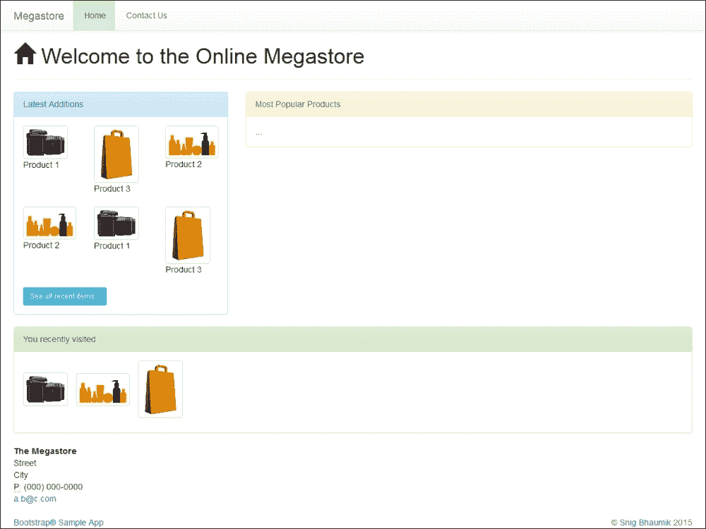
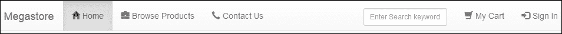
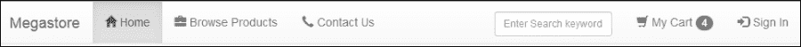
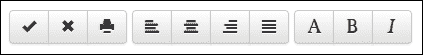
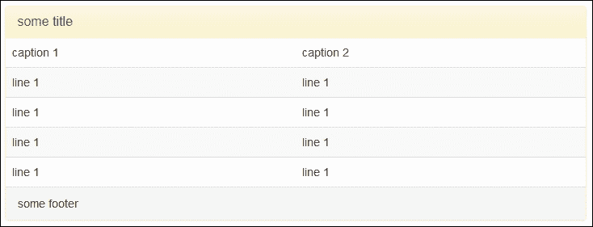
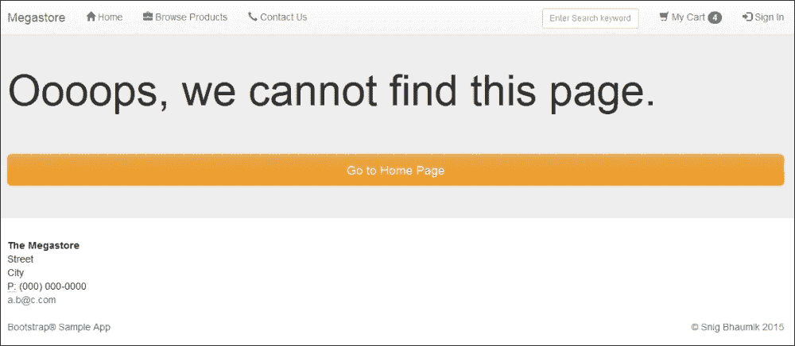
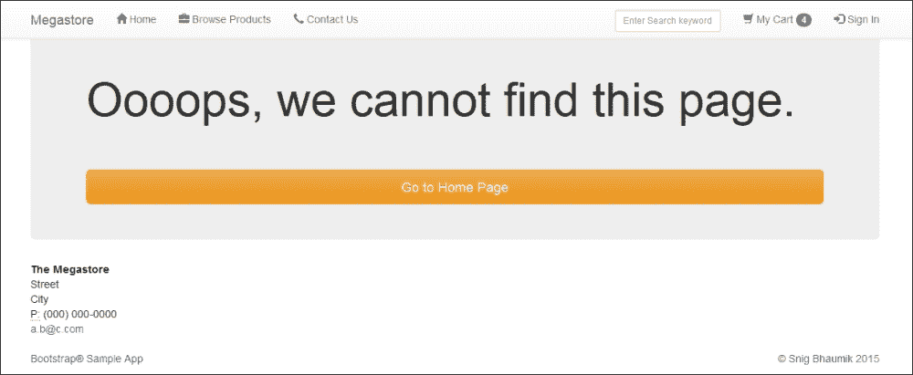
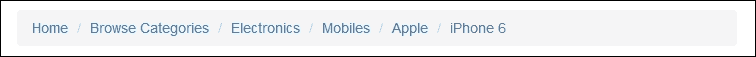
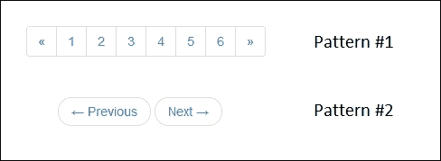

# 第四章：Bootstrap 中的组件包

Bootstrap 中的组件可以理解为相关 HTML 元素的集合，每个元素都与预定义的 CSS 类相关联，以生成特定的功能性和 UI 效果。在前一章中，我们看到了每个 HTML 元素是如何被 Bootstrap CSS 样式的；在这一章中，我们将看到一些元素，每个元素都由一些 CSS 类提供支持，一起可以创建一个新的控件并生成完整的功能——一个新的复杂组件。

例如，你一直都在 HTML 中创建组件，如导航栏、分页控件、进度条、警告和通知。你也知道，这些实际上是由许多 HTML 元素组合而成的集合。大多数时候，你使用了一些第三方库，或者自己使用大量的 HTML、CSS 和 JavaScript 代码来构建组件。

现在是时候使用 Bootstrap 组件了，这些组件非常直观，易于使用，最重要的是，实现起来代码行数更少。当然，所有这些默认都是移动友好的。

在这一章中，我们将介绍 Bootstrap 框架提供的几个主要组件：

+   使用 Glyphicons

+   创建导航栏

+   设计徽章、工具栏和按钮组

+   显示警告和警告信息

+   使用面板和井组织内容

+   使用分页和面包屑控制导航

# 页面页头

你在页面上最想要的是顶部的一个漂亮的页头。这是一个简单的 HTML 标题，包裹在一个`div`元素中。

这里是我们应用程序主页上使用的代码：

```js
<div class="page-header"><h1>Welcome to the Online Megastore</h1>
</div>
```

如果你喜欢在页头旁边加上一条消息，你可以在其中使用`<small>`元素。例如，看看以下代码：

```js
<div class="page-header">
<h1>Welcome to the Online Megastore <small>the one-stop shop</small></h1>
</div>
```

# Glyphicons

根据[Glyphicons 的原始供应商](http://glyphicons.com/)，“这是一个精心准备的单一颜色图标和符号库，强调简洁和易于定位。”简单来说，这些都是图标字体，用于表示和象征简单和常见的操作和行为。例如，如果你想为主页添加一个超链接，你可以添加一个表示这个链接的图标。购物车有一个最常见的图标；类似的例子还有登录按钮/链接或注销按钮/链接。

这些图标在今天的网页设计中非常常见，很多时候，仅使用图标就足够了，你可能不需要在之后写任何文本。到目前为止，你将使用小图标图像来完成这个目的；然而，现在我们将使用尺寸非常小、渲染速度快、在移动设备上也很高效的 Glyphicons。此外，它们可以轻松缩放和更改颜色，通过使用这些图标来替换图像图标，可以最小化 HTTP 调用次数。

为了在 Bootstrap 中使用 Glyphicons，你只需简单地添加一个带有适合你图标的 CSS 类的`span`元素。例如，看看以下代码：

```js
<span class="glyphicon glyphicon-home"></span>
```

如果你注意，我们在主页的页面标题中使用了这个图标，并且在页面标题文本之前生成了**主页**图标。Bootstrap 库中提供了丰富的 Glyphicons，具体列表请见[`getbootstrap.com/components/#glyphicons`](http://getbootstrap.com/components/#glyphicons)。

你可能还记得，在 Bootstrap 的文件夹结构中有一个`fonts`文件夹——这个文件夹中的文件负责所有 Glyphicons 的功能。

# 导航栏

在页面标题之后，下一件重要的事情是为用户提供一个导航栏，以便浏览您网站的不同页面。

我们的应用程序页面目前还没有导航栏。我们虽然有两个页面在我们的应用程序中——让我们为这些页面添加一个导航栏。

这是导航栏的基本和初步代码：

```js
<nav class="navbar navbar-default">
  <div class="container-fluid">
    <div class="navbar-header">
      <button type="button" class="navbar-toggle collapsed" data-toggle="collapse" data-target="#the-menu">
        <span class="icon-bar"></span>
        <span class="icon-bar"></span>
        <span class="icon-bar"></span>
      </button>
      <a class="navbar-brand brand" href="/index.html">Megastore</a>
    </div>

    <div class="collapse navbar-collapse" id="the-menu">
      <ul class="nav navbar-nav">
        <li class="active"><a href="/index.html">Home</a></li>
        <li><a href="/contact.html">Contact Us</a></li>
      </ul>
    </div>
  </div>
</nav>
```

### 小贴士

**下载示例代码**

您可以从您在[`www.packtpub.com`](https://www.packtpub.com/)的账户中下载示例代码文件，以获取您购买的所有 Packt Publishing 书籍。如果您在其他地方购买了这本书，您可以访问[`www.packtpub.com/support`](https://www.packtpub.com/books/content/support)并注册，以便将文件直接通过电子邮件发送给您。

我们将此代码包含在我们的索引页中，位于主`div`容器下方。其渲染效果如下：



对于较小的设备，如手机，其外观如下所示：


这里需要注意的最重要的事情是，导航菜单已经自动转换为汉堡或三明治图标，因为这是最受欢迎和标准的移动设备显示菜单方式。

现在，让我们给我们的导航栏添加一些更有趣的功能。例如，如果你在主页上垂直滚动，导航栏会在顶部消失。我们将添加另一个 Bootstrap 类，使其固定在顶部。

```js
<nav class="navbar navbar-default navbar-fixed-top">
```

这将使菜单栏固定在浏览器顶部，并且即使在您有很长的页面并且用户向下滚动时，也会始终对用户可见。

### 小贴士

然而，您会注意到实际的内容被固定在导航栏下方覆盖。为了纠正这一点，我们需要给`body`元素添加一定的顶部填充。我们已经在`body`标签中添加了这一点，然而，当然建议将其放在 CSS 类中：

```js
<body style="padding-top: 30px;">
```

我们接下来要做的是用一些图标美化我们的菜单。为此，我们将为每个菜单项添加 Glyphicons，使用以下代码：

```js
<ul class="nav navbar-nav">
  <li class="active"><a href="/index.html"><span class="glyphicon glyphicon-home"></span>&nbsp;Home</a></li>
  <li><a href="/contact.html"><span class="glyphicon glyphicon-earphone"></span>&nbsp;Contact Us</a></li>
</ul>
```

我们还需要在顶部菜单中添加一个登录链接，以便用户可以从菜单本身登录/注销。我们只需在导航菜单中添加另一个`UL`链接：

```js
<ul class="nav navbar-nav navbar-right">
  <li><a href="#"><span class="glyphicon glyphicon-log-in"></span>&nbsp;Sign In</a></li>
</ul>
```

最后，一个搜索框，使用户能够搜索我们商店的任何产品，如下所示：

```js
<form class="navbar-form navbar-right visible-md-inline visible-lg-inline">
  <div class="form-group" style="margin-top: 4px">
    <label class="sr-only" for="keyword">Keyword</label>
    <input type="text" class="form-control input-sm" id="keyword" placeholder="Enter Search keyword" />
  </div>
</form>
```

如果您注意的话，我们只为中等和大型设备添加了这个搜索框。以下是导航栏的最终源代码。我们为显示我们商店中所有产品的页面添加了另一个链接（`browse.html`）。我们将在稍后创建这个页面。我们还添加了一个链接以查看用户的购物车：

```js
<nav class="navbar navbar-default navbar-fixed-top">
  <div class="container">
    <div class="navbar-header">
      <button type="button" class="navbar-toggle collapsed" data-toggle="collapse" data-target="#the-menu">
        <span class="icon-bar"></span>
        <span class="icon-bar"></span>
        <span class="icon-bar"></span>
      </button>
      <a class="navbar-brand brand" href="/index.html">Megastore</a>
    </div>

    <div class="collapse navbar-collapse" id="the-menu">
      <ul class="nav navbar-nav">
        <li class="active"><a href="/index.html"><span class="glyphicon glyphicon-home"></span>&nbsp;Home</a></li>
        <li><a href="/browse.html"><span class="glyphicon glyphicon-briefcase"></span>&nbsp;Browse Products</a></li>
        <li><a href="/contact.html"><span class="glyphicon glyphicon-earphone"></span>&nbsp;Contact Us</a></li>
      </ul>
      <ul class="nav navbar-nav navbar-right">
        <li><a href="#"><span class="glyphicon glyphicon-shopping-cart"></span>&nbsp;My Cart</a></li>
        <li><a href="#"><span class="glyphicon glyphicon-log-in"></span>&nbsp;Sign In</a></li>
      </ul>
      <form class="navbar-form navbar-right visible-md-inline visible-lg-inline">
        <div class="form-group" style="margin-top: 4px">
          <label class="sr-only" for="keyword">Keyword</label>
          <input type="text" class="form-control input-sm" id="keyword" placeholder="Enter Search keyword" />
        </div>
      </form>
    </div>
  </div>
</nav>
```

这里是我们导航栏的当前外观：



# 徽章

徽章是简单的指示器，用于显示您想要突出显示的项目数量。非常简单的用例包括显示未读通知、电子邮件、消息等。我们将在导航栏中添加这个，以显示购物车中的项目数量。这是更新的代码行：

```js
<li><a href="#"><span class="glyphicon glyphicon-shopping-cart"></span>&nbsp;My Cart <span class="badge">4</span></a></li>
```

它看起来是这样的：



如您所见，您只需简单地添加一个带有 `badge` 类的 `span` 元素，并将文本放在里面以突出显示。

# 警告

您可以使用警告（alerts）向用户传达沟通信息；例如，显示用户正在尝试进行的操作的状态，显示一些系统信息，显示用户任何警告消息，显示任何错误消息或状态，等等。显示基本警告相当简单——只需在 Bootstrap 中创建一个带有 `.alert` 类的 `div` 元素。例如，看看以下代码：

```js
<div class="alert alert-info">You last visited us on ...</div>
```

您可以使用这些类中的任何一个来显示上下文信息——`alert-info`、`alert-warning`、`alert-success` 或 `alert-danger`。

在 `alert` 中放置链接需要您在 `anchor` 标签中添加 `.alert-link`。这将确保链接也将以相应的上下文颜色显示。例如，我们已将此警告添加到主页的最后部分：

```js
<div class="alert alert-info">You last visited us on Thursday, 20th March 2015\. Please <a href="/contact.html" class="alert-link">let us know</a> in case of any issues or feedback.</div>
```

### 注意

Bootstrap 警告模块还提供了一些其他功能，我们将在下一章中讨论。

# 工具栏和按钮组

为了将多个按钮组合在一起，我们会使用 `.btn-group` 类。这个类创建了一组按钮；然而，这些按钮中的每一个都必须关联有 `.btn` 类。例如，使用以下代码：

```js
<div class="btn-group">
  <button type="button" class="btn btn-success">Add</button>
  <button type="button" class="btn btn-warning">Edit</button>
  <button type="button" class="btn btn-danger">Delete</button>
</div>
```

这就是前面的代码将生成的内容：


我们可以将多个按钮组合在一起生成工具栏。让我们有点创新，在按钮中使用图标（而不是按钮文本）。以下是这个代码：

```js
<div class="btn-toolbar">
  <div class="btn-group">
    <button type="button" class="btn btn-default"><span class="glyphicon glyphicon-ok"></span></button>
    <button type="button" class="btn btn-default"><span class="glyphicon glyphicon-remove"></span></button>
    <button type="button" class="btn btn-default"><span class="glyphicon glyphicon-print"></span></button>
  </div>

  <div class="btn-group">
    <button type="button" class="btn btn-default"><span class="glyphicon glyphicon-align-left"></span></button>
    <button type="button" class="btn btn-default"><span class="glyphicon glyphicon-align-center"></span></button>
    <button type="button" class="btn btn-default"><span class="glyphicon glyphicon-align-right"></span></button>
    <button type="button" class="btn btn-default"><span class="glyphicon glyphicon-align-justify"></span></button>
  </div>

  <div class="btn-group">
    <button type="button" class="btn btn-default"><span class="glyphicon glyphicon-font"></span></button>
    <button type="button" class="btn btn-default"><span class="glyphicon glyphicon-bold"></span></button>
    <button type="button" class="btn btn-default"><span class="glyphicon glyphicon-italic"></span></button>
  </div>
</div>
```

这就是我们的工具栏外观：



您还可以将按钮组、工具栏和下拉菜单一起使用，以生成更丰富的用户体验。我们将在下一章中探讨这些内容。

# 面板

当然，您希望将您的网页和内容分割成不同的部分和子部分。这就像您在普通门户框架中看到的那样，或者像 iGoogle 时代那样流行。我们也在我们的主页上使用了这种模式，我们创建了三个不同的部分——**最新添加**、**最受欢迎的产品**和**您最近访问过**。

在 Bootstrap 中，可以使用面板创建这些部分。Bootstrap 中的面板有两个独立的占位符——即标题和主体，分别使用类`.panel-heading`和`.panel-body`。

就像 Bootstrap 中的许多其他组件一样，面板也有五种不同的模式——`.panel-info`、`.panel-success`、`.panel-primary`、`.panel-warning`和`.panel-danger`。

因此，在我们的代码中，我们使用了：

```js
<div class="panel panel-warning">
  <div class="panel-heading">Most Popular Products</div>
  <div class="panel-body">...</div>
</div>
```

还建议在`.panel-heading`内部使用`.panel-title`类，以保留预定义的标题样式并显示超链接的上下文颜色。

与面板标题类似，您也可以使用`.panel-footer`来创建面板的页脚部分。因此，一个完整的面板代码可以如下所示：

```js
<div class="panel panel-warning">
  <div class="panel-heading">
    <h2 class="panel-title">some title</h2>
  </div>
  <div class="panel-body">contents</div>
  <div class="panel-footer">some footer</div>
</div>
```

一个有趣的方面是展示面板内的表格。Bootstrap 足够智能，可以合并所有填充和边框，并将这两个控件无缝统一。

这里是代码：

```js
<div class="panel panel-warning">
  <div class="panel-heading">
    <h2 class="panel-title">some title</h2>
  </div>
  <table class="table table-hover table-striped">
    <thead><td>caption 1</td><td>caption 2</td></thead>
    <tr><td>line 1</td><td>line 1</td></tr>
    <tr><td>line 1</td><td>line 1</td></tr>
    <tr><td>line 1</td><td>line 1</td></tr>
    <tr><td>line 1</td><td>line 1</td></tr>
  </table>
  <div class="panel-footer">some footer</div>
</div>
```

输出如下：



如您所见，表格及其边框与面板无缝连接，给人一种统一的外观和感觉。

## 井

井几乎与面板相似，但功能更少。这将为您生成一个容器元素，以便可以在该容器中渲染一组逻辑上相关的 HTML 内容。

例如，让我们回顾一下我们在上一章中创建的**联系我们**页面。让我们把这个表单放在一个井里。这就是现在页面的样子：


### 注意

页面的完整源代码可以从[`www.packtpub.com/`](https://www.packtpub.com/)下载。

除了添加导航栏外，我们还可以添加一个新的具有类`.well`的`div`元素，并将**联系我们**表单包裹在那个井里：

```js
<div class="well well-sm">
  <form class="form-horizontal">
```

我们现在将看到我们页面的完全不同的外观。

# 巨幕

Bootstrap 中的一个有趣的新增功能是**巨幕**。这是一个可选地捕获整个视口并在其中渲染内容的组件。当我们想要展示一些内容，或者在有些页面中需要显示重要信息时，我们可以使用这个组件。一个很好的例子是 404 页面：



如您所见，该部分已捕获可用屏幕空间的全宽。然而，如果您不希望这样，这里还有一个变体：



代码如下：

```js
<div class="jumbotron">
  <div class="container">
    <h1 style="padding-bottom: 50px">Oooops, we cannot find this page.</h1>
    <a href="/index.html" class="btn btn-warning btn-lg btn-block">Go to Home Page</a>
  </div>
</div>
```

两个方差之间的区别仅在于，在第一种情况下，`jumbotron`代码块放置在主容器元素外部，而在第二种情况下，代码块放置在主容器元素内部。

因此，在第一种情况下，它捕获了整个屏幕的宽度，而在第二种变化中，它被渲染为一个固定宽度的视图。

# 面包屑导航

这是一个简单的组件，用于在您的网页中生成面包屑导航。只需在 `OL` 元素中添加 `.breadcrumb` 类，它内部的 `LI` 元素将被渲染为每个面包屑阶段。以下是代码：

```js
<ol class="breadcrumb">
  <li><a href="#">Home</a></li>
  <li><a href="#">Browse Categories</a></li>
  <li><a href="#">Electronics</a></li>
  <li><a href="#">Mobiles</a></li>
  <li><a href="#">Apple</a></li>
  <li class="active">iPhone 6</li>
</ol>
```

这里是生成的面包屑导航：



# 分页导航

Bootstrap 提供了两种分页控件模式，如下所示：



这里是代码：

```js
<!-- Pattern #1 -->
<nav>
  <ul class="pagination">
    <li><a href="#">&laquo;</a></li>
    <li><a href="#">1</a></li>
    <li><a href="#">2</a></li>
    <li><a href="#">3</a></li>
    <li><a href="#">4</a></li>
    <li><a href="#">5</a></li>
    <li><a href="#">6</a></li>
    <li><a href="#">&raquo;</a></li>
  </ul>
</nav>

<!-- Pattern #2 -->
<nav>
  <ul class="pager">
    <li><a href="#">&larr;&nbsp;Previous</a></li>
    <li><a href="#">Next&nbsp;&rarr;</a></li>
  </ul>
</nav>
```

如您所见，这两种模式都是简单的无序列表（UL）控件，但使用了不同的 Bootstrap 类。

# 摘要

在本章中，我们看到了如何通过在一系列 HTML 控件中使用多个 CSS 类来扩展 Bootstrap，以创建不同的打包组件。通过这个过程，我们几乎拥有了设计灵活网页所需的所有常用控件。所有这些组件都是仅使用 CSS 类构建的。在下一章中，我们将探索 Bootstrap 的 JavaScript 组件。
