# 第五章. Bootstrap 中的 JavaScript 插件

Bootstrap 框架中最强大的功能之一是 JavaScript 插件。在这个库中，我们几乎拥有所有必需的前端组件，例如模态窗口、轮播图、下拉菜单、工具提示、警告、导航标签、手风琴等。与之前讨论的 CSS 类和组件一起，这些 JavaScript 插件使 Bootstrap 成为一个完整的套件和框架，用于开发你的 HTML 页面——无论是桌面设备还是移动设备。

在本章中，我们将深入探讨这些插件，并使用这些组件极大地增强我们的示例应用程序。

正如我们之前简要讨论过的，Bootstrap JavaScript 组件是使用 jQuery（[`jquery.com/`](https://jquery.com/)）构建的，并且基于 jQuery。因此，这些插件的语法和行为与 jQuery 相似。

### 注意

我们假设你对 jQuery 有基本的了解，因为我们将使用基于 jQuery 的脚本在我们的进一步实现和解释中。 

对于不熟悉 jQuery 的人来说，可以参考[`api.jquery.com/`](https://api.jquery.com/)上的在线文档。

# 基本概念

在深入实现 JavaScript 插件之前，让我们首先澄清一些基本概念。

## 自定义数据属性

根据 W3C 规范，自定义数据属性可以定义为以下内容：

> *"自定义数据属性旨在存储页面或应用程序专有的自定义数据，对于这些数据没有更合适的属性或元素。"*

([`www.w3.org/html/wg/drafts/html/master/dom.html#embedding-custom-non-visible-data-with-the-data-*-attributes`](http://www.w3.org/html/wg/drafts/html/master/dom.html#embedding-custom-non-visible-data-with-the-data-*-attributes)). 因此，在 HTML5 中，你可以在任何 HTML 元素中添加自定义属性。属性名应该以`data-*`开头；在这里，`*`代表你属性的真正名称。属性值，就像任何其他 HTML 属性一样，是字符串。这一特性是在 HTML5 中引入的，以使网站开发者能够存储与 HTML 元素对应的自定义值，即那些不能在任何标准属性中调整的值。

在 Bootstrap JavaScript 插件中，一些这样的自定义数据属性被大量使用：

+   `data-target`

+   `data-toggle`

+   `data-dismiss`

+   `data-spy`

+   `data-placement`

+   `data-content`

+   `data-container`

+   `data-animation`

+   `data-loading-text`

+   `data-complete-text`

+   `data-parent`

+   `data-slide`

+   `data-ride`

所有这些`data-*`属性完全是自定义的，并由 Bootstrap 框架使用。我们将在后面看到这些数据属性如何在各种 JavaScript 组件中使用。简而言之，即使在不编写任何 JavaScript 代码的情况下，你也能围绕这些插件开发功能。

## JavaScript API

尽管我们可以使用 Bootstrap 中使用的强大数据属性开发许多功能，但我们仍然需要标准的操作方式——调用方法、处理事件、动态设置属性等等。

## JavaScript 事件

像任何其他标准的 JavaScript 组件库一样，Bootstrap 附加组件也支持典型的触发和处理事件的方式。当您想要在特定事件发生时执行某些操作时，处理这些事件可能非常有用。例如，您希望在模态窗口关闭时调用 AJAX 调用。

## 打包附加组件

正如您在前面的章节中注意到的源代码中，我们已经将`bootstrap.min.js`文件包含到了我们的 HTML 页面中。这个文件包含了 Bootstrap 提供的所有 JavaScript 附加组件。因此，当您将此文件包含到 HTML 页面中时，您将能够使用任何和所有这些附加组件。

如果您只想包含和使用可用的组件中的一部分，那么您也可以创建并使用这个文件的子集。我们将在后面的章节中看到如何做到这一点。

# 模态窗口

模态窗口可能是最广泛使用的自定义组件之一。标准 JavaScript 的 alert 和 prompt 时代已经过去了；您应该实现自定义模态窗口以与用户交互。

Bootstrap 提供了一套丰富的功能和特性，几乎可以满足所有关于模态窗口的需求变化。

## 基本模态窗口

下面是最基本的模态窗口版本：

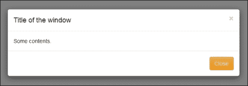

下面是创建它的代码：

```js
<div class="modal" id="theModal" tabindex="-1">
  <div class="modal-dialog">
    <div class="modal-content">
      <div class="modal-header">
        <button type="button" class="close" data-dismiss="modal"><span>&times;</span></button>
        <h4 class="modal-title" id="theModalLabel">Title of the window</h4>
      </div>
      <div class="modal-body">
        Some contents.
      </div>
      <div class="modal-footer">
        <button type="button" class="btn btn-warning" data-dismiss="modal">Close</button>
      </div>
    </div>
  </div>
</div>
```

当然，您需要一个按钮或链接来打开这个窗口。下面是相应的代码：

```js
<button type="button" class="btn btn-success btn-lg" data-toggle="modal" data-target="#theModal">Open Modal</button>
```

通过仅仅放置这两个代码块，您应该能够创建一个模态窗口和一个打开它的按钮。如您所见，我们还没有编写任何 JavaScript 代码，但仍然可以生成一个模态窗口和一个控制打开它的控件。

这里需要注意的最重要的事情是`button`元素的`data-toggle`和`data-target`属性。通过将模态窗口作为`data-toggle`的值，我们通知 Bootstrap 这个按钮将调用某个模态窗口，而应该调用哪个模态窗口则由`data-target`属性决定。因此，您可以看到`data-target`属性的值是模态窗口——这实际上是作为模态窗口工作的`div`元素的 ID。现在，让我们注意一下`modal-footer`部分中的按钮。这个按钮有一个`data-dismiss`属性，表示它将关闭当前的模态窗口。

这是最常见的 Bootstrap 分发的 JavaScript 附加组件的工作方式。当然，其他组件中也在使用几个其他数据属性，但开发和用法是相同的。

最后，我们也可以通过常规 JavaScript 打开模态对话框，如果你出于某种原因不想使用数据属性——例如，如果你想在发生特定事件时打开模态窗口，例如 AJAX 回调被调用。以下是我们的传统脚本方式：

```js
<button type="button" class="btn btn-primary btn-lg" onclick="callMe()">Open Modal by Script</button>
```

脚本如下：

```js
function callMe() {
$('#theModal').modal();
}
```

此方法本质上是一个简化的重载变体的形式：

+   `modal('show')`: 这会打开模态对话框。

+   `modal('hide')`: 这会关闭对话框。

+   `modal('toggle')`: 这会切换状态——如果对话框是打开的，则关闭；如果关闭，则打开。

+   `modal(options)`: 一些常用的选项包括 `keyboard`（true/false）、`show`（true/false）和 `backdrop`（static/true/false）。将 `keyboard` 的值设置为 `false` 可以确保在按下 *Esc* 键时对话框不会关闭。将 `static` 设置为 `backdrop` 的值将限制在鼠标点击时对话框不会关闭。

    ### 注意

    这里需要注意的一个重要事项是，如果你想要使用前面的任何选项（例如 `keyboard`、`show`、`backdrop`），你可能需要使用 JavaScript API，而不是通过数据属性来调用对话框。

## 示例 - 使用模态对话框增强我们的应用程序

现在，让我们通过模态对话框来增强我们的应用程序。你可能还记得，在前一章中我们在顶部导航栏中添加了一个用于 **登录** 的链接。让我们为用户提供一个登录我们网站的弹出窗口。以下是我们的模态框代码：

```js
<!-- Sign In Dialog Box -->
<div class="modal fade" id="logonBox" tabindex="-1">
  <div class="modal-dialog">
    <div class="modal-content">
      <div class="modal-header">
        <button type="button" class="close" data-dismiss="modal"><span>&times;</span></button>
        <h4 class="modal-title">Sign In</h4>
      </div>
      <div class="modal-body">
        <form>
          <div class="form-group">
            <input type="text" class="form-control" id="userName" placeholder="User Name">
          </div>
          <div class="form-group">
            <input type="password" class="form-control" id="password" placeholder="Password">
          </div>
        </form>
      </div>
      <div class="modal-footer">
        <button type="button" class="btn btn-warning" data-dismiss="modal">Close</button>
        <button type="button" class="btn btn-primary" id="doLogon">Sign In</button>
      </div>
    </div>
  </div>
</div>  
```

这是导航栏中 **登录** 链接的代码：

```js
<li><a href="#" id="logonLink"><span class="glyphicon glyphicon-log-in"></span>&nbsp;Sign In</a></li>
```

最后，这是我们的 JavaScript：

```js
<script>
  $('#logonLink').on('click', function(e) {
    $('#logonBox').modal({
      keyboard: false,
      backdrop: 'static'
    });
  });
  $('#doLogon').on('click', function(e) {
    alert('Thank you for Signing In');
    $('#logonBox').modal('hide');
  });
</script>
```

### 注意

你可以从下载的源代码包中获取完整的页面源代码。

这就是我们的 **登录** 对话框的外观：

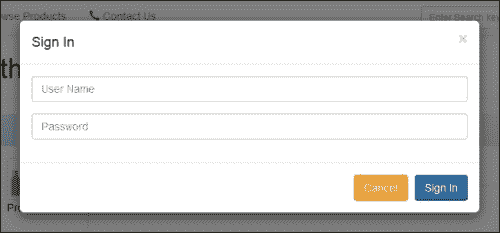

在脚本中，当然，你需要添加你的代码来实际登录用户，这可能是一个提交调用或对服务器的 AJAX 调用。

此外，Bootstrap 模态窗口还支持一些事件，以便在发生这些事件之一时执行任何操作。

例如，看看以下代码：

```js
$('#logonBox').on('hidden.bs.modal', function (e) {
  alert('You have cancelled the Sign In operation');
})
```

这将在模态窗口完全关闭时显示此浏览器警告。其他公开的事件包括—`show.bs.modal`、`shown.bs.modal`、`hide.bs.modal`、`hidden.bs.modal` 和 `loaded.bs.modal`。

# 标签

标签是当今网站中另一种流行且相当标准的导航方式。在 Bootstrap 中，设计基于标签的导航模型非常简单；你只需要创建一个具有 `.nav-tabs` CSS 类的 UL 元素。以下是一个示例代码：

```js
<div>
  <ul class="nav nav-tabs">
    <li class="active"><a href="#tab1" data-toggle="tab">Tab 1</a></li>
    <li ><a href="#tab2" data-toggle="tab">Tab 2</a></li>
    <li ><a href="#tab3" data-toggle="tab">Tab 3</a></li>
    <li ><a href="#tab4" data-toggle="tab">Tab 4</a></li>
  </ul>

  <div class="tab-content">
    <div class="tab-pane active" id="tab1"><br/>This is Tab 1</div>
    <div class="tab-pane" id="tab2"><br/>This is Tab 2</div>
    <div class="tab-pane" id="tab3"><br/>This is Tab 3</div>
    <div class="tab-pane" id="tab4"><br/>This is Tab 4</div>
  </div>
</div>
```

这里是简单的标签显示：

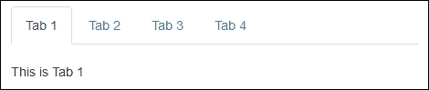

显示标签的另一种方式被称为 **药丸**。只需将类 `.nav-tabs` 替换为 `.nav-pills`。以下是实现方式：


现在，让我们在我们的应用程序中使用这个标签显示。我们想要有一个 **注册** 表单（到目前为止，我们只有 **登录**）。我们将把这个 **注册** 表单添加到显示登录表单的同一个模态对话框中。以下是相同截图的截图：

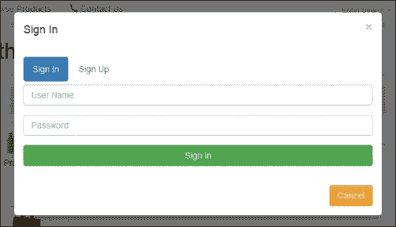

下面是 **注册** 标签的截图：

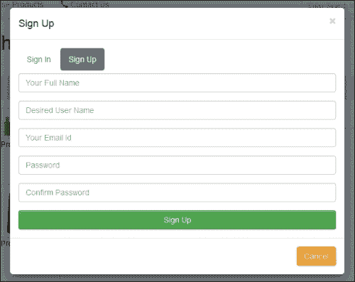

现在，让我们看看前述截图的代码：

```js
<div class="modal fade" id="logonBox" tabindex="-1">
  <div class="modal-dialog">
    <div class="modal-content">
      <div class="modal-header">
        <button type="button" class="close" data-dismiss="modal"><span>&times;</span></button>
        <h4 class="modal-title">Sign In</h4>
      </div>
      <div class="modal-body">
        <div>
          <ul class="nav nav-pills">
            <li class="active"><a href="#signin" data-toggle="tab" data-caption="Sign In">Sign In</a></li>
            <li ><a href="#signup" data-toggle="tab" data-caption="Sign Up">Sign Up</a></li>
          </ul>
          <div class="tab-content">
            <div class="tab-pane active" id="signin">
              <form style="padding-top: 5px">
                <div class="form-group">
                  <input type="text" class="form-control" id="userName" placeholder="User Name">
                </div>
                <div class="form-group">
                  <input type="password" class="form-control" id="password" placeholder="Password">
                </div>
                <button type="button" class="btn btn-success btn-block" id="doLogon">Sign In</button>
              </form>
            </div>
            <div class="tab-pane" id="signup">
              <form style="padding-top: 5px">
                <div class="form-group">
                  <input type="text" class="form-control" id="yourName" placeholder="Your Full Name">
                </div>
                <div class="form-group">
                  <input type="text" class="form-control" id="yourUserName" placeholder="Desired User Name">
                </div>
                <div class="form-group">
                  <input type="text" class="form-control" id="yourEmail" placeholder="Your Email Id">
                </div>
                <div class="form-group">
                  <input type="password" class="form-control" id="yourPwd" placeholder="Password">
                </div>
                <div class="form-group">
                  <input type="password" class="form-control" id="confirmPwd" placeholder="Confirm Password">
                </div>
                <button type="button" class="btn btn-success btn-block" id="doLogon">Sign Up</button>
              </form>
            </div>
          </div>
        </div>
      </div>
      <div class="modal-footer">
        <button type="button" class="btn btn-warning" data-dismiss="modal">Cancel</button>
      </div>
    </div>
  </div>
</div>
```

下面是相应的 JavaScript 代码：

```js
$('a[data-toggle="tab"]').on('shown.bs.tab', function (e) {
  var data = $(e.target).data('caption');
  var modal = $('#logonBox');
  modal.find('.modal-title').text(data);

});
```

HTML 标记相当直观；然而，这段小的 JS 代码很有趣。这段代码的作用是，当用户从一个标签导航到另一个标签（从 **登录** 到 **注册**，反之亦然）时，对话框的标题（标题）会相应地更改。

这里有几个值得注意的点：

+   当选择新标签时（`shown.bs.tab` 事件），将调用此函数。这个函数本质上是一个事件处理器。

+   `e.target` 对象代表新打开的标签。

+   在 HTML 标记中，你可以看到我们添加了一个自定义数据属性 `data-caption`；此属性用于设置模态窗口的标题。

与此 `shown.bs.tab` 事件类似，其他公开的事件还包括—`show.bs.tab`、`hide.bs.tab` 和 `hidden.bs.tab`。

# 折叠和手风琴

Bootstrap 折叠组件用于简单地显示和隐藏网页的不同部分和子部分。当你不想在最初显示这些部分，但点击按钮或超链接时可以切换时，这很有用。以下是一个简单的示例：

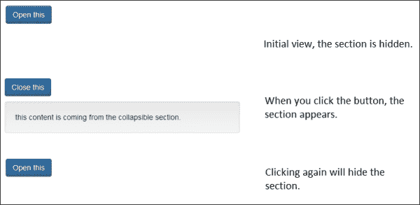

下面是前述截图的 HTML 代码：

```js
<button class="btn btn-primary" type="button" data-toggle="collapse" data-target="#theSection" id="theButton">Open this</button>
<div class="collapse" id="theSection">
  <div class="well">
    this content is coming from the collapsible section.
  </div>
</div>
```

前述截图的 JavaScript 代码是：

```js
// When the collapsible element is shown, change the button's text to 'close this'
$('#theSection').on('show.bs.collapse', function () {
  $('#theButton').text('Close this');
});
// When the collapsible element is collpased, change the button's text to 'Open this'
$('#theSection').on('hide.bs.collapse', function () {
  $('#theButton').text('Open this');
});
```

再次，通过使用 `data-target` 和 `data-toggle` 属性，我们已经实现了折叠行为。此外，我们还使用了 `show.bs.collapse` 和 `hide.bs.collapse` 事件处理器来相应地更改按钮的文本。

## 示例 - 显示我们商店的产品类别

你可能记得我们在上一章中在我们的导航栏中添加了一个链接。让我们为它创建一个页面，并在这个页面中使用这个折叠组件作为手风琴来显示我们商店的产品类别。以下是使用手风琴模式对类别进行标记的代码：

```js
<div class="panel-group" id="catList">
  <div class="panel panel-primary" id="cat1Head">
    <div class="panel-heading">
      <h4 class="panel-title">
        <a data-toggle="collapse" data-parent="#catList" href="#cat1"><span class="glyphicon glyphicon-user"></span>&nbsp;Fashion and Clothing for Him</a>
      </h4>
    </div>
    <div id="cat1" class="panel-collapse collapse in">
      <ul class="list-group">
        <li class="list-group-item">Shirts</li>
        <li class="list-group-item">Tees</li>
        <li class="list-group-item">Trousers</li>
        <li class="list-group-item">Footwear</li>
        <li class="list-group-item">Accessories</li>
      </ul>
    </div>
  </div>

  <div class="panel panel-default" id="cat2Head">
    <div class="panel-heading">
      <h4 class="panel-title">
        <a data-toggle="collapse" data-parent="#catList" href="#cat2"><span class="glyphicon glyphicon-heart"></span>&nbsp;Fashion and Clothing for Her</a>
      </h4>
    </div>
    <div id="cat2" class="panel-collapse collapse">
      <ul class="list-group">
        <li class="list-group-item">Shirts</li>
        <li class="list-group-item">Tees</li>
        <li class="list-group-item">Skirts</li>
        <li class="list-group-item">Footwear</li>
        <li class="list-group-item">Jewellery</li>
        <li class="list-group-item">Accessories</li>
      </ul>
    </div>
  </div>

  <div class="panel panel-default" id="cat3Head">
    <div class="panel-heading">
      <h4 class="panel-title">
        <a data-toggle="collapse" data-parent="#catList" href="#cat3"><span class="glyphicon glyphicon-phone"></span>&nbsp;Electronics</a>
      </h4>
    </div>
    <div id="cat3" class="panel-collapse collapse">
      <ul class="list-group">
        <li class="list-group-item">Mobiles</li>
        <li class="list-group-item">Tablets</li>
        <li class="list-group-item">LEDs and LCDs</li>
        <li class="list-group-item">Laptops</li>
        <li class="list-group-item">Desktops</li>
        <li class="list-group-item">Cameras</li>
        <li class="list-group-item">Appliances</li>
        <li class="list-group-item">Health Care</li>
        <li class="list-group-item">Accessories</li>
      </ul>
    </div>
  </div>
</div>
```

下面的 JavaScript 代码可以使用一些额外的 Bootstrap 类来美化我们的标记：

```js
$('#cat1').on('show.bs.collapse', function () {
  $('#cat1Head').removeClass('panel-default').addClass('panel-primary');
  $('#cat2Head').removeClass('panel-success').addClass('panel-default');
  $('#cat3Head').removeClass('panel-warning').addClass('panel-default');
});      
$('#cat2').on('show.bs.collapse', function () {
  $('#cat1Head').removeClass('panel-primary').addClass('panel-default');
  $('#cat2Head').removeClass('panel-default').addClass('panel-success');
  $('#cat3Head').removeClass('panel-warning').addClass('panel-default');
});      
$('#cat3').on('show.bs.collapse', function () {
  $('#cat1Head').removeClass('panel-primary').addClass('panel-default');
  $('#cat2Head').removeClass('panel-success').addClass('panel-default');
  $('#cat3Head').removeClass('panel-default').addClass('panel-warning');
});  
```

这就是我们分类浏览器的样子。我们为三个主要类别创建了三个独立的区域。以下是所有三个类别合并在一起的截图：

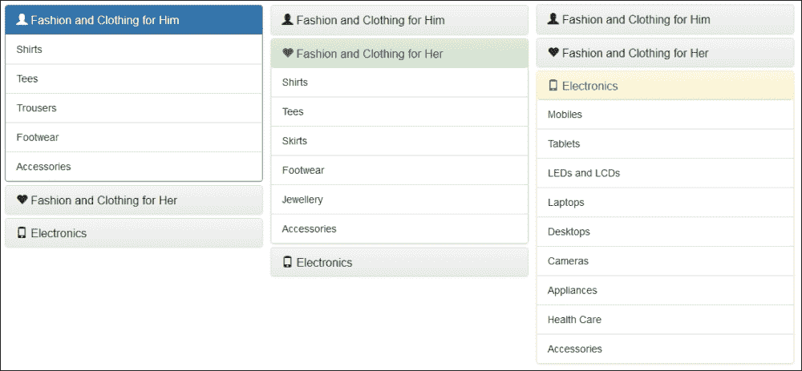

最后，这是我们的浏览页面的样子：

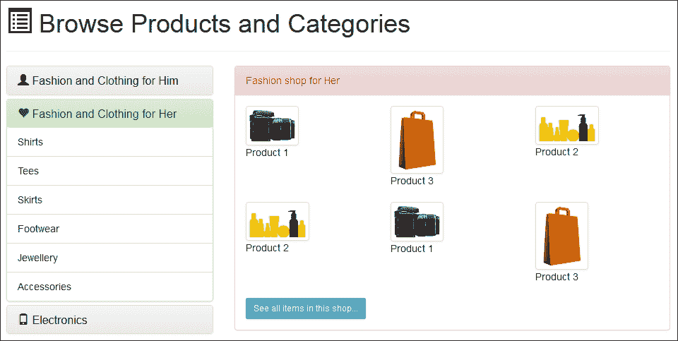

### 注意

该页面的完整源代码可供下载。

# 工具提示和弹出框

当然，您需要为每个用户友好的网站开发添加工具提示。工具提示是您通常在图像中使用的`title`属性的更高级版本。以下是一个简单的工具提示：

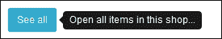

这个 HTML 标记的示例如下所示：

```js
<a class="btn btn-info btn-sm" href="#" role="button" data-toggle="tooltip" data-placement="right" title="Open all items in this shop...">See all</a>
```

当然，`data-toggle`、`data-placement`和`title`属性选项仅在当前上下文中相关。您有四个选项（实际上是四个方向）的数据放置选项——顶部、右侧、底部和左侧。提示将根据此属性值显示。

然而，您需要在您想要使用提示功能的页面上初始化提示功能。这是因为，与任何其他组件不同，Bootstrap 默认不会初始化此组件。以下是相应的代码——您可以直接将其包含在 HTML 页面的 JS 部分中：

```js
$(document).ready(function () {    
$('[data-toggle="tooltip"]').tooltip();
$('[data-toggle="popover"]').popover();  
});
```

此脚本将启用当前页面中所有的工具提示和弹出提示。工具提示的下一个高级选项是弹出提示。在工具提示中，您不能有复杂和冗长的数据。您也不能在工具提示中显示 HTML 内容。弹出提示更灵活和高级。假设，在产品列表中，我们想在鼠标点击时显示简要详情。以下示例包含两种类型的弹出提示创建——一种通过数据属性，另一种通过 JavaScript。以下是我们的 HTML 代码：

```js

```

对于产品 2，HTML 标记和 JavaScript 如下所示：

```js


$('#prod3').popover({
  html:true,
  placement:'left',
  trigger:'click',
  container:'body',
  content:function(){
    return '<div class="row"><div class="col-xs-12 col-sm-12 col-md-6 col-lg-6"><br/>&nbsp;<br/><button type="button" class="btn btn-xs btn-success">Add to cart</button><br/><button type="button" class="btn btn-xs btn-info">See full details</button></div><div class="col-xs-12 col-sm-12 col-md-6 col-lg-6">Lorem ipsum dolor sit amet, consectetur adipiscing elit, sed do eiusmod tempor incididunt ut labore et dolore magna aliqua. Ut enim ad minim veniam, quis nostrud exercitation ullamco laboris nisi ut aliquip ex ea commodo consequat.</div></div>';
  }
});
```

这就是弹出提示的渲染方式（两个弹出提示截图合并为一个）：

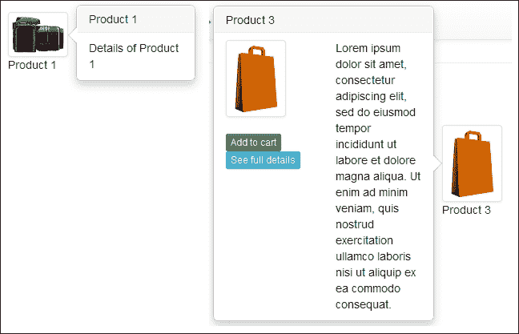

您可以看到，在 JavaScript 初始化弹出提示时，您可以传递各种其他参数，这为您提供了更多的控制和灵活性。至于`content`值，您始终可以调用另一个函数，该函数反过来会调用 AJAX 调用并从您的数据库中获取数据。

# 下拉菜单

Bootstrap 下拉组件可以在许多情况下使用，例如在菜单、按钮、链接、导航栏等。

假设我们需要在产品列表面板中创建的“查看所有”链接中的下拉菜单中添加一些选项。这是我们想要的：

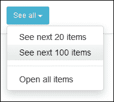

这是实现此功能的标记：

```js
<div class="dropdown">
  <a class="btn btn-info btn-sm" href="#" data-toggle="dropdown" title="Open items in this shop...">See all&nbsp;<span class="caret"></span></a>
  <ul class="dropdown-menu">
    <li><a href="#">See next 20 items</a></li>
    <li><a href="#">See next 100 items</a></li>
    <li class="divider"></li>
    <li><a href="#">Open all items</a></li>
  </ul>        
</div>  
```

以类似的方式，我们还可以在导航菜单中添加下拉菜单。假设我们需要在导航栏中为用户的账户、个人资料、购物车等添加下拉菜单。这是预期的结果：

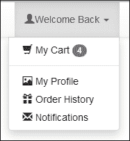

要实现这一点，我们需要更改以下行：

```js
<li><a href="#"><span class="glyphicon glyphicon-shopping-cart"></span>&nbsp;My Cart <span class="badge">4</span></a></li>
```

变为以下内容：

```js
<li class="dropdown">
  <a data-toggle="dropdown" href="#"><span class="glyphicon glyphicon-user"></span>Welcome Back&nbsp;<span class="caret"></span></a> 
  <ul class="dropdown-menu">
    <li><a href="#"><span class="glyphicon glyphicon-shopping-cart"></span>&nbsp;My Cart&nbsp;<span class="badge">4</span></a></li>
    <li class="divider"></li>
    <li><a href="#"><span class="glyphicon glyphicon-picture"></span>&nbsp;My Profile</a></li>
    <li><a href="#"><span class="glyphicon glyphicon-gift"></span>&nbsp;Order History</a></li>
    <li><a href="#"><span class="glyphicon glyphicon-envelope"></span>&nbsp;Notifications</a></li>
  </ul>        
</li>
```

因此，您可以看到 Bootstrap 下拉菜单在本质上非常通用，可以在许多地方和多种用途中使用。

# 警告

我们在上一章中简要介绍了这个组件。为了扩展其功能，让我们添加一个简单的关闭按钮来关闭警告框：

```js
<div class="alert alert-info">
  <button type="button" class="close" data-dismiss="alert" aria-label="Close">
    <span aria-hidden="true">&times;</span>
  </button>
  You last visited us on Thursday, 20th March 2015\. Please <a href="/contact.html" class="alert-link">let us know</a> in case of any issues or feedback.
</div>
```

因此，我们在这里有了一个关闭按钮：

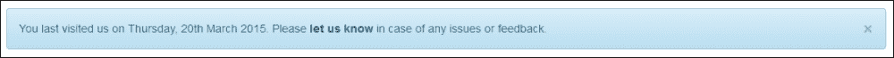

警告组件还提供了 JavaScript 接口，因为大多数时候你希望警告信息根据用户的操作动态显示。

如果你还记得，在弹出组件中，我们在产品点击时添加了一个弹出窗口，以显示产品详情。那里我们也有一个**添加到购物车**按钮。假设，当用户点击此按钮时，应出现一个警告框，确认产品已添加到购物车中。我们为此稍微改变了弹出窗口：

```js
$('#prod3').popover({
  html:true,
  placement:'left',
  trigger:'click',
  container:'body',
  content:function(){
    return '<div class="row"><div class="col-xs-12 col-sm-12 col-md-6 col-lg-6"><br/>&nbsp;<br/><button type="button" class="btn btn-xs btn-success" onclick="addToCart()">Add to cart</button><br/><button type="button" class="btn btn-xs btn-info">See full details</button></div><div class="col-xs-12 col-sm-12 col-md-6 col-lg-6">Lorem ipsum dolor sit amet, consectetur adipiscing elit, sed do eiusmod tempor incididunt ut labore et dolore magna aliqua. Ut enim ad minim veniam, quis nostrud exercitation ullamco laboris nisi ut aliquip ex ea commodo consequat.</div></div>';
  }
});
```

我们在这里所做的唯一改变是，为**添加到购物车**按钮添加了一个`onclick`事件处理器。

我们还在页面中添加了一个空白占位符（在页面标题之后），以便显示警告信息：

```js
<div class="page-header"><h1><span class="glyphicon glyphicon-list-alt"></span>&nbsp;Browse Products and Categories</h1></div>
<div id="msg"></div>
```

最后，为`onclick`事件处理器编写的 JavaScript 函数：

```js
function addToCart() {
  var txt = '<div id="alertdiv" class="alert alert-success alert-dismissable"><button class="close" data-dismiss="alert">&times;</button><h4>Congratulations</h4>This product is added to your cart.</div>';
  $('#msg').html(txt);
  $('#prod3').popover('hide');
};
```

因此，每当按下**添加到购物车**按钮时，此警告信息将显示：

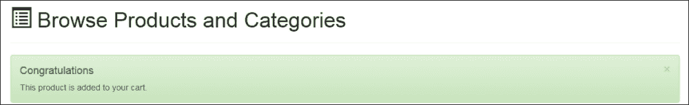

当然，在这个函数中，你需要添加你的 AJAX 调用，以便实际上将产品添加到购物车中。根据这个执行结果，用户将得到通知。以下是一个示例，如果由于某种原因产品无法添加到购物车中：

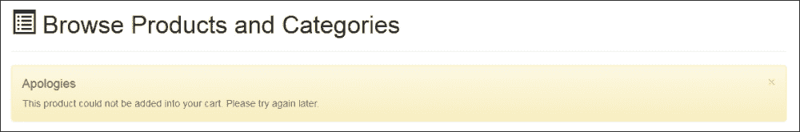

更新后的代码当然位于`addToCart` JavaScript 函数中：

```js
var txt = '<div id="alertdiv" class="alert alert-warning alert-dismissable"><button class="close" data-dismiss="alert">&times;</button><h4>Apologies</h4>This product could not be added into your cart. Please try again later.</div>';
```

如此可见，警告组件非常灵活且通用，足以在各种情况下使用。

# 轮播图

轮播图是流行的幻灯片组件，Bootstrap 也提供了使用它。在我们的主页上，让我们以轮播图的形式显示最受欢迎的产品。以下是 HTML 标记：

```js
<div id="bestSellers" class="carousel slide" data-ride="carousel">
  <ol class="carousel-indicators">
    <li data-target="#bestSellers" data-slide-to="0" class="active"></li>
    <li data-target="#bestSellers" data-slide-to="1"></li>
    <li data-target="#bestSellers" data-slide-to="2"></li>
    <li data-target="#bestSellers" data-slide-to="3"></li>
  </ol>

  <div class="carousel-inner">
    <div class="item active">
      
      <div class="carousel-caption">Product 1</div>
    </div>
    <div class="item">
      
      <div class="carousel-caption">Product 2</div>
    </div>
    <div class="item">
      
      <div class="carousel-caption">Product 3</div>
    </div>
    <div class="item">
      
      <div class="carousel-caption">Product 4</div>
    </div>
  </div>

  <a class="left carousel-control" href="#bestSellers" data-slide="prev">
    <span class="glyphicon glyphicon-chevron-left"></span>
  </a>
  <a class="right carousel-control" href="#bestSellers" data-slide="next">
    <span class="glyphicon glyphicon-chevron-right"></span>
  </a>
</div>
```

让我们把前面的代码块放置在我们主页的**最受欢迎的产品**部分。轮播图渲染如下截图所示：

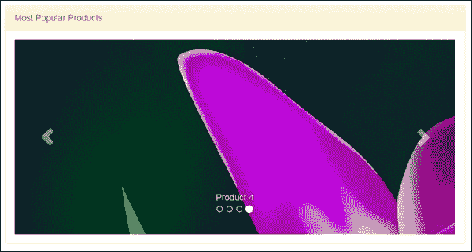

与其他组件一样，轮播图组件也通过 JavaScript API 提供。例如，在以下代码中，如果我们必须通过脚本调用轮播图组件：

```js
$('#bestSellers).carousel({
interval: 3000,
pause: 'hover'
});
```

`interval`值定义了每张幻灯片停留的时间和然后前进的时间（以毫秒为单位）。提及悬停暂停指示 Bootstrap 停留在当前幻灯片上，直到鼠标移出容器。轮播图组件的重要部分如下：

+   `carousel-indicator`：这些控件用于在轮播图的一组幻灯片中打开特定的幻灯片

+   `carousel-inner`：这些部分是轮播图中每张幻灯片的实际内容

+   `carousel-control`：这些实际上是用于在轮播图中导航到上一张或下一张幻灯片的左右箭头

# 最终预览

两个页面的完整代码可以在本书提供的可下载代码中找到。两个主要页面——**主页**和**浏览产品**页面的最终版本截图如下所示：

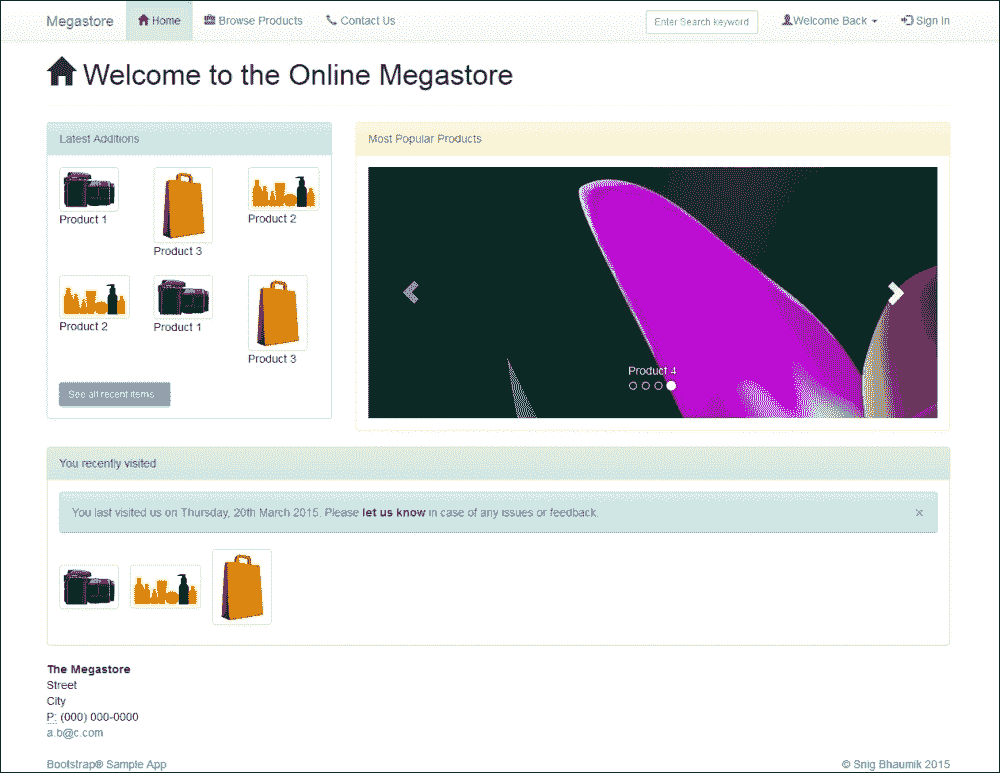

在小型移动设备上，它看起来如下截图所示：

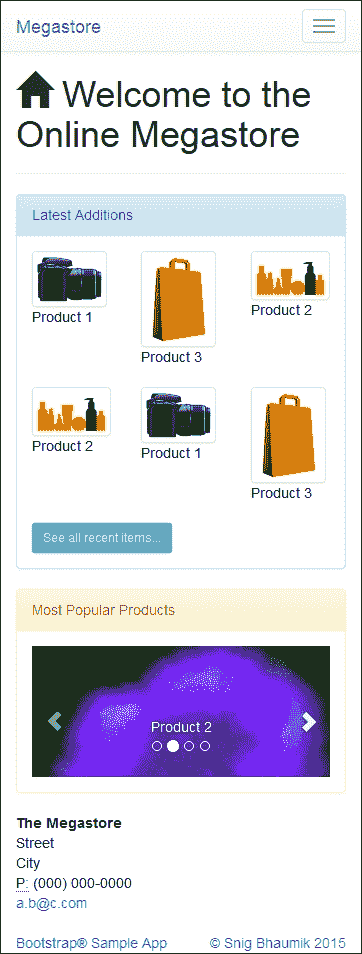

这是“浏览产品”页面的桌面视图：

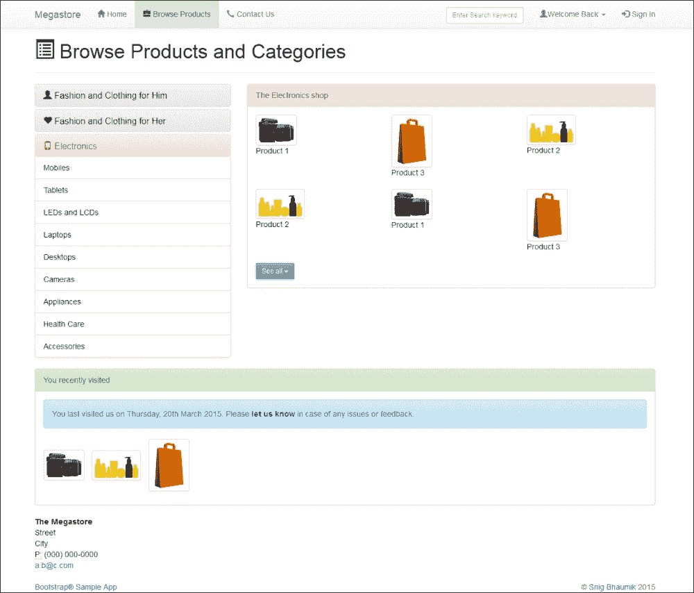

最后，页面的移动版本如下所示：

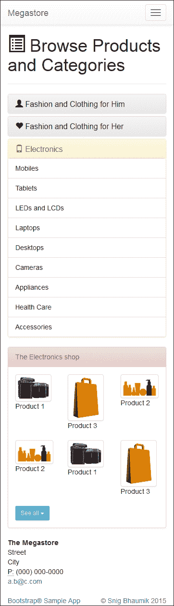

# 摘要

在本章中，我们几乎完成了对 Bootstrap 所有功能和特性的探索。我们看到了 CSS 类，可用的组件，以及最后的 JavaScript 扩展。再次强调，一些重要的 CSS 类包括网格系统、响应式类、数据输入表单、表格和图片。同样，一些重要的组件包括面板和井、工具栏和按钮组、面包屑和导航控件，以及图标字体。最后，在本章中，我们探索了 JS 扩展：模态窗口、工具提示和弹出窗口、轮播图、手风琴和警告。

在下一章中，我们将开始创建我们的 Bootstrap 开发环境，并将自定义默认的 Bootstrap 选项。
