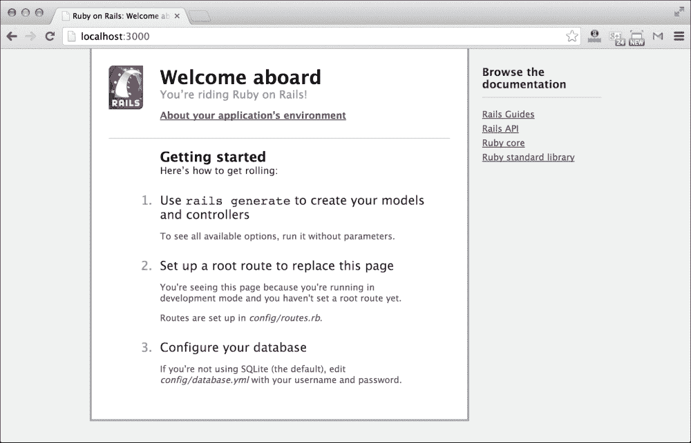

# 第一章. 介绍 Rails 中的 Web 应用程序开发

以最佳方式展示您的应用程序一直是每位网页开发者最重要的因素。在这个以移动设备为先导的时代，我们被迫随风而行，使我们的应用程序兼容于手机、平板电脑、个人电脑以及地球上所有可能的显示设备。

**Bootstrap** 是解决开发者所面临所有烦恼的一站式解决方案。它无需额外努力，也不需要任何高级 CSS 知识，就能创建出美丽的响应式设计。对于每一位开发者来说，它都是真正的福音。

在本章以及整本书中，我们将关注如何借助 Bootstrap 美化我们的 Rails 应用程序。在本章中，我们将使用 Rails 创建一个基本的 Todo 应用程序。我们将探索 Rails 应用的文件夹结构，并分析哪些文件夹对于模板化 Rails 应用程序很重要。这将有助于你快速回顾 Rails 概念。

我们还将了解如何创建视图、链接它们以及样式化它们。本章中的样式化将通过应用程序的默认 CSS 文件以传统方式完成。最后，我们将讨论如何使用 Bootstrap 加速设计过程。

简而言之，我们将涵盖以下主题：

+   为什么选择 Bootstrap 与 Rails 结合使用？

+   在 Rails 中设置 Todo 应用程序

+   分析 Rails 应用的文件夹结构

+   创建视图

+   使用 CSS 样式化视图

+   传统样式化 Rails 应用的挑战

# 为什么选择 Bootstrap 与 Rails 结合使用？

Rails 是目前最受欢迎的 Ruby 框架之一，无论是需求还是技术趋势都处于巅峰状态。有超过 3,100 名成员为其开发贡献力量，已有成千上万的应用程序使用它构建，Rails 已经为今天的每个 Web 框架树立了标准。

Rails 最初由 David Heinemeier Hansson 在 2003 年开发，目的是简化他在 Ruby 中的开发过程。后来，他足够慷慨，将 Rails 释放到开源社区。如今，它广为人知为 **Ruby on Rails**。

Rails 通过将重点从重新发明轮子转移到创新新功能，缩短了开发周期。它基于配置原则的约定，这意味着如果你遵循 Rails 的约定，你最终编写的代码将比不遵循时少得多。

另一方面，Bootstrap 是最受欢迎的前端开发框架之一。它最初是为 Twitter 的某些内部项目开发的。它通过提供大多数已经构建并准备好使用的可重用组件，使新手网页开发者的生活变得更加容易。Bootstrap 可以通过多种方法轻松集成到 Rails 开发环境中。我们可以直接使用框架提供的 `.css` 文件，或者通过其 Sass 版本扩展它，并让 Rails 编译它。

### 注意

Sass 是一个 CSS 预处理器，它将逻辑和功能引入 CSS。它包括变量、函数、混合等功能。在 Rails 中使用 Sass 版本的 Bootstrap 是一种推荐的方法。它提供了各种选项，可以轻松自定义 Bootstrap 的默认样式。

Bootstrap 还为那些没有实际 JavaScript 知识的人提供了各种 JavaScript 组件。这些组件几乎在当今构建的每个现代网站上都是必需的。

Bootstrap 与 Rails 的结合是致命的。您可以更快地构建应用程序，并投入更多时间来思考功能，而不是重写代码。

# 在 Rails 中设置待办事项应用

由于这本书的目标是针对 Rails 开发者，我假设您已经具备基本的 Rails 开发知识。您还应该在您的机器上安装 Rails 和 Ruby 以开始。

### 注意

在编写这本书时，使用了 Ruby 2.1.1 和 Rails 4.1.4。

让我们先了解这个待办事项应用将做什么。我们的应用程序将允许我们创建、更新和删除待办事项列表中的项目。我们将首先分析在构建此应用程序时创建的文件夹，以及哪些文件夹对于模板化应用程序是必要的。

因此，让我们先试水：

1.  首先，我们需要选择我们的工作区，它可以是系统中的任何文件夹。让我们创建一个名为 `Bootstrap_Rails_Project` 的文件夹。现在，打开终端并导航到这个文件夹。

1.  是时候创建我们的待办事项应用了。输入以下命令以创建一个名为 `TODO` 的 Rails 应用程序：

    ```js
    rails new TODO

    ```

1.  此命令将执行一系列其他必要的命令以创建 Rails 应用程序。因此，请稍等片刻，直到它停止执行所有代码。如果您使用的是 Rails 的新版本，则此命令还会在最后执行 `bundle install` 命令。`bundle install` 命令用于安装其他依赖项。

上述命令的输出如下：


现在，您应该在 `Bootstrap_Rails_Project` 内部有一个名为 `TODO` 的新文件夹，这是由前面的代码创建的。以下是输出：


# 分析 Rails 应用程序的文件夹结构

让我们导航到 `TODO` 文件夹，查看我们的应用程序文件夹结构是什么样的：


让我为您解释这里的一些重要文件夹：

+   第一个文件夹是 `app` 文件夹，我们将在这本书中重点关注它。我们应用程序的所有内容都将存放在这个文件夹中。

+   `app` 文件夹内的 `assets` 文件夹是存储所有静态文件（如 JavaScript、CSS 和图片）的位置。您可以偷偷看看里面的各种文件。

+   `controllers` 文件夹处理浏览器的各种请求和响应。

+   `helpers` 文件夹包含用于 `views` 和 `controllers` 的各种辅助方法。

+   下一个文件夹 `mailers` 包含发送电子邮件所需的所有必要文件。

+   `models` 文件夹包含与数据库交互的文件。

+   最后，我们有 `views` 文件夹，它包含所有将被编译成 HTML 文件的 `.erb` 文件。

因此，让我们启动 Rails 服务器，并在浏览器中检查我们的应用程序：

1.  在终端中导航到 `TODO` 文件夹，然后输入以下命令以启动服务器：

    ```js
    rails server

    ```

    你也可以使用以下命令：

    ```js
    rails s

    ```

1.  你会看到服务器正在 `3000` 端口下部署。因此，输入以下 URL 来查看应用程序：

    `http://localhost:3000`。

    你也可以使用以下 URL：`http://0.0.0.0:3000`。

1.  如果你的应用程序设置得当，你应该在浏览器中看到 Rails 的默认页面：

# 创建视图

我们将使用 Rails 的 scaffold 方法来创建模型、视图和其他 Rails 需要的必要文件，以便使我们的应用程序运行。以下是我们的应用程序应执行的任务集：

+   它应该列出待办事项

+   每个任务都应该是可点击的，并且与该项目相关的详细信息应该在新视图中显示

+   我们可以编辑该项目的描述和一些其他细节

+   我们可以删除该条目

这个任务看起来相当长，但任何 Rails 开发者都知道这有多容易。我们实际上不需要做任何事情就能实现它。我们只需要传递一个单独的 scaffold 命令，其余的将由 Rails 处理。

使用 *Ctrl* + *C* 键关闭 Rails 服务器，然后按照以下步骤操作：

1.  首先，在终端中导航到项目文件夹。然后，输入以下命令：

    ```js
    rails g scaffold todo title:string description:text completed:boolean

    ```

    这将创建一个名为 `todo` 的新模型，它具有各种字段，如标题、描述和完成状态。每个字段都与其相关联的类型。

1.  由于我们创建了一个新的模型，它必须在数据库中反映出来。因此，让我们迁移它：

    ```js
    rake db:create db:migrate

    ```

    上述代码将在新数据库中创建一个新表，并包含相关字段。

1.  让我们分析一下我们所做的工作。scaffold 命令创建了许多用于管理 `todo` 模型的 HTML 页面或视图。因此，让我们检查我们的应用程序。我们需要再次启动服务器：

    ```js
    rails s

    ```

1.  前往本地主机页面 `http://localhost:3000` 的端口号 `3000`。

1.  你应该仍然看到 Rails 的默认页面。现在，输入 URL：`http://localhost:3000/todos`。

1.  你现在应该看到应用程序，如下面的截图所示：

1.  点击 **New Todo**，你将被带到允许你填写我们之前创建的各种字段的表单。让我们创建我们的第一个 todo 并点击 **提交**。它将显示在列表页面上：

这很简单，不是吗？我们还没有做什么。这就是 Rails 的力量，人们为之疯狂。

# 使用 CSS 样式视图

显然，应用程序的外观并不疯狂地好。所展示的表格极其混乱，需要一些 CSS 样式。因此，让我们继续为我们的 Rails 应用程序添加样式。

我们将使用应用程序的默认 CSS 文件来添加和修改样式：

1.  打开 `Bootstrap_Rails_Project`。

1.  打开 `TODO` 文件夹；进入 `app` 文件夹。导航到 `assets` 文件夹。在那里你会找到一个名为 `stylesheets` 的文件夹。这个文件夹包含应用程序的所有 CSS 文件。

目前，你将找到三个不同的文件：`application.css`、`scaffold.css.scss` 和 `todos.css.scss`。第一个文件是应用级别的 CSS 文件。你可以在其中写入任何内容，它将应用于整个应用程序。接下来的两个文件是 Sass 文件。Rails 使用 SASS 来为应用程序应用样式。这些 SASS 文件被编译成 CSS 文件，并在运行时包含在应用程序中。

我们将使用一个普通的 CSS 文件（不包含 SASS）来为我们的 `Todo` 应用程序应用样式。让我们首先继续并分析应用程序的 HTML 源代码。截图如下：


你可以看到，所有的 CSS 文件在这里都是按字母顺序加载的。这可能会在覆盖 CSS 时成为一个严重的问题。我们希望我们的 CSS 文件在最后。这样，我们就可以在未来的一些地方覆盖应用级别的样式。

因此，让我们重新排列这里的 CSS 文件。为了做到这一点，请遵循以下步骤：

1.  使用文本编辑器打开 `application.css` 文件。在那里你可以看到一些以 `require_` 为前缀的代码行。我们需要稍作调整，以获得如图所示的结果：

1.  让我们在同一 `stylesheets` 文件夹中创建一个名为 `styles.css` 的新 CSS 文件。现在回到 `application.css` 文件。

1.  从文件中删除以下行：

    ```js
    *= require_tree

    ```

    前面的行是在告诉 Rails 按字母顺序包含所有 CSS 文件。

1.  现在，添加以下行：

    ```js
    *= require 'styles'

    ```

    前面的行将包含 `styles.css` 到应用程序中。确保 `application.css` 的外观如下所示：

    

`require_self` 命令将 `application.css` 文件包含在应用程序中。如果我们现在检查 HTML 源文件，我们应该看到只有两个 CSS 文件被包含：`application.css` 和 `styles.css`。因此，我们现在可以安全地为应用程序编写 CSS 样式。

## 重新设计 Todo 应用程序

在本节中，我们将不使用任何框架来编写所有的 CSS 文件以进行重新设计。这将帮助我们更好地理解在最后为了样式化简单的链接和其他 HTML 元素时，我们需要编写多少 CSS 代码。

我们将重新设计现有的 Todo 应用程序，使其看起来像以下截图所示：


前面的截图显示了重新设计的主页。正如你所见，TODO 活动列表现在在屏幕中央以类似表格的结构正确显示。甚至动作链接（显示、编辑和删除）也被重新设计成看起来像 3D 按钮。让我们看看重新设计的版本：


前面的截图显示了重新设计的“新建 Todo”页面。表单已被重新设计，并应用了背景颜色，如下所示：


前面的截图显示了重新设计的“编辑 TODO”屏幕版本，它与“新建 Todo”屏幕相同。这里唯一的区别是自动填充功能，它会根据数据库中可用的数据填充字段。输入字段更加宽敞，字体大小更大，以便正确显示其中的文本。让我们看看“查看 Todo”页面的截图：


前面的截图显示了重新设计的“查看 Todo”页面。我们保持了该页面的简洁和清晰，以便更好的可读性。在所有页面中，我们都使网站的内容居中。

哦！设计内容太多了！别担心，我们会轻松完成。

通常认为在开始设计之前组织设计过程是一个好的做法。在我们的 Todo 应用程序中，我们有三种不同的视图：

+   主页列出所有 Todo：这是在 `http://localhost:3000/todos`

+   新建 Todo 表单和编辑 Todo 表单：它们都是相同的视图，可以通过两种不同类型的 URL 访达

+   显示查看 Todo：它显示特定的 TODO 详细信息

让我们从美化主页开始：

1.  打开我们最近创建的 `styles.css` 文件。我们将要编写的所有样式都应该写入此文件。

1.  我们将首先使用 CSS 中的通用选择器 (*) 清除浏览器默认的边距和填充。因此，我们为此的 CSS 将是：

    ```js
    *{
    margin: 0;
    padding: 0
    }
    ```

1.  让我们先美化页面的标题。如果你检查页面的 HTML 源代码，你会看到它是一个 `H1` 元素。因此，我们为此的 CSS 将是：

    ```js
    h1{
    padding: 20px;
    text-align: center;
    color: #5093C2;
    }
    ```

    前面的代码使标题出现在页面中央。它还添加了浅蓝色。我们还使用 CSS 的填充属性在其周围创建了一些空间。刷新页面以验证它。

1.  是时候装饰 `table` 元素了。我们为此的 CSS 将是：

    ```js
    table{
      width: 800px;
      margin: auto;
    text-align: center;
    }
    ```

    前面的代码使表格定位到浏览器中央。首先，我们给它应用了 `800px` 的宽度，然后我们给它应用了自动定位的边距。由于浏览器现在知道了表格元素的宽度，它将自动在它每侧的额外空间中分配。这将使我们的表格在浏览器屏幕中居中。最后一个属性 `text-align` 用于对齐表格内的文本。

1.  让我们在表格内的元素上应用一些更多的样式：

    ```js
    td, th{
      padding: 10px;
      border: 1px solid #888888;
    }
    ```

    在前面的 CSS 代码中，我们已经为表格元素的`td`和`th`元素应用了样式。我们使用填充创建了文本周围的空间。我们还为每个单元格应用了边框。这是一个`1px`宽度和颜色为`#888888`的实线边框。

1.  是时候设计应用程序的链接了。我们将尝试使它们看起来像按钮，以便它们看起来更易于点击。我们的 CSS 如下：

    ```js
    a{
    display: block;
    text-decoration: none;
    width: 100px;
    margin: 10px auto;
    padding: 5px;
    text-align: center;
    background: #ccc;
    color: #444;
    font-size: 20px;
    box-shadow: 4px 4px 0px #888;
    font-weight: bold;
    }
    ```

链接`<a>`是内联 HTML 元素。因此，在第一行，我们使用`display`属性使其看起来像一个块级元素。现在，我们可以应用宽度和边距。就像我们对表格元素所做的那样；我们也将应用特定的宽度，并使所有链接都对其父元素居中。我们还为链接文本周围添加了`5px`的填充。

为了给链接上色，我们应用了背景，并为了使文本在这个背景中更明显，我们为它应用了颜色属性。我们还玩弄了按钮的阴影，使其看起来更有 3D 效果。

确保刷新浏览器屏幕以查看我们持续应用的变化。希望你在设计应用程序的过程中享受这个过程。

我们最终设计了主页屏幕。表单还没有被样式化！让我们现在就做：

1.  点击`New Todo`文件，让我们为其添加样式：

    ```js
    form{
      width: 300px;
      margin: auto;
      background: #ccc;
      padding: 20px;
      border: 1px solid #444;
    }
    ```

    我们为表单应用了适当的宽度，并使其出现在屏幕中央。我们还给它提供了一个不错的背景颜色。我们还应用了填充和边框，使其看起来更宽敞和平滑。

1.  接下来，我们需要设计标签和输入字段。如果你查看这个页面的 HTML 源代码，你会看到每个标签及其相关的输入字段都被包裹在一个具有`field`类的`div`标签内。记住，这些类和 HTML 结构不是我们写的。这些是由 Rails 自动生成的。我们只是在处理 CSS 文件。

1.  现在，我们将使用`field`类来为`New Todo`视图内的元素应用样式。在这里，我们将设计标签、输入字段和`textarea`元素：

    ```js
    .field{
      padding: 10px 0;
    }

    .field label{
    	font-weight: bold;
    }

    .field input, .field textarea{
      padding: 8px;
      border: 1px solid #ccc;
      border-radius: 5px;
      font-size: 18px;
      width: 280px;
    }
    ```

    我们在`field`中的`div`元素内应用了适当的间隔。在这里，我们给填充属性赋予了两个不同的值。第一个值用于创建顶部和底部的空间，而下一个值将用于左侧和右侧。

1.  接着，我们对`field`元素的标签元素应用了样式。我们使用`font-weight`属性使其看起来加粗。最后，我们给输入字段和`textarea`应用了相同的 CSS 样式。我们通过添加填充来使它们看起来更宽敞。为了去除输入和`textarea`元素周围的浏览器默认边框，我们应用了边框属性。我们还应用了`border-radius`来使角落略微圆润。最后，我们固定了文本区域和输入元素的宽度，以确保它们正确对齐。

1.  是时候设计这个 HTML 页面中的最后一个元素了，即`创建待办事项`按钮：

    ```js
    .actions input{
      padding: 8px;
      border: 1px solid #CCC;
      border-radius: 5px;
      font-size: 18px;
      width: 280px;
      background: #83B5D8;
      color: #444;
    }
    ```

    我们在这里应用的大多数 CSS 样式与我们对输入和 textarea 元素应用的样式相似。在这里，我们添加了两个额外的属性，`background`和`color`，使其看起来不同，并在表单中正确突出显示。

1.  我们已经成功设计了`新建待办事项`和`编辑待办事项`页面。我们现在只剩下`显示待办事项`页面。所以，不要拖延，让我们首先查看这个页面。点击**显示**链接。

    大部分内容已经被我们样式化。我们只剩下设计这个页面上的文本了，代码如下：

    ```js
    p{
      width: 350px;
      font-size: 20px;
      margin: auto;
      padding: 10px 0;
      color: #444;
    }

    p#notice{
      color: #76a3da;
    }
    ```

    我们为`p`元素应用了固定宽度，并使用 margin 属性使其显示在屏幕中心。我们还为它们应用了一个合适的字体大小。现在，让我们使用 margin 和 padding 属性将它们分开。

此页面也在`新建待办事项`或`编辑待办事项`页面之后显示，顶部有一个通知。此元素有一个`id`元素，用于显示状态，即是否成功创建了一个新的`todo`或成功更新了一个现有的`todo`。我们使用 CSS 对其应用了样式。请确保在先前的 CSS 代码中`p`和`#notice`之间没有空格。我们正在针对具有 id 的`p`标签，即`#notice`，所以选择器之间不应该有空格。

恭喜！我们已经成功完成了整个应用程序的设计。

### 小贴士

**下载示例代码**

你可以从你购买的所有 Packt 书籍的账户中下载示例代码文件。[`www.packtpub.com`](http://www.packtpub.com)。如果你在其他地方购买了这本书，你可以访问[`www.packtpub.com/support`](http://www.packtpub.com/support)并注册，以便将文件直接通过电子邮件发送给你。

# 传统上在 Rails 应用程序中样式的挑战

我们创建的应用程序非常基础，以至于我们没有为其逻辑部分编写任何代码。我们甚至没有触及应用程序的 HTML 布局。你已经看到了 CSS 样式在某些地方是多么复杂，例如设计链接。我们在这里编写的 CSS 组织得非常糟糕。我们在许多地方使用目标元素级别选择器来应用样式，这被认为是一种非常糟糕的设计方式。

我们的 CSS 代码没有分成几个更小的部分。所有的样式都直接写在了一个文件中，`styles.css`。在接下来的章节中，我们将看到如何使用 SASS 来为我们的 Rails 应用程序应用样式。使用 SASS，我们可以将逻辑引入 CSS 代码中。

我们还将克服在 Rails 应用程序中为每个元素进行样式的困难。你会发现，对于非 CSS 开发者来说，使用 Bootstrap 设计高端应用程序是多么容易。当你使用 Bootstrap 时，你甚至不会编写任何 CSS 代码。它的开发者为你编写了一大堆 CSS 代码。

# 摘要

本章的主要目的是向您简要介绍如何在没有任何 CSS 前端框架的帮助下开发和设计一个简单的 Rails 应用程序。我们通过创建一个外部 CSS 文件`styles.css`并将其导入到应用程序中，使用另一个 CSS 文件`application.css`来手动设置应用程序的样式。我们还讨论了新手网页设计师在直接设置应用程序时可能遇到的一些复杂性。

在下一章中，我们将开始使用 Bootstrap。我们将学习它是什么，以及它如何帮助快速设计 Rails 应用程序。我们还将学习如何将 Bootstrap 集成到 Rails 应用程序中。
