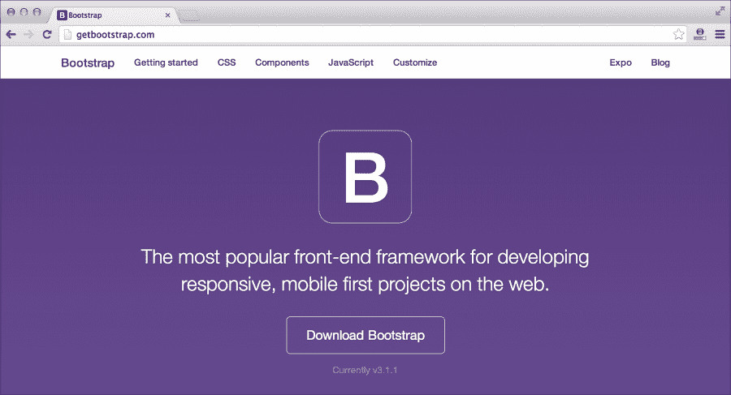
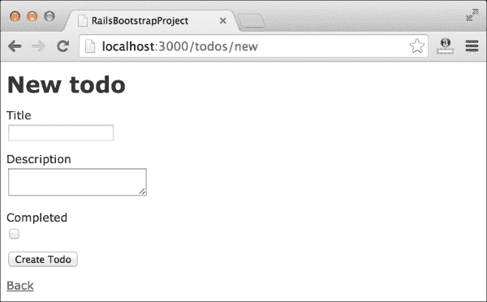
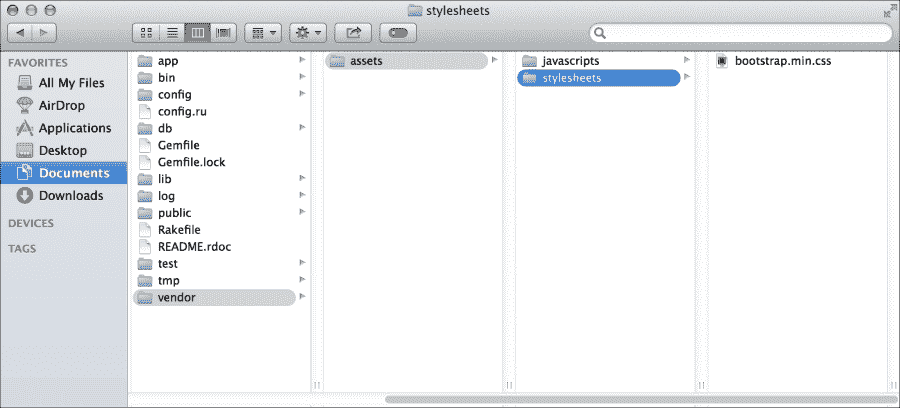
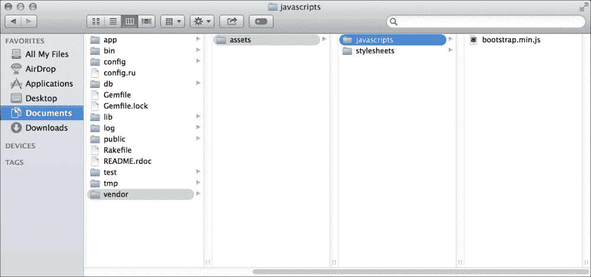
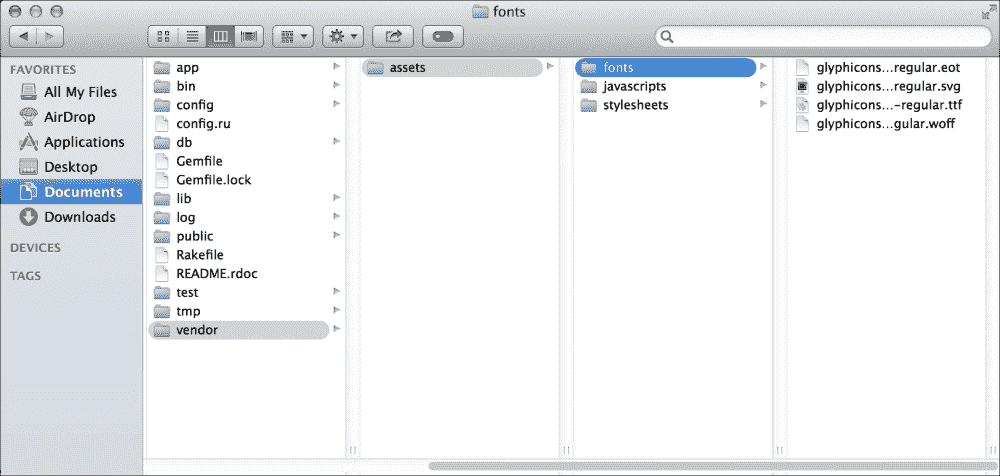
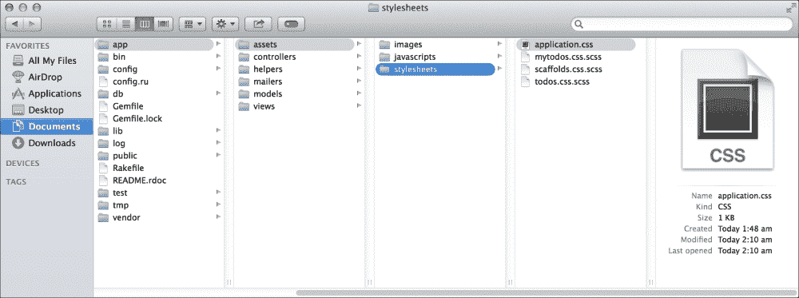
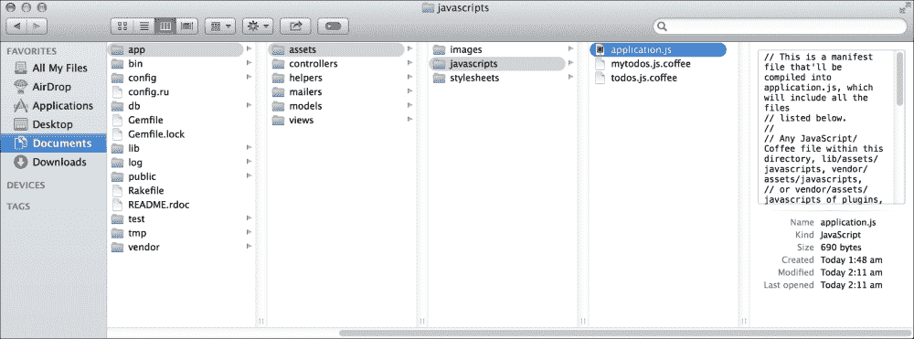
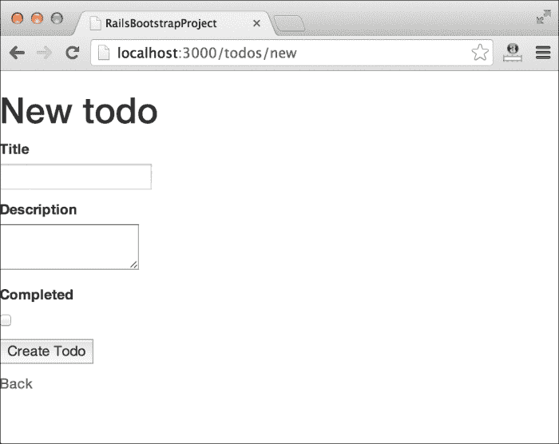

# 第二章：介绍 Bootstrap 3

在上一章中，我们学习了如何创建一个简单的 Rails 项目，以及如何更改其默认的 CSS 样式。如果开发者是新手并且对 CSS 的了解有限，那么这个过程会变得更加困难。Bootstrap 有助于解决这个问题。它为你提供了访问一些流行的、现成的可重用组件的权限，例如时尚的导航栏、图片容器、弹出框等。你所要做的就是复制并自定义你想要使用的组件的标记。

在本章中，你将了解 Bootstrap 是什么，以及它对 Rails 开发者的重要性。我们将看到如何在我们的 Rails 项目中下载和使用 Bootstrap。我们将在本章中再次创建相同的 Todo 应用程序，并为其应用 Bootstrap 样式。

在本章中，我们将涵盖：

+   什么是 Bootstrap？

+   在 Rails 项目中安装 Bootstrap

# 什么是 Bootstrap？

Bootstrap 是一个完整的前端框架，它帮助开发者在不需担心前端开发的情况下开发 Web 应用程序。如果你是一名开发者，你的主要目标是展示你应用程序的强大功能，而不需要在 CSS 设计上投入任何努力，那么 Bootstrap 就是为你准备的。它允许开发者从一系列由 Bootstrap 开发和设计的流行可重用 HTML 组件中选择。



让我们设想一个场景。托马斯是一名 Rails 开发者。他使用 Rails 创建了一个强大的电子商务购物系统。该系统具有通常从购物网站期望的许多功能。托马斯在确保应用程序的安全性上投入了额外的努力，并使系统准备就绪。然后是托马斯必须最终向风险投资家展示这个应用程序以获得一些资金以启动他的项目的时候。但是等等，托马斯没有做任何使他的应用程序看起来令人满意的事情。他的应用程序只包含基本的 HTML 标记，其中几乎可以忽略不计的 CSS 样式。他的应用程序会产生影响吗？

答案是，绝对不行。尽管托马斯能够创建一个健壮的 Rails 应用程序，但它缺乏展示能力。他缺乏适当的 CSS 知识是他无法为他的项目创造强大影响的主要原因。

对于每一位开发者来说，平衡前端和后端能力始终是非常重要的。如果你无法以令人满意的方式展示你的应用程序，那么它肯定是没有用的。可能会有一些开发者从类似的前车之鉴中吸取教训，正如前一个例子所描述的那样。他们会努力尝试，并使用 CSS 学习网页设计，无论他们是否对这个领域感兴趣。通过这样做，他们忘记了设计是一个与之前所做完全不同的领域。这是 UX/UI 开发者的工作。

Bootstrap 开发者已经编写了许多可以直接插入我们项目的 CSS 定义，以表示它。它也是一个开源项目，许可协议为 MIT。这给了你在任何类型的项目中使用它而不必担心许可问题的自由。为什么我们要重新发明轮子，当有人已经为我们做了这项工作呢？专注于快速应用开发的开发者应该考虑在他们的每个项目中使用 Bootstrap。

Bootstrap 不仅仅是为开发者提供更好的 CSS 组件。它是一个**移动优先**的框架。这意味着你在应用中使用 Bootstrap 编写的任何内容，即使在较小的移动设备上也能兼容。由 Bootstrap 驱动的应用可以从极小的设备如 iPhone 扩展到更大的显示设备如 Retina 显示屏。它帮助你编写一个代码库并在任何地方使用。随着技术的进步，即使是本地的 iOS 和 Android 应用现在也可以使用 HTML、CSS 和 JavaScript 编写。它们被称为**混合应用**，这些应用通过像 PhoneGap 这样的工具移植到本地平台。想象一下，你的 Rails 应用正在各种设备上使用，如手机、智能电视、平板电脑，甚至是桌面屏幕。太棒了！不是吗？

# 在 Rails 项目中安装 Bootstrap

Bootstrap 只是一个 CSS、JavaScript 和字体文件的包。你可能很困惑为什么在这里我们使用“安装 Bootstrap”这个术语。好吧，在 Rails 中使用 Bootstrap 有两种不同的方式。第一种是将 Bootstrap 文件直接复制到 Rails 项目的适当位置。第二种是*Bootstrap Sass 方式*。正是因为第二种方式，我们使用了“安装”这个术语。它也作为一个 gemset 存在，可以在任何 Rails 项目中通过 bundle 安装。我们将在本节中详细探讨这两种方式。

还有第三种方式，使用 CDN 上的 Bootstrap 文件，这是最简单的一种。我们将在最后探讨这一点。

## 在 Rails 项目中放置 Bootstrap 文件

这是使用 Bootstrap 在 Rails 中的第一种方法。许多 Rails 开发者做错了这种方法。正确放置 Bootstrap 文件对于激活 Bootstrap 非常重要。按照以下步骤放置 Bootstrap 文件：

1.  让我们创建一个新的 Rails 项目。这次我们将命名为`Rails_Bootstrap_Project`命令，如下所示：

    ```js
    rails new Rails_Bootstrap_Project

    ```

    如同往常，前面的代码将运行各种其他命令，并需要一些时间来完成。我们不会讨论在这个 Rails 项目中创建的各种文件夹，因为这在上一章中已经介绍过了。

1.  让我们在 Rails 中使用 scaffolding 命令创建一个名为`todos`的新模型，如下所示：

    ```js
    rails g scaffold todos title:string description:text completed:boolean

    ```

1.  让我们也通过使用 migrate 命令在数据库中进行这个更改，如下所示：

    ```js
    rake db:migrate

    ```

1.  你应该会收到一个成功的迁移消息。现在是时候启动服务器并检查 Todo 应用了。

    ```js
    rails s

    ```

现在，你可以访问 `http://localhost:3000/todos` 并点击 **新建 Todo**。应用程序应该可以正常工作，你将得到以下截图：



安装完成后，我们将得到一个名为 `Rails_Bootstrap_Project` 的文件夹，里面包含许多文件。如果你是 Rails 开发者，你肯定会想直接跳进去。让我们暂时保持这个项目原样，并继续从其官方网站下载 Bootstrap。步骤如下：

1.  前往 [`getbootstrap.com`](http://getbootstrap.com) 并点击 **下载 Bootstrap** 按钮。它将带你去另一个页面，有三个不同的选项可供选择。

1.  选择第一个按钮，上面简单地写着 **下载 Bootstrap**。一个压缩包将开始下载。

1.  下载完成后，提取所有文件。你可以在默认的 Bootstrap 包中看到三个不同的文件夹，分别是 `css`、`js` 和 `fonts`。我们需要将这些文件正确地放入我们的 Rails 项目中，以便使 Bootstrap 正常工作。

每个 Bootstrap 包都附带一组标准文件。`css` 文件夹包含四个不同的 CSS 文件。前两个 CSS 文件是：`bootstrap.css` 和 `bootstrap.min.css`。这两个文件完全相同，只是创建方式不同。在这里，`bootstrap.css` 是一个文档版本，而 `bootstrap.min.css` 是一个压缩版本。在压缩版本中，你将找不到任何注释或适当的缩进。压缩版本适用于准备用于生产的项目，因为它的大小更小。

接下来的两个文件，`bootstrap.theme.css` 和 `bootstrap.theme.min.css`，是 Bootstrap 的主题文件。Bootstrap 创建了自己的主题文件来覆盖其默认样式在各个组件上。这些文件完全是可选的。我个人从未使用过它们。这两个主题文件也是完全相同的。第一个是一个文档版本，而第二个是一个压缩版本。

接下来，我们来看看 Bootstrap 包的 `js` 文件夹，我们将找到两个不同的 JavaScript 文件：`bootstrap.js` 和 `bootstrap.min.js`。同样，这两个文件在本质上非常相似。前者是一个文档版本，而后者是一个压缩版本。这是主要的 Bootstrap JavaScript 文件。许多组件，如导航栏，都依赖于这个文件来正常工作。Bootstrap 的 JavaScript 组件依赖于 jQuery。Bootstrap 的包中不包含 jQuery，但我们需要将其包含在我们的应用程序中。通常，所有 Rails 项目都包含 jQuery。因此，我们不需要单独包含它。

Bootstrap 附带了一组图标，可以在我们的 Rails 应用程序中使用。这些图标被称为 **Glyphicons**。与其他图标不同，这些图标是字体。所有图标都存在于 Bootstrap 包的 `fonts` 文件夹中的各种字体文件中。

现在我们已经浏览了 Bootstrap 包中的所有文件，让我们按照以下步骤开始在我们的 Rails 应用中导入它们：

1.  首先移动 CSS 文件。从 CSS 文件夹中复制`bootstrap.min.css`并将其放置在 Rails 应用的`stylesheets`文件夹中，通过导航到`vendor/assets/stylesheets`：

1.  接下来，从`js`文件夹中复制`bootstrap.min.js`并将其粘贴到 Rails 应用的`javascripts`文件夹中，通过导航到`vendor/assets/javascripts`：

1.  复制完整的`fonts`文件夹并将其放置在`vendor`文件夹下的`assets`文件中：

    现在我们已经将所有的 Bootstrap 文件放在了`vendors/assets`文件夹中。现在是时候从默认的 Rails CSS 和 JavaScript 文件中链接它们了。

1.  通过导航到`app/assets/stylesheets`打开`stylesheets`文件夹中的`application.css`文件：

1.  将以下行应用到`.css`文件的应用中：

    ```js
    *= require bootstrap.min

    ```

    这将包括`vendor/assets/stylesheets`目录中的`bootstrap.min.css`。Bootstrap 在`bootstrap.min.css`中编写了一些 CSS 属性，提供了字体文件的路径。这个路径在这里不起作用。我们需要在`application.css`文件中覆盖它。

1.  将以下行粘贴到`application.css`中：

    ```js
    @font-face {
      font-family: 'Glyphicons Halflings';
      src: url('../assets/glyphicons-halflings-regular.eot');
      src: url('../assets/glyphicons-halflings-regular.eot?#iefix') format('embedded-opentype'),
      url('../assets/glyphicons-halflings-regular.woff') format('woff'),
      url('../assets/glyphicons-halflings-regular.ttf') format('truetype'),
      url('../assets/glyphicons-halflings-regular.svg#glyphicons_halflingsregular') format('svg');

    }
    ```

1.  我们已经完成了 Bootstrap 的 CSS 文件的链接。接下来，我们需要链接 Bootstrap 的 JavaScript 文件。

    打开`app/assets/javascripts`目录中的`application.js`文件：

    

1.  将以下行应用到`.js`文件的应用中：

    ```js
    //= require bootstrap.min

    ```

    这将通过导航到`vendor/assets/javascripts`链接`javascripts`文件夹中的`bootstrap.min.js`文件。

1.  现在完成了！是的，我们已经成功地将 Bootstrap 应用到了我们的 Rails 应用中。重新启动服务器并打开我们创建的 Todo 应用。你将看到应用外观的一些细微变化：

新的截图有一个更粗体和清晰的字体。Bootstrap 使用浏览器重置，它清除所有默认的浏览器样式。因此，元素和浏览器窗口之间没有间隙。这有助于正确定义 CSS，并确保你的设计在各种浏览器中看起来都一样。

这就是将 Bootstrap 的静态文件直接注入到 Rails 项目中的全部内容。让我们看看其他一些方法。

## Bootstrap – Sass 方式

Bootstrap 也支持 Sass。它作为一个 gemfile，可以直接安装到 Rails 应用中。我们首先将 Bootstrap 作为一个 gem 安装，然后尝试理解为什么这样做更好：

1.  让我们创建另一个名为`Rails_Bootstrap_Sass_Project`的项目：

    ```js
    rails new Rails_Bootstrap_Sass_Project

    ```

1.  安装完成后，打开位于应用程序文件夹家目录中的 `Gemfile`。

1.  你可以在文件中看到许多 gem 依赖项。我们需要添加另一个 gem 依赖项，即 `bootstrap-sass`。也在这个文件中添加以下行：

    ```js
    gem 'bootstrap-sass', '~> 3.1.1'

    ```

    上述命令将安装 Bootstrap 3.1.1，这是撰写本书时的最新版本。你也可以指定其他版本，根据可用性。

1.  是时候再次安装这个项目的 gem 了。打开终端，导航到 `Rails_Bootstrap_Sass_Project` 文件夹。然后，输入以下命令：

    ```js
    bundle install

    ```

1.  这将获取 `gem bootstrap-sass` 并将其包含到项目中。让我们使用脚手架命令创建一个名为 `todos` 的模型，如下所示：

    ```js
    rails g scaffold todos title:string description:text completed:boolean

    ```

1.  还需要使用 rake 命令完成数据库迁移，如下所示：

    ```js
    rake db:migrate

    ```

1.  迁移完成后，我们将从 Rails 的默认 `css` 和 `javascript` 文件链接 Bootstrap 的 `css` 和 `js` 文件。

    通过导航到 `app/assets/stylesheets` 文件夹打开位于 `stylesheets` 文件夹中的 `todos.css.scss` 文件。将以下行放置在其中：

    ```js
    @import "bootstrap";
    ```

1.  接下来，通过导航到 `app/assets/javascripts` 文件夹打开 `javascripts` 文件夹中的 `application.js` 文件。在文件中插入以下行：

    ```js
    //= require bootstrap
    ```

完成了！简单，不是吗？

如果你运行这个项目，你可以看到 Bootstrap 的字体和重置已经应用到默认应用中。

## 通过 CDN 使用 Bootstrap

**内容分发网络**（**CDN**）是一种在云端托管流行库的方式，允许开发者在需要时直接访问这些文件。一些流行的 CDN 服务提供商包括 Google Hosted Libraries ([`developers.google.com/speed/libraries/devguide`](https://developers.google.com/speed/libraries/devguide))、cdnjs ([`cdnjs.com/`](http://cdnjs.com/))、CloudFlare ([`www.cloudflare.com/`](http://www.cloudflare.com/)) 以及其他一些。

Bootstrap 还提供了 CDN 支持。他们已经在自己的云服务器上托管了 CSS 和 JavaScript 文件。让我们尝试使用以下步骤在 Rails 项目中使用 CDN：

1.  创建一个名为 `Rails_Bootstrap_CDN_project` 的新 Rails 项目：

    ```js
    rails new Rails_Bootstrap_CDN_project

    ```

1.  项目创建完成后，使用脚手架创建一个名为 todos 的新模型：

    ```js
    rails g scaffold todos title:string description:text completed:boolean

    ```

1.  使用以下命令进行数据库迁移：

    ```js
    rails db:migrate

    ```

1.  一旦所有上述步骤都成功完成，前往新创建的文件夹 `Rails_Bootstrap_CDN_project`。进入 `app/assets/stylesheets` 并打开 `application.css` 文件。

1.  我们需要从 CDN 导入 Bootstrap 的 CSS 文件到这个文件中。因此，将以下行粘贴到其中：

    ```js
    @import "//netdna.bootstrapcdn.com/bootstrap/3.1.1/css/bootstrap.min.css"
    ```

1.  接下来，我们需要将 Bootstrap 的 JavaScript 文件从其 CDN 包含到我们的主视图中。前往 `app/views/layouts` 并打开 `application.html.erb` 文件。将以下行粘贴到 `</head>` 标签上方或 body 标签上方的 body 内部。

    ```js
     <script src="img/bootstrap.min.js">
    </script>
    ```

完成了！你已经成功将所有 Bootstrap 文件导入到你的 Rails 包中。继续前进，运行服务器并检查应用程序。它应该应用了 Bootstrap 的样式。

# 摘要

在所有将 Bootstrap 引入/安装到 Rails 项目的方法中，我肯定会建议你选择 Sass 方式。熟悉 Sass 的开发者绝对应该选择这种方式。

Sass 允许开发者完全自定义 Bootstrap 的默认样式和行为。随着我们继续阅读本书，我们将看到如何通过 Sass 来自定义 Bootstrap。Sass 为 CSS 世界带来了模块化。它在其中引入了编程能力。你可以使用变量、函数、继承等功能，通过 Sass 实现。

CDN 是另一种更好的选择，但风险很大。CDN 通常在许多安全网络中被屏蔽。在这种情况下，你的应用程序将加载而不包含任何 Bootstrap 文件。CDN 还通过向不同网络发送额外的请求来降低 Web 应用的性能。希望你已经通过本章对 Bootstrap 有了一个公平的了解。它是一个极其有用的框架，通过其 HTML 和 CSS 组件的使用，强制快速开发。在接下来的章节中，我们将看到如何在 Rails 应用程序中使用一些流行的 Bootstrap 组件。我们将看到使用 Bootstrap 创建高度响应式的 Rails 应用程序是多么容易。
