# 第四章：在 Rails 应用程序中使用 Bootstrap 的排版、按钮和图片

设置网站的文本、图像和链接是任何网页设计的重要组成部分。在前一章中，我们看到了如何使用 Bootstrap 的网格系统定义网站的适当布局。在本章中，我们将更多地关注设置网站的内容样式，如文本、链接和图像。

Bootstrap 为各种 HTML 元素提供了许多默认样式。例如，它为锚点标签、标题标签、有序和无序列表等提供了默认样式。这些样式是通过 Bootstrap 定义的特定类来应用的。

Bootstrap 专注于快速网页开发。因此，当对网页设计知之甚少的开发者开始使用 Bootstrap 时，它不会让他们失望。Bootstrap 的这些较小的默认样式将帮助您摆脱许多 HTML 元素的浏览器默认样式。

在本章中，我们将涵盖以下主题：

+   设置样式

+   创建 Bootstrap 按钮

+   在 Bootstrap 中设置图像样式

# 设置

在本章中，我们将使用与第三章中创建的相同静态网站设置，`Responsive_website_static`，*使用 Bootstrap 的网格系统为 Rails 应用程序提供动力*。复制文件夹`Responsive_website_static`并将其重命名为`Bootstrap_default_styles`。打开`index.html`文件，从`<body>`标签中删除所有内容，除了 Bootstrap 的 JavaScript。将页面的标题更改为`Bootstrap 默认样式`。您的`index.html`文件现在应具有以下内容：

```js
<!DOCTYPE html>
  <html lang="en">
    <head>
      <meta charset="utf-8">
      <meta http-equiv="X-UA-Compatible" content="IE=edge">
      <meta name="viewport" content="width=device-width, initial-scale=1">
      <title>Bootstrap default styles</title>
      <!-- Bootstrap -->
      <link rel="stylesheet" href="http://maxcdn.bootstrapcdn.com/bootstrap/3.2.0/css/bootstrap.min.css">
    </head>
  <body>
    <!-- jQuery (necessary for Bootstrap's JavaScript plugins) -->
    <script src="img/jquery.min.js"></script>
    <!-- Include all compiled plugins (below), or include individual files as needed -->
    <script src="img/bootstrap.min.js"></script>
  </body>
</html>
```

如您在第三章，*使用 Bootstrap 的网格系统为 Rails 应用程序提供动力*中学习的那样，您应该在`body`标签内放置一个`div`容器来包裹所有网站内容并将它们正确地放置在屏幕中央。因此，让我们使用以下标记创建一个容器：

```js
<div class="container">
</div>
```

# 设置样式

当我们谈论排版时，我们指的是标题标签、段落标签、内联文本元素、适当的对齐、文本转换以及网页上的任何文本。

Bootstrap 为从`<h1>`到`<h6>`的所有标题标签提供了默认样式。如果您想在 HTML 页面中创建一个标题标签，可以直接放置标题标签而不需要任何类。让我们看看一个例子。将以下 HTML 元素插入之前创建的静态网站中：

```js
<div class="container">
  <h1>Let's save the Earth.</h1>
  <h2>Let's save the Earth.</h2>
  <h3>Let's save the Earth.</h3>
  <h4>Let's save the Earth.</h4>
  <h5>Let's save the Earth.</h5>
  <h6>Let's save the Earth.</h6>
</div>
```

上述代码在浏览器中的输出将如下所示：

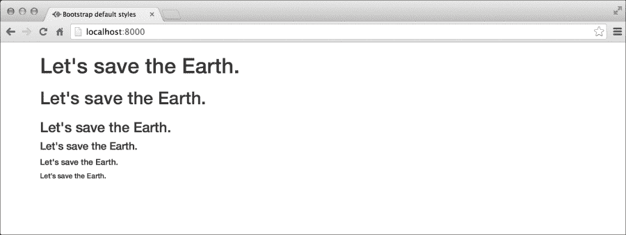

可能存在一些情况，你不需要使用标题标签，但可以使用其他 HTML 元素达到相同的默认样式。Bootstrap 将帮助你做到这一点。你可以使用类`".h1"`到`".h6"`来获取所需的排版样式。让我们删除前面示例中的所有标题标签，并使用段落标签代替。这次，我们将使用 Bootstrap 的标题类来获取相同的样式：

```js
<div class="container">
  <p class="h1">Let's save the Earth.</p>
  <p class="h2">Let's save the Earth.</p>
  <p class="h3">Let's save the Earth.</p>
  <p class="h4">Let's save the Earth.</p>
  <p class="h5">Let's save the Earth.</p>
  <p class="h6">Let's save the Earth.</p>
</div>
```

在浏览器中，前面的标记将看起来像这样：


是时候给标题标签添加副标题了。副标题在你想为你的网站显示简短标语时非常有用。在 Bootstrap 中，我们将使用 HTML 标签`"<small>`"来添加任何所选标题标签内的副标题。小标签是一个内联标签，在原始 HTML 中用于相同的目的。以下代码为例：

```js
<div class="container">
<h1>Save Earth <small>A PACKT Publishing Initiative.</small></h1>
</div>
```

输出将如下所示：

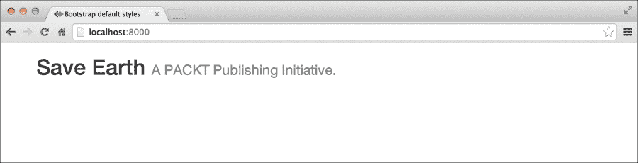

你可以看到小标签相对于标题标签内容显得更小，尽管它们位于相同的标签中。

让我们讨论如何对段落标签进行样式设计。Bootstrap 将默认的 14px 大小应用到所有段落标签。你不需要使用任何类来将 Bootstrap 的样式应用到段落标签。让我们看看一个示例。我在前面的标记中插入了两段虚拟段落。让我们应用以下代码：

```js
<p>
  Lorem ipsum dolor sit amet, consectetur adipiscing elit. In fringilla dictum libero, vel placerat lorem elementum tristique.
</p>
<p>
  Pellentesque laoreet ipsum libero, eu commodo ligula semperin. Fusce vitae feugiat lorem. Morbi tempor, nunc in auctor blandit, nibh purus scelerisque sem,…..
</p>
```

在浏览器中的输出将如下所示：

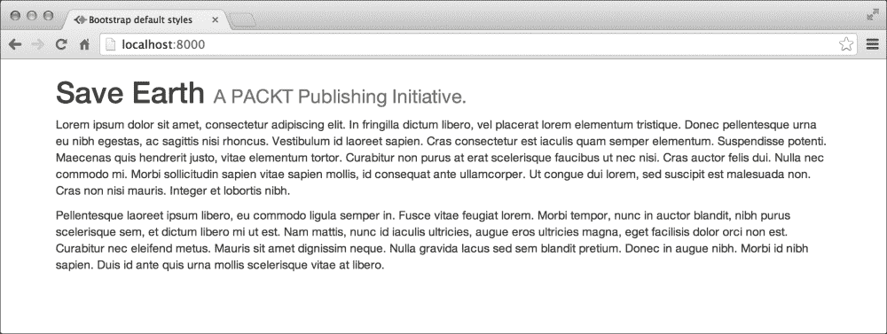

你甚至可以通过使用`.lead`类来调整段落标签，使其在网页中其他段落标签中脱颖而出。让我们将这个类添加到前面标记中的第一个段落，并查看它产生的差异：

```js
<p class="lead">
  Lorem ipsum dolor sit amet, consectetur adipiscing elit. In fringilla dictum libero, vel placerat lorem elementum tristique.
</p>
```

输出将如下所示：

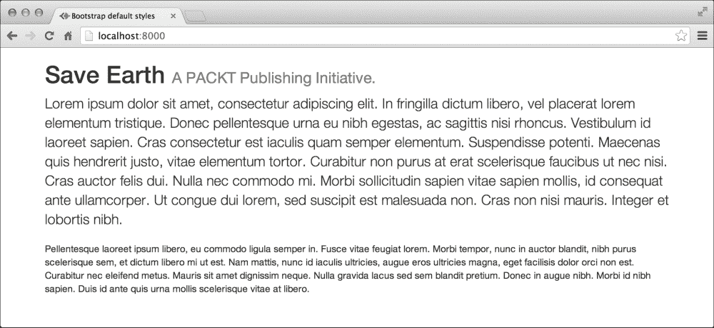

Bootstrap 甚至允许你使用`<mark>`标签在段落中突出显示文本。我在段落中添加了`<mark>`标签，它在前面的标记中被突出显示，并得到了以下结果：

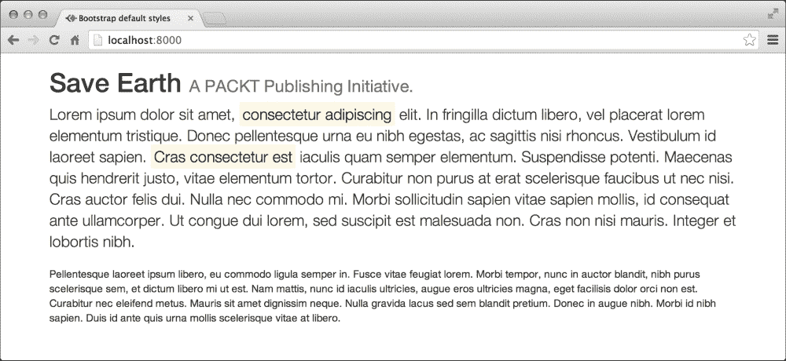

其他排版功能如下：

+   你可以通过在 HTML `<del>`或`<s>`标签周围包裹文本来添加删除线。

+   使用 HTML `<ins>`和`<u>`标签包裹文本以加下划线

+   你还可以在段落标签内使用 HTML `<small>`标签来显示相对于段落周围文本的较小文本。

+   你可以使用 HTML `<b>`和`<strong>`标签将文本加粗

+   使用 HTML `<em>`和`<i>`标签使文本斜体

## 对齐文本

Bootstrap 提供了用于文本内容对齐的辅助类。这些类包括：

+   `text-left`

+   `text-right`

+   `text-center`

+   `text-justify`

+   `text-nowrap`

让我们将`text-right`应用到前面的段落文本中，并查看它如何重新对齐文本：

```js
<p class="lead text-right">
  Lorem ipsum dolor sit amet, consectetur adipiscing elit. In fringilla dictum libero, vel placerat lorem elementum tristique.
</p>
```

输出将如下所示：

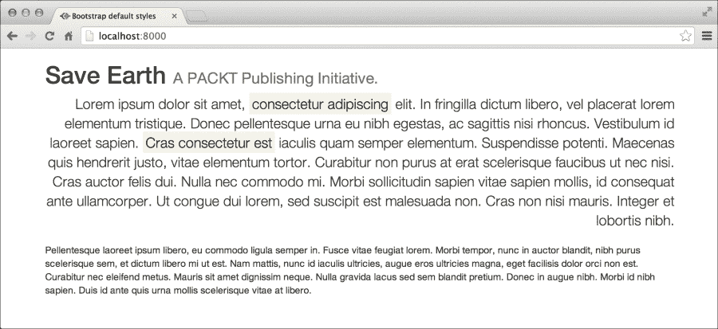

你可以看到文本现在相对于容器的位置已对齐到右侧。

`text-nowrap` 类移除了自动换行，并使段落显示为单行，如下面的截图所示：

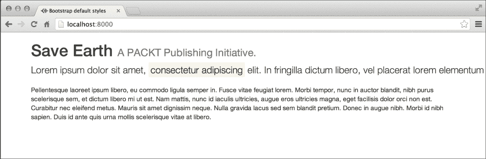

尝试使用其他对齐类，并在浏览器中查看变化。

## 文本转换

将文本转换为大写、小写或首字母大写在某些网络应用中有时是非常必要的操作。Bootstrap 提供了执行这些转换的类：

+   `text-lowercase`

+   `text-uppercase`

+   `text-capitalize`

通过 CSS 或使用 Bootstrap 的类进行文本转换在设计网站时绝对不推荐。爬虫和搜索引擎在文本实际上写入网页时解析文本。CSS 只是在浏览器中改变其显示方式。

## 引用块

引用块是 Bootstrap 非常重要的组件。它们用于引用一些重要信息或流行格言。让我们看看如何在 Bootstrap 中创建引用块。

将以下标记放置在我们静态网站容器的内部。

```js
<blockquote>
  <p>Lorem ipsum dolor sit amet, consectetur adipiscing elit. Integer posuere erat a ante.</p>
</blockquote>
```

它将在浏览器中产生以下输出：

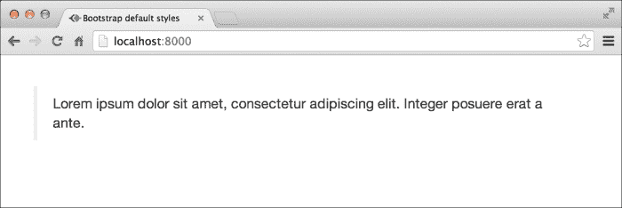

您可以看到在 `blockquote` 的左侧放置了一个垂直条。Bootstrap 中的引用块提供了许多自定义选项。例如，将 `<footer>` 元素放置在 `blockquote` 代码内部将如下所示：

```js
<blockquote>
  <p>Lorem ipsum dolor sit amet, consectetur adipiscing elit. Integer posuere erat a ante.</p>
  <footer>by Syed Fazle Rahman</footer>
</blockquote>
```

上述代码的输出将如下所示：


您还可以通过应用类 `blockquote-reverse` 来改变引用块的排列。它会使引用块看起来如下所示：

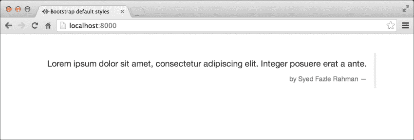

## 样式化列表元素

列表元素，即 `<ol>` 有序列表元素和 `<ul>` 无序列表元素，在网页中扮演着非常重要的角色。它们用于创建项目列表，例如创建菜单、列出特性等。Bootstrap 为这些元素提供了一些默认样式。它重置了浏览器的默认样式，并添加了最小样式。让我们样式化列表元素：

```js
<ul>
<li>Call Mommy</li>
<li>Go out for dinner tonight</li>
<li>Call Girlfriend(s) ;-)</li>
<li>Attend tomorrow's lecture</li>
</ul>
```

输出将如下所示：

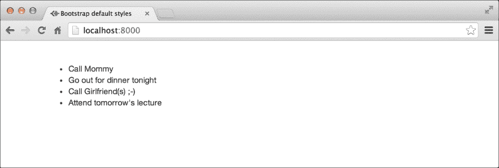

现在，让我们看看有序列表：

```js
<ol>
  <li>Call Mommy</li>
  <li>Go out for dinner tonight</li>
  <li>Call Girlfriend(s) ;-)</li>
  <li>Attend tomorrow's lecture</li>
</ol>
```

上述代码的输出将如下所示：

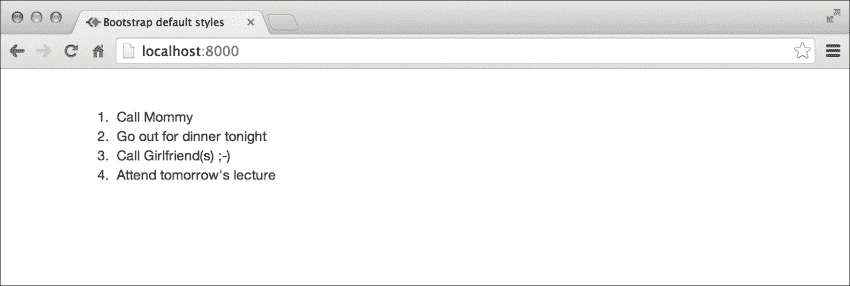

让我们通过 Bootstrap 添加一些辅助类来修改列表的外观。将类 `list-inline` 添加到前面的任何列表中，将使列表项显示为内联，即并排，如下面的截图所示：


将类 `list-unstyled` 添加到任何列表元素中，将移除列表项中的项目符号或数字。这些在下面的截图中显示：

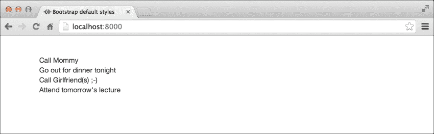

让我们进行一些实验，并嵌套无序列表以检查 Bootstrap 是否仍然支持我们：

```js
<ul>
  <li>Call Mommy</li>
  <li>Go out for dinner tonight</li>
  <li>
    Call Girlfriend(s) ;-)
    <ul>
    <li>Julie</li>
    <li>Marry</li>
    <li>Monalisa</li>
    <li>Others :-D</li>
    </ul>
  </li>
  <li>Attend tomorrow's lecture</li>
</ul>
```

上述代码的输出将如下所示：

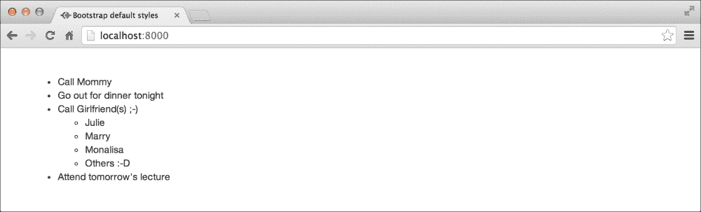

噢，是的！Bootstrap 支持嵌套列表。尝试用另一个列表和一组辅助类进行实验。要更改项目符号的样式，您需要编写自己的样式。以下代码作为示例：

```js
ul{
list-style-type: circle;
}
```

# 创建和样式化按钮

在前一章中，我们看到了 Bootstrap 中创建按钮的概览。任何锚点标签`<a>`或`<button>`标签都可以使用 Bootstrap 使其看起来像花哨的按钮。要创建按钮，您需要使用`.btn`类与许多其他辅助按钮类结合使用。Bootstrap 中有两种不同类型的按钮类：用于不同大小和用于不同颜色。

不同颜色的按钮类如下：

+   `btn-primary`：这个按钮类用于创建深蓝色的按钮

+   `btn-info`：这个类用于创建浅蓝色的按钮

+   `btn-success`：这个按钮类用于创建绿色的按钮

+   `btn-warning`：这个类用于创建浅黄色的按钮

+   `btn-danger`：这个类用于创建红色的按钮

+   `btn-default`：这个类用于创建白色的按钮

+   `btn-link`：这个类用于使按钮看起来像链接，同时保留按钮的行为

让我们看看按钮的实际效果。以下是创建单个按钮的标记：

```js
<a href="http://www.packtpub.com/" class="btn btn-success">
  PACKT Pub
</a>
```

以下屏幕截图显示了所有按钮的状态：

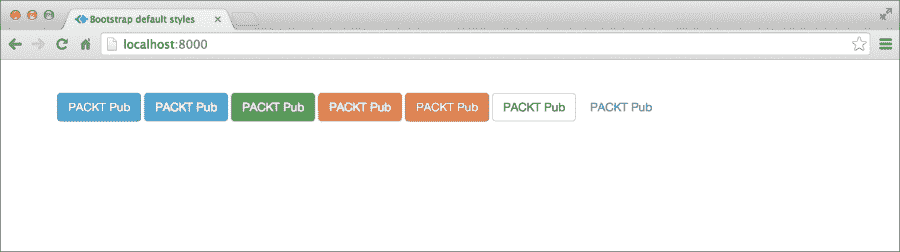

Bootstrap 也有用于创建各种大小按钮的类。这些类必须与`btn`和颜色类结合使用。各种大小的类如下：

+   `btn-lg`：这个类用于创建大按钮

+   `btn-sm`：这个类用于创建小按钮

+   `btn-xs`：这个类用于创建极小的按钮

+   `无类`：这个类用于创建默认大小的按钮

以下示例展示了如何使用这些类：

```js
<a href="http://www.packtpub.com/" class="btn btn-primary btn-lg">
  PACKT Pub
</a>
```

下面是一个显示所有按钮大小的屏幕截图：

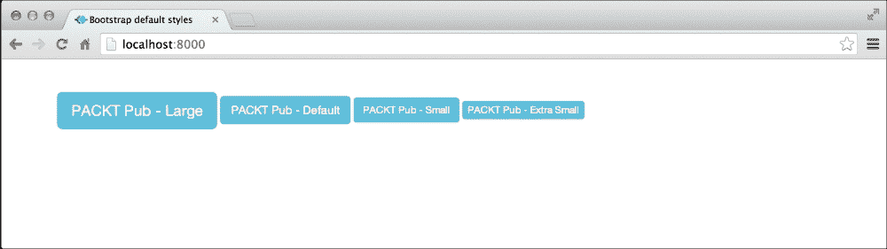

Bootstrap 按钮还带有各种状态，如活动、禁用等。Bootstrap 按钮的属性如下：

+   `active`状态：当您点击 Bootstrap 按钮时，这个状态会自动添加到按钮上。如果您想让按钮始终看起来像活动按钮，那么请给它添加`active`类：

    ```js
    <a href="http://www.packtpub.com/" class="btn btn-info btn-lg active">
      PACKT Pub – Active
    </a>
    ```

    在这个屏幕截图中可以看到按钮的`active`状态：

    

    如前一个放大图像所示，活动按钮会得到一个内嵌阴影效果。

+   `disabled`状态：要使按钮禁用，只需给它添加一个`disabled`属性：

    ```js
    <a href="http://www.packtpub.com/" class="btn btn-info btn-lg" disabled>
      PACKT Pub – Disabled
    </a>
    ```

    

禁用按钮不可点击。

如果是`<button>`标签，您需要为`disabled`属性提供一个禁用值：

```js
<button type="button" class="btn btn-lg btn-primary" disabled="disabled">
  PACKT Pub – Disabled
</button>
```

## 哪些元素可以使用 Bootstrap 的按钮类？

这是需要记住的最重要的几点之一。你不能将按钮类应用于任何 HTML 元素。只有四种不同类型的元素可以用作 Bootstrap 的按钮：

+   HTML 锚点标签：`<a>`

+   HTML 按钮标签：`<button>`

+   HTML 带按钮类型的输入标签：`<input type="button" />`

+   HTML 带提交类型的输入标签：`<input type="submit" />`

# Bootstrap 中的图像样式

图像对任何网络应用都是至关重要的。正确显示它们非常重要。Bootstrap 提供了许多不同的类，可以帮助你在你的网络应用中适当地显示图像。

当我们谈论响应式图像时，我们指的是一个图像，无论其自身大小如何，都能适应其容器的大小。在 Bootstrap 中创建响应式图像只是单个类的问题。这个特性在创建用户门户时特别有用，因为你不知道他们将要上传的图像大小。因此，在这种情况下添加 Bootstrap 的响应式类将非常有帮助。你还应该记住，Bootstrap 不会改变实际图像的大小。它只会使用 CSS 属性来调整大小。

用于创建响应式图像的类是 `img-responsive`。让我们使用 Bootstrap 的网格系统创建一个网格，然后添加一个响应式图像来查看它如何适应网格的大小。添加响应式图像的步骤如下：

```js
<div class="container">
  <div class="row">
    <div class="col-xs-4" style="background: grey">
      
    </div>
  </div>
</div>
```

上述代码的输出将如下所示：

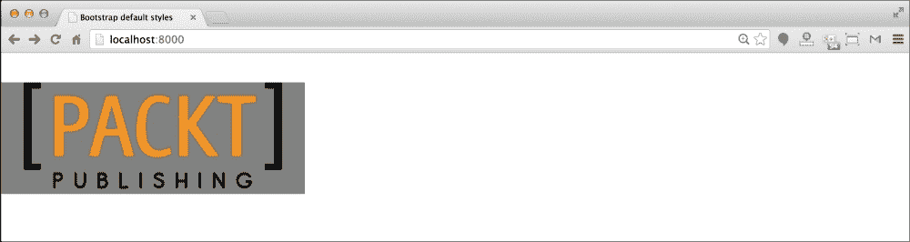

我使用了背景颜色来显示网格的范围。你可以看到图像适应了网格。

Bootstrap 还提供了一些用于即时装饰图像的辅助类。Bootstrap 的辅助类包括：

+   `img-rounded`：这会创建一个方形图像，但边缘略微圆滑。

+   `img-circle`：这会产生一个圆形图像。

+   `img-thumbnail`：这会给图像添加一个可点击的效果。这也在图像上添加了悬停效果。

以下截图显示了所有前面的类，分别如下：

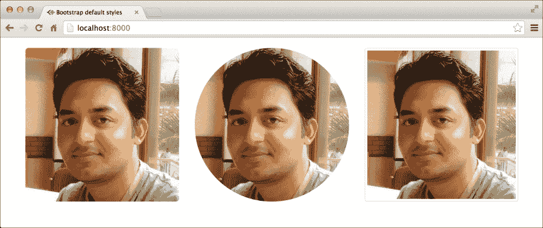

在我们的 `Online Packt 购物` 应用程序中，我们使用了响应式图像类来在主页上显示产品列表。

# 摘要

希望你喜欢使用 Bootstrap 的各种样式类。你可以访问 Bootstrap 的在线文档（[http://getbootstrap.com/css/](http://getbootstrap.com/css/））了解更多的 CSS 类。在接下来的章节中，我们将非常频繁地使用这些 Bootstrap 类，我们将专注于完成我们的购物应用。
