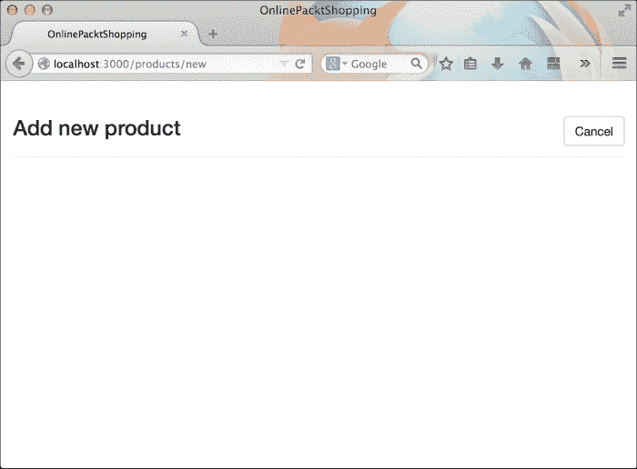

# 第五章 在 Bootstrap 中重新设计表格和表单

表格和表单是 HTML 的古老功能。自从互联网诞生以来，它们一直在互联网上扮演着关键角色。通过 Bootstrap 和 Rails，我们将重新发明一种全新的方式来创建我们的 Web 应用程序中的表单和表格。

在本章中，我们将查看 Bootstrap 表格和表单的各种功能。在 Rails 应用程序中验证表单时，我们将使用 Bootstrap 的验证类。最后，我们将使用 Bootstrap 的表格来填充存储的数据。

我们将继续开发上一章中半设计的相同演示应用程序。现在，我们将看到如何通过使用 Bootstrap 的表格来修改单个产品页面。上一章中还有一些未设置样式的页面：`新产品`表单页面和`编辑产品`表单页面。我们也将使用 Bootstrap 表单来修改这些页面。

然而，在我们跳入应用程序之前，我们需要了解 Bootstrap 的表格和表单是如何创建的。因此，我们将像往常一样先创建一些虚拟产品，然后将其集成到我们的实际应用程序中。

# 创建 Bootstrap 表格

Bootstrap 表格是普通的 HTML 表格，附带 Bootstrap 提供的一些特殊类。这些类包含各种不同的 CSS 样式，可以应用于 HTML 表格。因此，Bootstrap 为你提供了多个类来创建不同类型的表格，以满足你的需求。

因此，让我们首先创建一个基本的 HTML 表格。为此，创建一个名为`Bootstrap Tables`的虚拟项目，并创建一个`index.html`文件。将以下 Bootstrap 推荐的 HTML 标记复制到该文件中：

```js
<!DOCTYPE html>
<html lang="en">
  <head>
    <meta charset="utf-8">
    <meta http-equiv="X-UA-Compatible" content="IE=edge">
    <meta name="viewport" content="width=device-width, initial-scale=1">
    <title>Bootstrap Tables</title>
    <!-- Bootstrap -->
    <link rel="stylesheet" href="http://maxcdn.bootstrapcdn.com/bootstrap/3.2.0/css/bootstrap.min.css">
  </head>
  <body>
    <!-- jQuery (necessary for Bootstrap's JavaScript plugins) -->
    <script src="img/jquery.min.js"></script>
    <!-- Include all compiled plugins (below), or include individual files as needed -->
    <script src="img/bootstrap.min.js"></script>
  </body>
</html>
```

此文件已从 CDN 包含所有必要的 Bootstrap 文件。让我们继续使用 Bootstrap 容器并在文件中插入代码：

```js
<div class="container">
</div>
```

让我们在容器内创建一个 HTML 表格：

```js
<div class="container">
  <table>
    <tr>
      <th>Item Name</th>
      <th>Price ($)</th>
    </tr>
    <tr>
      <td>Item 1</td>
      <td>$114</td>
    </tr>
    <tr>
      <td>Item 2</td>
      <td>$234</td>
    </tr>
  </table>
</div>
```

如果你预览浏览器中的前一个标记，你会看到一个*不那么出色*的带有两列的表格，以下是截图：


是时候看看 Bootstrap 的魔法了。只需将`table`类添加到截图中的前一个表格中，你就会发现一个排列整齐且不错的表格：

```js
<div class="container">
  <table class="table">
  </table>
</div>
```

在插入上述代码后，你会得到以下类似的截图：


这太棒了，不是吗？

让我们继续探索。现在，将`.table-striped`类添加到截图中的前一个表格中。同时保留表格标记中的`.table`类。在这里，`.table-striped`是一个辅助类，用于为表格添加额外的交替条纹样式：

```js
<div class="container">
  <table class="table table-striped">
  </table>
</div>
```

你应该得到以下类似的截图：


还有更多。要得到一个带边框的表格，这次将`.table-bordered`类添加到`table`类中：

```js
<div class="container">
  <table class="table table-bordered">
  </table>
</div>
```

输出结果如下：


一些其他辅助类包括：

+   `.table-hover`：将此类添加到表格中，当鼠标悬停在其上时，会突出显示一行。

+   `.table-condensed`：当你想要减少每个单元格的间距时添加此类。

你不应该将自己限制在将之前的类组合在一起的单个表格中。我将这个实验留给你。

Bootstrap 有五种不同的上下文类。这些类被添加到特定的行中，以特定的颜色突出显示。Bootstrap 中的五个上下文类是：

+   `active`：这是为了添加浅灰色背景颜色

+   `success`：这是为了添加浅绿色背景颜色

+   `danger`：这是为了添加红棕色背景颜色

+   `info`：这是为了添加浅蓝色背景颜色

+   `warning`：这是为了添加浅黄色背景颜色

以下截图显示了所有之前的上下文类在作用：


之前提到的上下文类也可以应用于特定的单元格。例如：

```js
<tr>
  <td class="warning">Warning text here</td>
</tr>
```

这只会突出显示该单元格，而不是整行。

让我们谈谈 Bootstrap 表格的响应性。默认情况下，Bootstrap 表格具有响应性。它们根据浏览器窗口的大小改变整体宽度和列宽。可能会有时候你在你的表格中有数百列，你需要在一个移动屏幕上查看它。想象一下 100 列将表格宽度分成 100 个相等的部分。太乱了，不是吗？

好吧，这里是 Bootstrap 来帮忙！Bootstrap 提供了一个名为 `.table-responsive` 的类，当空间不足时，它会为表格添加一个水平滚动条。这也使得表格在移动屏幕上对基于触摸的滚动做出响应。

请注意，你不应该使用这些表格来构建网页结构。基于表格的布局已经过时，并且通常被认为从 SEO 角度来看是糟糕的。你应该只使用表格来显示表格数据。

# 创建 Bootstrap 表单

在 Bootstrap 中创建表单就像创建表格一样简单，正如我们在上一节中看到的。你所需要的是一些 HTML 标记和适当的 Bootstrap 表单类。在本节中，我们将再次创建一个名为 `Bootstrap Forms` 的虚拟项目，并添加一个 `index.html` 文件。还要在这个文件中填充之前章节中显示的基本 Bootstrap 推荐的 HTML，不要忘记在其中添加 Bootstrap 容器。

让我们在先前的容器中添加一个简单的 `<form>` 标签：

```js
<div class="container">
  <form>            
  </form>
</div>
```

你不需要将任何类附加到表单标签上。这里的类是添加到表单元素上的。

让我们在表单中添加第一个表单元素。我们将放置一个文本字段和一个相关的标签元素。Bootstrap 允许你创建一个由标签和文本字段组成的表单组，这有助于 Bootstrap 正确地样式化表单元素。表单组是通过一个具有 `.form-group` 类的 `div` 元素创建的。让我们在先前的表单中添加一个表单组：

```js
<div class="container">
  <form>
    <div class="form-group">
      <label for="emailField">Email address</label>
      <input type="text" class="form-control" id="emailField" placeholder="Enter email">
    </div>
  </form>
</div>
```

我们还向文本字段添加了`.form-control`类以应用 Bootstrap 的文本字段样式。您还可以将此类添加到其他基于文本的字段，如 `<textarea>`、`<datetime>`、`<email>` 等。

前面的表单现在应该看起来如下截图所示：


以类似的方式，我们将使用密码字段填充前面的表单：

```js
<div class="form-group">
  <label for="passwordField">Password</label>
  <input type="password" class="form-control" id="passwordField" placeholder="Enter email">
</div>
```

这给我们展示了以下截图中的表单：


是时候向表单添加复选框和单选按钮了。Bootstrap 为复选框和单选按钮提供了一组不同的类，`.form-control`与它们不兼容。这次，我们将使用`checkbox`和`radio`类创建包装器。例如：

```js
<div class="checkbox">
  <label>
    <input type="checkbox"> Remember me
  </label>
</div>
```

这将在您的表单中创建一个正确对齐的复选框。只需将`checkbox`替换为`.radio`并在其中创建一个单选按钮：

```js
<div class="radio">
  <label>
    <input type="radio"> Male
  </label>
</div>
<div class="radio">
  <label>
    <input type="radio"> Female
  </label>
</div>
```

目前，我们将在表单中使用复选框元素，如下所示：


最后，让我们在表单中添加一个`提交`按钮。提交按钮的标记如下：

```js
<button type="submit" class="btn btn-success">Sign in</button>
```

这是一个基本的 Bootstrap 按钮，具有 `btn` 和 `.btn-success` 类。第一个类给它提供了按钮的形状，而第二个类则应用了颜色。

我们最终的 Bootstrap 表单现在将看起来如下截图所示：


您还可以在 Bootstrap 中创建不同类型的表单。例如，如果您想在网站的顶部细导航栏中放置登录表单，那么前面的表单肯定不适合。

Bootstrap 允许您将所有表单元素放置在一行或并排，以便在类似情况下正确适配。要创建内联表单，您只需要一个类，就像往常一样，`.form-inline`。您需要将此类添加到前面的`<form>`标签中。

```js
<form class="form-inline">
  ...
</form>
```

您应该得到以下输出：


我知道您在这里感到惊讶！当添加`.form-inline`类时，Bootstrap 为`.form-group`添加了一行 CSS 代码。以下是 Bootstrap CSS 中的代码快照：

```js
.form-inline .form-group{
  display: inline-block;
}
```

另有一个非常实用的 HTML 表单元素叫做 `<select>`，用于创建下拉菜单。您可以为它添加`.form-control`类以移除默认浏览器样式并应用 Bootstrap 的样式。例如：

```js
<select class="form-control">
  <option>1</option>
  <option>2</option>
  <option>3</option>
  <option>4</option>
  <option>5</option>
</select>
```

要在 Bootstrap 表单中禁用字段，只需将 HTML5 的 disabled 属性添加到任何文本字段。Bootstrap 将应用一个非激活的样式。这适用于`基于文本`的字段、`复选框`、`单选按钮`、`表单按钮`和 `<select>` 元素。

您还可以使用以下尺寸类控制 Bootstrap 中每个文本字段和选择元素的尺寸：

+   `.input-lg`：将`.input-lg`添加到文本字段会使它看起来比默认样式更大

+   `.input-sm`：将`.input-sm`添加到文本字段会使它看起来比默认样式更小

有时候，你可能需要在每个表单字段下方添加一个 `help` 文本。为此，你需要在 `.form-group` 元素内添加一个具有 `.help-block` 类的 `span` 元素。例如：

```js
<div class="form-group">
  <label class="control-label" for="emailField">Email Address</label>
    <input type="text" class="form-control" id="emailField">
    <span class="help-block">Enter a valid email address.</span>
  </span>
</div>
```

# Bootstrap 表单中的验证类

Bootstrap 与 HTML5 的默认表单验证功能配合良好。将一个名为 required 的属性添加到任何表单元素中，将阻止表单提交。Bootstrap 的 JavaScript 没有任何预定义的验证功能。它为你提供可以在运行时应用于表单元素的 CSS 类。这些类对于突出显示哪些表单元素需要用户注意非常重要。

让我们看看 Bootstrap 的一些表单验证类：

+   `.has-error`：此类用于突出显示红色

+   `.has-warning`：此类用于突出显示一种暗淡的黄色

+   `.has-success`：此类用于突出显示绿色

这些类应用于 `.form-group` 元素。例如，将 `.has-error` 类添加到任何 `.form-group` 元素上，将突出显示标签和表单元素为红色：

```js
<div class="form-group has-error">
  <label for="emailField">Email address</label>
  <input type="text" class="form-control" id="emailField" placeholder="Enter email">
</div>
```

你应该得到以下类似的内容：


请注意，Bootstrap 不会自动添加验证类。你必须通过编程方式添加它们以突出显示错误。

你还可以在每个表单元素旁边显示花哨的验证图标。为此，你需要在 `.form-group` 元素上添加一个 `.has-feedback` 类。你还需要添加一个包含 Glyphicon 图标的 `span` 元素。例如：

```js
<div class="form-group has-success has-feedback">
  <label class="control-label" for="textField">Input with success</label>
  <input type="text" class="form-control" id="textField">
  <span class="glyphicon glyphicon-ok form-control-feedback"></span>
</div>
```

上述代码将给出以下输出：


## 将 Bootstrap 表格添加到我们的 Rails 应用程序中

在我们的应用程序 `OnlinePacktShopping` 中，我们有一个 `产品详情` 页面。我们将在这个页面上添加 Bootstrap 的表格并进行重新设计。

启动服务器并查看产品页面，它应该看起来像这样：


我们将使用 Bootstrap 重新设计页面，它应该看起来像这样：


产品页面是通过 `products` 文件夹中存在的 `show.html.erb` 视图显示的。要到达这个文件夹，导航到 `app/views/products/`。打开这个页面并删除其中的全部标记。

首先，我们需要将主页的页面标题样式带到这个屏幕上。因此，在文件中放置以下标记：

```js
<div class="page-header">
  <h3></h3>
</div>
```

在主页上，我们曾经使用 `<h3>` 标签显示 **所有产品**。这次我们将用产品的名称来填充它。产品名称是通过 `@product` 模型使用 `name` 属性传递到这个视图的。因此，`@product.name` 应该给我们提供产品的名称：

```js
<div class="page-header">
  <h3><%= @product.name %></h3>
</div>
```

接下来，我们想在页面标题上放置两个默认操作按钮，**编辑**和**返回**。我们必须将这两个按钮并排放置。因此，我们将在这里使用 Bootstrap 的`list-inline`组件。

```js
<div class="page-header">
  <ul class="list-inline">
    <li><%= link_to 'Edit', edit_product_path(@product), :class=>"btn btn-warning" %></li>
    <li><%= link_to 'Back', products_path, :class=>"btn btn-default" %></li>
  </ul>
  <h3><%= @product.name %></h3>
</div>
```

如您在前面的截图中所见，我使用了`link_to`标签来动态创建链接。路径是通过`edit_product_path()`和`products_path`方法生成的。我还为按钮添加了`.btn`, `.btn-warning`和`.btn-default`类。这将生成一个如下所示的屏幕：


我使用`.btn-warning`只是为了得到橙色按钮。这与任何警告标志无关。

让我们使用 Bootstrap 的辅助类`.pull-right`将那些按钮拉到右侧，添加到`<ul>`标签中：


现在，我们的按钮已经放置好了。让我们创建一个 Bootstrap 表格来显示产品数据。

```js
<table class="table table-bordered">
</table>
```

我在这里使用了一个带边框的表格。让我们继续创建行和列：

```js
<table class="table table-bordered">
  <tr>
    <td>Name</td>
    <td><%= @product.name %></td>
  </tr>
  <tr>
    <td>Image</td>
    <td>/></td>
  </tr>
  <tr>
    <td>Description</td>
    <td><%= @product.description %></td>
  </tr>
  <tr class="success">
    <td>Price</td>
    <td><%= @product.price %></td>
  </tr>
</table>
```

如您在前面的代码中所见，我在每一行中显示了`@product`模型中存在的所有数据。我还使用`.success`类突出了最后一行。前面的标记将给我们一个如下所示的页面：


这很简单！不是吗？

我们仍然需要在从`编辑`页面和`创建`页面传递到产品页面时显示`notice`对象。由于此消息并不总是可见的，我们将使用条件`if`语句在此产品页面中显示它。

在表格上方添加以下标记：

```js
<% if notice %>
  <div class="alert alert-info">
    <p id="notice"><%= notice %></p>
  </div>
<% end %>
```

我在这里使用 Bootstrap 的警报功能，使用`alert`和`.alert-info`类。第一个类用于间距和正确对齐文本，第二个类用于提供适当的背景颜色。我们将在接下来的章节中更详细地讨论警报。前面的标记将如下所示：


最后，我们完成了产品显示页面。我们现在将继续设计`添加产品`和`编辑产品`视图。

## 将 Bootstrap 表单添加到我们的 Rails 应用程序中

在这里，我们必须编辑两个模板文件：`new.html.erb`和`edit.html.erb`。打开并查看它们。您会发现这两个文件具有完全相同的结构。在`edit.html.erb`模板中只有一个额外的**显示产品**按钮。因此，我们只设计一个表单`new.html.erb`，然后在第二个模板中重用它。

首先，删除`new.html.erb`中所有内容。就像我们在所有页面中所做的那样，我们将在本页也创建一个`page-header`。为此，添加以下标记：

```js
<div class="page-header">
  <h3>Add new product</h3>
</div>
```

让我们继续在前面`page-header`中添加一个**取消**按钮：

```js
<div class="page-header">
  <%= link_to 'Cancel', products_path, :class=>"btn btn-default pull-right" %>
  <h3>Add new product</h3>
</div>
```

由于我们只有一个按钮，所以我们在这里不需要使用 Bootstrap 的`list-inline`功能，如下面的截图所示：



是时候创建一个用于创建新产品的表单了。我们将使用 Bootstrap 的网格系统创建一个 8 列的 Bootstrap 容器表单。这个标记的格式如下：

```js
<div class="row">
  <div class="col-xs-8 col-xs-offset-2">
  </div>
</div>
```

我们使用了一个偏移类来使整个容器居中对齐。接下来，我们将添加标签以在先前的容器中渲染表单：

```js
<div class="row">
  <div class="col-xs-8 col-xs-offset-2">
    <%= render 'form' %>
  </div>
</div>
```

上述代码将从`_form.html.erb`模板中获取旧的未样式表单。因此，让我们为这个模板中现有的表单添加样式。以下是修改后的标记：

```js
<%= form_for(@product) do |f| %>
  <% if @product.errors.any? %>
  <div id="error_explanation">
    <h2><%= pluralize(@product.errors.count, "error") %> prohibited this product from being saved:</h2>
    <ul>
  <% @product.errors.full_messages.each do |message| %>
  <li><%= message %></li>
  <% end %>
  </ul>
  </div>
  <% end %>
  <div class="form-group">
    <%= f.label :name, :for=>"nameField" %><br>
    <%= f.text_field :name, :class=>"form-control", :id=>"nameField" %>
    </div>
  <div class="form-group">
    <%= f.label :featImage, :for=>"imgField" %><br>
    <%= f.text_field :featImage, :class=>"form-control", :id=>"imgField" %>
  </div>
  <div class="form-group">
    <%= f.label :description,:for=>"descField" %><br>
    <%= f.text_area :description, :class=>"form-control", :id=>"descField" %>
  </div>
  <div class="form-group">
    <%= f.label :price, :for=>"priceField" %><br>
    <%= f.text_field :price, :class=>"form-control", :id=>"priceField" %>
  </div>
  <ul class="list-inline">
    <li><%= f.submit 'Create', :class=>"btn btn-success" %></li>
    <li><%= button_tag "Reset", type: :reset, :class=>"btn btn-default" %></li>
  </ul>
<% end %>
```

如果你仔细观察，你会看到我将所有的标签及其相应的表单元素都包裹在一个`.form-group`元素中。对于每个标签，我添加了一个`for`属性，其值为相应表单元素的 ID。对于每个文本字段，我添加了一个类`.form-control`和一个具有唯一 ID 值的 ID 属性。

最后，我使用了 Bootstrap 的`list-inline`功能来对齐两个操作按钮：**提交**和**重置**。我将`btn-success`类添加到提交按钮上，将`btn-default`类添加到重置按钮上。

是时候在浏览器中检查整个`添加产品`页面了。如果你正确实现了所有内容，你应该会看到一个如下所示的屏幕：


现在，我们将继续编辑`edit.html.erb`模板文件。我们只需要对`new.html.erb`文件的标记做一些修改，使其为`edit.html.erb`做好准备。复制`new.html.erb`文件的所有内容，并将其粘贴到`edit.html.erb`文件中。将页面标题中的文本更改为`编辑产品`。我们需要在这个部分添加一个额外的按钮，即`显示产品`按钮。因此，该文件中页面标题的最终标记如下：

```js
<div class="page-header">
  <ul class="list-inline pull-right">
    <li><%= link_to 'Show Product', @product, :class=>"btn btn-success" %></li>
    <li><%= link_to 'Cancel', products_path, :class=>"btn btn-default" %></li>
  </ul>
  <h3>Add new product</h3>
</div>
```

# 摘要

在本章中，我们学习了如何创建虚拟的 Bootstrap 表单和表格。我们看到了许多不同类型的变体，这些变体可以通过简单地更改或替换 Bootstrap 类来实现。然后我们继续学习各种 Bootstrap 表单验证类。

我们看到了如何使用辅助类来使表单和表格更加引人入胜。最后，我们将 Bootstrap 的表单和表格整合到我们的应用程序`OnlinePacktShopping`中。我们还利用 Bootstrap 的特性完成了基本应用程序的整体设计。在下一章中，我们将学习 Bootstrap 导航栏。
