# 第七章.各种其他 Bootstrap 组件

到目前为止，我们已经使用了一些最受欢迎的 Bootstrap 组件，如表单、按钮、导航栏等。在本章中，我们将探索一些其他 Bootstrap 组件，这些组件可以直接使用。我们可能无法在我们的现有应用程序中使用所有这些组件，但我们将确保不遗漏任何重要的组件。

# Bootstrap Breadcrumbs

如果你是一名网站管理员，那么你必须知道谷歌认为面包屑对于网站的适当 SEO 至关重要。面包屑对于显示当前页面相对于整个网站的位置也很重要。让我们假设你正在查看一个网站上的产品页面。那么，产品的位置可能是**首页** | **服装** | **牛仔裤** | **紧身牛仔裤**。这是一个面包屑的例子。谷歌和其他搜索引擎使用面包屑来正确理解网站的层次结构和子页面的组织。

你可以使用 Bootstrap 轻松地为你的网站创建时尚的面包屑。Bootstrap 使用传统的 HTML 有序列表元素来创建面包屑。以下是一个元素的例子：

```js
<ol class="breadcrumb">
<li><a href="#">Home</a></li>
<li><a href="#">Apparels</a></li>
<li><a href="#">Jeans</a></li>
<li class="active">Bare Jeans</li>
</ol>
```

上述代码创建的元素如下截图所示：

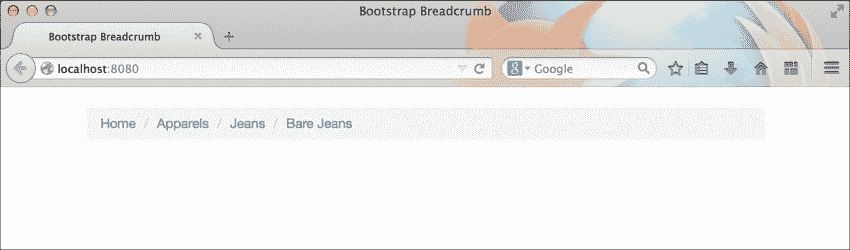

你也可以使用与前面代码相同的 HTML 无序列表元素，这将产生相同的结果。

# 分页组件

你可能已经在任何博客类型网站的底部看到过分页。它将显示“上一页”和“下一页”，或者“页码”。分页有助于访客轻松导航并跳过你网站的一些内容。在创建带有大量评论的评论部分时，它也非常有用。

Bootstrap 分页也是使用 HTML 的无序列表元素创建的。这次你必须使用`.pagination`类：

```js
<ul class="pagination">
  <li><a href="#">&laquo;</a></li>
  <li><a href="#">1</a></li>
  <li><a href="#">2</a></li>
  <li><a href="#">3</a></li>
  <li><a href="#" class="active">4</a></li>
  <li><a href="#">5</a></li>
  <li><a href="#">6</a></li>
  <li><a href="#">7</a></li>
  <li><a href="#">&raquo;</a></li>
</ul>
```

在前面的代码中，`&laquo;`和`&raquo;`用于显示双角符号。这在浏览器中产生以下效果：

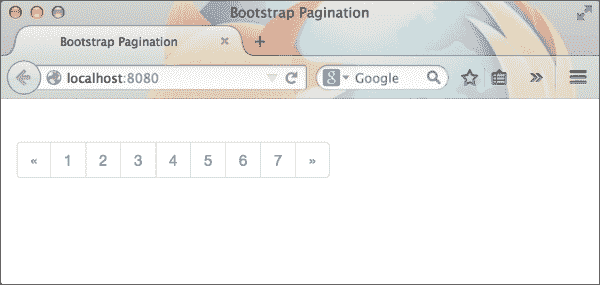

此组件还附带许多辅助类，例如：

+   `.disabled`：这是为了使分页列表中的项目不可点击

+   `.active`：这是为了显示页面的当前位置

+   `.pagination-lg`：这是用于较大的分页按钮

+   `.pagination-sm`：这是用于较小的分页按钮

# Bootstrap 标签和徽章

标签和徽章是 Bootstrap 中的非常基本组件。你可以将它们与任何文本类组件一起使用，以显示突出文本。以下是一个标签和徽章的例子：

```js
<h3>Packt Publishing <span class="label label-default">New Books!</span></h3>
```

标签使用内联元素创建，例如`<span>`，它有一个`.label`类和许多颜色类，例如`.label-default`用于深灰色。

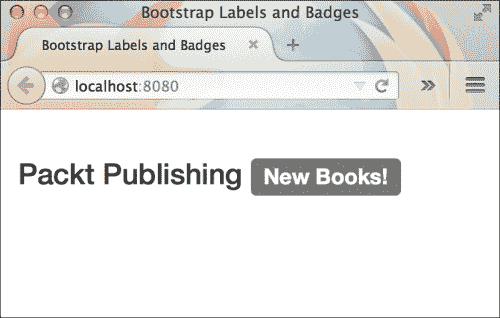

可用的标签颜色：

+   `.label-primary`：这是深蓝色

+   `.label-info`：这是浅蓝色

+   `.label-success`：这是绿色

+   `.label-warning`: 这用于黄色

+   `.label-danger`: 这用于红色

与此相反，徽章是具有自折叠特性的标签。这意味着当徽章内没有内容时，它将不会出现在 HTML 页面中。这为你提供了一个使用徽章创建通知图标的选择。它们主要用于显示数字。徽章也没有像标签那样的颜色变体。以下是一个徽章的示例：

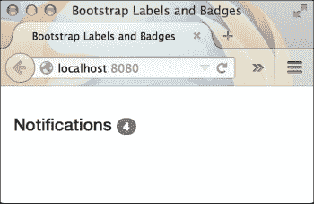

# Bootstrap 巨幕组件

Jumbotron 是 Bootstrap 中另一个有用的组件。它用于在网页上显示大而引人注目的标题。它特别用于创建着陆页。以下是一个`jumbotron`类的示例：

```js
<div class="jumbotron">
  <h1>What an amazing life it is!</h1>
  <a href="#" class="btn btn-primary">Read more</a>
</div>
```

`jumbotron`类为标题标签和按钮提供了一套不同的样式。你将看到 jumbotron 组件内外文本字体大小的差异。前面的代码在浏览器中产生以下结果：

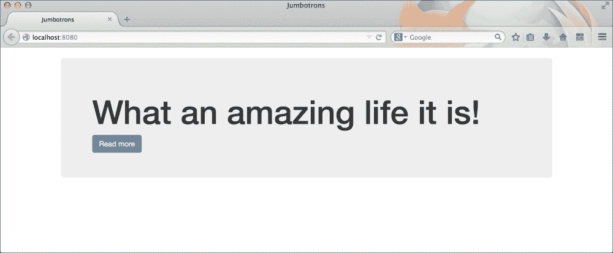

# 警报

警报对于与网站用户沟通消息至关重要。它们突出，明亮且与其他页面元素区分开来。你不应该将这些警报与浏览器中的警报窗口混淆。这些警报是设计成类似警报行为的 HTML 元素。

以下代码显示了简单的警报标记：

```js
<div class="alert alert-success">Message sent!</div>
```

这在浏览器中产生以下结果：

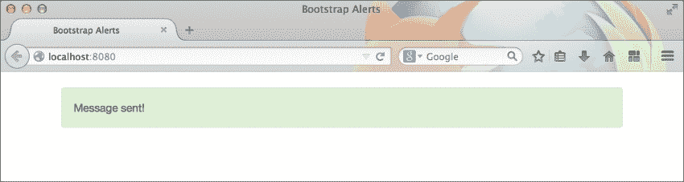

警报有四种不同的颜色变体：

+   `.alert-success`: 这个变体用于绿色

+   `.alert-info`: 这用于浅蓝色

+   `.alert-warning`: 这用于暗橙色

+   `.alert-danger`: 这用于红色

前面的警报是不可关闭的。要在警报的右边缘显示一个叉号按钮并添加关闭选项，你需要遵循以下标记：

```js
<div class="alert alert-success alert-dismissible">
  <button type="button" class="close" data-dismiss="alert" >
    <span> &times; </span> 
  </button>
  Message sent!
</div>
```

首先，你必须向警报元素添加一个`.alert-dismissible`类。接下来，你必须添加一个具有`.close`类的按钮元素。按钮还应有一个名为`dismiss`的自定义数据属性，其值为`alert`。这将让 Bootstrap 的 JavaScript 理解当按钮元素被点击时应该隐藏哪个组件。要在警报中显示一个叉号字符，你应该添加`&times;`HTML 代码。

要在一段时间后自动从 DOM 中删除一个元素，你可以使用以下 jQuery 代码片段：

```js
setTimeout(function(){
  $('#alert-message').alert('close');
}, 3000);
```

在前面的代码中，我们使用了警报消息的 ID，在我们的例子中是`#alert-message`，并使用 Bootstrap 的`alert()`方法将其从 DOM 中删除。你需要将字符串`close`传递给`alert()`方法以删除警报消息。

当在警报内显示超链接时，你应该给锚元素一个`.alert-link`类。这将应用适当的 CSS 样式。

# 创建进度条

进度条对于向用户显示动作的进度至关重要。你可以使用 Bootstrap 的标记轻松创建吸引人的进度条。

这里是一个基本进度条的标记：

```js
<div class="progress">
  <div class="progress-bar" style="width: 60%;"></div>
</div>
```

进度条应该被包裹在一个具有 `.progress` 类的 `div` 元素内部。这个 `div` 元素作为进度条的容器。实际的进度是通过一个具有 `.progress-bar` 类的子 `div` 元素来显示的。你可以编写 JavaScript 代码来改变这个元素的 CSS 宽度，以查看进度条的过渡效果。

在浏览器中，前面的进度条看起来如下：

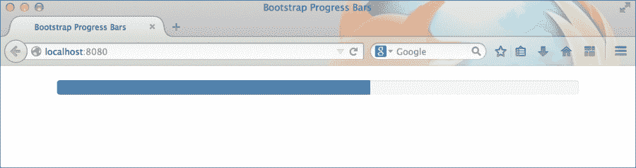

要给进度条添加标签，你可以在 `.progress-bar` 元素内部添加文本。以下代码中的文本作为例子：

```js
<div class="progress">
  <div class="progress-bar" style="width: 60%;">60%</div>
</div>
```

这会产生动作进度的百分比，如下截图所示：

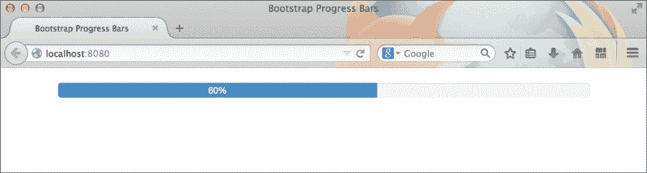

你可以通过添加以下类来更改 `.progress-bar` 元素的颜色：

+   `.progress-bar-success`: 这用于绿色

+   `.progress-bar-info`: 这用于浅蓝色

+   `.progress-bar-danger`: 这用于红色

+   `.progress-bar-warning`: 这用于黄色

现在是有趣的部分！你可以通过给 `.progress-bar` 元素添加一个额外的类 `.progress-bar-striped` 来给进度条添加条纹。

```js
<div class="progress">
  <div class="progress-bar progress-bar-striped" style="width: 60%;">60%</div>
</div>
```

这在浏览器中产生以下结果：

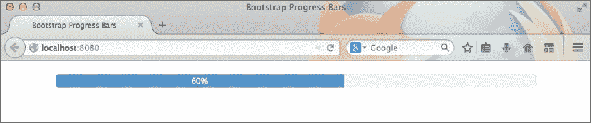

等等！还有更多。添加 `.active` 类，以及 `.progress-bar-striped`，你会看到一个有趣的动画效果。

# 面板

Bootstrap 面板是用于放置 HTML 组件的类似框的组件。你可能想要显示一个带有圆角和周围浅色边框的框。在这种情况下，你应该使用这个组件。

这里是一个示例面板：

```js
<div class="panel panel-default">
  <div class="panel-body">
    I am inside a box!
  </div>
</div>
```

这在浏览器中产生以下结果：

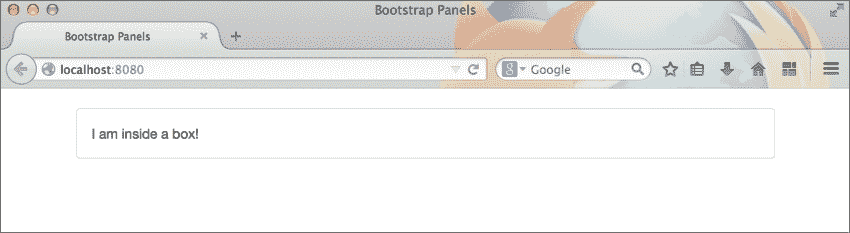

当你给面板组件添加一个头部和底部时，它变得更加有趣。是的，你没看错。面板自带自定义设计的头部和底部，可以创建类似小工具的元素。如果你仔细观察，你会发现文本位于一个 `.panel-body` 元素内部。现在我们将为以下面板添加头部和底部：

```js
<div class="panel panel-default">
  <div class="panel-heading">
    Widget 1
  </div>
  <div class="panel-body">
    I am inside a box!
  </div>
  <div class="panel-footer">
    by Syed Fazle Rahman
  </div>
</div>
```

这在浏览器中产生以下结果：

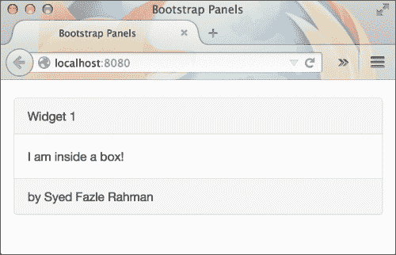

面板也有不同的颜色：

+   `.panel-success`: 这用于绿色

+   `.panel-primary`: 这用于深蓝色

+   `.panel-info`: 这用于浅蓝色

+   `.panel-warning`: 这用于黄色

+   `.panel-danger` : 这用于红色

以下截图显示了一个绿色面板：

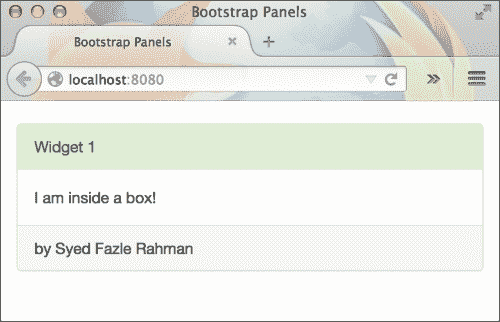

# 摘要

通过本章，我们学习了如何使用 Bootstrap 的一些有趣且实用的组件。这些组件通常用于为应用程序的用户提供更好的用户体验。我们看到了如何使用面包屑、分页、标签和徽章以及巨幕。我们了解了警报是什么以及何时使用它们。然后我们继续创建了一个漂亮的进度条和面板小部件。

在下一章中，我们将根据需要将这些组件集成到我们现有的应用程序中。
