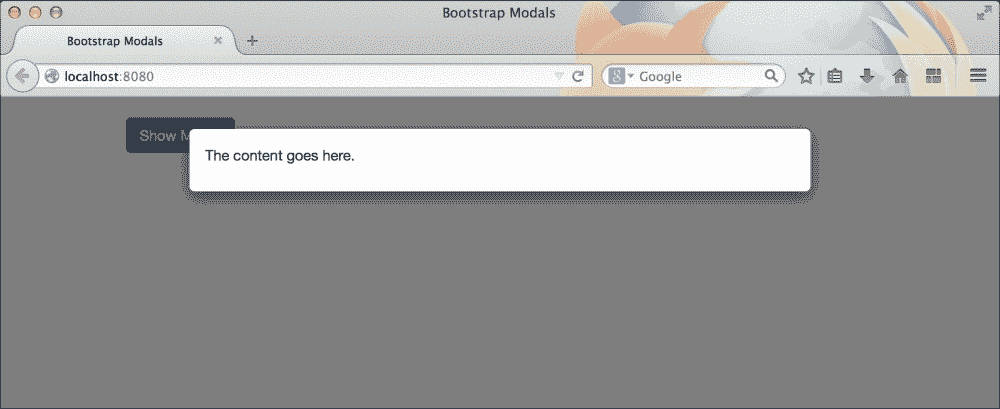
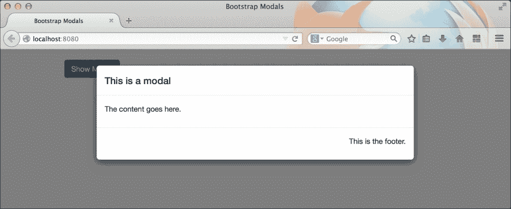
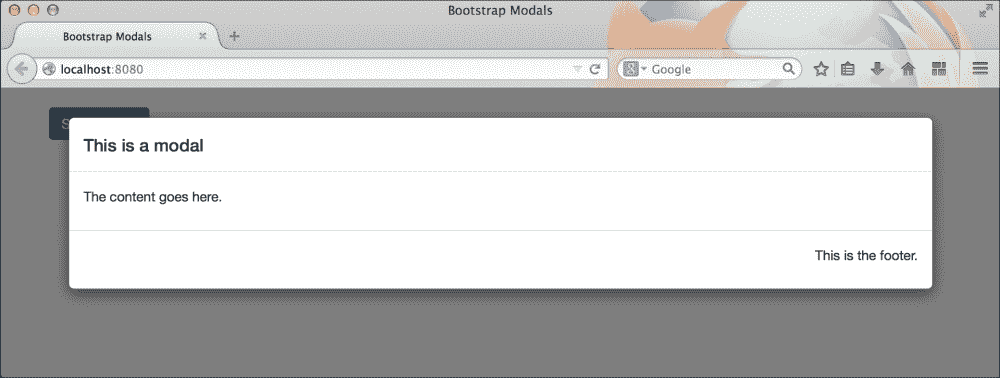
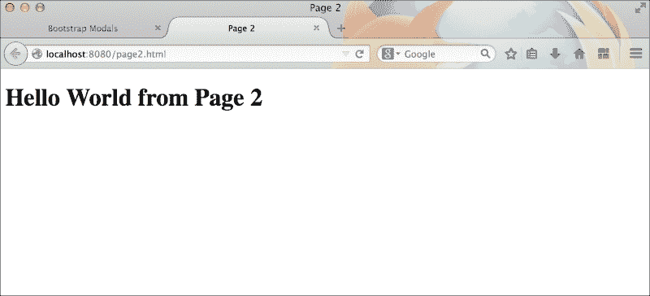
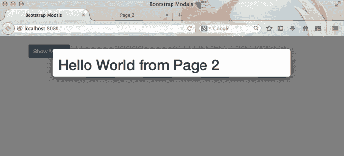
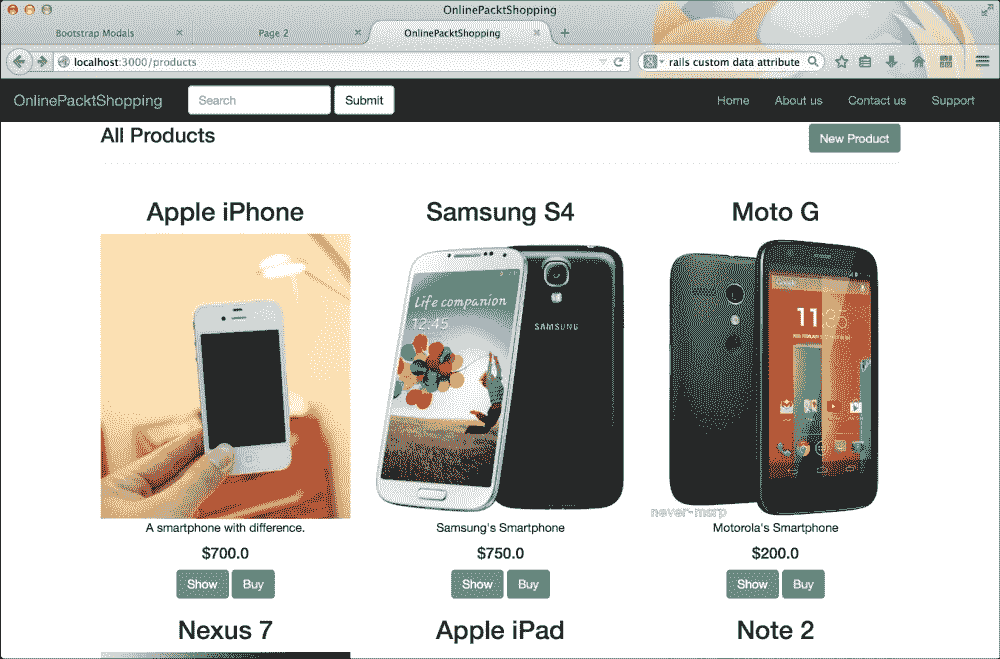
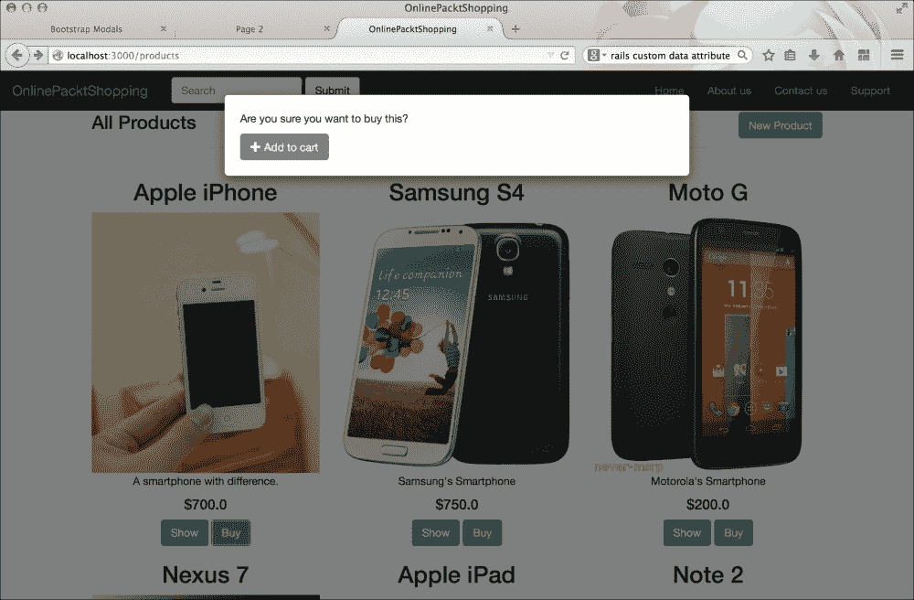

# 第八章。使用 Bootstrap 模态框

每个开发者都在处理 Web 开发时使用过警告/提示窗口。它们通常用于显示重要消息、从用户那里获取信息、显示警告消息以及许多不同的目的。这些传统对话框的问题在于它们已经过时了，我们的访客可能不喜欢它们。从更好的用户体验角度来看，不再推荐使用对话框窗口。

为了解决这个问题，Web 开发者发现了一种更好的方法来替换弹出窗口。他们使用了同一网页内的一个隐藏 HTML 元素。每当需要时，这个隐藏元素会通过一些 JavaScript 代码和 CSS 样式来显示。Bootstrap 的模态框正是如此。它是一个具有最小所需功能的灵活对话框。它具有自己的 Bootstrap 样式和动画。

在本章中，我们将学习如何创建 Bootstrap 模态框及其各种类型和功能。我们还将在我们的 Rails 应用程序中集成模态框组件。

# 开始使用模态框

首先，我们将创建一个静态应用程序来创建和测试各种类型的 Bootstrap 模态框。一旦我们完成了模态框的基础知识，我们将将其集成到现有的`Online Shopping Rails`应用程序中。

在您的系统中创建一个名为`Bootstrap Modals`的新文件夹。现在，创建一个名为`index.html`的新文件，并将以下起始模板粘贴到其中：

```js
<!DOCTYPE html>
  <html lang="en">
  <head>
    <meta charset="utf-8">
    <meta http-equiv="X-UA-Compatible" content="IE=edge">
    <meta name="viewport" content="width=device-width, initial-scale=1">
    <title>Bootstrap Modals</title>
    <!-- Bootstrap -->
    <link rel="stylesheet"href="http://maxcdn.bootstrapcdn.com/bootstrap/3.2.0/css/bootstrap.min.css">
  </head>
  <body>
    <h1>Hello World</h1>
    <!-- jQuery (necessary for Bootstrap's JavaScript plugins) -->
    <script src="img/jquery.min.js"></script>
    <!-- Include all compiled plugins (below), or include individual files as needed -->
    <script src="img/bootstrap.min.js"></script>
  </body>
</html>
```

让我们从先前的模板中删除`Hello World`标签，并插入创建模态框所需的标记。要创建模态框，我们需要定义一个具有`.modal`类的`<div>`元素：

```js
<div class="modal">
</div>
```

可选地，您还可以添加`.fade`类以将`.fade-in`动画应用于模态框：

```js
<div class="modal fade">
</div>
```

`.modal`类为模态组件创建了一个包装器。它通过将 CSS `overflow`属性设置为`hidden`来隐藏 HTML 网页的滚动属性。它还在同一页面上所有 HTML 元素之上创建了一个具有`fixed`定位的 HTML 区域。

接下来，我们将添加用于在模态框内放置内容的标记。步骤如下：

```js
<div class="modal fade">
  <div class="modal-dialog">
    <div class="modal-content">
    </div>
  </div>
</div>
```

类`.modal-dialog`和`.modal-content`共同负责在模态组件中正确居中一个白色内容区域。

让我们继续创建模态框的主体区域，以便在模态框内放置 HTML 内容：

```js
<div class="modal fade">
  <div class="modal-dialog">
    <div class="modal-content">
      <div class="modal-body">
        <p>The content goes here.</p>
      </div>
    </div>
  </div>
</div>
```

您可以根据需要在此`.modal-body` div 中放置任何 HTML 元素。您可以使用它来显示长`条款和条件`文本、`登录`表单、警告文本等。

我们已经准备好了我们的第一个基本模态框。如果您在浏览器中加载这个 HTML 页面，您会发现一个空白页面。这是因为我们创建了一个模态框，但没有创建任何将触发此模态框的元素。模态框是 Bootstrap 中的隐藏组件。

让我们创建一个 Bootstrap 按钮，当点击时触发前面的模态框：

```js
<button class="btn btn-primary" data-toggle="modal" data-target="#myFirstModal">
  Show Modal
</button>
```

此按钮应该有两个非常重要的自定义属性来触发模态框：`data-toggle` 和 `data-target`。第一个属性告诉 Bootstrap 的 JavaScript 它关注的是哪个组件，而第二个属性指定要打开哪个特定的模态框。第二个属性持有你想要打开的模态框的 ID。让我们也将此 ID 应用到我们前面的模态框上。因此，我们模态框的最终标记应如下所示：

```js
<div class="modal fade" id="myFirstModal">
  <div class="modal-dialog">
    <div class="modal-content">
      <div class="modal-body">
        <p>The content goes here.</p>
      </div>
    </div>
  </div>
</div>
```

你应该得到一个如下截图所示的模态框：



模态框组件除了 `.modal-body` 区域外，还有一个头部和底部区域。它们是通过 `.modal-header` 和 `.modal-footer` 类创建的。我们可以通过添加代码来应用头部和底部，如下所示：

```js
<div class="modal fade" id="myFirstModal">
  <div class="modal-dialog">
    <div class="modal-content">
      <div class="modal-header">
        <h4 class="modal-title">This is a modal</h4>
      </div>
      <div class="modal-body">
        <p>The content goes here.</p>
      </div>
      <div class="modal-footer">
        <p>This is the footer.</p>
      </div>
    </div>
  </div>
</div>
```

建议你在 `.modal-header` 内使用带有 `.modal-title` 类的 `<h4>` 标签。模态框底部的所有默认元素都将根据 Bootstrap 的 CSS 居中对齐。你可以通过覆盖其 CSS 属性来修改它：

```js
 .modal-footer{

text-align: left;
}
```

带有头部和底部的上述模态框应如下所示：



# 改变 Bootstrap 的模态框大小

Bootstrap 的模态框也有各种大小：大、正常和小。你需要使用以下类来更改模态框的大小：

+   `.modal-lg`: 这用于较大的模态框

+   没有类：这用于正常大小的模态框

+   `.modal-sm`: 这用于较小的模态框

你必须将上述类添加到模态框标记中的 `.modal-dialog` 元素。以下代码作为示例：

```js
<div class="modal fade" id="myFirstModal">
  <div class="modal-dialog modal-lg">
    <div class="modal-content">
      <div class="modal-header">
        <h4 class="modal-title">This is a modal</h4>
      </div>
      <div class="modal-body">
        <p>The content goes here.</p>
      </div>
      <div class="modal-footer">
        <p>This is the footer.</p>
      </div>
    </div>
  </div>
</div>
```

上述标记将创建一个较大的模态框，如下面的截图所示：



# 其他 Bootstrap 模态框功能

Bootstrap 为模态框组件提供了许多功能。这些功能通常在触发模态框组件时作为 `JSON` 属性提供，或者你可以通过在 `.modal` 元素中使用自定义 `data-*` 属性来使用这些功能。Bootstrap 的附加功能包括：

+   `data-backdrop`: 这个属性接受 `static` 或 `true` 值。当设置为 `static` 时，它禁用了点击模态框外部关闭模态框的功能。

+   `data-keyboard`: 这个属性接受布尔值，默认设置为 `true`。当设置为 `true` 时，`data-keyboard` 的功能会在按下 *Esc* 键时关闭模态框。

+   `data-show`: 这个属性接受布尔值，默认设置为 `false`。当设置为 `true` 时，`data-show` 在初始化时显示模态框。

# 从 Bootstrap 模态框获取远程内容

在这里，`data-remote` 是 Bootstrap 模态框组件中的一个特殊数据属性。当数据被触发时，它用于在模态框内加载远程网页。这个功能仅从 Bootstrap v 3.0 到 v 3.2.0 可用；我相信这真的非常实用！

让我们看看如何使用它的一个示例。

让我们在同一个 Bootstrap Model 项目文件夹内创建一个名为 `page2.html` 的新 HTML 页面。将以下基本 HTML 放入其中：

```js
<!DOCTYPE html>
<html>
  <head>
    <title>Page 2</title>
  </head>
  <body>
    <div class="container">
      <h1>Hello World from Page 2</h1>
    </div>
  </body>
</html>
```

在浏览器中，这个页面应该看起来如下：



现在，每当它被触发时，我们将在这个之前的模态中加载这个页面。修改之前创建的模态标记，如下所示：

```js
<div class="modal fade" id="myFirstModal" data-remote="page2.html">
  <div class="modal-dialog">
    <div class="modal-content">
      <div class="modal-header">
        <h4 class="modal-title">This is a modal</h4>
      </div>
      <div class="modal-body">
        <p>The content goes here.</p>
      </div>
      <div class="modal-footer">
        <p>This is the footer.</p>
      </div>
    </div>
  </div>
</div>
```

注意这次我们添加了一个额外的属性 `data-remote`，并将其值设置为 `page2.html` 的路径。让我们刷新浏览器并触发模态。这次，你应该会在模态中看到加载的 `page2.html` 内容，而不是默认内容。截图如下：



### 注意

在使用跨域链接作为远程内容时，你应该非常小心。许多浏览器可能不允许这样做。

# 使用 Bootstrap 的模态在 Rails 应用中

在我们之前章节中创建的 `Demo Shopping` 应用程序中，我们将在每个产品的 **显示** 按钮旁边添加一个额外的按钮，命名为 **购买**。当用户点击 **购买** 按钮时，浏览器将显示一个模态，确认他们要将特定产品添加到购物车中的操作。这个模态将有一个 **添加到购物车** 按钮，它将模拟正在添加到购物车中的产品的行为，然后关闭模态。在这本书中，我们不会创建真正的购物车。这取决于你决定使用哪种方法来创建购物车。

通过导航到 **app** | **views** | **layouts** 打开 `layouts` 文件夹中的 `application.html.erb` 文件。我们将在该文件中创建一个全局模态。当点击 **购买** 按钮时，这个模态将被触发。这个模态的标记如下：

```js
<div class="modal fade" id="buyModal">
  <div class="modal-dialog">
    <div class="modal-content">
      <div class="modal-body">
        <p>Are you sure you want to buy this?</p>
        <button class="btn btn-success">
          <i class="glyphicon glyphicon-plus"></i> Add to cart
        </button>
      </div>
    </div>
  </div>
</div>
```

确保将这个模态标记放置在之前创建的整个标记之外。Bootstrap 建议你始终将模态的标记放置在最顶层。

现在，我们已经放置了一个虚拟模态。让我们继续创建一个 **购买** 按钮。

通过导航到 **app** | **views** | **products** 打开 `products` 文件夹中的 `index.html.erb` 文件。搜索之前创建的 **显示** 按钮，其代码如下：

```js
<%= link_to 'Show', product, :class=>"btn btn-primary" %>
```

我们将放置另一个没有 `href` 属性的按钮，并添加自定义数据属性来触发模态：

```js
<%= link_to 'Buy', '#', :class=>"btn btn-success" %>
```

这将在每个 **显示** 按钮旁边创建一个新的 **购买** 按钮。



让我们添加自定义数据属性来触发模态组件。修改 **购买** 按钮，如下所示：

```js
<%= link_to 'Buy', '#', :class=>"btn btn-success", :data=> { :toggle =>'modal', :target=>'#buyModal' } %>
```

在这里，`data-target` 属性将保留 `#buyModal` 的值，这也是我们模态的 ID。

现在，如果你点击 **购买** 按钮，它将显示模态，如下面的截图所示：



让我们添加一个功能，当我们在“加入购物车”按钮上点击时，将关闭模态框。为此，我们需要再次编辑`application.html.erb`文件。我们必须给“加入购物车”按钮添加一个额外的数据属性`data-dismiss`，其值为`modal`。让我们添加这个数据属性：

```js
<button class="btn btn-success" data-dismiss="modal"><i class="glyphicon glyphicon-plus"></i> Add to cart</button>
```

添加前面的数据属性将让 Bootstrap 的 JavaScript 知道要关闭哪个组件。

# 摘要

我希望你喜欢学习如何创建一个灵活的 Bootstrap 模态组件。通过本章，我们学习了如何在静态项目中创建一个基本的模态框。然后我们继续为其添加额外的功能。我们还看到了如何通过使用额外的类如`.modal-lg`和`.modal-sm`来创建不同大小的模态框。最后，我们将模态组件集成到我们的购物应用中。我们学习了如何通过模拟确认模态来模拟“加入购物车”的功能。现在，这个领域对你来说已经开放，你可以更多地实验模态框。

在下一章中，我们将了解 Bootstrap 中最有趣的一个组件，轮播图。我们将看到如何使用轮播图组件创建美丽的图片幻灯片。
