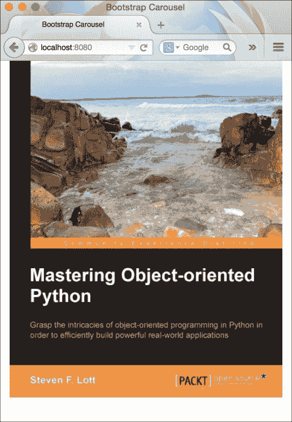
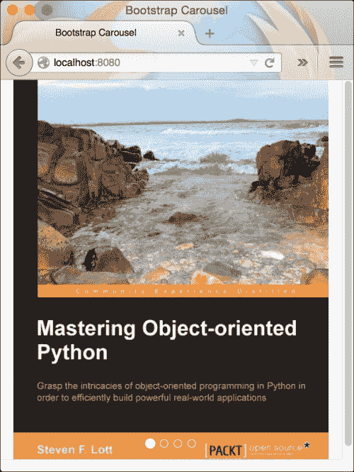
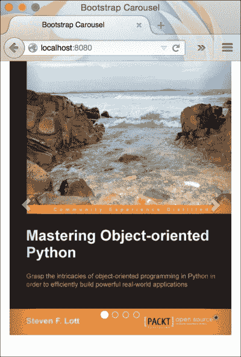

# 第九章：使用 Bootstrap Carousel 创建图像幻灯片

术语**Carousel**灵感来源于现实世界中的旋转木马，这种旋转木马在许多娱乐公园中都可以找到。它反复旋转人们站立或就坐的圆形结构。基于网络的旋转木马行为类似。它是一组图像及其相应文本数据的幻灯片。

旋转木马是 Web 组件中最重要的一部分。它们对于购物网站以时尚的方式展示许多产品非常有用。许多博客网站也利用了这个组件。

如果您是一位新手网页设计师，那么为您的网站创建旋转木马可能有点复杂。另一方面，Bootstrap 3 提供了一个名为 carousel 的 JavaScript 插件，它已准备好使用。

您需要编写许多行 JavaScript 和 CSS 代码，才能使用 Bootstrap 创建一个漂亮的图像幻灯片。就像 Bootstrap 的先前组件一样，您必须放置正确的标记。

在本章中，我们将涵盖以下主题：

+   Bootstrap Carousel 入门

+   为幻灯片添加字幕

+   定制旋转木马

# Bootstrap Carousel 入门

让我们从 Bootstrap Carousel 组件开始，创建一个基本的图像幻灯片。一如既往，我们将为此创建一个静态 HTML 页面，以了解其用法。步骤如下：

1.  在您的系统中任何您喜欢的地方创建一个名为`Bootstrap Carousel`的新文件夹。我们将为`index.html`文件使用相同的静态标记：

    ```js
    <!DOCTYPE html>
    <html lang="en">
      <head>
        <meta charset="utf-8">
        <meta http-equiv="X-UA-Compatible" content="IE=edge">
        <meta name="viewport" content="width=device-width, initial-scale=1">
        <title>Bootstrap Carousel</title>
        <!-- Bootstrap -->
        <link rel="stylesheet" href="http://maxcdn.bootstrapcdn.com/bootstrap/3.2.0/css/bootstrap.min.css">
      </head>
      <body>
        <h1>Hello World</h1>
        <!-- jQuery (necessary for Bootstrap's JavaScript plugins) -->
        <script src="img/jquery.min.js"></script>
        <!-- Include all compiled plugins (below), or include individual files as needed -->
        <script src="img/bootstrap.min.js"></script>
      </body>
    </html>
    ```

1.  让我们从上一个文件中删除`Hello World`标记，并开始构建我们的第一个旋转木马组件。

1.  Bootstrap Carousel 分为三个主要部分：指示器、内部包装器和控件。每个部分都有其重要性。要创建 Bootstrap Carousel，我们需要创建一个具有`.carousel`类的`div`元素：

    ```js
    <div class="carousel">
    </div>
    ```

1.  Bootstrap 允许您创建带有或不带有滑动动画的幻灯片。如果您想要滑动项目有一个漂亮的滑动效果，请添加一个具有`.carousel`类的`.slide`类：

    ```js
    <div class="carousel slide">
    </div>
    ```

1.  可以添加一个可选的`data-ride`属性到前面的`div`元素中。它用于标记旋转木马为动画，在页面加载时开始。让我们设置这个属性：

    ```js
    <div class="carousel slide" data-ride="carousel">
    </div>
    ```

1.  我们还将为此`div`元素添加一个 ID 属性。此属性将在定义旋转木马子元素时多次使用：

    ```js
    <div class="carousel slide" data-ride="carousel" id="my-first-carousel">
    </div>
    ```

1.  现在，我们将继续创建旋转木马组件的`Inner-Wrapper`。这个包装器将包含旋转木马的所有滑动项目：

    ```js
    <div class="carousel slide" data-ride="carousel" id="my-first-carousel">
      <div class="carousel-inner">
      </div>
    </div>
    ```

1.  我们将开始将滑动元素插入到这个`Inner-Wrapper`中。每个滑动项目都应该附加一个`.item`类：

    ```js
    <div class="carousel slide" data-ride="carousel" id="my-first-carousel">
      <div class="carousel-inner">
        <div class="item">
        </div>
      </div>
    </div>
    ```

1.  您可以向旋转组件中添加的项目数量没有限制。让我们继续并在这个项目中填充一个图像来代表该项目：

    ```js
    <div class="carousel slide" data-ride="carousel" id="my-first-carousel">
      <div class="carousel-inner">
        <div class="item">
          
        </div>
        <div class="item">
          
        </div>
        <div class="item">
          
        </div>
        <div class="item">
          
        </div>
      </div>
    </div>
    ```

1.  现在，我们有四个滑动项目，每个都填充了独特的图像。是时候告诉 Bootstrap 哪个项目应该作为幻灯片的第一个项目了。

1.  这可以通过向任何 `.item` 元素添加一个 `.active` 类来实现。在我们的例子中，我们将向第一个 `.item` 元素添加 `.active` 类：

    ```js
    <div class="carousel slide" data-ride="carousel" id="my-first-carousel">
      <div class="carousel-inner">
        <div class="item active">
          
        </div>
        <div class="item">
          
        </div>
      </div>
    </div>
    ```

1.  我们现在已经完成了一个包含四个滑动项目的轮播图的基本版本。让我们在浏览器中查看它：

1.  我们从这个幻灯片放映中缺少两个重要元素：指示器和控件。指示器非常有用，可以直接跳转到特定的幻灯片。控件让我们可以逐个方向导航幻灯片。

    让我们继续添加它们。指示器是通过带有 `.carousel-indicators` 类的有序列表创建的：

    ```js
    <div class="carousel slide" data-ride="carousel" id="my-first-carousel">
      <!-- Indicators →
      <ol class="carousel-indicators">
      </ol>
      <div class="carousel-inner">
      </div>
    </div>
    ```

    指示器中的每个 `<li>` 项目是轮播图中特定幻灯片的处理程序。它们应该有两个不同的数据属性：`data-target` 和 `data-slide-to`。`data-target` 属性用于指示网页中我们正在讨论哪个轮播图。它应包含轮播图元素的 ID，即 `#my-first-carousel`。`data-slide-to` 用于指示内容/图像展示的幻灯片编号。例如，如果您有四个幻灯片，幻灯片编号从 0 到 3：

    ```js
    <div class="carousel slide" data-ride="carousel" id="my-first-carousel">
      <!-- Indicators →
      <ol class="carousel-indicators">
        <li data-target="#my-first-carousel" data-slide-to="0" class="active"></li>
        <li data-target="#my-first-carousel" data-slide-to="1"></li>
        <li data-target="#my-first-carousel" data-slide-to="2"></li>
        <li data-target="#my-first-carousel" data-slide-to="3"></li>
      </ol>
      <div class="carousel-inner">
      </div>
    </div>
    ```

1.  如果您在浏览器中检查页面，您可以看到指示器出现在轮播图的底部：

    让我们向轮播图添加 `controls`。控件是一对具有一组属性的 HTML 锚点元素 `<a>`，如下所示：

    ```js
    <a class="left carousel-control" href="#my-first-carousel" data-slide="prev">
      <span class="glyphicon glyphicon-chevron-left"></span>
    </a>
    <a class="right carousel-control" href="#my-first-carousel"   data-slide="next">
      <span class="glyphicon glyphicon-chevron-right"></span>
    </a>
    ```

    每个锚点元素都有一个 `.carousel-control` 类。此外，您必须分别向 `.carousel-control` 元素的每个元素添加方向类 `.left` 和 `.right`。这些方向类帮助它们在轮播图中占据相应的位置。每个锚点元素的 `href` 属性必须指向父轮播图元素，使用 ID。我们还有一个 `data-slide` 属性，它告诉 Bootstrap 从当前幻灯片导航到哪个幻灯片。

1.  最后，完整的轮播图的标记如下所示：

    ```js
    <div id="my-first-carousel" class="carousel slide" data-ride="carousel">
    <!-- Indicators -->
      <ol class="carousel-indicators">
        <li data-target="#my-first-carousel" data-slide-to="0" class="active"></li>
        <li data-target="#my-first-carousel" data-slide-to="1"></li>
        <li data-target="#my-first-carousel" data-slide-to="2"></li>
        <li data-target="#my-first-carousel" data-slide-to="3"></li>
      </ol>
      <!-- Wrapper for slides -->
      <div class="carousel-inner">
        <div class="item active">
          
        </div>
        <div class="item">
          
        </div>
        <div class="item">
          
        </div>
        <div class="item">
          
        </div>
      </div>
      <!-- Controls -->
      <a class="left carousel-control" href="#my-first-carousel" data-slide="prev">
        <span class="glyphicon glyphicon-chevron-left"></span>
      </a>
      <a class="right carousel-control" href="#my-first-carousel" data-slide="next">
      <span class="glyphicon glyphicon-chevron-right"></span>
      </a>
    </div>
    ```

    您还可以在以下屏幕截图中看到控件出现在轮播图中。要使用键盘控制幻灯片放映，您需要向 `.carousel` 元素添加 `data-keyboard` 属性，并将其值设置为 `true`：

    

# 为幻灯片添加标题

可以通过插入一个带有 `.carousel-caption` 类的 `div` 元素轻松地为每个幻灯片项目添加标题。此元素将包含两个不同的元素：一个 `heading` 元素和一个 `paragraph` 元素。您可以选择使用其中一个或两个。以下代码作为示例：

```js
<div class="item">
  
    <div class="carousel-caption">
    <h3>This is the first slideshow</h3>
    <p>Lorem ipsum donor.</p>
  </div>
</div>
```

# 自定义轮播图

您还可以向 `.carousel` 添加各种不同的 `data-*` 属性来更改其默认行为。Bootstrap 提供了三个不同的属性：

`data-interval`: 此属性用于更改每张幻灯片的持续时间。它接受以毫秒为单位的整数值。例如，`data-interval="5000"`。

`data-pause`: 此属性仅接受一个值，即 `hover`。当此属性被设置时，当鼠标悬停在其上时，幻灯片会暂停。

`data-wrap`: 此属性接受布尔值。当设置为 `true` 时，幻灯片将自动从第一张幻灯片重新开始。

# 摘要

在本章中，我们看到了如何创建一个基本的轮播图。我们向其中添加了各种元素，如指示器、控件和标题。我们还看到了 Bootstrap 中可用的各种自定义选项。

在下一章中，我们将实现我们在 Bootstrap 中所学的所有内容。
