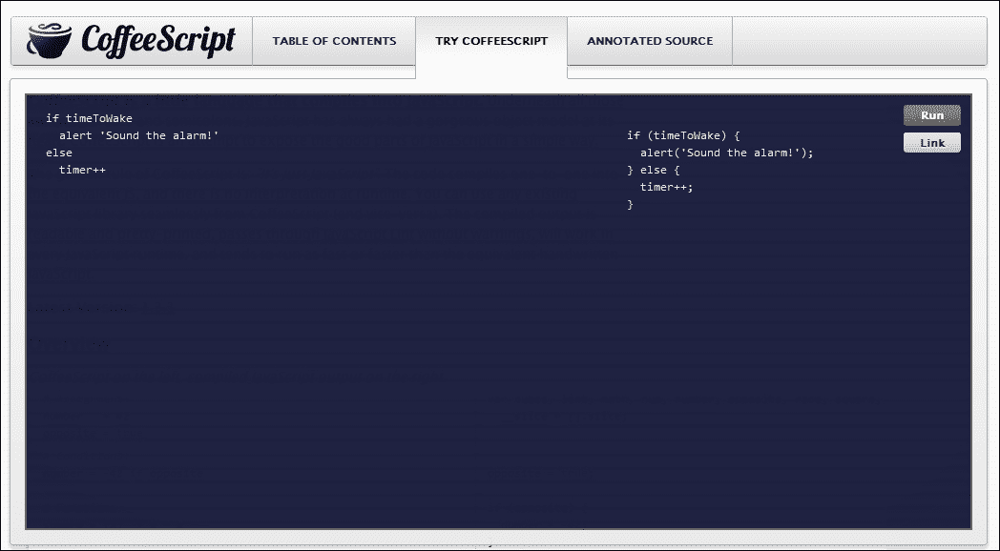

# 第一章：为什么使用 CoffeeScript？

CoffeeScript 编译成 JavaScript，并且紧密遵循其习惯用法。完全可以将任何 CoffeeScript 代码重写为 JavaScript，它们看起来并不会有很大的不同。那么为什么要使用 CoffeeScript 呢？

作为一名有经验的 JavaScript 程序员，你可能认为学习一个全新的语言根本不值得时间和精力。

但最终，代码是给程序员看的。编译器不在乎代码的外观或清晰的含义；它要么运行，要么不运行。我们的目标是作为程序员编写表达性强的代码，这样我们就可以阅读、引用、理解、修改和重写它。

如果代码过于复杂或充满了不必要的仪式，那么理解和维护将会更加困难。CoffeeScript 给了我们一个优势，可以澄清我们的想法并编写更易读的代码。

认为 CoffeeScript 与 JavaScript 非常不同是一种误解。可能在某些地方会有一些极端的语法差异，但本质上，CoffeeScript 旨在打磨 JavaScript 的粗糙边缘，揭示其中隐藏的美丽语言。它引导程序员走向 JavaScript 的所谓“好部分”，并对构成良好 JavaScript 的内容持有坚定的看法。

CoffeeScript 社区的口头禅之一是：“它只是 JavaScript”，我也发现真正理解这种语言的最佳方法是看它是如何生成输出的，实际上生成的代码相当可读和易懂。

在本章中，我们将重点介绍两种语言之间的一些差异，通常关注 JavaScript 中 CoffeeScript 试图改进的内容。

通过这种方式，我不仅想给你一个关于该语言主要特性的概述，还想让你能够在更频繁地使用它后，能够调试生成的代码，以及能够转换现有的 JavaScript。

让我们从 CoffeeScript 修复 JavaScript 中的一些问题开始。

# CoffeeScript 语法

CoffeeScript 的一大优点是，你写的程序通常比在 JavaScript 中写的要短得多，更简洁。部分原因是语言中添加了强大的功能，但它也对 JavaScript 的一般语法进行了一些调整，使其变得相当优雅。它取消了所有的分号、大括号和其他通常导致 JavaScript 中很多“线噪音”的东西。

为了说明这一点，让我们看一个例子。下表的左侧是 CoffeeScript，右侧是生成的 JavaScript：

| CoffeeScript | JavaScript |
| --- | --- |

|

```js
fibonacci = (n) ->
 return 0 if n == 0
 return 1 if n == 1
 (fibonacci n-1) + (fibonacci n-2)

alert fibonacci 10
```

|

```js
var fibonacci;

fibonacci = function(n) {
  if (n === 0) {
    return 0;
  }
  if (n === 1) {
    return 1;
  }
  return (fibonacci(n - 1)) + (fibonacci(n - 2));
}; 

alert(fibonacci(10));
```

|

要运行本章中的代码示例，可以使用伟大的**尝试 CoffeeScript**在线工具，网址为[`coffeescript.org`](http://coffeescript.org)。它允许你输入 CoffeeScript 代码，然后在侧边栏显示相应的 JavaScript。你也可以直接从浏览器中运行代码（点击左上角的**运行**按钮）。如果你更喜欢先在计算机上运行 CoffeeScript 来运行示例，请跳到下一章，然后安装好 CoffeeScript 再回来。该工具如下截图所示：



起初，这两种语言可能看起来截然不同，但希望随着我们对比差异，你会发现它们仍然是 JavaScript，只是进行了一些小的调整和大量的语法糖。

## 分号和大括号

你可能已经注意到，CoffeeScript 取消了所有行末的分号。如果想要在一行上放两个表达式，仍然可以使用分号。它还取消了代码块的大括号（也称为花括号），比如`if`语句、`switch`和`try..catch`块。

## 空格

你可能想知道解析器如何确定代码块的起始和结束位置。CoffeeScript 编译器通过使用语法空格来实现这一点。这意味着缩进用于分隔代码块，而不是大括号。

这可能是该语言最具争议的特性之一。如果你仔细想想，在几乎所有的语言中，程序员倾向于使用代码块的缩进来提高可读性，那么为什么不将其作为语法的一部分呢？这并不是一个新概念，而是大部分借鉴自 Python。如果你有任何与显著空白语言的经验，你将不会对 CoffeeScript 的缩进感到困扰。

如果不这样做，可能需要一些时间来适应，但这样做可以使代码非常易读和易于扫描，同时减少了很多按键。我敢打赌，如果你花时间克服一些可能存在的初步保留，你可能会喜欢块缩进。

### 注意

块可以使用制表符或空格进行缩进，但要注意一致使用其中一种，否则 CoffeeScript 将无法正确解析您的代码。

## 括号

你会发现`if`语句的子句不需要用括号括起来。`alert`函数也是一样；你会发现单个字符串参数跟在函数调用后面，也没有括号。在 CoffeeScript 中，带参数的函数调用、`if..else`语句的子句以及`while`循环的括号都是可选的。

虽然带参数的函数不需要括号，但在可能存在歧义的情况下使用括号仍然是一个好主意。CoffeeScript 社区提出了一个不错的习惯：将整个函数调用包装在括号中。在下表中显示了在 CoffeeScript 中使用`alert`函数：

| CoffeeScript | JavaScript |
| --- | --- |

|

```js
alert square 2 * 2.5 + 1

alert (square 2 * 2.5) + 1
```

|

```js
alert(square(2 * 2.5 + 1));

alert((square(2 * 2.5)) + 1);
```

|

在 JavaScript 中，函数是一等对象。这意味着当你引用一个没有括号的函数时，它将返回函数本身作为值。因此，在 CoffeeScript 中，当调用没有参数的函数时，仍然需要添加括号。

通过对 JavaScript 的语法进行这些小调整，CoffeeScript 可以说已经大大提高了代码的可读性和简洁性，并且还节省了大量的按键。

但它还有一些其他的技巧。大多数写过大量 JavaScript 的程序员可能会同意，最频繁输入的短语之一应该是函数定义`function(){}`。函数确实是 JavaScript 的核心，但也不是没有缺点。

# CoffeeScript 具有出色的函数语法

你可以将函数视为一等对象，也可以创建匿名函数，这是 JavaScript 最强大的特性之一。然而，语法可能非常笨拙，使得代码难以阅读（特别是如果你开始嵌套函数）。但是 CoffeeScript 对此有解决方法。看一下以下代码片段：

| CoffeeScript | JavaScript |
| --- | --- |

|

```js
-> alert 'hi there!'
square = (n) -> n * n
```

|

```js
var square;
(function() {
  return alert('hi there!');
});
square = function(n) {
  return n * n;
};
```

|

在这里，我们创建了两个匿名函数，第一个只显示一个对话框，第二个将返回其参数的平方。你可能已经注意到了有趣的`->`符号，并可能已经弄清楚了它的作用。是的，这就是你在 CoffeeScript 中定义函数的方式。我遇到过一些不同的符号名称，但最被接受的术语似乎是一个细箭头或者只是一个箭头。这与粗箭头相对，我们稍后会讨论。

请注意，第一个函数定义没有参数，因此我们可以省略括号。第二个函数有一个参数，括号括起来，放在`->`符号前面。根据我们现在所知道的，我们可以制定一些简单的替换规则，将 JavaScript 函数声明转换为 CoffeeScript。它们如下：

+   用`->`替换`function`关键字

+   如果函数没有参数，去掉括号

+   如果有参数，请将整个参数列表与括号一起移到`->`符号前面

+   确保函数体正确缩进，然后去掉括号

## 不需要返回

您可能已经注意到，在这两个函数中，我们都省略了`return`关键字。默认情况下，CoffeeScript 将返回函数中的最后一个表达式。它将尝试在所有执行路径中执行此操作。CoffeeScript 将尝试将任何语句（返回空值的代码片段）转换为返回值的表达式。CoffeeScript 程序员经常通过说语言的所有内容都是表达式来提到语言的这个特性。

这意味着您不再需要输入`return`，但请记住，这可能会在许多情况下微妙地改变您的代码，因为您总是会返回某些东西。如果需要在最后一个语句之前从函数返回一个值，仍然可以使用`return`。

## 函数参数

函数参数也可以采用可选的默认值。在下面的代码片段中，您将看到指定的可选值被分配在生成的 Javascript 的主体中：

| CoffeeScript | JavaScript |
| --- | --- |

|

```js
square = (n=1) ->
  alert(n * n)
```

|

```js
var square;

square = function(n) {
  if (n == null) {
    n = 1;
  }
  return alert(n * n);
};
```

|

在 JavaScript 中，每个函数都有一个类似数组的结构，称为`arguments`，其中为传递给函数的每个参数都有一个索引属性。您可以使用`arguments`向函数传递可变数量的参数。每个参数都将成为 arguments 中的一个元素，因此您不必按名称引用参数。

尽管`arguments`对象在某种程度上类似于数组，但它实际上不是一个“真正”的数组，并且缺少大部分标准数组方法。通常，您会发现`arguments`无法提供检查和操作其元素所需的功能，就像它们与数组一起使用一样。

这迫使许多程序员使用一个小技巧，即使`Array.prototype.slice`复制`argument`对象元素，或者使用`jQuery.makeArray`方法创建一个标准数组，然后可以像正常数组一样使用。

CoffeeScript 借用了从参数创建数组的模式，这些参数由三个点(`...`)表示。这些在下面的代码片段中显示：

**CoffeeScript:**

```js
gpaScoreAverage = (scores...) ->
   total = scores.reduce (a, b) -> a + b
   total / scores.length

alert gpaScoreAverage(65,78,81)
scores = [78, 75, 79]
alert gpaScoreAverage(scores...)
```

**JavaScript:**

```js
var gpaScoreAverage, scores,
  __slice = [].slice;

gpaScoreAverage = function() {
  var scores, total;
  scores = 1 <= arguments.length ? __slice.call(arguments, 0) : [];
  total = scores.reduce(function(a, b) {
    return a + b;
  });
  return total / scores.length;
};

alert(gpaScoreAverage(65, 78, 81));
scores = [78, 75, 79];
alert(gpaScoreAverage.apply(null, scores));
```

注意，在函数定义中，参数后面跟着`...`。这告诉 CoffeeScript 允许可变参数。然后可以使用参数列表或跟随`...`的数组来调用函数。

## var 关键字去哪了？

在 JavaScript 中，通过在声明它们的时候加上`var`关键字来创建局部变量。如果省略它，变量将在全局范围内创建。

您将在这些示例中看到，我们不需要使用`var`关键字，并且 CoffeeScript 在生成的 JavaScript 中创建了实际的变量声明。

如果您是一位经验丰富的 JavaScript 程序员，您可能会想知道如何创建全局变量。简单的答案是您不能。

许多人（可能包括 CoffeeScript 的作者）会认为这是一件好事，因为在大多数情况下应该避免使用全局变量。不过，不用担心，因为有办法创建顶层对象，我们马上就会讲到。但这也巧妙地引出了 CoffeeScript 的另一个好处。

# CoffeeScript 处理作用域更好

看一下下面的 JavaScript 片段。注意，一个名为`salutation`的变量在函数内部以及在第一次调用函数后被定义：

| JavaScript |
| --- |

|

```js
var greet = function(){ 
    if(typeof salutation === 'undefined') 
        salutation = 'Hi!'; 
    console.log(salutation); 
}
greet();
salutation = "Bye!";
greet();
```

|

在 JavaScript 中，当您在声明变量时省略`var`关键字时，它立即成为全局变量。全局变量在所有作用域中都可用，因此可以从任何地方进行覆盖，这经常会变得混乱。

在前面的示例中，`greet`函数首先检查`salutation`变量是否已定义（通过检查`typeof`是否等于`undefined`，这是 JavaScript 中常见的检查变量是否已定义的解决方法）。如果之前没有定义，它将在没有`var`关键字的情况下创建它。这将立即将变量提升到全局作用域。我们可以在代码片段的其余部分看到这种后果。

第一次调用`greet`函数时，将记录字符串**Hi!**。在问候语已更改并再次调用函数后，控制台将记录**Bye!**。因为变量泄露为全局变量，其值在函数作用域之外被覆盖。

这种语言的奇怪“特性”曾经让一些疲惫的程序员头疼不已，因为他们忘记在某个地方包含`var`关键字。即使你想声明一个全局变量，通常也被认为是一个糟糕的设计选择，这就是为什么 CoffeeScript 不允许它的原因。

CoffeeScript 将始终向任何变量声明添加`var`关键字，以确保它不会无意中成为全局声明。事实上，你不应该自己输入`var`，如果你这样做，编译器会报错。

## 顶级变量关键字

当你在 JavaScript 脚本的顶层正常声明一个`var`时，它仍然会全局可用。这也可能在包含大量不同的 JavaScript 文件时造成混乱，因为你可能会覆盖在先前脚本中声明的变量。

在 JavaScript 和随后的 CoffeeScript 中，函数充当闭包，这意味着它们创建自己的变量作用域，并且可以访问它们的封闭作用域变量。

多年来，一个常见的模式开始出现，即库作者将他们的整个脚本包装在一个匿名闭包函数中，然后将其赋值给一个单一变量。

CoffeeScript 编译器做了类似的事情，并且会将脚本包装在一个匿名函数中，以避免泄露其作用域。在下面的示例中，JavaScript 是运行 CoffeeScript 编译器后的输出：

| CoffeeScript | JavaScript |
| --- | --- |

|

```js
greet = -> salutation = 'Hi!'
```

|

```js
(var greet;
greet = function() {
  var salutation;
  return salutation = 'Hi!';
}).call(this);
```

|

在这里你可以看到 CoffeeScript 是如何将函数定义包装在自己的作用域中的。

然而，有一些情况下，你可能希望一个变量在整个应用程序中都可用。通常可以通过将属性附加到现有的全局对象来实现这一点。当你在浏览器中时，你可以在全局的`window`对象上创建一个属性。

在浏览器端的 JavaScript 中，`window`对象代表一个打开的窗口。它对所有其他对象都是全局可用的，因此可以用作全局命名空间或其他对象的容器。

当我们谈到对象时，让我们谈谈 JavaScript 的另一个部分，CoffeeScript 使之更好：定义和使用对象。

# CoffeeScript 有更好的对象语法

JavaScript 语言拥有一个奇妙而独特的对象模型，但是创建对象和从中继承的语法和语义一直有些麻烦并且被广泛误解。

CoffeeScript 通过简单而优雅的语法对此进行了清理，不会偏离惯用的 JavaScript。以下代码演示了 CoffeeScript 如何将其类语法编译成 JavaScript：

**CoffeeScript:**

```js
class Vehicle
  constructor: ->   
  drive: (km) -> 
    alert "Drove #{km} kilometres"

bus = new Vehicle()
bus.drive 5
```

**JavaScript:**

```js
var Vehicle, bus;
Vehicle = (function() {
  function Vehicle() {}
  Vehicle.prototype.drive = function(km) {
    return alert("Drove " + km + " kilometres");
  };
  return Vehicle;
})();
bus = new Vehicle();
bus.drive(5);
```

在 CoffeeScript 中，你使用`class`关键字来定义对象结构。在底层，这将创建一个带有添加到其原型的函数方法的函数对象。`constructor: operator`将创建一个构造函数，在使用`new`关键字初始化对象时将被调用。

所有其他函数方法都是使用`methodName: () ->`语法声明的。这些方法是在对象的原型上创建的。

### 注意

你注意到我们的警报字符串中的`#{km}`了吗？这是字符串插值语法，它是从 Ruby 中借鉴过来的。我们将在本章后面讨论这个。

## 继承

那么对象继承呢？虽然这是可能的，但通常在 JavaScript 中这是一个麻烦，大多数程序员甚至不会费心，或者使用具有非标准语义的第三方库。

在这个例子中，您可以看到 CoffeeScript 如何使对象继承优雅：

**CoffeeScript：**

```js
class Car extends Vehicle
  constructor: -> 
    @odometer = 0
  drive: (km) ->
    @odometer += km
    super km
car = new Car
car.drive 5
car.drive 8

alert "Odometer is at #{car.odometer}"
```

**JavaScript：**

```js
Car = (function(_super) {
  __extends(Car, _super);
  function Car() {
    this.odometer = 0;
  }
  Car.prototype.drive = function(km) {
    this.odometer += km;
    return Car.__super__.drive.call(this, km);
  };
  return Car;
})(Vehicle);

car = new Car;
car.drive(5);
car.drive(8);
alert("Odometer is at " + car.odometer);
```

这个例子并不包含编译器将生成的所有 JavaScript 代码，但足以突出有趣的部分。`extends`运算符用于在两个对象及其构造函数之间建立继承链。请注意，使用`super`调用父类变得简单得多。

正如您所看到的，`@odometer`被翻译为`this.odometer`。`@`符号只是`this`的快捷方式。我们将在本章后面进一步讨论它。

## 不知所措？

在我的看来，`class`语法是 CoffeeScript 和它编译的 JavaScript 之间最大的区别。然而，大多数时候它只是起作用，一旦您理解它，您很少需要担心细节。

## 扩展原型

如果您是一位有经验的 JavaScript 程序员，仍然喜欢自己完成所有这些工作，您不需要使用`class`。CoffeeScript 仍然提供了一个有用的快捷方式，通过`::`符号可以访问原型，在生成的 JavaScript 中将被替换为`.prototype`，如下面的代码片段所示：

| CoffeeScript | JavaScript |
| --- | --- |

|

```js
Vehicle::stop=->  alert'Stopped'
```

|

```js
Vehicle.prototype.stop(function() {
  return alert('Stopped');
});
```

|

# CoffeeScript 修复的其他一些问题

JavaScript 还有许多其他小的烦恼，CoffeeScript 使得它们更加美好。让我们来看看其中一些。

## 保留字和对象语法

在 JavaScript 中经常需要使用保留字或关键字。这经常发生在 JavaScript 中作为数据的文字对象的键，比如`class`或`for`，然后您需要将其括在引号中。CoffeeScript 会自动为您引用保留字，通常您甚至不需要担心它。

| CoffeeScript | JavaScript |
| --- | --- |

|

```js
tag = 
  type: 'label' 
  name: 'nameLabel'
  for: 'name'
  class: 'label'
```

|

```js
var tag;

tag = {
  type: 'label',
  name: 'nameLabel',
  "for": 'name',
  "class": 'label'
};
```

|

请注意，我们不需要大括号来创建对象文字，这里也可以使用缩进。在使用这种风格时，只要每行只有一个属性，我们也可以省略尾随逗号。

我们还可以以这种方式编写数组文字：

| CoffeeScript | JavaScript |
| --- | --- |

|

```js
dwarfs = [
  "Sneezy"
  "Sleepy"
  "Dopey"
  "Doc"
  "Happy"
  "Bashful"
  "Grumpy"
]
```

|

```js
var dwarfs;

dwarfs = ["Sneezy", "Sleepy", "Dopey", "Doc", "Happy", "Bashful", "Grumpy"];
```

|

这些特性结合在一起使得编写 JSON 变得轻而易举。比较以下示例以查看差异：

**CoffeeScript：**

```js
"firstName": "John"
"lastName": "Smith"
"age": 25
"address": 
  "streetAddress": "21 2nd Street"
  "city": "New York"
  "state": "NY"
  "postalCode": "10021"
"phoneNumber": [
  {"type": "home", "number": "212 555-1234"}
  {"type": "fax", "number": "646 555-4567"}
]
```

**JavaScript：**

```js
({
  "firstName": "John",
  "lastName": "Smith",
  "age": 25,
  "address": {
    "streetAddress": "21 2nd Street",
    "city": "New York",
    "state": "NY",
    "postalCode": "10021"
  },
  "phoneNumber": [
    {
      "type": "home",
      "number": "212 555-1234"
    }, {
      "type": "fax",
      "number": "646 555-4567"
    }
  ]
});
```

## 字符串连接

对于一个处理大量字符串的语言来说，JavaScript 一直在从部分构建字符串方面表现得相当糟糕。变量和表达式值通常需要插入到字符串的某个位置，通常通过使用`+`运算符进行连接。如果您曾经尝试在字符串中连接几个变量，您会知道这很快变得繁琐且难以阅读。

CoffeeScript 具有内置的字符串插值语法，类似于许多其他脚本语言，但是专门从 Ruby 中借鉴而来。这在下面的代码片段中显示：

| CoffeeScript | JavaScript |
| --- | --- |

|

```js
greet = (name, time) -> 
  "Good #{time} #{name}!"

alert (greet 'Pete', 'morning')
```

|

```js
var greet;

greet = function(name, time) {
  return "Good " + time + " " + name + "!";
};

alert(greet('Pete', 'morning'));
```

|

您可以在`#{}`中写入任何表达式，其字符串值将被连接。请注意，您只能在双引号`""`中使用字符串插值。单引号字符串是文字的，将被准确表示。

## 相等

在 JavaScript 中，等号运算符`==`（及其反向`!=`）充满了危险，很多时候并不会做你期望的事情。这是因为它首先会尝试强制将不同类型的对象在比较之前变成相同的。

它也不是传递的，这意味着它可能根据操作符的左侧或右侧的类型返回不同的`true`或`false`值。请参考以下代码片段：

```js
'' == '0'           // false
0 == ''             // true
0 == '0'            // true

false == 'false'    // false
false == '0'        // true

false == undefined  // false
false == null       // false
null == undefined   // true
```

由于其不一致和奇怪的行为，JavaScript 社区中受尊敬的成员建议完全避免使用它，而是使用身份运算符`===`来代替。如果两个对象的类型不同，这个运算符将始终返回`false`，这与许多其他语言中`==`的工作方式一致。

CoffeeScript 将始终将`==`转换为`===`，将`!=`转换为`!==`，如下所示：

| CoffeeScript | JavaScript |
| --- | --- |

|

```js
'' == '0'
0 == ''  
0 == '0' 
false == 'false'
false == '0'    
false == undefined
false == null     
null == undefined 
```

|

```js
'' === '0';
0 === '';
0 === '0';
false === 'false';
false === '0';
false === void 0;
false === null;
null === void 0;
```

|

## 存在运算符

当你想要检查一个变量是否存在并且有值（不是`null`或`undefined`）时，你需要使用这种古怪的习惯用法：

```js
typeof a !== "undefined" && a !== null 
```

CoffeeScript 为此提供了一个很好的快捷方式，即存在运算符`?`，它会在变量不是`undefined`或`null`时返回`false`。

| CoffeeScript | JavaScript |
| --- | --- |

|

```js
broccoli = true;
if carrots? && broccoli?
  alert 'this is healthy'
```

|

```js
var broccoli;

broccoli = true;

if ((typeof carrots !== "undefined" && carrots !== null) && (broccoli != null)) {
  alert('this is healthy');
}
```

|

在这个例子中，由于编译器已经知道`broccoli`是定义的，`?`运算符只会检查它是否有`null`值，而它将检查`carrots`是否`undefined`以及`null`。

存在运算符还有一个方法调用变体：`?.`或者称为"soak"，它允许你在方法链中吞掉`null`对象上的方法调用，如下所示：

| CoffeeScript | JavaScript |
| --- | --- |

|

```js
street = person?.getAddress()?.street
```

|

```js
var street, _ref;

street = typeof person !== "undefined" && person !== null ? (_ref = person.getAddress()) != null ? _ref.street : void 0 : void 0;
```

|

如果链中的所有值都存在，你应该得到预期的结果。如果它们中的任何一个应该是`null`或`undefined`，你将得到一个未定义的值，而不是抛出`TypeError`。

尽管这是一种强大的技术，但它也很容易被滥用，并且使代码难以理解。如果你有很长的方法链，可能很难知道`null`或`undefined`值究竟来自哪里。

**迪米特法则**，一个众所周知的面向对象设计原则，可以用来最小化这种复杂性，并改善代码中的解耦。它可以总结如下：

+   你的方法可以直接调用其类中的其他方法

+   你的方法可以直接调用自己字段上的方法（但不能调用字段的字段）

+   当你的方法带有参数时，你的方法可以直接调用这些参数上的方法

+   当你的方法创建本地对象时，该方法可以直接调用本地对象上的方法

### 注意

尽管这不是严格的法则，不应该被打破，但更类似于自然法则，使得遵循它的代码也更简单和更松散耦合。

既然我们已经花了一些时间来讨论 CoffeeScript 修复了 JavaScript 的一些不足和烦恼，让我们再来看看 CoffeeScript 添加的一些其他强大功能；一些是从其他脚本语言借鉴的，一些是这种语言独有的。

# 列表推导

在 CoffeeScript 中，遍历集合的方式与 JavaScript 的命令式方法有很大不同。CoffeeScript 借鉴了函数式编程语言的思想，并使用列表推导来转换列表，而不是迭代地遍历元素。

## while 循环

`while`循环仍然存在，工作方式差不多，只是它可以作为表达式使用，意味着它将返回一个值的数组：

**CoffeeScript:**

```js
multiplesOf = (n, times) -> 
  times++
  (n * times while times -= 1 > 0).reverse()

alert (multiplesOf 5, 10)
```

**JavaScript:**

```js
var multiplesOf;

multiplesOf = function(n, times) {
  times++;
  return ((function() {
    var _results;
    _results = [];
    while (times -= 1 > 0) {
      _results.push(n * times);
    }
    return _results;
  })()).reverse();
};

alert(multiplesOf(5, 10));
```

请注意，在前面的代码中，`while`循环体放在条件的前面。这是 CoffeeScript 中的一个常见习惯，如果循环体只有一行。你也可以在`if`语句和列表推导中做同样的事情。

我们可以通过使用`until`关键字稍微改善前面代码的可读性，它基本上是`while`的否定，如下所示：

**CoffeeScript:**

```js
multiplesOf = (n, times) -> 
  times++
  (n * times until --times == 0).reverse()

alert (multiplesOf 5, 10)
```

**JavaScript:**

```js
var multiplesOf;

multiplesOf = function(n, times) {
  times++;
  return ((function() {
    var _results;
    _results = [];
    while (--times !== 0) {
      _results.push(n * times);
    }
    return _results;
  })()).reverse();
};

alert(multiplesOf(5, 10));
```

`for`语句不像在 JavaScript 中那样工作。CoffeeScript 用列表推导式替换它，这主要是从 Python 语言借鉴来的，也非常类似于您在函数式语言（如 Haskell）中找到的构造。推导式提供了一种更声明性的方式来过滤、转换和聚合集合，或者对每个元素执行操作。最好的方法是通过一些示例来说明它们：

**CoffeeScript:**

```js
flavors = ['chocolate', 'strawberry', 'vanilla']
alert flavor for flavor in flavors

favorites = ("#{flavor}!" for flavor in flavors when flavor != 'vanilla')
```

**JavaScript:**

```js
var favorites, flavor, flavors, _i, _len;

flavors = ['chocolate', 'strawberry', 'vanilla'];

for (_i = 0, _len = flavors.length; _i < _len; _i++) {
  flavor = flavors[_i];
  alert(flavor);
}

favorites = (function() {
  var _j, _len1, _results;
  _results = [];
  for (_j = 0, _len1 = flavors.length; _j < _len1; _j++) {
    flavor = flavors[_j];
    if (flavor !== 'vanilla') {
      _results.push("" + flavor + "!");
    }
  }
  return _results;
})();
```

尽管它们非常简单，但推导式具有非常紧凑的形式，并且在非常少的代码中完成了很多工作。让我们将其分解为单独的部分：

```js
[action or mapping] for [selector] in [collection] when [condition] by [step]
```

理解推导式最好从右向左阅读，从`in`集合开始。`selector`名称是一个临时名称，它在我们遍历集合时赋予每个元素。在`for`关键字前面的子句描述了您希望对`selector`名称执行的操作，可以通过调用带有它作为参数的方法、选择其上的属性或方法，或者赋值来实现。

`when`和`by`保护子句是可选的。它们描述了迭代应该如何被过滤（仅当后续的`when`条件为`true`时才会返回元素），或者使用`by`后跟一个数字来选择集合的哪些部分。例如，`by 2`将返回每个偶数编号的元素。

我们可以通过使用`by`和`when`来重写我们的`multiplesOf`函数：

**CoffeeScript:**

```js
multiplesOf = (n, times) -> 
  multiples = (m for m in [0..n*times] by n)
  multiples.shift()
  multiples

alert (multiplesOf 5, 10)
```

**JavaScript:**

```js
var multiplesOf;

multiplesOf = function(n, times) {
  var m, multiples;
  multiples = (function() {
    var _i, _ref, _results;
    _results = [];
    for (m = _i = 0, _ref = n * times; 0 <= _ref ? _i <= _ref : _i >= _ref; m = _i += n) {
      _results.push(m);
    }
    return _results;
  })();
  multiples.shift();
  return multiples;
};

alert(multiplesOf(5, 10));
```

`[0..n*times]`语法是 CoffeeScripts 的范围语法，它是从 Ruby 中借鉴来的。它将创建一个包含第一个和最后一个数字之间所有元素的数组。当范围有两个点时，它将是包容的，这意味着范围将包含指定的起始和结束元素。如果有三个点（`…`），它将只包含其中的数字。

当我开始学习 CoffeeScript 时，推导式是我需要掌握的最大的新概念之一。它们是一个非常强大的特性，但确实需要一些时间来习惯和思考推导式。每当您感到想要使用较低级别的`while`编写循环结构时，请考虑改用推导式。它们几乎提供了您在处理集合时可能需要的一切，而且与内置的 ECMAScript 数组方法（如`.map()`和`.select()`）相比，它们非常快速。

您可以使用推导式来循环遍历对象中的键值对，使用`of`关键字，如下面的代码所示：

**CoffeeScript:**

```js
ages = 
  john: 25
  peter: 26
  joan: 23

alert "#{name} is #{age} years old" for name, age of ages
```

**JavaScript:**

```js
var age, ages, name;

ages = {
  john: 25,
  peter: 26,
  joan: 23
};

for (name in ages) {
  age = ages[name];
  alert("" + name + " is " + age + " years old");
}
```

# 条件子句和逻辑别名

CoffeeScript 引入了一些非常好的逻辑和条件特性，有些也是从其他脚本语言借鉴来的。`unless`关键字是`if`关键字的反义词；`if`和`unless`可以采用后缀形式，这意味着语句可以放在行的末尾。

CoffeeScript 还为一些逻辑运算符提供了纯英语别名。它们如下：

+   `is` 用于 `==`

+   `isnt` 用于 `!=`

+   `not` 用于 `!`

+   `和` 用于 `&&`

+   `or` 用于 `||`

+   `true`也可以是`yes`或`on`

+   `false`可以是`no`或`off`

将所有这些放在一起，让我们看一些代码来演示它：

**CoffeeScript:**

```js
car.switchOff() if car.ignition is on
service(car) unless car.lastService() > 15000
wash(car) if car.isDirty()
chargeFee(car.owner) if car.make isnt "Toyota"
```

**JavaScript:**

```js
if (car.ignition === true) {
  car.switchOff();
}

if (!(car.lastService() > 15000)) {
  service(car);
}

if (car.isDirty()) {
  wash(car);
}

if (car.make !== "Toyota") {
  chargeFee(car.owner);
}
```

# 数组切片和拼接

CoffeeScript 允许您使用`..`和`...`符号轻松提取数组的部分。`[n..m]`将选择包括`n`和`m`在内的所有元素，而`[n…m]`将仅选择`n`和`m`之间的元素。

`[..]`和`[…]`都将选择整个数组。这些在以下代码中使用：

| CoffeeScript | JavaScript |
| --- | --- |

|

```js
numbers = [0, 1, 2, 3, 4, 5, 6, 7, 8, 9]

alert numbers[0..3]

alert numbers[4...7]

alert numbers[7..]

alert numbers[..]
```

|

```js
var numbers;

numbers = [0, 1, 2, 3, 4, 5, 6, 7, 8, 9];

alert(numbers.slice(0, 4));

alert(numbers.slice(4, 7));

alert(numbers.slice(7));

alert(numbers.slice(0));
```

|

CoffeeScript 确实喜欢它的省略号。它们被用于 splat、范围和数组切片。以下是一些关于如何识别它们的快速提示：如果`…`紧挨着函数定义或函数调用中的最后一个参数，那么它是 splat。如果它被包含在不索引数组的方括号中，那么它是范围。如果它索引一个数组，那么它是切片。

# 解构或模式匹配

**解构**是许多函数式编程语言中的一个强大概念。实质上，它允许您从复杂对象中提取单个值。它可以简单地允许您一次分配多个值，或者处理返回多个值的函数；如下所示：

**CoffeeScript：**

```js
getLocation = ->
  [
   'Chigaco' 
   'Illinois' 
   'USA'
  ]

[city, state, country] = getLocation()
```

**JavaScript：**

```js
var city, country, getLocation, state, _ref;

getLocation = function() {
  return ['Chigaco', 'Illinois', 'USA'];
};

_ref = getLocation(), city = _ref[0], state = _ref[1], country = _ref[2];
```

当您运行此代码时，您将获得三个变量，`city`，`state`和`country`，它们的值是从`getLocation`函数返回的数组中的相应元素分配的。

您还可以使用解构从对象和哈希中提取值。对象中的数据可以嵌套到任意深度。以下是一个示例：

**CoffeeScript：**

```js
getAddress = ->
   address:
     country: 'USA'
     state: 'Illinois'
     city: 'Chicago'
     street: 'Rush Street'

{address: {street: myStreet}} = getAddress()
alert myStreet
```

**JavaScript：**

```js
var getAddress, myStreet;

getAddress = function() {
  return {
    address: {
      country: 'USA',
      state: 'Illinois',
      city: 'Chicago',
      street: 'Rush Street'
    }
  };
};

myStreet = getAddress().address.street;

alert(myStreet);
```

在这个例子中，`{address: {street: ---}}`部分描述了您的模式，基本上是要找到您需要的信息。当我们将`myStreet`变量放入我们的模式中时，我们告诉 CoffeeScript 将该位置的值分配给`myStreet`。虽然我们可以使用嵌套对象，但我们也可以混合和匹配解构对象和数组，如下面的代码所示：

**CoffeeScript：**

```js
getAddress = ->
   address:
     country: 'USA'
     addressLines: [
       '1 Rush Street'
       'Chicago'
       'Illinois'
     ]

{address: 
  {addressLines: 
    [street, city, state]
  }
} = getAddress()
alert street
```

**JavaScript：**

```js
var city, getAddress, state, street, _ref;

getAddress = function() {
  return {
    address: {
      country: 'USA',
      addressLines: ['1 Rush Street', 'Chicago', 'Illinois']
    }
  };
};

_ref = getAddress().address.addressLines, street = _ref[0], city = _ref[1], state = _ref[2];

alert(street);
```

在前面的代码中，我们从`addressLines`获取的数组值中提取元素并为它们命名。

# => 和 @

在 JavaScript 中，`this`的值指的是当前执行函数的所有者，或者函数是其方法的对象。与其他面向对象的语言不同，JavaScript 还有一个概念，即函数与对象没有紧密绑定，这意味着`this`的值可以随意更改（或者意外更改）。这是语言的一个非常强大的特性，但如果使用不正确也会导致混淆。

在 CoffeeScript 中，`@`符号是`this`的快捷方式。每当编译器看到类似`@foo`的东西时，它将用`this.foo`替换它。

虽然在 CoffeeScript 中仍然可以使用这个，但通常不鼓励这样做，更符合习惯的是使用`@`代替。

在任何 JavaScript 函数中，`this`的值是函数附加到的对象。但是，当您将函数传递给其他函数或重新将函数附加到另一个对象时，`this`的值将发生变化。有时这是您想要的，但通常您希望保留`this`的原始值。

为此，CoffeeScript 提供了`=>`，或者 fat 箭头，它将定义一个函数，但同时捕获`this`的值，以便函数可以在任何上下文中安全调用。在使用回调时特别有用，例如在 jQuery 事件处理程序中。

以下示例将说明这个想法：

**CoffeeScript：**

```js
class Birthday
  prepare: (action) ->
    @action = action

  celebrate: () ->
   @action()

class Person
  constructor: (name) ->
    @name = name
    @birthday = new Birthday()
    @birthday.prepare () => "It's #{@name}'s birthday!"

michael = new Person "Michael"
alert michael.birthday.celebrate() 
```

**JavaScript：**

```js
var Birthday, Person, michael;

Birthday = (function() {

  function Birthday() {}

  Birthday.prototype.prepare = function(action) {
    return this.action = action;
  };

  Birthday.prototype.celebrate = function() {
    return this.action();
  };

  return Birthday;

})();

Person = (function() {

  function Person(name) {
    var _this = this;
    this.name = name;
    this.birthday = new Birthday();
    this.birthday.prepare(function() {
      return "It's " + _this.name + "'s birthday!";
    });
  }

  return Person;

})();

michael = new Person("Michael");

alert(michael.birthday.celebrate());
```

请注意，`birthday`类上的`prepare`函数将`action`函数作为参数传递，以便在生日发生时调用。因为我们使用 fat 箭头传递这个函数，它的作用域将固定在`Person`对象上。这意味着我们仍然可以引用`@name`实例变量，即使它不存在于运行函数的`Birthday`对象上。

# Switch 语句

在 CoffeeScript 中，`switch`语句采用不同的形式，看起来不太像 JavaScript 的受 Java 启发的语法，更像 Ruby 的`case`语句。您不需要调用`break`来避免掉入下一个`case`条件。

它们的形式如下：

```js
switch condition 
  when … then …
   ….
else …
```

在这里，`else`是默认情况。

与 CoffeeScript 中的其他所有内容一样，它们都是表达式，可以分配给一个值。

让我们来看一个例子：

**CoffeeScript：**

```js
languages = switch country
  when 'france' then 'french'
  when 'england', 'usa' then 'english'
  when 'belgium' then ['french', 'dutch']
  else 'swahili'
```

**JavaScript：**

```js
var languages;

languages = (function() {
  switch (country) {
    case 'france':
      return 'french';
    case 'england':
    case 'usa':
      return 'english';
    case 'belgium':
      return ['french', 'dutch'];
    default:
      return 'swahili';
  }
})();
```

CoffeeScript 不强制您添加默认的`else`子句，尽管始终添加一个是一个很好的编程实践，以防万一。

# 链式比较

CoffeeScript 从 Python 借用了链式比较。这基本上允许您像在数学中那样编写大于或小于的比较，如下所示：

| CoffeeScript | JavaScript |
| --- | --- |

|

```js
age = 41

alert 'middle age' if 61 > age > 39
```

|

```js
var age;

age = 41;

if ((61 > age && age > 39)) {
  alert('middle age');
}
```

|

# 块字符串，块注释和字符串

大多数编程书籍都以注释开始，我想以它们结束。在 CoffeeScript 中，单行注释以`#`开头。这些注释不会出现在生成的输出中。多行注释以`###`开头和结尾，并包含在生成的 JavaScript 中。

你可以使用`"""`三重引号将字符串跨越多行。

# 摘要

在本章中，我们从 JavaScript 的角度开始了解 CoffeeScript。我们看到它如何帮助你编写比在 JavaScript 中更短、更清晰、更优雅的代码，并避免许多它的缺陷。

我们意识到，尽管 CoffeeScript 的语法看起来与 JavaScript 有很大不同，但实际上它与生成的输出非常接近。

之后，我们深入了解了一些 CoffeeScript 独特和精彩的功能，比如列表推导、解构赋值和类语法，以及许多方便和强大的功能，比如字符串插值、范围、扩展和数组切片。

我在本章的目标是说服你，CoffeeScript 是 JavaScript 的一个更优秀的替代品，并通过展示它们之间的差异来尝试做到这一点。尽管我之前说过"它只是 JavaScript"，我希望你能欣赏到 CoffeeScript 是一门独立的、现代的语言，受到其他伟大脚本语言的影响。

我仍然可以写很多关于这门语言之美的东西，但我觉得我们已经到了可以深入了解一些真实世界的 CoffeeScript 并欣赏它的时候了。

那么，你准备好了吗？让我们开始吧，安装 CoffeeScript。
