# 第二章：运行 CoffeeScript

在本章中，我们将讨论如何在开发环境中安装和运行 CoffeeScript。

CoffeeScript 可以轻松安装在 Mac、Windows 或 Linux 上。根据您希望安装是简单直接还是希望处于前沿状态，有多种方法可以使其运行。在我们开始详细讨论之前，值得知道的是，CoffeeScript 通常不是独立存在的，而是使用一些出色的 JavaScript 工具和框架来实现其功能。让我们简要讨论一下典型的 CoffeeScript 堆栈。

# CoffeeScript 堆栈

在 CoffeeScript 的早期历史中，它的编译器是用 Ruby 编写的。后来，它变成了自托管；语言编译器是用自身编写的。这意味着 CoffeeScript 的编译器是用 CoffeeScript 代码编写的，然后可以编译为 JavaScript，然后可以运行以再次编译 CoffeeScript。令人困惑，不是吗？

不再深入讨论这是一个多么了不起的壮举，这也意味着为了运行 CoffeeScript，我们需要能够在计算机上独立执行 JavaScript，而不需要浏览器。

Node.js，或者简称为 Node，是专为编写网络服务器应用程序而设计的 JavaScript 框架。它是使用 Google 的 V8 构建的，这是一个可以在没有网络浏览器的情况下运行 JavaScript 的引擎，非常适合 CoffeeScript。它已成为安装 CoffeeScript 的首选方式。

将 CoffeeScript 与 Node.js 配对有很多好处。这不仅意味着您可以编译可以在浏览器中运行的 JavaScript，而且还可以获得一个功能齐全的 JavaScript 网络应用程序服务器框架，其中包含了数百个有用的库。

与 Node.js 中的 JavaScript 一样，您可以在服务器上编写和执行 CoffeeScript，使用它来编写 Web 服务器应用程序，甚至将其用作正常的日常系统脚本语言。

### 注意

核心 CoffeeScript 编译器不依赖于 Node，从技术上讲，它可以在任何 JavaScript 环境上执行。但是，使用编译器的 coffee 命令行实用程序是一个 Node.js 包。

CoffeeScript 编译器的工作如下图所示：

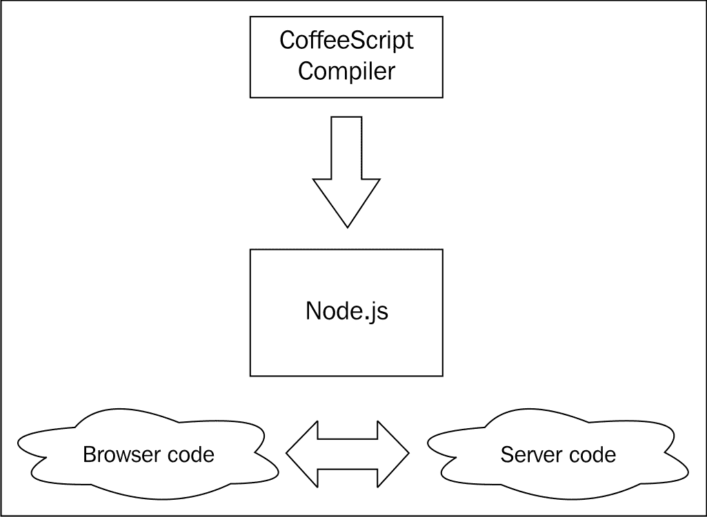

# Node.js 和 npm

Node.js 有自己的包管理系统，称为 npm。它用于安装和管理在 Node.js 生态系统中运行的包、库及其依赖项。这也是安装 CoffeeScript 的最常见方式，CoffeeScript 本身也作为 npm 包可用。因此，在设置好 Node.js 和 npm 之后，安装 CoffeeScript 实际上非常容易。

根据您的操作系统以及是否需要编译源代码，有不同的安装 Node.js 和 npm 的方法。后续各节将介绍各个操作系统的说明。

### 提示

Node.js 维基包含大量关于在众多平台上安装和运行 Node 的信息。如果在本章中遇到任何问题，您可以查看它，因为它有很多有关故障排除问题的提示，并经常更新；链接是 https://github.com/joyent/node/wiki/Installation。

# Windows 上的 Node.js、npm 和 CoffeeScript

Node.js 社区一直在努力提供良好的本地 Windows 支持，安装非常简单。

要这样做，首先转到 Node.js 网站（nodejs.org），然后单击“下载”按钮。您将看到几个可用的选项，但选择“Windows 安装程序”选项，如下截图所示：

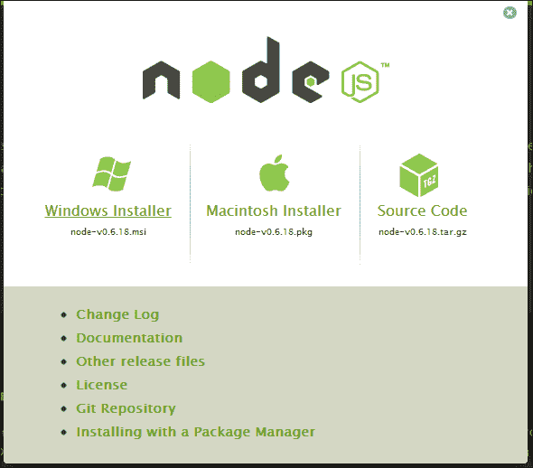

这将下载一个`.msi`文件。一旦下载完成，安装就变得非常简单；只需接受条款并单击“继续”。如果您看到以下屏幕，则已成功安装 Node：

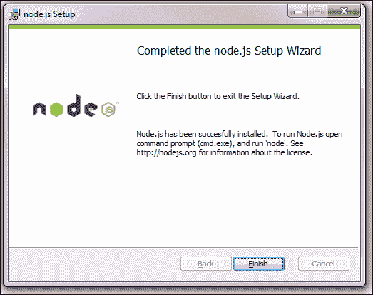

在这一点上，你可能需要注销 Windows 或重新启动，以便更改你的`$PATH`变量生效。完成后，你应该能够打开 DOS 命令提示符并运行以下命令：

```js
node –v 
```

这应该会输出一个版本，这意味着你可以开始了。让我们也检查一下 npm 是否正常工作。同样在命令行工具中，输入以下内容：

```js
npm
```

你应该会看到类似以下截图的内容：

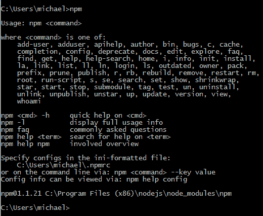

现在，为了继续安装 CoffeeScript，只需输入以下命令：

```js
npm install coffee-script
```

如果一切顺利，你应该会看到类似以下截图的内容：

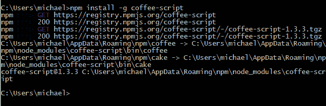

在这里，我使用了**-g**标志，它为所有用户安装了 npm 包。一旦你安装了 CoffeeScript，我们可以使用**coffee**命令进行测试，如下所示：

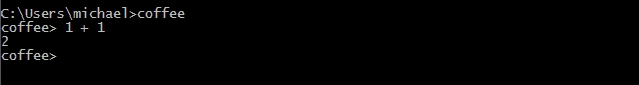

这是 CoffeeScript 解释器，正如你所看到的，你可以使用它来即时运行 CoffeeScript 代码。要退出，只需使用*Ctrl* + *C*。

就是这样！在 Windows 上安装 Node.js 非常快速和简单。

# 在 Mac 上安装 CoffeeScript

在 Mac 上安装 Node.js 有两种方式，一种是从 Node.js 网站下载`.pkg`文件，然后使用苹果的安装程序应用进行安装，另一种是使用**Homebrew**命令行包管理器。

最简单的方法是只安装`.pkg`文件，所以我们先来看看这个。安装 Homebrew 可能需要更多的工作，但如果你喜欢在命令行工具上工作并且想要从源代码构建 CoffeeScript，那么这是值得的。

## 使用苹果安装程序

前往 Node.js 网站([nodejs.org](http://nodejs.org))，然后点击**下载**按钮。你会看到一些可用的选项，但选择**Macintosh 安装程序**选项，如下截图所示：


这将下载一个`.pkg`文件。一旦你下载了它，运行安装就会变得非常容易；只需选择你的目的地，接受许可证，并点击**继续**。你应该选择使用**为这台计算机的所有用户安装**选项来为所有用户安装它，如下截图所示：

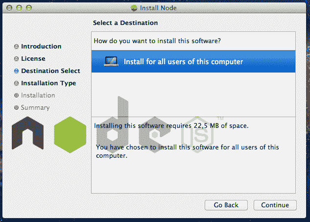

如果你看到以下屏幕，那么你已经成功安装了 Node：

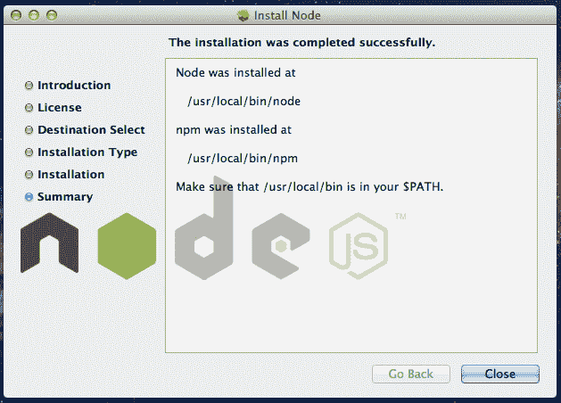

你还将安装 npm，我们将使用它来安装 CoffeeScript。跳转到*使用 npm 安装 CoffeeScript*部分。

## 使用 Homebrew

许多开发人员更喜欢在 Mac 上使用命令行工具工作，而 Homebrew 包管理器已经变得非常流行。它旨在让你轻松安装不随 Mac OS X 捆绑的 Unix 工具。

如果你喜欢使用 Homebrew 安装 Node.js，你需要在你的系统上安装 Homebrew。你可能还需要 XCode 命令行工具来构建 Node.js 源代码。Homebrew 维基包含了如何在[`github.com/mxcl/homebrew/wiki/installation`](https://github.com/mxcl/homebrew/wiki/installation)上运行它的说明。

如果你已经安装了 Homebrew，你可以使用**brew**命令安装 Node.js，如下截图所示：

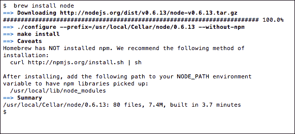

从输出中可以看出，Homebrew 没有安装 npm，没有 npm 我们无法安装 CoffeeScript。要安装 npm，你只需在终端中复制并粘贴以下命令：

```js
curl http://npmjs.org/install.sh |sh
```

安装 npm 后，你应该会看到类似以下屏幕的内容：

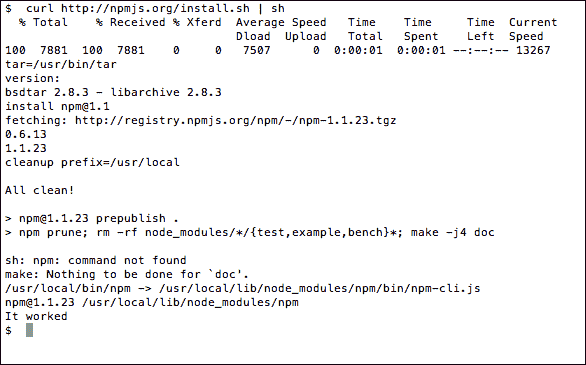

## 使用 npm 安装 CoffeeScript

现在我们已经安装了 npm，我们应该能够安装 CoffeeScript。只需在终端中输入以下命令：

```js
npm install –g coffee-script
```

**-g**标志让 npm 全局安装 CoffeeScript；一旦完成，您现在可以通过使用**coffee**命令来测试 CoffeeScript 是否正常工作，如下面的屏幕截图所示：

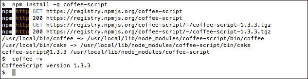

就是这样！在 Mac 上安装 CoffeeScript 非常容易。

# 在 Linux 上安装 CoffeeScript

在 Linux 上安装 Node.js 与 CoffeeScript 的方式取决于您安装了哪个发行版。大多数流行的发行版都有软件包，如果没有，您也可以尝试从源代码构建 CoffeeScript，如下一节所述。

我只有使用基于 Debian 的发行版的软件包管理器的经验，并且已成功使用**apt-get**软件包管理器安装了 Node.js 和 CoffeeScript。但是，您应该能够按照其他发行版的说明进行操作。

在 Ubuntu、MintOS 和 Debian 上有 Node.js 的 apt-get 软件包，但您需要在安装之前为它们添加源。安装每个软件包的说明将在以下部分中探讨。

## Ubuntu 和 MintOS

在命令行实用程序上输入以下内容（您可能需要有足够的权限来使用`sudo`）：

```js
sudo apt-get install python-software-properties
sudo apt-add-repository ppa:chris-lea/node.js
sudo apt-get update
sudo apt-get install nodejs npm 
```

## Debian

在 Debian 上，您通常会登录到 root 终端以安装软件包。登录后，输入以下命令：

```js
echo deb http://ftp.us.debian.org/debian/ sid main > /etc/apt/sources.list.d/sid.list
apt-get update
apt-get install nodejs npm
```

## 其他发行版

Node.js 的维基页面[`github.com/joyent/node/wiki/Installing-Node.js-via-package-manager`](https://github.com/joyent/node/wiki/Installing-Node.js-via-package-manager)包含了在各种 Linux 和 Unix 发行版上安装的说明，包括 Fedora、openSUSE、Arch Linux 和 FreeDSB。

## 使用 npm 安装 CoffeeScript

在您的软件包管理器完成其任务后，您现在应该已经安装了 Node.js 和 npm。您可以使用 npm **-v**命令来验证这一点。您现在可以使用 npm 安装 CoffeeScript，方法是输入以下命令：

```js
npm install –g coffee-script
```

`-g`标志告诉 npm 全局安装软件包。

以下屏幕截图显示了如何使用**-v**命令安装 CoffeeScript：

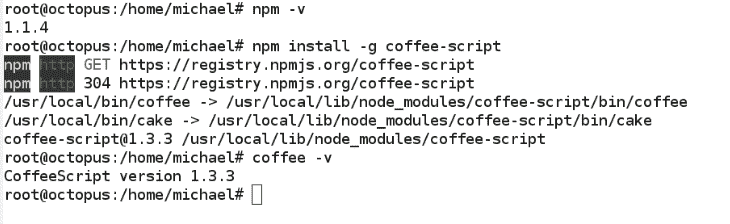

就是这样！在 Linux 上安装 CoffeeScript 非常容易。

# 从源代码构建 Node.js

如果您不想使用软件包管理器或安装程序，或者您的操作系统没有可用的软件包管理器或者您想获取最新版本的 Node.js，那么您也可以从源代码构建 Node.js。不过要注意，这个过程通常充满了危险，因为源代码通常需要系统上的一些依赖项来构建。

## 在 Linux 或 Unix 上构建

要在 Linux 或 Unix 环境中构建，您需要确保已安装以下源依赖项：

+   **Python–Version 2.6 或 Version 2.7**：您可以通过在命令提示符中输入`python --version`来检查是否已安装 Python，并检查安装了哪个版本。

+   **libssl-dev**：这通常可以使用内置软件包管理器安装。它已经安装在 OS X 上。

我将向您展示如何使用最新的源代码构建 Node.js。该源代码是使用流行的 Git 版本控制系统进行管理，并托管在[github.com](http://github.com)的存储库中。要从 github 拉取最新的源代码，您需要确保已安装 Git。通过使用`apt-get`，您可以这样安装它：

```js
apt-get install git-core
```

一旦您具备了这些先决条件，您应该能够构建节点。在命令行工具上输入以下命令：

```js
git clone https://github.com/joyent/node.git
cd node
git checkout v0.6.19 
./configure
make
sudo make install
```

哦！如果一切顺利，您应该能够使用 npm 安装 CoffeeScript：

```js
npm install –g coffee-script
```

## 在 Windows 上构建

尽管在 Windows 上构建 Node.js 是可能的，但我强烈建议您只需运行安装程序。在我在本书中提到的所有安装方式中，这是我没有亲自尝试过的唯一一种。这个例子直接来自 Node 维基（[`github.com/joyent/node/wiki/Installation`](https://github.com/joyent/node/wiki/Installation)）。显然，构建可能需要很长时间。在命令提示符中，输入以下内容：

```js
C:\Users\ryan>tar -zxf node-v0.6.5.tar.gz
C:\Users\ryan>cd node-v0.6.5
C:\Users\ryan\node-v0.6.5>vcbuild.bat release
C:\Users\ryan\node-v0.6.5>Release\node.exe
> process.versions
{ node: '0.6.5',
  v8: '3.6.6.11',
  ares: '1.7.5-DEV',
  uv: '0.6',
  openssl: '0.9.8r' }
>
```

# 使用 CoffeeScript

就是这样。为了获得 CoffeeScript 可能需要安装 Node.js 和 npm，这可能看起来需要很多努力，但您将体验到拥有一个出色的服务器端 JavaScript 框架和良好的命令行工具来编写 CoffeeScript 的强大功能。

既然您已经安装了 CoffeeScript，我们该如何使用它呢？您进入语言的主要入口点是`coffee`命令。

# coffee 命令

这个命令行实用程序就像 CoffeeScript 的瑞士军刀一样。您可以使用它以交互方式运行 CoffeeScript，将 CoffeeScript 文件编译为 JavaScript 文件，执行`.coffee`文件，监视文件或目录，并在文件更改时进行编译，以及其他一些有用的功能。执行该命令很容易，只需输入`coffee`以及一些选项和参数。

要获取所有可用选项的帮助，请使用**-h**或**--help**选项运行`coffee`。有关一些有用选项的列表显示在以下截图中：

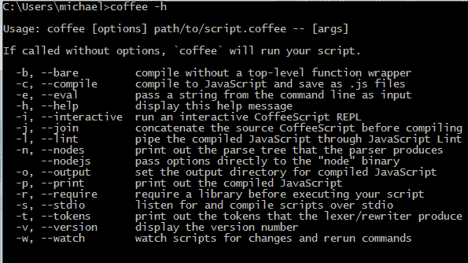

我们已经看到了**-v**选项，它将打印出 CoffeeScript 的当前版本。

## REPL

执行`coffee`没有参数或使用**-i**选项将使您进入 CoffeeScript 的**REPL**（**Read Eval Print Loop**）。从这里，您可以输入 CoffeeScript 代码，它将立即执行并在控制台中显示其输出。这对于玩转语言、探索一些核心 JavaScript 和 Node.js 库，甚至引入另一个外部库或 API 并能够进行交互式探索非常有用。

我建议你运行 coffee REPL，并尝试我们在上一章中讨论过的一些代码示例。注意每个表达式的输出是在输入后显示的。解释器还足够聪明，可以处理多行和嵌套表达式，比如函数定义。

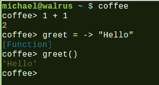

在上一张截图中，显示了解释器处理函数定义。

### 提示

要退出 REPL，使用*Ctrl* + *D*或*Ctrl* + *C*。

## 运行 .coffee 文件

在 REPL 中输入足够的代码后，您将会想要开始将您的 CoffeeScript 存储和组织在源文件中。CoffeeScript 文件使用`.coffee`扩展名。您可以通过将其作为参数传递给`coffee`命令来运行`.coffee`文件。文件中的 CoffeeScript 将被编译为 JavaScript，然后使用 Node.js 作为其环境执行。

### 提示

您可以使用任何文本编辑器来编写您的 CoffeeScript。许多流行的编辑器都具有插件或已经添加了对 CoffeeScript 的支持，包括语法高亮、代码补全，甚至允许您直接从编辑器中运行代码。在[`github.com/jashkenas/coffee-script/wiki/Text-editor-plugins`](https://github.com/jashkenas/coffee-script/wiki/Text-editor-plugins)上有一个支持 CoffeeScript 的文本编辑器和插件的全面列表。

## 编译为 JavaScript

要将 CoffeeScript 编译为 JavaScript，我们使用**-c**或**--compile**选项。它接受单个带有文件名或文件夹名的参数，或者多个文件和文件夹名。如果指定一个文件夹，它将编译该文件夹中的所有文件。默认情况下，JavaScript 输出文件将与源文件具有相同的名称，因此`foo.coffee`将编译为`foo.js`。

如果我们想要控制输出的 JavaScript 将被写入的位置，那么我们可以使用**-o**或**--output**选项加上一个文件夹名称。如果您正在指定多个文件或文件夹，那么您还可以使用**-j**或**--join**选项加上一个文件名。这将把输出合并成一个单独的 JavaScript 文件。

## 监视

如果您正在开发一个 CoffeeScript 应用程序，不断运行**--compile**可能会变得乏味。另一个有用的选项是**-w**或**--watch**。这告诉 CoffeeScript 编译器保持运行并监视特定文件或文件夹的任何更改。当与**--compile**结合使用时，这将在每次更改时编译文件。

## 将所有内容放在一起

`coffee`命令的一个很酷的地方是，标志可以组合在一起，创建一个非常有用的构建和开发环境。假设我有一堆 CoffeeScript 文件在一个源文件夹中，我想要在每次文件更改时将它们编译成`js`文件夹中的一个名为`output.js`的单个文件。

您应该能够使用类似以下命令：

```js
coffee –o js/ -j output.js –cw source/
```

这将监视源文件夹中`.coffee`文件的任何更改，并将它们编译并合并成一个名为**output.js**的单个文件，放在**js**文件夹中，如下面的屏幕截图所示：

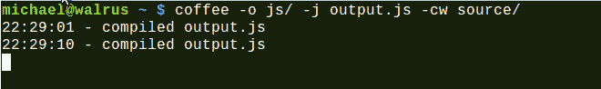

# 总结

在这一章中，您已经希望学会了如何在您选择的开发环境中运行 CoffeeScript。您还学会了如何使用`coffee`命令来运行和编译 CoffeeScript。现在您已经掌握了工具，我们将开始编写一些代码，并了解 CoffeeScript 的实际应用。让我们从 JavaScript 开始的地方开始，看看如何在浏览器中编写 CoffeeScript。
