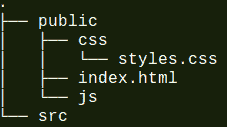
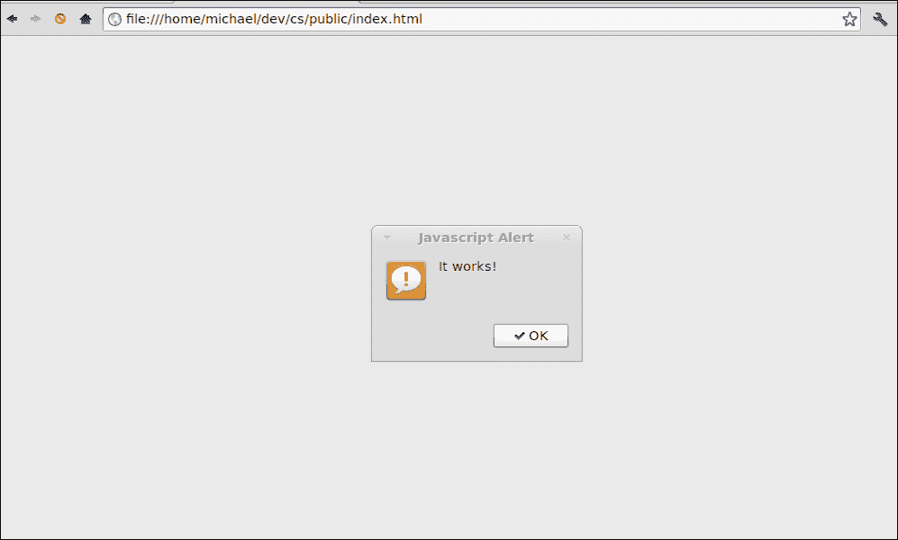
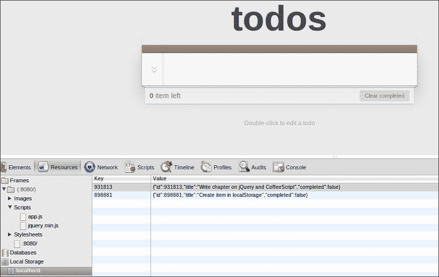

# 第三章：CoffeeScript 和 jQuery

**jQuery**是一个跨浏览器兼容的库，旨在简化 HTML 应用程序开发人员的生活。它由 John Resig 于 2006 年首次发布，自那以后已成为世界上最流行的 JavaScript 库，并在数百万个网站中使用。

为什么它变得如此受欢迎？嗯，jQuery 有一些不错的功能，如简单的 DOM 操作和查询、事件处理和动画，以及 AJAX 支持。所有这些结合在一起使得针对 DOM 编程和 JavaScript 编程变得更好。

该库在跨浏览器兼容性和速度方面也经过了高度优化，因此使用 jQuery 的 DOM 遍历和操作函数不仅可以节省您编写繁琐代码的时间，而且通常比您自己编写的代码快得多。

事实证明，jQuery 和 CoffeeScript 非常搭配，结合起来提供了一个强大的工具集，以简洁和表达力的方式编写 Web 应用程序。

在本章中，我们将做以下事情：

+   探索 jQuery 的一些高级功能，并讨论它给您带来了什么

+   学习如何在浏览器中使用 CoffeeScript 和 jQuery

+   使用 jQuery 和 CoffeeScript 构建一个简单的待办事项列表应用程序

让我们首先更详细地讨论 jQuery 库，并发现它的有用之处。

# 查找和更改元素

在 Web 浏览器中，DOM 或文档对象模型是用于与 HTML 文档中的元素进行编程交互的表示。

在 JavaScript 中，您会发现自己需要进行大量的 DOM 遍历，以查找您感兴趣的元素，然后对它们进行操作。

要使用标准的 JavaScript 库来实现这一点，通常需要使用`document.getElementsByName`、`document.getElementById`和`document.getElementsById`方法的组合。一旦您的 HTML 结构开始变得复杂，这通常意味着您将不得不在笨拙和繁琐的迭代代码中组合这些方法。

以这种方式编写的代码通常对 HTML 的结构做出了很多假设，这意味着如果 HTML 发生变化，它通常会中断。

## $函数

使用`$`函数（jQuery 的工厂方法，用于创建 jQuery 类的实例）和大部分库的入口点，许多这种命令式风格的代码变得更简单。

这个函数通常以 CSS 选择器字符串作为参数，该参数可用于根据元素名称、ID、类属性或其他属性值选择一个或多个元素。此方法将返回一个包含与选择器匹配的一个或多个元素的 jQuery 对象。

在这里，我们将使用`$`函数选择文档中所有具有`address`类的`input`标签：

```js
$('input .address')
```

然后，您可以使用多种函数来操作或查询这些元素，通常称为**命令**。以下是一些常见的 jQuery 命令及其用途：

+   `addClass`：这将向元素添加一个 CSS 类

+   `removeClass`：这从元素中删除一个 CSS 类

+   `attr`：这从元素中获取一个属性

+   `hasClass`：这检查元素上是否存在 CSS 类

+   `html`：这获取或设置元素的 HTML 文本

+   `val`：这获取或设置元素的值

+   `show`：这显示一个元素

+   `hide`：这隐藏一个元素

+   `parent`：这获取一个元素的父元素

+   `appendTo`：这附加一个子元素

+   `fadeIn`：这淡入一个元素

+   `fadeout`：这淡出一个元素

大多数命令返回一个 jQuery 对象，可以用来链接其他命令。通过链接命令，您可以使用一个命令的输出作为下一个命令的输入。这种强大的技术让您可以对 HTML 文档的部分进行非常简短和简洁的转换。

假设我们想要突出显示并启用 HTML 表单中的所有`address`输入；jQuery 允许我们做类似于这样的事情：

```js
$('input .address').addClass('highlighted').removeAttr('disabled')
```

在这里，我们再次选择所有具有`address`类的`input`标签。我们使用`addClass`命令为每个标签添加`highlighted`类，并通过链接到`removeAttr`命令来移除`disabled`属性。

# 实用函数

jQuery 还提供了许多实用函数，通常可以改善您日常的 JavaScript 编程体验。这些都是作为全局 jQuery 对象的方法的形式，如`$.methodName`。例如，其中一个最常用的实用程序是`each`方法，可用于迭代数组或对象，并且可以按如下方式调用（在 CoffeeScript 中）：

```js
$.each [1, 2, 3, 4], (index, value) -> alert(index + ' is ' + value)
```

jQuery 的实用方法涵盖了数组和集合的辅助方法，时间和字符串操作，以及许多其他有用的 JavaScript 和与浏览器相关的函数。许多这些函数源自许多 JavaScript 程序员的日常需求。

通常，您会发现一个适用于您自己在编写 JavaScript 或 CoffeeScript 时遇到的常见问题或模式的函数。您可以在[`api.jquery.com/category/utilities/`](http://api.jquery.com/category/utilities/)找到这些函数的详细列表。

# Ajax 方法

jQuery 提供了`$.ajax`方法来执行跨浏览器的 Ajax 请求。传统上，这一直是一个痛点，因为各种浏览器都实现了不同的接口来处理 Ajax。jQuery 处理了所有这些，并提供了一种更简单的基于回调的方式来构建和执行 Ajax 请求。这意味着您可以声明性地指定应该如何进行 Ajax 调用，然后提供函数，jQuery 将在请求成功或失败时回调。

# 使用 jQuery

在浏览器中使用 jQuery 非常简单；您只需要在 HTML 文件中包含 jQuery 库。您可以从他们的网站下载最新版本的 jQuery（[`docs.jquery.com/Downloading_jQuery`](http://docs.jquery.com/Downloading_jQuery)）并引用，或者您可以直接链接到**内容传送网络**（**CDN**）版本的库。

以下是一个示例。这段代码来自优秀的 HTML5 Boilerplate 项目（[`html5boilerplate.com/`](http://html5boilerplate.com/)）。在这里，我们包含了来自 Google CDN 的最新压缩版 jQuery，但如果从 CDN 引用失败，我们也将包含本地版本。

```js
<script src="img/jquery.min.js"></script>
    <script>window.jQuery || document.write('<script src="img/jquery-1.7.2.min.js"><\/script>')
</script>
```

# 在浏览器中使用 CoffeeScript 和 jQuery

在我们开始使用 jQuery 和 CoffeeScript 之前，让我们谈谈如何编写在浏览器中运行的 CoffeeScript 代码。

## 编译 CoffeeScript

为 Web 应用程序编译 CoffeeScript 的最常见方法是运行`coffee`命令，以监视一个或多个 CoffeeScript 文件的更改，然后将它们编译为 JavaScript。然后将输出包含在您的 Web 应用程序中。

例如，我们将组织我们的项目文件夹结构，看起来像以下文件夹结构：



'

**src**文件夹是您的 CoffeeScript 文件所在的位置。然后，我们可以启动一个 CoffeeScript 编译器来监视该文件夹，并将 JavaScript 编译到我们的**public/js**文件夹中。

这是 CoffeeScript 命令的样子：

```js
coffee -co public/js -w src/
```

在自己的终端窗口中保持此命令运行，并在保存文件时重新编译您的 CoffeeScript 文件。

### 提示

CoffeeScript 标签

在浏览器中运行 CoffeeScript 的另一种方法是在文档中包含内联的 CoffeeScript，包含在`<script type="text/coffeescript">`标签中，然后在文档中包含压缩的 CoffeeScript 编译器脚本（`coffee-script.js`）。这将编译并运行页面中的所有内联 CoffeeScript。

这并不是为了严肃使用，因为每次加载页面时都会为编译步骤付出严重的性能代价。然而，有时候在浏览器中快速玩一下 CoffeeScript 可能会非常有用，而不需要设置完整的编译器链。

## jQuery 和 CoffeeScript

让我们在我们的 CoffeeScript 文件中放一些东西，看看我们是否可以成功地将其与 jQuery 连接起来。在`src`文件夹中，创建一个名为`app.coffee`的文件，并包含以下代码：

```js
$ -> alert "It works!"
```

这设置了 jQuery 的`$(document).ready()`函数，该函数在应用程序初始化时将被调用。在这里，我们使用了它的简写语法，只需将一个匿名函数传递给`$`函数。

现在，你应该在`public/js`文件夹中有一个`app.js`文件，内容类似于这样：

```js
// Generated by CoffeeScript 1.3.3
(function() {
    alert('It works!');
}).call(this);
```

最后，我们需要在我们应用程序的 HTML 文件中包含这个文件以及 jQuery。在`public/index.html`文件中，添加以下代码：

```js
<!doctype html>
<html lang="en">
<head>
  <meta charset="utf-8">
  <meta http-equiv="X-UA-Compatible" content="IE=edge,chrome=1">
  <title>jQuery and CoffeeScript Todo</title>
  <link rel="stylesheet" href="css/styles.css">
</head>
<body>
  <script src="img/jquery.min.js"></script>
  <script src="img/app.js"></script>
</body>
</html>
```

上面的代码创建了我们的 HTML 骨架，并包含了 jQuery（使用 Google CDN）以及我们的应用程序代码。

### 提示

**下载示例代码**

您可以从您在[`www.PacktPub.com`](http://www.PacktPub.com)购买的所有 Packt 图书的帐户中下载示例代码文件。如果您在其他地方购买了本书，您可以访问[`www.PacktPub.com/`](http://www.PacktPub.com/)支持并注册，以便直接通过电子邮件接收文件。

## 测试全部

我们现在应该能够通过在浏览器中打开我们的`index.html`文件来运行我们的应用程序。如果一切顺利，我们应该看到我们的警报弹出窗口，如下面的截图所示：



## 运行本地 Web 服务器

虽然我们现在可以从磁盘轻松测试我们的 Web 应用程序，但是很快我们可能想要将其托管在本地 Web 服务器上，特别是如果我们想要开始进行 Ajax。由于我们已经安装了 Node.js，所以运行 Web 服务器应该非常容易，我们现在只需要为静态内容提供服务。幸运的是，有一个 npm 包可以为我们做到这一点；它名为**http-server**，可以在[`github.com/nodeapps/http-server`](https://github.com/nodeapps/http-server)找到。

要安装它，只需运行以下命令：

```js
npm install http-server -g
```

然后，我们通过导航到我们的应用程序文件夹并输入以下内容来执行它：

```js
http-server
```

这将在端口**8080**上托管 public 文件夹中的所有文件。现在，我们应该能够通过使用 URL `http://localhost:8080/`来访问我们托管的站点。

# 我们的应用程序

在本章的其余部分，我们将使用 CoffeeScript 构建一个 jQuery 应用程序。该应用程序是一个待办事项列表应用程序，可用于跟踪您的日常任务以及您如何完成它们。

## TodoMVC

我已经模仿了 TodoMVC 项目的一些源代码来建模应用程序，该项目属于公共领域。该项目展示了不同的 JavaScript MVC 框架，所有这些框架都用于构建相同的应用程序，在评估框架时可能非常有用。如果你想要查看它，可以在[`addyosmani.github.com/todomvc/`](http://addyosmani.github.com/todomvc/)找到。

### 注意

**MVC**，或者模型-视图-控制器，是一种广泛使用的应用程序架构模式，旨在通过将应用程序关注点分为三种领域对象类型来简化代码并减少耦合。我们将在本书的后面更详细地讨论 MVC。

我们将主要基于 TodoMVC 项目来构建我们的应用程序，以获得与之配套的令人赞叹的样式表以及精心设计的 HTML5 结构。然而，大部分客户端 JavaScript 将被重写为 CoffeeScript，并且为了说明的目的将被简化和修改很多。

所以，话不多说，让我们开始吧！

## 我们的初始 HTML

首先，我们将添加一些 HTML，以便我们可以输入待办事项并查看现有项目的列表。在`index.html`中，在包含的`script`标签之前，将以下代码添加到`body`标签中：

```js
<section id="todoapp">
    <header id="header">
      <h1>todos</h1>
      <input id="new-todo" placeholder="What needs to be done?" autofocus>
    </header>
    <section id="main">
      <ul id="todo-list"></ul>
    </section>
    <footer id="footer">
      <button id="clear-completed">Clear completed</button>
    </footer>
  </section> 
```

让我们简要地浏览一下前面标记的结构。首先，我们有一个带有`todoapp`ID 的部分，它将作为应用程序的主要部分。它包括一个`header`标签，用于创建新项目的输入，一个`main`部分，用于列出所有待办事项，以及一个`footer`部分，其中有**清除已完成**按钮。在我们在浏览器中打开这个页面之前，让我们从我们的`app.coffee`文件中删除之前的警报行。

当你导航到这个页面时，它看起来不怎么样。这是因为我们的 HTML 还没有被样式化。下载本章的`styles.css`文件，并将其复制到`public/css`文件夹中。现在它应该看起来好多了。

## 初始化我们的应用程序

大多数 jQuery 应用程序，包括我们的应用程序，都遵循类似的模式。我们创建一个`$(document).ready`处理程序，然后执行页面初始化，通常包括为用户操作挂接事件处理程序。让我们在我们的`app.coffee`文件中这样做。

```js
class TodoApp
  constructor: ->
    @bindEvents()

  bindEvents: ->
    alert 'binding events'

$ ->
  app = new TodoApp()
```

在前面的代码片段中，我们创建了一个名为`TodoApp`的类，它将代表我们的应用程序。它有一个构造函数，调用`bindEvents`方法，目前只显示一个警报消息。

我们设置了 jQuery 的`$(document).ready`事件处理程序来创建我们的`TodoApp`的一个实例。当你重新加载页面时，你应该会看到**绑定事件**的警报弹出窗口。

### 提示

**没有看到预期的输出？**

记得要留意后台运行的咖啡编译器的输出。如果有任何语法错误，编译器会输出错误消息。一旦你修复了它，编译器应该会重新编译你的新 JavaScript 文件。记住，CoffeeScript 对空白很敏感。如果遇到任何你不理解的错误，请仔细检查缩进。

## 添加待办事项

现在我们可以添加事件处理来实际将待办事项添加到列表中。在我们的`bindEvents`函数中，我们将选择`new-todo`输入并处理它的`keyup`事件。我们将绑定它来调用我们类的`create`方法，我们也将去定义它；这在下面的代码片段中显示：

```js
  bindEvents: ->
    $('#new-todo').on('keyup', @create)

  create: (e) ->
    $input = $(this)
    val = ($.trim $input.val())
    return unless e.which == 13 and val
    alert val
    # We create the todo item
```

`$('#new-todo')`函数使用 jQuery 的 CSS 选择器语法来获取具有`new-todo`ID 的输入，`on`方法将`create`方法绑定到它的`'keyup'`事件，每当输入有焦点时按下键时触发。

在`create`函数中，我们可以通过使用`$(this)`函数来获取输入的引用，它将始终返回生成事件的元素。我们将这个赋给`$input`变量。在分配 jQuery 变量时，使用以`$`为前缀的变量名是一种常见的约定。然后我们可以使用`val()`函数获取输入的值，并将其赋给一个本地的`val`变量。

我们可以通过检查`keyup`事件的`which`属性是否等于`13`来判断*Enter*键是否被按下。如果是，并且`val`变量不是`null`，我们可以继续创建待办事项。现在，我们只会使用警报消息输出它的值。

一旦我们创建了项目，我们应该把它放在哪里？在许多传统的 Web 应用程序中，这些数据通常会使用 Ajax 请求存储在服务器上。我们希望现在保持这个应用程序简单，暂时只在客户端保留这些项目。HTML5 规范为我们定义了一个叫做**localStorage**的机制，可以做到这一点。

### 使用 localStorage

`localStorage`是新的 HTML5 规范的一部分，允许你在浏览器中存储和检索对象的本地数据库。接口非常简单；在支持的浏览器中，会存在一个名为`localStorage`的全局变量。这个变量有以下三个重要的方法：

```js
localStorage.setItem(key, value)
localStorage.getItem(key)
localStorage.removeItem(key)
```

`key`和`value`参数都是字符串。存储在`localStorage`变量中的字符串即使在页面刷新时也会保留。在大多数浏览器中，你可以在`localStorage`变量中存储多达 5MB 的数据。

因为我们想将待办事项存储为一个复杂的对象而不是一个字符串，所以在设置和从`localStorage`获取项目时，我们使用了常用的将对象转换为 JSON 对象的技术。为此，我们将在`Storage`类的原型中添加两个方法，然后这些方法将在全局`localStorage`对象上可用。在我们的`app.coffee`文件的顶部添加以下代码片段：

```js
Storage::setObj = (key, obj) ->
  @setItem key, JSON.stringify(obj)

Storage::getObj = (key) ->
  JSON.parse @getItem(key)
```

在这里，我们使用`::`运算符将`setObj`和`getObj`方法添加到`Storage`类中。这些函数通过将对象转换为 JSON 来包装`localStorage`对象的`getItem`和`setItem`方法。

现在我们终于准备好创建我们的待办事项并将其存储在`localStorage`中。

这是我们`create`方法的其余部分：

```js
  create: (e)->
    $input = $(this)
    val = ($.trim $input.val())
    return unless e.which == 13 and val

 randomId = (Math.floor Math.random()*999999)

 localStorage.setObj randomId,{
 id: randomId
 title: val
 completed: false
 }
 $input.val ''

```

为了唯一标识任务，我们将使用最简单的方法，只生成一个大的随机数作为 ID。这不是最复杂的标识文档的方法，您可能不应该在生产环境中使用这种方法。但是，它很容易实现，并且暂时很好地满足了我们的目的。

生成 ID 后，我们现在可以使用我们的`setObj`方法将待办事项放入我们的本地数据库。我们传入了一个从`input`标签值中获取的标题，并将项目默认为未完成。

最后，我们清除了`$input`的值，以便用户可以直观地看到`create`是成功的。

我们现在应该能够测试我们的小应用程序，并查看待办事项是否被存储到`localStorage`中。谷歌 Chrome 开发者工具将允许您在**资源**选项卡中检查`localStorage`。添加几个任务后，您应该能够在这里看到它们，如下面的截图所示：



## 显示待办事项

现在我们可以存储一个待办事项列表，如果我们能在屏幕上看到它们就更好了。为此，我们将添加一个`displayItems`方法。这将遍历待办事项的本地列表并显示它们。

在我们的`TodoApp`中添加以下代码，放在`create`方法之后：

```js
displayItems: ->
    alert 'displaying items'
```

现在我们应该能够从`create`方法中调用这个方法，如下面的代码所示：

```js
  create: (e) ->
    $input = $(this)
    val = ($.trim $input.val())
    return unless e.which == 13 and val

    randomId = (Math.floor Math.random()*999999)

    localStorage.setObj randomId,{
      id: randomId
      title: val
      completed: false
    }
    $input.val ''
 @displayItems()

```

让我们运行这段代码看看会发生什么。当我们这样做时，我们会得到以下错误：

**Uncaught TypeError: Object #<HTMLInputElement> has no method 'displayItems'**

这里发生了什么？似乎对`@displayItems()`的调用试图在`HTMLInputElement`的实例上调用该方法，而不是在`TodoApp`上调用。

这是因为 jQuery 会将`this`的值设置为引发事件的元素。当我们将类方法绑定为事件处理程序时，jQuery 实际上会“劫持”`this`，使其不指向类本身。这是在使用 jQuery 和 CoffeeScript 中应该知道的一个重要注意事项。

为了修复它，我们可以在设置`keyup`事件处理程序时使用 CoffeeScript 的 fat 箭头，这将确保`this`的值保持不变。让我们修改我们的`bindEvents`方法，使其看起来类似于以下代码：

```js
  bindEvents: ->
 $('#new-todo').on('keyup',(e) => @create(e))

```

只剩下一件事了；在我们的`createItem`方法中，我们使用`$(this)`来获取引发事件的`input`元素的值。由于切换到了 fat 箭头，现在这将指向我们的`TodoApp`实例。幸运的是，传递的事件参数有一个 target 属性，也指向我们的输入。将`create`方法的第一行更改为以下代码片段：

```js
  create: (e) ->
 $input = $(e.target)
    val = ($.trim $input.val())
```

现在，当我们创建一个项目时，我们应该看到“显示项目”警报，这意味着`displayItems`方法已经正确连接。

我们可以做得更好。由于每次触发`create`方法时都需要查找`$input`标签，我们可以将其存储在一个类变量中，以便可以重复使用。

这个最好放在应用程序启动时。让我们创建一个`cacheElements`方法来做到这一点，并在构造函数中调用它-这在下面的代码中有所突出：

```js
class TodoApp

  constructor: ->
 @cacheElements()
    @bindEvents()

 cacheElements: ->
 @$input = $('#new-todo')

  bindEvents: ->
 @$input.on('keyup',(e) => @create(e))

  create: (e) ->
 val = ($.trim @$input.val())
    return unless e.which == 13 and val

    randomId = (Math.floor Math.random()*999999)

    localStorage.setObj randomId,{
      id: randomId
      title: val
        completed: false
    }
 @$input.val ''
 @displayItems()
```

`cacheElements`调用分配了一个名为`@$input`的类变量，然后在我们的类中使用它。这种`@$`语法一开始可能看起来很奇怪，但它可以用几个按键传达很多信息。

## 显示待办事项

现在我们应该能够显示项目了。在`displayItems`方法中，我们将遍历所有`localStorage`键，并使用它们获取每个对应的待办事项。对于每个项目，我们将向`todo-list` ID 的`ul`元素添加一个`li`子元素。在开始使用`$('#todo-list')`元素之前，让我们像我们对`@$input`所做的那样缓存它的值：

```js
  cacheElements: ->
    @$input = $('#new-todo')
 @$todoList = $('#todo-list')
  displayItems: ->
 @clearItems()
 @addItem(localStorage.getObj(id)) for id in Object.keys(localStorage)

 clearItems: ->
 @$todoList.empty()

 addItem: (item) ->
 html = """
 <li #{if item.completed then 'class="completed"' else ''} data-id="#{item.id}">
 <div class="view">
 <input class="toggle" type="checkbox" #{if item.completed then 'checked' else ''}>
 <label>#{item.title}</label>
 <button class="destroy"></button>
 </div>
 </li> 
 """
 @$todoList.append(html)

```

在这里，我们稍微修改了`displayItems`方法。首先，我们从`$@todoList`中删除任何现有的子列表项，然后我们循环遍历`localStorage`中的每个键，获取具有该键的对象，并将该项目发送到`addItem`方法。

`addItem`方法构建了待办事项的 HTML 字符串表示，然后使用 jQuery 的`append`函数将子元素附加到`$@todoList`。除了标题的标签之外，我们还创建了一个复选框来设置任务为已完成，并创建了一个按钮来删除任务。

注意`li`元素上的`data-id`属性。这是 HTML5 数据属性，它允许您向任何元素添加任意数据属性。我们将使用它将每个`li`链接到`localStorage`对象中的待办事项。

### 注意

虽然 CoffeeScript 可以使构建 HTML 字符串变得更容易一些，但在客户端代码中定义标记很快就会变得繁琐。我们在这里主要是为了说明目的而这样做；最好使用 JavaScript 模板库，比如 Handlebars（[`handlebarsjs.com/`](http://handlebarsjs.com/)）。

这些类型的库允许您在您的标记中定义模板，然后使用特定上下文编译它们，然后为您提供一个漂亮格式的 HTML，然后您可以将其附加到元素上。

最后一件事，现在我们可以在创建项目后显示项目，让我们将`displayItems`调用添加到构造函数中，以便我们可以显示现有的待办事项；这个调用在下面的代码中突出显示：

```js
  constructor: ->
    @cacheElements()
    @bindEvents()
 @displayItems()

```

## 移除和完成项目

让我们连接移除任务按钮。我们为它添加一个事件处理程序如下：

```js
  bindEvents: ->
    @$input.on('keyup',(e) => @create(e))
 @$todoList.on('click', '.destroy', (e) => @destroy(e.target)) 

```

在这里，我们处理`@$todoList`上任何子元素的点击事件，带有`.destroy`类。

我们再次使用胖箭头创建处理程序，调用`@destroy`方法并传入目标，这应该是被点击的**destroy**按钮。

现在，我们需要使用以下代码片段创建`@destroy`方法：

```js
  destroy: (elem) ->
    id = $(elem).closest('li').data('id')
    localStorage.removeItem(id)
    @displayItems()
```

`closest`函数将找到距离按钮最近定义的`li`元素。我们使用 jQuery 的`data`函数检索其`data-id`属性，然后我们可以使用它从`localStorage`中删除待办事项。还要调用一次`@displayItems`来刷新视图。

完成项目将遵循非常相似的模式；也就是说，我们添加一个事件处理程序，如下面的代码中所示：

```js
  bindEvents: ->
    @$input.on('keyup',(e) => @create(e))
    @$todoList.on('click', '.destroy', (e) => @destroy(e.target))
 @$todoList.on('change', '.toggle', (e) => @toggle(e.target))

```

这次我们处理了`'change'`事件，每当选中或取消选中已完成复选框时都会触发。这将调用`@toggle`方法，其代码如下：

```js
  toggle: (elem) ->
    id = $(elem).closest('li').data('id')
    item = localStorage.getObj(id)
    item.completed = !item.completed
    localStorage.setObj(id, item)
```

这个方法还使用`closest`函数来获取待办事项的 ID。它从`localStorage`中加载对象，切换`completed`的值，然后使用`setObj`方法将其保存回`localStorage`。

## 现在轮到你了！

作为最后的练习，我要求您使**清除已完成**按钮起作用。

# 总结

在本章中，我们了解了 jQuery 是什么，以及它的优势和好处是什么。我们还学习了如何将 jQuery 的强大功能与 CoffeeScript 结合起来，以更少的工作量和复杂性编写复杂的 Web 应用程序。jQuery 是一个非常庞大的库，我们只是触及了它所提供的一小部分。我建议您花一些时间学习库本身，并使用 CoffeeScript 进行学习。

接下来，我们将首先看一下如何使用 CoffeeScript 和 Rails 开始与服务器端代码进行交互。
