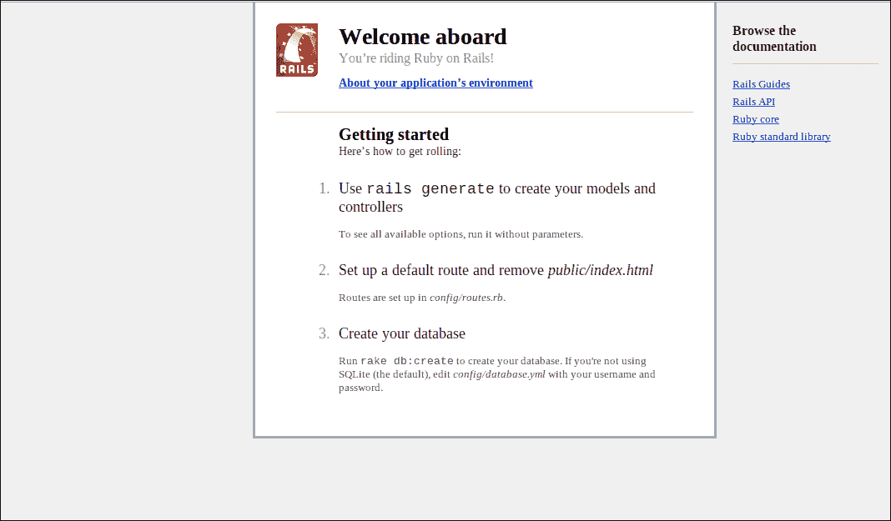
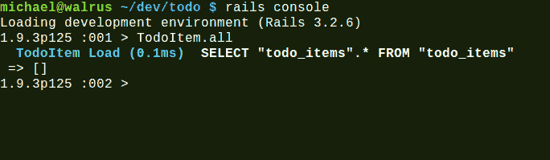
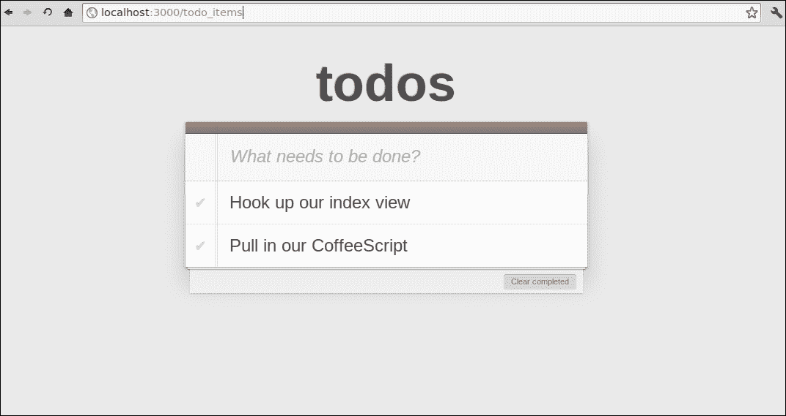

# 第四章：CoffeeScript 和 Rails

Ruby on Rails 是一个于 2004 年出现的 Web 框架。它是由 David Heinemeier Hansson 编写的，并从**Basecamp**中提取出来，这是他为他的公司**37signals**用 Ruby 编写的项目管理 Web 应用程序。

Rails 立即给许多人留下了深刻的印象，因为他们可以轻松快速地编写 Web 应用程序，并很快变得非常受欢迎。

在开发时，Ruby 是一个来自日本的鲜为人知的脚本语言。Ruby 实际上是 Rails 如此成功的原因。它已被证明是一种强大而简洁的编程语言，许多程序员表示它让编程再次变得有趣。

# Rails 的特殊之处在哪里？

Rails 推动了 Web 开发人员编写应用程序的方式。其核心理念包括以下两个重要原则：

+   约定优于配置

+   不要重复自己，或者 DRY

## 约定优于配置

Rails 旨在假定程序员将遵循某些已知的约定，如果使用这些约定，将提供巨大的好处，并且几乎不需要配置框架。它通常被称为一种有主见的框架。这意味着框架对典型应用程序的构建和结构有假设，并且不试图过于灵活和可配置。这有助于您花费更少的时间在配置和连接应用程序架构等琐事上，而更多的时间实际构建您的应用程序。

例如，Rails 将使用与其名称对应的对象对数据库中的表进行建模，因此`Transactions`数据库中的记录将自动映射到`Transactions`类实例，`people`数据库表中的记录也将自动映射到`Person`类实例。

Rails 通常会使用约定来为您做一些聪明的事情。比如说，我们的`people`表还有一个名为`created_at`和`updated_at`的`datetime`字段。Rails 将聪明地在记录创建或更新时自动更新这两个字段的时间戳。

Rails 约定的最重要的事情是你应该了解它们，不要与框架对抗，或者试图过多地偏离 Rails 的方式，除非有充分的理由。通常，这可能会抵消您从这些约定中获得的任何好处，甚至使您更难以尝试解决问题。

## 不要重复自己（DRY）

这个软件工程原则也可以表述为：

> 系统中的每个知识都必须具有单一、明确和权威的表示。

这意味着 Rails 努力在任何可能的地方消除重复和样板。

例如，模拟`people`表中的记录的`Person`类将不需要定义其字段，因为它们已经在数据库表中定义为列。在这里，Rails 可以利用 Ruby 的强大的元编程能力，神奇地向`Person`类添加与数据库中的列对应的属性。

### 注意

**元编程**是编写对其他代码起作用的代码的概念。换句话说，元编程是编写编写代码的代码。它在 Ruby 社区和特别是 Rails 源代码中被广泛使用。

Ruby 语言具有非常强大的元编程能力，与开放类和对象的概念相关联，这意味着您可以轻松地“打开”现有的类定义并重新定义和添加成员。

# Rails 和 JavaScript

很长一段时间，Rails 都使用`Prototype.js`和`Script.aculo.us` JavaScript 库进行 AJAX、页面动画和特效。

Rails 有视图助手的概念——这些是可以在视图中使用的 Ruby 方法，用于抽象出常见的 HTML 构造。许多处理客户端代码和 AJAX 的视图助手都是建立在这两个框架之上的，因此它们完全融入了框架，没有使用替代方案的简单方法。

`Prototype.js`与 jQuery 有许多相同的想法和目标，但随着时间的推移，jQuery 被许多程序员认为是一个更加优雅和强大的库。

随着 jQuery 变得越来越受欢迎，许多 Rails 社区的开发人员开始尝试使用 jQuery 代替默认的 JavaScript 库。一套标准的库或**gems**出现了，用于用 jQuery 替换内置的 Prototype 库。

在 Rails 3.1 版本中，宣布 jQuery 将成为默认的 JavaScript 库。因为 jQuery 已经具有大部分`Script.aculo.us`的动画和页面效果功能，所以这个库也不再需要了。

这一举措似乎已经等了很长时间，并且基本上得到了大多数 Rails 社区的祝福。

# Rails 和 CoffeeScript

Rails 3.1 的另一个重要新增功能是资产管道。其主要目标是使在 Rails 应用中处理 JavaScript 和 CSS 等资产变得更加容易。在此之前，JavaScript 和 CSS 只是作为静态内容提供。它还提供了一个组织框架，帮助你组织 JavaScript 和 CSS，并提供了一个用于访问它们的 DSL。

使用资产管道，你可以使用清单文件组织和管理资产之间的依赖关系。Rails 还将使用管道来缩小和连接 JavaScript，并为缓存清除应用指纹。

资产管道还有一个预处理器链，可以让你在提供文件之前通过一系列的输入-输出处理器运行文件。它知道使用文件扩展名来运行哪些预处理器。

在发布 Rails 3.1 之前，宣布 CoffeeScript 编译器将通过资产管道进行支持。这是一个巨大的宣布，因为 CoffeeScript 仍然是一种相当年轻的语言，并且在 Rails 社区内引起了一些争议，一些人为他们不想学习或使用这种新语言而感到惋惜。

Rails 的维护者们一直坚持自己的立场，目前在 Rails 中使用 CoffeeScript 变得非常容易。CoffeeScript 成为编写客户端 JavaScript 代码的默认语言，这对 CoffeeScript 来说是一个巨大的推动力，许多 Rails 开发人员已经开始了解并接受了这种语言。

我们一直在谈论 Rails 有多么美妙，以及它与 CoffeeScript 的良好配合，所以让我们安装 Rails，这样你就可以亲自看看到底是怎么回事。

# 安装 Rails

根据你的操作系统、你想要使用的 Ruby 版本、是否使用版本管理器、是否从源代码构建以及其他几十种选项，你可以在开发机器上安装 Ruby 和 Rails 的许多不同方式。在本书中，我们只会简要介绍在 Windows、Mac 和 Linux 上安装它的最常见方式。请注意，在本书中，我们将使用至少 3.2 及更高版本的 Rails 和 1.9.2 及更高版本的 Ruby。

## 使用 RailsInstaller 安装 Rails

在 Windows 上，或者在 Mac 上，我建议使用**RailsInstaller** ([`railsinstaller.org/`](http://railsinstaller.org/))。它包含了开始使用 Rails 所需的一切，包括最新版本的 Ruby 本身。下载安装程序后，安装过程非常简单；只需运行它并按照向导进行操作。安装完成后，你应该会看到一个打开的控制台命令提示符。尝试输入`rails -v`。如果你看到一个版本号，那么你就可以开始了。

## 使用 RVM 安装 Rails

在 Mac 和 Linux 上安装 Ruby 和 Rails 可能非常容易，使用**RVM**或**Ruby Version Manager**，从[`rvm.io/`](https://rvm.io/)。

在过去几年中，Ruby 语言已经变得非常流行，这导致编写了多个可以在不同平台上运行的语言实现。**Matz's Ruby Interpreter**（**MRI**），Ruby 的标准实现，也经历了几个版本。RVM 非常适合管理和安装不同版本的 Ruby。它配备了一个一站式安装程序 bash 脚本，可以安装最新的 Ruby 和 Rails。只需从终端运行以下命令：

```js
curl -L https://get.rvm.io | bash -s stable --rails
```

这可能需要相当长的时间才能完成。完成后，您应该尝试在终端中输入`rails -v`。如果您看到至少 3.2 的版本号，那么您应该可以继续了。

## 已安装 Rails？

现在我们已经安装了 Rails，让我们继续使用 CoffeeScript 构建一个应用程序。

如果您遇到任何问题或需要更多关于安装 Rails 的信息，最好的起点是 Ruby on Rails 网站的**下载**部分（[`rubyonrails.org/download`](http://rubyonrails.org/download)）。

# 开发我们的 Rails 应用程序

我们将使用现有的待办事项列表应用程序的部分内容，并使用 Rails 扩展它，添加一个服务器端后端。如果您没有在上一章中跟随，那么您应该能够根据需要复制该章节的代码。

### 注意

本章不旨在对 Ruby on Rails 或 Ruby 语言进行完整介绍。在这里，我们想专注于在使用 CoffeeScript 的情况下构建简单的 Rails 应用程序。

我们不会详细介绍所有内容，并且我们相信 Ruby 是一种非常简单和可读的语言，Rails 代码也很容易理解。即使您不熟悉该语言和框架，也不应该太难跟上。

首先，我们将通过使用`rails`命令创建一个空的基本 Rails 应用程序。转到要创建应用程序的文件夹，然后运行此命令：

```js
rails new todo
```

这将创建一个`todo`文件夹，其中包含用于 Web 应用程序的大量文件和文件夹。遵循惯例，Rails 将以一定的方式组织您的 Web 应用程序。

### 注意

`rails`命令用于许多事情，除了生成新应用程序之外，还作为您进入许多日常 Rails 任务的入口点。我们将在本书中涵盖其中的一些内容，如果您想查看它可以做什么的完整列表，可以运行`rails -h`。

让我们简要谈谈 Rails 如何组织我们的应用程序。您的大部分应用程序代码可能都位于顶级`app`文件夹中。此文件夹包含以下四个重要的子文件夹：

+   `资产：`这是资产管道操作的文件夹。这是您的 CoffeeScript（或 JavaScript）和 CSS 源代码，以及我们的 Web 应用程序使用的图像的位置。

+   `控制器`：这是您的控制器所在的位置。它们负责处理应用程序的路由请求，并与视图和模型进行交互。

+   `模型`：这是您将找到领域模型的位置。模型代表系统中的领域对象，并使用`ActiveRecord`基类对应数据库表。

+   `视图`：此文件夹包含用于呈现应用程序 HTML 的视图模板。默认情况下，Rails 使用 ERB 模板，允许我们在 HTML 模板中包含 Ruby 代码片段，这些代码将被评估以生成最终输出的 HTML。

## MVC

**MVC**，或**Model-View-Controller**，是一种广泛使用的应用程序架构模式，旨在通过将应用程序关注点分为三种领域对象类型来简化代码并减少耦合。

Rails 非常密切地遵循 MVC 模式，大多数 Rails 应用程序在模型、控制器和视图方面都会有很强的结构。

在 MVC 之上的另一个模式是“fat models, skinny controllers”，这是在过去几年中被许多 Rails 程序员所推崇的。这个概念鼓励将大部分领域逻辑放在模型中，并且控制器只关注路由和模型与视图之间的交互。

## 运行我们的应用程序

在这个阶段，我们已经可以运行我们的 Rails 应用程序，看看是否一切正常。从终端输入：

```js
cd todo
rails server
```

Rails 现在将在端口**3000**上为我们的应用程序托管一个本地 Web 服务器。您可以通过浏览`http://localhost:3000/`来测试它。如果一切顺利，您应该会看到以下友好的欢迎消息：



### 提示

记得在我们测试应用程序时，将此服务器保持在单独的控制台窗口中运行。您还可以检查此过程的输出，以查看运行时可能发生的任何错误。

## 我们的 todo_items 资源

因此，我们现在有一个正在运行的应用程序，但除了显示欢迎页面外，它并没有做太多事情。

为了实现跟踪待办任务的目标，我们将为待办事项生成一个资源。在 Rails 术语中，资源包括一个模型、一个带有一些操作的控制器，以及用于这些操作的视图。

在终端上运行以下命令：

```js
rails generate resource todo_item title:string completed:boolean
```

这样做有什么作用？这是 Rails 生成器语法的一个例子，可以用来生成样板代码。在这里，我们告诉它创建一个名为`TodoItemsController`的“资源”控制器和一个名为`TodoItem`的模型，该模型具有一个`string`字段作为标题和一个`boolean`标志来标记它是否已完成。

从命令输出中可以看到，它生成了一堆文件，并修改了一个现有文件，在`config/routes.rb`中。让我们首先打开这个文件。

## routes.rb

以下是您应该在`routes.rb`文件顶部看到的内容：

```js
Todo::Application.routes.draw do
 resources :todo_items

```

在 Rails 中，`routes.rb`定义了 HTTP 调用 URL 与可以处理它们的控制器操作之间的映射关系。

在这里，生成器为我们添加了一行，使用了`resources`方法。此方法使用 HTTP 动词 GET、POST、PUT 和 DELETE 为应用程序中的“资源”控制器创建路由。这意味着它使用 HTTP 动词在应用程序中公开单个域资源。

通常，这将为七个不同的控制器操作创建路由，`index`、`show`、`new`、`create`、`edit`、`update`和`destroy`。正如您将在后面看到的，我们不需要为我们的控制器创建所有这些操作，因此我们将告诉`resources`方法仅筛选出我们想要的操作。修改文件，使其看起来像以下代码片段：

```js
Todo::Application.routes.draw do
 resources :todo_items, only: [:index, :create, :update, :destroy]

```

## 控制器

在对`resources`的调用中，Rails 使用`:todo_items`符号来按照惯例将`resources`方法映射到`TodoItemsController`，这也是为我们生成的。

打开`app/controllers/todo_items_controller.rb`文件；您将看到以下内容：

```js
class TodoItemsController < ApplicationController
end
```

如您所见，这里并没有太多内容。声明了一个名为`TodoItemController`的类，并且它派生自`ApplicationController`类。当我们创建应用程序时，还为我们生成了`ApplicationController`类，并且它派生自`ActionController::Base`，这使它具有大量功能，并使其可以像 Rails 控制器一样运行。

我们现在应该能够通过导航到`http://localhost:3000/todo_items` URL 来测试我们的控制器。

你看到了什么？您应该会收到**未知操作**错误页面，指出`TodoItemsController`找不到`index`操作。

这是因为控制器尚未定义`index`操作，如我们的`routes.rb`文件中所指定的。让我们继续向`TodoItemsController`类添加一个方法来处理该操作；以下是示例代码片段：

```js
class TodoItemsController < ApplicationController
 def index
 end
end
```

如果我们刷新页面，我们会得到一个不同的错误消息：**模板丢失**。这是因为我们没有 `index` 动作的模板。默认情况下，Rails 总是会尝试返回与 `index` 动作名称对应的呈现模板。让我们继续添加一个。

## 视图

Rails 视图保存在 `app/views` 文件夹中。每个控制器都会在这里有一个包含其视图的子文件夹。我们已经有一个来自上一章的 `index.html` 文件，我们将在这里重用。为了做到这一点，我们需要将旧的 `index.html` 文件中 `body` 标签内的所有内容（不包括最后两个 `script` 标签）复制到一个名为 `app/views/todo_items/index.html.erb` 的文件中。

你应该最终得到以下标记：

```js
<section id="todoapp">
  <header id="header">
    <h1>todos</h1>
    <input id="new-todo" placeholder="What needs to be done?" autofocus>
  </header>
  <section id="main">
    <ul id="todo-list">

    </ul>
  </section>
  <footer id="footer">
      <button id="clear-completed">Clear completed</button>
  </footer>
</section>
```

看到这里，你可能会想知道其他 HTML 的部分，比如封闭的 `html`、`head` 和 `body` 标签去了哪里。

嗯，Rails 有一个布局文件的概念，它作为所有其他视图的包装器。这样你就可以为你的站点拥有一个一致的骨架，而不需要为每个视图创建。我们的视图将嵌入到默认布局文件中：`app/views/layouts/application.html.erb`。让我们来看看那个文件：

```js
<!DOCTYPE html>
<html>
<head>
  <title>Todo</title>
  <%= stylesheet_link_tag    "application", :media => "all" %>
  <%= javascript_include_tag "application" %>
  <%= csrf_meta_tags %>
</head>
<body>

<%= yield %>

</body>
</html>
```

`stylesheet_link_tag` 和 `javascript_include_tag` 方法将确保在 HTML 中包含在 `assets` 文件夹中指定的所有文件。`<%= yield %>` 行是当前视图将被呈现的地方，这在我们的情况下是 `index.html.erb`。

现在刷新页面，我们会看到 `index` 页面。查看源代码，了解最终的 HTML 输出。

正如你所看到的，我们的页面仍然没有样式，看起来相当沉闷。让我们看看是否可以再次让它看起来漂亮。

## CSS

默认情况下，资产管道将在 `app/assets/stylesheets` 文件夹中查找 CSS 文件。当我们浏览到这个文件夹时，我们会看到一个名为 `todo_items.css.scss` 的文件，这是在我们创建控制器时为我们生成的。

将上一章的 `styles.css` 文件的内容复制到这个文件中。我们的 `index` 页面现在应该看起来还不错。

### 注意

这个带有奇怪 `.css.scss` 扩展名的文件是一个 Saas 文件（[`sass-lang.com/`](http://sass-lang.com/)）。

与 CoffeeScript 一样，Sass 是普通 CSS 语言的扩展版本，具有许多使编写 CSS 更容易和不那么重复的好功能。

与 CoffeeScript 一样，它是 Rails 资产管道中的默认 CSS 编译器。我们使用的 Sass 变体是 CSS 的超集，这意味着我们可以在这个文件中使用普通的 CSS 而不使用任何 Sass 功能，它也可以正常工作。

## 我们的模型

现在我们可以看到我们的待办事项列表，但没有任何项目显示出来。这一次，我们不会将它们存储在本地，而是将它们存储在数据库中。幸运的是，当我们创建资源和 `TodoItem` 模型时，已经为我们生成了一个数据库模型，它在 `app/models/todo_item.rb` 中定义：

```js
class TodoItem < ActiveRecord::Base
  attr_accessible :completed, :title
end
```

在这里，就像控制器一样，你可以看到 Rails 模型通过从 `ActiveRecord::Base` 派生来获得大部分功能。`attr_accessible` 行告诉 `ActiveRecord` 这个模型上的哪些字段可以被分配给用户输入和从用户输入中分配。

我们如何使用模型？在 `todo_items_controller.rb` 中添加以下突出显示的代码：

```js
  def index
 @todo_items = TodoItem.all
  end
```

这一行在 `TodoItem` 类上使用了一个 `all` 类方法，这也是由 `ActiveRecord` 提供的。这将为数据库中的每条记录返回一个 `TodoItem` 类的新实例，我们可以将其分配给一个名为 `@todo_items` 的实例变量（在 Ruby 中，所有实例变量都以 `@` 符号开头）。

当 Rails 执行控制器动作时，它会自动使任何控制器实例变量可用于正在呈现的视图，这就是我们在这里分配它的原因。我们很快就会在我们的视图中使用它。

让我们再次刷新页面，看看这是否有效。再一次，我们得到了一个**找不到表 'todo_items'**的错误。

您可能已经猜到我们应该在某个地方的数据库中创建一个名为`todo_items`的表。幸运的是，Rails 已经通过一种称为迁移的方式处理了这项艰苦的工作。

## 迁移

当我们生成资源时，Rails 不仅为我们创建了一个模型，还创建了一个用 Ruby 编写的数据库脚本，或者**迁移**。我们应该能够在`db/migrations`文件夹中打开它。实际文件将以时间戳为前缀，并以`_create_todo_items.rb`结尾。它应该类似于以下代码片段：

```js
class CreateTodoItems < ActiveRecord::Migration
  def change
    create_table :todo_items do |t|
      t.string :title
      t.boolean :completed

      t.timestamps
    end
  end
end
```

这个脚本将创建一个名为`todo_items`的表，其中包含我们在生成`todo_item`资源时指定的字段。它还使用`t.timestamps`方法创建了两个名为`created_at`和`updated_at`的时间戳字段。Rails 将确保这些名称的字段在记录创建或更新时得到适当的时间戳更新。

迁移脚本是自动化数据库更改的一种很好的方式，甚至可以让您回滚以前的更改。您也不必依赖于资源或模型生成器创建的迁移。可以通过运行以下命令生成自定义迁移：

```js
rails generate migration migration_name
```

生成自定义迁移后，您只需实现`up`和`down`方法，当您的迁移被执行或回滚时将调用这些方法。

迁移是使用`rake`命令执行的。`rake`是一个任务管理工具，允许您将任务编写为 Ruby 脚本，然后使用`rake`命令行实用程序运行这些任务。Rails 带有大量内置的`rake`任务，您可以使用以下命令查看它们的完整列表：

```js
rake –T
```

我们目前感兴趣的任务叫做`db:migrate`，让我们运行它，看看会发生什么：

```js
rake db:migrate
```

您应该看到以下输出：

**== CreateTodoItems: migrating ================================================**

**-- create_table(:todo_items)**

**-> 0.0011s**

**== CreateTodoItems: migrated (0.0013s) =======================================**

这意味着 Rails 已成功在数据库中为我们创建了一个`todo_items`表。当我们刷新应用程序页面时，应该看到错误已经消失，我们看到了空白的待办事项列表。

### 提示

**数据库在哪里？**

您可能想知道我们的实际数据库目前在哪里。Rails 默认使用嵌入式 SQLite 数据库。SQLite ([`www.sqlite.org`](http://www.sqlite.org))是一个自包含的基于文件的数据库，不需要配置服务器即可运行。这使得在开发应用程序时快速启动变得非常简单和方便。

一旦您实际部署您的 Web 应用程序，您可能希望使用更传统的数据库服务器，如 MySQL 或 PostgreSQL。您可以在`config/database.yml`文件中轻松更改数据库连接设置。

我们还没有将我们的视图连接起来，以实际显示待办事项列表。在这之前，让我们在数据库中手动创建一些待办事项。

## Rails 控制台

Rails 有一种巧妙的方式可以通过使用 Rails 控制台与您的代码进行交互。这是一个交互式的 Ruby 解释器，或者**irb**，会话加载了所有 Rails 项目代码。让我们使用以下命令启动它：

```js
rails console
```

一旦您进入控制台，您可以输入任何有效的 Ruby 代码。您还可以访问 Rails 应用程序中的所有模型。让我们尝试一下我们之前使用的`TodoItem.all`方法；这在以下截图中显示：



目前它返回一个空数组，因为我们的表还是空的。请注意，Rails 还输出了它生成的 SQL 查询，以获取所有记录。

从这里，我们还可以使用我们的模型创建一个新的待办事项。以下代码将完成这个任务：

```js
TodoItem.create(title: "Hook up our index view", completed: false)
```

现在，我们的表中应该有一个待办事项。您可以使用`TodoItem.first`来验证这一点，它将返回我们表中的第一项。

我想确保我们的模型始终有一个标题。`ActiveRecord`具有非常强大的内置验证功能，允许以非常声明性的方式指定模型属性的约束。让我们确保我们的模型在保存之前始终检查标题是否存在；为此，请添加以下突出显示的代码：

```js
class TodoItem < ActiveRecord::Base
  attr_accessible :completed, :title
 validates :title,  :presence => true
end
```

继续创建另外几个待办事项。完成后，尝试再次运行`TodoItem.all`。这次它将返回一个`TodoItem`实例数组。

### 注意

要退出 rails 控制台，只需输入`exit`。

## 使用 ERB 在视图中显示项目

为了在我们的视图中显示待办事项，我们将使用在控制器动作中创建的`@todo_items`实例变量。让我们修改`app/views/todo_items.html.erb`文件，并使用 ERB 混合一些 Ruby；添加以下代码片段中突出显示的代码：

```js
<section id="todoapp">
  <header id="header">
    <h1>todos</h1>
    <input id="new-todo" placeholder="What needs to be done?" autofocus>
  </header>
  <section id="main">
    <ul id="todo-list">
 <% @todo_items.each do |item| %>
 <li class="<%= item.completed ? "completed" : "" %>" data-id="<%= item.id %>">
 <div class="view">
 <input class="toggle" type="checkbox" <%= "checked" if item.completed %>>
 <label><%= item.title %></label>
 <button class="destroy"></button>
 </div>
 </li> 
 <% end %>
    </ul>
  </section>
  <footer id="footer">
      <button id="clear-completed">Clear completed</button>
  </footer>
</section>
```

ERB 模板非常简单易懂。基本思想是你按照正常方式编写 HTML，并使用 ERB 标记混合 Ruby。以下三个标记很重要：

```js
<% These tags will be just be executed  %>
<%= These should contain a Ruby expression that will be evaluated and included in the document %>
<%# This is a comment and will be ignored %>
```

在我们的`index` ERB 模板中，我们使用 Ruby 的`each`迭代器来循环遍历`@todo_items`数组实例变量中的所有元素；`each`以 Ruby 块作为参数。块是可以作为数据传递给方法的代码片段，类似于 CoffeeScript 中可以作为参数传递函数。

这个块将针对数组中的每个项目执行，将其作为 item 变量传递进来。对于每个项目，我们使用项目的`title`和`completed`属性在我们的 ERB 标记内部创建其标记。

当我们刷新页面时，现在应该终于看到我们的待办事项列表了！如果你好奇的话，可以查看文档的 HTML 源代码，并将其与 ERB 模板进行比较，这应该让你对它是如何生成的有一个很好的了解。输出页面如下截图所示：



## 创建一个部分

目前，我们的视图代码开始变得有点混乱，特别是待办事项列表。我们可以通过使用**视图部分**来稍微整理一下，这允许我们将视图的片段提取到一个单独的文件中。然后可以在主视图中渲染它。将以下代码片段中突出显示的代码行添加到您的文件中：

```js
  <section id="main">
    <ul id="todo-list">
      <% @todo_items.each do |item| %>
 <%= render partial: 'todo_item', locals: {item: item} %>
      <% end %>
    </ul>

  </section>
```

我们将待办事项的标记移到自己的部分文件中。按照惯例，部分文件名以下划线开头，当渲染部分时，Rails 将查找与指定部分相同名称的文件，以下划线开头。继续创建一个文件：`app/views/todo_items/_todo_item.html.erb`，内容如下：

```js
<li class="<%= item.completed ? "completed" : "" %>" data-id="<%= item.id %>">
  <div class="view">
    <input class="toggle" type="checkbox" <%= "checked" if item.completed %>>
    <label><%= item.title %></label>
    <button class="destroy"></button>
  </div>
</li>
```

如果一切顺利，我们的视图应该像以前一样工作，而且我们已经很好地清理了主视图代码。使用部分简化视图对于可重用性也非常有用，我们稍后会看到。

我们的待办事项应用程序仍然需要一些工作。目前，我们无法添加新任务，已完成的任务和删除操作也无法正常工作。这需要一些客户端代码，这意味着我们终于可以开始使用一些 CoffeeScript 了。

## 添加新项目

为了向待办事项列表中添加新项目，我们将使用 Rails 的一些原生 AJAX 功能。以下代码片段是我们`index`视图上`todo`输入的修改版本：

```js
  <header id="header">
    <h1>todos</h1>
 <%= form_for TodoItem.new, :method => :post, :remote => true do |f| %> 
 <%= f.text_field :title, id:'new-todo', placeholder: 'What needs to be done?', autofocus: true  %>
 <% end %>
  </header>
```

那么这里有什么变化呢？首先，你会注意到我们已经包含了`form_for`方法，并在其块内部再次调用了`text_field`。这些是 Rails 的视图助手，它们是视图内部可用的 Ruby 方法，提供了构建 HTML 输出的方式。

`form_for`方法将输出一个 HTML`form`标签，而`text_field`方法将在表单内生成一个`input`标签，类型为`text`。

我们将一个新的`TodoItem`实例作为参数传递给`form_for`方法。Rails 足够聪明，能够从`TodoItem`实例中知道表单的 URL 应该指向`TodoItemController`，并且将使用`TodoItem`模型的属性作为表单内部输入的名称。

真正的魔力在于发送给`form_for`方法的`remote => true`参数。这告诉 Rails 你希望使用 AJAX 提交这个表单。Rails 将在后台处理所有这些。

那么我的表单将提交到哪个控制器动作？由于我们指定了它的动作为`post`，它将映射到`TodoItemController`中的`create`动作。我们还没有这个动作，所以让我们去写它：

```js
  def create 
    @todo_item = TodoItem.create(params[:todo_item])
  end
```

在这里，我们使用`params`中的`:todo_item`键创建`TodoItem`—`params`是 Rails 创建的 Ruby 哈希。它包含一个带有键`:todo_items`的值，这是一个包含从表单提交的所有参数值的哈希。当我们将这个哈希传递给`TodoItem.create`方法时，Rails 将知道如何将它们映射到我们新模型上的属性并保存到数据库中。

## 让我们尝试添加一个待办事项

在我们的输入框中输入一个新的待办事项标题，然后按*Enter*。

然而，似乎什么都没有发生。我们可以前往正在运行的 Rails 服务器会话的输出，看看是否能发现任何错误。如果你滚动一下，你应该会看到一个类似以下错误消息的错误：

**ActionView::MissingTemplate (Missing template todo_items/create, application/create with {:locale=>[:en], :formats=>[:js, "application/**

**ecmascript", "application/x-ecmascript", :html, :text, :js, :css, :ics, :csv, :png, :jpeg, :gif, :bmp, :tiff, :mpeg, :xml, :rss, :atom,**

**:yaml, :multipart_form, :url_encoded_form, :json, :pdf, :zip], :handlers=>[:erb, :builder, :coffee]}. Searched in:**

*** "/home/michael/dev/todo/app/views"**

**)**

## 添加 CoffeeScript 视图

所以，看起来我们还需要做一件事。所有控制器动作默认都会尝试渲染视图。当我们现在尝试添加待办事项时，我们会得到与之前相同的**模板丢失**错误。可能不清楚应该发生什么，因为表单是使用 AJAX 提交的。我们是否仍然应该渲染一个视图？它会是什么样子？

仔细看一下错误消息可能会给我们一些线索。由于我们的动作是使用 AJAX 调用的，Rails 默认会寻找一个 CoffeeScript 视图来渲染为 JavaScript。

生成的 JavaScript 将作为对 AJAX 调用的响应，并在完成时执行。这似乎也是更新我们的待办事项列表的完美地方，之后在服务器上创建它。

我们将为`app/views/todo_items/create.js.coffee`中的`create`动作创建一个 CoffeeScript 视图模板。

```js
$('#new-todo').val('')
html = "<%= escape_javascript(render partial: 'todo_item', locals: {item: @todo_item}) %>"
$("#todo-list").append(html)
```

在前面的代码片段中，我们获取`#new-todo`输入并清除其值。然后我们渲染与之前相同的`todo_item`部分，传入我们在控制器动作中创建的`@todo_item`实例变量。

我们将渲染调用包装在`escape_javascript`辅助方法中，这将确保我们字符串中的任何特殊 JavaScript 字符都会被转义。然后我们将新渲染的部分附加到我们的`#todo-list`元素中。

试一下。我们现在终于可以创建待办事项列表了！

### 提示

**jQuery 是从哪里来的？**

Rails 已经为我们包含了 jQuery。Rails 资产管道使用一个清单文件`app/assets/javascript/application.js`来包含所需的依赖项，例如 jQuery。

## 资产管道中的 CoffeeScript

注意这一切是多么无缝？Rails 将 CoffeeScript 视为其堆栈中的一等公民，并确保在使用之前将`.coffee`文件编译为 JavaScript。事实上，你还可以在服务器上使用 ERB 模板预处理你的 CoffeeScript，这使其更加强大。

## 完成待办事项

让我们连接这个功能。这一次，我们将以稍有不同的方式来展示在 Rails 中编写 CoffeeScript 的不同风格。我们将遵循更传统的方法来处理 AJAX 调用。

Rails 已经创建了一个文件，我们可以在其中放置我们的客户端代码，当我们创建控制器时。每个控制器都将有自己的 CoffeeScript 文件，它将自动包含在该控制器的任何操作的页面中。

### 提示

还有一个`application.js.coffee`文件，可以在其中添加全局客户端代码。

我们感兴趣的文件将是`app/assets/views/javascripts/todo_items.js.coffee`。我们可以用以下代码替换它的内容，这将在完成任务时处理 AJAX 调用：

```js
toggleItem = (elem) ->
  $li = $(elem).closest('li').toggleClass("completed")
  id = $li.data 'id'

  data = "todo_item[completed]=#{elem.checked}"
  url = "/todo_items/#{id}"
  $.ajax
    type: 'PUT'
    url: url
    data: data

$ ->
  $("#todo-list").on 'change', '.toggle', (e) -> toggleItem e.target
```

首先，我们定义一个名为`toggleItem`的函数，我们设置当复选框值改变时调用它。在这个函数中，我们切换父`li`元素的`completed`类，并使用其`data`属性获取待办事项的 ID。然后，我们发起一个 AJAX 调用到`TodoItemController`，以更新复选框的当前选中值。

在我们可以运行这段代码之前，我们需要在我们的控制器中添加一个`update`动作，如下面的代码片段所示：

```js
  def update
    item = TodoItem.find params[:id]
    item.update_attributes params[:todo_item]
    render nothing: true
  end
```

`params[:id]`将是 URL 中 ID 的值。我们使用这个来找到待办事项，然后调用`update_attributes`方法，它就是更新我们的模型并将其保存到数据库。请注意，我们明确告诉 Rails 在这里不要渲染视图，通过调用`render nothing: true`。

设置任务为已完成现在应该可以工作了。请注意，当你刷新页面时，任务保持已完成状态，因为它们已保存到数据库中。

## 移除任务

对于移除任务，我们将遵循非常相似的模式。

在`todo_items.js.coffee`中，添加以下代码：

```js
destroyItem = (elem) ->
 $li = $(elem).closest('li')
 id = $li.data 'id'
 url = "/todo_items/#{id}"
 $.ajax
 url: url
 type: 'DELETE'
 success: -> $li.remove()

$ ->
  $("#todo-list").on 'change', '.toggle', (e) -> toggleItem e.target
 $("#todo-list").on 'click', '.destroy', (e) -> destroyItem e.target

```

在我们的控制器中，添加以下代码：

```js
  def destroy
    TodoItem.find(params[:id]).destroy
    render nothing: true
  end
```

这应该是我们需要移除列表项的全部内容。请注意，这里只有在 AJAX 调用成功时才移除元素，通过处理`success`回调。

## 现在轮到你了

作为对你的最后一项练习，我要求你让“清除已完成”按钮起作用。作为提示，你应该能够使用现有的`destroyItem`方法功能。

# 总结

本章以 Ruby on Rails 的风风火火开始。你已经希望能够欣赏到 Rails 为 Web 开发人员提供的一些魔力，以及开发 Rails 应用程序可以有多么有趣。我们还花了一些时间发现在 Rails 应用程序中使用 CoffeeScript 是多么容易，以及你通常会使用哪些不同的方法和技术来编写客户端代码。

如果你还没有这样做，我鼓励你花一些时间学习 Rails 以及 Ruby，并沉浸在它们支持的美妙社区中。

在下一章中，我们将探索另一个使用 JavaScript 构建的令人兴奋的新服务器框架，以及 CoffeeScript 与其的关系。
