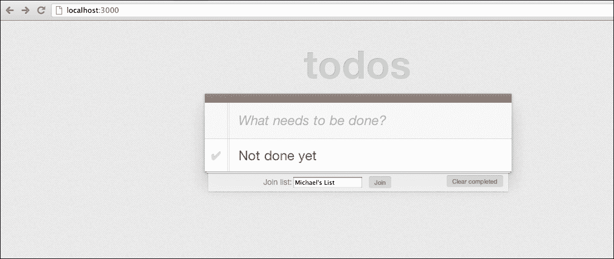
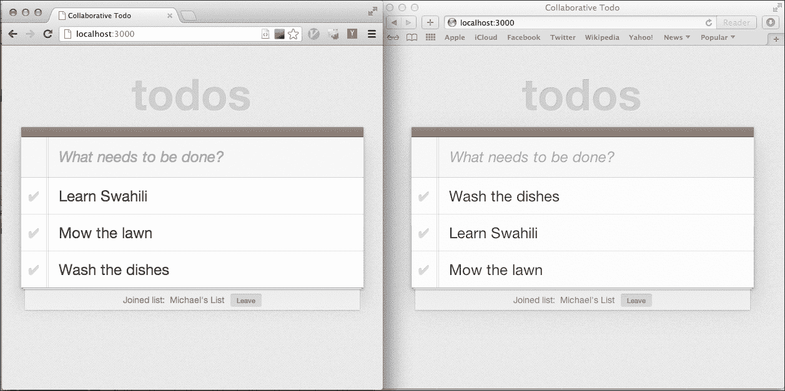

# 第五章：CoffeeScript 和 Node.js

Ryan Dahl 于 2009 年创建了 Node.js。他的目标是创建一个可以使用 JavaScript 编写高性能网络服务器应用程序的系统。当时，JavaScript 主要在浏览器中运行，因此需要一种在没有浏览器的情况下运行 JavaScript 的服务器端框架。Node 使用了 Google 的 V8 JavaScript 引擎，最初是为 Chrome 浏览器编写的，但由于它是一个独立的软件，因此可以在任何地方运行 JavaScript 代码。Node.js 允许您编写可以在服务器上执行的 JavaScript 代码。它可以充分利用您的操作系统、数据库和其他外部网络资源。

让我们谈谈 Node.js 的一些特性。

# Node 是事件驱动的

Node.js 框架只允许非阻塞的异步 I/O。这意味着任何访问外部资源（如操作系统、数据库或网络资源）的 I/O 操作必须以异步方式进行。这是通过使用事件或回调来实现的，一旦操作成功或失败，就会触发这些事件或回调。

这样做的好处是，您的应用程序变得更加可扩展，因为请求不必等待慢速 I/O 操作完成，而是可以处理更多的传入请求。

其他语言中也存在类似的框架，比如 Python 中的**Twisted**和**Tornado**，以及 Ruby 中的**EventMachine**。这些框架的一个大问题是，它们使用的所有 I/O 库也必须是非阻塞的。通常，人们可能会意外地使用阻塞 I/O 操作的代码。

Node.js 是从头开始以事件驱动的理念构建的，并且只允许非阻塞 I/O，因此避免了这个问题。

# Node 快速且可扩展

Node.js 使用的 V8 JavaScript 引擎经过高度优化，因此使 Node.js 应用程序非常快速。Node 是非阻塞的事实将确保您的应用程序能够处理许多并发客户端请求，而不会使用大量系统资源。

# Node 不是 Rails

尽管 Node 和 Rails 经常用于构建类似类型的应用程序，但它们实际上是非常不同的。Rails 致力于成为构建 Web 应用程序的全栈解决方案，而 Node.js 更像是一种用于编写任何类型的快速和可扩展网络应用程序的低级系统。它对应用程序的结构几乎没有做出太多假设，除了您将使用基于事件的架构。

因此，Node 开发人员通常可以从许多在 Node 之上构建的用于编写 Web 应用程序的框架和模块中进行选择，比如 Express 或 Flatiron。

# Node 和 CoffeeScript

正如我们之前所看到的，CoffeeScript 作为一个 npm 模块是可用的。因此，使用 CoffeeScript 编写 Node.js 应用程序变得非常容易。事实上，我们之前讨论过的`coffee`命令将默认使用 Node 运行`.coffee`脚本。要使用 CoffeeScript 安装 Node，请参阅第二章 *运行 CoffeeScript*。

# Node 中的“Hello World”

让我们用 CoffeeScript 编写最简单的 Node 应用程序。创建一个名为`hello.coffee`的文件，并输入以下代码：

```js
http = require('http')

server = http.createServer (req, res) ->
  res.writeHead 200
  res.end 'Hello World'

server.listen 8080
```

这使用了 Node.js 的`http`模块，该模块提供了构建 HTTP 服务器的功能。`require('http')`函数将返回`http`模块的一个实例，该实例导出了一个`createServer`函数。这个函数接受一个`requestListener`参数，这是一个响应客户端请求的函数。在这种情况下，我们以 HTTP 状态码`200`做出响应，并以`Hello World`作为请求体结束响应。最后，我们调用返回的服务器的`listen`方法来启动它。当调用这个方法时，服务器将监听并处理请求，直到我们停止它。

我们可以使用 coffee 命令运行这个文件，如下命令所示：

```js
coffee hello.coffee
```

我们可以通过浏览`http://localhost:8080/`来测试我们的服务器。我们应该看到一个只有**Hello World**文本的简单页面。

# Express

正如你所看到的，Node 默认是非常低级和基本的。构建 Web 应用程序基本上意味着编写原始的 HTTP 服务器。幸运的是，在过去几年中已经开发了许多库来帮助在 Node 上编写 Web 应用程序，并抽象掉许多低级细节。

可以说，其中最受欢迎的是**Express**（[`expressjs.com/`](http://expressjs.com/)）。类似于 Rails，它具有许多很好的功能，使得执行常见的 Web 应用程序任务更容易，比如路由、渲染视图和托管静态资源。

在本章中，我们将使用 CoffeeScript 在 Express 中编写 Web 应用程序。

# WebSocket

由于我想展示一些 Node 的可伸缩性特性以及它通常用于的应用程序类型，我们将利用另一种有趣的现代网络技术，称为**WebSocket**。

WebSocket 协议是允许在标准 HTTP 端口**80**上进行原始、双向和全双工（同时双向）TCP 连接的标准。这允许客户端和服务器建立长时间运行的 TCP 连接，服务器可以执行推送操作，这在传统的 HTTP 中通常是不可能的。它经常用于需要在客户端和服务器之间进行大量低延迟交互的应用程序中。

# Jade

Jade 是一种轻量级的标记模板语言，它让你以类似于 CoffeeScript 的语法编写优雅而简短的 HTML。它使用了许多功能，比如语法空白，以减少你编写 HTML 文档所需的按键次数。通常在运行 Express 时默认安装，我们将在本书中使用它。

# 我们的应用程序

在本章中，我们将构建一个协作待办事项列表应用程序。这意味着你将能够实时与其他人分享你的待办事项列表。一个或多个人将能够同时添加、完成或删除待办事项列表项目。待办事项列表的更改将自动传播到所有用户。这是 Node 非常适合的应用类型。

我们的 Node.js 代码将包括两个不同的部分，一个是正常的 Web 应用程序，将提供静态 HTML、CSS 和 JavaScript，另一个是处理实时更新所有待办事项列表客户端的 WebSocket 服务器。除此之外，我们还将有一个由 jQuery 驱动的客户端，看起来与我们在第三章中的应用程序非常相似，*CoffeeScript 和 jQuery*。

我们将使用现有待办事项列表应用程序的一些资源（样式表和图像）。我们还将重用第三章中的客户端 jQuery 代码，并对其进行调整以适应我们的应用程序。如果你之前没有跟着前几章的内容，你应该可以根据需要从本章的代码中复制资源。

# 让我们开始吧

为了开始，我们将执行以下步骤：

1.  为我们的应用程序创建一个文件夹。

1.  使用`package.json`文件指定我们的应用程序依赖项。

1.  安装我们的依赖项。

1.  创建一个`app.coffee`文件。

1.  第一次运行我们的应用程序。

## package.json

创建一个名为`todo`的新文件夹。在这个文件夹中，我们将创建一个名为`package.json`的文件。将以下代码添加到这个文件中：

```js
{
  "name": "todo",
  "version": "0.0.1",
  "private": true,
  "scripts": {
    "start": "node app"
  },
  "dependencies": {
    "express": "3.0.0beta6",
    "jade": "*",
    "socket.io": "*",
    "coffee-script": "*",
    "connect-assets": "*"
  }
}
```

这是一个简单的 JSON 文件，用作应用程序清单，并用于告诉 npm 您的应用程序依赖哪些。在这里，我们将 Express 用作我们的 Web 框架，Jade 用作我们的模板语言。由于我们将使用 WebSocket，我们将引入`socket.io`。我们还可以通过将其添加到我们的文件中来确保 CoffeeScript 已安装。最后，我们将使用`connect-assets`，这是一个管理客户端资产的模块，其方式与 Rails 资产管道非常相似。

在处理 Node.js 框架时，您会注意到应用程序通常是以这种方式由 npm 模块编织在一起的。查找 npm 模块的好地方是 Node 工具箱网站（[nodetoolbox.com](http://nodetoolbox.com)）。

## 安装我们的模块

要安装`package.json`文件中的依赖项，请在命令行工具上导航到项目文件夹并运行以下命令：

```js
npm install
```

如果一切顺利，那么我们现在应该已经安装了所有项目依赖项。要验证这一点，或者只是查看 npm 的操作，您可以运行以下命令：

```js
npm ls
```

这将以树状格式输出已安装模块及其依赖关系的列表。

## 创建我们的应用程序

我们只需要运行我们的应用程序是创建一个主入口文件，用于连接我们的 Express 应用程序并指定我们的路由。在根文件夹中，创建一个名为`app.coffee`的文件，并将以下代码添加到其中：

```js
express = require 'express'
app = express()

app.get '/', (req, res) ->
  res.send('Hello Express')

app.listen(3000)
console.log('Listening on port 3000')
```

这看起来与我们的“Hello World”示例非常相似。

首先，使用`require`函数加载 Express 模块。Node 模块很简单；每个模块对应一个单独的文件。每个模块都可以声明代码，在需要时导出。当您调用`require`时，如果模块的名称不是原生模块或文件路径，Node 将自动在`node_modules`文件夹中查找文件。当然，这就是 npm 安装模块的地方。

在下一行，通过调用`express`函数并将其分配给`app`变量来创建我们的 Express 应用程序。

然后，我们使用`get`方法为我们的应用程序创建一个索引路由。我们指定路径为`'/'`，然后传入一个匿名函数来处理请求。它接受两个参数，`req`和`res`参数。现在，我们只需向响应中写入`Hello Express`并返回。

然后，我们使用`listen`方法启动我们的应用程序，并告诉它在端口`3000`上运行。最后，我们将写入标准输出，以便我们知道应用程序已启动。

正如您所看到的，Express 的魔力在于声明性地设置路由。使用 Express，您可以通过指定 HTTP 方法、URL 路径和处理请求的函数轻松创建路由。

## 运行我们的应用程序

让我们运行我们的应用程序，看看是否一切正常。在我们的应用程序文件夹中，在命令行工具上键入以下内容：

```js
coffee app.coffee
```

您应该会看到输出为**Listening on port 3000**。

将浏览器指向`http://localhost:3000/`。您应该会看到文本**Hello Express**。

要在命令行工具上停止 Node 进程，只需使用*Ctrl* + *C*。

# 创建一个视图

与其他 Web 框架（如 Rails）类似，Express 具有视图的概念，它可以让您使用单独的文件将 UI 与应用程序分离开来。通常，这些是使用 Jade 等模板语言编写的。让我们为我们的根操作创建一个视图。

为此，我们需要：

1.  创建一个`views`文件夹并添加一个 Jade 视图文件。

1.  配置我们的 Express 应用程序以了解存储视图的文件夹，并使用的模板库。

1.  更改我们的索引路由以呈现我们的视图。

让我们在项目根目录中创建一个名为`views`的新文件夹。在此文件夹中，我们创建一个名为`index.jade`的新文件。它应该如下所示：

```js
doctype 5
html
  head
    title Our Jade view
  body
    p= message
```

正如你所看到的，Jade 为普通 HTML 提供了非常干净简洁的语法。你不需要用尖括号来包围标签。与 CoffeeScript 类似，它还使用缩进来界定块，这样你就不必输入闭合标签。`p= message`这一行创建了一个`<p>`标签，其内容将被评估为`message`字段的值，这个值应该被传递到我们的视图选项中。

在我们的`app.coffee`文件中，我们将添加以下代码：

```js
express = require 'express'
path = require 'path'
app = express()

app.set 'views', path.join __dirname, 'views'
app.set 'view engine', 'jade'

app.get '/', (req, res) ->
 res.render 'index', message: "Now we're cooking with gas!"

app.listen(3000)
console.log('Listening on port 3000')
```

在这里，我们使用`set`函数设置`views`文件夹，并分配`'views'`键。我们使用在文件顶部包含的`path`模块来创建和连接我们当前文件夹名到`views`子文件夹。`__dirname`是一个全局变量，指的是当前工作文件夹。我们还将视图引擎设置为`'jade'`。

接下来，我们将改变我们的`get '/'`路由，渲染 index 模板并传递一个包含消息的哈希选项。这个值将在我们的视图中被渲染出来。

一旦我们再次运行我们的应用程序并刷新页面，我们应该能够看到我们的页面已经更新了新的文本。

# node-supervisor

到目前为止，你可能会想知道每次更改代码时是否需要重新启动我们的 Node 应用程序。在开发中，我们希望我们的代码在每次更改时都能自动重新加载，类似于 Rails 的工作方式。

幸运的是，有一个整洁的开源库可以做到这一点：**node-supervisor**（[`github.com/isaacs/node-supervisor`](https://github.com/isaacs/node-supervisor)）。我们像安装其他 npm 模块一样安装它，只是要确保传递`-g`标志来全局安装它，如下面的命令所示：

```js
npm install supervisor -g
```

在终端中，你现在应该能够通过以下命令运行监督者：

```js
supervisor app.coffee
```

在一个单独的窗口中保持这个过程运行。为了查看这是否起作用，让我们编辑发送到我们视图的消息；在下面的代码片段中，高亮显示了编辑后的消息：

```js
app.get '/', (req, res) ->
 res.render 'index', message: "Now we're cooking with supervisor!"

```

如果我们现在刷新页面，我们将看到它已经更新了。从现在开始，我们可以确保监督者在运行，并且我们不需要重新启动我们的 Node 进程来进行更改。

# 待办事项列表视图

现在让我们扩展我们的视图，使其看起来像我们真正的待办事项应用程序。编辑`index.jade`文件如下所示：

```js
doctype 5
html
  head
 title Collaborative Todo
  body
 section#todoapp
 header#header
 h1 todos
 input#new-todo(placeholder="What needs to be done?", autofocus=true)
 section#main
 ul#todo-list
 footer#footer
 button#clear-completed Clear completed

```

这是一些我们以前没有见过的新的 Jade 语法。标签 ID 由`#`符号表示，所以`header#header`变成了`<header id="header">`。标签属性在括号内指定，就像这样：`tag(name="value")`。

由于我们不再在模板中使用`message`变量，我们将从`app.coffee`文件的`render`调用中删除它，如下面的代码片段所示：

```js
app.get '/', (req, res) ->
 res.render 'index'

```

我们的页面现在将被更新，但看起来不太好。我们将使用在上一个项目中使用的相同样式表来为我们的页面设置样式。

### 提示

**没有按预期工作？**

记得要留意监督者进程的输出，看看你的 CoffeeScript 或 Jade 模板中是否有语法错误，特别是如果你没有看到预期的输出。

在使用样式表之前，我们需要设置 Express 为我们提供静态文件服务。修改`app.coffee`文件如下所示：

```js
express = require 'express'
path = require 'path'

app = express()

app.set 'views', path.join __dirname, 'views'
app.set 'view engine', 'jade'
app.use(express.static(path.join __dirname, 'public'))

```

在前面的代码片段中发生了什么？我们添加了一行支持为静态文件提供服务，但这是如何工作的呢？答案在于 Node 如何使用中间件。

## 中间件

Express 框架是建立在一个名为**Connect**的低级框架之上的（[`www.senchalabs.org/connect/`](http://www.senchalabs.org/connect/)）。Connect 的基本思想是为 Web 请求提供中间件。

中间件可以链接在一起形成一个 Web 应用程序堆栈。每个中间件只关心通过修改输出响应或请求的控制流来提供一小部分功能。

在我们的示例中，我们告诉我们的应用程序使用`express.static`函数创建的中间件。这个函数将为提供的文件路径创建一个静态文件服务器。

## 我们的样式表

创建一个名为`public`的文件夹，其中包含一个名为`css`的子文件夹。将样式表保存为此文件夹中的`todo.css`。我们仍然需要在我们的`index`视图中包含样式表。在`views`文件夹中的`index.jade`文件中添加以下行-在代码片段中突出显示：

```js
doctype 5
html
  head
  title  Collaborative Todo
 link(rel="stylesheet", href="css/todo.css")
  body
```

一旦我们链接到我们的样式表，我们应该能够刷新我们的视图。现在它应该看起来更好。

# 客户端

为了使我们的待办事项应用程序工作，我们将复制在第三章中创建的客户端 jQuery 代码，*CoffeeScript 和 jQuery*。我们将把它放在一个名为`todo.coffee`的文件中。

我们接下来的决定是，我们应该把这个文件放在哪里？我们如何编译和在我们的应用程序中使用它的输出？

我们可以做与我们在第三章中构建应用程序时一样的事情，也就是创建一个包含客户端 CoffeeScript 代码的`src`文件夹，然后使用`coffee`命令和`--watch`标志进行编译。输出的 JavaScript 然后可以放在我们的`public`文件夹中，我们可以像平常一样包含它。但这意味着我们将有两个独立的后台任务运行，一个是运行我们的服务器的监督任务，另一个是编译我们的客户端代码的任务。

幸运的是有更好的方法。您可能还记得我们在`package.json`文件中有一个对`connect-assets`模块的引用。它为我们提供了一个类似于 Rails 的资产管道。它将透明地处理编译和依赖管理。

我们需要在我们的`app.coffee`文件中使用中间件，如下面的代码片段中所示：

```js
app.set 'views', path.join __dirname, 'views'
app.set 'view engine', 'jade'
app.use(express.static(path.join __dirname, 'public'))
app.use require('connect-assets')()

```

`connect-assets`模块将默认使用`assets`文件夹来管理和提供资产。让我们在我们的根文件夹内创建一个名为`assets/js`的文件夹。我们将在这个文件夹中创建一个名为`todo.coffee`的新文件，其中包含以下代码：

```js
Storage::setObj = (key, obj) ->
  localStorage.setItem key, JSON.stringify(obj)

Storage::getObj = (key) ->
  JSON.parse this.getItem(key)

class TodoApp

  constructor: ->
    @cacheElements()
    @bindEvents()
    @displayItems()

  cacheElements: ->
    @$input = $('#new-todo')
    @$todoList = $('#todo-list')
    @$clearCompleted = $('#clear-completed')

  bindEvents: ->
    @$input.on 'keyup', (e) => @create e
    @$todoList.on 'click', '.destroy', (e) => @destroy e.target
    @$todoList.on 'change', '.toggle', (e) => @toggle e.target
    @$clearCompleted.on 'click', (e) => @clearCompleted()

  create: (e) ->
    val = $.trim @$input.val()
    return unless e.which == 13 and val

    randomId = Math.floor Math.random()*999999

    localStorage.setObj randomId,{
      id: randomId
      title: val
        completed: false
    }
    @$input.val ''
    @displayItems()

  displayItems: ->
    @clearItems()
    @addItem(localStorage.getObj(id)) for id in Object.keys(localStorage)

  clearItems: ->
    @$todoList.empty()

  addItem: (item) ->
    html = """
      <li #{if item.completed then 'class="completed"' else ''} data-id="#{item.id}">
        <div class="view">
          <input class="toggle" type="checkbox" #{if item.completed then 'checked' else ''}>
          <label>#{item.title}</label>
          <button class="destroy"></button>
        </div>
     </li>
    """
    @$todoList.append html

  destroy: (elem) ->
    id = ($(elem).closest 'li').data('id')
    localStorage.removeItem id
    @displayItems()

  toggle: (elem) ->
    id = $(elem).closest('li').data('id')
    item = localStorage.getObj(id)
    item.completed = !item.completed
    localStorage.setObj(id, item)

  clearCompleted: ->
    (localStorage.removeItem id for id in Object.keys(localStorage) \
      when (localStorage.getObj id).completed)
    @displayItems()

$ ->
  app = new TodoApp()
```

如果您在第三章中跟着做，*CoffeeScript 和 jQuery*，那么这段代码应该很熟悉。这是我们完整的客户端应用程序，显示待办事项并在`localStorage`中创建、更新和销毁项目。

为了在我们的 HTML 中使用这个文件，我们仍然需要包含一个`script`标签。因为我们使用了 jQuery，我们还需要在我们的 HTML 中包含这个库。

在`index.jade`文件的底部添加以下代码：

```js
script(src="img/jquery.min.js")
!= js('todo')
```

正如你所看到的，我们使用 Google CDN 包含了一个指向 jQuery 的链接。然后我们使用`connect-assets`提供的`js`辅助函数创建一个指向我们编译后的`todo.js`文件的`script`标签（`connect-assets`模块会透明地编译我们的 CoffeeScript）。`!=`符号是 Jade 语法中用来运行 JavaScript 函数及其结果的表示方式。

如果一切顺利，我们应该能够刷新页面并拥有一个工作的客户端页面应用程序。尝试添加新项目，标记项目为完成，删除项目和清除已完成的项目。

# 添加协作

现在我们准备为我们的待办事项列表应用程序添加协作。我们需要创建一个页面，多个用户可以连接到同一个待办事项列表，并可以同时编辑它，实时看到结果。

我们希望支持命名列表的概念，您可以加入其他人一起协作。

在我们深入功能之前，让我们稍微调整一下我们的 UI，以支持所有这些。

# 创建协作 UI

首先，我们将添加一个输入字段来指定一个列表名称和一个按钮来加入指定的列表。

对我们的`index.jade`文件进行以下更改（在代码片段中突出显示），将添加一个`input`元素和一个`button`元素来指定我们的列表名称并加入它：

```js
      footer#footer
 | Join list:
 input#join-list-name
 button#join Join
        button#clear-completed Clear completed
  script(src="img/jquery.min.js")
  != js('todo')
```

我们的页面现在应该看起来像以下截图中显示的页面：



# 客户端上的 WebSocket

现在让我们为用户点击**加入**按钮时连接到一个房间添加一个事件处理程序。

在我们的`todo.coffee`文件中，我们将在`cacheElements`和`bindEvents`函数中添加以下代码：

```js
cacheElements: ->
    @$input = $('#new-todo')
    @$todoList = $('#todo-list')
    @$clearCompleted = $('#clear-completed')
 @$joinListName = $("#join-list-name")
 @$join = $('#join')

  bindEvents: ->
    @$input.on 'keyup', (e) => @create e
    @$todoList.on 'click', '.destroy', (e) => @destroy e.target
    @$todoList.on  'change', '.toggle', (e) => @toggle e.target
    @$clearCompleted.on 'click', (e) => @clearCompleted()
 @$join.on 'click', (e) => @joinList()

```

我们获取`join-list-name`输入和`join`按钮元素，并将它们存储在两个实例变量中。然后我们在`@$join`按钮上设置`click`处理程序，以调用一个名为`joinList`的新函数。让我们继续定义这个函数。在定义`bindEvents`函数之后，将其添加到类的末尾：

```js
clearCompleted: ->
    (localStorage.removeItem id for id in Object.keys(localStorage) \
      when (localStorage.getObj id).completed)
    @displayItems()

 joinList: ->
 @socket = io.connect('http://localhost:3000')

 @socket.on 'connect', =>
@socket.emit 'joinList', @$joinListName.val()

```

这是我们开始使用 Socket.IO 的地方。Socket.IO 库分为两部分：用于打开 WebSocket 连接、发出请求和接收响应的客户端库，以及用于处理请求的服务器端节点模块。

在上述代码中，`joinList`函数使用`io.connect`函数打开一个新的套接字，并传入 URL。然后它使用`on`函数传递一个处理程序函数，在 WebSocket 连接建立后运行。

成功连接处理程序函数将反过来使用`socket.emit`函数，这允许我们使用`joinList`作为标识符向服务器发送自定义消息。我们将`@joinListName`输入的值作为其值传递。

在我们开始实现服务器端代码之前，我们仍然需要包含一个`script`标签来使用`socket.io`客户端库。在`index.jade`文件的底部添加以下突出显示的`script`标签：

```js
script(src="img/jquery.min.js")
script(src="img/socket.io.js")
!= js('todo')
```

您可能想知道这个文件是从哪里来的。接下来，我们将在`app.coffee`文件中设置 Socket.IO 中间件。这将为我们托管客户端库。

# 服务器端的 WebSocket

我们的客户端代码已准备好发出 WebSocket 请求；现在我们可以转向我们的 Node 后端。首先，我们需要设置 Socket.IO 中间件。这有一个小问题，即我们不能直接将 Socket.IO 用作 Express 应用程序的中间件，因为 Socket.IO 需要一个 Node.js HTTP 服务器，并且不直接支持 Express。相反，我们将使用内置的 Node.js HTTP 模块创建一个 Web 服务器，将我们的 Express 应用程序作为`requestListener`传递。然后我们可以使用 Socket.IO 的`listen`函数连接到服务器。

以下是我们的`app.coffee`文件中代码的样子：

```js
express = require 'express'
path = require 'path'

app = express()
server = (require 'http').createServer app
io = (require 'socket.io').listen server

app.set 'views', path.join __dirname, 'views'
app.set 'view engine', 'jade'
app.use(express.static(path.join __dirname, 'public'))
app.use (require 'connect-assets')()

app.get '/', (req, res) ->
  res.render 'index'

io.sockets.on 'connection', (socket) =>
 console.log('connected')
 socket.on 'joinList', (list) => console.log "Joining list #{list}"

server.listen(3000)
console.log('Listening on port 3000')
```

`io.sockets.on 'connection'`函数处理客户端连接时的事件。在这里，我们记录到控制台我们已连接，并设置`joinList`消息处理程序。现在，我们将只是将从客户端接收到的值记录到控制台。

现在我们应该能够测试连接到一个列表。刷新我们的待办事项列表主页并输入要加入的列表名称。点击**加入**按钮后，转到我们的后台监督任务。您应该会看到类似以下消息的内容：

**连接**

**加入列表迈克尔的列表**

成功了！我们已成功创建了双向 WebSocket 连接。到目前为止，我们还没有真正加入任何列表，所以让我们继续做这件事。

# 加入列表

要加入列表，我们将使用 Socket.IO 的一个特性叫做**rooms**。它允许 Socket.IO 服务器对其客户端进行分段，并向所有连接的客户端的子集发出消息。在服务器端，我们将跟踪每个房间的待办事项列表，然后告诉客户端在连接时同步其本地列表。

我们将在`app.coffee`文件中添加以下突出显示的代码：

```js
@todos = {}
io.sockets.on 'connection', (socket) =>
  console.log('connected')
  socket.on 'joinList', (list) =>
    console.log "Joining list #{list}"
 socket.list = list
 socket.join(list)
 @todos[list] ?= []
 socket.emit 'syncItems', @todos[list]

```

我们将`@todos`实例变量初始化为空哈希。它将使用列表名称作为键，保存每个房间的待办事项列表。在`joinList`处理程序函数中，我们将`socket`变量的`list`属性设置为客户端传入的列表名称。

然后，我们使用`socket.join`函数将我们的列表加入到具有该名称的房间中。如果房间尚不存在，它将被创建。然后，我们将空数组值分配给`@todos`中键等于`list`的项目。`?=`运算符只会在右侧的值为`null`时将右侧的值分配给左侧的对象。

最后，我们使用`socket.emit`函数向客户端发送消息。`syncItems`标识符将告诉它将其本地数据与我们传递给它的待办事项列表同步。

要处理`syncItems`消息，我们需要使用以下突出显示的代码更新`todo.coffee`文件：

```js
  joinList: ->
    @socket = io.connect('http://localhost:3000')
    @socket.on 'connect', => 
   @socket.emit 'joinList', @$joinListName.val()

 @socket.on 'syncItems', (items) =>
 @syncItems(items)

 syncItems: (items) ->
 console.log 'syncing items'
 localStorage.clear()
 localStorage.setObj item.id, item for item in items
 @displayItems()

```

加入列表后，我们设置客户端连接以处理`syncItems`消息。我们期望接收刚刚加入的列表的所有待办事项。`syncItems`函数将清除`localStorage`中的所有当前项目，添加所有新项目，然后显示它们。

## UI

最后，让我们更新我们的 UI，以便用户知道他们何时加入了列表，并让他们离开。我们将在我们的`index.jade`文件中修改我们的`#footer div`标记如下：

```js
doctype 5
html
  head
  title  Collaborative Todo
  link(rel="stylesheet", href="css/todo.css")
  body
    section#todoapp
      header#header
        h1 todos
        input#new-todo(placeholder="What needs to be done?", autofocus=true)
      section#main
        ul#todo-list
 footer#footer
 section#connect
          | Join list:
          input#join-list-name
          button#join Join
          button#clear-completed Clear completed
 section#disconnect.hidden
 | Joined list: &nbsp
 span#connected-list List name
 button#leave Leave
    script(src="img/jquery.min.js")
    script(src="img/socket.io.js")
    != js('todo')
```

在先前的标记中，我们已经在`footer div`标记中添加了两个新部分。每个部分将根据我们所处的状态（`connected`或`disconnected`）而隐藏或显示。`connect`部分与以前相同。`disconnect`部分将显示您当前连接到的列表，并有一个**Leave**按钮。

现在我们将在`todo.coffee`文件中添加代码，以便在加入列表时更新 UI。

首先，我们将在我们的`cacheElements`函数中缓存新元素，如下面的代码段所示：

```js
cacheElements: ->
    @$input = $('#new-todo')
    @$todoList = $('#todo-list')
    @$clearCompleted = $('#clear-completed')
 @$joinListName = $("#join-list-name")
 @$join = $('#join')
 @$connect = $('#connect')
 @$disconnect = $('#disconnect')
 @$connectedList = $('#connected-list')
 @$leave = $('#leave')

```

接下来，我们将更改 UI 以显示在调用`syncItems`（在成功加入列表后由服务器触发）时我们处于`connected`状态。我们使用`@currentList`函数，我们将在`joinList`函数中设置；添加以下代码段中突出显示的代码：

```js
  joinList: ->
    @socket = io.connect('http://localhost:3000')
    @socket.on 'connect', =>
 @currentList = @$joinListName.val()
      @socket.emit 'joinList', @currentList

    @socket.on 'syncItems', (items) => @syncItems(items)

  syncItems: (items) ->
    console.log 'syncing items'
    localStorage.clear()
    localStorage.setObj item.id, item for item in items
    @displayItems()
 @displayConnected(@currentList)

 displayConnected: (listName) ->
 @$disconnect.removeClass 'hidden'
 @$connectedList.text listName
 @$connect.addClass 'hidden'

```

`displayConnected`函数将隐藏`connect`部分并显示`disconnect`部分。

## 离开列表

离开列表应该很容易。我们断开当前的 socket 连接，然后更新 UI。

当点击按钮时处理`disconnect`操作，我们在我们的`bindEvents`函数中添加一个处理程序，如下面的代码段所示：

```js
bindEvents: ->
    @$input.on 'keyup', (e) => @create e
    @$todoList.on 'click', '.destroy', (e) => @destroy e.target
    @$todoList.on  'change', '.toggle', (e) => @toggle e.target
    @$clearCompleted.on 'click', (e) => @clearCompleted()
    @$join.on 'click', (e) => @joinList()
 @$leave.on 'click', (e) => @leaveList()

```

如您所见，我们添加的处理程序将只调用一个`leaveList`函数。我们仍然需要实现它。在我们的`TodoApp`类中最后一个函数之后，添加以下两个函数：

```js
 leaveList: ->
    @socket.disconnect() if @socket
    @displayDisconnected()

  displayDisconnected: () ->
    @$disconnect.addClass 'hidden'
    @$connect.removeClass 'hidden'
```

## 测试全部

现在让我们测试我们的列表加入和离开代码。要看到所有操作，请按照以下步骤进行：

1.  在浏览器中打开`http://localhost:3000/`。

1.  在浏览器窗口中，输入一个列表名称，然后点击**Join List**。UI 应该如预期般更新。

1.  加入列表后，添加一些待办事项。

1.  现在再次打开网站，这次使用第二个浏览器。由于`localStorage`是特定于浏览器的，我们这样做是为了拥有一个干净的待办事项列表。

1.  再次在另一个浏览器中输入与之前相同的列表名称，然后点击**Join List**。

1.  当列表同步时，您现在应该看到之前添加的列表项显示出来。

1.  最后，使用**Leave**按钮从列表中断开。



从不同浏览器同步的两个列表

太棒了！我们现在可以看到 WebSockets 的威力。我们的客户端在无需轮询服务器的情况下，会在应该同步项目时收到通知。

然而，一旦我们连接到列表，我们仍然无法添加新项目以使其显示在房间中的所有其他客户端中。让我们实现这一点。

# 向共享列表添加待办事项

首先，我们将在服务器上处理添加新项目。处理这个的最佳位置是现有的用于创建待办事项的`create`函数。我们不仅将它们添加到`localStorage`中，还会向服务器发出消息，告诉它已创建新的待办事项，并将其作为参数传递。修改`create`函数如下所示：

```js
create: (e) ->
    val = $.trim @$input.val()
    return unless e.which == 13 and val

    randomId = Math.floor Math.random()*999999

 newItem =
 id: randomId
 title: val
 completed: false

 localStorage.setObj randomId, newItem
 @socket.emit 'newItem', newItem if @socket
    @$input.val ''
    @displayItems()
```

我们需要在服务器上处理`newItem`消息。当客户端加入列表时，我们将设置代码来处理这个消息，在`app.coffee`中。

让我们修改之前添加的`joinList`事件处理程序；在以下代码片段中添加突出显示的代码：

```js
io.sockets.on 'connection', (socket) =>
  console.log("connected")
  socket.on 'joinList', (list) =>
    console.log "Joining list #{list}"
    socket.list = list
    socket.join(list)
    @todos[list] ?= []

    socket.emit 'syncItems', @todos[list]

 socket.on 'newItem', (todo) =>
 console.log "new todo #{todo.title}"
 @todos[list].push todo
 io.sockets.in(socket.list).emit('itemAdded', todo)

```

在这段代码片段中，当用户加入列表时，我们设置了另一个`socket`事件。在这种情况下，是为了`newItem`事件。我们使用`push`函数将新的待办事项添加到我们的`@todos`数组中。然后我们向当前列表中的所有客户端发出一个新的`itemAdded`消息。

这个`itemAdded`消息会发生什么？你猜对了；它将再次在客户端处理。这种来回的消息传递在 WebSocket 应用程序中非常常见，需要一些时间来适应。不过不要担心；一旦掌握了，就会变得更容易。

与此同时，让我们在客户端处理`itemAdded`事件。我们还通过在我们的`joinList`方法中添加以下代码来设置这个代码片段：

```js
joinList: ->
    @socket = io.connect('http://localhost:3000')
    @socket.on 'connect', =>
      @currentList = @$joinListName.val()
      @socket.emit 'joinList', @currentList

    @socket.on 'syncItems', (items) => @syncItems(items)

 @socket.on 'itemAdded', (item) =>
 localStorage.setObj item.id, item
 @displayItems()

```

我们通过调用`localStorage.setObject`处理`itemAdded`事件，其中包括项目 ID 和值。这将在`localStorage`中创建一个新的待办事项，如果它在`localStorage`中不存在，或者更新现有值。

就是这样！现在我们应该能够向列表中的所有客户端添加项目。要测试它，我们将按照之前的类似步骤进行：

1.  在浏览器中打开`http://localhost:3000/`。

1.  在浏览器窗口中，输入一个列表名称，然后点击**加入列表**。UI 应该如预期般更新。

1.  现在再次打开网站，这次使用第二个浏览器。

1.  再次输入与另一个浏览器中相同的列表名称，然后点击**加入列表**。

1.  在任一浏览器中添加新的待办事项。你会立即看到待办事项出现在另一个浏览器中。

哇！这不是很令人印象深刻吗？

# 从共享列表中移除待办事项

要从共享列表中移除待办事项，我们将遵循与添加项目类似的模式。在`todo.coffee`的`destroy`函数中，我们将向我们的 socket 发出一个`removeItem`消息，让服务器知道应该移除一个项目，如下面的代码片段所示：

```js
destroy: (elem) ->
    id = ($(elem).closest 'li').data('id')
    localStorage.removeItem id
 @socket.emit 'removeItem', id if @socket
    @displayItems()
```

再次，我们设置了服务器端代码来处理这个消息，通过从内存中的共享列表中移除项目，然后通知连接到列表的所有客户端项目已被移除：

```js
io.sockets.on 'connection', (socket) =>
  console.log("connected")
  socket.on 'joinList', (list) =>
    console.log "Joining list #{list}"
    socket.list = list
    socket.join(list)
    @todos[list] ?= []

    socket.emit 'syncItems', @todos[list]

    socket.on 'newItem', (todo) =>
      console.log "new todo #{todo.title}"
      @todos[list].push todo
      io.sockets.in(socket.list).emit('itemAdded', todo)

 socket.on 'removeItem', (id) =>
 @todos[list] = @todos[list].filter (item) -> item.id isnt id
 io.sockets.in(socket.list).emit('itemRemoved', id)

```

`removeItem` socket 事件处理程序获取要移除的任务的 ID。它通过使用 JavaScript 的数组`filter`函数将共享列表的当前值分配给我们创建的新值来从列表中移除待办事项。这将选择所有不具有传递 ID 的项目。然后，它通过共享列表中的所有客户端 socket 连接调用`emit`，发送`itemRemoved`消息。

最后，我们需要在客户端处理`itemRemoved`消息。与添加项目时类似，我们将在`todo.coffee`的`joinList`函数中设置这个消息，如下面的代码片段所示：

```js
joinList: ->
    @socket = io.connect('http://localhost:3000')
    @socket.on 'connect', =>
      @currentList = @$joinListName.val()
      @socket.emit 'joinList', @currentList

    @socket.on 'syncItems', (items) => @syncItems(items)

    @socket.on 'itemAdded', (item) =>
      localStorage.setObj item.id, item
      @displayItems()

 @socket.on 'itemRemoved', (id) =>
 localStorage.removeItem id
 @displayItems()

```

我们从`localStorage`中移除项目并更新 UI。

要测试移除项目，请按照以下步骤操作：

1.  在浏览器中打开`http://localhost:3000/`。

1.  在浏览器窗口中，输入一个列表名称，然后点击**加入列表**。UI 应该如预期般更新。

1.  一旦连接到共享列表，添加一些待办事项。

1.  现在再次打开网站，这次使用第二个浏览器。

1.  再次输入与另一个浏览器中相同的列表名称，然后点击**加入列表**。您的待办事项列表将与共享列表同步，并包含您在另一个浏览器中添加的项目。

1.  单击删除图标以删除浏览器中的待办事项。您将立即看到另一个浏览器中已删除的待办事项消失。

## 现在轮到你了

作为对您的最后一项练习，我将要求您使“清除已完成”按钮起作用。作为提示，您应该能够使用现有的`destroyItem`方法功能。

# 总结

在本章中，我们通过探索 Node.js 作为一个快速、事件驱动的平台，让您可以使用 JavaScript 或 CoffeeScript 来编写服务器应用程序，完成了对 CoffeeScript 生态系统的巡回。我希望您已经对能够同时在服务器和浏览器上使用 CoffeeScript 编写 Web 应用程序的乐趣有所了解。

我们还花了一些时间使用一些为 Node.js 编写的精彩开源库和框架，比如 expressjs、connect 和 Socket.IO，并看到了我们如何成功地使用 npm 来管理应用程序中的依赖项和模块。

我们的示例应用程序恰好是您可以使用 Node.js 的类型，我们看到它的事件驱动模型适用于编写客户端和服务器之间有大量常量交互的应用程序。

现在我们的旅程已经结束，我希望已经在您心中灌输了渴望和技能，让您走出去使用 CoffeeScript 改变世界。我们花了一些时间不仅探索语言，还有让我们能够更快速地开发强大应用程序的精彩工具、库和框架。

CoffeeScript 和 JavaScript 生态系统的未来是光明的，希望您能成为其中的一部分！
