# 第二章：运行 CoffeeScript

在本章中，我们将讨论如何在您的开发环境中安装并运行 CoffeeScript。

CoffeeScript 可以轻松安装在 Mac、Windows 或 Linux 上。根据您是否希望安装过程简单直接，或者希望走在技术前沿，有各种方法可以使它运行。但在我们深入细节之前，了解 CoffeeScript 通常不会独立存在，它使用一些优秀的 JavaScript 工具和框架来完成其魔法功能是很好的。让我们简要地讨论典型的 CoffeeScript 栈。

# CoffeeScript 栈

在 CoffeeScript 的早期历史中，其编译器是用 Ruby 编写的。后来，它变成了自托管的；语言编译器是用其自身编写的。这意味着 CoffeeScript 的编译器是用 CoffeeScript 代码编写的，然后可以编译成 JavaScript，然后可以运行来再次编译 CoffeeScript。这不是很令人困惑吗？

不进一步深入这个壮举是什么，这也意味着为了运行 CoffeeScript，我们需要能够在您的计算机上独立执行 JavaScript，而不需要浏览器。

**Node.js**，或简称 **Node**，是一个用于编写网络服务器应用程序的 JavaScript 框架。它是使用 Google 的 V8 构建的，这是一个可以在没有网络浏览器的情况下运行 JavaScript 的引擎——非常适合 CoffeeScript。它已经成为安装 CoffeeScript 的首选方式。

将 CoffeeScript 与 Node.js 配对有很多好处。这不仅意味着你可以编译在浏览器中运行的 JavaScript，而且你还可以获得一个完整的 JavaScript 网络应用程序服务器框架，其中包含数百个为它编写的有用库。

就像在 Node.js 中的 JavaScript 一样，您可以在服务器上编写和执行 CoffeeScript，用它来编写网络服务器应用程序，甚至可以用作正常的日常系统脚本语言。

### 注意

核心的 CoffeeScript 编译器没有对 Node 的依赖，从技术上讲可以在任何 JavaScript 环境中执行。然而，使用编译器的 coffee 命令行实用程序是一个 Node.js 包。

下图展示了 CoffeeScript 编译器的工作原理：

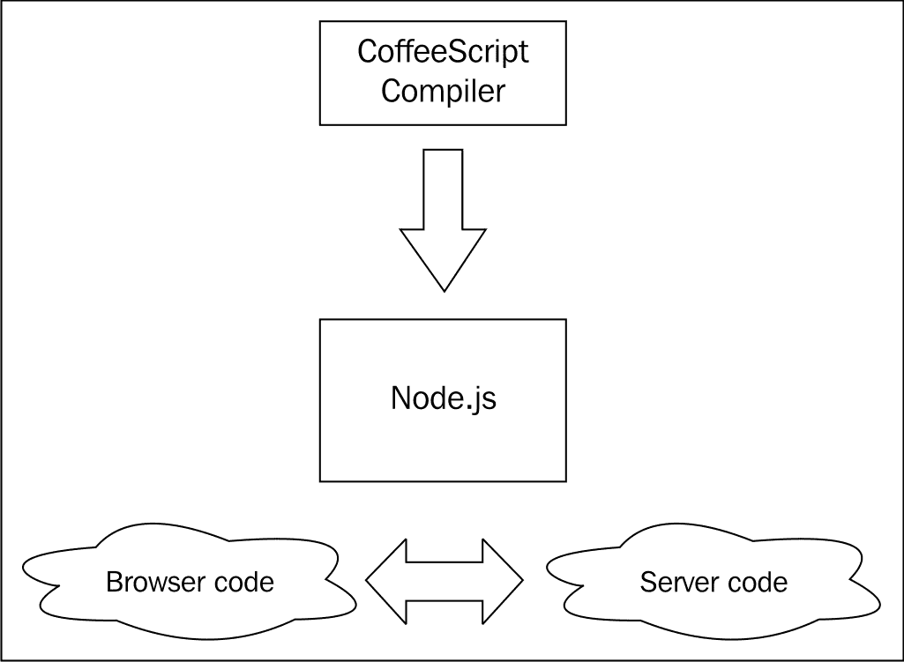

# Node.js 和 npm

Node.js 有自己的包管理系统，称为 **npm**。它用于安装和管理在 Node.js 生态系统中运行的包、库及其依赖项。它也是安装 CoffeeScript 最常见的方式，CoffeeScript 本身也作为一个 npm 包提供。因此，在设置好 Node.js 和 npm 之后，安装 CoffeeScript 实际上非常简单。

根据您的操作系统以及您是否需要编译源代码，安装 Node.js 和 npm 有不同的方法。接下来的每个部分都将涵盖您操作系统的安装说明。

### 小贴士

Node.js 维基包含了大量关于在众多平台上安装和运行 Node 的信息。如果你在本章遇到任何问题，可以查看它，因为它有很多关于故障排除的技巧，并且经常更新；链接是 [`github.com/joyent/node/wiki/Installation`](https://github.com/joyent/node/wiki/Installation)。

# Node.js、npm 和 CoffeeScript 在 Windows 上

Node.js 社区一直在推动良好的原生 Windows 支持，并且安装非常容易。

要这样做，首先访问 Node.js 网站 ([nodejs.org](http://nodejs.org))，然后点击 **下载** 按钮。你会看到一些可用的选项，但请选择 **Windows 安装程序** 选项，如下面的截图所示：

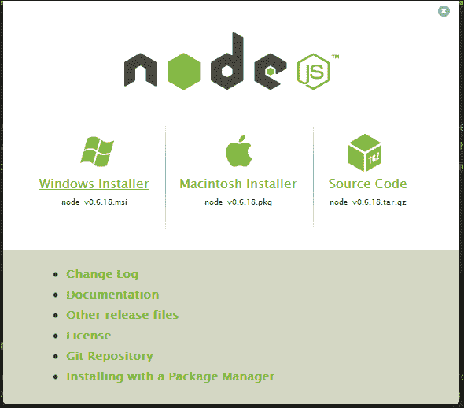

这将下载一个 `.msi` 文件。一旦下载完成，安装过程将非常简单；只需接受条款并点击 **继续**。如果你看到以下屏幕，那么你就已经成功安装了 Node：

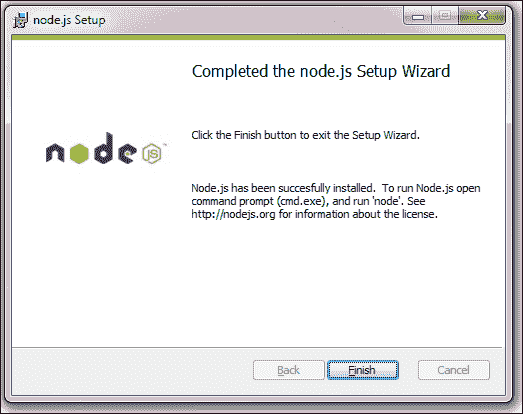

在这一点上，你可能需要注销 Windows 或重启，以便 `$PATH` 变量的更改生效。完成此操作后，你应该能够打开 DOS 命令提示符并运行以下命令：

```js
node –v 
```

这应该会输出一个版本号，这意味着你可以继续了。让我们也检查一下 npm 是否运行正常。在命令行工具中，输入以下命令：

```js
npm
```

你应该会看到以下类似的截图：

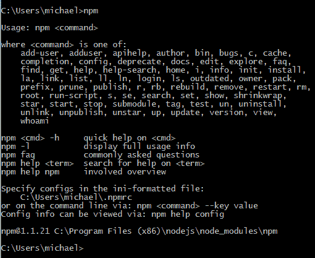

现在，为了继续安装 CoffeeScript，只需输入以下命令：

```js
npm install coffee-script
```

如果一切顺利，你应该会看到以下类似的截图：

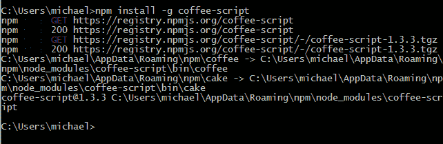

这里，我使用了 **-g** 标志，它为所有用户安装 npm 软件包。一旦你安装了 CoffeeScript，我们就可以使用 **coffee** 命令来测试它，如下所示：

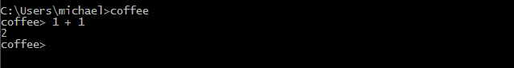

这是 CoffeeScript 解释器，正如你所见，你可以用它来即时运行 CoffeeScript 代码。要退出，只需使用 *Ctrl* + *C*。

就这样！在 Windows 上安装 Node.js 真的非常快和简单。

# 在 Mac 上安装 CoffeeScript

在 Mac 上安装 Node.js 有两种方法，要么是从 Node.js 网站下载 `.pkg` 文件并使用 Apple 的安装程序应用安装，要么是使用 **Homebrew** 命令行软件包管理器。

最简单的方法是安装 `.pkg` 文件，让我们先来了解一下。安装 Homebrew 可能需要更多的工作，但如果你更喜欢使用命令行工具并从源代码构建 CoffeeScript，那么这是值得的。

## 使用 Apple 安装程序

访问 Node.js 网站([nodejs.org](http://nodejs.org))，然后点击**下载**按钮。您将看到一些可用的选项，但请选择**Macintosh 安装程序**选项，如下面的截图所示：


这将下载一个`.pkg`文件。一旦下载完成，安装过程将非常简单；只需选择您的目标位置，接受许可协议，然后点击**继续**。您应该选择使用**为这台电脑的所有用户安装**选项来安装它，如下面的截图所示：

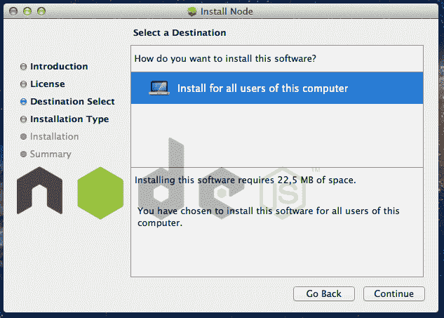

如果您看到以下屏幕，那么您已经成功安装了 Node：

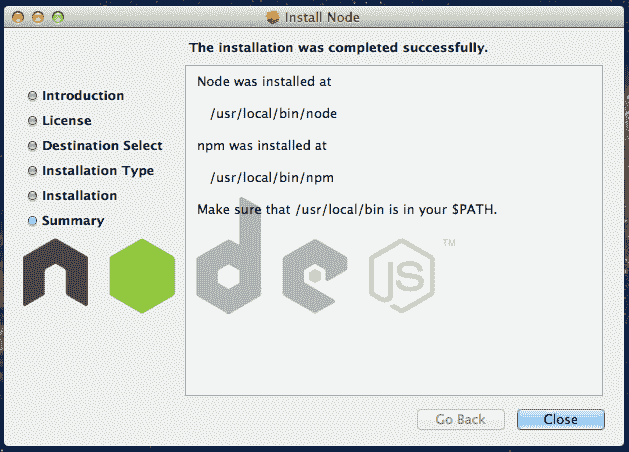

您还将安装 npm，我们将使用它来安装 CoffeeScript。跳转到*使用 npm 安装 CoffeeScript*部分。

## 使用 Homebrew

许多开发者更喜欢在 Mac 上使用命令行工具，Homebrew 软件包管理器已经变得相当流行。它的目的是让您轻松安装 Mac OS X 不自带的一些 Unix 工具。

如果您更喜欢使用 Homebrew 安装 Node.js，您需要在您的系统上安装 Homebrew。您可能还需要 XCode 命令行工具来构建 Node.js 源代码。Homebrew 维基百科包含了如何安装和运行的说明，请参阅[`github.com/mxcl/homebrew/wiki/installation`](https://github.com/mxcl/homebrew/wiki/installation)。

如果您已经安装了 Homebrew，您可以使用**brew**命令安装 Node.js，如下面的截图所示：

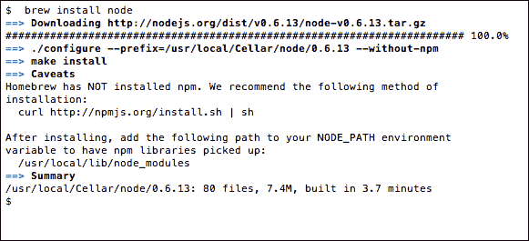

如您从输出中看到的，Homebrew 没有安装 npm，没有它我们无法安装 CoffeeScript。要安装 npm，您只需在终端中复制并粘贴以下命令：

```js
curl http://npmjs.org/install.sh |sh
```

在 npm 安装后，您应该看到以下类似的屏幕：

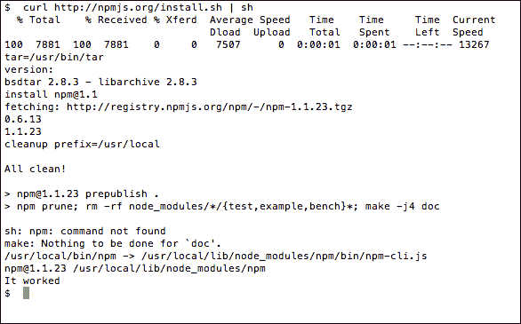

## 使用 npm 安装 CoffeeScript

现在我们已经安装了 npm，我们应该能够安装 CoffeeScript。只需在终端中输入以下命令：

```js
npm install –g coffee-script
```

**-g**标志让 npm 全局安装 CoffeeScript；一旦完成，您现在可以使用**coffee**命令来测试 CoffeeScript 是否工作，如下面的截图所示：

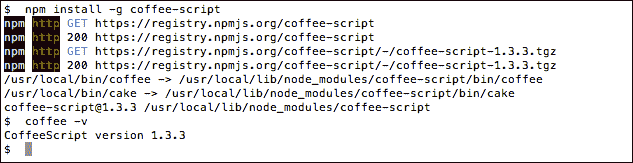

就这么简单！在 Mac 上安装 CoffeeScript 相当容易。

# 在 Linux 上安装 CoffeeScript

在 Linux 上使用 CoffeeScript 安装 Node.js 的方式取决于您安装了哪个发行版。大多数流行的发行版都有相应的软件包，如果没有，您也可以尝试从源代码构建 CoffeeScript，如下一节所述。

我只有 Debian 基础发行版的包管理器的经验，并且已经使用 **apt-get** 包管理器成功安装了 CoffeeScript 与 Node.js。然而，您应该能够按照描述遵循其他发行版的说明。

Ubuntu、MintOS 和 Debian 上有 Node.js 的 apt-get 软件包，但在安装之前，您需要添加它们的源。以下各节将探讨安装每个软件包的说明。

## Ubuntu 和 MintOS

在命令行工具中输入以下内容（您可能需要足够的权限来使用 `sudo`）：

```js
sudo apt-get install python-software-properties
sudo apt-add-repository ppa:chris-lea/node.js
sudo apt-get update
sudo apt-get install nodejs npm 
```

## Debian

在 Debian 上，您通常需要登录到 root 终端来安装软件包。登录后，输入以下命令：

```js
echo deb http://ftp.us.debian.org/debian/ sid main > /etc/apt/sources.list.d/sid.list
apt-get update
apt-get install nodejs npm
```

## 其他发行版

Node.js 的维基页面 [`github.com/joyent/node/wiki/Installing-Node.js-via-package-manager`](https://github.com/joyent/node/wiki/Installing-Node.js-via-package-manager) 包含了在包括 Fedora、openSUSE、Arch Linux 和 FreeDSB 在内的各种 Linux 和 Unix 发行版上安装的说明。

## 使用 npm 安装 CoffeeScript

在您的包管理器完成其操作后，现在您应该已经安装了 Node.js 和 npm。您可以通过使用 npm **-v** 命令来验证这一点。现在，您可以通过输入以下命令使用 npm 安装 CoffeeScript：

```js
npm install –g coffee-script
```

`-g` 标志告诉 npm 全局安装该软件包。

以下截图显示了如何使用 **-v** 命令安装 CoffeeScript：

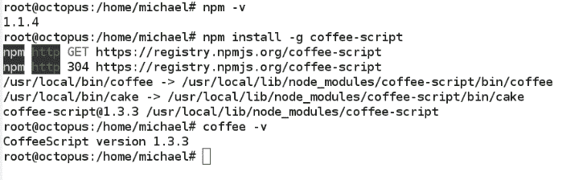

就这样！在 Linux 上安装 CoffeeScript 非常简单。

# 从源代码构建 Node.js

如果您不想使用包管理器或安装程序，或者您的操作系统没有提供，或者您想获取 Node.js 的最新版本，那么您也可以从源代码构建 Node.js。但请注意，这个过程通常充满危险，因为源代码通常需要系统上的某些依赖项来构建。

## 在 Linux 或 Unix 上构建

在 Linux 或 Unix 环境中构建时，您需要确保已安装以下源依赖项：

+   **Python–版本 2.6 或版本 2.7**：您可以通过在命令提示符中输入 `python --version` 来检查您是否已安装 Python，以及已安装的版本。

+   **libssl-dev**：这通常可以使用内置的包管理器安装。它已经在 OS X 上安装好了。

我将向您展示如何使用最新的源代码构建 Node.js。源代码由流行的 Git 版本控制系统管理，并托管在 [github.com](http://github.com) 的仓库中。要从您的 github 拉取最新源代码，您需要确保您已安装 Git。您可以使用 `apt-get` 如下安装：

```js
apt-get install git-core
```

一旦您有了这些先决条件，您应该能够在命令行工具上构建 node。在命令行工具中输入以下命令：

```js
git clone https://github.com/joyent/node.git
cd node
git checkout v0.6.19 
./configure
make
sudo make install
```

哇！如果一切顺利，您应该能够使用 npm 安装 CoffeeScript：

```js
npm install –g coffee-script
```

## 在 Windows 上构建

虽然在 Windows 上可以构建 Node.js，但我强烈建议你只运行安装程序。在这本书中提到的所有安装方式中，这是我唯一没有亲自做过的方式。这个例子直接来自 Node wiki ([`github.com/joyent/node/wiki/Installation`](https://github.com/joyent/node/wiki/Installation))。显然，构建可能需要非常长的时间。在命令提示符中，输入以下内容：

```js
C:\Users\ryan>tar -zxf node-v0.6.5.tar.gz
C:\Users\ryan>cd node-v0.6.5
C:\Users\ryan\node-v0.6.5>vcbuild.bat release
C:\Users\ryan\node-v0.6.5>Release\node.exe
> process.versions
{ node: '0.6.5',
  v8: '3.6.6.11',
  ares: '1.7.5-DEV',
  uv: '0.6',
  openssl: '0.9.8r' }
>
```

# 使用 CoffeeScript

由此看来。仅仅为了获取 CoffeeScript 就需要安装 Node.js 和 npm 可能看起来很费力，但你将体验到拥有一个出色的服务器端 JavaScript 框架和良好的命令行工具来编写 CoffeeScript 的强大之处。

现在你已经安装了 CoffeeScript，我们该如何使用它呢？你进入该语言的主要入口点是 `coffee` 命令。

# coffee 命令

这个命令行工具就像是 CoffeeScript 的瑞士军刀。你可以用它以交互式的方式运行 CoffeeScript，将 CoffeeScript 文件编译成 JavaScript 文件，执行 `.coffee` 文件，监视文件或目录，当文件发生变化时进行编译，以及一些其他有用的功能。执行命令很简单，只需输入 `coffee` 并附带一些选项和参数即可。

要获取所有可用选项的帮助，请使用带有 **-h** 或 **--help** 选项的 `coffee` 命令。以下屏幕截图显示了有用的选项列表：

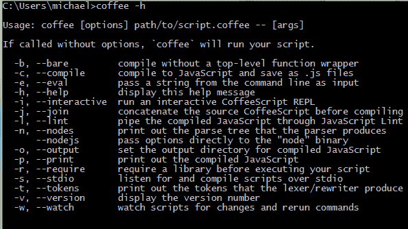

我们已经看到了 **-v** 选项，它将打印出 CoffeeScript 的当前版本。

## REPL

使用不带参数或 **-i** 选项的 `coffee` 命令将进入 CoffeeScript 的 **读取-评估-打印循环**（**REPL**）。从这里，你可以输入 CoffeeScript 代码，它将即时执行并在控制台显示输出。这对于玩转语言、探索一些核心 JavaScript 和 Node.js 库，甚至拉入另一个外部库或 API 并能够交互式地探索它非常有用。

我敦促你运行 coffee REPL 并尝试我们在上一章中讨论的一些代码示例。注意每个表达式输入后输出的显示。解释器也足够聪明，可以处理多行和嵌套表达式，例如函数定义。

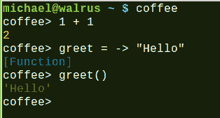

在之前的屏幕截图中，解释器展示了如何处理函数定义。

### 小贴士

要退出 REPL，请使用 *Ctrl* + *D* 或 *Ctrl* + *C*。

## 运行 .coffee 文件

在 REPL 中输入足够的代码后，你将到达一个想要开始存储和组织你的 CoffeeScript 到源文件的时刻。CoffeeScript 文件使用 `.coffee` 扩展名。你可以通过将 `.coffee` 文件作为参数传递给 `coffee` 命令来运行它。文件中的 CoffeeScript 将被编译成 JavaScript，然后使用 Node.js 作为其环境执行。

### 小贴士

你可以使用任何文本编辑器来编写你的 CoffeeScript。许多流行的编辑器都有插件或添加了对 CoffeeScript 的支持，具有语法高亮、代码补全等功能，甚至允许你直接从编辑器中运行代码。支持 CoffeeScript 的文本编辑器和插件的完整列表可以在 [`github.com/jashkenas/coffee-script/wiki/Text-editor-plugins`](https://github.com/jashkenas/coffee-script/wiki/Text-editor-plugins) 找到。

## 编译到 JavaScript

要将 CoffeeScript 编译成 JavaScript，我们需要传递 **-c** 或 **--compile** 选项。它可以接受一个文件名或文件夹名作为单个参数，或者多个文件和文件夹名。如果你指定了一个文件夹，它将编译该文件夹中的所有文件。默认情况下，JavaScript 输出文件将与源文件具有相同的名称，因此 `foo.coffee` 将编译成 `foo.js`。

如果我们想要控制输出 JavaScript 的位置，可以使用带有文件夹名的 **-o** 或 **--output** 选项。如果你指定了多个文件或文件夹，也可以传递带有文件名的 **-j** 或 **--join** 选项。这将把输出合并成一个单一的 JavaScript 文件。

## 观察

如果你正在开发一个 CoffeeScript 应用程序，不断地运行 **--compile** 可能会变得繁琐。另一个有用的选项是 **-w** 或 **--watch**。这告诉 CoffeeScript 编译器持续运行并监视特定文件或文件夹中的任何文件变化。当与 **--compile** 结合使用时，这会非常好，因为它会在文件每次变化时编译文件。

## 整合一切

`coffee` 命令的酷之处在于可以通过组合标志来创建一个非常有用的构建和开发环境。比如说，我有一个源文件夹中的多个 CoffeeScript 文件，每次文件发生变化时，我都想将它们编译成一个位于 `js` 文件夹中的单个 `output.js` 文件。

你应该能够使用以下类似的命令：

```js
coffee –o js/ -j output.js –cw source/
```

这将监视源文件夹中 `.coffee` 文件的所有变化，并将它们编译并合并成一个名为 **output.js** 的文件，位于 **js** 文件夹内，如下面的截图所示：

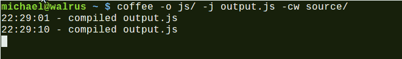

# 摘要

在本章中，你或许已经学会了如何在你的选择开发环境中运行 CoffeeScript。你也学会了如何使用 `coffee` 命令来运行和编译 CoffeeScript。现在你已经有了这些工具，我们将转向编写一些代码，并了解 CoffeeScript 在实际应用中的情况。让我们从 JavaScript 的起点开始，看看如何在浏览器中编写 CoffeeScript。
