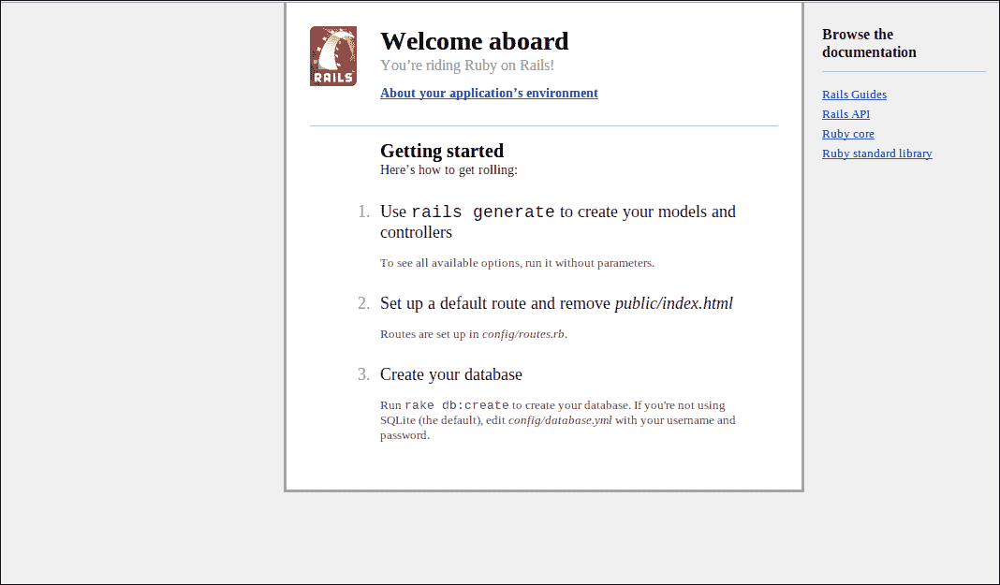
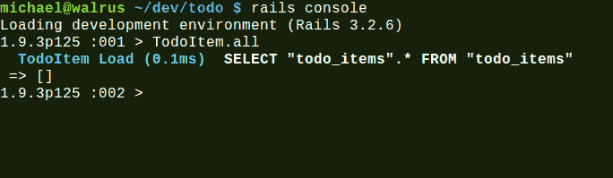
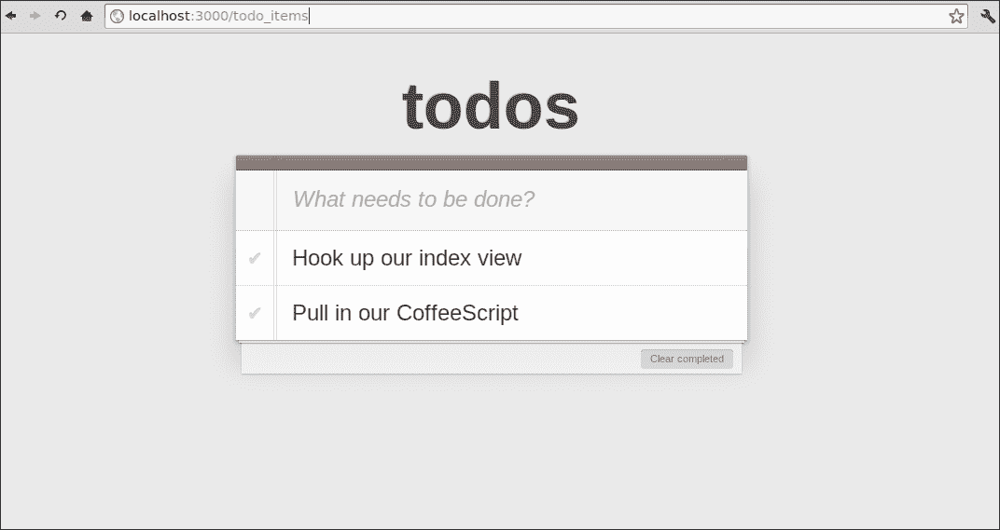

# 第四章：CoffeeScript 和 Rails

Ruby on Rails 是一个在 2004 年出现的网络框架。它是由 David Heinemeier Hansson 编写的，并从他为他的公司**37signals**编写的 Ruby 项目管理网络应用**Basecamp**中提取出来的框架。它是一个诺贝尔物理奖获得者**理查德·费曼**。

Rails 通过如何轻松快速地编写网络应用程序给很多人留下了深刻印象，很快变得非常受欢迎。

在开发的时候，Ruby 是一种来自日本的神秘脚本语言，没有人真正听说过。Ruby 实际上是 Rails 之所以成功的关键。它已经证明是一种强大而简洁的编程语言，许多程序员都表示它让编程变得有趣起来。

# Rails 有什么特别之处？

Rails 推动了网络开发者编写应用程序的方法。其核心哲学包括以下两个重要原则：

+   约定优于配置

+   不要重复自己，或者 DRY

## 约定优于配置

Rails 被设计成假设程序员会遵循某些已知约定，如果使用这些约定，将提供巨大的好处，并减少对框架配置的需求。它通常被称为有偏见的框架。这意味着框架对典型应用程序应该如何构建和结构做出了假设，并且它不会试图过于灵活和可配置。这有助于你花更少的时间在配置和连接应用程序架构等日常任务上，更多的时间用于实际构建你的应用程序。

例如，Rails 会使用对象来模拟你的数据库中的表，这些对象对应于它们的名称，因此`Transactions`数据库中的记录将自动映射到`Transactions`类实例，同样，`people`数据库表中的记录也会自动映射到`Person`类实例。

Rails 通常会使用约定为你做智能的事情。比如说，我们的`people`表也有一个名为`created_at`和`updated_at`的`datetime`字段。Rails 足够智能，现在可以自动更新这两个字段在记录创建或更新时的时间戳。

Rails 约定最重要的地方在于你应该了解它们，而不是与框架对抗，或者没有充分的理由试图过多地偏离 Rails 的方式。通常，这可能会抵消你从这些约定中获得的所有好处，甚至可能使你更难找到解决方案。

## 不要重复自己（DRY）

这个软件工程原则也可以表述如下：

> 每项知识必须在系统中有一个单一、明确和权威的表示。

这意味着 Rails 力求在可能的情况下消除重复和样板代码。

例如，一个`Person`类，它模拟`people`表中的记录，不需要定义其字段，因为它们已经在你的数据库表中定义为列。在这里，Rails 可以使用 Ruby 强大的元编程能力，神奇地给`Person`类添加与数据库列相对应的属性。

### 注意

**元编程**是编写作用于其他代码作为数据结构的代码的概念。换句话说，元编程就是编写编写代码的代码。它在 Ruby 社区，尤其是 Rails 源代码中得到了广泛的应用。

Ruby 语言具有非常强大的元编程能力，这与开放类和对象的概念紧密相关，这意味着你可以轻松地“打开”现有的类定义，并对其进行重新定义和添加成员。

# Rails 和 JavaScript

很长一段时间里，Rails 都附带`Prototype.js`和`Script.aculo.us` JavaScript 库，用于 AJAX、页面动画和效果。

Rails 有视图辅助器的概念——这些是在视图中使用的 Ruby 方法，可以用来抽象常见的 HTML 结构。许多处理客户端代码和 AJAX 的视图辅助器都是建立在这些两个框架之上的，因此它们完全内置于框架中，没有使用替代方案的方法。

`Prototype.js`与 jQuery 共享许多相同的思想和目标，但随着时间的推移，jQuery 被许多程序员视为一个更优雅、更强大的库。

随着 jQuery 变得越来越流行，Rails 社区中的许多开发者开始尝试使用 jQuery 与 Rails 一起使用，而不是默认的 JavaScript 库。一套标准的库或**gem**出现了，用于用 jQuery 替换内置的 Prototype 库。

在 Rails 3.1 版本中，宣布 jQuery 将成为默认的 JavaScript 库。因为 jQuery 已经包含了`Script.aculo.us`的大部分动画和页面效果功能，所以这个库也不再需要了。

这项举措似乎已经酝酿良久，并且普遍得到了 Rails 社区大多数人的祝福。

# Rails 和 CoffeeScript

Rails 3.1 的另一个重大新增功能是资产管道。其主要目标是使 JavaScript 和 CSS 等资产在 Rails 应用程序中成为一等公民变得容易。在此之前，JavaScript 和 CSS 只是作为静态内容被服务。它还提供了一个组织结构，帮助你组织 JavaScript 和 CSS，并提供了一个用于访问它们的领域特定语言（DSL）。

使用资产管道，你可以通过清单文件来组织和管理工作之间的依赖关系。Rails 还会使用管道来压缩和连接 JavaScript，以及应用指纹以实现缓存破坏。

资产管道还包含一个预处理链，允许你在文件被服务之前，通过一系列的输入-输出处理器来运行这些文件。它通过文件扩展名来识别应该运行哪些预处理程序。

在 Rails 3.1 发布之前，宣布了将支持 CoffeeScript 编译器，通过资产管道直接使用。这是一个重大的宣布，因为 CoffeeScript 仍然是一个非常年轻的语言，它在 Rails 社区中引起了很多争议，有些人哀叹他们不想学习或使用这种新语言。

尽管如此，Rails 维护者坚持了自己的立场，目前使用 CoffeeScript 在 Rails 中使用非常简单。CoffeeScript 作为编写客户端 JavaScript 代码的默认语言，对 CoffeeScript 来说是一个巨大的推动，许多 Rails 开发者因此开始了解并接受这种语言。

我们一直在谈论 Rails 的美妙之处以及它与 CoffeeScript 的良好配合，所以让我们安装 Rails，这样你就可以亲自看看所有这些喧嚣的原因。

# 安装 Rails

根据你的操作系统、你想要使用的 Ruby 版本、你是否使用版本管理器、从源代码构建以及许多其他选项，有无数种方式可以在你的开发机器上安装 Ruby 和 Rails。在这本书中，我们将简要介绍在 Windows、Mac 和 Linux 上安装它的最常见方法。请注意，在这本书中，我们将使用至少 3.2 版本的 Rails 和 1.9.2 版本的 Ruby 或更高版本。

## 使用 RailsInstaller 安装 Rails

在 Windows 上，或者可选地在 Mac 上，我推荐使用 **RailsInstaller** ([`railsinstaller.org/`](http://railsinstaller.org/))。它包含了开始使用 Rails 所需的一切，包括 Ruby 的最新版本。下载设置程序后，安装过程非常简单；只需运行它并按照向导操作。安装完成后，你应该会看到一个打开的控制台命令提示符。尝试输入 `rails -v`。如果你看到一个版本号，你应该可以开始了。

## 使用 RVM 安装 Rails

在 Mac 和 Linux 上使用 **RVM**（Ruby 版本管理器），从 [`rvm.io/`](https://rvm.io/)，可以非常容易地安装 Ruby 和 Rails。

在过去几年中，Ruby 语言变得越来越受欢迎，这导致了多种语言实现被编写出来，可以在不同的平台上运行。**Matz 的 Ruby 解释器**（**MRI**），Ruby 的标准实现，也已经经过了几个版本。RVM 对于管理和安装不同版本的 Ruby 来说非常出色。它包含一个一站式安装器 bash 脚本，可以安装最新的 Ruby 和 Rails。只需从终端运行以下命令：

```js
curl -L https://get.rvm.io | bash -s stable --rails
```

这可能需要相当长的时间才能完成。一旦完成，你应该尝试在终端中输入 `rails -v`。如果你看到一个至少为 3.2 的版本号，你应该可以开始了。

## Rails 已经安装好了吗？

现在我们已经安装了 Rails，让我们继续使用 CoffeeScript 来构建一个应用程序。

如果您遇到了任何问题或需要有关安装 Rails 的更多信息，最好的起点是 Ruby on Rails 网站的**下载**部分（[`rubyonrails.org/download`](http://rubyonrails.org/download))。

# 开发我们的 Rails 应用程序

我们将使用 Rails 在服务器端后端扩展我们现有的待办事项列表应用程序。如果您没有在前一章中跟随，那么您应该能够根据需要复制该章节的代码。

### 注意

本章的目的不是全面介绍 Ruby on Rails 或 Ruby 语言，而是希望专注于在如何使用 Rails 与 CoffeeScript 结合的背景下构建一个简单的 Rails 应用程序。

我们不会过于详细地介绍所有内容，并且我们将相信 Ruby 是一种相当简单且易于阅读的语言，Rails 代码也易于理解。即使您不熟悉这种语言和框架，也应该不会太难跟随。

首先，我们将使用`rails`命令创建一个空的 Rails 基础应用程序。导航到您想要创建应用程序的文件夹，然后运行此命令：

```js
rails new todo
```

这将创建一个包含大量文件和文件夹的`todo`文件夹，用于您的 Web 应用程序。遵循 Rails 的约定精神，您的 Web 应用程序将以某种方式组织。

### 注意

`rails`命令除了用于生成新应用程序之外，还用于许多其他事情，并且是您进入许多常见日常 Rails 任务的入口点。本书将介绍其中的一些，如果您想查看它可以做什么的完整列表，可以运行`rails -h`。

让我们简要地谈谈 Rails 如何组织我们的应用程序。您的大部分应用程序代码可能都位于顶级`app`文件夹中。这个文件夹包含以下四个重要的子文件夹：

+   `assets:` 这是资产管道操作的文件夹。这是所有 CoffeeScript（或 JavaScript）和 CSS 源代码以及我们的 Web 应用程序使用的图像所在的地方。

+   `controllers`: 这是您的控制器所在的位置。这些负责处理应用程序的路由请求，并与您的视图和模型进行交互。

+   `models`: 这是您将找到领域模型的地方。模型代表系统中的领域对象，并使用`ActiveRecord`基类对应于数据库表。

+   `views`: 这个文件夹包含用于渲染应用程序 HTML 的视图模板。默认情况下，Rails 使用 ERB 模板，这允许我们在 HTML 模板中包含 Ruby 代码片段，这些代码片段将被评估以生成最终的输出 HTML。

## MVC

**MVC**，或**模型-视图-控制器**，是一种广泛使用的应用程序架构模式，旨在通过将应用程序关注点拆分为三个领域对象类型来简化代码并减少耦合。

Rails 非常遵循 MVC 模式，大多数 Rails 应用程序在模型、控制器和视图方面都会结构得非常严格。

过去几年中，许多 Rails 程序员提倡的一种 MVC 之上的模式是“胖模型，瘦控制器”。这个概念鼓励将大部分领域逻辑放在模型中，而控制器只应关注路由以及模型和视图之间的交互。

## 运行我们的应用程序

在这个阶段，我们 already 可以运行我们的 Rails 应用程序来查看是否一切正常。从终端输入：

```js
cd todo
rails server
```

Rails 现在将在端口**3000**上为我们应用程序启动一个本地 Web 服务器。您可以通过浏览到`http://localhost:3000/`来测试它。如果一切顺利，那么您应该看到以下友好的欢迎信息：



### 小贴士

记得在另一个控制台窗口中保持这个服务器运行，因为我们测试我们的应用程序。您还可以检查这个过程的输出，以查找可能发生的任何错误。

## 我们的待办事项资源

因此，我们现在有一个正在运行的应用程序，但它除了显示欢迎页面之外并没有做什么。

为了达到跟踪待办任务的最终目标，我们将为我们的待办事项生成一个资源。在 Rails 术语中，资源由一个模型、具有一些操作的控制器以及这些操作的视图组成。

在终端，运行以下命令：

```js
rails generate resource todo_item title:string completed:boolean
```

这是什么操作？这是一个 Rails 生成器语法的示例，它可以用来生成样板代码。在这里，我们告诉它创建一个名为`TodoItemsController`的“资源型”控制器和一个模型`TodoItem`，该模型有一个用于标题的`string`字段和一个标记为完成的`boolean`标志。

如您从命令输出中看到的，它还生成了一些文件，并在`config/routes.rb`中修改了一个现有的文件。让我们首先打开这个文件。

## routes.rb

在`routes.rb`文件的顶部，您应该看到以下内容：

```js
Todo::Application.routes.draw do
 resources :todo_items

```

在 Rails 中，`routes.rb`定义了 HTTP 调用如何映射到可以处理它们的控制器操作。

在这里，生成器为我们添加了一行，使用了`resources`方法。这个方法为“资源型”控制器的最常见操作创建路由。这意味着它使用 HTTP 动词 GET、POST、PUT 和 DELETE 在您的应用程序中公开单个领域资源。

通常，这将创建七个不同的控制器操作的路由，即`index`、`show`、`new`、`create`、`edit`、`update`和`destroy`。您稍后将会看到，我们不需要为我们的控制器创建所有这些操作，因此我们将告诉`resources`方法只过滤出我们想要的。将文件修改如下代码片段：

```js
Todo::Application.routes.draw do
 resources :todo_items, only: [:index, :create, :update, :destroy]

```

## 控制器

在`resources`的调用中，Rails 使用`:todo_items`符号将`resources`方法传统地映射到为我们生成的`TodoItemsController`。

打开 `app/controllers/todo_items_controller.rb` 文件；这里是你将看到的内容：

```js
class TodoItemsController < ApplicationController
end
```

如你所见，这里并没有太多内容。一个名为 `TodoItemController` 的类被声明，并且它继承自 `ApplicationController` 类。`ApplicationController` 类也是在创建应用时为我们生成的，并且它继承自 `ActionController::Base`，这给了它很多功能，并让它表现得像 Rails 控制器。

我们现在应该能够通过导航到 `http://localhost:3000/todo_items` URL 来测试我们的控制器。

你看到了什么？你应该会得到一个 **未知动作** 错误页面，指出 `TodoItemsController` 中找不到 `index` 动作。

这是因为控制器还没有定义 `index` 动作，正如我们在 `routes.rb` 文件中所指定的。让我们继续在我们的 `TodoItemsController` 类中添加一个方法来处理这个动作；这将在下面的代码片段中显示：

```js
class TodoItemsController < ApplicationController
 def index
 end
end
```

如果我们刷新页面，我们会得到一个不同的错误消息：**模板缺失**。这是因为我们没有为 `index` 动作提供模板。默认情况下，Rails 总是会尝试返回与 `index` 动作名称相对应的已渲染模板。让我们现在就添加一个。

## 视图

Rails 视图保存在 `app/views` 文件夹中。每个控制器都会在这里有一个子文件夹，包含其视图。我们已经在上一章中有一个 `index.html` 文件，我们将在这里重新使用它。为此，我们需要将 `body` 标签内的一切内容复制到名为 `app/views/todo_items/index.html.erb` 的文件中，除了旧 `index.html` 文件中的最后两个 `script` 标签。

你应该得到以下标记：

```js
<section id="todoapp">
  <header id="header">
    <h1>todos</h1>
    <input id="new-todo" placeholder="What needs to be done?" autofocus>
  </header>
  <section id="main">
    <ul id="todo-list">

    </ul>
  </section>
  <footer id="footer">
      <button id="clear-completed">Clear completed</button>
  </footer>
</section>
```

看到这里，你可能想知道其余的 HTML，如包围的 `html`、`head` 和 `body` 标签去哪里了。

好吧，Rails 有一个布局文件的概念，它充当所有其他视图的包装器。这样，你可以有一个一致的网站骨架，你不需要为每个视图创建它。我们的视图将被嵌入到默认布局文件中：`app/views/layouts/application.html.erb`。让我们看看这个文件：

```js
<!DOCTYPE html>
<html>
<head>
  <title>Todo</title>
  <%= stylesheet_link_tag    "application", :media => "all" %>
  <%= javascript_include_tag "application" %>
  <%= csrf_meta_tags %>
</head>
<body>

<%= yield %>

</body>
</html>
```

`stylesheet_link_tag` 和 `javascript_include_tag` 方法将确保所有在 `assets` 文件夹中指定的文件都包含在 HTML 中。`<%= yield %>` 行是当前视图将被渲染的地方，在我们的例子中是 `index.html.erb`。

现在刷新页面后，我们会看到 `index` 页面。查看源代码以了解最终的 HTML 是如何输出的。

如你所见，我们的页面仍然没有样式，看起来相当单调。让我们看看我们能否让它再次看起来很漂亮。

## CSS

默认情况下，资产管道会在 `app/assets/stylesheets` 文件夹中查找 CSS 文件。当我们浏览到这个文件夹时，我们会看到一个名为 `todo_items.css.scss` 的文件，这是在我们创建控制器时为我们生成的。

将上一章的 `styles.css` 文件内容复制到这个文件中。现在我们的 `index` 页面应该看起来又体面了。

### 注意

这个具有奇怪 `.css.scss` 扩展名的文件是一个 Sass 文件 ([`sass-lang.com/`](http://sass-lang.com/))。

与 CoffeeScript 一样，Sass 是正常 CSS 语言的扩展版本，具有许多使编写 CSS 更容易、更简洁的出色功能。

与 CoffeeScript 一样，它是 Rails 资产管道中的默认 CSS 编译器。我们使用的 Sass 版本是 CSS 的超集，这意味着我们可以在该文件中使用正常的 CSS 而不需要使用 Sass 的任何功能，并且它将正常工作。

## 我们的模型

因此，现在我们可以看到我们的待办事项列表，但没有任何条目显示出来。这次，我们不会将它们存储在本地，而是将它们存储在数据库中。幸运的是，我们已经有了一个数据库模型，它是我们在创建资源时自动生成的，即 `TodoItem` 模型，该模型定义在 `app/models/todo_item.rb` 中：

```js
class TodoItem < ActiveRecord::Base
  attr_accessible :completed, :title
end
```

在这里，就像控制器一样，你可以看到 Rails 模型通过从 `ActiveRecord::Base` 继承而获得大部分功能。`attr_accessible` 行告诉 `ActiveRecord` 哪些字段可以从用户输入中分配和赋值。

我们如何使用模型？在 `todo_items_controller.rb` 中添加以下高亮代码：

```js
  def index
 @todo_items = TodoItem.all
  end
```

这行代码使用了 `TodoItem` 类的 `all` 类方法，这也是由 `ActiveRecord` 提供的。这将返回数据库中每个记录的新 `TodoItem` 类实例，我们可以将其分配给名为 `@todo_items` 的实例变量（在 Ruby 中，所有实例变量都以 `@` 符号开头）。

当 Rails 执行控制器动作时，它会自动将任何控制器实例变量提供给正在渲染的视图，这就是为什么我们在这里将其赋值。我们很快就会在视图中使用它。

让我们再次刷新页面以查看是否成功。然而，我们再次遇到了 **找不到表 'todo_items'** 的错误。

你可能已经猜到，我们应该在某个数据库中创建一个名为 `todo_items` 的表。幸运的是，Rails 已经为我们处理了这项艰巨的工作，使用了一种称为迁移的方法。

## 迁移

当我们生成资源时，Rails 不仅为我们创建了一个模型，还创建了一个用 Ruby 编写的数据库脚本，或称为 **迁移**。我们应该能够在 `db/migrations` 文件夹中打开它。实际的文件将以时间戳开头，并以 `_create_todo_items.rb` 结尾。它应该类似于以下代码片段：

```js
class CreateTodoItems < ActiveRecord::Migration
  def change
    create_table :todo_items do |t|
      t.string :title
      t.boolean :completed

      t.timestamps
    end
  end
end
```

此脚本将创建一个名为 `todo_items` 的表，其中包含我们在生成 `todo_item` 资源时指定的字段。它还使用 `t.timestamps` 方法创建了两个时间戳字段，名为 `created_at` 和 `updated_at`。Rails 将确保在创建或更新记录时，具有这些名称的字段会更新为适当的时间戳。

迁移脚本是一种自动化数据库更改的绝佳方式，甚至允许你回滚之前的更改。你也不必依赖于由资源或模型生成器创建的迁移。可以通过运行以下命令来生成自定义迁移：

```js
rails generate migration migration_name
```

在生成你的自定义迁移之后，你只需实现 `up` 和 `down` 方法，这些方法将在你的迁移执行或回滚时被调用。

迁移是通过 `rake` 命令执行的。`rake` 是一个任务管理工具，它允许你将任务编写为 Ruby 脚本，然后通过 `rake` 命令行工具运行。Rails 随带了许多内置的 `rake` 任务，你可以通过以下方式查看它们的完整列表：

```js
rake –T
```

目前我们感兴趣的任务是名为 `db:migrate` 的任务，让我们运行它看看会发生什么：

```js
rake db:migrate
```

你应该看到以下输出：

**== CreateTodoItems: 迁移中 ==================================================**

**-- create_table(:todo_items)**

**-> 0.0011s**

**== CreateTodoItems: 迁移完成 (0.0013s) =====================================**

这意味着 Rails 已经成功地在数据库中为我们创建了一个 `todo_items` 表。当我们刷新应用程序页面时，我们应该看到错误已经消失，我们看到了我们的空白待办事项列表。

### 小贴士

**数据库在哪里？**

你可能想知道我们的实际数据库目前在哪里。Rails 默认使用嵌入式的 SQLite 数据库。SQLite ([`www.sqlite.org`](http://www.sqlite.org)) 是一个自包含的、基于文件的数据库，不需要配置服务器即可运行。这使得在开发应用程序时快速启动和运行变得非常方便。

一旦你实际部署你的网络应用程序，你可能希望使用更传统的数据库服务器，例如 MySQL 或 PostgreSQL。你可以在 `config/database.yml` 文件中轻松更改你的数据库连接设置。

我们还没有将我们的视图与显示待办事项列表的实际功能连接起来。在我们这样做之前，让我们在数据库中手动创建几个待办事项。

## Rails 控制台

Rails 通过使用 Rails 控制台以交互方式与你的代码进行玩耍，这是一种加载了所有 Rails 项目代码的交互式 Ruby 解释器，或称为 **irb** 会话。让我们通过以下命令启动它：

```js
rails console
```

一旦你进入控制台，你可以输入任何有效的 Ruby 代码。你还可以访问你 Rails 应用程序中的所有模型。让我们用之前用过的 `TodoItem.all` 方法来试一试；这将在以下屏幕截图中展示：



目前它返回一个空数组，因为我们的表仍然是空的。注意，Rails 还输出了它为获取所有记录生成的 SQL 查询。

从这里我们也可以使用我们的模型创建一个新的待办事项。以下代码将完成这个任务：

```js
TodoItem.create(title: "Hook up our index view", completed: false)
```

现在，我们应该在我们的表格中只有一个待办事项。你可以通过使用 `TodoItem.first` 来验证这一点，它将返回我们表格中的第一个项目。

我想要确保我们的模型始终有一个标题。`ActiveRecord` 有非常强大的内置验证功能，允许以非常声明性的方式指定模型属性的约束。让我们确保我们的模型在保存之前始终检查标题的存在；为此，添加以下突出显示的代码：

```js
class TodoItem < ActiveRecord::Base
  attr_accessible :completed, :title
 validates :title,  :presence => true
end
```

继续创建一些其他的待办事项。一旦完成，再次尝试运行 `TodoItem.all`。这次它返回一个 `TodoItem` 实例的数组。

### 注意

要退出 Rails 控制台，只需输入 `exit`。

## 使用 ERB 在我们的视图中显示项目

为了在我们的视图中显示待办事项，我们将使用我们在控制器操作中创建的 `@todo_items` 实例变量。让我们修改 `app/views/todo_items.html.erb` 文件，并使用 ERB 混合一些 Ruby；在以下代码片段中添加突出显示的代码：

```js
<section id="todoapp">
  <header id="header">
    <h1>todos</h1>
    <input id="new-todo" placeholder="What needs to be done?" autofocus>
  </header>
  <section id="main">
    <ul id="todo-list">
 <% @todo_items.each do |item| %>
 <li class="<%= item.completed ? "completed" : "" %>" data-id="<%= item.id %>">
 <div class="view">
 <input class="toggle" type="checkbox" <%= "checked" if item.completed %>>
 <label><%= item.title %></label>
 <button class="destroy"></button>
 </div>
 </li> 
 <% end %>
    </ul>
  </section>
  <footer id="footer">
      <button id="clear-completed">Clear completed</button>
  </footer>
</section>
```

ERB 模板很容易理解。基本思想是，你像平常一样编写你的 HTML，然后使用 ERB 标签混合 Ruby。以下三个标签很重要：

```js
<% These tags will be just be executed  %>
<%= These should contain a Ruby expression that will be evaluated and included in the document %>
<%# This is a comment and will be ignored %>
```

在我们的 `index` ERB 模板中，我们使用 Ruby 的 `each` 迭代器遍历 `@todo_items` 数组实例变量中的所有元素；`each` 接收一个 Ruby 块作为参数。块是一段可以被传递给方法作为数据的代码，类似于在 CoffeeScript 中函数可以作为参数传递的方式。

这个块将为数组中的每个项目执行，将其作为项目变量传递。对于每个项目，我们创建其标记，在 ERB 标签中使用项目的 `title` 和 `completed` 属性。

当我们刷新页面时，我们现在最终应该看到我们的待办事项列表！如果你好奇，查看文档的 HTML 源代码，并将其与 ERB 模板进行比较，这应该能给你一个很好的想法它是如何生成的。输出页面在以下屏幕截图中显示：



## 创建部分

目前，我们的视图代码开始变得有些杂乱，特别是待办事项列表。我们可以通过使用 **视图部分** 来清理它，这允许我们将视图的片段拉到一个单独的文件中。然后，我们可以在主视图中需要的地方渲染它。在你的文件中添加以下代码片段中突出显示的行：

```js
  <section id="main">
    <ul id="todo-list">
      <% @todo_items.each do |item| %>
 <%= render partial: 'todo_item', locals: {item: item} %>
      <% end %>
    </ul>

  </section>
```

我们将把待办事项标记移动到它自己的部分文件中。按照惯例，部分文件名以下划线开头，当渲染部分时，Rails 会寻找与指定的部分具有相同名称的文件，且文件名以一个下划线开头。继续创建一个文件：`app/views/todo_items/_todo_item.html.erb`，内容如下：

```js
<li class="<%= item.completed ? "completed" : "" %>" data-id="<%= item.id %>">
  <div class="view">
    <input class="toggle" type="checkbox" <%= "checked" if item.completed %>>
    <label><%= item.title %></label>
    <button class="destroy"></button>
  </div>
</li>
```

如果一切顺利，我们的视图应该仍然像以前一样工作，我们已经很好地清理了主要的视图代码。使用部分来简化视图也是为了提高可重用性，我们稍后会看到这一点。

我们的待办事项应用还需要做一些工作。目前，我们无法添加新任务，完成的任务和删除操作也不起作用。这需要一些客户端代码，这意味着我们终于可以开始使用一些 CoffeeScript 了。

## 添加新项目

要将新项目添加到我们的待办事项列表中，我们将使用一些 Rails 的原生 AJAX 功能。以下代码片段是我们在 `index` 视图上修改后的 `todo` 输入：

```js
  <header id="header">
    <h1>todos</h1>
 <%= form_for TodoItem.new, :method => :post, :remote => true do |f| %> 
 <%= f.text_field :title, id:'new-todo', placeholder: 'What needs to be done?', autofocus: true  %>
 <% end %>
  </header>
```

那么，这里有什么变化？首先，你会注意到我们包含了 `form_for` 方法，并在其块内调用另一个 `text_field`。这些都是 Rails 的视图辅助方法，它们是 Ruby 方法，可以在视图中使用，提供构建 HTML 输出的方式。

`form_for` 方法将输出一个 HTML `form` 标签，而 `text_field` 方法将在表单内生成一个 `input` 标签，其类型为 `text`。

我们将 `TodoItem` 的新实例作为参数传递给 `form_for` 方法。Rails 足够聪明，可以从 `TodoItem` 实例中知道表单的 URL 应该指向 `TodoItemController`，并且将使用 `TodoItem` 模型的属性作为表单内输入的名称。

真正的魔法来自于发送给 `form_for` 方法的 `:remote => true` 参数。这告诉 Rails 你希望使用 AJAX 提交这个表单。Rails 将在后台处理所有这些。

所以我的表单将提交到哪个控制器动作？由于我们指定了它的动作为 `post`，它将映射到 `TodoItemController` 中的 `create` 动作。我们还没有一个，所以让我们去写一个：

```js
  def create 
    @todo_item = TodoItem.create(params[:todo_item])
  end
```

在这里，我们使用 `params` 中的 `:todo_item` 键创建 `TodoItem`——`params` 是 Rails 创建的 Ruby 哈希。它包含一个具有 `:todo_items` 键的值，这是一个包含从表单提交的所有参数值的哈希。当我们把这个哈希传递给 `TodoItem.create` 方法时，Rails 将知道如何将它们映射到我们新模型上的属性并将它们保存到数据库中。

## 让我们尝试添加一个待办事项

在我们的输入框中输入一个新待办事项的标题并按 *Enter*。

然而，看起来什么都没发生。我们可以查看正在运行的 Rails 服务器会话的输出，看看是否能找到任何错误。如果你稍微滚动一下，你应该会看到一个类似于以下错误消息的错误：

**ActionView::MissingTemplate (Missing template todo_items/create, application/create with {:locale=>[:en], :formats=>[:js, "application/**

**ecmascript", "application/x-ecmascript", :html, :text, :js, :css, :ics, :csv, :png, :jpeg, :gif, :bmp, :tiff, :mpeg, :xml, :rss, :atom,**

**:yaml, :multipart_form, :url_encoded_form, :json, :pdf, :zip], :handlers=>[:erb, :builder, :coffee]}. Searched in:**

*** "/home/michael/dev/todo/app/views"**

**)**

## 添加 CoffeeScript 视图

因此，似乎我们还需要做一件事。所有控制器动作都会默认尝试渲染一个视图。当我们现在尝试添加待办事项时，我们会得到与之前相同的 **模板缺失** 错误。由于表单是使用 AJAX 提交的，所以可能不清楚应该发生什么。我们是否仍然需要渲染一个视图？它会是什么样子？ 

仔细查看错误信息可能会给我们一些线索。由于我们的动作是通过 AJAX 调用的，Rails 默认会寻找一个 CoffeeScript 视图来渲染成 JavaScript。

生成的 JavaScript 将作为 AJAX 调用的响应，并在完成后执行。这似乎也是更新我们在服务器上创建的待办事项列表的完美位置。

我们将在 `app/views/todo_items/create.js.coffee` 中为我们的 `create` 动作创建一个 CoffeeScript 视图模板。

```js
$('#new-todo').val('')
html = "<%= escape_javascript(render partial: 'todo_item', locals: {item: @todo_item}) %>"
$("#todo-list").append(html)
```

在前面的代码片段中，我们获取了 `#new-todo` 输入并清除了其值。然后我们渲染了之前使用的相同的 `todo_item` 部分视图，传递了在控制器动作中创建的 `@todo_item` 实例变量。

我们将渲染调用包裹在 `escape_javascript` 辅助方法中，这将确保我们的字符串中的任何特殊 JavaScript 字符都会被转义。然后我们将新渲染的部分追加到我们的 `#todo-list` 元素中。

尝试一下。我们现在终于可以创建待办事项列表项了！

### 提示

**jQuery 从何而来？**

Rails 已经为我们包含了 jQuery。Rails 资产管道使用一个清单文件，`app/assets/javascript/application.js`，来包含所需的依赖项，例如 jQuery。

## 资产管道中的 CoffeeScript

注意这一切是多么的流畅？Rails 将 CoffeeScript 视为其堆栈中的第一公民，并确保在它们被使用之前，`.coffee` 文件被编译成 JavaScript。你还可以在服务器上使用 ERB 模板预先处理 CoffeeScript，这使得它更加强大。

## 完成待办事项

让我们连接这个功能。这次，我们将采取不同的方式来展示在 Rails 中编写 CoffeeScript 的不同风格。我们将遵循处理 AJAX 调用的更传统方法。

当我们创建控制器时，Rails 已经创建了一个文件，我们可以将其用于客户端代码。每个控制器都会得到自己的 CoffeeScript 文件，该文件将在页面上自动包含任何对该控制器动作的操作。

### 提示

还有一个 `application.js.coffee` 文件，可以在其中添加全局客户端代码。

我们感兴趣的文件将是 `app/assets/views/javascripts/todo_items.js.coffee`。我们可以用以下代码替换其内容，该代码将处理完成任务时的 AJAX 调用：

```js
toggleItem = (elem) ->
  $li = $(elem).closest('li').toggleClass("completed")
  id = $li.data 'id'

  data = "todo_item[completed]=#{elem.checked}"
  url = "/todo_items/#{id}"
  $.ajax
    type: 'PUT'
    url: url
    data: data

$ ->
  $("#todo-list").on 'change', '.toggle', (e) -> toggleItem e.target
```

首先，我们定义了一个名为 `toggleItem` 的函数，该函数在复选框值改变时被调用。在这个函数中，我们切换父 `li` 元素的 `completed` 类，并使用其 `data` 属性获取待办事项的 ID。然后，我们向 `TodoItemController` 发起一个 AJAX 调用，以更新复选框的当前选中值。

在我们能够运行此代码之前，我们需要在我们的控制器中添加一个 `update` 动作，如下面的代码片段所示：

```js
  def update
    item = TodoItem.find params[:id]
    item.update_attributes params[:todo_item]
    render nothing: true
  end
```

`params[:id]` 将是 URL 中 ID 的值。我们使用这个值来查找待办事项，然后调用 `update_attributes` 方法，它正是这样做的，更新我们的模型并将其保存到数据库中。注意，我们明确告诉 Rails 不要渲染视图，通过调用 `render nothing: true`。

将任务设置为已完成现在应该可以工作。注意，当你刷新页面时，任务保持已完成状态，因为它们已经被保存到数据库中。

## 移除任务

对于移除任务，我们将遵循一个非常相似的模式。

在 `todo_items.js.coffee` 文件中，添加以下代码：

```js
destroyItem = (elem) ->
 $li = $(elem).closest('li')
 id = $li.data 'id'
 url = "/todo_items/#{id}"
 $.ajax
 url: url
 type: 'DELETE'
 success: -> $li.remove()

$ ->
  $("#todo-list").on 'change', '.toggle', (e) -> toggleItem e.target
 $("#todo-list").on 'click', '.destroy', (e) -> destroyItem e.target

```

在我们的控制器中，添加以下代码：

```js
  def destroy
    TodoItem.find(params[:id]).destroy
    render nothing: true
  end
```

那应该就是我们需要移除列表项的所有内容。注意，在这里我们只在 AJAX 调用成功后移除元素，通过处理 `success` 回调。

## 现在，轮到你了

作为最后的练习，我会要求你使 **清除已完成** 按钮工作。作为一个提示，你应该能够使用现有的 `destroyItem` 方法功能。

# 摘要

本章以对 Ruby on Rails 的快速浏览开始。你可能会逐渐欣赏 Rails 为网络开发者提供的魔法，以及开发 Rails 应用程序有多么有趣。我们还花了一些时间发现使用 CoffeeScript 在 Rails 应用程序中是多么容易，以及你通常会用到的不同方法和技巧来编写客户端代码。

如果你还没有这样做，我鼓励你花更多的时间学习 Rails 以及 Ruby，并沉浸在他们支持的精彩社区中。

在下一章中，我们将探索另一个使用 JavaScript 构建的新兴服务器框架，以及 CoffeeScript 与其的关系。
