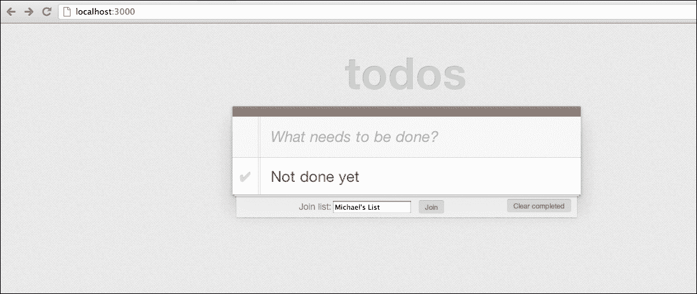
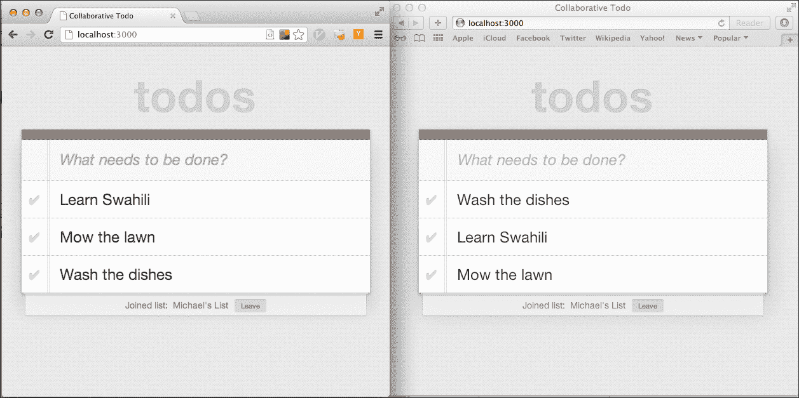

# 第五章. CoffeeScript 和 Node.js

Ryan Dahl 在 2009 年创建了 Node.js。他的目标是创建一个系统，使用户能够编写高性能的网络服务器应用程序，使用 JavaScript。当时，JavaScript 主要在浏览器中运行，因此服务器端框架需要某种方式来运行 JavaScript 而不依赖浏览器。Node 使用了 Google 的 V8 JavaScript 引擎，最初是为 Chrome 浏览器编写的，但由于它是一个独立的软件组件，它可以在任何地方运行 JavaScript 代码。Node.js 允许你编写可以在服务器上执行的 JavaScript 代码。它可以充分利用你的操作系统、数据库和其他外部网络资源。

让我们谈谈 Node.js 的一些特性。

# Node 是事件驱动的

Node.js 框架只允许非阻塞、异步 I/O。这意味着任何访问外部资源（如操作系统、数据库或网络资源）的 I/O 操作都必须异步进行。这是通过使用事件或回调来实现的，一旦操作成功或失败，就会触发回调。

这种做法的好处是，你的应用程序会变得更加可扩展，因为请求不需要等待缓慢的 I/O 操作完成，而是可以处理更多的传入请求。

其他语言中也有类似的框架，例如 Python 中的 **Twisted** 和 **Tornado**，以及 Ruby 中的 **EventMachine**。这些框架的一个大问题是它们所使用的所有 I/O 库都必须是非阻塞的。常常会不小心使用到会阻塞 I/O 操作的代码。

Node.js 是从头开始构建的，具有事件驱动哲学，并且只允许非阻塞 I/O，从而避免了这个问题。

# Node 是快速和可扩展的

Node.js 使用的 V8 JavaScript 引擎在性能上高度优化，因此使得 Node.js 应用程序非常快。Node 非阻塞的事实将确保你的应用程序能够在不使用大量系统资源的情况下处理许多并发客户端请求。

# Node 不是 Rails

虽然 Node 和 Rails 经常被用来构建类似类型的应用程序，但它们实际上非常不同。Rails 努力成为构建 Web 应用程序的全栈解决方案，而 Node.js 则更像是编写任何类型快速和可扩展网络应用的底层系统。它几乎不对你的应用程序结构做出任何假设，除了你将使用基于事件的架构。

因此，Node 开发者通常会从各种基于 Node 构建的框架和模块中选择，用于编写 Web 应用程序，例如 Express 或 Flatiron。

# Node 和 CoffeeScript

正如我们之前所看到的，CoffeeScript 可以作为 npm 模块使用。因此，使用 CoffeeScript 编写 Node.js 应用程序非常简单。事实上，我们之前讨论的`coffee`命令默认会使用 Node 运行`.coffee`脚本。要安装带有 CoffeeScript 的 Node，请参阅第二章，*运行 CoffeeScript*。

# "Hello World"在 Node 中

让我们使用 CoffeeScript 编写最简单的 Node 应用程序。创建一个名为`hello.coffee`的文件，并在其中输入以下代码：

```js
http = require('http')

server = http.createServer (req, res) ->
  res.writeHead 200
  res.end 'Hello World'

server.listen 8080
```

这使用了 Node.js 的`http`模块，它提供了构建 HTTP 服务器的功能。`require('http')`函数将返回一个`http`模块的实例，该实例导出`createServer`函数。此函数接受一个`requestListener`参数，该参数是一个将响应用户请求的函数。在这种情况下，我们以 HTTP 状态码`200`响应，并以`Hello World`作为请求体结束响应。最后，我们调用返回服务器的`listen`方法来启动它。当调用此方法时，服务器将监听和处理请求，直到我们停止它。

我们可以使用 coffee 命令运行此文件，如下所示：

```js
coffee hello.coffee
```

我们可以通过浏览到`http://localhost:8080/`来测试我们的服务器。我们应该看到一个只有文本的简单页面，内容为**Hello World**。

# Express

如您所见，Node 本身非常底层和简单。构建 Web 应用程序基本上意味着编写一个原始的 HTTP 服务器。幸运的是，在过去的几年中已经开发了许多库来帮助在 Node 上编写 Web 应用程序，并抽象出许多底层细节。

其中最受欢迎的可能是**Express** ([`expressjs.com/`](http://expressjs.com/))。与 Rails 类似，它具有许多使执行常见 Web 应用程序任务（如路由、渲染视图和托管静态资源）更简单的优秀功能。

在本章中，我们将使用 CoffeeScript 在 Express 中编写一个 Web 应用程序。

# WebSocket

由于我想展示一些 Node 的可扩展性功能以及它通常被用于的应用类型，我们将利用另一种有趣的现代网络技术，称为**WebSocket**。

WebSocket 协议是一个标准，允许通过标准 HTTP 端口**80**进行原始、双向和全双工（双向同时）的 TCP 连接。这允许客户端和服务器建立长期运行的 TCP 连接，服务器可以通过该连接执行推送操作，这在传统 HTTP 中是不可能的。它通常用于需要客户端和服务器之间大量低延迟交互的应用程序。

# Jade

Jade 是一种轻量级的标记模板语言，它允许你使用与 CoffeeScript 非常相似的语法编写优雅且简短的 HTML。它使用了许多特性，如语法空白，以减少你编写 HTML 文档所需的按键次数。通常情况下，当你运行 Express 时，它会默认安装，我们将在本书中使用它。

# 我们的应

在本章中，我们将构建一个协作式待办事项列表应用。这意味着你将能够实时与其他人共享你的待办事项列表。一个人或多人将能够同时添加、完成或删除待办事项列表项。待办事项列表的更改将自动传播到所有用户。这正是 Node 完美适合的应用类型。

我们的 Node.js 代码将包括两个不同的部分，一个是提供静态 HTML、CSS 和 JavaScript 的常规网络应用，另一个是处理所有待办事项列表客户端实时更新的 WebSocket 服务器。与此相关，我们还将有一个由 jQuery 驱动的客户端，其外观将非常类似于我们的 第三章 应用。

我们将使用一些现有待办事项应用的资产（样式表和图片）。我们还将重用来自第三章的客户端 jQuery 代码，并对它进行调整以适应我们的应用。如果你没有跟随前面的章节，你应该能够根据需要从本章的代码中复制资产。

# 让我们开始吧

要开始，我们将执行以下步骤：

1.  为我们的应用创建一个文件夹。

1.  使用 `package.json` 文件指定我们的应用依赖项。

1.  安装我们的依赖项。

1.  创建一个 `app.coffee` 文件。

1.  首次运行我们的应用。

## package.json

在名为 `todo` 的新文件夹中创建一个名为 `package.json` 的文件。将以下代码添加到该文件中：

```js
{
  "name": "todo",
  "version": "0.0.1",
  "private": true,
  "scripts": {
    "start": "node app"
  },
  "dependencies": {
    "express": "3.0.0beta6",
    "jade": "*",
    "socket.io": "*",
    "coffee-script": "*",
    "connect-assets": "*"
  }
}
```

这是一个简单的 JSON 文件，用作应用清单，并用于告诉 npm 你在应用中依赖哪些依赖项。在这里，我们使用 Express 作为我们的网络框架，Jade 作为我们的模板语言。由于我们将使用 WebSocket，我们将引入 `socket.io`。我们还可以通过将其添加到我们的文件中来确保 CoffeeScript 已安装。最后，我们将使用 `connect-assets`，这是一个模块，以与 Rails 资产管道类似的方式管理客户端资产。

在处理 Node.js 框架时，你会注意到应用通常是以这种方式由 npm 模块编织而成的。寻找 npm 模块的好地方是 Node 工具箱网站 ([nodetoolbox.com](http://nodetoolbox.com))。

## 安装我们的模块

要安装 `package.json` 文件中的依赖项，在命令行工具中导航到项目文件夹，并运行以下命令：

```js
npm install
```

如果一切顺利，那么我们现在应该已经安装了所有项目依赖项。为了验证这一点或只是查看 npm 做了什么，你可以运行以下命令：

```js
npm ls
```

这将输出一个以树形格式显示的已安装模块及其依赖项的列表。

## 创建我们的应用程序

运行我们的应用程序，我们只需要创建一个主、入口点文件，该文件用于连接我们的 Express 应用程序并指定我们的路由。在根文件夹中，创建一个名为`app.coffee`的文件，并将以下代码添加到其中：

```js
express = require 'express'
app = express()

app.get '/', (req, res) ->
  res.send('Hello Express')

app.listen(3000)
console.log('Listening on port 3000')
```

这看起来与我们的“Hello World”示例非常相似。

首先，我们使用`require`函数加载 Express 模块。Node 模块很简单；每个模块对应一个文件。每个模块可以声明代码，当它被导入时将被导出。当你调用`require`，并且模块的名称既不是原生模块也不是文件路径时，Node 会自动在`node_modules`文件夹中查找该文件。这当然是 npm 安装模块的地方。

在下一行，我们通过调用`express`函数并分配给`app`变量来创建我们的 Express 应用程序。

然后，我们使用`get`方法为我们的应用程序创建一个索引路由。我们指定路径为`'/'`，然后传递一个匿名函数来处理请求。它接受两个参数，即`req`和`res`参数。目前，我们只需将`Hello Express`写入响应并返回。

然后，我们使用`listen`方法启动我们的应用程序，并告诉它在端口`3000`上运行。最后，我们将写入标准输出，这样我们就会知道应用程序已启动。

如您所见，Express 的魔力在于声明性地设置路由。使用 Express，你可以通过指定 HTTP 方法、URL 路径和处理请求的函数来轻松创建路由。

## 运行我们的应用程序

让我们运行我们的应用程序，看看是否一切正常。在我们的应用程序文件夹中，在命令行工具中输入以下内容：

```js
coffee app.coffee
```

你应该看到输出为**监听端口 3000**。

将您的浏览器指向`http://localhost:3000/`。你应该看到文本**Hello Express**。

要在命令行工具中停止 Node 进程，只需使用*Ctrl* + *C*。

# 创建视图

与 Rails 等其他 Web 框架类似，Express 有视图的概念，这允许你使用单独的文件将 UI 与应用程序分离。通常，这些是用 Jade 等模板语言编写的。让我们为我们的根操作创建一个视图。

要做到这一点，我们需要：

1.  创建一个`views`文件夹并添加一个 Jade 视图文件。

1.  配置我们的 Express 应用程序以了解存储视图的文件夹以及我们正在使用的模板库。

1.  将我们的索引路由更改为渲染我们的视图。

让我们在项目根目录中创建一个新的文件夹，命名为`views`。在这个文件夹中，我们创建一个名为`index.jade`的新文件。它应该看起来像这样：

```js
doctype 5
html
  head
    title Our Jade view
  body
    p= message
```

如您所见，Jade 为普通 HTML 提供了非常干净和简洁的语法。您不需要在尖括号中包含结束标签。类似于 CoffeeScript，它也使用缩进来界定块，这样您就不需要输入结束标签。`p= message`行创建了一个`<p>`标签，其内容将被评估为`message`字段的值，这个值应该传递到我们的视图选项中。

在我们的`app.coffee`文件中，我们将添加以下代码：

```js
express = require 'express'
path = require 'path'
app = express()

app.set 'views', path.join __dirname, 'views'
app.set 'view engine', 'jade'

app.get '/', (req, res) ->
 res.render 'index', message: "Now we're cooking with gas!"

app.listen(3000)
console.log('Listening on port 3000')
```

这里，我们使用`set`函数设置`views`文件夹，并分配`'views'`键。我们使用文件顶部包含的`path`模块来创建和连接我们的当前文件夹名到`views`子文件夹。`__dirname`是一个全局变量，它指向当前工作文件夹。我们还设置了视图引擎为`'jade'`。

接下来，我们将我们的`get '/'`路由更改为渲染索引模板并传递一个包含消息的选项哈希。这是随后在视图中渲染的值。

一旦我们再次运行我们的应用程序并刷新页面，我们应该现在看到我们的页面已经更新为新的文本。

# node-supervisor

到目前为止，你可能想知道每次我们更改代码时是否需要重新启动我们的 Node 应用程序。理想情况下，在开发中，我们希望每次我们更改代码时，代码都能自动重新加载，就像在 Rails 中那样工作。

幸运的是，有一个整洁的开源库我们可以使用，它正好能做这件事：**node-supervisor** ([`github.com/isaacs/node-supervisor`](https://github.com/isaacs/node-supervisor))。我们像安装任何其他 npm 模块一样安装它，我们只是确保传递`-g`标志来全局安装，如下面的命令所示：

```js
npm install supervisor -g
```

在终端中，你现在应该可以使用以下命令运行 supervisor：

```js
supervisor app.coffee
```

在单独的窗口中保持此过程运行。为了检查是否成功，让我们编辑发送到视图的消息；编辑后的消息在下面的代码片段中被突出显示：

```js
app.get '/', (req, res) ->
 res.render 'index', message: "Now we're cooking with supervisor!"

```

如果我们现在刷新我们的页面，我们会看到它已经被更新。从现在开始，我们可以确保 supervisor 在运行，我们不需要重新启动 Node 进程来做出更改。

# 待办事项列表视图

现在让我们扩展我们的视图，使其看起来像我们的真实待办事项应用程序。编辑`index.jade`文件，使其看起来如下：

```js
doctype 5
html
  head
 title Collaborative Todo
  body
 section#todoapp
 header#header
 h1 todos
 input#new-todo(placeholder="What needs to be done?", autofocus=true)
 section#main
 ul#todo-list
 footer#footer
 button#clear-completed Clear completed

```

这里有一些我们之前没有见过的新的 Jade 语法。标签 ID 由`#`符号表示，所以`header#header`变为`<header id="header">`。标签属性在方括号内指定，如下所示：`tag(name="value")`。

由于我们不再在模板中使用`message`变量，我们将从`app.coffee`文件中的`render`调用中移除它，如下面的代码片段所示：

```js
app.get '/', (req, res) ->
 res.render 'index'

```

我们的页面现在将更新，但看起来可能不太好看。我们将使用在之前项目中使用的相同样式表来美化我们的页面。

### 小贴士

**未按预期工作？**

记得关注 supervisor 进程的输出，看看你的 CoffeeScript 或 Jade 模板中是否有语法错误，尤其是如果你没有看到预期的输出。

在我们使用样式表之前，我们需要设置 Express 为我们提供静态文件服务。修改`app.coffee`文件，使其看起来如下：

```js
express = require 'express'
path = require 'path'

app = express()

app.set 'views', path.join __dirname, 'views'
app.set 'view engine', 'jade'
app.use(express.static(path.join __dirname, 'public'))

```

那么在之前的代码片段中发生了什么？我们在一行中添加了对静态文件服务的支持，但这是如何工作的？答案在于 Node 如何使用中间件。

## 中间件

Express 框架建立在名为**Connect**的底层框架之上（[`www.senchalabs.org/connect/`](http://www.senchalabs.org/connect/)）。Connect 的基本思想是提供用于 Web 请求的中间件。

中间件可以串联起来以生成一个 Web 应用程序堆栈。每个中间件部分只关心通过修改输出响应或请求的控制流来提供一小组功能。

在我们的例子中，我们告诉应用程序使用由`express.static`函数创建的中间件。这个函数将为提供的文件路径创建一个静态文件服务器。

## 我们的样式表

创建一个名为`public`的文件夹，并在其中创建一个名为`css`的子文件夹。将样式表保存为`todo.css`在这个文件夹中。我们仍然需要在`index`视图中包含这个样式表。将以下行——代码片段中突出显示的内容——添加到`views`文件夹中的`index.jade`文件中：

```js
doctype 5
html
  head
  title  Collaborative Todo
 link(rel="stylesheet", href="css/todo.css")
  body
```

一旦我们链接了样式表，我们应该能够刷新我们的视图。现在它看起来应该会好很多。

# 客户端

为了使我们的待办事项应用程序工作，我们将复制在第三章中创建的客户端 jQuery 代码。我们将把它放在一个名为`todo.coffee`的文件中。

我们接下来的决定是，我们应该把这个文件放在哪里？我们如何在应用程序中编译和使用它的输出？

我们在第三章中构建应用程序时做了同样的事情，即创建一个包含客户端 offeeScript 代码的`src`文件夹，然后使用带有`--watch`标志的`coffee`命令编译它。生成的 JavaScript 可以放入我们的`public`文件夹中，我们可以像通常一样包含它。但这意味着我们将有两个独立的后台任务在运行，一个是运行我们的服务器的 supervisor 任务，另一个是编译我们的客户端代码。

幸运的是，有更好的方法。你可能还记得我们在`package.json`文件中有一个对`connect-assets`模块的引用。它为我们提供了一个与 Rails 中得到的非常相似的资产管道。它将透明地处理编译和依赖关系管理。

我们需要在`app.coffee`文件中使用中间件，如下代码片段所示：

```js
app.set 'views', path.join __dirname, 'views'
app.set 'view engine', 'jade'
app.use(express.static(path.join __dirname, 'public'))
app.use require('connect-assets')()

```

`connect-assets`模块默认将使用`assets`文件夹来管理和提供资产。让我们在根文件夹中创建一个名为`assets/js`的文件夹。我们将在该文件夹中创建一个名为`todo.coffee`的新文件，包含以下代码：

```js
Storage::setObj = (key, obj) ->
  localStorage.setItem key, JSON.stringify(obj)

Storage::getObj = (key) ->
  JSON.parse this.getItem(key)

class TodoApp

  constructor: ->
    @cacheElements()
    @bindEvents()
    @displayItems()

  cacheElements: ->
    @$input = $('#new-todo')
    @$todoList = $('#todo-list')
    @$clearCompleted = $('#clear-completed')

  bindEvents: ->
    @$input.on 'keyup', (e) => @create e
    @$todoList.on 'click', '.destroy', (e) => @destroy e.target
    @$todoList.on 'change', '.toggle', (e) => @toggle e.target
    @$clearCompleted.on 'click', (e) => @clearCompleted()

  create: (e) ->
    val = $.trim @$input.val()
    return unless e.which == 13 and val

    randomId = Math.floor Math.random()*999999

    localStorage.setObj randomId,{
      id: randomId
      title: val
        completed: false
    }
    @$input.val ''
    @displayItems()

  displayItems: ->
    @clearItems()
    @addItem(localStorage.getObj(id)) for id in Object.keys(localStorage)

  clearItems: ->
    @$todoList.empty()

  addItem: (item) ->
    html = """
      <li #{if item.completed then 'class="completed"' else ''} data-id="#{item.id}">
        <div class="view">
          <input class="toggle" type="checkbox" #{if item.completed then 'checked' else ''}>
          <label>#{item.title}</label>
          <button class="destroy"></button>
        </div>
     </li>
    """
    @$todoList.append html

  destroy: (elem) ->
    id = ($(elem).closest 'li').data('id')
    localStorage.removeItem id
    @displayItems()

  toggle: (elem) ->
    id = $(elem).closest('li').data('id')
    item = localStorage.getObj(id)
    item.completed = !item.completed
    localStorage.setObj(id, item)

  clearCompleted: ->
    (localStorage.removeItem id for id in Object.keys(localStorage) \
      when (localStorage.getObj id).completed)
    @displayItems()

$ ->
  app = new TodoApp()
```

如果您一直在跟随第三章，那么这段代码应该很熟悉。这是我们完整的客户端应用程序，它显示待办事项，并在`localStorage`中创建、更新和销毁项目。

要在我们的 HTML 中使用此文件，我们仍然需要包含一个`script`标签。由于我们使用 jQuery，我们还需要在 HTML 中包含库。

将以下代码添加到`index.jade`文件的底部：

```js
script(src="img/jquery.min.js")
!= js('todo')
```

如您所见，我们使用 Google CDN 包含了 jQuery 的链接。然后我们使用由`connect-assets`提供的`js`辅助函数，创建一个指向我们编译的`todo.js`文件的`script`标签（`connect-assets`模块将透明地编译我们的 CoffeeScript）。`!=`符号是 Jade 的语法，用于运行 JavaScript 函数及其结果。

如果一切顺利，我们应该能够刷新页面，并拥有一个工作状态良好的客户端页面，用于我们的应用。尝试添加新项目，标记项目为完成，删除项目，以及清除已完成的项目。

# 添加协作

现在我们已经准备好将协作添加到我们的待办事项列表应用程序中。我们需要创建一个页面，让多个用户可以连接到同一个待办事项列表，并可以同时编辑它，实时看到结果。

我们希望支持命名列表的概念，您可以通过它与他人协作。

在我们深入功能之前，让我们稍微调整一下我们的 UI，以支持所有这些功能。

# 创建协作 UI

首先，我们将添加一个输入字段来指定列表名称，以及一个按钮来加入指定的列表。

对我们的`index.jade`文件进行以下更改（代码片段中突出显示），这将添加一个`input`元素和一个`button`元素来指定我们的列表名称并加入它：

```js
      footer#footer
 | Join list:
 input#join-list-name
 button#join Join
        button#clear-completed Clear completed
  script(src="img/jquery.min.js")
  != js('todo')
```

我们的页面现在应该看起来像以下截图显示的页面：



# 客户端的 WebSocket

现在，让我们添加一个事件处理程序，当用户点击**加入**按钮时连接到房间。

在我们的`todo.coffee`文件中，我们将在`cacheElements`和`bindEvents`函数中添加以下代码：

```js
cacheElements: ->
    @$input = $('#new-todo')
    @$todoList = $('#todo-list')
    @$clearCompleted = $('#clear-completed')
 @$joinListName = $("#join-list-name")
 @$join = $('#join')

  bindEvents: ->
    @$input.on 'keyup', (e) => @create e
    @$todoList.on 'click', '.destroy', (e) => @destroy e.target
    @$todoList.on  'change', '.toggle', (e) => @toggle e.target
    @$clearCompleted.on 'click', (e) => @clearCompleted()
 @$join.on 'click', (e) => @joinList()

```

我们获取`join-list-name`输入和`join`按钮元素，并将它们存储在两个实例变量中。然后我们在`@$join`按钮上设置`click`处理程序，以调用一个名为`joinList`的新函数。让我们现在就定义这个函数。在`bindEvents`函数定义之后将其添加到类的末尾：

```js
clearCompleted: ->
    (localStorage.removeItem id for id in Object.keys(localStorage) \
      when (localStorage.getObj id).completed)
    @displayItems()

 joinList: ->
 @socket = io.connect('http://localhost:3000')

 @socket.on 'connect', =>
@socket.emit 'joinList', @$joinListName.val()

```

这里是我们开始使用 Socket.IO 的地方。Socket.IO 库分为两部分：客户端库用于打开 WebSocket 连接，发送请求，并接收响应，以及服务器端 node 模块用于处理请求。

在前面的代码中，`joinList` 函数使用 `io.connect` 函数打开一个新的套接字，并传递 URL。然后它使用 `on` 函数传递一个处理函数，该函数将在 WebSocket 连接建立后运行。

成功连接处理函数将反过来使用 `socket.emit` 函数，这允许我们使用 `joinList` 作为标识符向服务器发送自定义消息。我们将 `@joinListName` 输入的值作为其值传递。

在我们开始实现服务器端代码之前，我们仍然需要包含一个 `script` 标签来使用 `socket.io` 客户端库。在 `index.jade` 文件的底部添加以下高亮的 `script` 标签：

```js
script(src="img/jquery.min.js")
script(src="img/socket.io.js")
!= js('todo')
```

你可能想知道这个文件是从哪里来的。接下来，我们将在 `app.coffee` 文件中设置 Socket.IO 中间件。这将为我们托管客户端库。

# 服务器上的 WebSocket

我们已经准备好了客户端代码来发送 WebSocket 请求；现在我们可以继续我们的 Node 后端。首先，我们需要设置我们的 Socket.IO 中间件。这里有一个小的注意事项，我们不能直接将 Socket.IO 作为 Express 应用程序的中间件使用，因为 Socket.IO 期望一个 Node.js HTTP 服务器，并且没有直接支持 Express。相反，我们将使用内置的 Node.js HTTP 模块创建一个网络服务器，并将我们的 Express 应用程序作为 `requestListener` 传递。然后我们可以使用 Socket.IO 的 `listen` 函数连接到服务器。

以下是我们 `app.coffee` 文件中的代码外观：

```js
express = require 'express'
path = require 'path'

app = express()
server = (require 'http').createServer app
io = (require 'socket.io').listen server

app.set 'views', path.join __dirname, 'views'
app.set 'view engine', 'jade'
app.use(express.static(path.join __dirname, 'public'))
app.use (require 'connect-assets')()

app.get '/', (req, res) ->
  res.render 'index'

io.sockets.on 'connection', (socket) =>
 console.log('connected')
 socket.on 'joinList', (list) => console.log "Joining list #{list}"

server.listen(3000)
console.log('Listening on port 3000')
```

`io.sockets.on 'connection'` 函数处理客户端连接的事件。在这里，我们向控制台记录我们已连接的信息，然后设置 `joinList` 消息处理程序。目前，我们只是将客户端发送给我们的值记录到控制台。

我们现在应该能够测试连接到一个列表。刷新我们的待办事项列表主页，并输入一个要加入的列表名称。点击 **加入** 按钮后，转到我们的后台管理任务。你应该会看到以下类似的消息：

**已连接**

**加入迈克尔列表**

成功了！我们已经成功创建了一个双向 WebSocket 连接。到目前为止，我们还没有真正加入一个列表，所以让我们现在就加入。

# 加入列表

要加入一个列表，我们将使用 Socket.IO 的一个功能，称为 **rooms**。它允许 Socket.IO 服务器对客户端进行分段，并向所有已连接客户端的子集发送消息。在服务器上，我们将跟踪每个房间的待办事项列表，然后告诉客户端在连接时同步其本地列表。

我们将在 `app.coffee` 文件中更新高亮显示的代码，如下所示：

```js
@todos = {}
io.sockets.on 'connection', (socket) =>
  console.log('connected')
  socket.on 'joinList', (list) =>
    console.log "Joining list #{list}"
 socket.list = list
 socket.join(list)
 @todos[list] ?= []
 socket.emit 'syncItems', @todos[list]

```

我们初始化 `@todos` 实例变量为一个空哈希表。它将保存每个房间的待办事项列表，使用列表名称作为键。在 `joinList` 处理函数中，我们将 `socket` 变量的 `list` 属性设置为客户端传递进来的列表名称。

然后，我们使用`socket.join`函数将我们的列表加入到一个具有该名称的房间中。如果该房间尚不存在，它将被创建。然后，我们将一个空数组值分配给`@todos`中具有`list`键的项。`?=`运算符仅在左侧对象为`null`时将右侧的值分配给左侧对象。

最后，我们使用`socket.emit`函数向客户端发送消息。`syncItems`标识符将告诉它同步其本地数据与传递给它的待办事项列表项。

为了处理`syncItems`消息，我们需要更新`todo.coffee`文件，如下所示的高亮代码：

```js
  joinList: ->
    @socket = io.connect('http://localhost:3000')
    @socket.on 'connect', => 
   @socket.emit 'joinList', @$joinListName.val()

 @socket.on 'syncItems', (items) =>
 @syncItems(items)

 syncItems: (items) ->
 console.log 'syncing items'
 localStorage.clear()
 localStorage.setObj item.id, item for item in items
 @displayItems()

```

加入列表后，我们设置客户端连接以处理`syncItems`消息。我们期望接收我们刚刚加入的列表的所有待办事项。`syncItems`函数将清除`localStorage`中的所有当前项，添加所有新项，然后显示它们。

## 界面

最后，让我们更新我们的 UI，以便用户知道他们已经加入了一个列表，并允许他们离开它。我们将在`index.jade`文件中将以下修改应用于`#footer div`标签：

```js
doctype 5
html
  head
  title  Collaborative Todo
  link(rel="stylesheet", href="css/todo.css")
  body
    section#todoapp
      header#header
        h1 todos
        input#new-todo(placeholder="What needs to be done?", autofocus=true)
      section#main
        ul#todo-list
 footer#footer
 section#connect
          | Join list:
          input#join-list-name
          button#join Join
          button#clear-completed Clear completed
 section#disconnect.hidden
 | Joined list: &nbsp
 span#connected-list List name
 button#leave Leave
    script(src="img/jquery.min.js")
    script(src="img/socket.io.js")
    != js('todo')
```

在之前的标记中，我们向`footer div`标签添加了两个新的部分。每个部分将根据我们处于哪种状态（连接到列表的`connected`或`disconnected`）而隐藏或显示。`connect`部分与之前相同。`disconnect`部分将显示您当前连接到的列表，并有一个**离开**按钮。

现在，我们将向`todo.coffee`文件添加代码以在加入列表时更新界面。

首先，我们将在`cacheElements`函数中缓存新元素，如下代码片段所示：

```js
cacheElements: ->
    @$input = $('#new-todo')
    @$todoList = $('#todo-list')
    @$clearCompleted = $('#clear-completed')
 @$joinListName = $("#join-list-name")
 @$join = $('#join')
 @$connect = $('#connect')
 @$disconnect = $('#disconnect')
 @$connectedList = $('#connected-list')
 @$leave = $('#leave')

```

接下来，我们将更改 UI 以在调用`syncItems`（在成功加入列表后由服务器触发）时显示我们处于`connected`状态。我们使用`@currentList`函数，我们将在`joinList`函数中设置它；在以下代码片段中添加高亮代码：

```js
  joinList: ->
    @socket = io.connect('http://localhost:3000')
    @socket.on 'connect', =>
 @currentList = @$joinListName.val()
      @socket.emit 'joinList', @currentList

    @socket.on 'syncItems', (items) => @syncItems(items)

  syncItems: (items) ->
    console.log 'syncing items'
    localStorage.clear()
    localStorage.setObj item.id, item for item in items
    @displayItems()
 @displayConnected(@currentList)

 displayConnected: (listName) ->
 @$disconnect.removeClass 'hidden'
 @$connectedList.text listName
 @$connect.addClass 'hidden'

```

`displayConnected`函数将仅隐藏`connect`部分并显示`disconnect`部分。

## 离开列表

离开列表应该相当简单。我们断开当前套接字连接，然后更新 UI。

为了处理按钮点击时的`disconnect`动作，我们在`bindEvents`函数中添加了一个处理程序，如下代码片段所示：

```js
bindEvents: ->
    @$input.on 'keyup', (e) => @create e
    @$todoList.on 'click', '.destroy', (e) => @destroy e.target
    @$todoList.on  'change', '.toggle', (e) => @toggle e.target
    @$clearCompleted.on 'click', (e) => @clearCompleted()
    @$join.on 'click', (e) => @joinList()
 @$leave.on 'click', (e) => @leaveList()

```

如您所见，我们添加的处理程序将仅调用一个`leaveList`函数。我们还需要实现它。将以下两个函数添加到`TodoApp`类中最后一个函数定义之后：

```js
 leaveList: ->
    @socket.disconnect() if @socket
    @displayDisconnected()

  displayDisconnected: () ->
    @$disconnect.addClass 'hidden'
    @$connect.removeClass 'hidden'
```

## 测试所有操作

现在让我们测试我们的列表加入和离开代码。要看到所有操作，请按照以下步骤进行：

1.  在您的浏览器中打开`http://localhost:3000/`。

1.  在浏览器窗口中，输入列表名称并点击**加入列表**。界面应该按预期更新。

1.  加入列表后，添加一些待办事项。

1.  再次打开网站，这次使用第二个浏览器。由于`localStorage`对每个浏览器都是唯一的，我们这样做是为了有一个干净的待办事项列表。

1.  再次，输入与另一个浏览器中相同的列表名称，然后点击**加入列表**。

1.  当列表同步时，您现在应该会看到之前添加的列表项出现在列表中。

1.  最后，使用**离开**按钮从列表中断开连接。



来自不同浏览器的两个同步列表

这太棒了！我们现在可以看到 WebSocket 的实际力量。当不需要轮询服务器时，客户端会收到同步项的通知。

然而，一旦我们连接到列表，我们仍然不能添加新项目，以便它们在所有其他客户端中显示。让我们来实现这一点。

# 将待办事项添加到共享列表

首先，我们将在服务器上处理添加新项目。处理此操作的最佳位置是在创建待办事项的现有`create`函数中。我们不仅将它们添加到`localStorage`，还会向服务器发出消息，告诉它已创建新的待办事项，并将其作为参数传递。将`create`函数修改如下代码：

```js
create: (e) ->
    val = $.trim @$input.val()
    return unless e.which == 13 and val

    randomId = Math.floor Math.random()*999999

 newItem =
 id: randomId
 title: val
 completed: false

 localStorage.setObj randomId, newItem
 @socket.emit 'newItem', newItem if @socket
    @$input.val ''
    @displayItems()
```

我们需要在服务器上处理`newItem`消息。我们将在`app.coffee`中设置代码，以便在客户端加入列表时执行此操作。

让我们修改之前添加的`joinList`事件处理器；在以下代码片段中添加高亮代码：

```js
io.sockets.on 'connection', (socket) =>
  console.log("connected")
  socket.on 'joinList', (list) =>
    console.log "Joining list #{list}"
    socket.list = list
    socket.join(list)
    @todos[list] ?= []

    socket.emit 'syncItems', @todos[list]

 socket.on 'newItem', (todo) =>
 console.log "new todo #{todo.title}"
 @todos[list].push todo
 io.sockets.in(socket.list).emit('itemAdded', todo)

```

在此代码片段中，我们设置了一个新的`socket`事件，当用户加入列表时。在这种情况下，它是针对`newItem`事件的。我们使用`push`函数将新的待办事项添加到我们的`@todos`数组中。然后，我们向当前列表中的所有客户端发出新的`itemAdded`消息。

这个`itemAdded`消息会发生什么？您猜对了；它将在客户端再次被处理。这种来回的消息传递在 WebSocket 应用程序中很常见，并且确实需要一些习惯。不过别担心；一旦掌握了技巧，就会变得容易。

同时，让我们在客户端处理`itemAdded`事件。我们还在`joinList`方法中设置了此代码，通过在以下代码片段中添加高亮代码：

```js
joinList: ->
    @socket = io.connect('http://localhost:3000')
    @socket.on 'connect', =>
      @currentList = @$joinListName.val()
      @socket.emit 'joinList', @currentList

    @socket.on 'syncItems', (items) => @syncItems(items)

 @socket.on 'itemAdded', (item) =>
 localStorage.setObj item.id, item
 @displayItems()

```

我们通过调用`localStorage.setObject`并传递项目 ID 和值来处理`itemAdded`事件。如果它不在`localStorage`中，这将创建一个新的待办事项；或者，它将更新现有的值。

就这样！我们现在应该能够向列表中的所有客户端添加项目。为了测试它，我们将遵循与之前类似的步骤：

1.  在您的浏览器中打开`http://localhost:3000/`。

1.  在浏览器窗口中，输入一个列表名称并点击**加入列表**。UI 应该按预期更新。

1.  现在再次打开网站，这次使用第二个浏览器。

1.  再次，输入与另一个浏览器中相同的列表名称，然后点击**加入列表**。

1.  在任一浏览器中添加新的待办事项。您将立即在另一个浏览器中看到待办事项的出现。

哇！这不是很令人印象深刻吗？

# 从共享列表中删除待办事项

要从共享列表中删除待办事项，我们将遵循与添加项类似的模式。在 `todo.coffee` 中的 `destroy` 函数中，我们将向我们的套接字发送一个 `removeItem` 消息，让服务器知道应该删除一个项，如下面的代码片段所示：

```js
destroy: (elem) ->
    id = ($(elem).closest 'li').data('id')
    localStorage.removeItem id
 @socket.emit 'removeItem', id if @socket
    @displayItems()
```

再次设置服务器端代码来处理此消息，通过从内存中的共享列表中删除项，然后通知所有连接到列表的客户端该项已被删除：

```js
io.sockets.on 'connection', (socket) =>
  console.log("connected")
  socket.on 'joinList', (list) =>
    console.log "Joining list #{list}"
    socket.list = list
    socket.join(list)
    @todos[list] ?= []

    socket.emit 'syncItems', @todos[list]

    socket.on 'newItem', (todo) =>
      console.log "new todo #{todo.title}"
      @todos[list].push todo
      io.sockets.in(socket.list).emit('itemAdded', todo)

 socket.on 'removeItem', (id) =>
 @todos[list] = @todos[list].filter (item) -> item.id isnt id
 io.sockets.in(socket.list).emit('itemRemoved', id)

```

`removeItem` 事件处理程序获取要删除的任务项的 ID。它通过将共享列表的当前值赋给一个使用 JavaScript 的数组 `filter` 函数创建的新值来从列表中删除待办事项。这将选择所有没有传递 ID 的项。然后，它对共享列表中所有客户端套接字连接调用 `emit`，并传递 `itemRemoved` 消息。

最后，我们需要在我们的客户端中处理 `itemRemoved` 消息。类似于添加项时，我们将在 `todo.coffee` 中的 `joinList` 函数中设置此操作，如下面的代码片段所示：

```js
joinList: ->
    @socket = io.connect('http://localhost:3000')
    @socket.on 'connect', =>
      @currentList = @$joinListName.val()
      @socket.emit 'joinList', @currentList

    @socket.on 'syncItems', (items) => @syncItems(items)

    @socket.on 'itemAdded', (item) =>
      localStorage.setObj item.id, item
      @displayItems()

 @socket.on 'itemRemoved', (id) =>
 localStorage.removeItem id
 @displayItems()

```

我们从 `localStorage` 中删除项并更新 UI。

要测试删除项，请按照以下步骤操作：

1.  在您的浏览器中打开 `http://localhost:3000/`。

1.  在浏览器窗口中，输入一个列表名称，然后点击 **加入列表**。UI 应按预期更新。

1.  一旦您连接到共享列表，添加一些待办事项。

1.  现在再次打开网站，这次使用第二个浏览器。

1.  再次输入与另一个浏览器中相同的列表名称，然后点击 **加入列表**。您的待办事项列表将与共享列表同步，并包含您在另一个浏览器中添加的项。

1.  点击删除图标以在任一浏览器中删除待办事项。您将立即看到被删除的待办事项在另一个浏览器中消失。

## 现在，轮到你了

作为最后的练习，我将要求您使 **清除已完成** 按钮工作。作为一个提示，您应该能够使用现有的 `destroyItem` 方法功能。

# 摘要

在本章中，我们通过探索 Node.js 作为快速、基于事件的平台，让您可以使用 JavaScript 或 CoffeeScript 编写服务器应用程序，完成了对 CoffeeScript 生态系统的全面游览。我希望您已经看到了使用 CoffeeScript 在服务器和浏览器上同时编写 Web 应用程序的乐趣。

我们还花了一些时间与为 Node.js 编写的许多出色的开源库和框架一起工作，如 expressjs、connect 和 Socket.IO，并看到了我们如何成功使用 npm 来管理应用程序中的依赖项和模块。

我们的示例应用程序正是您会用 Node.js 来实现的那种类型，我们看到了它的基于事件的模型如何适合编写客户端和服务器之间有大量持续交互的应用程序。

现在我们已经结束了这段旅程，我希望我已经在你心中种下了渴望和技能，让你能够走出并使用 CoffeeScript 改变世界。我们花了一些时间探索的不仅仅是语言，还有那些奇妙的工具、库和框架，它们使我们能够用更少的代码更快地开发出强大的应用程序。

CoffeeScript 和 JavaScript 生态系统的未来光明，希望你们能成为其中的一员！
