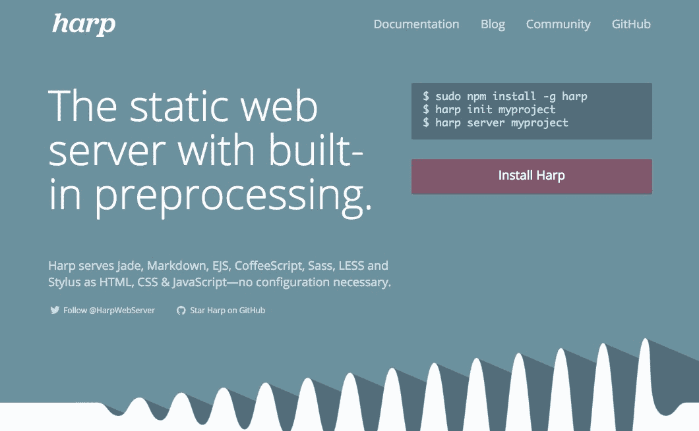
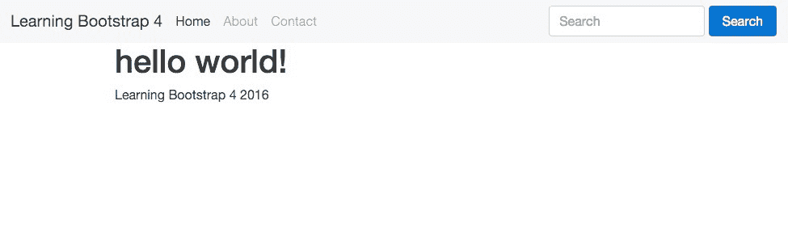
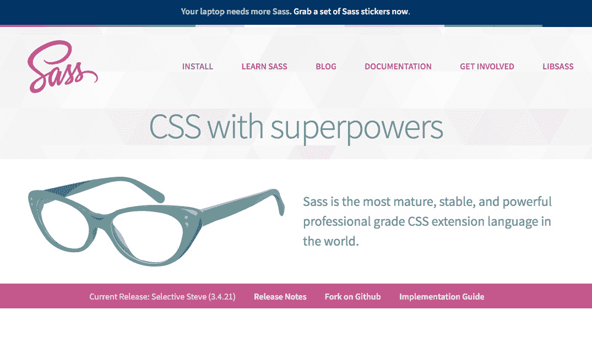

# 第一章. 设置我们的第一个博客项目

Bootstrap 是现代网络开发世界中最受欢迎的 HTML、CSS 和 JavaScript 框架。无论你是网络开发的新手还是经验丰富的专业人士，Bootstrap 都是构建任何类型网络应用的强大工具。随着版本 4 的发布，Bootstrap 比以往任何时候都更加相关，并带来了一套易于学习和使用的完整组件。在本课中，我将向你展示如何使用所有必要的文件设置我们的第一个博客项目。

# 实现框架文件

在我们开始构建 Bootstrap 项目的基本模板之前，我们应该回顾我们需要包含的文件，以确保框架能够正常运行。为此的最小要求：一个 CSS 文件和两个 JavaScript 文件。这些文件可以从 Bootstrap **内容分发网络**（**CDN**）提供，或者下载并直接包含在我们的项目中。当使用 CDN 时，只需在文件头部包含以下代码行：

```js
<link rel="stylesheet" href="https://maxcdn.bootstrapcdn.com/bootstrap/4.0.0-alpha.2/css/bootstrap.min.css" integrity="sha384-y3tfxAZXuh4HwSYylfB+J125MxIs6mR5FOHamPBG064zB+AFeWH94NdvaCBm8qnd" crossorigin="anonymous"> 

```

### 注意

CDNs 有助于在多个服务器之间分配带宽，并允许用户从更近的源下载静态内容。

Bootstrap 可以从[`www.bootstrapcdn.com/`](https://www.bootstrapcdn.com/)加载。BootstrapCDN 由 MaxCDN 提供支持，可在[`www.maxcdn.com/`](https://www.maxcdn.com/)找到。

# 插入 JavaScript 文件

如我之前提到的，我们需要包含两个 JavaScript 文件以正确实现框架。这些文件是**jQuery**和**Bootstrap JavaScript**框架文件。与 CSS 文件一样，你可以通过使用 CDN 或下载并手动插入文件来完成此操作。JavaScript 文件应插入到页面底部，紧接在`</body>`标签之前。如果你选择使用 CDN，请插入以下代码行：

```js
<script src="img/jquery.min.js"></script> 
<script src="img/bootstrap.min.js" integrity="sha384-vZ2WRJMwsjRMW/8U7i6PWi6AlO1L79snBrmgiDpgIWJ82z8eA5lenwvxbMV1PAh7" crossorigin="anonymous"></script> 

```

如果你喜欢自己插入文件，请回到你之前下载的 Bootstrap 包，并定位到`/js`目录。这里会有一些文件，但你想要的是`bootstrap.min.js`。你还需要前往[`jquery.com`](http://jquery.com/)下载 jQuery 框架文件。一旦完成，将这两个文件放入你自己的项目的`/js`目录中。接下来，在你的页面模板底部输入以下代码行。确保在`bootstrap.min.js`之前加载 jQuery。这是至关重要的；如果你以相反的顺序加载它们，框架将无法正常工作：

```js
<script src="img/jquery.min.js"></script> 
<script src="img/bootstrap.min.js"></script> 

```

这就完成了对所需关键 Bootstrap 框架文件的解释。下一步将是设置基本启动模板，以便你可以开始编码你的项目。

# 启动模板

基本启动模板是你使用 Bootstrap 开始页面所需的基本框架。让我们首先回顾整个模板的代码，然后我会逐个解析每个关键部分：

```js
<!DOCTYPE html> 
<html lang="en"> 
  <head> 
    <!-- Required meta tags always come first --> 
    <meta charset="utf-8"> 
    <meta name="viewport" content="width=device-width, initial-scale=1, shrink-to-fit=no"> 
    <meta http-equiv="x-ua-compatible" content="ie=edge"> 

    <!-- Bootstrap CSS --> 
    <link rel="stylesheet" href="https://maxcdn.bootstrapcdn.com/bootstrap/4.0.0-alpha.2/css/bootstrap.min.css" integrity="sha384-y3tfxAZXuh4HwSYylfB+J125MxIs6mR5FOHamPBG064zB+AFeWH94NdvaCBm8qnd" crossorigin="anonymous"> 
  </head> 
  <body> 
    <h1>Hello, world!</h1> 

    <!-- jQuery first, then Bootstrap JS. --> 
    <script src="img/jquery.min.js"></script> 
    <script src="img/bootstrap.min.js" integrity="sha384-vZ2WRJMwsjRMW/8U7i6PWi6AlO1L79snBrmgiDpgIWJ82z8eA5lenwvxbMV1PAh7" crossorigin="anonymous"></script> 
  </body> 
</html> 

```

## HTML5 文档类型

和现在的大多数项目一样，Bootstrap 使用 HTML5 DOCTYPE 作为其模板。这由以下代码行表示：

```js
<!DOCTYPE html> 

```

避免使用其他 DOCTYPE，如 **XHTML** 严格或过渡型，否则你的组件和布局可能会出现意外问题。

## 结构化响应式 meta 标签

Bootstrap 是一个以移动端优先的框架，因此需要包含以下 meta 标签以允许响应式网页设计。为了确保你的项目能够在所有类型的设备上正确渲染，你必须将此 meta 标签包含在项目的 `<head>` 中：

```js
<meta name="viewport" content="width=device-width, initial-scale=1, shrink-to-fit=no"> 

```

如果你想要了解更多关于如何在 Bootstrap 中实现响应式网页设计的细节，你应该查看以下文档：[`v4-alpha.getbootstrap.com/layout/responsive-utilities/`](http://v4-alpha.getbootstrap.com/layout/responsive-utilities/)。

这就结束了模板中你需要了解的最重要部分。起始模板中的其余代码应该是简单易懂的。

# 正规化和重启

如我之前提到的，Bootstrap 使用 `normalize.css` 作为其基础 CSS 重置。随着 Reboot 重置的添加，Bootstrap 扩展了 Normalize，并允许仅使用 CSS 类进行样式化。这是一个更安全的模式，因为它在你不使用 CSS ID 进行样式化时，处理 CSS 特异性要容易得多。CSS 重置代码直接嵌入到 `bootstrap.min.css` 中，因此不需要包含任何额外的 CSS 文件进行重置。

# 将起始模板进一步发展

虽然我们已经设置了模板，但静态网站的一个主要问题是当内容发生变化时。如果你的项目增长到 50、100 或 500 页，并且你想要更新到 Bootstrap 的新版本，你可能需要更新所有这些文件。这可以说是非常痛苦。现在我们进入静态站点生成器。

# 使用静态站点生成器

目前在网页开发中最热门的趋势之一是使用静态站点生成器。这究竟意味着什么呢？不是拥有多个静态文件，每次全局有变化时都需要更新，你可以使用一系列基础模板，然后将你的主体内容加载到它们中。这有时被称为包含或部分。这样，你只需要一个或两个包含头部和尾部代码的布局文件。

然后，当有变化发生时，你只需要更新几个文件，而不是 500 个。一旦你的网站完成，然后生成一个纯 HTML、CSS 和 JavaScript 版本，并将其部署到服务器上。这就是我所说的创建你自己的前端网页开发环境。这也是现在大多数人处理大型项目以保持其可管理性的方式。

# 将基础模板转换为生成器

我们为什么不将基本模板集成到生成器中，这样我就可以向你展示我在说什么？我选择的生成器是 Harp.js，你可以通过遵循代码文件夹中提供的步骤来安装它（`安装手册`）。

使用静态站点生成器，如 Harp.js，有许多很好的理由：更干净的代码、现代最佳实践和更多。然而，最好的理由是它将使你的生活变得简单。你不必更新网站所有 50 页的标题，你只需部分更新标题，然后将其编译到所有模板中。你还可以利用变量来插入内容和配置。



# 设置博客项目

让我们从创建一个新的目录开始，并将其命名为类似 `Bootstrap Blog` 的东西。打开该文件夹，并在其中创建以下子目录：

+   css

+   fonts

+   img

+   js

+   partial

## css

`css` 目录将包含 Bootstrap 框架的 CSS 文件和我们将稍后构建的自定义主题文件。转到 Bootstrap 源文件目录，找到 `dist/css` 文件夹。从那里，将 `bootstrap.min.css` 复制到我们的新博客项目的 `css` 目录中。

## fonts

`fonts` 目录将包含字体图标库，例如 Glyphicon 或 Font Awesome。以前，Bootstrap 随带 Glyphicon，但在版本 4 中已经不再包含它。如果你希望使用它，你需要下载图标字体集，然后将文件放入这个目录中。你还可以在这个目录中包含你可能在项目中使用的网络字体。如果你正在寻找网络字体，一个好的起点是 Google Web Fonts。

## img

`img` 目录将包含博客中使用的任何图像。

## js

`js` 或 JavaScript 目录将包含 Bootstrap 框架的 JavaScript 文件。如果你添加了任何其他第三方库，它们也应该包含在这个目录中。最后一次回到 Bootstrap 源文件，找到 `dist/js` 文件夹。从那里，将 `bootstrap.min.js` 复制到博客项目的 `js` 目录中。

## partial

`partial` 目录将包含我们希望在模板或网页的多个位置重复使用的代码片段，例如，我们项目的页眉和页脚。重要的是要注意，你可以有尽可能多的部分文件，或者根本不使用任何文件。

在这个文件夹中，创建两个新的文件，并将它们命名为 `_header.ejs` 和 `footer.ejs`。目前，你可以将它们留空。

## EJS 文件

**EJS** 代表 **可嵌入的 JavaScript**。这是一种模板文件类型，允许我们在模板中使用诸如部分和变量等功能。Harp 也支持 Jade，如果你更喜欢那种语言。然而，我更喜欢使用 EJS，因为它非常类似于 HTML，因此非常容易学习。如果你曾经使用过 WordPress，它非常类似于使用模板标签将内容或组件插入到设计中。

# 设置 JSON 文件

每个 Harp 项目至少有两个 JSON 文件，用于配置项目。JSON 代表 JavaScript 对象表示法，是一种轻量级的数据交换格式。如果这听起来很复杂，请不要担心。实际上，JSON 文件的编码非常简单，我将现在向您展示。

第一个文件名为 `_harp.json`，用于配置整个博客中使用的全局设置和变量。在这种情况下，我们将设置一个全局变量来存储我们项目的名称，该名称将被插入到每个页面模板中。首先，在博客项目的根目录中创建一个新文件，并将其命名为 `_harp.json`。在文件中，插入以下代码：

```js
{ 
   "globals": { 
      "siteTitle": "Learning Bootstrap 4" 
   } 
} 

```

下面是这段代码中发生的事情：

+   我们使用 `globals` 关键字，因此在此之下任何变量都将可在所有模板中使用

+   我创建了一个名为 `siteTitle` 的新变量，它将是项目的标题

+   我已将书籍名称 `Learning Bootstrap 4` 作为项目的标题插入

这就完成了全局 `_harp.json` 文件的设置。稍后，我将向您展示如何将我们设置的变量添加到主布局文件中。

## 创建数据 JSON 文件

我们接下来需要做的是设置 `_data.json` 文件，它可以存储模板特定的变量和设置。对于我们的项目，我们将为每个页面模板设置一个变量，它将包含页面的名称。在博客项目的根目录中创建另一个文件，并将其命名为 `_data.json`。在该文件中，插入以下代码：

```js
{ 
   "index": { 
      "pageTitle": "Home" 
   } 
} 

```

让我为您分解这段代码：

+   `index` 指的是一个文件名。在这种情况下，它将是我们的主页。我们尚未实际创建此文件，但这没关系，我们将在下一步中创建它。

+   我创建了一个名为 `pageTitle` 的变量，它将引用我们项目中每个页面模板的标题

+   由于这是 `index` 模板，我已将其值或名称指定为 `Home`

这就完成了 `_data.json` 文件的设置。稍后，当我们添加更多页面模板时，我们需要更新此文件。现在，这将为我们启动项目提供所需的最小资源。

## 设置布局

让我们继续设置我们项目的布局文件。布局是一个独立的文件，它将作为我们所有页面内容的包装器。它包含诸如我们页面 `<head>`、页眉部分和页脚部分等内容。这是使用静态站点生成器的一个优点。我们不需要在每一页上定义这些内容，所以如果我们想更改页眉中的某些内容，我们只需在布局中更改它。在下次编译时，所有页面模板的页眉都将使用新代码进行更新。

在博客项目的根目录中创建一个新文件，命名为 `_layout.ejs`。由于这实际上是布局文件的一种类型，我们将将其创建为 EJS 模板文件。一旦创建文件，请将以下代码插入其中：

```js
<!DOCTYPE html> 
<html lang="en"> 
  <head> 
    <!-- Required meta tags always come first --> 
    <meta charset="utf-8"> 
    <meta name="viewport" content="width=device-width, initial-scale=1, shrink-to-fit=no"> 
    <meta http-equiv="x-ua-compatible" content="ie=edge"> 

    <title><%- pageTitle %> | <%- siteTitle %></title> 

    <!-- Bootstrap CSS --> 
    <link rel="stylesheet" href="css/bootstrap.min.css"> 
  </head> 
  <body> 

    <%- partial("partial/_header") %> 

    <%- yield %> 

    <%- partial("partial/_footer") %> 

    <!-- jQuery first, then Bootstrap JS. --> 
    <script src="img/jquery.min.js"></script> 
    <script src="img/bootstrap.min.js"></script> 
  </body> 
</html> 

The second section in the <body> is the <%- yield %> tag. This is a Harp template tag and here is where the contents of our page template files will load. In the case of our index page, any code that we enter into index.ejs (that we need to create still) will be loaded in at this place in the layout.The final line of code is a partial for the footer and works exactly the same as the header. At a minimum, you should have a header and footer partial in your projects. However, you are free to add as many partials as you like to make your project more modular.
```

这就完成了布局的设置。接下来，让我们继续编写页眉和页脚部分。

## 设置页眉

让我们通过编写页眉来设置我们的第一个部分。在这里，我们将使用 Bootstrap 的`navbar`组件为博客的全局导航。在部分目录中，打开你稍早前创建的`_header.ejs`文件，并插入以下代码：

```js
<nav class="navbar navbar-light bg-faded"> 
  <a class="navbar-brand" href="#">Learning Bootstrap 4</a> 
  <ul class="nav navbar-nav"> 
    <li class="nav-item active"> 
      <a class="nav-link" href="index.html">Home</a> 
    </li> 
    <li class="nav-item"> 
      <a class="nav-link" href="about.html">About</a> 
    </li> 
    <li class="nav-item"> 
      <a class="nav-link" href="contact.html">Contact</a> 
    </li> 
  </ul> 
  <form class="form-inline pull-xs-right"> 
    <input class="form-control" type="text" placeholder="Search"> 
    <button class="btn btn-primary" type="submit">Search</button> 
  </form> 
</nav> 

```

如果你使用的是 Bootstrap 3，你可能会注意到在版本 4 中渲染`navbar`的代码要干净得多。这将使`navbar`的使用和解释更加容易。让我为你分解一下代码：

+   在`<nav>`标签上，我们需要包含几个类。`.navbar`是这个组件的标准类。`.navbar-light`将为我们渲染一个浅色导航栏。你可以在 Bootstrap 文档中查看一些其他颜色选项。最后，`.bg-faded`类是可选的，但我喜欢包含它，因为它使`navbar`的背景更加微妙。

+   `.navbar-brand`类与 Bootstrap 3 保持不变，我为这个标签插入了书的名称。你可以随意命名它。

+   接下来，我们有我们的导航链接列表。`<ul>`标签需要在这里包含两个必需的类：`.nav`和`.navbar-nav`。

+   在列表中，你会注意到三个页面：`首页`、`关于`和`联系`。这些页面将在后续章节中构建，所以请现在就填写它们。

    ### 小贴士

    注意索引页面链接上的`.active`类。这是可选的，你可能不希望以这种方式包含它，因为这是一个全局导航。

+   最后，我包含了一个搜索表单，并使用`.pull-xs-right`将其对齐到`navbar`的右侧。如果你熟悉 Bootstrap 3，这个类曾经简单地被称为`.pull-right`。在 Bootstrap 4 中，你可以根据设备的视口大小有更多控制对齐方式。如果你总是想让搜索栏对齐到右侧，那么在类中使用`-xs`值。

保存文件，这将完成页眉部分的设置。让我们继续设置页脚。

## 设置页脚

页脚部分的工作方式与页眉完全相同。打开我们在之前创建的部分目录中的`_footer.ejs`文件，并粘贴以下代码：

```js
<!-- footer //--> 
<div class="container"> 
   <div class="row"> 
      <div class="col-lg-12"> 
         Learning Bootstrap 4 2016 
      </div> 
   </div> 
</div> 

```

对于我们的博客，页脚内容将会非常基础。以下是代码的分解：

+   我使用 `.container` 类将整个 `footer` 包裹起来，这将设置布局的最大宽度为 1140 像素。`navbar` 没有放入容器中，所以它会扩展到页面的全宽。`.container` 类还将为块设置左右填充为 .9375rem。需要注意的是，Bootstrap 4 使用 REM 作为主要度量单位。EM 单位在从版本 3 升级后已被弃用。如果你对 REM 感兴趣，应该阅读这篇博客文章：[`snook.ca/archives/html_and_css/font-size-with-rem`](http://snook.ca/archives/html_and_css/font-size-with-rem)。

+   还需要注意的是，从 Bootstrap 3 到 4，列类并没有发生变化。如果你正在迁移项目，这实际上是一件好事，因为它将使迁移过程变得更加容易。我通过使用 `.col-lg-12` 类将页脚的宽度设置为容器全宽。

+   最后，我在页脚中输入了一些简单的内容，即书名和写作年份。你可以随意更改成你想要的任何内容。

+   保存文件，页脚设置将完成。

我们越来越接近设置我们的 Harp 开发环境。我们最后需要做的是设置我们的索引页面模板，然后我们就可以编译并查看我们的项目了。

# 创建我们的第一个页面模板

对于我们的第一个页面模板，我们将创建我们的 `Home` 或 `index` 页面。在博客项目的根目录下，创建一个名为 `index.ejs` 的新文件。注意，这个文件不像之前的文件那样以下划线开头。在 Harp 中，任何带有下划线的文件都会被编译成另一个文件，并且在文件复制到生产目录时会被忽略。例如，你不想编译器输出 `layout.html`，因为它与 `Home` 页面的内容相当无用。你只想得到 `index.html`，你可以将其部署到你的 web 服务器上。你需要记住的基本事情是不要在页面模板文件的开始处包含下划线。一旦创建了文件，插入以下代码：

```js
<div class="container"> 
  <div class="row"> 
    <div class="col-lg-12"> 
      <h1>hello world!</h1> 
    </div> 
  </div> 
</div> 

```

为了让我们开始，我会让它非常简单。以下是对正在发生的事情的快速概述：

+   我又创建了一个 `.container`，它将包含 `Home` 页面的内容

+   在容器内，有一个全宽的列。在那个列中，我插入了一个 `<h1>` 标题，内容为 `hello world!`。

到此为止。稍后，我们将进一步构建这个页面。保存文件并关闭它。我们现在已经完成了设置 Harp 开发环境所有基本文件的设置。最后一步是编译项目并测试它。

## 编译你的项目

当我们在 Harp 中编译一个项目时，它会找到所有不同的部分、布局和模板文件，并将它们组合成常规的 HTML、CSS 和 JavaScript 文件。我们还没有使用 Sass，但就像模板文件一样，你可以有多个 Sass 文件，这些文件可以编译成一个可以在生产 Web 服务器上使用的单个 CSS 文件。要编译你的项目，在终端中导航到博客项目的根目录。一旦你到了那里，运行以下命令：

```js
$ harp compile

```

如果一切正常，终端中会出现一个新空白行。这是好的！如果编译器抛出错误，阅读它需要表达的内容，并对您的模板文件进行适当的修改。你可能遇到的一些常见错误如下：

+   `_harp.json` 或 `_data.json` 中的语法错误

+   在 `_layout.ejs` 中变量或部分名称的语法错误

+   如果你已经在项目的根目录中创建了额外的页面模板，并且没有在 `_data.json` 中包含它们，编译将失败

一旦编译成功，回到博客项目的根目录，你会注意到有一个新的 `www` 目录。这个目录包含了你的项目的所有编译后的 HTML、CSS 和 JavaScript 文件。当你准备好将项目部署到生产 Web 服务器时，你会使用 FTP 或其他文件传输方式将这些文件上传。每次你在项目中运行 harp 编译命令时，这些文件都会根据任何新的或编辑的代码进行更新。

## 运行你的项目

Harp 内置了一个由 `Node.js` 支持的 Web 服务器。这意味着你不需要网络托管账户或 Web 服务器来实际测试你的项目。通过一个简单的命令，你可以启动内置服务器并在本地查看你的项目。如果你在一个没有互联网连接的地方工作，这也会非常棒。它将允许你在没有互联网的情况下继续构建你的项目。要运行服务器，回到终端并确保你仍然位于博客项目的根目录中。然后，输入以下命令：

```js
$ harp server

```

在终端中，你应该看到一条消息表明服务器正在运行。你现在可以自由地在浏览器中访问项目。

## 查看你的项目

现在项目已经在 Web 服务器上运行，只需导航到以下 URL 来查看它：`http://localhost:9000`。

默认情况下，Harp 在端口 `9000` 上运行，但你可以通过修改最后一个命令来指定不同的端口。回到终端，通过按 *Ctrl* + *C* 来关闭服务器。现在输入以下命令：

```js
$ harp server  --port 9001

```

使用这个命令，你可以调用你想要的任何端口。再次回到网页浏览器，稍微更改 URL，使其读取 `http://localhost:9001`。

你的项目应该为你加载，看起来像这样：



现在看起来可能不是很多，但它确实可以工作！您的项目已成功设置并运行。在未来的章节中，我们将添加到这个页面，并使用额外的 Bootstrap 4 组件构建更多内容。



## 关于 Sass 的注意事项

当使用 Bootstrap 4 构建项目时，您有两种方式可以与 Sass 一起工作。第一种是通过编辑实际的 Bootstrap 框架文件，然后使用 Grunt 重新编译它们。如果您想使用 Flexbox 来实现网格布局，这将非常有用。我将在下一课中更深入地讨论这个问题。另一种您可能想要使用 Sass 的方式是创建一个独特的主题，将自定义的外观和感觉应用到 Bootstrap 上。这是在实际的 Harp 项目中完成的。在 `css` 目录中，您可以包含 Sass 文件；当您编译 Harp 项目时，它们将被转换为常规 CSS，因为 Harp 内置了 Sass 编译器。然后，只需简单地将这些额外的文件包含到您的布局模板中即可。我将在课程稍后也涉及到这一点，但现在我想指出这些差异。

# 浏览器支持

Bootstrap 4 不支持 Internet Explorer 8 及更早版本。Bootstrap 4 还提供了可选的 Flexbox 支持。只有 Internet Explorer 11 及更高版本支持 CSS3 弹性盒布局模块。除了 Internet Explorer 8 及更早版本外，Bootstrap 支持所有主流浏览器，包括许多移动浏览器。

## 供应商前缀

CSS3 引入了 **供应商特定的** 规则，这为您提供了编写一些仅适用于单一浏览器的额外 CSS 的可能性。乍一看，这似乎与我们想要的正好相反。我们想要的是一套标准和实用性，在所有浏览器中都能正常工作，以及一套标准的 HTML 和 CSS，在所有浏览器中具有相同的效果和解释。这些供应商特定的规则旨在帮助我们实现这个乌托邦。供应商特定的规则还为我们提供了标准属性和替代语法的早期实现。最后但同样重要的是，这些规则允许浏览器实现那些否则没有工作标准的专有 **CSS** 属性（并且可能永远不会成为标准）。

由于这些原因，供应商特定的规则在 CSS3 的许多新特性中扮演着重要的角色。例如，**动画属性**、**border-radius** 和 **box-shadow**：在过去几年中，所有这些属性都依赖于供应商特定的规则。您可以很容易地看出，某些属性可能会从供应商前缀演变为标准，因为目前，大多数浏览器都支持带有任何前缀的 **border-radius** 和 **box-shadow** 属性。

供应商使用以下前缀：

+   **WebKit**：`-webkit`

+   **Firefox**：`-moz`

+   **Opera**：`-o`

+   **Internet Explorer**：`-ms`

考虑以下 CSS 代码：

```js
transition: all .2s ease-in-out; 

```

为了实现全浏览器支持，或者至少支持 Bootstrap 所支持的浏览器，我们不得不编写：

```js
  -webkit-transition: all .2s ease-in-out; 
  -o-transition: all .2s ease-in-out; 
  transition: all .2s ease-in-out; 

```

关于过渡属性和浏览器支持的更多信息也可以在以下 URL 中找到：[`caniuse.com/#feat=css-transitions`](http://caniuse.com/#feat=css-transitions)。

由于不同的浏览器及其不同版本，浏览器可能会使用不同的供应商前缀来支持在编写跨浏览器 CSS 代码时相同的属性，这可能会变得非常复杂。

Bootstrap 的 Sass 代码，编译成 CSS 代码不包含任何前缀。而不是使用前缀，PostCSS autoprefixer 已集成到 Bootstrap 的构建过程中。当你创建自己的构建过程时，你也应该使用 PostCSS autoprefixer。

## 故障排除

```js
https://jsfiddle.net/ or https://codepen.io/, and share it with the good folks at http://stackoverflow.com/ for help.
```

当我们有这么多要处理的动态部分时，事情肯定会发生，这些是一些我们最好的生存方法！

Bootply 是 Bootstrap、CSS、JavaScript 和 jQuery 的游乐场；你可以用它来测试你的 HTML 代码。你还可以添加你的编译后的 CSS 代码，但 Bootply 不能编译你的 CSS 代码。

### 注意

Bootply 可以在 [`www.bootply.com/`](http://www.bootply.com/) 上找到。

我们网站模板几乎完成了。在继续之前，让我们暂停一下，总结一下。

# 摘要

这就结束了第一课。在本课中，我们已经设置了我们的第一个博客项目，并包含了所有必要的文件。

现在我们已经设置好环境并准备就绪，我们将在下一课中开始编写博客。为了让我们开始，我们将直接学习如何在 Bootstrap 中使用 Flexbox 布局。

# 评估

1.  以下哪个不使用 Bootstrap 框架？

    1.  JavaScript

    1.  HTML

    1.  PHP

    1.  CSS

1.  CDN 的全称是什么？

    1.  云部署网络

    1.  内容分发网络

    1.  内容交付网络

    1.  内容交付网络

1.  Bootstrap 作为基础 CSS 重置使用的是什么？

    1.  `normalize.css`

    1.  `reboot.css`

    1.  `bootstrap.css`

    1.  `bootstrap.min.css`

1.  用于了解系统中安装的 Node.js 版本号的命令是什么？

    1.  `$ node –ver`

    1.  `$ node -vs`

    1.  `$ node –v`

    1.  `$ node –vr`

1.  在 Mac 上安装 Harp 的命令是什么？

    1.  `$ sudo npm install -g harp`

    1.  `$ npm install -g harp`

    1.  `$ node install hard`

    1.  `$ harp install`

1.  Bootstrap 用于 CSS 和 JavaScript 构建系统的工具是什么？

    1.  Selenium

    1.  Drone

    1.  Grunt

    1.  Ruby

1.  以下哪个用于设置导航栏的基本样式？

    1.  `<navbar class="navbar navbar-light bg-faded" role="navigation"></navbar>`

    1.  `<nav classnav="navbar navbar-light bg-faded" rolenav="navigation"></nav>`

    1.  `<nav class="navbar navbar-light bg-faded" role="navigation"></nav>`

    1.  `<nav navclass="navbar navbar-light bg-faded" navrole="navigation"></nav>`

1.  以下哪个不是 Bootstrap 中使用的构建工具？

    1.  Node.js

    1.  Grunt.js

    1.  Surge.js

    1.  Harp.js

1.  为了安装 Grunt，你会运行以下哪个命令？

    1.  `npm install -g grunt-cli`

    1.  `npm install grunt-cli`

    1.  `npm install -g grunt-cli`

    1.  `npm install grunt-cli`

1.  用于运行文档网站并将核心 Sass 文件编译成常规 CSS 的工具是什么？

    1.  Grunt

    1.  Ruby

    1.  Perl

    1.  Bundlenr

1.  以下哪个目录将包含您想在模板或网页的多个位置重复使用的代码片段？

    1.  js

    1.  部分内容

    1.  JSON

    1.  CSS
