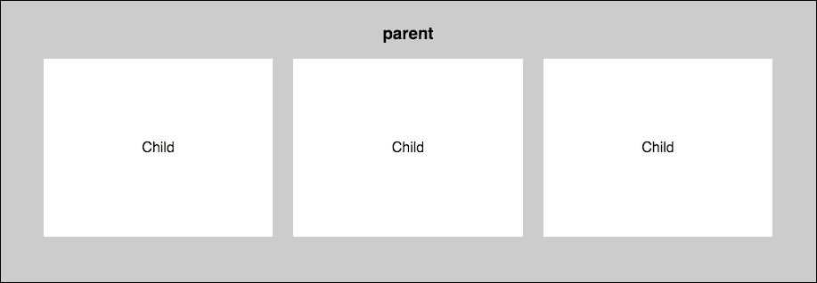

# 第二章：Flexbox 入门

好的，现在我们已经完成了所有 Bootstrap 构建工具的设置，让我们跳入 Bootstrap 4 的一个真正的新特性。框架的最新版本包含了 CSS Flexbox 支持。Flexbox 布局模块的目标是创建一种更有效的设计网站或网页应用布局的方法。盒子网格以这种方式对齐，即使在它们的大小未知的情况下，也会将它们分布在其容器中。这就是 Flexbox 中的“Flex”一词的由来。

弹性盒子的动机源于为移动设备设计的网页。在构建响应式网页应用或网站时，需要一种让某个部分能够根据可用空间增长或收缩以最佳填充空间的方法。Flexbox 与垂直或水平驱动的块布局相反。需要注意的是，Flexbox 通常最适合用于设计网页应用。传统的网格方法对于大型网站仍然是最有效的。

在我们的博客项目中，我们将使用 Flexbox 来创建主页。将有几行块，每行都是一个帖子。我会向你展示几种布局块的方法以及你可以自定义每个块内容的不同方式，所有这些都将使用 Bootstrap 中的新 Flexbox 布局。

# Flexbox 基础知识和术语

在我们走得太远之前，我们应该定义一些 Flexbox 基础知识和我在本章中会使用的术语。每个 Flexbox 布局都依赖于一个外部容器。随着我们进入本章，我会将这个容器称为 **父容器**。在父容器内，将始终有一组盒子或块。我将把这些盒子称为 **子盒子** 或 **子元素**。那么，我们为什么不先谈谈为什么你想使用 Flexbox 呢？Flexbox 的主要目的是允许在父容器内动态调整子盒子的尺寸。

这适用于动态调整宽度和高度属性。许多设计师和开发者更喜欢这种技术，因为它允许用更少的代码实现更简单的布局：



# Flexbox 的排序

Flexbox 是一个非常强大的模块，因为它包含了许多你可以自定义的属性。在我们完全深入使用 Bootstrap 中的 Flexbox 之前，让我们快速回顾一些基础知识。首先，我们来谈谈子盒子的顺序。默认情况下，它们将以你在 HTML 文件中插入它们的顺序出现。考虑以下代码：

```js
<div class="parent"> 
   <div class="child"> 
   1 
   </div> 
   <div class="child"> 
   2 
   </div> 
   <div class="child"> 
   3 
   </div> 
</div> 

```

适当的 CSS 将产生如下布局：


如果你在家跟随，以下是产生此布局的 CSS 代码：

```js
.parent { 
  display: flex; 
  background: #ccc; 
  padding: 10px; 
  font-family: helvetica; 
} 

.child { 
  padding: 10px; 
  margin: 10px; 
  background: #fff; 
  flex-grow: 1; 
  text-align:center; 
  height: 100px; 
  line-height: 100px; 
} 

```

现在我们可以使用`order`属性通过一些 CSS 重新排序子元素。让我们将第三个盒子放在开始位置。如果你正在重新排序一些块，你需要为每个块定义位置；你不能简单地为一个单独的块输入值。将以下 CSS 添加到你的样式表中：

```js
.child:nth-of-type(1) { 
  order: 2; 
} 
.child:nth-of-type(2) { 
  order: 3; 
} 
.child:nth-of-type(3) { 
  order: 1; 
} 

```

我正在使用`nth-of-type`伪选择器来针对每个三个盒子。然后我使用了`order`属性将第三个盒子设置为第一个位置。我还调整了其他两个盒子，将它们移动一个空间。保存文件，你的盒子现在应该看起来像这样：


如你所见，第三个盒子已经移动到了第一个位置。重新排列页面上的块就这么简单。我认为你可能会看到这如何有助于编写一个网络应用程序仪表板。

## 将子部分拉伸以适应父容器

另一个重要的 Flexbox 特性是能够拉伸子盒子的宽度以适应包含父容器的全宽。如果你查看前面的 CSS，你会注意到`.child`类上的`flex-grow`属性。该属性设置为 1，这意味着子盒子将拉伸以均匀填充其父容器。你也可以通过使用`nth-of-type`选择器为其中一个盒子设置不同的值，然后它将比其他盒子更宽。以下是如何创建等宽列的代码，因为你很可能会在大多数情况下这样做：

```js
.child { 
   flex-grow: 1; 
} 

```

## 改变盒子的方向

在 Flexbox 中默认情况下，子盒子将按从左到右的行排列。如果你愿意，你可以使用`flex-direction`属性来改变方向。让我们尝试几种不同的方向。首先，让我们再次回顾我们的基础 HTML 代码：

```js
<div class="parent"> 
   <div class="child"> 
     1 
   </div> 
   <div class="child"> 
     2 
   </div> 
   <div class="child"> 
     3 
   </div> 
</div> 

```

这是我们在稍早之前编写的基 CSS。然而，这次我们将向`.parent`类添加`flex-direction`属性（值为`row-reverse`），这将反转盒子的顺序：

```js
.parent { 
  display: flex; 
  flex-direction: row-reverse; 
  background: #ccc; 
  padding: 10px; 
} 

.child { 
  padding: 10px; 
  margin: 10px; 
  background: #fff; 
  flex-grow: 1; 
  text-align:center; 
  height: 100px; 
  line-height: 100px; 
} 

```

如果你保存文件并在浏览器中查看，它现在应该看起来像这样：


如果我们想要垂直排列这些盒子，使它们按降序堆叠在彼此之上，我们可以通过将`flex-direction`属性更改为`column`来实现：

```js
.parent { 
   ... 
   flex-direction: column; 
} 

```

这种配置将产生一个看起来像这样的网格：


最后，我们还可以尝试另一个方向。让我们做同样的垂直堆叠网格，但这次我们将它反转。我们通过将`flex-direction`属性切换到`column-reverse`来实现这一点：

```js
.parent { 
   ... 
   flex-direction: column-reverse; 
} 

```

这将产生一个看起来像这样的网格：


# 包装你的 Flexbox

默认情况下，所有的子盒子都会尝试适应一行。如果你有一个包含多个盒子的布局，这可能不是你想要的外观。如果是这种情况，你可以使用`flex-wrap`属性根据需要包装子盒子。让我们用以下 HTML 添加更多盒子到我们的原始代码中：

```js
<div class="parent"> 
   <div class="child"> 
   1 
   </div> 
   <div class="child"> 
   2 
   </div> 
   <div class="child"> 
   3 
   </div> 
   <div class="child"> 
   4 
   </div> 
   <div class="child"> 
   5 
   </div> 
   <div class="child"> 
   6 
   </div> 
   <div class="child"> 
   7 
   </div> 
   <div class="child"> 
   8 
   </div> 
   <div class="child"> 
   9 
   </div> 
</div> 

```

现在我们父容器中有九个盒子。这应该足够我们创建一个很好的包裹效果。在我们看到这个效果之前，我们需要添加更多的 CSS。将以下属性添加到你的 CSS 文件中：

```js
.parent { 
   ... 
   flex-wrap: wrap; 
} 

.child { 
   ... 
   min-width: 100px; 
} 

```

我添加了两个新属性来实现我们想要的布局。让我来分解一下发生了什么：

+   我在 `.parent` 类中添加了 `flex-wrap` 属性，并将其值设置为 `wrap`。这将根据需要包裹盒子。

+   在 `.child` 类中，我添加了 `min-width` 为 `100px`。我这样做是为了能够控制子盒子何时会断行。如果我们不添加这个属性，列的宽度可能会变得太窄。

一旦你将那些属性添加到现有代码中，保存文件并测试它。你的布局现在应该看起来像这样：


如你所见，我们现在有一个两行布局，上面有六个盒子，下面有三个。记住我们之前添加了 `flex-grow` 属性，所以第二行正在拉伸或增长以适应。如果你想让你的盒子始终相等，你应该使用偶数，在这种情况下是 12。你也可以移除 `flex-grow` 属性；那么所有盒子都会有相同的宽度，但它们不会以相同的方式填充布局。

## 创建等高列

Flexbox 最好的特性之一是能够轻松创建等高列。在常规的水平布局中，如果你的内容长度不完全相同，每一列的高度都会不同。这对于网页应用布局来说可能是个问题，因为你通常希望你的盒子更加统一。让我们检查一下常规布局的代码，以及它在浏览器中的样子：

```js
<div class="parent"> 
   <div class="child"> 
   Lorem ipsum dolor sit amet, consectetur adipiscing elit, sed do eiusmod tempor incididunt ut labore et dolore magna aliqua. Ut enim ad minim veniam, quis nostrud exercitation ullamco laboris nisi ut aliquip ex ea commodo consequat. 
   </div> 
   <div class="child"> 
   Lorem ipsum dolor sit amet, consectetur adipiscing elit, sed do eiusmod tempor incididunt ut labore et dolore magna aliqua. Ut enim ad minim veniam, quis nostrud exercitation ullamco laboris nisi ut aliquip ex ea commodo consequat. Lorem ipsum dolor sit amet, consectetur adipiscing elit, sed do eiusmod tempor incididunt ut labore et dolore magna aliqua. Ut enim ad minim veniam, quis nostrud exercitation ullamco laboris nisi ut aliquip ex ea commodo consequat. 
   </div> 
   <div class="child"> 
   Lorem ipsum dolor sit amet, consectetur adipiscing elit, sed do eiusmod tempor incididunt ut labore et dolore magna aliqua. Ut enim ad minim veniam, quis nostrud exercitation ullamco laboris nisi ut aliquip ex ea commodo consequat. Lorem ipsum dolor sit amet, consectetur adipiscing elit, sed do eiusmod tempor incididunt ut labore et dolore magna aliqua. Ut enim ad minim veniam, quis nostrud exercitation ullamco laboris nisi ut aliquip ex ea commodo consequat. Lorem ipsum dolor sit amet, consectetur adipiscing elit, sed do eiusmod tempor incididunt ut labore et dolore magna aliqua. Ut enim ad minim veniam, quis nostrud exercitation ullamco laboris nisi ut aliquip ex ea commodo consequat. Lorem ipsum dolor sit amet, consectetur adipiscing elit, sed do eiusmod tempor incididunt ut labore et dolore magna aliqua. Ut enim ad minim veniam, quis nostrud exercitation ullamco laboris nisi ut aliquip ex ea commodo consequat. Lorem ipsum dolor sit amet, consectetur adipiscing elit, sed do eiusmod tempor incididunt ut labore et dolore magna aliqua. Ut enim ad minim veniam, quis nostrud exercitation ullamco laboris nisi ut aliquip ex ea commodo consequat. 
   </div> 
</div> 

```

我创建了三个列，每个列中的文本量不同。让我们给这些列添加一些基本的样式：

```js
.parent { 
  width: 100%; 
  background: #ccc; 
  font-family: helvetica; 
  padding: 5%; 
  float: left; 
} 

.child { 
  padding: 2%; 
  background: white; 
  width: 25%; 
  display: inline-block; 
  float: left; 
} 

```

我为这个常规布局创建了一个类似于 Flexbox 的外观和感觉。让我们看看在浏览器中看起来是什么样子：


这看起来不太好，不是吗？更好的做法是让两个较短的列垂直拉伸以匹配最长列的高度。好消息是这用 Flexbox 来做非常容易。保持 HTML 不变，但让我们去改变我们的 CSS 以使用 Flexbox 方法：

```js
.parent { 
  display: flex; 
  background: #ccc; 
  font-family: helvetica; 
  padding: 5%; 
} 

.child { 
  padding: 2%; 
  background: white; 
  flex-grow: 1; 
  min-width: 200px; 
} 

```

上述代码实际上与第一个例子非常相似。因此，等高列在 Flexbox 中是标准配置。我为每个列添加了 `min-width` 为 `200px`，以便文本可读。有了前面的 CSS，我们的布局现在将看起来像这样：


完美！现在每个列的白色背景已经垂直扩展，以匹配最高子元素的高度。这样看起来更好，如果你添加额外的内容行，将允许更佳的水平对齐。这里发生的事情是，`align-items` 属性默认为 `stretch` 值。这个值就是拉伸列的高度以适应。还有一些其他的对齐值你也可以尝试。为了继续，让我们尝试 `flex-start` 值。向 `.parent` 类添加以下 CSS：

```js
.parent { 
   ... 
   align-items: flex-start; 
} 

```

这种配置实际上会取消等高列，看起来像是一个常规网格。以下是刷新你记忆的图片：


一个更有用的值是 `flex-end` 选项，它将框对齐到浏览器窗口的底部。更改你的 CSS 为：

```js
.parent { 
   ... 
   align-items: flex-end; 
} 

```

这种设置将产生如下网格：


如果你想在布局中垂直居中列，你可以使用 `center` 值：

```js
.parent { 
   ... 
   align-items: center; 
} 

```

如果你选择这种设置，你的网格将看起来像这样：


这只是你可以用来自定义 Flexbox 网格的一些属性的一个例子。正如我之前提到的，我只是想快速介绍如何使用 Flexbox 以及一些必要的术语。让我们利用所学知识，通过在 Bootstrap 中构建 Flexbox 网格来进一步学习。

# 设置 Bootstrap 弹性盒布局网格

无论你是否使用 Flexbox，网格都是基于 Bootstrap 的常规行和列类。如果你熟悉 Bootstrap 网格，这将按预期工作。在你开始任何 Bootstrap 项目之前，你需要决定是否想使用 Flexbox 或常规网格。不幸的是，你无法在 Bootstrap 项目中同时使用两者。由于本章的重点是 Flexbox，我们将使用适当的网格配置。默认情况下，Bootstrap 设置为使用常规网格。因此，我们需要编辑源文件以激活 Flexbox 网格。让我们先从 [`v4-alpha.getbootstrap.com/`](http://v4-alpha.getbootstrap.com/) 重新下载源文件开始。

下载 ZIP 文件后，展开它并重命名，以免混淆。可以将其命名为 `Flexbox Bootstrap`。接下来，我们需要编辑一个文件并重新编译源文件以应用更改。

## 更新 Sass 变量

要使用 Flexbox 网格，我们需要在 `_variables.scss` 文件中编辑一个 Sass 变量。Sass 变量的工作方式是在 `_variables.scss` 文件中设置一个单一值。当你运行内置编译器时，这个值会被写入到 Bootstrap 框架中需要它的每个组件。然后你可以获取编译后的 `bootstrap.min.css` 文件，它将包含你使用 Flexbox 网格所需的所有代码：

1.  在你的新源文件目录中，使用终端，导航到：

    ```js
     $ scss/_variables.scss

    ```

1.  在文本编辑器（如 Sublime Text 2 或记事本）中打开文件，并找到以下代码行：

    ```js
     $enable-flex: false !default;

    ```

1.  将 `false` 值更改为 `true`。代码行现在应该读取：

    ```js
     $enable-flex: true !default;

    ```

1.  保存文件并关闭它。在应用此更改之前，我们需要重新编译源文件。由于我们下载了新的源文件版本，我们需要重新安装项目依赖项。在终端中导航到新 Flexbox 源文件根目录，并运行以下命令：

    ```js
     $ npm install

    ```

1.  这可能需要几分钟，你可以在终端中跟踪进度。一旦完成，我们需要编译项目。为此，我们使用 Grunt。要运行编译器，只需在终端中输入以下命令：

    ```js
     $ grunt

    ```

这可能需要一两分钟，你可以在终端中跟踪进度。一旦完成，源文件将被编译到 `/dist` 目录。如果还不清楚，你将在实际项目中使用的生产文件将被编译到 `/dist` 目录。

在我们开始我们的项目之前，确认一切正常是个好主意。回到你的文本编辑器，并打开源文件根目录中的 `dist/css/bootstrap.css` 文件。

这是编译后的 Bootstrap CSS 框架文件的未压缩版本。一旦打开，快速查找（Mac 上为 *cmd* + *f*，Windows 上为 *Ctrl* + *f*）并搜索 `flex`。如果一切正常，它应该会快速找到文件中的一个 `flex` 实例。这证实了你的编译是成功的。

# 设置 Flexbox 项目

Flexbox 项目结构与常规项目完全相同。你只需确保将 `/css` 目录中的 `bootstrap.min.css` 文件替换为新的 Flexbox 版本。复制我们在上一章中创建的项目，并将其粘贴到你的电脑上的任何位置。将项目重命名为类似 `Flexbox project` 的名称。现在打开该项目，导航到 `/css` 目录。在新的窗口中，打开 Flexbox 源文件目录，并导航到 `/dist/css/` 目录。将 `/dist/css` 中的 `bootstrap.min.css` 文件复制到你的新 `Flexbox project` 的 `/css` 目录中。你将收到覆盖文件的提示，你应该选择 **是**。就这样，你的新 Flexbox 项目就准备好了。

将 Flexbox 源文件保存在你的电脑上的某个位置是个好主意。在未来的项目中，你可以简单地复制编译后的 Flexbox 版本的 Bootstrap CSS，这样每次你想使用 Flexbox 布局时就不必重新编译源文件。

## 添加自定义主题

在我们编写第一个 Flexbox 网格之前，我们需要给我们的项目添加一个自定义 CSS 主题。我们将这样做是为了在 Bootstrap 之上添加任何自定义的外观和感觉样式。在 Bootstrap 中，你永远不想编辑实际的框架 CSS。你应该使用 CSS 的级联功能来插入一个主题，用于额外的自定义 CSS 或覆盖现有的 Bootstrap 样式。在后面的章节中，我会更深入地介绍自定义主题，但现在让我们设置一个基本的主题，我们可以用它来构建我们的 Flexbox 网格。首先，让我们在我们的项目 `/css` 目录中创建一个新文件，命名为 `theme.css`。现在，文件可以是空的；只需确保你创建了它并保存了。

接下来，我们需要更新我们的 `_layout.ejs` 文件，以便在页面中包含主题文件。在文本编辑器中打开 `_layout.ejs`，确保它与以下代码匹配：

```js
<!DOCTYPE html> 
<html lang="en"> 
  <head> 
    <!-- Required meta tags always come first --> 
    <meta charset="utf-8"> 
    <meta name="viewport" content="width=device-width, initial-scale=1, shrink-to-fit=no"> 
    <meta http-equiv="x-ua-compatible" content="ie=edge"> 

    <title><%- pageTitle %> | <%- siteTitle %></title> 

    <!-- Bootstrap CSS --> 
    <link rel="stylesheet" href="css/bootstrap.min.css"> 
    <link rel="stylesheet" href="css/theme.css"> 
  </head> 
  <body> 

    <%- partial("partial/_header") %> 

    <%- yield %> 

    <%- partial("partial/_footer") %> 

    <!-- jQuery first, then Bootstrap JS. --> 
    <script src="img/jquery.min.js"></script> 
    <script src="img/bootstrap.min.js"></script> 
  </body> 
</html> 

```

我在模板中添加了一行代码来加载 `theme.css`：

```js
<link rel="stylesheet" href="css/theme.css"> 

```

### 注意

注意这一行代码在 `bootstrap.min.css` 之后。这很重要，因为我们的主题需要最后加载，这样我们就可以覆盖 Bootstrap 默认样式，如果我们想的话。我们的模板现在是最新的，我们准备好开始我们的第一个网格。请随意保持 `theme.css` 打开，因为我们将在下一步中添加一些样式。

## 创建一个基本的三个列网格

现在我们已经设置了我们的项目，让我们开始做一些 Bootstrap 编码。好消息是，与 Flexbox 网格一起使用的 Bootstrap 列类与常规网格中使用的完全相同。没有必要学习任何新的类名。在你的项目文件夹中，创建一个新文件，并将其命名为 `flexbox.ejs`。

在你继续之前，你需要为这个页面在 `_data.json` 中添加一个实例。否则，你的 `harp compile` 命令将失败。打开 `_data.json` 并添加以下代码：

```js
{ 
   "index": { 
      "pageTitle": "Home" 
   }, 
   "flexbox": { 
      "pageTitle": "Flexbox" 
   } 
} 

```

我为 `flexbox.ejs` 添加了第二个条目，并给它这个页面标题：Flexbox。现在我们可以安全地开始对 `flexbox.ejs` 进行工作，编译将正常进行。让我们从一个简单的三列网格开始。将以下 HTML 代码输入到 `flexbox.ejs` 中：

```js
<div class="container"> 
  <div class="row"> 
    <div class="col-md-4">Lorem ipsum dolor sit amet, consectetur adipiscing elit. Nullam eget ornare lacus. Nulla sed vulputate mauris. Nunc nec urna vel sapien mattis consectetur sit amet eu tellus.</div> 
    <div class="col-md-4">Lorem ipsum dolor sit amet, consectetur adipiscing elit. Nullam eget ornare lacus. Nulla sed vulputate mauris. Nunc nec urna vel sapien mattis consectetur sit amet eu tellus. Suspendisse tempus, justo sed posuere maximus, velit purus dictum lacus, nec vulputate arcu neque et elit. Aliquam viverra vitae est eu suscipit. Donec nec neque eu sapien blandit pretium et quis est.</div> 
    <div class="col-md-4">Lorem ipsum dolor sit amet, consectetur adipiscing elit. Nullam eget ornare lacus. Nulla sed vulputate mauris. Nunc nec urna vel sapien mattis consectetur sit amet eu tellus. Suspendisse tempus, justo sed posuere maximus, velit purus dictum lacus, nec vulputate arcu neque et elit. Aliquam viverra vitae est eu suscipit. Donec nec neque eu sapien blandit pretium et quis est. Sed malesuada sit amet mi eget pulvinar. Mauris posuere ac elit in dapibus. Duis ut nunc at diam volutpat ultrices non sit amet nulla. Aenean non diam tellus.</div> 
  </div> 
</div> 

```

让我分解一下这里发生的事情：

+   就像在先前的例子中一样，我创建了三个相等的列。每个列中都有不同数量的文本。

+   我使用 `col-md-4` 列类，因为我希望三列水平布局适用于中等尺寸的设备及以上。较小的设备将默认为单列宽度布局。

+   我还为每个列 `<div>` 添加了一个 `.child` 类，这样我就可以对它们进行样式化。

现在我们给 `theme.css` 添加一点 CSS，这样我们就可以更容易地看到发生了什么：

```js
.child { 
   background: #ccc; 
   padding: 20px; 
} 

```

下面是 `.child` 类发生的情况：

+   我添加了一个浅灰色背景色，这样我们就可以轻松地看到子框。

+   我添加了一些填充。请注意，你可以在 Flexbox 网格中添加填充而不用担心破坏网格。在常规布局中，这将破坏你的盒模型并给布局添加额外的宽度。

完成后的布局应该看起来像这样：


如您所见，浅灰色背景已经拉伸以适应最高列的高度。几乎不需要努力就能实现等高列真是太棒了！您还会注意到每个列都有一些填充，但我们的布局并没有被破坏。

您可能已经注意到，我使用了常规的`.container`类来包裹整个页面布局。如果我们想让布局扩展到浏览器整个宽度怎么办？

## 创建全宽布局

创建一个没有水平填充的全宽布局实际上非常简单。只需移除容器类。这种布局的 HTML 代码如下所示：

```js
<div class="row"> 
  <div class="col-md-4 child">Lorem ipsum dolor sit amet, consectetur adipiscing elit. Nullam eget ornare lacus. Nulla sed vulputate mauris. Nunc nec urna vel sapien mattis consectetur sit amet eu tellus.</div> 
  <div class="col-md-4 child">Lorem ipsum dolor sit amet, consectetur adipiscing elit. Nullam eget ornare lacus. Nulla sed vulputate mauris. Nunc nec urna vel sapien mattis consectetur sit amet eu tellus. Suspendisse tempus, justo sed posuere maximus, velit purus dictum lacus, nec vulputate arcu neque et elit. Aliquam viverra vitae est eu suscipit. Donec nec neque eu sapien blandit pretium et quis est.</div> 
  <div class="col-md-4 child">Lorem ipsum dolor sit amet, consectetur adipiscing elit. Nullam eget ornare lacus. Nulla sed vulputate mauris. Nunc nec urna vel sapien mattis consectetur sit amet eu tellus. Suspendisse tempus, justo sed posuere maximus, velit purus dictum lacus, nec vulputate arcu neque et elit. Aliquam viverra vitae est eu suscipit. Donec nec neque eu sapien blandit pretium et quis est. Sed malesuada sit amet mi eget pulvinar. Mauris posuere ac elit in dapibus. Duis ut nunc at diam volutpat ultrices non sit amet nulla. Aenean non diam tellus.</div> 
</div> 

```

如您所见，我只是简单地移除了带有`.container`类的`<div>`。让我们看看现在的布局看起来像什么：


现在列已经拉伸到了浏览器的边缘。我们轻松地创建了一个具有等高列的全宽布局。让我们通过将每个列实际变成一篇博客文章并添加更多行来改进这个设计。

# 设计单个博客文章

让我们从设计单个博客文章的布局和内容开始。至少，一篇文章应该有：标题、文章元数据、描述和“阅读更多”链接。打开`flexbox.ejs`文件，将第一列的代码替换为以下新代码：

```js
<div class="col-md-4 child"> 
  <h3><a href="#">Blog Post Title</a></h3> 
  <p><small>Posted by <a href="#">Admin</a> on January 1, 2016</small></p> 
  <p>Lorem ipsum dolor sit amet, consectetur adipiscing elit. Nullam eget ornare lacus. Nulla sed vulputate mauris. Nunc nec urna vel sapien mattis consectetur sit amet eu tellus.</p> 
  <p><a href="#">Read More</a></p> 
</div> 

```

让我分析一下这里发生了什么：

+   我添加了一个带有链接的`<h3>`标签作为文章标题

+   我添加了一些文章元数据，并用`<small>`标签包裹起来，使其不那么显眼

+   我保留了我们的描述并在底部添加了一个“阅读更多”链接

现在请将此代码复制并粘贴到其他两列中。如果您想调整描述文本的长度，请随意。在这个例子中，我将保持不变。完成之后，整个页面的代码应该看起来像这样。注意，我重新添加了容器`<div>`：

```js
<div class="container"> 
  <div class="row"> 
    <div class="col-md-4 child"> 
      <h3><a href="#">Blog Post Title</a></h3> 
      <p><small>Posted by <a href="#">Admin</a> on January 1, 2016</small></p> 
      <p>Lorem ipsum dolor sit amet, consectetur adipiscing elit. Nullam eget ornare lacus. Nulla sed vulputate mauris. Nunc nec urna vel sapien mattis consectetur sit amet eu tellus.</p> 
      <p><a href="#">Read More</a></p> 
    </div> 
    <div class="col-md-4 child"> 
      <h3><a href="#">Blog Post Title</a></h3> 
      <p><small>Posted by <a href="#">Admin</a> on January 1, 2016</small></p> 
      <p>Lorem ipsum dolor sit amet, consectetur adipiscing elit. Nullam eget ornare lacus. Nulla sed vulputate mauris. Nunc nec urna vel sapien mattis consectetur sit amet eu tellus.</p> 
      <p><a href="#">Read More</a></p> 
    </div> 
    <div class="col-md-4 child"> 
      <h3><a href="#">Blog Post Title</a></h3> 
      <p><small>Posted by <a href="#">Admin</a> on January 1, 2016</small></p> 
      <p>Lorem ipsum dolor sit amet, consectetur adipiscing elit. Nullam eget ornare lacus. Nulla sed vulputate mauris. Nunc nec urna vel sapien mattis consectetur sit amet eu tellus.</p> 
      <p><a href="#">Read More</a></p> 
    </div> 
  </div> 
</div> 

```

保存您的文件，如果您已经有一段时间没有编译了，请执行 harp compile。然后运行 harp server 来启动 Web 服务器，并转到`http://localhost:9000`预览页面。它应该看起来像这样：


太好了，现在我们有一个看起来不错的博客主页。然而，我们需要添加更多文章来填充它。让我们继续在同一个行内添加更多的列`<div>`。由于这是 Flexbox，我们不需要为每行文章的每一行都开始一个新的带有行类的`<div>`。让我们添加三个更多的文章，看看它看起来像什么：


完美。现在我们的主页开始成形了。继续添加更多文章，直到您满意的数量。在这个时候，您应该对 Flexbox 网格有相当的了解。

# 摘要

我们首先回顾了 Flexbox 模块的基本功能及其相关术语。接下来，我向你展示了如何通过编辑 Sass 变量和重新编译源文件来在 Bootstrap 中激活 Flexbox 网格。最后，我们通过学习如何使用 Bootstrap Flexbox 网格构建博客主页和源来亲自动手。在下一章中，我们将进一步探讨布局以及如何使用 Bootstrap 设置你的页面。

# 评估

1.  Flexbox 布局模块的目标是什么？

    1.  在构建响应式 Web 应用程序或网站时，当需要缩放以最佳填充可用空间时使用

    1.  为了创建一个更有效的为网站或 Web 应用程序设计布局的方法

    1.  为了创建一个主页

    1.  以上都是

1.  默认情况下，在 Flexbox 中，子盒子将按什么顺序排列？

    1.  从左到右

    1.  从右到左

    1.  从上到下

    1.  对角线

1.  以下代码输出什么？

    1.  将盒子垂直排序，以便它们按降序堆叠在一起

    1.  将盒子垂直排序，以便它们按升序堆叠在一起

    1.  反转盒子的顺序

    1.  将没有输出

1.  以下代码片段的输出有什么区别？

    1.  第一段代码将使盒子对齐到浏览器窗口的底部，第二段代码将使你的列在布局中垂直居中，第三段代码将取消等高列，看起来像是一个常规的网格

    1.  第一段代码将使你的列在布局中垂直居中，第二段代码将盒子对齐到浏览器窗口的底部，第三段代码将取消等高列，看起来像是一个常规的网格

    1.  第一段代码将取消等高列，看起来像是一个常规的网格，第二段代码将盒子对齐到浏览器窗口的底部，第三段代码将使你的列在布局中垂直居中

    1.  以上都不是

1.  在 Bootstrap 项目中，你可以在同一时间同时使用 Flexbox 和常规网格吗？

    1.  是

    1.  不

1.  如何创建没有水平填充的`full-width`布局？

    1.  使用列而不是行

    1.  重命名`.container`类

    1.  移除所有的`<div>`元素

    1.  简单地移除具有`.container`类的`<div>`元素
