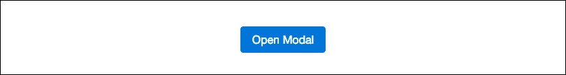
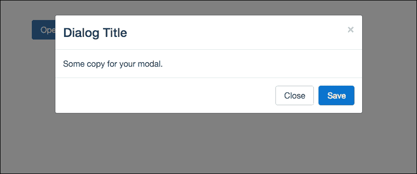
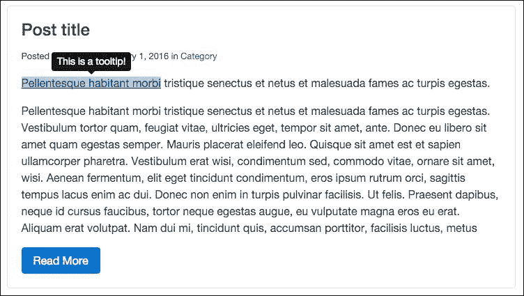
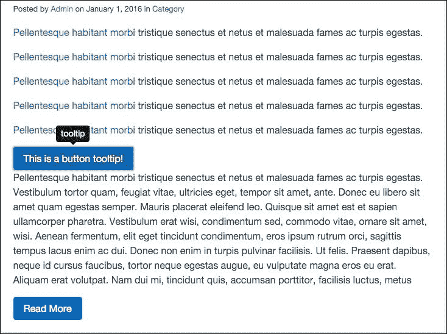
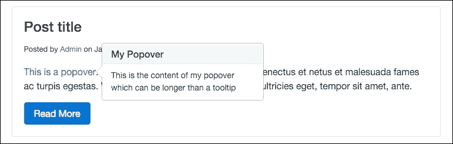
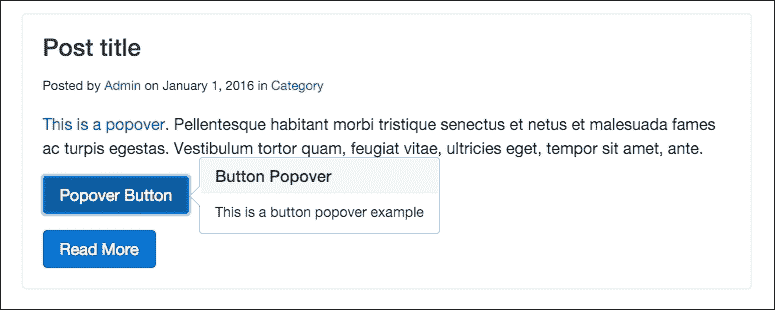
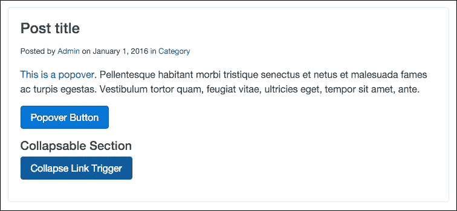
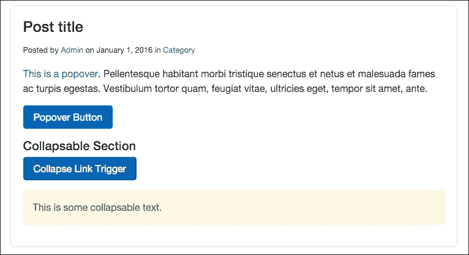
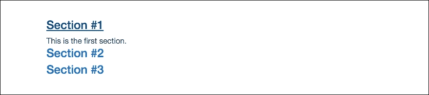
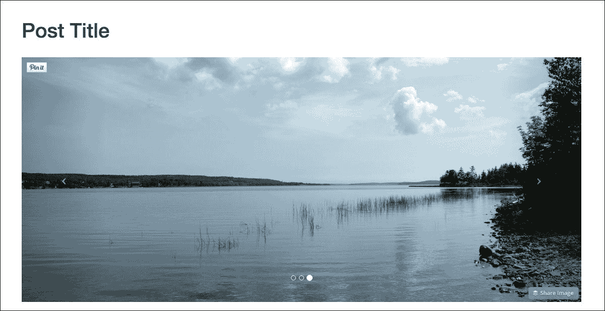

# 第六章. 使用 JavaScript 插件扩展 Bootstrap

在本章中，我们将通过学习如何使用 JavaScript 插件扩展框架来更深入地了解 Bootstrap 组件。您可能还记得，在第一章中，我们在模板中包含了`bootstrap.min.js`。这个文件包含了一些与 Bootstrap 一起提供的 JavaScript 组件。在本章中，我们将介绍如何使用其中的一些组件，包括：模态框、工具提示、弹出框、折叠和轮播。让我们直接学习如何在 Bootstrap 4 中创建一个模态框。

# 编写模态对话框

模态框有多个不同的名称；您可能也知道它们是对话框、弹出窗口、覆盖层或警报。在 Bootstrap 的情况下，这个组件被称为模态框，这也是我在整本书中会使用的称呼。一个模态框由两段必需的代码组成。第一段是按钮，以下是渲染它的基本代码：

```js
<button type="button" class="btn btn-primary" data-toggle="modal" data-target="#firstModal"> 
  Open Modal 
</button> 

```

如您所见，这是一个基本的按钮组件，其中添加了一些属性：

+   第一部分是`data-toggle`数据属性，它需要设置为`modal`。这告诉浏览器这个`<button>`与一个模态框组件相关联。

+   第二个是`data-target`属性，它应该是一个 ID。这实际上并不重要，我将其命名为`#firstModal`。重要的是要注意这个 ID 名称，因为它将在稍后与之关联。同时，请确保 ID 名称是唯一的。

一旦编写好这段代码，它应该看起来像浏览器中的一个普通按钮：



## 编写模态对话框

模态框组件的第二部分是对话框。这是当您点击按钮时在浏览器中弹出的部分。让我们看看创建对话框的一些基本代码：

```js
<div class="modal fade" id="firstModal" tabindex="-1" role="dialog" aria-hidden="true"> 
  <div class="modal-dialog" role="document"> 
    <div class="modal-content"> 
      <div class="modal-header"> 
        <button type="button" class="close" data-dismiss="modal" aria-label="Close"> 
          <span aria-hidden="true">&times;</span> 
        </button> 
        <h4 class="modal-title">Dialog Title</h4> 
      </div> 
      <div class="modal-body"> 
        Some copy for your modal. 
      </div> 
      <div class="modal-footer"> 
        <button type="button" class="btn btn-secondary" data-dismiss="modal">Close</button> 
        <button type="button" class="btn btn-primary">Save</button> 
      </div> 
    </div> 
  </div> 
</div> 

```

这是一段更大的代码，这里有几个需要向您解释的地方：

+   整个对话框都被一个必需的`.modal`类的`<div>`包裹。还有一个可选的`.fade`类，它将对对话框进行淡入。注意这个`<div>`上的 ID，因为它很重要。ID 值需要与按钮上设置的`data-target`属性匹配。这就是我们告诉浏览器将这个按钮与这个对话框关联起来的方式。最后，还有一些 Bootstrap 需要的其他属性，包括`tabindex`、`role`和`aria-hidden`。确保您包含这些属性及其相应的值。

+   在第一个`<div>`内部，我们有一个带有`.modal-dialog`类的第二个`<div>`；确保您包含它。

+   接下来，模态框的内部被分为三个部分：头部、主体和底部。

+   在我们的`.modal-dialog`内部，添加另一个带有`.modal-header`类的`<div>`。在这个部分中，您会注意到另一个按钮。这个按钮是模态框的**关闭**或**X**图标；虽然不是必需的，但包含它是好主意。

+   在按钮之后，你需要包含一个标题标签，在这个例子中是一个带有`.modal-title`CSS 类的`<h4>`。在这里，你应该输入你的模态框标题。

+   下一个部分是另一个用于正文的`<div>`，它有一个`.modal-body`类。在这个部分中，你应该输入你的模态框正文内容。

+   最后，我们有页脚部分，它是一个带有`.modal-footer`类的另一个`<div>`。在这个部分中，你会找到两个需要包含的按钮。第一个是标有**关闭**的白色按钮，点击它将关闭模态框。请注意，`<button>`标签上有一个名为`data-dismiss`的数据属性，其值为`modal`。这将关闭模态框。第二个按钮是一个主要按钮，如果你要连接实际的功能，它将用作保存按钮。

在编写完所有代码后，转到浏览器并点击你的按钮。你应该会看到一个看起来像这样的模态框：



如你所见，我们的模态框已经弹出了按钮上方。你可以阅读模态框的标题和正文，并查看页脚按钮以及右上角的**关闭**或**X**按钮。你可能已经注意到，实际上你不必编写任何 JavaScript 代码就能使这个模态框工作。这就是 Bootstrap 框架的力量；所有的 JavaScript 代码都已经为你准备好了，你只需通过使用 HTML 数据属性来调用模态框功能，这使得事情变得容易得多。这就结束了关于模态框的课程；接下来，让我们继续学习如何使用工具提示。

# 编码工具提示

工具提示（Tooltip）是一个标记，当你在浏览器中悬停在链接上时，它将出现在链接上方。在 Bootstrap 中，通过使用数据属性添加工具提示非常简单，但我们确实需要对其进行一些更新才能使其正常工作。在 Bootstrap 4 中，他们开始使用一个名为 Tether 的第三方 JavaScript 库来实现工具提示。在我们继续之前，请访问下面的 Tether 网站并下载库：

[`github.hubspot.com/tether/`](http://github.hubspot.com/tether/)

下载库后，解压它并打开主目录，在那里你会看到许多文件。导航到`/dist/js`目录，并找到名为`tether.min.js`的文件：

现在将`tether.min.js`复制到我们的博客项目的`/js`目录中。这是你从 Tether 目录中需要的唯一文件，因此你可以保留其余的文件或删除它们。一旦文件在我们的项目目录中，我们需要更新我们的模板。

## 更新项目布局

现在我们已经将 Tether 文件放入我们的项目目录中，我们需要更新我们的`_layout.ejs`模板，以便在页面编译时包含它。从我们的项目目录的根目录，打开`_layout.ejs`并在 jQuery 附近插入以下代码行。确保 Tether 文件在 jQuery 之后、`bootstrap.min.js`之前加载：

```js
<script src="img/tether.min.js"></script> 

```

保存文件并确保你重新编译你的项目，以便将此导入到所有 HTML 文件中。完成此操作后，你现在将能够在包含在我们的项目中的任何页面上使用 Tooltips。

## 如何使用 Tooltips

现在我们已经包含了 Tether 库，我们可以学习如何在 Bootstrap 中实际使用 Tooltips。让我们在我们的项目文件之一上尝试它们。在你的文本编辑器中打开 `index.ejs` 并找到一段纯文本代码，如下所示：

```js
<p>Pellentesque habitant morbi tristique senectus et netus et malesuada fames ac turpis egestas...</p> 

```

一旦找到这段代码，让我们用以下属性将 `<a>` 标签包裹在前面三个词周围：

```js
<p><a href="#" data-toggle="tooltip" >Pellentesque habitant morbi</a> tristique senectus et netus et malesuada fames ac turpis egestas.</p> 

```

这是渲染 Tooltips 所需的基本标记。让我们分析一下这里发生了什么：

+   `data-toggle` 属性是必需的，用于告诉浏览器这是一个 Tooltips。其值应设置为 `tooltip`。

+   `title` 属性也是必需的，其值将是 Tooltips 中显示的文本。在这种情况下，我将其设置为 `This is a tooltip!`。

在我们可以在浏览器中测试之前，我们需要在我们的 `_layout.ejs` 模板中添加一些其他内容。在你的文本编辑器中打开该文件，并在 Tether 库之后插入以下代码：

```js
<script src="img/bootstrap.min.js"></script> 
<script> 
  $("a").tooltip(); 
</script> 

```

在 Bootstrap 4 中，在使用 Tooltips 之前需要先对其进行初始化。因此，我在这里使用了一点点 jQuery 来说明所有 `a` 标签都应该初始化以使用 Tooltips 方法，这将激活所有链接标签以便与 Tooltips 一起使用。这是一个你可以使用的技巧，这样你就不必为每个想要初始化的 Tooltips 使用 ID 来标识了。完成这一步后，保存所有文件，重新编译它们，然后在浏览器中查看你的项目；当你悬停在链接锚文本上时，它应该看起来像这样：



## 如何定位 Tooltips

默认情况下，在 Bootstrap 中，ToolTips 的位置在锚文本上方。但是，使用 `data-placement` 属性将允许你将提示放置在锚文本的上方、下方、左侧或右侧。让我们看看渲染不同版本所需的代码：

```js
<p><a href="#" data-toggle="tooltip"  data-placement="top">Pellentesque habitant morbi</a> tristique senectus et netus et malesuada fames ac turpis egestas.</p> 
<p><a href="#" data-toggle="tooltip"  data-placement="bottom">Pellentesque habitant morbi</a> tristique senectus et netus et malesuada fames ac turpis egestas.</p> 
<p><a href="#" data-toggle="tooltip"  data-placement="right">Pellentesque habitant morbi</a> tristique senectus et netus et malesuada fames ac turpis egestas.</p> 
<p><a href="#" data-toggle="tooltip"  data-placement="left">Pellentesque habitant morbi</a> tristique senectus et netus et malesuada fames ac turpis egestas.</p> 

```

如你所见，我已经将 `data-placement` 属性添加到每个链接标签中。以下值将控制当你悬停时 Tooltips 的位置：

+   顶部：`data-placement="top"`

+   底部：`data-placement="bottom"`

+   右侧：`data-placement="right"`

+   左侧：`data-placement="left"`

## 将 Tooltips 添加到按钮上

通过使用与链接相同的数据属性，也很容易将 Tooltips 添加到按钮上。让我们看看如何编写一个带有上方 Tooltips 的简单按钮代码：

```js
<button type="button" class="btn btn-primary" data-toggle="tooltip" data-placement="top" data-original->This is a button tooltip!</button> 

```

这里你会看到一个基本的按钮组件，但它带有 Tooltips 数据属性：

+   我添加了 `data-toggle` 属性，其值为 `tooltip`

+   你可以可选地包含 `data-placement` 属性；如果你省略它，它将默认为顶部

+   你需要包含 `data-original-title` 属性，其值将是 Tooltips 消息

## 更新按钮布局

要使按钮上的工具提示工作，你需要以与上一节中链接相同的方式初始化它们。再次在文本编辑器中打开 `_layout.ejs` 并包含以下代码行。现在整个 JavaScript 部分应该看起来像这样：

```js
<script> 
  $("a").tooltip(); 
  $("button").tooltip(); 
</script> 

```

就像我们对链接标签所做的那样，我们将初始化所有按钮标签以使用工具提示组件，如果它们在 HTML 模板中被调用。让我们看看当它正确完成时，按钮上的工具提示在浏览器中应该看起来什么样：



# 避免与我们的组件发生冲突

到目前为止，我们只使用了工具提示 JavaScript 组件，所以我们的代码是稳定的。然而，在下一节中，我们将介绍一个名为弹出框（Popovers）的不同组件。我们需要清理我们的 JavaScript 代码，以确保这两个组件不会相互冲突并产生不期望的结果。

由于这种情况，我们应该回到 `_layout.ejs` 并通过为项目中要使用的每个工具提示提供特定的 ID 来编辑代码。我们的脚本现在应该看起来像这样：

```js
<script> 
  $("#tooltip-link").tooltip(); 
  $("#tooltip-button").tooltip(); 
</script> 

```

### 注意

注意，我已经移除了 `a` 和 `button` 选择器，并用名为 `#tooltip-link` 和 `#tooltip-button` 的 ID 替换了它们。现在我们也需要更新索引模板上的链接和按钮代码，以包含这些 ID。

```js
<p><a id="tooltip-link" data-toggle="tooltip" >Pellentesque habitant morbi</a> tristique senectus et netus et malesuada fames ac turpis egestas.</p> 

<button type="button" id="tooltip-button" class="btn btn-primary" data-toggle="tooltip" data-placement="top" data-original->This is a button tooltip!</button> 

```

正如你所见，我在前面的代码中为每个元素都包含了 ID。现在我们可以放心地引入新的组件，无需担心 JavaScript 中会发生冲突。让我们继续讨论下一个组件；弹出框（Popovers）。

# 使用弹出框组件

弹出框组件与工具提示（Tooltips）类似，但允许包含更多内容。弹出框也是通过点击动作来显示的，而不是像工具提示那样通过悬停动作。让我们看看渲染弹出框的基本代码。首先，让我们确保将这个弹出框添加到我们的项目中，所以再次打开 `index.ejs` 并找到另一行填充代码来添加这个新组件。当你这样做时，将以下代码输入到模板中：

```js
<p><a id="popover-link" data-toggle="popover"  data-content="This is the content of my popover which can be longer than a tooltip">This is a popover</a>. Pellentesque habitant morbi tristique senectus et netus et malesuada fames ac turpis egestas. Vestibulum tortor quam, feugiat vitae, ultricies eget, tempor sit amet, ante.</p> 

```

正如你所见，这里有一些新内容需要我们讨论：

+   首先，你会注意到我给链接标签分配了这个 ID； `popover-link`。

+   在这种情况下，`data-toggle` 被设置为 `popover`。

+   `title` 属性是必需的，它将是你的弹出框的标题。

+   最后，我们有一个新的属性名为 `data-content`。这个属性的值应该是你希望在弹出框上显示的文本。

## 更新 JavaScript

就像我们对工具提示所做的那样，我们还需要更新这个新组件的 JavaScript。再次打开 `_layout.ejs` 并在工具提示 JavaScript 之后插入以下代码行：

```js
$("#popover-link").popover(); 

```

这段代码将在具有 `#popover-link` ID 的元素上初始化一个弹出框组件。一旦完成，保存两个文件，然后转到你的浏览器。找到你为弹出框创建的链接并点击它。这是你在浏览器中应该看到的：



如您所见，Popover 组件比 Tooltip 更丰富。它包括标题和内容。如果您需要提供比常规 Tooltip 更多的上下文，应使用此组件。

## 定位 Popover 组件

再次，像 Tooltips 一样，可以控制 Popover 组件的位置。这是通过在链接标签上使用 `data-placement` 属性以相同的方式完成的。以下是每个变体的代码：

```js
<p><a id="popover-link" data-placement="top" data-toggle="popover"  data-content="This is the content of my popover which can be longer than a tooltip">This is a popover</a>. Pellentesque habitant morbi...</p> 

<p><a id="popover-link" data-placement="bottom" data-toggle="popover"  data-content="This is the content of my popover which can be longer than a tooltip">This is a popover</a>. Pellentesque habitant morbi...</p> 

<p><a id="popover-link" data-placement="right" data-toggle="popover"  data-content="This is the content of my popover which can be longer than a tooltip">This is a popover</a>. Pellentesque habitant morbi...</p> 

<p><a id="popover-link" data-placement="left" data-toggle="popover"  data-content="This is the content of my popover which can be longer than a tooltip">This is a popover</a>. Pellentesque habitant morbi...</p> 

```

由于这与 Tooltips 的工作方式完全相同，我不会进一步分解。只需包含 `data-placement` 属性，并给它一个四个定位值之一，以控制点击时 Popover 出现的位置。

# 将 Popover 添加到按钮

Popover 组件也可以轻松地添加到按钮中。再次打开 index 模板，并插入以下按钮代码：

```js
<p><button type="button" id="popover-button" class="btn btn-primary" data-toggle="popover"  data-content="This is a button popover example">Popover Button</button></p> 

```

如您所见，这个标记与 Tooltip 按钮非常相似。让我们再次分解：

+   按钮标签需要添加一个 ID 为 `popover-button`

+   与链接一样，将 `data-toggle` 属性设置为 `popover`

+   包含 `title` 和 `data-content` 属性的值

与前面的示例一样，别忘了更新 JavaScript！

## 在 JavaScript 中添加我们的 Popover 按钮

我们最后需要做的是更新 JavaScript 以初始化我们新的 Popover 按钮。打开 `_layout.ejs` 并在 Popover 链接 JavaScript 之后插入以下代码行：

```js
$("#popover-button").popover(); 

```

完成这些后，保存两个文件，并在浏览器中打开 index 页面。定位您插入的按钮并点击它。您的 Popover 应该看起来像这样：



如您所见，您现在有一个按钮，上面附加了 Popover 组件。这可以用于通过按钮突出显示某些重要内容，一旦点击，就会向用户显示一条消息。我还有一些 JavaScript 组件想和您一起回顾；下一个是 Collapse 组件。

# 使用 Collapse 组件

我觉得 Collapse 组件的名称有点令人困惑。它实际上意味着一个可折叠的部分，可以通过点击操作显示或隐藏。让我们首先在 `index.ejs` 模板上创建一个简单的可折叠文本部分。打开该模板，并将以下代码插入您喜欢的任何位置：

```js
<p><a class="btn btn-primary" data-toggle="collapse" href="#collapse-link" aria-expanded="false">Collapse Link Trigger</a></p> 

```

Collapse 组件分为两部分。第一部分是显示或隐藏可折叠内容的触发器。第二部分是您想要显示或隐藏的实际内容。让我们更详细地回顾一下，以展示如何编写代码：

+   第一部分是可折叠内容的触发器，我选择使用带有一些按钮类的链接

+   链接需要带有值为 `collapse` 的 `data-toggle` 属性

+   链接的 `href` 需要一个唯一的 ID 名称，在这种情况下，`#collapse-link`

+   最后，我们将 `aria-expanded` 的值设置为 `false`，因为我们希望在页面加载时隐藏可折叠内容

页面加载时，你的新组件应该就像一个普通的按钮一样出现：



## 编写可折叠内容容器

现在 Collapse 的触发器已经设置好了，我们需要编写内容容器。在链接标签之后，插入以下代码：

```js
<div class="collapse" id="collapse-link"> 
  <p class="alert alert-warning">This is some collapsable text.</p> 
</div> 

```

这是如何组装这段代码的：

+   我们从一个需要具有`collapse`CSS 类的`<div>`开始。你还需要在这里包含一个 ID。这个 ID 应该与你在触发链接中设置的`href`相匹配；在这个例子中，是`#collapse-link`。

+   在`<div>`内部，你可以包含任何你想要的内容。这些内容将是隐藏的可折叠内容，当点击触发器时，你可以显示或隐藏这些内容。为了使示例更加明显，我在一些文本周围包裹了一个警告 Alert，使其突出。

在你编写完代码并保存文件后，前往浏览器，找到按钮，然后点击它。一旦你点击触发链接，你应该在你的窗口中看到以下内容：



这只是一个简单的例子，说明了如何编写 Collapse 组件的代码。通过使用额外的代码和设置，你可以使用这个组件来创建可折叠面板。

# 使用 Collapse 组件编写可折叠面板

在上一节中，我教了你一个相当简单的方法来使用 Collapse 组件。同一个组件也可以用来创建一个更复杂的版本，即可折叠面板。让我们看看创建可折叠面板的基本代码：

```js
<div id="accordion"> 
  <div class="panel panel-default"> 
    <div class="panel-heading" role="tab" id="headerOne"> 
      <h4 class="panel-title"> 
        <a data-toggle="collapse" data-parent="#accordion" href="#sectionOne" aria-expanded="true" aria-controls="sectionOne"> 
          Section #1 
        </a> 
      </h4> 
    </div> 
    <div id="sectionOne" class="panel-collapse collapse in" role="tabpanel" aria-labelledby="headerOne"> 
      This is the first section. 
    </div> 
  </div> 
  <div class="panel panel-default"> 
    <div class="panel-heading" role="tab" id="headerTwo"> 
      <h4 class="panel-title"> 
        <a class="collapsed" data-toggle="collapse" data-parent="#accordion" href="#sectionTwo" aria-expanded="false" aria-controls="sectionTwo"> 
          Section #2 
        </a> 
      </h4> 
    </div> 
    <div id="sectionTwo" class="panel-collapse collapse" role="tabpanel" aria-labelledby="headerTwo"> 
      This is the second section. 
    </div> 
  </div> 
  <div class="panel panel-default"> 
    <div class="panel-heading" role="tab" id="headerThree"> 
      <h4 class="panel-title"> 
        <a class="collapsed" data-toggle="collapse" data-parent="#accordion" href="#sectionThree" aria-expanded="false" aria-controls="sectionThree"> 
          Section #3 
        </a> 
      </h4> 
    </div> 
    <div id="sectionThree" class="panel-collapse collapse" role="tabpanel" aria-labelledby="sectionThree"> 
     This is the third section. 
    </div> 
  </div> 
</div> 

```

现在这看起来可能像很多代码，但实际上这是一个重复的模式，一旦你理解了它，就很容易组合起来。让我来分解这里发生的一切：

+   整个组件被一个带有 ID 的`<div>`包裹。在这个例子中，我使用的是`#accordion`。

+   可折叠面板的每个部分都是一个带有`.panel`类的`<div>`。我还包括了`.panel-default`类，以进行最基本的样式设置。

+   每个面板由一个标题和一个主体或部分组成。让我们先谈谈标题。创建另一个带有`.panel-heading`类的`<div>`。还要包括一个值为`tab`的`role`属性，并且你需要给你的标题一个唯一的 ID，在这个例子中，是`#headerOne`。

+   在标题内部包含一个标题标签，在这个例子中，是一个带有`.panel-title`类的`<h4>`。

+   最后，在标题标签内部，编写一个具有几个你需要包含的属性的链接：

    +   `.collapsed`对于可折叠组件是必需的。

    +   `data-toggle`也是必需的。

    +   `data-parent`应该是你为第一个`<div>`设置的相同 ID。

    +   `href`将是链接到可折叠部分的主体。在这个例子中，它被称为`sectionOne`。

    +   `aria-expanded`应该设置为`true`，因为我们希望这个部分在页面加载时是打开的。其他链接应该设置为`false`，除非你希望它们在页面加载时打开。

    +   `aria-controls`也应该与相应部分的 ID 名称匹配。

    +   现在标题已经分解，让我们来谈谈面板的主体。

+   在标题之后，插入另一个带有 `#sectionOne` ID 的 `<div>`。它也应该有 `.panel-collapse` 和 `.collapse` 类，并包含一个 `role` 属性，其值为 `tabpanel`。最后，包含 `aria-labelledby` 属性，其值为 `sectionOne`。

+   在这个 `<div>` 内部包含你想要显示的章节内容。

对于接下来的部分，你需要重复你在第一个面板中做的事情。只需复制粘贴，然后你需要更改一些内容：

+   将 `headerOne` 改为 `headerTwo`

+   将 `sectionOne` 改为 `sectionTwo`

+   更改第二个部分的标题和正文内容

对第三个部分做同样的处理，然后 Accordion 组件就完成了。一旦完成，浏览器中的样子应该是这样的：



这就完成了 Collapse 和 Accordion 组件。我们还有一个组件要完成，那就是 Carousel 组件。

# 编写 Bootstrap Carousel

Carousel 是在许多不同类型的网站上广泛使用的流行组件。我们将在项目的博客文章模板中构建一个 Carousel。让我们首先在文本编辑器中打开项目目录中的 `blog-post.ejs` 文件。在页面标题代码块之后，插入以下标记：

```js
<div id="carousel-example-generic" class="carousel slide" data-ride="carousel"> 
  <ol class="carousel-indicators"> 
    <li data-target="#carousel-example-generic" data-slide-to="0" class="active"></li> 
    <li data-target="#carousel-example-generic" data-slide-to="1"></li> 
    <li data-target="#carousel-example-generic" data-slide-to="2"></li> 
  </ol> 
  <div class="carousel-inner" role="listbox"> 
    <div class="carousel-item active"> 
       
    </div> 
    <div class="carousel-item"> 
       
    </div> 
    <div class="carousel-item"> 
       
    </div> 
  </div> 
  <a class="left carousel-control" href="#carousel-example-generic" role="button" data-slide="prev"> 
    <span class="icon-prev" aria-hidden="true"></span> 
    <span class="sr-only">Previous</span> 
  </a> 
  <a class="right carousel-control" href="#carousel-example-generic" role="button" data-slide="next"> 
    <span class="icon-next" aria-hidden="true"></span> 
    <span class="sr-only">Next</span> 
  </a> 
</div> 

```

这是一个像 Accordion 一样的大组件，让我们逐节分析：

Carousel 组件从一个 `<div>` 开始，需要一个唯一的 ID。在这种情况下，`#carouselOne`。还包括以下类：`.carousel` 和 `.slide`。最后，你需要添加一个 `data-ride` 属性，其值为 `carousel`。

## 添加 Carousel 子弹导航

我们需要添加到 Carousel 中的第一件事是子弹或指示导航。它由一个有序列表组成。以下是代码，然后我们将对其进行分解：

```js
<ol class="carousel-indicators"> 
  <li data-target="#carouselOne" data-slide-to="0" class="active"></li> 
  <li data-target="#carouselOne" data-slide-to="1"></li> 
  <li data-target="#carouselOne" data-slide-to="2"></li> 
</ol> 

```

Carousel 导航的工作方式如下：

+   在 `<ol>` 标签上分配一个 `.carousel-indicators` 类。

+   列表中的每个 `<li>` 都需要一些东西：

    +   `data-target` 需要与你为根 Carousel `<div>` 给出的相同 ID，在这种情况下，`#carouselOne`。

    +   包含 `data-slide-to` 属性，第一个值应该是 0。对于第一个列表项之后的每个列表项，增加 1。

## 包含 Carousel 幻灯片

下一步是包含实际的 Carousel 幻灯片。我不会在代码中包含图片，这将由你插入，但不用担心，我会告诉你在哪里放置它们。以下是包装幻灯片的代码段：

```js
<div class="carousel-inner" role="listbox"> 
  .. 
</div> 

```

给 `<div>` 添加一个 `.carousel-inner` 类，并添加一个 `role` 属性，其值为 `listbox`。在这个 `<div>` 内部，你将为 Carousel 中的每个图像幻灯片添加另一个部分。以下是 Carousel 中一个幻灯片的代码：

```js
<div class="carousel-item active"> 
   
</div> 

```

让我们分析一下代码中发生的事情：

+   在这种情况下，插入一个具有 `.carousel-item` 和 `.active` 类的 `<div>` 标签。

### 注意

注意你只应该在第一张幻灯片上包含 `.active` 类。这是轮播图在页面加载时开始的地方。

+   在 `<div>` 内插入一个具有以下属性的 `img` 标签：

    +   插入 `src` 属性，其值应该是幻灯片图像文件的路径

    +   可选地，为图像包含一个带有值的 `alt` 属性

## 添加轮播图箭头导航

我们需要添加到轮播图中的最后一件事是箭头导航。以下是渲染箭头的代码：

```js
<a class="left carousel-control" href="#carouselOne" role="button" data-slide="prev"> 
  <span class="icon-prev" aria-hidden="true"></span> 
  <span class="sr-only">Previous</span> 
</a> 
<a class="right carousel-control" href="#carouselOne" role="button" data-slide="next"> 
  <span class="icon-next" aria-hidden="true"></span> 
  <span class="sr-only">Next</span> 
</a> 

```

让我解释箭头导航是如何工作的：

+   左右箭头导航基于 `href` 标签。

+   第一项将是左箭头；编写一个带有以下类的链接：`.left` 和 `.carousel-control`。

+   链接的 `href` 应该设置为轮播图的主要 ID，在这种情况下，`#carouselOne`。

+   将 `role` 属性设置为 `button`。

+   最后，将 `data-slide` 属性设置为 `prev`。

+   在链接内，添加一个带有 `.icon-prev` 类的 `<span>`。这将渲染箭头图标。包含 `aria-hidden` 属性并将其设置为 `true`。

+   最后，你可以包含另一个可选的 `<span>` 以便进行无障碍访问。如果你想包含它，给它一个 `.sr-only` 类。在 `<span>` 中包含文本 `Previous`。

+   现在我们来了解一下右箭头的区别：

    +   编写另一个链接标签，并将 `.left` 类更改为 `.right`。

    +   将 `data-slide` 属性值更改为 `next`。

    +   在第一个 `<span>` 标签中，将类值更改为 `.icon-next`。

    +   如果你包含了无障碍 `<span>` 标签，将文本更改为 `Next`。

这样就完成了轮播组件的设置。启动项目服务器，并在浏览器中查看博客文章页面，它应该看起来像这样：



这样就结束了 Bootstrap 中 JavaScript 组件的章节。在本章中，我教了你如何编写以下组件的代码：模态框、工具提示、弹出框、折叠、手风琴和轮播图。在下一章中，我将教你如何在 Bootstrap 中使用 **Sass**。

# 摘要

在本章中，我们涵盖了所有依赖于 JavaScript 的 Bootstrap 组件。这包括：模态框、工具提示、弹出框、折叠和轮播图。

在下一章中，我们将看到在 Bootstrap 4 中，框架如何从 Less 转变为 Sass 作为其 CSS 预处理器。我们将介绍在 Bootstrap 主题中使用 Sass 的基础知识。我还会解释如何自定义或使用现有的变量，或者编写你自己的。

# 评估

1.  以下哪个也可以称为模态框？

    1.  对话框

    1.  弹出窗口

    1.  遮罩

    1.  所有这些

1.  以下哪个数据属性需要设置为模态框？

    1.  `data-target`

    1.  `data-toggle`

    1.  `data-type`

    1.  `data-value`

1.  以下哪个值被分配给按钮的 `data-target` 属性以显示模态框？

    1.  模态框 ID

    1.  模态框类型

    1.  模态框类

    1.  模态框名称

1.  以下哪个是模态框的必需类？

    1.  `.modal-header`

    1.  `.modal-footer`

    1.  `.modal-body`

    1.  `.modal`

1.  以下哪个数据属性用于定位工具提示？

    1.  `data-target`

    1.  `data-placement`

    1.  `data-value`

    1.  `data-toggle`
